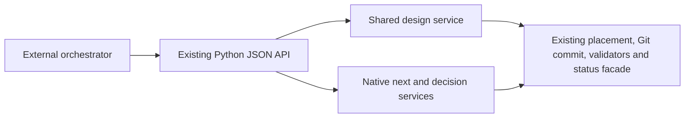

# Governed planning application seam and status integration

Status: Proposed for this PR. Date: 2026-10-07.

The existing external API creates specification and plan scaffolds and finalizes work packages, but its clients still need to materialize and commit the intervening artifacts. Gokitty3's amended Orchestrator 2 contract explicitly covers that missing design lifecycle. Mainline also has Stijn's concern-module decomposition and an accepted plan for status-read convergence; this delivery must extend those authorities.

Use a shared `specify_cli.design` application seam for bounded authored content, registered artifact placement, optimistic content revisions, accepted parent provenance and host commit outcomes. The API concern modules project that service, existing decision services, and the native `next` operation. Submissions never invent phase state. Native validators/finalization own requirements, dependency graphs, ownership, status bootstrap and planning pins; native `next` owns action issuance and completion. Canonical interview questions are shared with the host CLI.

The existing drift-aware task-finalization predicate moves from the transport into the status public facade and is reused by both design status and authoring guards. A truncated event log that disagrees with a finalized snapshot must refuse; a second reducer would lose that proof. Question constants likewise move into the existing Mission planning application package, with the CLI re-exporting the same objects.

The Python transport remains a compatible extension of its existing versioned envelope. Its delivery profile maps the proposed `spec-kitty.orchestrator/2` semantics to implemented commands. It explicitly excludes GapDB atomic journal transactions, runtime epochs/fences/leases, immutable Go WorkRevision generations, durable operation replay, native asynchronous operations, watches, remote serving and tracker publication.

Artifact revision means SHA-256 of the exact UTF-8 content or `absent`. A submitted plan names its current specification parent; work packages name their specification/plan/outline parents. Host-owned receipts persist the accepted lineage and context digests so a newly supplied current parent hash cannot conceal stale downstream content. Once native packages are finalized, all design edits through this surface refuse. Native reconciliation remains a separate authority.

The submission lock serializes cooperative API writers only. Existing CLI/manual writers can be detected by changed content, but do not join a universal atomic journal. Files and Git commit effects precede host-local receipt persistence; failures report materialized/committed or reconciliation-required outcomes honestly. Receipts live in the Git common directory, are shared across linked worktrees, and are not portable to another clone. Missing/corrupt receipts refuse while the separate persistent enabled marker remains present. Both files are trusted host metadata; deleting both or moving to another clone does not preserve this provenance history.

## Status API reconciliation

Stijn requested review of Jeroen's unfinished status interface in [spec-kitty-mission-ui](https://github.com/spec-kitty/spec-kitty-mission-ui). That repository is a Lit/TypeScript no-I/O screen library: hosts own fetch, routing and refresh. Its main tree pins status contract 1.0.0 at `9f41e48`; [PR #8](https://github.com/spec-kitty/spec-kitty-mission-ui/pull/8) proposes the WP-detail screen and newer contract pin `b61d1fa`.

The [accepted Java service architecture](https://github.com/spec-kitty/spec-kitty/blob/main/docs/adr/4.x/2026-10-01-2-mission-status-read-api-and-dashboard-extraction.md) uses a separate Java/Spring Boot REST/SSE module. No implemented Java service was found in the inspected current mainline or UI repository. Unpublished work may exist.

Go already implements an in-process [`ProgressService`](https://github.com/spec-kitty/spec-kitty-redesign/blob/a6142761bf0b050bb128c44bd937035435474661/internal/productionruntime/progress.go) with Mission/List/Get/Watch and revisioned immutable projections. Reuse its bounded-query, authority-versus-observation, typed-refusal and freshness distinctions. Do not equate its database/projection revision cursors with the UI's physical JSONL offset/hash cursor. Current Go watch supplies bounded live updates and resnapshot behavior, rather than the full proposed API 2 historical watch/replay guarantee.

The integration point is the existing planned status read port. [#5532](https://github.com/spec-kitty/spec-kitty/issues/5532) keeps CLI reads in native Python and reserves switching to Java for a later decision. [#5631](https://github.com/spec-kitty/spec-kitty/issues/5631) requires its native adapter to resolve topology through MissionExecutionContext. Orchestrator readers and UI projections should consume that port; Java/HTTP/SSE belongs behind an optional adapter with shared contract conformance fixtures. This PR retains the existing native readers and introduces no competing reducer or Java dependency.

The current [MissionDetail display schema](https://github.com/spec-kitty/spec-kitty/blob/main/contracts/mission-status/schemas/MissionDetail.yaml) treats artifact presence as phase completion; [MissionHead nextAction](https://github.com/spec-kitty/spec-kitty/blob/main/contracts/mission-status/schemas/MissionHead.yaml) is provisional English prose. Those are display projections. Orchestrator completion requires substantive, committed, current content, resolved decisions and canonical gates. Their versioned mapping must retain this distinction. [#5776](https://github.com/spec-kitty/spec-kitty/issues/5776) tracks unfinished drift, Ops and project-health additions.

## Consequences and proof

An external client can discover context, record interviews, create and read authored artifacts, finalize packages and drive native action completion using only the API. The black-box fixture initializes the project before the first call; it never writes mission artifacts or commits Git afterward. Both single-branch and coordination topologies are exercised. Refusal tests pair valid requests with stale parent/target/context, pending or terminal-unresolved interviews, placeholders, invalid graphs/requirements, forbidden paths and finalized edits. Existing external verbs remain compatible.

Status contract integration is prepared and documented. The unfinished Java service and the broader #5532/#5631 port convergence remain separate tracked work; this PR does not claim to complete them.

Completion validation reads the native persisted `issued_step_id` through the query service’s read-only context/index/snapshot seam. A pending input may name the upcoming design stage before its prompt is issued; answering that input is issuance, and cannot require completed stage artifacts. Missing live cursors fail closed.
