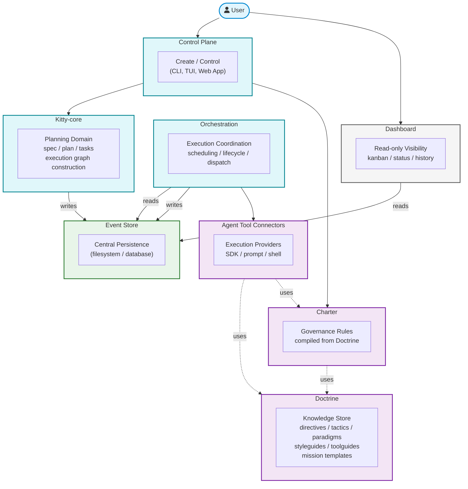

# System Landscape (living)

| Field | Value |
|---|---|
| Status | Living (derived view; the enforced pair wins on conflict) |
| Date | 2026-03-04 (package layout refreshed 2026-09-06) |
| Scope | C4 Level 0 — system landscape and domain container boundaries |
| Related ADRs | `2026-02-09-1..4`, `2026-02-17-1..3`, `2026-02-23-1..3`, `2026-02-27-1..3` |

## Purpose

Establish the top-level framing for Spec Kitty: the domain
containers, their allowed interaction directions, and the interface contracts
between them. This is the north star that all lower-level C4 views (context,
container, component) must align to.

## Design Philosophy

Every container boundary in this view represents a **domain module with an
interface contract**. The current codebase provides the first concrete
implementation of each contract, but the design is deliberately
implementation-agnostic:

| Container (concept) | Current implementation | Could also be |
|---|---|---|
| Control Plane | CLI (`spec-kitty` commands) | TUI, web app, IDE plugin |
| Dashboard | None in the CLI: the bundled `spec-kitty dashboard` was removed (#5530). Interim read path: `spec-kitty agent tasks status` / `orchestrator-api mission-state`. The planned Mission Status Read API (#5528) is the read contract a replacement consumes ([ADR 2026-10-01-2](../../adr/4.x/2026-10-01-2-mission-status-read-api-and-dashboard-extraction.md)) | External UI in its own repository, SaaS web view, IDE panel |
| Kitty-core | Python modules (specify, plan, tasks) | Same — domain logic |
| Event Store | Filesystem (JSONL, frontmatter, meta.json) | Database, cloud event store |
| Orchestration | Python modules (lifecycle engine, status) | Same — domain logic |
| Agent Tool Connectors | In-tool (`spec-kitty implement`) | Async shell, SDK, remote API |
| Doctrine | Pack content in `packs/built-in/`; doctrine code + canonical skill packs in `src/charter/offering/` (incl. `src/charter/offering/skills/`); deployment bridge in `src/specify_cli/skills/` | Same — knowledge artifacts, different deployment target |
| Charter | Governance authority in `src/charter/` (absorbed the former `src/doctrine/` package at `src/charter/offering/`); compiled Charter Bundle in `.kittify/charter/` | Same — governance artifacts |
| Glossary | Terminology / semantic-integrity pipeline + DRG glossary bridge in `src/glossary/` | Same — knowledge artifacts |
| Runtime | Canonical mission control loop in `src/runtime/next/_internal_runtime/` | Same — domain logic |
| Mission Runtime | Artifact-placement seam in `src/mission_runtime/` (PlacementSeam, resolver port, identity, lifecycle_phase) | Same — domain logic |
| Kernel | Zero-dependency shared primitives in `src/kernel/` | Same — utility layer |

> **Note:** Kernel, Glossary, Runtime, and Mission Runtime are layer packages in
> the enforced import chain (`tests/architectural/test_layer_rules.py`), not
> narrated Domain Containers — they have no matching `###` section below.

Whether a module is in-process, a separate service, or a remote API is an
implementation detail — the contracts between them remain stable regardless.

## Architectural Principles

These principles govern all design decisions across the system. They were
established during the architecture discovery process and are non-negotiable
constraints for C4 container, component, and code-level design.

### 1. Interface-First Design

Every container boundary is an **interface contract**. The current codebase
provides the first concrete adapter behind each interface. Adding a new
deployment topology (separate service, remote API, alternative UI) means
implementing the existing interface — not restructuring the domain.

### 2. Implementation-Agnostic Domain Boundaries

Whether a module runs in-process, as a separate service, or as a remote API
is an **implementation detail irrelevant at the architectural level**. Domain
boundaries are defined by responsibility and contract, not by deployment
topology. This allows the system to evolve from a single CLI process toward
distributed deployment without architectural redesign.

### 3. Host-Owned State Authority

Lifecycle state mutation authority is **never delegated to external actors**.
Orchestration is pluggable, but state authority is not. External systems
(trackers, orchestrators, agent tools) consume host contracts and project
host state — they cannot become an alternate source of truth or bypass
lifecycle guards.

### 4. Local-First Operation

All external integrations (trackers, Team Kitty moments, orchestrator APIs) are **optional
and feature-gated**. The system must function fully with filesystem-only
persistence and no network connectivity. This ensures that the core
planning → execution → review workflow is never blocked by external
service availability.

### 5. Governance at the Execution Boundary

Agent Tool Connectors inject **Doctrine and Charter context into every
execution**, ensuring governance constraints are enforced regardless of which
connector implementation dispatches the work. Agents cannot bypass governance
or directly mutate lifecycle state — the connector is the enforcement point.

### 6. Event-Sourced Persistence

All state changes are **recorded as events**; current state is derived from
the event history. This is a conceptual model, not a deployment prescription —
the event log may be implemented as JSONL files, YAML frontmatter, metadata
JSON files, a database, or any combination. The principle ensures auditability,
reproducibility, and the ability to reconstruct state from history regardless
of the persistence mechanism.

## Domain Containers

### User

The Human in Charge. Interacts with the system through the Control Plane
(commands, interviews, approvals) and the Dashboard (read-only visibility).
Retains final acceptance authority over all governance and lifecycle decisions.

### Control Plane

The user-facing interaction surface. Accepts commands and routes them to
Kitty-core (planning workflows), Charter (governance updates), and
Orchestration (execution control). The CLI is the current implementation.

### Kitty-core

The planning domain. Owns the Spec-Driven Development workflow:
specify → plan → tasks. Constructs the execution graph (WP dependency DAG)
driven by the **mission template** (a doctrine artifact defining the high-level
process) and the **concrete mission** (the user's requirements applied to that
template). Writes planning events to the Event Store.

> **Note:** "Mission" replaces "Feature" as the canonical term for a concrete
> unit of planned work. See [issue #241](https://github.com/spec-kitty/spec-kitty/issues/241).

### Event Store

Central persistence for all system state. Both Kitty-core and Orchestration
write events; Dashboard reads them. Today implemented as filesystem artifacts
(JSONL event logs, WP frontmatter, meta.json). Exposed through a service
layer / DDD repository interface so the backing store can change without
affecting consumers.

### Orchestration

The execution coordination domain. Reads current state from the Event Store
to make scheduling decisions. Controls execution order by dispatching work
to Agent Tool Connectors, respecting the dependency graph produced by
Kitty-core. Writes lifecycle and execution events back to the Event Store.

### Dashboard

Read-only visibility surface. Reads from the Event Store to present a kanban
view of mission progress, WP status, and execution history. Has no write path
to any other container.

The Dashboard reads mission state through the **Mission Status Read API**, the read
contract of the Event Store. The API (planned, #5528) has two granularities: an overview
built from the ledger, and a per-mission WP detail. The CLI-bundled implementation
(the former `specify_cli.dashboard` package) has been removed (#5530); the Dashboard container now
lives outside the CLI. A replacement UI, in its own repository, is an external
consumer of that contract
([ADR 2026-10-01-2](../../adr/4.x/2026-10-01-2-mission-status-read-api-and-dashboard-extraction.md),
proposed).

### Agent Tool Connectors

Pluggable execution providers. Receive dispatched work from Orchestration and
execute it through whatever mechanism the connector implements (in-tool prompt,
async shell command, SDK call, remote API). Consume Doctrine and Charter
at execution time to operate within governance constraints and with doctrine
context.

### Doctrine

The knowledge store. Contains typed, schema-validated governance artifacts:
directives, tactics, paradigms, styleguides, toolguides, agent profiles,
canonical skill packs, and mission templates.
Includes per-action governance indexes (`actions/<action>/index.yaml`) that
scope which artifacts apply to each execution phase within a mission.
Consumed by Charter (compilation source and action-scoped intersection)
and by Agent Tool Connectors (execution-time governance context). The Skills
Installer (`specify_cli/skills/`) deploys canonical skill packs from
`src/charter/offering/skills/` into agent directories during `spec-kitty init`.
The doctrine code now lives under `src/charter/offering/` (the former top-level
`src/doctrine/` package was absorbed there in the convergence; the top-level `doctrine`
deprecation shim module was removed, #805) — it depends on nothing except Kernel.

### Charter

Compiled governance rules. Built from Doctrine artifacts through the
charter interview flow (initiated via Control Plane by the User).
Consumed by Agent Tool Connectors at execution time. Depends on Doctrine
as its source material.

## System Landscape Diagram



## Interaction Contracts

| From | To | Direction | Contract |
|---|---|---|---|
| User | Control Plane | → | Commands, interview answers, approvals |
| User | Dashboard | → | Read-only queries (kanban, status) |
| Control Plane | Kitty-core | → | Planning workflow invocations (specify, plan, tasks) |
| Control Plane | Charter | → | Governance interview flow, charter updates |
| Kitty-core | Event Store | → write | Planning artifacts, mission events |
| Orchestration | Event Store | ↔ read/write | Reads state for scheduling; writes lifecycle/execution events |
| Dashboard | Event Store | ← read | WP status, mission progress, execution history |
| Orchestration | Agent Tool Connectors | → | Work dispatch (WP prompt, context, constraints) |
| Agent Tool Connectors | Doctrine | ← uses | Directive/tactic/paradigm context at execution time (served through Charter's offering surface) |
| Agent Tool Connectors | Charter | ← uses | Governance rules at execution time |

## Dependency Rules

1. **Kernel is a root dependency** — zero-dependency shared primitives (`atomic_write`, etc.) consumed by `specify_cli` and `charter` (including `charter.offering`). Nothing imports from Kernel except to use its utilities; Kernel imports nothing from them.
2. **Doctrine ships inside Charter, not as a separate dependency peer** — the knowledge store lives at `src/charter/offering/` and depends on nothing except Kernel. Agent Tool Connectors still consume Doctrine content (directive/tactic/paradigm context) through Charter's offering surface at execution time.
3. **Charter depends only on Kernel** — never on Kitty-core, Orchestration, or Event Store. (Doctrine's content is carried internally within Charter, not consumed as an external dependency.)
4. **Event Store is a shared persistence boundary** — writers (Kitty-core, Orchestration) and readers (Dashboard, Orchestration) interact through interface contracts, never directly with each other through the store.
5. **Dashboard has no write path** — strictly read-only against Event Store.
6. **Agent Tool Connectors are leaf nodes** — they execute work and consume governance context; they do not write to other containers except through Orchestration (results/events flow back through Orchestration to Event Store).
7. **Orchestration does not bypass Kitty-core** — it executes the graph that Kitty-core produced; it does not construct planning artifacts.
8. **Control Plane is the single user entry point** for mutations — Dashboard is read-only.

## Modularity SSOT (enforced authority)

The conceptual containers above are a *lens*, not the authority for module boundaries. The
**canonical single source of truth for the module set and its import direction is the enforced
pair** — the two surfaces CI actually defends, which agree with each other and with the code:

- **Module inventory** — `pyproject.toml` `[tool.hatch.build.targets.wheel].packages`, enforced
  by `tests/architectural/test_pyproject_shape.py`.
- **Import direction (the layer chain)** — the `landscape` fixture in
  `tests/architectural/conftest.py` + `tests/architectural/test_layer_rules.py`, enforced by
  pytestarch `LayerRule`s, the `TestLayerCoverage` meta-tests, and the shrink-only
  `mission_runtime` and `runtime` outbound ledgers.

```
kernel <- charter <- {glossary, runtime, mission_runtime} <- specify_cli
```

Every other module map (this document, `04_implementation_mapping`, the `AGENTS.md` package
lists, and the demoted `05_ownership_map.md`) is a **derived view** that must cite the enforced
pair; on any conflict, the enforced pair wins. The former self-declared authority
`05_ownership_manifest.yaml` was deleted (mission `post-convergence-governance-01M1TMPH`) after
it drifted from reality.

**Client-repo inversion.** `charter.offering` holds the doctrine code (the former top-level
`src/doctrine/`; the top-level `doctrine` deprecation shim module was removed, #805). `src/specify_cli/zeitgeist_client/`
and `src/specify_cli/saas_client/` are **clients** of the upstream authoritative repos
`spec-kitty/zeitgeist` and `spec-kitty/saas` — consumer code integrated here, not in-repo
successor subsystems (the API is authored/published upstream). See ADR
`docs/adr/3.x/2026-09-06-1-convergence-retirement-and-client-repo-inversion.md`.

## Traceability

- System context (C4 Level 1, living): [`../diagrams/01_context/README.md`](../diagrams/01_context/README.md)
- Container view (C4 Level 2, living): [`../diagrams/02_containers/README.md`](../diagrams/02_containers/README.md)
- Component view (C4 Level 3, living): [`../diagrams/03_components/README.md`](../diagrams/03_components/README.md)
- Frozen 2.x C4 snapshot: `../01_context/`, `../02_containers/`, `../03_components/`
- Doctrine governance ADR: [`docs/adr/2.x/2026-02-23-1-doctrine-artifact-governance-model.md`](../../adr/2.x/2026-02-23-1-doctrine-artifact-governance-model.md)
- Mission rename: [issue #241](https://github.com/spec-kitty/spec-kitty/issues/241)
