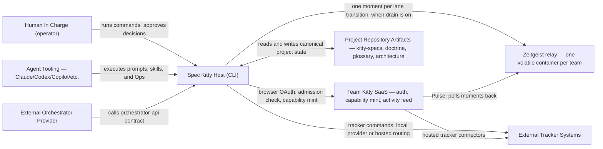
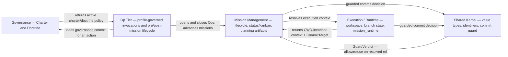

# System Context (living)

| Field | Value |
|---|---|
| Status | Living |
| Date | 2026-06-11 (charter service direction added 2026-10-03) |
| Scope | C4 Level 1 system boundary and external interactions |
| Related ADRs | `2026-06-03-1`, `2026-06-03-2`, `2026-06-03-3`, `2026-06-07-1`, `2026-04-09-1`, `2026-04-09-2`, `2026-09-06-1`, `2026-09-26-3`, `2026-10-03-1` |

## Purpose

Clarify where Spec Kitty starts and ends, who interacts with it, and which
boundaries must remain explicit for safe operation.

## Scope Rules

1. Focus on actors, external systems, and authority boundaries.
2. Capture why interactions exist and what constraints apply.
3. Defer internal module detail to [`../02_containers/README.md`](../02_containers/README.md)
   and [`../03_components/README.md`](../03_components/README.md).

## Primary Audience

| Audience | Why This View Matters |
|---|---|
| [Project Owner](../../../context/audience/external/project-owner.md) | Understands accountability and approval boundaries. |
| [System Architect](../../../context/audience/internal/system-architect.md) | Validates integration and authority contracts. |
| [AI Collaboration Agent](../../../context/audience/internal/ai-collaboration-agent.md) | Aligns execution behavior with host-owned constraints. |
| [Spec Kitty CLI Runtime](../../../context/audience/internal/spec-kitty-cli-runtime.md) | Enforces command and state authority boundaries. |

## Context Diagram (Mermaid)



## Planned Charter Read and Write Transition

The planned charter service is a separate governance-domain system reached
through a CLI charter API seam that #645 plans, or through its own governed MCP interface.
Today no such seam exists; callers import charter internals directly. Java
becomes the production reader only after conformance; Python remains the
production writer until each write operation migrates. Shadow reads and the
temporary loud fallback are transition stages owned by
[ADR 2026-10-03-1](../../../adr/4.x/2026-10-03-1-charter-read-write-service-strangler.md).

```mermaid
flowchart LR
    operator["Operator"]
    harness["Agent harness"]
    cli["Spec Kitty CLI"]
    charter["Charter Service — planned, per worktree"]
    sources[("Authored charter and pack YAML")]
    status["Mission Status Read service — sibling"]
    ui["External Mission UI"]

    operator -->|current commands and writes| cli
    harness -->|current CLI calls| cli
    harness -.->|planned governed MCP reads| charter
    cli -->|current direct writes in Python| sources
    cli -.->|planned reads through the charter API seam (#645)| charter
    charter -.->|planned authored-source read| sources
    ui -->|mission status only| status
```

Solid arrows are current interactions; dotted arrows are planned or future.
Direct MCP and Python-seam reads enter the same charter read application and
cannot define different semantics.

The Mission Status Read service is a sibling, not a shared process or domain.
The external Mission UI consumes status and is not implicitly a charter client.

## External Interaction Contracts

| External Entity | Interaction Contract | Boundary Rule |
|---|---|---|
| Human In Charge | Command invocation and approval checkpoints | Final acceptance authority stays human-owned. |
| Agent Tooling | Prompt-, skill-, and Op-driven workflow execution | Agents execute within host constraints and the resolved profile's governance scope. |
| External Orchestrator Provider | Orchestrator API calls | Provider is adapter-only; host remains lifecycle authority. |
| Team Kitty SaaS | Browser-mediated OAuth, repository admission, capability mint; builds its activity feed by polling the relay | Auth is browser-OAuth, not password (`2026-04-09-2`); membership plus admission is the server-side gate. The host remains the canonical state authority. |
| Zeitgeist relay | The CLI publishes one bounded moment per lane transition, no queue, no retry | Volatile and per team. Publishing is opt-in on the client (drain, `2026-09-26-3`); an unreachable relay never blocks local persistence. See [Team Kitty and Zeitgeist](../../../context/team-kitty.md). |
| External Tracker Systems | Tracker commands (local provider, or routed through Team Kitty) | Tracker binding is optional and discovered, not user-supplied (`2026-04-04-1`). |
| Project Repository Artifacts | Filesystem state read/write | Repository artifacts are canonical persistent state. |

## Domain Context Map

The system is organized into **four bounded modules** that communicate only
through Open Host Service (OHS) facades
([`docs/adr/3.x/2026-06-03-1-execution-state-domain-model.md`](../../../adr/3.x/2026-06-03-1-execution-state-domain-model.md)).



| Domain | Context-Level Boundary Statement |
|---|---|
| Governance | Charter and Doctrine define what the project may do and how; they are policy inputs, never bypass mission sequencing. |
| Mission Management | Owns mission lifecycle, WP status/kanban, status events, and planning artifacts; the **sole** status authority. |
| Execution / Runtime | Owns workspace resolution, branch state, and the CWD-invariant `mission_runtime` execution context. |
| Shared Kernel | Provides value types and the single commit-guard decision; holds no domain logic. |
| Op Tier | The shared Op shape across `spec-kitty dispatch` and pre/post-mission lifecycle; governed by a resolved agent profile. |

## Branch and Routing Boundary

1. Mission metadata (`meta.json`) carries canonical mission identity (`mission_id`)
   and target-line intent used for lifecycle routing (`2026-04-09-1`).
2. A single resolved [`CommitTarget(ref, kind)`](../../../adr/3.x/2026-06-03-2-executioncontext-owner-and-committarget.md)
   is the one destination both planning artifacts and status events resolve to.
3. Worktree invocation does not transfer canonical lifecycle authority; the
   resolved context is CWD-invariant.
4. The single commit-guard decision authorizes or refuses a commit on that
   resolved ref — pushing to `origin/main` is outside the guard's reach entirely.

## Boundary and Trade-off Notes

1. Host-owned authority is intentional: orchestration and Team Kitty are pluggable,
   state-mutation authority is not.
2. External integrations are optional by design to preserve local-first operation.
3. The model favors traceability and deterministic behavior over implicit
   automation shortcuts.

## Decision Traceability

<!-- DECISION: 2026-06-03-1 - Four bounded modules, OHS facades only -->
<!-- DECISION: 2026-06-07-1 - mission_runtime is the canonical execution-state surface -->
<!-- DECISION: 2026-06-03-2 - One CommitTarget(ref, kind) destination for artifacts and status -->

## Traceability

- Domain model ADR: [`docs/adr/3.x/2026-06-03-1-execution-state-domain-model.md`](../../../adr/3.x/2026-06-03-1-execution-state-domain-model.md)
- Canonical execution surface ADR: [`docs/adr/3.x/2026-06-07-1-execution-state-canonical-surface.md`](../../../adr/3.x/2026-06-07-1-execution-state-canonical-surface.md)
- ExecutionContext owner + CommitTarget ADR (incl. 2026-06-10 addendum): [`docs/adr/3.x/2026-06-03-2-executioncontext-owner-and-committarget.md`](../../../adr/3.x/2026-06-03-2-executioncontext-owner-and-committarget.md)
- Container view: [`../02_containers/README.md`](../02_containers/README.md)
- Component view: [`../03_components/README.md`](../03_components/README.md)
- Hosted boundary: [Team Kitty and Zeitgeist](../../../context/team-kitty.md), ADR [`2026-09-26-3`](../../../adr/3.x/2026-09-26-3-hosted-interaction-opt-in.md)
- Charter service strangler ADR: [`2026-10-03-1`](../../../adr/4.x/2026-10-03-1-charter-read-write-service-strangler.md)
