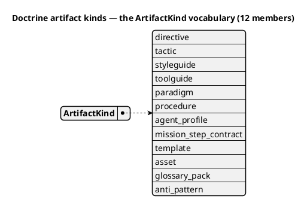
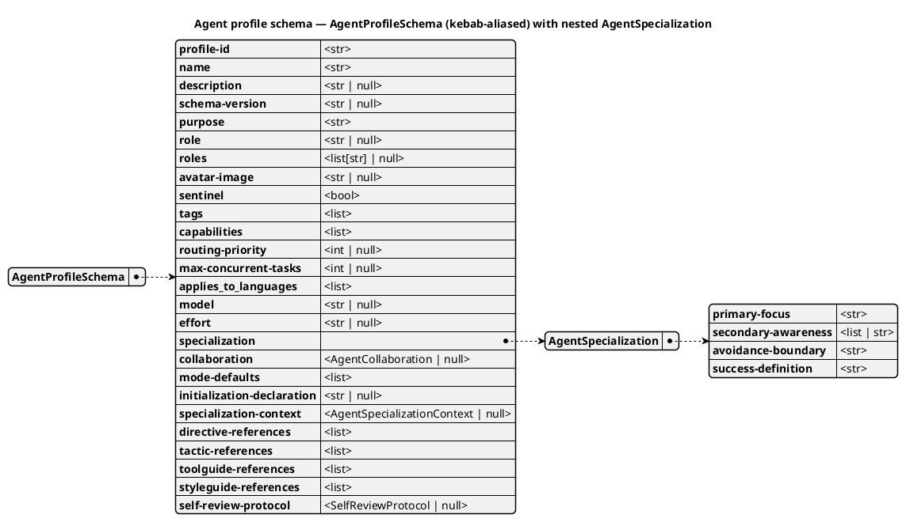

# Doctrine artifact kinds

Doctrine is the layered set of governed content that shapes how missions and agents behave in a
Spec Kitty project — the rules directives enforce, the techniques tactics teach, the personas
agent profiles define, and so on. Everything in doctrine is one of a fixed set of **kinds**. This
page explains what each kind is for, with a real example drawn from this repository's own
built-in doctrine.

## Single source of truth

The kind list on this page is not invented for the docs — it is read directly from
[`src/charter/activation/kind_vocabulary.py`](https://github.com/spec-kitty/spec-kitty/blob/main/src/charter/activation/kind_vocabulary.py)
and [`src/charter/offering/artifact_kinds.py`](https://github.com/spec-kitty/spec-kitty/blob/main/src/charter/offering/artifact_kinds.py),
and cross-checked against the running CLI. You can reproduce the same list yourself:

```bash
# Passing an invalid kind makes the CLI print the full valid list back at you
spec-kitty charter activate bogus-kind some-id
# Error: Unknown kind 'bogus-kind'. Valid kinds: agent-profile, directive,
# glossary-pack, mission-step-contract, mission-type, paradigm, procedure,
# styleguide, tactic, toolguide.
```

Strip `mission-type` from that list (it is a *mission* concept, not a doctrine artifact kind —
see [the mission system](mission-system.md)) and you have the **nine charter-activatable**
doctrine artifact kinds: **directive, tactic, styleguide, toolguide, paradigm, procedure,
agent_profile, mission_step_contract, glossary_pack**. Those nine are the activation vocabulary;
they are part of a larger **twelve-member `ArtifactKind` enum** — the remaining three
(`template`, `asset`, `anti_pattern`) are real kinds handled specially, not separately activated
(see the note below and the [schema overview](#schema-at-a-glance)). All twelve are documented on
this page.

## Schema at a glance

The **`ArtifactKind` vocabulary** below is generated from the frozen enum
(`src/charter/offering/artifact_kinds.py`) via `list(ArtifactKind)` and kept honest by the drift guard
(`tests/docs/diagram_drift/`, FR-004) — the twelve members are introspected, never hand-typed, so
this list cannot silently fall out of step with the code (as the stale "eight" prose once did).



Most kinds are a thin marker with a small governed body; the richest schema is the **agent
profile**, so it earns a full diagram. `AgentProfileSchema` is a Pydantic model with **kebab-case
aliases** (the guard normalizes each field via `FieldInfo.alias or name`) and a genuinely **nested**
value object, `AgentSpecialization` — the diagram expands that sub-map so the guard exercises its
transitive-recursion path on real, shipped content.



The three unexpanded nested value objects (`collaboration`,
`specialization-context`, `self-review-protocol`) are shown as typed references rather than inlined —
a deliberate diagram-author choice, like drawing a foreign key instead of copying the whole table.

> **A note on `template`, `asset`, and `anti_pattern` (the three non-activatable kinds).** If you
> read `src/charter/offering/artifact_kinds.py` directly, you will see three members of the `ArtifactKind`
> enum beyond the nine activatable kinds: `template`, `asset`, and `anti_pattern` — the exact set in
> `_NON_AUGMENTATION_ELIGIBLE_KINDS`. All three are real and handled by the doctrine system — but
> none is one of the nine activatable kinds above, and the CLI error message above is the proof:
> `template` and `asset` do not appear in the
> "Valid kinds" list because they are explicitly excluded from `CHARTER_KIND_TOKENS` (the set
> `charter activate`/`deactivate`/`list`/`context --include` operate over). `template` is
> mission-scoped (it ships as part of a mission type's own template set, not as a
> standalone artifact you activate — `spec-kitty charter list --all` reports it as
> "mission-scoped — not separately activated"). `asset` is a loose-contract kind (a
> sidecar `*.asset.yaml` manifest describing a blob — an image, font, template fixture, or
> a shipped script — that is resolved to a path, never parsed or schema-validated). It ships
> **one** built-in artifact today: `common-docs-structural-lint`, the structural docs lint
> (`packs/built-in/assets/docs_structural_lint.py`, declared by
> `docs_structural_lint.py.asset.yaml`). Resolve it — from any installation, no charter step
> required — with `spec-kitty doctrine asset path common-docs-structural-lint` (or list every
> resolvable asset and its source tier with `spec-kitty doctrine asset list`). Both are worth
> knowing exist; neither is part of the nine-kind activation vocabulary this page and its
> companion how-to cover — see [The asset kind](#the-asset-kind) below for how to author and
> resolve one, and [Delivery verdicts: which kinds reach a mission](#delivery-verdicts-which-kinds-reach-a-mission)
> for why the shipped asset arrives without being activated. `anti_pattern` is the third: it is a
> DRG **node kind** (`NodeKind.ANTI_PATTERN`) with **no backing artifact schema** — a marker node
> that `rejects` edges point at — documented under [Anti-pattern](#anti-pattern) below. **Audit
> note:** `template` was reviewed for a dedicated schema diagram and consciously left as this note
> — it is mission-scoped file selection, not a standalone authored schema, so it carries no
> `@startyaml` model diagram (its shape is "a file in a mission type's template set").

## The asset kind

The nine activatable kinds are the **activation vocabulary** — you author one, `charter activate` it,
and it becomes eligible for injection into governed mission context. The `asset` kind sits outside
that vocabulary on purpose. An asset is not a rule, a technique, or a persona; it is a **blob** —
a file whose bytes are the payload (an image, a font, a template fixture, or a shipped script such
as a lint). Spec Kitty never parses or schema-validates the blob itself. Instead each blob is
described by a small YAML **sidecar manifest** placed alongside it, and it is the manifest — not
the blob — that carries the validated contract (`id`, `mime`, `path`, optional `title`).

**Why a project would ship one.** [`review-gates.md`](../development/how-to/review-gates.md) forbids
shipped doctrine from naming a repo-local script or CI path a consumer does not have. The
canonical way to hand executable logic (or any blob) to a downstream repo is precisely the `asset`
kind: the blob travels *inside* the pack under its `assets/` tree, and downstream code resolves it
by identifier through `spec-kitty doctrine asset path <id>` rather than reaching for a path that
only exists in our source tree. The one built-in asset, `common-docs-structural-lint`, is exactly
this pattern — a lint script shipped as an asset instead of as a `scripts/…` reference.

To **author and resolve** an asset end to end, follow the asset section of
[Create a doctrine artifact](../development/how-to/create-a-doctrine-artifact.md#author-an-asset-a-shipped-blob).

### Delivery verdicts: which kinds reach a mission

"Activatable" and "delivered" are two different questions. A kind is **delivered** when its
resolved artifacts reach the rendered doctrine bundle a mission action consumes. The delivery rail
records a verdict for **every** `NodeKind` in one total table (`_ACTION_BUNDLE_DELIVERY_BY_KIND` in
[`src/charter/activation/context.py`](https://github.com/spec-kitty/spec-kitty/blob/main/src/charter/activation/context.py)),
with two columns — the bundle *slot* the kind feeds, and the *gate* that filters it. The gate is a
**total function** over kinds, so there are three categories, not two:

| Category | Kinds | Gate | What reaches the mission |
|---|---|---|---|
| **Delivered, activation-gated** | directive, tactic, styleguide, toolguide, procedure | `ACTIVATED` | `activated(kind) ∩ reachable` — only the ones you activated *and* the DRG reaches |
| **Delivered, not activation-gated** | **asset** | `ALL` | `reachable` alone — every asset a reachable source pulls in, no activation list consulted |
| **Not bundle-delivered (stated reason)** | paradigm, agent_profile, mission_step_contract, glossary_pack, anti_pattern, template | — | excluded, each with a recorded reason (e.g. template is mission-scoped file selection; agent_profile ships through the profile channel) |

Assets are the **third category** — *delivered but not activation-gated*. This matters because an
asset has no `activated_assets` list to appear on: `activated(asset)` is empty by construction, so
gating an asset on `activated ∩ reachable` would ship "no assets, ever" and quietly pass. Instead
the gate for assets is `ALL`, meaning delivery is `reachable` alone — an asset arrives when a
reachable artifact points at it through a `requires`/`suggests` edge. That is how the shipped
`common-docs-structural-lint` reaches a mission without anyone activating it. (`template` shares
the `ALL` gate but has no bundle slot — its selection is mission-scoped file resolution, a stated
exclusion rather than asset's untreated twin.)

## The doctrine artifact kinds

### Directive

**Purpose.** A constraint-oriented governance rule that applies across flows or phases.
Directives encode required or advisory expectations and can reference lower-level tactics for
execution. Directives are the "must/should" layer of doctrine — the rule, not the recipe for
following it.

**Location.** `packs/built-in/directives/*.directive.yaml` (project overlay:
`.kittify/doctrine/directive/`).

**Example.** `DIRECTIVE_001` — "Architectural Integrity Standard"
(`packs/built-in/directives/001-architectural-integrity-standard.directive.yaml`).
Its `intent` requires that "system designs must maintain clear separation of concerns and
well-defined component boundaries," and its `procedures`/`integrity_rules`/`validation_criteria`
fields spell out how a reviewer checks compliance — without prescribing exactly how to
decompose any given system (that's a tactic's job).

### Tactic

**Purpose.** A reusable behavioral execution pattern that defines *how* work is performed.
Tactics are operational and agent-consumable, and can be selected by directives and mission
context. Where a directive says "you must," a tactic says "here is how, step by step."

**Location.** `packs/built-in/tactics/**/*.tactic.yaml` (project overlay:
`.kittify/doctrine/tactic/`).

**Example.** `problem-decomposition`
(`packs/built-in/tactics/architecture/problem-decomposition.tactic.yaml`). Its `steps`
walk an agent through stating a problem in one sentence, enumerating contributing factors,
clustering them into independent sub-problems, and validating completeness — a concrete,
followable procedure for a specific recurring situation (breaking down an ambiguous problem
before committing to a solution).

### Styleguide

**Purpose.** A doctrine artifact defining cross-cutting quality and consistency conventions (for
example coding, documentation, or testing style) that apply across missions and templates.
Styleguides are about *how things should look and read*, not about a specific procedure.

**Location.** `packs/built-in/styleguides/*.styleguide.yaml` (project overlay:
`.kittify/doctrine/styleguide/`).

**Example.** `plain-language`
(`packs/built-in/styleguides/plain-language.styleguide.yaml`). Its `principles` govern
this very kind of page: write for the named audience, prefer the short common word, one idea per
sentence, active voice, define a term once and reuse it, show rather than only tell. This page
was written under that styleguide.

### Toolguide

**Purpose.** A doctrine artifact defining tool-specific operational guidance, syntax, and
constraints (for example a particular diagramming tool's conventions) used by agents and
contributors during execution. Toolguides are scoped to one external tool, not to a general
technique.

**Location.** `packs/built-in/toolguides/*.toolguide.yaml`, each pointing at a
companion `guide_path` (project overlay: `.kittify/doctrine/toolguides/`).

**Example.** `mermaid-diagramming`
(`packs/built-in/toolguides/mermaid-diagramming.toolguide.yaml`), which points at
`MERMAID_DIAGRAMMING.md` for syntax patterns, theming, and rendering conventions when a mission
needs a diagram-as-code artifact.

### Paradigm

**Purpose.** A worldview-level framing for how work is approached in a domain. Paradigms
influence the selection and interpretation of directives and tactics but are not executable step
recipes themselves — they are the lens, not the checklist.

**Location.** `packs/built-in/paradigms/*.paradigm.yaml` (project overlay:
`.kittify/doctrine/paradigms/`).

**Example.** `domain-driven-design`
(`packs/built-in/paradigms/domain-driven-design.paradigm.yaml`). Its `summary` frames
software design around a deep model of the business domain (Bounded Contexts, Ubiquitous
Language, Aggregates); its `directive_refs` link it to `DIRECTIVE_001`, `DIRECTIVE_031`, and
`DIRECTIVE_032`, and it authors `rejects` DRG edges naming the anti-patterns it warns against
(for example the `anemic-domain-model` anti-pattern node) so the consistency-check and rendered
agent context can surface "avoid this" targets. (This replaces the retired `opposed_by` field —
see [ADR 2026-07-21-1](../adr/3.x/2026-07-21-1-in-tension-with-drg-edge.md).)

### Procedure

**Purpose.** A reusable doctrine subworkflow that a step contract may delegate to for part of a
mission action. Procedures are structured, stateful playbooks with defined entry/exit
conditions — unlike tactics (small composable techniques), procedures orchestrate multi-step
flows that can be paused, resumed, and validated. They are not tracked missions and not runtime
sessions.

**Location.** `packs/built-in/procedures/*.procedure.yaml` (project overlay:
`.kittify/doctrine/procedure/`).

**Example.** `adversarial-squad-deployment`
(`packs/built-in/procedures/adversarial-squad-deployment.procedure.yaml`). Its
`entry_condition` is "a work product has reached a review point-cut... and an independent
multi-lens assessment would reduce the risk of a costly miss"; its `steps` cover choosing the
point-cut, selecting complementary profiles, running the delegates in parallel, and
synthesizing a verdict — a bounded, resumable workflow, not a single technique.

### Agent Profile

**Purpose.** A structured logical collaborator identity and behavior guidance, identified by a
stable profile ID, that governs assignment, handoff, role-scoped behavior, and tool-native
custom-agent/subagent projection. An agent profile is *who* is doing the work and *how they are
allowed to operate* — roles, capabilities, directive references, and collaboration rules — not a
technique or a rule in isolation.

**Location.** `packs/built-in/agent_profiles/*.agent.yaml` (project overlay:
`.kittify/doctrine/agent_profiles/`; key field is `profile-id`, not `id`).

**Example.** `doctrine-daphne`
(`packs/built-in/agent_profiles/doctrine-daphne.agent.yaml`) — the profile this very page
was authored under. Its `roles` are `curator` and `onboarding-guide`; its `capabilities` include
`artifact-kind-classification` and `pack-artifact-authoring`; its `directive-references` name specific directives (`003`, `018`,
`032`, `043`, `044`) so the agent has the right doctrine loaded before curating more of it.

### Mission step contract

**Purpose.** A structured contract for one mission action, including step sequencing, guard
evaluation, prompt binding, and delegation hooks. Mission step contracts are what turn a mission
type's abstract action sequence (specify → plan → tasks → implement → review) into concrete,
executable steps — each step can delegate to a directive, tactic, or procedure.

**Location.** `packs/built-in/missions/built_in_step_contracts/*.step-contract.yaml`
(project overlay: `.kittify/doctrine/mission_step_contracts/`).

**Example.** `specify` action, software-dev mission
(`packs/built-in/missions/built_in_step_contracts/specify.step-contract.yaml`). Its `bootstrap`
step loads charter context; `capture_intent` delegates to directives
`010-specification-fidelity-requirement` and `037-living-documentation-sync`; `map_examples`
delegates to the `example-mapping-workshop` procedure; `validate_requirements` delegates to the
`requirements-validation-workflow` tactic. This is the contract that makes `/spec-kitty.specify`
pull in exactly that doctrine, in that order.

### Glossary pack

**Purpose.** A bundled set of canonical terminology — term definitions, aliases, and the scopes
they apply in — activated as a unit so a mission speaks one precise vocabulary. Where a single
term lives on a `glossary` node and its applicability on a `glossary_scope` node in the DRG, a
**glossary pack** is the activatable artifact that packages a coherent group of them (the ninth
member of the charter-activation vocabulary — it *is* charter-activatable via the `glossary-pack`
token, unlike `template`/`asset`/`anti_pattern`).

**Location.** `packs/built-in/glossary_packs/*.glossary-pack.yaml` (project overlay:
`.kittify/doctrine/glossary_packs/`). Activate it like any other kind: `spec-kitty charter activate
glossary-pack <id>`.

**Why it is a pack, not loose terms.** Terminology drifts fastest when definitions are scattered;
bundling the canonical terms for a domain into one activatable pack keeps a mission's language
internally consistent and lets the glossary integrity pipeline check the group as a whole.

### Anti-pattern

**Purpose.** A named bad practice or smell that good doctrine should steer away from. Unlike the
nine activatable kinds, an **anti-pattern is not an authored artifact schema you activate** — it is
a **DRG node kind** (`NodeKind.ANTI_PATTERN`) with **no backing model class**: a marker node that
other artifacts point at with `rejects` edges (see [Doctrine relationships](doctrine-relationships.md)).
A paradigm such as `domain-driven-design`, for example, authors `rejects` edges naming the
`anemic-domain-model` anti-pattern node.

**Not to be confused with `styleguides` `AntiPattern`.** The styleguide models define an inline
`AntiPattern` example type (`src/charter/offering/styleguides/models.py`) — a small structured example
*embedded in a styleguide body*. That is a different concept from the DRG `anti_pattern` kind: the
styleguide `AntiPattern` is a backed Pydantic example type inside another artifact; the DRG
`anti_pattern` is a bare node kind (a string, no class) that exists only as a graph target. The
drift guard binds each separately so the two are never conflated.

## Where to go next

- To author and activate a new artifact of any of these kinds, follow
  [Create a doctrine artifact](../development/how-to/create-a-doctrine-artifact.md).
- For how built-in, org, and project doctrine layers combine and override each other, see
  [Understanding the Org Doctrine Layer](org-doctrine-layer.md).
- For the canonical glossary definitions these purpose statements are grounded in, see the
  [doctrine context glossary](../context/charter.md) and the
  [Agent Profile](../context/identity.md#agent-profile) /
  [step contract](../context/orchestration.md#step-contract) entries.
