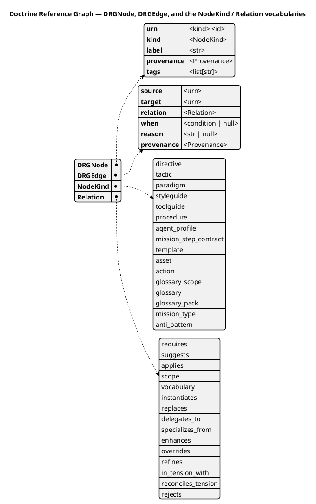

# Doctrine relationships: lineage, delegation, augmentation, and action resolution

This page explains how relationships between doctrine artifacts are modelled in
Spec Kitty, and — importantly — **how to author them**. As of the org-doctrine
profile-integrity work (FR-001/FR-003/FR-004, NFR-007), every relationship is a
**typed edge in the doctrine reference graph (DRG)**. Relationships are *not*
authored as fields on the artifacts themselves.

> **One authoring surface.** Author relationships as DRG **fragment edges** in
> the project's `graph.yaml` (project tier), the per-kind `*.graph.yaml`
> fragments under `packs/built-in/` (built-in tier), or `drg/fragment.yaml`
> (org-pack tier).
> The deprecated `enhances:` / `overrides:` / `specializes-from:` *artifact
> fields* are being retired (they become a hard error). The canonical relation
> tokens live on the `Relation` enum in
> [`src/charter/offering/drg/models.py`](https://github.com/spec-kitty/spec-kitty/blob/main/src/charter/offering/drg/models.py).

Every one of the 15 `Relation` members below has a dedicated section whose
body is copied **verbatim** from the canonical `RELATION_DESCRIPTIONS`
registry in
[`src/charter/offering/drg/models.py`](https://github.com/spec-kitty/spec-kitty/blob/main/src/charter/offering/drg/models.py)
— that registry is the single source of truth; these sections mirror it for
human readers, and the two are kept in parity by
`tests/doctrine/test_relation_doc_parity.py` (FR-006/FR-012/NFR-003/NFR-004),
which now scopes **all 15 relations**, not a subset.

## DRG schema at a glance

The graph itself is two small records — a **node** and a typed **edge** — over two
closed vocabularies. The schema diagram below is **generated from the frozen code
models** (`src/charter/offering/drg/models.py`) and kept honest by the drift guard
(`tests/docs/diagram_drift/`, FR-004): every field and every enum member is
introspected from the live model (`list(NodeKind)`, `list(Relation)`), never
hand-copied, so this picture cannot silently drift from the code.



A **`DRGNode`** is an addressable artefact (its `urn` is `<kind>:<id>`, where
`<kind>` is one of the `NodeKind` members); a **`DRGEdge`** is a directional,
typed relationship whose `relation` is one of the `Relation` members. Everything
below — lineage, delegation, augmentation, the action-resolution relations, and
the tension vocabulary — is just a `relation` value on an edge.

> **Prose counts are narrative, not guarded.** The "15" (relations) and "16"
> (node kinds) that appear in this page's prose are human-facing narration; they
> are **diagram-unguarded**. The drift guard enforces the *diagram ↔ model* match
> by introspecting `list(Relation)` / `list(NodeKind)` — it does not read the prose
> literal. If a member is added or removed, update the diagram (the guard will
> fail until you do) and refresh the prose counts by hand.

## The three relationship families

Lineage, delegation, and augmentation are three **distinct** concepts and must
never be conflated. The DRG keeps them as separate relation types so traversal
never accidentally crosses from one to another.

### Lineage — `specializes_from`

A directional, static lineage edge: a profile or artifact derives from a parent, narrowing or extending it. Emitted 4 times in the built-in graph, exclusively ``agent_profile`` -> ``agent_profile`` (e.g. ``python-pedro`` --specializes_from--> ``implementer-ivan``). Resolved via ``AgentProfileRepository.resolve_profile`` graph traversal at composition time, and deliberately distinct from ``delegates_to`` so inheritance never leaks into runtime handoff traversal.

### Delegation — `delegates_to`

A directional, runtime handoff edge: one agent profile hands work to another at execution time (e.g. an implementer profile delegating a review to a reviewer profile). Deliberately kept separate from ``specializes_from`` so a static lineage relationship is never conflated with a live work handoff. Intended-but-dormant: zero edges exist in the built-in graph today -- delegation is currently expressed through a profile's ``collaboration.handoff_to`` prose field, not a graph edge.

#### Augmentation family: enhancement, override, and legacy replacement

An *overlay* relation family, used when a higher layer (an org pack or project
tier) adjusts a built-in artifact. Augmentation edges may be authored against
every augmentation-eligible kind: directives, tactics, styleguides,
toolguides, paradigms, procedures, agent profiles, mission step contracts, and
mission types. Each of the three relations below is a distinct edge-role with
its own dedicated section below — the parity comparator requires one heading
per relation, since a single shared heading cannot content-equal three
distinct registry strings.

### Enhancement — `enhances`

A directional org-pack overlay edge: a pack artifact field-merges additional content into a built-in artifact, preserving the built-in's action sequence and step I/O rather than replacing them. Zero edges exist in the built-in graph by design -- ``enhances`` only ever originates from an org- or project-tier pack fragment layered on top of a shipped artifact, never between two built-in nodes. Distinct from ``overrides``, which replaces rather than merges.

### Override — `overrides`

A directional org-pack overlay edge: a pack artifact declares a full replacement of a built-in artifact's content, rather than a field-merge. Zero edges exist in the built-in graph by design, for the same reason as ``enhances`` -- it only ever originates from an org- or project-tier overlay, never between two built-in nodes. Silently dropping steps or stripping step I/O when applying an ``overrides`` edge is rejected by the loader.

### Replacement (legacy) — `replaces`

A directional supersession edge: the source artifact fully supersedes the target, which is no longer applicable once the source is active. Retained for backward compatibility with existing hand-authored fragments; zero edges exist in the built-in graph by design -- new supersession is expressed by deactivating the superseded artifact directly, or, for pack overlays, via ``overrides``. Distinct from ``in_tension_with``, which never implies that either side is deprecated or wrong.

## Action-resolution relations — `requires`, `suggests`, `applies`, `scope`, `vocabulary`, `instantiates`, `refines`

These seven relations govern how `resolve_action_context` and the charter
cascade walk the graph outward from an action's directly-scoped artifacts, and
how profiles and actions connect to the workflow content and outputs they use
or produce.

### Requirement — `requires`

A directional, hard-dependency edge: resolving or activating the source artifact pulls in the target as a mandatory prerequisite. ``resolve_action_context`` walks ``requires`` edges transitively, with no depth limit, from an action's ``scope``-resolved artifacts; ``charter activate --cascade`` follows the same edge to pull in artifacts that must also be active. It is the second-most-emitted relation in the built-in graph (323 edges) and is the mandatory counterpart to ``suggests``, not a stronger synonym for it.

### Suggestion — `suggests`

A directional, soft-recommendation edge: the source artifact points at content that is relevant but not mandatory. ``resolve_action_context`` walks ``suggests`` edges only up to a bounded hop depth -- unlike the unbounded transitive walk used for ``requires`` -- and the charter cascade treats a ``suggests`` target as optional, something an operator may accept or skip. It is the most-emitted relation in the built-in graph (450 edges); the boundedness of the walk, not the edge count, is what distinguishes it from ``requires``.

### Application — `applies`

Names the edge from an agent profile to the concrete procedure or tactic that profile executes as its operating workflow. Zero edges exist in the built-in graph, and authoring one is refused by ``tests/architectural/test_no_authored_applies_edge.py``: no context resolution, no charter cascade and no reference walk follows ``applies``, so an authored one names a relationship nothing traverses. The single shipped example (``agent_profile:doctrine-daphne`` --applies--> ``procedure:onboard-external-agent-to-pack``) was retyped to ``requires`` because it was that procedure's only inbound edge and left the profile's own operating procedure unreachable. The relation itself is not dead -- ``charter.activation.synthesizer.project_drg`` emits it during project-tier synthesis and the orphan lint accepts it as an inbound edge on a ``directive`` node -- so what is forbidden is authoring one into the shipped tree, not the relation existing. Distinct from ``scope``, which names the action-to-governance-artifact edge role, not a profile's own operating procedure -- the two are never interchangeable.

### Scope — `scope`

Names the edge from a mission-step action node to the directives and tactics that govern performing that action, or -- since #3604 -- from a mission_type node to the type-wide governance its governance-profile.yaml selects. The action-sourced edges are the entry point walked at depth 1 by ``resolve_action_context`` before it expands through ``requires``/``suggests``; the mission_type-sourced edges are instead the entry point the charter cascade (``REFERENCE_RELATIONS``) walks when activating a mission type. It is the most heavily emitted action-adjacent relation in the built-in graph -- 204 edges as measured by a live extraction after #3604 (165 action-sourced, unchanged from before #3604 since this pass is purely additive, plus 39 mission_type-sourced); this count is not enforced by any test against the graph, so treat it as directional, not exact. Distinct from ``applies``: ``scope`` says an action -- or a mission type's own type-wide selections -- is governed by an artifact; ``applies`` says a profile executes a workflow artifact. Despite both linking guidance content to a governed node, they name different edge-roles and are never interchangeable.

DELIBERATE ACCEPTED DEBT (#3633): one ``Relation.SCOPE`` member now carries two distinct source-node grains (action-sourced and mission_type-sourced, above) instead of two separate relations. This is a deliberate decision, not an oversight -- splitting the grain into e.g. ``scope`` / ``type_scope`` would churn every consumer's relation vocabulary (query filters, the charter cascade's ``REFERENCE_RELATIONS``, doctrine docs) and force a DRG merge/projection migration for a purely cosmetic grain distinction the graph already encodes structurally (a scope edge's source-node kind -- ``action`` vs ``mission_type`` -- tells a consumer which grain it is without a second relation name). Do NOT split this relation to "fix" the overload; if a genuine behavioral need for two distinct relations ever arises, that is a new decision to make explicitly, not a refactor of this one.

### Vocabulary — `vocabulary`

Names the edge from a resolved doctrine artifact to a ``glossary_scope`` node, walked at depth 1 by ``resolve_action_context`` to surface which glossary sections apply to an action's resolved context. Intended-but-dormant: zero edges exist in the built-in graph today, so no action currently pulls in glossary scope through this relation -- the walk is implemented and exercised by tests, but no artifact author has emitted one yet.

### Instantiation — `instantiates`

A directional edge from a mission-step action node to the template it produces as its concrete output artifact, e.g. ``action:documentation/design`` --instantiates--> ``template:documentation/documentation-plan-template.md``. Emitted 11 times in the built-in graph, exclusively from ``action`` nodes to ``template`` nodes. Distinct from ``scope``, which links an action to governance content it must follow, not content it produces.

### Refinement — `refines`

A directional edge: an artifact narrows or sharpens the applicability or meaning of its target (a parent or built-in artifact) without replacing it -- a first-class, traversable relation, never a synonym for ``applies`` or ``specializes_from``. Intended-but-dormant: zero edges exist in the built-in graph today. The org-to-DRG bridge previously downgraded authored ``refines`` edges to ``applies`` silently; that lossy downgrade has been removed, so ``refines`` now survives end-to-end once an author emits one.

## Tension vocabulary — `in_tension_with`, `reconciles_tension`, `rejects`

Doctrine disagreement is modelled as three additional typed edges, added by
mission `doctrine-tension-edges-01KY1WPC` (FR-001/002/003) alongside the
lineage/delegation/augmentation and action-resolution families above, and
explicitly **not** to be confused with them or with each other. As with every
other relation on this page, the description text below is copied
**verbatim** from the canonical `RELATION_DESCRIPTIONS` registry and is kept
in parity by `tests/doctrine/test_relation_doc_parity.py`.

### Tension — `in_tension_with`

Marks two co-valid, co-activatable artefacts that compete on the same decision. The relation is symmetric and non-transitive: it is stored as a single canonical edge (lexicographically-smaller URN as source) and is queryable from either endpoint. It does not imply that either side is deprecated, superseded, or wrong -- both remain valid rules until an operator deactivates one side or activates a reconciler.

### Reconciliation — `reconciles_tension`

Links an active reconciliation artefact to one side of a declared tension pair. A tension pair is treated as resolved only when an active artefact carries this edge to BOTH sides of the pair -- an edge to just one side leaves the pair half-reconciled and still flagged. It is authored explicitly and is never inferred from an ``in_tension_with`` edge.

### Rejection — `rejects`

A directional edge from a good artefact to a marked anti-pattern or smell node (``NodeKind.ANTI_PATTERN``), expressing rejection of a named bad practice. It is distinct from ``in_tension_with`` -- the target is not a competing equal, it is a bad practice -- and from ``replaces``/supersession, since the target was never a valid rule to begin with.

## Authoring examples

Worked YAML examples for the relations above, re-homed here so the per-relation
sections directly above stay content-equal to the registry (a code example
embedded inside a parity-enforced section body would break verbatim equality).

### Lineage edge

```yaml
# packs/built-in/<kind>.graph.yaml (built-in tier) — lineage authored as an edge
edges:
  - source: agent_profile:python-pedro
    target: agent_profile:implementer-ivan
    relation: specializes_from
    reason: Python Pedro is a language-specialist implementer derived from Implementer Ivan
```

### Augmentation edges

```yaml
# drg/fragment.yaml (org-pack tier) — augmentation authored as edges
edges:
  - source: directive:org-directive
    target: directive:org-directive
    relation: enhances
    reason: Directive overlay enhances a built-in directive
  - source: mission_type:org-mission-type
    target: mission_type:org-mission-type
    relation: overrides
    reason: Mission-type overlay replaces a built-in mission type
```

### Canonical authoring example

Two profiles, one lineage edge:

```yaml
# graph.yaml
nodes:
  - urn: agent_profile:implementer-ivan
    kind: agent_profile
    label: Implementer Ivan
  - urn: agent_profile:python-pedro
    kind: agent_profile
    label: Python Pedro
edges:
  - source: agent_profile:python-pedro
    target: agent_profile:implementer-ivan
    relation: specializes_from
```

Org packs use the same model in `drg/fragment.yaml`, addressing nodes by their
short `id` + plural `kind`; the merge bridges those to canonical `kind:id` URNs.

## Why edges, not fields

Authoring relationships as artifact fields made the relationship invisible to
the graph until each artifact was individually parsed, and split the same
concept across several field spellings (`specializes-from`, `enhances`,
`overrides`). Modelling every relationship as a DRG edge gives a single,
queryable, layer-aware authority:

- **One source of truth.** The merged DRG is the only place relationships live;
  there is no field-vs-edge ambiguity.
- **Zero-loss migration (NFR-007).** Every previously field-authored
  relationship maps to exactly one merged edge. The migration test
  (`tests/doctrine/test_relationship_migration.py`) discovers the field-authored
  set from the built-in artifacts and proves each one has a corresponding edge —
  it never trusts a hardcoded count.
- **Fail-closed semantics (FR-003).** An edge whose `relation` token is not a
  recognised member of the `Relation` enum is rejected loudly at load time
  rather than being silently dropped.

## Living documentation

Per `DIRECTIVE_037` (living-documentation sync), this page is kept in step with
the `Relation` enum and the migration tests. When a relation type is added,
removed, or its semantics change, update:

1. the `Relation` enum docstring in `src/charter/offering/drg/models.py`,
2. the `RELATION_DESCRIPTIONS` entry for that relation,
3. this explanation page, and
4. the relationship-migration tests and fixtures
   (`tests/doctrine/test_relationship_migration.py`,
   `tests/doctrine/fixtures/relationship_packs/`).

Every one of the 15 `Relation` members has its own dedicated `### …` section
above, and each section must stay byte-identical (whitespace aside) to
`RELATION_DESCRIPTIONS` in `src/charter/offering/drg/models.py` —
`tests/doctrine/test_relation_doc_parity.py` enforces this for all 15 and
fails red, naming the relation, on any drift. There is no remaining subset of
relations excluded from this parity check: the doc-parity restructure
(mission `drg-relation-parity-activation-gate-01KY48PD`) is the follow-up that
closed the gap left by the original 3-relation scope.

## DRG edges are the canonical relationship authority

The artifact schemas under `src/charter/offering/` and the `assets/` layout predate
the DRG canonical system. Inline `references: [{type, id}]` blocks in artifact YAML are
**pre-DRG residue** to be migrated to DRG edges — not a parallel authority (ADR
[`2026-07-26-1-drg-edges-are-the-canonical-relationship-authority`](../adr/3.x/2026-07-26-1-drg-edges-are-the-canonical-relationship-authority.md)).
The per-kind `*.graph.yaml` fragments are `generated_by: drg-migration-v1` — the
migration extractor *derives* edges from the inline blocks, so the canonical graph is
largely a build output of the surface it replaces.

Consequences for authors:

- **New artefact relationships are authored as edges, never inline references.** A new
  artefact should land with zero inline `references:`.
- A kind that cannot be named in a `<kind>_reference.type` enum
  (`directive` / `paradigm` / `procedure` / `tactic`) is **correct behaviour, not a
  bug** — never widen those enums to admit a kind. The recurring "asset support is not
  end-to-end" finding is this trap; fix the tooling to serve intent rather than
  relabelling the artefact.
- Relation vocabulary is defined once, in `charter.offering.drg.models.Relation` — read
  it there rather than re-deriving the set.
