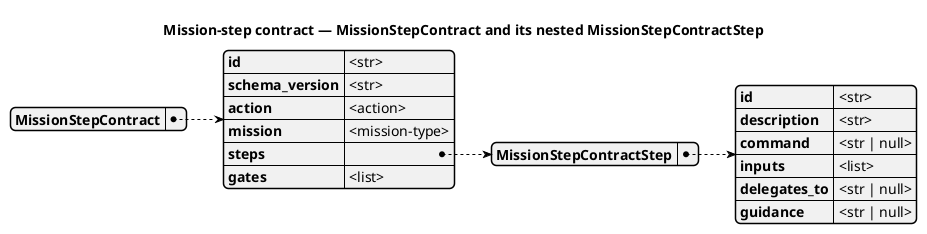
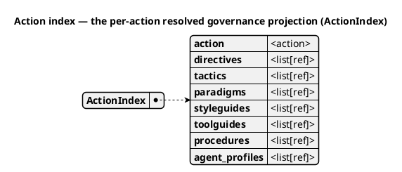

# Mission-Type Resolution — the doctrine → charter → core seam

This page explains *why* Spec Kitty resolves per-mission-type behaviour through a
single seam, and how that seam is shaped to grow. It is background and rationale,
not a how-to. For the decision record and its load-bearing anchors, see
[ADR 2026-07-14-2 — Doctrine → Charter → Core Mission-Type Resolution Unification](../adr/3.x/2026-07-14-2-doctrine-to-core-mission-type-resolution-unification.md).

## The one path: doctrine defines, charter customises, core consumes

Everything a mission type contributes — governance, templates, expected
artifacts, and step contracts today; additional runtime configuration in later
slices — flows through **one** path:

```
doctrine (offers)  →  charter (activates & customises)  →  core FSM (consumes)
```

- **Doctrine offers.** The canonical catalogue of mission types lives in
  `packs/built-in/missions/<type>/` (relocated from `src/doctrine/missions/<type>/`
  by mission `doctrine-consumer-surface-missions-extraction`). It *offers* a
  mission type's governance, action indices, step contracts, and templates.
- **Charter activates and customises.** The charter layer selects a mission type
  and overlays project-specific customisation onto it, exactly as it overlays any
  other doctrine artifact (see [the per-type override](#the-charter-customise-layer)).
- **Core consumes.** The runtime is a finite-state machine, "semi-prepared for
  states & transitions as config." It reads the *resolved* mission type and acts
  on it — it holds no hardcoded per-type knowledge.

The seam is keyed off a single fact: the mission type recorded in the mission's
`meta.json`. That is the same key the FSM already uses to read a mission's action
sequence, which is what lets governance ride alongside without becoming a
property of any one state (see [Governance is a sibling, not a property](#governance-is-a-sibling-not-a-property)).

## Why one seam instead of three surfaces

Before this decision, per-mission-type behaviour resolved through **two parallel
mission trees and three competing governance surfaces**:

- `packs/built-in/missions/<type>/` — the canonical catalogue (the source of truth;
  relocated from `src/doctrine/missions/<type>/`).
- `src/specify_cli/missions/<type>/` — **derived copies** that several core
  readers still bind to directly. The two trees drifted with no parity guard.
- Three governance surfaces per type: an inert-and-dangling `governance_refs`
  field on the mission-type YAML; a live-but-empty type-grain
  `governance-profile.yaml`; and a live, populated action-grain action index.

Three surfaces and two trees violate single canonical authority. The chosen path
does not add a fourth surface or a "keep the trees in sync" guard — either would
entrench the split. Instead it **collapses** the governance surfaces to two
hand-authored grains resolved through one function, and puts the derived
`specify_cli/missions/` tree on the deprecation path (derive-then-delete, never
grow).

## The resolver and the bundle shaped to grow

A single charter-mediated resolver is the one entry point for per-mission-type
resolution:

```
charter.activation.mission_type_profiles.resolve_mission_type_context(
    repo_root, *, mission_type=None, feature_dir=None
) -> ResolvedMissionType
```

`ResolvedMissionType` is a **bundle shaped to grow**. It carries the resolved
`action_sequence` plus lazy `governance`, `template_set`, `expected_artifacts`,
and `step_contracts` slots. The template mapping is projected lazily and
immutably from the activated mission type's doctrine artefact. Readers select a
semantic artefact kind such as `spec` or `plan`, then pass the configured
filename into the existing project/user/package path-precedence resolver.

These consumers share one mission-type authority while remaining separate
configuration axes.

## Resolution order — and the leak it closes

The resolver determines the mission type in a strict order, and **never guesses**:

1. an explicit `mission_type` argument, when the caller knows it;
2. otherwise `feature_dir/meta.json`;
3. otherwise a **hard error** (`UnknownMissionTypeError`).

It never infers the type from `template_set`, and it never defaults to
`software-dev`. That closes a real defect by construction. Previously the
action-scoped context path inferred the mission type as
`(template_set or "software-dev-default").removesuffix("-default")` because the
scope router resolved the mission's `feature_dir` and then discarded it — so a
documentation, research, or plan mission that never set `template_set` silently
loaded **software-dev** doctrine (test-first, implementation, code-review).

The fix threads the real `mission_type` / `feature_dir` through the scope router
into the action-doctrine rendering, and makes a missing governance source a loud,
remediable error rather than a software-dev fallback. `template_set` is **split**:
it is retained for its legitimate job (selecting spec/plan template files) and
removed as the mission-type proxy in governance routing. For planning-time
`charter context --action` invocations that run from the repository root with no
`meta.json`, an explicit `--mission-type` is required.

### The leak-closure invariant

The invariant is enforced, not aspirational: **no non-software mission resolves
any software-dev-only doctrine artifact**, proven together with a non-vacuity twin
showing software-dev *does* resolve it (so the test cannot pass emptily). An
unknown or missing `mission_type` raises a hard error on every resolution path.

## Two governance grains, unioned, no overlap

Governance is authored at two grains, and the resolver unions and de-dupes them:

| Grain | Canonical source | What it carries |
|-------|------------------|-----------------|
| **Action-grain** | `packs/built-in/missions/<type>/actions/<action>/index.yaml` | Per-action `scope` edges (already live; generate DRG scope edges consumed by `charter context --action`) |
| **Type-grain** | `packs/built-in/missions/<type>/governance-profile.yaml` (`selected_*`) | The type-wide directive/tactic/styleguide/paradigm selections, and the project-override target |

Neither grain is a generated rollup of the other — a rollup would incur a
freshness gate and erase the grain distinction. An enforcement test forbids the
same ID appearing in both grains. Both consumers of governance — the work-package
prompt and the step-bootstrap context — obtain `(mission_type, selections)` from
this one resolver, then render the grain each needs.

Governance resolves to a **structured** object whose `selected_*` collections are
**ordered** (list-backed with an explicit, tested sort — not sets); the rendered
text becomes a *rendering of* that object. Ordering is a correctness property of the
resolver, verified by a doctrine-module test — not a byte-snapshot of a
soon-to-be-removed path. During the migration a transitional parity scaffold proves
the swap is user-invisible, then is deleted; enduring verification is behavioural,
at the doctrine-module and integration level.

## The charter customise layer

The charter "activate and customise" step is where a project adjusts a shipped
mission type. The per-type project override lives at
`.kittify/charter-packs/mission_types/<type>/governance-profile.yaml` and is resolved
through the **existing** charter offering overlay loader — inheriting builtin → org →
project ordering and `ArtifactLayerCollisionWarning` field-merge semantics. Reusing
that loader avoids duplicating the merge contract, but it is not zero-cost: the
loader keys on an `id` field the profile does not carry (it keys on `mission_type`),
so an adapter — an `id` on the profile plus a repository subclass, or an explicit
field-merge in the resolver — is owned, tested work. See
[Understanding the Org Layer of the Charter Offering](org-doctrine-layer.md#per-mission-type-governance-override)
for how that overlay stack resolves collisions.

## `governance_refs` is retired

The `governance_refs` field on the mission-type model is deleted, along with the
dangling references it carried (for example, the `software-dev` mission type
referenced `DIR-010` / `DIR-011`, which resolved to nothing — the real IDs are
`DIRECTIVE_0NN`). The field was inert: no runtime reader consumed it, so
populating it changed nothing and gave a freshness gate false assurance. Its role
is fully subsumed by the two canonical grains. If a display still needs it, it is
exposed as a **read-only computed property** derived from the resolver, never a
hand-authored twin.

## Governance is a sibling, not a property

Governance resolution is keyed off the same `mission_type` the FSM already uses to
read its action sequence. It is **not** attached to individual FSM state or
transition definitions. When full "states & transitions as config" lands, the
state loader and the governance slot both read the same `ResolvedMissionType` but
remain distinct fields — the two configuration axes stay separable.

## software-dev becomes a peer

`software-dev` stops being special-cased. Its governance resolves from `meta.json`
like the other three types, through the same resolver, with **zero new authoring**
— its `governance-profile.yaml` and action indices already exist. For the first
slice its resolved governance is **behaviourally frozen**: only documentation,
research, and plan gain content, and the software-dev golden suite is the
byte-for-byte regression gate. The end-state direction is that `software-dev`
becomes an ordinary built-in **doctrine** mission type on equal footing with
`documentation`, `research`, and `plan`.

## Slices — what is built and what follows

This seam is delivered as **slice 1 of a `specify_cli/missions` retirement epic**
(issue #883). Scoping it into slices keeps each reader migration independently
verifiable.

**In scope now (slice 1):** the resolver seam, the leak fix, `governance_refs`
retirement, the per-type override, authored governance for
documentation/research/plan, and **one** reader migration — the dossier gate
reader flips from `specify_cli/missions/*/expected-artifacts.yaml` to the
doctrine-tree reader, deleting the derived copies.

**Delivered follow-on slices:** template configuration now fills the
`template_set` slot and the specification/planning readers select filenames
through it (issue #2658). The `expected_artifacts` and `step_contracts` slots are
also live doctrine-backed projections.

**Planned follow-on retirement work:** activation-driven enumeration (#2659),
removal of the remaining meta-less software-development template fallback
(#2660), and retirement of the doctrine → `specify_cli/missions/` copy step and
derived tree (#2661).

**Specified but not built:** a mission-instance addendum layer (a top field-merge
layer read from a `meta.json` governance addendum) is designed for completeness
but deferred — no surface exists today and the layer is unproven (YAGNI).

## Schema at a glance: mission-step contracts and the action index

Two code models carry the shapes this page describes. Both diagrams below are
**generated from the frozen code models** and kept honest by the drift guard
(`tests/docs/diagram_drift/`, FR-004) — every field is introspected from the live
model (`FieldInfo.alias or name`; frozen-dataclass `fields()`), never hand-copied.

### Mission-step contract

A **`MissionStepContract`** binds one workflow `action` (e.g. `plan`, `implement`)
for a `mission` type to an ordered list of **`MissionStepContractStep`s** — the
step-by-step instructions the runtime executes. Note the nested shape: a contract
*has* steps, and each step declares its own `inputs`, `command`, and `delegates_to`.



### The action index

The **`action index`** is NOT a doctrine artefact kind — it is a **mission concept**
(so it lives here, not in the [artefact-kinds catalog](doctrine-kinds.md)). It is the
resolved, action-grain projection the runtime hands to an agent at a step boundary:
for one workflow `action`, the exact set of doctrine references — directives,
tactics, paradigms, styleguides, toolguides, procedures, and agent profiles — that
apply. Where the mission-step contract says *what to do*, the action index says
*which governance is in force while doing it*. It is a frozen dataclass (`ActionIndex`),
computed by resolution, never authored by hand.



Likewise **`mission_type`** is a mission concept (the key in `meta.json` this whole
seam resolves off), not an artefact kind — the [kinds catalog](doctrine-kinds.md)
deliberately omits both.

## See also

- [The Mission System Explained](mission-system.md) — mission types, missions, work packages, and the two state machines.
- [The Runtime Loop Explained](runtime-loop.md) — how the FSM core consumes the resolved mission type.
- [Understanding the Org Layer of the Charter Offering](org-doctrine-layer.md) — the builtin → org → project overlay stack the per-type override rides.
- [Understanding Charter: Synthesis, DRG, and Governed Context](charter-synthesis-drg.md) — how governed context flows to agents.
- [ADR 2026-07-14-2 — Doctrine → Charter → Core Mission-Type Resolution Unification](../adr/3.x/2026-07-14-2-doctrine-to-core-mission-type-resolution-unification.md) — the decision record.
