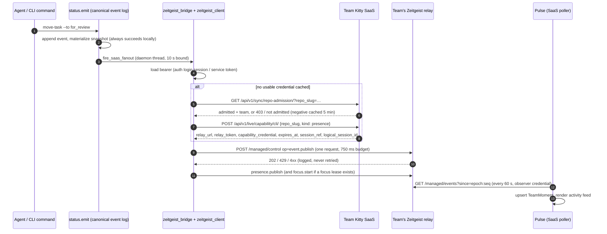

# Context: Team Kitty and Zeitgeist

**Read this before touching anything hosted.** It is the one-page model every
agent needs when work mentions the SaaS, moments, presence, readiness, auth,
`SPEC_KITTY_ENABLE_SAAS_SYNC`, or the word "sync". Written for the
agentic-framework-core-team persona; it mirrors the shipped code at the heads
cited at the bottom, and a disagreement between this page and the code is a
doc defect to fix here.

## The one-paragraph model

**Team Kitty** is the hosted product. **Zeitgeist** is a small, volatile
presence-and-moments relay that Team Kitty runs as one container per team.
The Spec Kitty CLI talks to the SaaS only to authenticate and to mint a
capability; it then publishes each status **moment** straight to the team's
relay in a single bounded HTTP request. The SaaS never receives moments over
HTTP: it polls the relay back ("Pulse") to build its activity feed. Nothing is
queued anywhere, nothing is persisted on the relay, and the only gates are
server-side: team membership plus the repository being admitted to that team.
There is no client-side opt-in, no consent grant, no offline queue, and no
daemon.

## "Sync" is dead

The transport called "sync" — a local daemon, an offline queue, a per-project
consent store, `spec-kitty sync opt-in`, `POST /api/v1/events/batch/` — was
deleted on both sides in August 2026:

- CLI: the `specify_cli.sync` package was removed with the sync transport
  surfaces (commit `66038e2a5`, 2026-08-25) and the convergence
  (PR #3881). `tests/architectural/test_no_retired_subsystems.py` refuses
  its return.
- SaaS: `apps/sync` was deleted (spec-kitty-saas #260, 2026-08-26). Every
  old `api/v1/sync/*`, `api/v1/events/*`, `api/v1/dossier/*` and `ws-token`
  path returns a permanent, request-blind **410 `legacy_ingress_retired`**
  (`spec_kitty_saas/retired_ingress.py`).

The word survives only as residue: an environment-variable prefix, a URL
prefix kept for one live endpoint, stale docs, and comments. When you read
"sync" in this repository, translate it: **the live thing is Zeitgeist.**
Do not design against, extend, or "re-enable" sync.

## Canonical vocabulary

| Term | Meaning | Do not say |
|---|---|---|
| **Team Kitty** | The hosted product (SaaS repo `spec-kitty-saas`, production `https://team.spec-kitty.ai`). | "the SaaS sync", "Spec Kitty Cloud" |
| **Team workspace** | The tenant container a person belongs to; a single-user tenant is a **private team workspace**. Naming ADR: saas `docs/adr/2026-08-02-team-kitty-canonical-product-name.md` (amended by saas PR #704). Code and the OpenAPI contract still say `teamspace`; treat that as a compatibility identifier, not a term (spec-kitty #3154). | "teamspace" in new prose |
| **Zeitgeist** | The presence-and-gossip relay (repo `EXPERIMENTAL-zeitgeist`). Runs in `managed` profile for Team Kitty; the CLI targets only that profile. | "the event server", "sync server" |
| **Relay** | One Zeitgeist container per team, provisioned by the SaaS on a team's first repository admission, idle-suspended and woken on demand. Volatile: a restart empties it. | |
| **Moment** | One content-agnostic, bounded status event published as `op: event.publish` with `{kind, ref?, attrs}`. The relay carries it and never interprets it. A moment is activity *about* a session, never liveness *of* one. | "sync event", "envelope" (the envelope is the wire wrapper) |
| **Presence** / **focus** | Liveness samples (`presence.publish`, TTL ≤ 90 s) and focus sessions (`focus.start/heartbeat/pause/end`). The CLI refreshes presence after each moment when it holds a lease. | |
| **Capability credential** | A signed statement of *what* a caller may do on one `(team, deployment, repo)`, kinds `presence` (also grants `event.publish`), `focus`, `operator`, `observer`. Minted by the SaaS, never by Zeitgeist. It is a capability, not an identity. | "API key", "token" (that is the separate bearer) |
| **Admission** | The SaaS-side decision that a repository belongs to a team (`TeamRepository` row on an enabled, healthy installation; one team per repo per provider). Membership plus admission is the whole gate. | "consent", "opt-in" |
| **Pulse** | The SaaS poller: every 60 s per admitted repo it mints an `observer` credential, reads `GET /managed/discover` and `GET /managed/events?since=<epoch>:<seq>`, and upserts `TeamMoment` rows keyed `(team, repo_slug, event_id)`. Retained for a rolling window, default 72 h. | |

Charter rule on the Zeitgeist side, which the CLI mirrors: **fail open on
availability, fail closed on identity.** An unreachable relay never blocks
canonical local persistence; a missing credential means no moment is sent.

## Sequence: one lane transition

Alt text: the CLI persists locally first, resolves a capability from the
SaaS only when it has none cached, publishes the moment directly to the
team's relay once without retry, and the SaaS learns about it by polling the
relay.

Publisher identity, lease generations, cache isolation, and the reader contract are
explained in [Zeitgeist publisher and lease identity](../architecture/zeitgeist-session-identity.md).

## Where the code lives (CLI)

| Step | Module |
|---|---|
| Canonical persistence, then fan-out | `src/specify_cli/status/emit.py` (`emit_status_transition` → `_saas_fan_out` → `fire_saas_fanout`) |
| Handler registry, 10 s bounded thread, in-flight de-dup | `src/specify_cli/status/adapters.py` (`ensure_zeitgeist_moment_handlers` registers the three moment handlers at import unless `SPEC_KITTY_SYNC_MINIMAL_IMPORT` is set) |
| Payload → attrs codec, offer, liveness refresh | `src/specify_cli/status/zeitgeist_bridge.py` (codec is the pinned `spec_kitty_events` package: `to_zeitgeist_attrs`, `zeitgeist_ref_for`) |
| Credential resolution, admission and mint gateway | `src/specify_cli/zeitgeist_client/resolution.py` ("team admission is the gate") and `credentials.py` (TOML store under the runtime state root) |
| Transport (`offer`, `presence`, `focus`), 750 ms budget, sanitizer | `src/specify_cli/zeitgeist_client/transport.py`, `budget.py`, `sanitizer.py` |
| Read side (`spec-kitty zeitgeist status|watch`, MCP `zeitgeist_status/watch`) | `zeitgeist_client/subscription.py`, `filtered_stream.py`, `mcp_stdio.py`; `[moments]` config in `moments.py` |
| Bearer for the SaaS calls | `src/specify_cli/saas_client/auth.py::load_auth_context` → env token, `.kittify/saas-auth.json`, or the `spec-kitty auth login` session via `auth/server_target.py` and the token manager |

Lifecycle moments (mission created, specify/plan/tasks beats, decision points,
op invocations) travel the same path through `fire_lifecycle_saas_fanout`. So
do the six runtime moments of `spec-kitty next` (run started/completed, step
issued/auto-completed, decision input requested/answered): the runtime journals
each transition to `run.events.jsonl`, and the producer the status seam
registers at the runtime emitter seam
(`src/specify_cli/events/runtime_moments.py`, #3929) publishes it with the
journal record's timestamp and an `event_id` derived from that record, so one
transition is one moment however often it is re-emitted.

## Where the code lives (SaaS and relay)

- Auth server: `apps/cli_auth` (`/oauth/authorize`, `/oauth/device`,
  `/oauth/token` incl. refresh, `/oauth/revoke`, `GET /api/v1/me`).
  `session_invalid` means re-authenticate; `access_token_expired` means
  refresh once.
- Capability mint for the CLI: `apps/live_capability/views.py`
  (`POST /api/v1/live/capability/cli/`), gates in `issuer.py`
  (team kill switch → membership → repository admission). Error codes:
  `not_member`, `repository_not_admitted`, `team_disabled`,
  `deployment_unavailable`, 503 `mint_failed` / `relay_wake_failed`.
- Admission preflight the CLI calls today: `apps/connectors/admission_views.py`
  (`GET /api/v1/sync/repo-admission/`) — deliberately kept on the retired
  prefix because `zeitgeist_client/resolution.py` names it.
- Relay tenancy, Pulse, retention, feed: `apps/live_capability/`
  (`auto_provisioning.py`, `pulse.py`, `models.py::TeamMoment`,
  `moment_presentation.py`).
- Relay wire contract: `EXPERIMENTAL-zeitgeist/zeitgeist/managed.py`,
  `managed_auth.py`, `zeitgeist/schemas/managed_*.schema.json`; executable
  end-to-end reference `bin/probe-managed-event-publish-hosted.sh`.
- Authoritative CLI contract: spec-kitty-saas `contracts/cli-saas-current-api.yaml`.

## What `SPEC_KITTY_ENABLE_SAAS_SYNC` still gates (and what it does not)

The moment path above is **not** gated by this flag. Moments go out by
default whenever a credential resolves. The flag still switches on four
leftovers. Two gate functions in `src/specify_cli/core/saas_sync_config.py`
read it: leftovers 1-2 check the bare `is_saas_sync_enabled()`, while leftover
3 checks `sync_active()` (`is_saas_sync_enabled()` **and** no
`SPEC_KITTY_SYNC_DISABLE` set) -- so `SPEC_KITTY_SYNC_DISABLE` lifts only
leftover 3, not the readiness nag, the tracker group, or `--from-ticket`:

1. the startup readiness/auth nag (`readiness/coordinator.py`);
2. the `tracker` command group and `mission create --from-ticket`;
3. `OWNED_SYNC_UNSUPPORTED`, a refusal of owned-checkout `move-task` /
   `mark-status` when the flag is on (`tasks_move_task.py`,
   `tasks_mark_status.py`) — a conservative guard added on 2026-09-02 in the
   dead vocabulary; an owned checkout publishes moments normally when the
   flag is off;
4. `SPEC_KITTY_SYNC_DISABLE` / `SPEC_KITTY_SYNC_MINIMAL_IMPORT` double as the
   pre-review-gate opt-out and the moment-handler import gate.

Retiring these names is tracked by spec-kitty #3980 under the launch gate
#1621 / #1091. Until then, name the sense when you touch them.

## Stale surfaces you will meet

Marked deprecated, describe the deleted transport, keep for history only:
`docs/architecture/team-kitty-saas.md`, `docs/operations/sync-drain.md`,
`docs/guides/project-sync-consent.md`, the 2.x/3.x sync ADRs. On the SaaS
side `docs/architecture/teamspace-compatibility-handshake.md` still says
"Production" but its code is gone, and `contracts/consumer-compatibility.json`
pins versions the SaaS no longer uses. Vestigial `ensure_sync_daemon` /
`ensure_daemon` parameters are threaded through `status/emit.py`,
`coordination/status_transition.py` and friends and read by nobody.

## Sources

Read at these heads on 2026-09-07: spec-kitty `d6e8fe423`,
EXPERIMENTAL-zeitgeist `9b6553e`, EXPERIMENTAL-spec-kitty-saas `93e2ad2`.
Related: ADR
[convergence retirement and client-repo inversion](../adr/3.x/2026-09-06-1-convergence-retirement-and-client-repo-inversion.md);
[system events](system-events.md) for the canonical event envelope;
[environment variables](../api/environment-variables.md).
