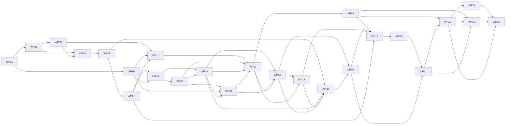

# Work Packages: Charter offering, activation presets and the doctrine-to-charter cutover

**Inputs**: `kitty-specs/charter-pack-cutover-01M491G6/` — [spec.md](spec.md), [plan.md](plan.md), [research.md](research.md), [data-model.md](data-model.md), [contracts/](contracts/), [quickstart.md](quickstart.md), [occurrence_map.yaml](occurrence_map.yaml)

**Tests**: required. C-006: WP01 writes every FR's acceptance test first as strict `xfail` naming the WP that turns it green; each later WP's first commit removes its own `xfail` markers (red), and the WP ends green (charter ATDD-first, C-011).

**Organization**: subtasks (`Txxx`) roll up into work packages (`WPxx`). Subtask rows are reference rows; record completion with `spec-kitty agent tasks mark-status <Txxx> --status done`.

**Per-WP test policy** (CLAUDE.md, `NO_FULL_HEAVY_SUITES_IN_MISSION`): `make test-fast`, the WP's own and touched-module tests, the owning subsystem directories (`tests/charter/` and `tests/doctrine/` whenever `src/charter/offering/**` changes), the acceptance tests the WP flips, and the specific architectural gate files it implicates. Never bare `tests/architectural/` or `make test-full`. `ruff check`, `ruff format --check --force-exclude <files>`, `mypy` on touched sources, and `pytest tests/architectural/test_no_legacy_terminology.py` before every push.

**Edits outside owned files**: a WP may edit a file owned by another WP only when the two cannot run in parallel lanes, i.e. one is a (transitive) dependency of the other. Record each such file with a one-line rationale under "Mechanical edits outside owned_files" in the Activity Log. Never edit a file owned by a WP that can run in a parallel lane. Ownership guards parallel lanes; sequential follow-up edits are expected.

**Generated files have no owner** (no WP lists them in `owned_files`): `packs/built-in/pack-manifest.yaml`, `src/specify_cli/_completion_manifest.json`, `docs/api/cli-commands.md`, `docs/development/docs-retrieval-index.yaml`, regen fixtures and similar outputs are regenerated with their tool (`spec-kitty charter pack regenerate-graph` / `spec-kitty doctrine regenerate-graph` before WP15, the completion and docs generators) by whichever WP changes their inputs, and committed. Never hand-merge them; on a conflict, regenerate.

**Version**: no WP bumps `pyproject.toml`'s version (unreleased rc; changelog entries go under Unreleased). The cutover migration targets the current version, `4.0.0rc6` (`m_4_0_0rc6_charter_pack_cutover.py`). The CLAUDE.md "`__init__.py` change needs a version bump" rule is satisfied by the WP24 changelog entry.

## Subtask Index

| ID | Description | WP | Parallel |
|---|---|---|---|
| T001 | Acceptance suite scaffold: package, CLI/fixture helpers, `pending_until(wp)` strict-xfail helper | WP01 | |
| T002 | Legacy fixture-project builders (NFR-001 list) | WP01 | [P] |
| T003 | Golden "before" generator, run at base, frozen JSON + base SHA | WP01 | |
| T004 | Preset acceptance tests (FR-001..FR-004, FR-019, US1, SC-001) | WP01 | [P] |
| T005 | Upgrade acceptance tests (FR-012, NFR-001, NFR-004, US2, SC-002) | WP01 | [P] |
| T006 | CLI-surface acceptance tests (FR-005..FR-007, FR-011, US3, SC-004) | WP01 | [P] |
| T007 | Promotion acceptance tests (FR-015, US5) | WP01 | [P] |
| T008 | Rename/skills/glossary acceptance tests (FR-008..FR-010, FR-013, FR-014, US4) | WP01 | [P] |
| T009 | Gate, latency and messaging acceptance tests (FR-016..FR-018, NFR-002, NFR-003, SC-003, SC-005) | WP01 | [P] |
| T010 | Traceability test: every spec id covered; every `pending_until` names a real WP | WP01 | |
| T011 | `kernel/charter_pack_paths.py` replaces `kernel/doctrine_root.py` | WP02 | |
| T012 | Move `_layer_roots` to `charter.activation.layer_roots`; project root = pack root | WP02 | |
| T013 | Repoint READ sites in `kernel`, `charter`, `runtime` | WP02 | [P] |
| T014 | Repoint READ sites in `specify_cli` | WP02 | [P] |
| T015 | Tests for the kernel module and moved layer roots | WP02 | |
| T016 | Repoint synthesizer WRITE sites | WP03 | |
| T017 | Repoint project registration, seeding, scaffold and applier WRITE sites | WP03 | [P] |
| T018 | State contract entry, repo `.gitignore` rules, `ci-router.yml` path filter | WP03 | [P] |
| T019 | FR-016 path-authority gate with planted self-tests | WP03 | |
| T020 | `charter synthesize` writes to the new root (CLI test) and flip WP01 FR-016 xfails | WP03 | |
| T021 | Prep: hash helpers and `org_extends` to offering; `absorb_synthesis_manifest` to activation | WP04 | |
| T022 | Prep: OrgCharterPolicy steps behind hooks; pure manifest writer out of `snapshot` | WP04 | |
| T023 | Move pack model/tooling to `charter.offering.packs` | WP04 | |
| T024 | `charter.packs` facade; `charter.drg` exports; repoint `specify_cli` importers | WP04 | |
| T025 | Move tests mirroring the moved modules; run gates | WP04 | |
| T026 | Move org charter composition to `charter.activation` (fold `config.py`) | WP05 | |
| T027 | Move adapters to `specify_cli.charter_packs` | WP05 | [P] |
| T028 | Delete `specify_cli/doctrine/`; boundary exemption deleted; census/roster/pyproject updates | WP05 | |
| T029 | Move tests; flip WP01 FR-010 package xfails | WP05 | |
| T030 | Public effective-set seam `charter.activation.effective_set` | WP06 | |
| T031 | Fail-closed promotion in `promote_activations` | WP06 | |
| T032 | Repoint the four callers; interview stops importing a migration module | WP06 | |
| T033 | Delete `merge_defaults` / `_load_default_pack` | WP06 | |
| T034 | Unit tests; flip FR-015 xfails | WP06 | |
| T035 | Preset JSON schema (kinds derived from `ArtifactKind`) | WP07 | |
| T036 | Preset model + discovery across built-in, org chain, fetched packs | WP07 | |
| T037 | Built-in `presets/default.yaml` and `minimal.yaml` (fixed kind gate) | WP07 | |
| T038 | Validator: presets in `charter pack validate` / `charter org validate`; manifest hashes presets | WP07 | |
| T039 | `charter org init` scaffolds an example preset | WP07 | [P] |
| T040 | Tests; regenerate pack manifest; flip FR-002/FR-019 xfails | WP07 | |
| T041 | Preset application engine (replace semantics, org union, diff, atomic write) | WP08 | |
| T042 | `charter activate --pack/--preset` wiring and flag rules | WP08 | |
| T043 | `charter pack list` (packs + presets, `project` row) and `charter pack path <pack>` | WP08 | [P] |
| T044 | Error codes `PRESET_NOT_FOUND`, `PACK_NOT_FOUND`, `PRESET_ID_UNRESOLVED`, `PRESET_WOULD_OVERWRITE` | WP08 | |
| T045 | Tests incl. NFR-003 timing; flip FR-001/FR-004 xfails | WP08 | |
| T046 | Mission-type provisioning reads the `default` preset (`init`, `charter generate`, upgrade) | WP09 | |
| T047 | `DefaultPresetMissingError` / `DEFAULT_PRESET_MISSING` replaces `DefaultCharterPackMissingError` | WP09 | |
| T048 | Repoint remaining `default.yaml` readers from the research inventory | WP09 | |
| T049 | Tests with the positive control; flip FR-003 xfails | WP09 | |
| T050 | `runs_first` on `BaseMigration`, applied in `get_applicable` | WP10 | |
| T051 | Neutralise rc35, normalizer and glossary-context skill migrations | WP10 | |
| T052 | Remove module-level imports of to-be-deleted modules from older migrations | WP10 | [P] |
| T053 | `m_3_1_1_charter_rename` and finalize migration fixes | WP10 | [P] |
| T054 | Tests: ordering, chain integrity, neutralised migrations recorded as skipped | WP10 | |
| T055 | Cutover migration skeleton: `detect()`, shared legacy predicate, result/summary plumbing | WP11 | |
| T056 | Config-key rewrites (org packs incl. single-pack and `organisation_packs`, governance, tracker, answers) | WP11 | |
| T057 | `doctrine_pack_id` → `charter_pack_id` in project activation entries | WP11 | [P] |
| T058 | Project-root move with collision preflight; path-reference rewrites; `.gitignore` | WP11 | |
| T059 | Run the migration on this repository (`.kittify/doctrine/` → `.kittify/charter-packs/`) | WP11 | |
| T060 | Tests per inventory row; flip FR-012 xfails for these rows | WP11 | |
| T061 | Frozen snapshot data module from `research/default-yaml-snapshots.yaml` | WP12 | |
| T062 | Stale-list, kind-gate and `[]` resets with per-key report lines | WP12 | |
| T063 | Installed-skill removal (manifested and hash-matched; edited copies kept) | WP12 | |
| T064 | Upgrade summary rendering; dry-run parity | WP12 | |
| T065 | NFR-001 / NFR-004 / pre-rc35 green; flip remaining FR-012 xfails | WP12 | |
| T066 | Delete `charter_pack_registry`, `src/charter/activation/packs/`, `default_pack` | WP13 | |
| T067 | Delete `charter pack apply` | WP13 | |
| T068 | Retire `accompanies_doctrine_pack`; `RETIRED_PACK_FIELD` rejection | WP13 | |
| T069 | Tests; flip FR-005 xfails | WP13 | |
| T070 | Remove legacy key/path fallbacks and compat warnings | WP14 | |
| T071 | Tracker CR-03 removal (`doctrine` key, `--doctrine-mode`, `doctrine_mode`) | WP14 | [P] |
| T072 | CLI-root `LEGACY_CHARTER_STATE` gate | WP14 | |
| T073 | `load_governance_config` fails closed on legacy keys | WP14 | |
| T074 | Delete shim tests; flip FR-011 xfails | WP14 | |
| T075 | Move shared handlers out of `doctrine.py` into `charter/` | WP15 | |
| T076 | `charter pack validate/assemble/regenerate-graph/asset` homes | WP15 | |
| T077 | `charter consistency-check`; `doctor charter-packs` | WP15 | |
| T078 | In-repo callers: `packs.yml`, `Makefile`, `generated_by`, AGENTS.md, `packs/internal`, remediation strings | WP15 | |
| T079 | Tests; regenerate completion manifest and pack manifest; flip FR-006 xfails | WP15 | |
| T080 | Delete the `doctrine` group and its command modules | WP16 | |
| T081 | Rewrite the #4836 guidance gate as a removed-command gate | WP16 | |
| T082 | Delete group tests; flip FR-007 xfails | WP16 | |
| T083 | `ActiveCharterManager`, `ActiveCharterConfigError` | WP17 | |
| T084 | `ACTIVE_CHARTER_CONFIG_INVALID`; golden; `ERROR_CODES.md` | WP17 | |
| T085 | `charter_pack_id` in models, schemas, org-charter `schema_version` bump, validator message | WP17 | |
| T086 | `ToolSurfaceKind.CHARTER_SKILL` | WP17 | [P] |
| T087 | Tests; flip FR-009 xfails | WP17 | |
| T088 | Skill renames and folds (seven `spk-*`, five folded) | WP18 | |
| T089 | `RETIRED_CANONICAL_SKILL_NAMES`; skill manifests; references in prompts/skills | WP18 | |
| T090 | Regenerate derived files (`docs/api/skills/*`, regen fixtures, completion manifest) | WP18 | |
| T091 | Tests; flip FR-008 xfails | WP18 | |
| T092 | R1 rename: offering, facades, kernel identifiers | WP19 | |
| T093 | R1 tests follow | WP19 | |
| T094 | R1 docstrings/prose (tier sense only) | WP19 | |
| T095 | R2 rename: activation identifiers (`DoctrineService` homonym resolved) | WP20 | |
| T096 | R2 module renames (`_doctrine_paths`, `doctrine_service_builder`, `action_doctrine_bundle`) | WP20 | |
| T097 | R2 tests and docstrings | WP20 | |
| T098 | R3 rename: `specify_cli` command modules and neighbours | WP21 | |
| T099 | R4 rename: migrations bodies (ids kept), synthesizer applier, `doctrine_service_factory`, gates | WP21 | |
| T100 | R3/R4 tests and pyproject entries | WP21 | |
| T101 | Built-in pack prose (tier sense; content sense kept) | WP22 | |
| T102 | Living docs prose and `charter-pack-usage-journey` | WP22 | [P] |
| T103 | AGENTS.md / CLAUDE.md and `packs/internal` prose | WP22 | [P] |
| T104 | Regenerate pack manifests and CLI reference | WP22 | |
| T105 | `tests/doctrine/` → `tests/charter_offering/`; references in CLAUDE.md, pyproject, CI | WP23 | |
| T106 | Residual test identifiers | WP23 | |
| T107 | Glossary terms, retirements and "active" guard; ADR 2026-08-22-2 citations | WP24 | |
| T108 | Changelog Unreleased Before/After | WP24 | |
| T109 | Runbook `docs/migrations/charter-pack-cutover.md`; historical banners | WP24 | |
| T110 | Flip FR-013/FR-017 xfails | WP24 | |
| T115 | Draft the public-packs sidecar PR (OD-2); the orchestrator opens it after merge | WP24 | [P] |
| T111 | FR-018 vocabulary gate (closed token and root lists, floor, planted tests) | WP25 | |
| T112 | Reachability pins re-asserted or deleted with reasons | WP25 | |
| T113 | NFR-002 gate closeout (empty allowlists; shim tests deleted) | WP25 | |
| T114 | Final traceability: zero `pending_until` markers remain | WP25 | |

---

## Phase 0 — Acceptance first

## Work Package WP01: Acceptance suite and golden "before" sets (Priority: P0)

**Goal**: every FR, measurable NFR and SC becomes a test before implementation (C-006); NFR-001's "before" sets are frozen while the pre-cutover code still reads legacy projects.
**Independent Test**: the suite collects; every test that targets unbuilt behaviour is a strict xfail naming its WP; the traceability test passes.
**Prompt**: `tasks/WP01-acceptance-suite.md`
**Requirement Refs**: C-006, NFR-001, all FRs and SCs (as test owner)
**Estimated prompt size**: ~650 lines

### Included Subtasks

T001 Acceptance suite scaffold (WP01)
T002 Legacy fixture-project builders (WP01)
T003 Golden "before" generator and frozen sets (WP01)
T004 Preset acceptance tests (WP01)
T005 Upgrade acceptance tests (WP01)
T006 CLI-surface acceptance tests (WP01)
T007 Promotion acceptance tests (WP01)
T008 Rename/skills/glossary acceptance tests (WP01)
T009 Gate, latency and messaging acceptance tests (WP01)
T010 Traceability test (WP01)

### Dependencies

- None (starting package).

### Risks & Mitigations

- A test that passes vacuously: every assertion has a positive control on the same fixture; strict xfail catches accidental passes.
- Golden sets generated with post-cutover code: the generator records the base SHA and refuses to run once `kernel/doctrine_root.py` is gone.

---

## Phase 1 — Foundations (paths, package split)

## Work Package WP02: Kernel pack paths and read-side cutover (Priority: P1)

**Goal**: one kernel module names the project pack root and pack-relative paths; every reader resolves through it; layer-root resolution lives in `charter`.
**Independent Test**: kernel/layer-root unit tests; touched readers' tests green; legacy read fallback still works (removed in WP14).
**Prompt**: `tasks/WP02-kernel-pack-paths-read-side.md`
**Requirement Refs**: FR-016, C-007
**Estimated prompt size**: ~400 lines

T011 `kernel/charter_pack_paths.py` (WP02)
T012 `charter.activation.layer_roots` (WP02)
T013 READ sites in kernel/charter/runtime (WP02)
T014 READ sites in specify_cli (WP02)
T015 Tests (WP02)

**Dependencies**: WP01.

## Work Package WP03: Write-side cutover and path-authority gate (Priority: P1)

**Goal**: every writer targets `.kittify/charter-packs/`; the FR-016 gate forbids a `"doctrine"` segment joined to `.kittify` anywhere in `src/`.
**Independent Test**: `charter synthesize` on a migrated fixture writes under `.kittify/charter-packs/` and creates no `.kittify/doctrine/`; gate planted tests red.
**Prompt**: `tasks/WP03-write-side-cutover-and-path-gate.md`
**Requirement Refs**: FR-016
**Estimated prompt size**: ~400 lines

T016 Synthesizer writers (WP03)
T017 Registration/seeding/scaffold/applier writers (WP03)
T018 State contract, `.gitignore`, `ci-router.yml` (WP03)
T019 FR-016 gate (WP03)
T020 CLI synthesize test; flip xfails (WP03)

**Dependencies**: WP02.

## Work Package WP04: Package split I — pack model and tooling to `charter.offering.packs` (Priority: P1)

**Goal**: prep moves that respect the offering→activation import ban, then the pack model/tooling move behind a new `charter.packs` facade.
**Independent Test**: `test_charter_offering_does_not_import_activation.py`, boundary, census and layer-rule gates green; moved modules' tests green.
**Prompt**: `tasks/WP04-package-split-pack-tooling.md`
**Requirement Refs**: FR-010, C-007
**Estimated prompt size**: ~450 lines

T021–T025 (WP04)

**Dependencies**: WP02, WP03 (both edit synthesizer manifest, project registration and the doctrine command module).

## Work Package WP05: Package split II — org charter, adapters, delete `specify_cli.doctrine` (Priority: P1)

**Goal**: finish OD-9; delete the old package and its boundary exemption (not moved).
**Independent Test**: `specify_cli.doctrine` not importable; boundary/census/roster gates green with empty exemptions.
**Prompt**: `tasks/WP05-package-split-org-charter-adapters.md`
**Requirement Refs**: FR-010, C-007, NFR-002
**Estimated prompt size**: ~400 lines

T026–T029 (WP05)

**Dependencies**: WP04.

---

## Phase 2 — Presets and promotion

## Work Package WP06: Effective-set seam and fail-closed promotion (Priority: P1)

**Goal**: #4400 — promotion of an absent key seeds from the effective set and never narrows.
**Prompt**: `tasks/WP06-effective-set-seam.md`
**Requirement Refs**: FR-015, C-007
**Estimated prompt size**: ~400 lines

T030–T034 (WP06)

**Dependencies**: WP05, WP10, WP17 (WP10 neutralises the normalizer, whose `[]` writes would otherwise narrow the FR-015 upgrade row; WP17's `ActiveCharterManager` is used). WP06 deletes `load_default_pack_activation_ids` once its last caller is gone (`test_no_dead_symbols`); WP09 deletes the `default_pack` module.

## Work Package WP07: Preset format, discovery and built-in presets (Priority: P1)

**Goal**: presets are pack data with a documented, validated schema, discovered from any pack.
**Prompt**: `tasks/WP07-preset-format-and-builtin-presets.md`
**Requirement Refs**: FR-002, FR-004, FR-019
**Estimated prompt size**: ~500 lines

T035–T040 (WP07)

**Dependencies**: WP05, WP06 (C-008: FR-015 before FR-002).

## Work Package WP08: `charter activate --preset` and `charter pack list/path` (Priority: P1)

**Goal**: apply a preset with replace semantics; list packs and presets.
**Prompt**: `tasks/WP08-activate-preset-and-pack-list.md`
**Requirement Refs**: FR-001, FR-004, NFR-003, SC-001
**Estimated prompt size**: ~450 lines

T041–T045 (WP08)

**Dependencies**: WP06, WP07.

## Work Package WP09: Provisioning reads the `default` preset (Priority: P1)

**Goal**: `init`, `charter generate` and upgrade provisioning read mission types from the built-in `default` preset; no other reader of `default.yaml` remains except the migration's frozen data.
**Prompt**: `tasks/WP09-provisioning-from-default-preset.md`
**Requirement Refs**: FR-003, FR-005
**Estimated prompt size**: ~300 lines

T046–T049 (WP09)

**Dependencies**: WP07, WP08 (the FR-003 init-vs-preset test drives `charter activate --preset default`), WP10 (WP10 edits WP09's `test_init_provisioning.py`).

---

## Phase 3 — Upgrade migration

## Work Package WP10: Migration framework — run-first ordering and neutralised migrations (Priority: P1)

**Prompt**: `tasks/WP10-migration-framework.md`
**Requirement Refs**: FR-012, C-008
**Estimated prompt size**: ~350 lines

T050–T054 (WP10)

**Dependencies**: WP01.

## Work Package WP11: Cutover migration I — keys, project root, path references (Priority: P1)

**Prompt**: `tasks/WP11-cutover-migration-keys-and-paths.md`
**Requirement Refs**: FR-012, NFR-004
**Estimated prompt size**: ~550 lines

T055–T060 (WP11)

**Dependencies**: WP03, WP10, WP17 (the model reads `charter_pack_id` before the migration writes it). Removals and moves route through `specify_cli.asset_preservation` (destructive-op ownership gates).

## Work Package WP12: Cutover migration II — stale lists, resets, skills, summary (Priority: P1)

**Prompt**: `tasks/WP12-cutover-migration-resets-and-summary.md`
**Requirement Refs**: FR-012, NFR-001, NFR-004, SC-002
**Estimated prompt size**: ~500 lines

T061–T065 (WP12)

**Dependencies**: WP07, WP08 (its delete-capable activation writer), WP09 (WP09 edits WP12's `upgrade.py`), WP11.

---

## Phase 4 — Removal (no aliases, no shims)

## Work Package WP13: Retire the preset registry and the descriptor field (Priority: P1)

**Prompt**: `tasks/WP13-retire-preset-registry.md`
**Requirement Refs**: FR-005, C-001
**Estimated prompt size**: ~300 lines

T066–T069 (WP13). T066 confirms `default_pack` is gone (deleted by WP06/WP09) and deletes the registry and `src/charter/activation/packs/`; T068 adds `accompanies_doctrine_pack` to WP17's `retired_fields.py`.

**Dependencies**: WP08, WP09, WP12.

## Work Package WP14: Remove read-side shims; CLI-root legacy gate (Priority: P1)

**Prompt**: `tasks/WP14-remove-shims-and-legacy-gate.md`
**Requirement Refs**: FR-011, C-001
**Estimated prompt size**: ~450 lines

T070–T074 (WP14)

**Dependencies**: WP12, WP13 (WP13 edits WP14's `org_pack_config.py`).

## Work Package WP15: Charter homes for every doctrine command (Priority: P1)

**Prompt**: `tasks/WP15-charter-command-homes.md`
**Requirement Refs**: FR-006, SC-004
**Estimated prompt size**: ~450 lines

T075–T079 (WP15)

**Dependencies**: WP05, WP08, WP13, WP14 (shared `charter/pack.py` and doctor tests).

## Work Package WP16: Remove the `spec-kitty doctrine` group (Priority: P1)

**Prompt**: `tasks/WP16-remove-doctrine-group.md`
**Requirement Refs**: FR-007, C-001
**Estimated prompt size**: ~250 lines

T080–T082 (WP16)

**Dependencies**: WP13, WP15.

---

## Phase 5 — Names

## Work Package WP17: Three meanings, three names; `charter_pack_id` (Priority: P2)

**Prompt**: `tasks/WP17-three-names-and-charter-pack-id.md`
**Requirement Refs**: FR-009, FR-010
**Estimated prompt size**: ~400 lines

T083–T087 (WP17)

**Dependencies**: WP05. Runs after WP05 and before every WP that uses its names (WP06, WP11 and their descendants); it never waits for a later WP; creates `src/charter/offering/packs/retired_fields.py` (`RETIRED_PACK_FIELD`, `doctrine_pack_id` entry).

## Work Package WP18: Skill families (Priority: P2)

**Prompt**: `tasks/WP18-skill-families.md`
**Requirement Refs**: FR-008
**Estimated prompt size**: ~400 lines

T088–T091 (WP18)

**Dependencies**: WP12.

## Work Package WP19: Identifier rename R1 — offering, facades, kernel (Priority: P2)

**Prompt**: `tasks/WP19-rename-offering-facades-kernel.md`
**Requirement Refs**: FR-010
**Estimated prompt size**: ~300 lines

T092–T094 (WP19)

**Dependencies**: WP14, WP16, WP17, WP18 (WP19 edits skill prose WP18 owns).

## Work Package WP20: Identifier rename R2 — activation (Priority: P2)

**Prompt**: `tasks/WP20-rename-activation.md`
**Requirement Refs**: FR-010
**Estimated prompt size**: ~350 lines

T095–T097 (WP20)

**Dependencies**: WP19.

## Work Package WP21: Identifier rename R3/R4 — specify_cli, migrations, gates (Priority: P2)

**Prompt**: `tasks/WP21-rename-specify-cli-and-gates.md`
**Requirement Refs**: FR-010
**Estimated prompt size**: ~350 lines

T098–T100 (WP21)

**Dependencies**: WP16, WP20.

## Work Package WP22: Prose in packs and living docs (Priority: P2)

**Prompt**: `tasks/WP22-prose-packs-and-docs.md`
**Requirement Refs**: FR-010
**Estimated prompt size**: ~300 lines

T101–T104 (WP22)

**Dependencies**: WP18, WP21.

## Work Package WP23: Rename `tests/doctrine/` (Priority: P3)

**Prompt**: `tasks/WP23-rename-tests-doctrine-directory.md`
**Requirement Refs**: FR-010
**Estimated prompt size**: ~200 lines

T105–T106 (WP23)

**Dependencies**: WP18, WP21, WP22 (AGENTS.md and tests WP18 edits).

---

## Phase 6 — Messaging and closeout

## Work Package WP24: Glossary, changelog and runbook (Priority: P2)

**Prompt**: `tasks/WP24-glossary-changelog-runbook.md`
**Requirement Refs**: FR-013, FR-017, SC-005
**Estimated prompt size**: ~300 lines

T107–T110, T115 (WP24)

**Dependencies**: WP22.

## Work Package WP25: Vocabulary gate, reachability pins, gate closeout (Priority: P1)

**Prompt**: `tasks/WP25-vocabulary-gate-and-closeout.md`
**Requirement Refs**: FR-014, FR-018, NFR-002, SC-003
**Estimated prompt size**: ~350 lines

T111–T114 (WP25)

**Dependencies**: WP22, WP23, WP24.

---

## Dependency graph

**Parallel opportunities**: WP10 runs beside WP02–WP05 and WP17; WP06/WP07/WP08/WP09 run beside WP11; WP18 runs beside WP13–WP16; WP23 runs beside WP24.
**MVP**: WP01 (the suite is the contract every other WP is measured against).
