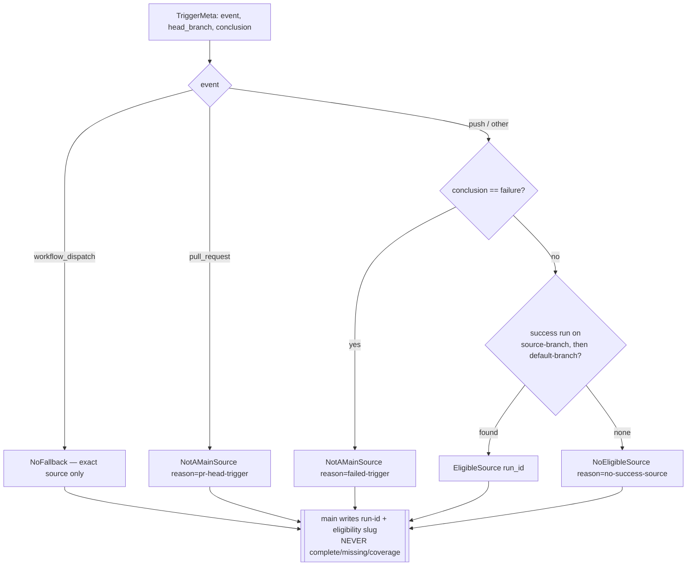

# Implementation Plan: CI Aggregate Source-Eligibility (main-verdict provenance)

**Branch**: `fix/ci-aggregate-source-eligibility` | **Date**: 2026-09-16 | **Spec**: [spec.md](./spec.md)
**Input**: Feature specification from `kitty-specs/ci-aggregate-source-eligibility-01M2MFDD/spec.md`

## Summary

Extract the untested, provenance-blind inline-shell source-selection logic in `.github/workflows/ci-aggregate.yml` (the `last-success` step) into a **pure, red-first-tested Python surface** `scripts/ci/source_eligibility.py`. The surface classifies triggering-run provenance (a `pull_request`/`failed` trigger is *not* a legitimate `main` source), resolves an eligible `status=success` source on `{source-branch ∪ default-branch}` or a **named** reason (never a silent `[]`), and preserves `workflow_dispatch`'s no-fallback rule. The fail-closed guard and `reconcile_shards.py` `must_be_fresh` are byte-unchanged. This is the ADR's named "one genuine pytest red-first entry point." Two verified premise-falsifications (ADR mechanism outdated; the `main`-labelled failure is cosmetic/unconsumed) are recorded and the ADR is annotated — so #4360-A is delivered honestly as **tested provenance hardening**, not a release-authority correctness fix (there is no consumed false-red to remove). Detail: [research.md](./research.md).

## Technical Context

**Language/Version**: Python 3.11+ (standard library only — `argparse`, `json`, `re`, `sys`; mirrors `scripts/ci/select_source_artifacts.py`)
**Primary Dependencies**: None new. `gh` + `jq` at the workflow edge already exist; no PyPI/registry change (DIRECTIVE_051 supply-chain check → N/A, explicit no-op — see research D-07)
**Storage**: N/A — reads injected JSON (trigger metadata + candidate run-list), writes `key=value` to `GITHUB_OUTPUT`/stdout
**Testing**: `pytest` under `tests/ci/` — red-first unit tests over injected inputs (6 named branches) + one execution-grounded wiring guard (mirrors `tests/ci/test_aggregate_source.py:146-153`)
**Target Platform**: GitHub Actions `ubuntu-latest` (the `main`-context CI Aggregate workflow) + local `pytest`
**Project Type**: single (CI tooling: `scripts/ci/` + `tests/ci/` + one `.github/workflows/` step edit)
**Performance Goals**: N/A — one `gh run list` at the edge; the pure decision is O(candidate runs), trivially bounded
**Constraints**: fail-closed guard (`ci-aggregate.yml` ~:292-299) + `reconcile_shards.py` `must_be_fresh` byte-unchanged; helper writes only `run-id` + named reason (never `complete`/`missing`/`coverage`); no edits to `ci-router.yml`/`ci-fleet-verdict.yml` or the PR diff-cover path/`collect.if`
**Scale/Scope**: ~1 new script (≈80 LOC) + 1 test file (6 branch cases + wiring guard) + 1 workflow-step rewrite + ADR annotation

## Constitution / Charter Check

*GATE: pass before Phase 0, re-check after Phase 1.*

| Charter principle | Status |
|---|---|
| Single canonical authority | ✅ `reconcile_shards.py` stays the sole completeness authority (C-003); the helper only resolves a source run-id. No second authority introduced. |
| Architectural alignment / bounded contexts (DIRECTIVE_001/031) | ✅ New module, distinct from `aggregate_source.py` (git materialization) and `reconcile_shards.py` (completeness). Source-eligibility is its own git-free, ledger-keyed responsibility. |
| ATDD-first / red-first (C-011) | ✅ Unit tests red-first over injected inputs; execution-grounded wiring guard. Honest about YAML-only wiring (research D-05). |
| No green-path widening / honesty (ADR 2026-07-17-1) | ✅ Success-only + branch-scoped filters preserved; helper never writes completeness; guard byte-unchanged. No false-green channel (research D-04, INV-1/4). |
| Locality of change / small diff (DIRECTIVE_024) | ✅ One step rewrite + one module + tests; guard and reconciler untouched. |
| Decision documentation (DIRECTIVE_003/010) | ✅ Two premise-falsifications recorded (research D-01/D-02); ADR annotated (FR-007). Spec written against live mechanism. |
| Terminology canon | ✅ "Mission", "main verdict" senses disambiguated in spec Domain Language. |

No violations → Complexity Tracking empty.

## Project Structure

### Documentation (this mission)

```
kitty-specs/ci-aggregate-source-eligibility-01M2MFDD/
├── plan.md              # this file
├── research.md          # Phase 0 — premise-falsifications + design decisions + adversarial ledger
├── data-model.md        # Phase 1 — SourceDecision value objects + provenance inputs
├── quickstart.md        # Phase 1 — how to run/test the surface
├── contracts/
│   └── source-eligibility.contract.md   # the pure-decision + workflow-wiring contract
└── tasks.md             # Phase 2 (/spec-kitty.tasks — NOT created here)
```

### Source Code (repository root)

```
scripts/ci/
├── source_eligibility.py         # NEW — pure provenance/eligibility decision + gh-at-the-edge main()
├── select_source_artifacts.py    # TEMPLATE (unchanged) — pure-decision + edge-injection pattern to mirror
├── reconcile_shards.py           # FROZEN — must_be_fresh completeness authority (C-001/C-003)
└── aggregate_source.py           # UNCHANGED — prepare_source (distinct concern)

tests/ci/
├── test_source_eligibility.py    # NEW — 6 red-first branch cases + execution-grounded wiring guard
└── test_aggregate_source.py      # wiring-guard template (unchanged)

.github/workflows/
└── ci-aggregate.yml              # the `last-success` step (~:171-202) rewritten to call the helper;
                                  # fail-closed guard (~:292-299) BYTE-UNCHANGED

docs/adr/3.x/
└── 2026-09-15-1-ci-main-verdict-topology.md   # #4360-A section annotated (FR-007)
```

**Structure Decision**: single-project CI tooling. The new surface lives beside its siblings in `scripts/ci/` with mirrored tests in `tests/ci/`, following the shipped #4360-B extraction pattern (`reconcile_shards.py` + `test_reconcile_shards.py`).

## Design (Phase 1 summary — full contract in `contracts/`)

**Pure decision** (git-free, no network):
`resolve_source(trigger: TriggerMeta, candidates: CandidateRuns, default_branch: str) -> SourceDecision`



**Edge (`main()`)**: parse injected JSON (`--trigger`, candidate run-list from `gh run list --json ...` piped in), call `resolve_source`, print `run-id=<id|"">` and `eligibility=<slug>`. Named `ValueError` only for *malformed* inputs (mirrors `select_source_artifacts.py`); a legitimate no-source is a named empty result, not an exception (NFR-004 — reconcile stays the fail-closed terminus).

**Workflow wiring**: the `last-success` step's `run:` block replaces inline `gh run list ... || true` with `gh run list --json databaseId,conclusion,headBranch,event ... | python3 scripts/ci/source_eligibility.py --trigger "$TRIGGER_JSON"`, emitting `run-id` to `$GITHUB_OUTPUT` exactly as today so `download-previous` (`if: run-id != ''`) and `reconcile` are unchanged.

## Parallel Work Analysis

### Dependency Graph

```
WP01 (surface + unit tests) ──▶ WP02 (workflow wiring + execution-grounded guard)
WP03 (ADR annotation + doctrine record) ── independent
```

### Work Distribution (logical WPs — /spec-kitty.tasks slices; finalize computes lanes by write-scope)

- **WP01 — Pure source-eligibility surface (FR-001/002/003/005/006, NFR-003, D-04)**: `scripts/ci/source_eligibility.py` + `tests/ci/test_source_eligibility.py` red-first for all 6 named branches (assert the rejections). Owns `scripts/ci/`, creates `tests/ci/test_source_eligibility.py`.
- **WP02 — Workflow wiring + non-fakeable proof (FR-008, NFR-004, C-001/C-002/C-003, D-05)**: rewrite the `last-success` step to invoke the helper; add the execution-grounded wiring guard + the guard-byte-unchanged pin to `tests/ci/test_source_eligibility.py`. Owns `.github/workflows/ci-aggregate.yml`. Depends on WP01 (the shipped module must exist to wire+prove). Shares `tests/ci/test_source_eligibility.py` with WP01 → likely same lane.
- **WP03 — ADR annotation + record (FR-007, SC-004, D-01/D-02)**: annotate `docs/adr/3.x/2026-09-15-1-...md` #4360-A with both verified corrections. Owns `docs/adr/`. Independent write-scope → own lane, parallelizable.

### Coordination Points

- WP02 is gated on WP01's shipped module (the wiring guard executes it). WP03 is independent.
- Integration proof (C-005): after merge, verify on the merged main tip that a real push-main aggregate resolves an eligible source and a PR-head aggregate is classified not-a-main-source (NFR-002 spot check).
- **Pre-PR gates** (hard-won): `pytest tests/ci/test_source_eligibility.py` (red-first + wiring); `ruff check .` AND `ruff format --check .` (separate gates); `pytest tests/architectural/test_no_legacy_terminology.py`; run `actionlint` (download binary — not installed) on the touched workflow and paste raw output; any `contracts/*.md` ```yaml block carries a `# round-trip: skip:` marker.
