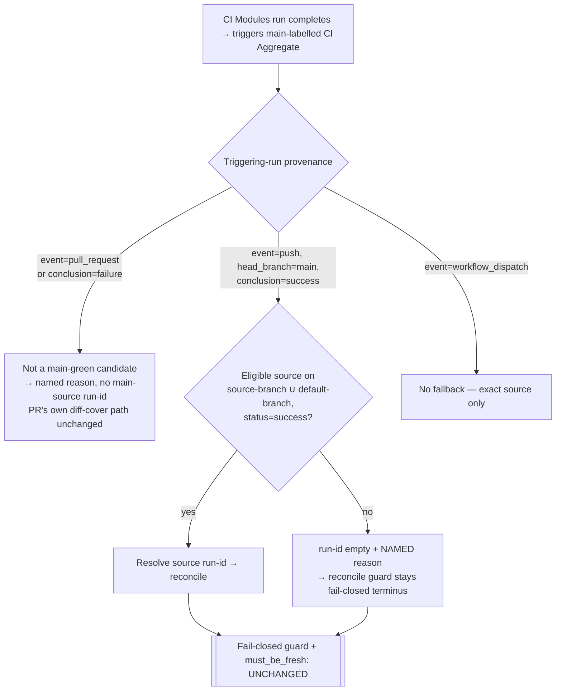

# Mission Specification: CI Aggregate Source-Eligibility (main-verdict provenance)

**Mission Branch**: `fix/ci-aggregate-source-eligibility`
**Created**: 2026-09-16
**Status**: Draft
**Input**: Stage 2 of the ratified CI "main-tip verdict topology" cluster (ADR `docs/adr/3.x/2026-09-15-1`, epic #4437). ADR Axis 3a (#4360-A) at operator-ratified **Scope B** (provenance source-eligibility), honestly re-scoped after two verified premise-falsifications (see Context). Foundation: `work/ci-honesty-4437/stage2-squad-adjudication.md`.

## Context (why this mission exists — after verifying the premise)

`main`'s CI status is the release-authority signal (ADR `2026-07-17-1`): green must mean *actually proven*, red must mean a *real regression*. This mission hardens the CI Aggregate **source-selection** decision that feeds coverage evidence, and corrects the doctrine record for #4360-A.

**Two premise-falsifications, both verified live (2026-09-16) — the honest basis for this mission:**

1. **The ADR's stated cause is factually wrong post-Stage-1.** The ADR (pre-Stage-1) said "main has no successful CI Modules run — report-main legs are skipped"; "the fallback returns `[]`; it is unsatisfiable." Verified false: there are **no `report-main` legs** in `ci-modules.yml`; main CI Modules runs conclude **`success`**; the fallback query **succeeds**. The real behavior is a PR-head/failed CI Modules run triggering a `main`-labelled CI Aggregate whose reconcile correctly refuses on SELECTED-but-undelivered shards.

2. **That `main`-labelled failure is COSMETIC — no consumer reads it as a main verdict.** Verified: `fleet_main.py` derives the main verdict from an `event=push&branch=main` query (a `workflow_run`-event aggregate is invisible to it); `fleet_verdict.py` resolves an aggregate trigger *back to its source CI Modules run* and tests **that** run's provenance, so a PR-head aggregate routes to the PR path, never `main=true`; and branch protection requires only `"Clean install verification"` — `CI Aggregate` is **not** a required check. The red run is in fact the **PR's own correct red** (its coverage was incomplete), merely *displayed* under a `main` label GitHub assigns and that we cannot relabel.

**Therefore #4360-A is not a release-authority correctness bug — it is a doctrine-record error plus an untested, provenance-blind source-selection surface.** The genuine, honest value of this mission is:

- **A tested provenance source-selection surface.** The source-selection logic (`.github/workflows/ci-aggregate.yml`, the `last-success` step) is today inline shell: untested, unable to express a provenance rule, and emitting a silent empty result with zero diagnostic. Extracting it into a pure, red-first-tested Python surface is the ADR's named "one genuine pytest red-first entry point," and gives the source decision defense-in-depth honesty: PR-head/failed evidence is provably never treated as an eligible *main* source.
- **A corrected ADR record** (FR-007) documenting both falsifications so no future agent re-derives the wrong mechanism.

This mission does **not** claim to remove a consumed main false-red (there is none), does **not** relabel or suppress the PR's correct red, and does **not** touch the fail-closed guard or the reconcile completeness authority.

## User Scenarios & Testing *(mandatory)*

### User Story 1 — The source-selection decision is provenance-honest, tested, and never silently empty (Priority: P1)

Today the source-selection decision is inline shell that emits an empty `run-id` with zero diagnostic, cannot be unit-tested, and cannot express "this trigger is not a legitimate *main* source." A maintainer reasoning about why the aggregate resolved (or refused) a source has nothing to inspect. It must become a pure, tested surface that always resolves *either* an eligible source *or* a named reason, and that classifies provenance explicitly.

**Why this priority**: This is the ADR's single genuine red-first pytest entry point and the mission's real deliverable — a source decision that is honest by construction rather than opaque inline shell.

**Independent Test**: Unit-test the extracted decision as a pure function of injected inputs (triggering-run metadata + a candidate run-list), with the network call at the edge — no live API. Assert each named branch: pr-head-not-a-main-source, failed-not-a-main-source, main-eligible, source-branch-eligible, no-eligible-named-reason, dispatch-no-fallback.

**Acceptance Scenarios**:

1. **Given** a `workflow_run` trigger with `event = pull_request` (or `conclusion = failure`), **When** source-eligibility is resolved, **Then** it classifies the trigger as *not a main-green candidate* with a stable named reason, and never returns a `main`-source run-id for it.
2. **Given** a candidate inventory with only non-`success` runs on the source branch and no successful main run, **When** eligibility is resolved, **Then** it returns *no source* with a named reason (never a bare empty value, never a non-`success` run).
3. **Given** a genuine `event = push`, `head_branch = main`, `conclusion = success` trigger, **When** source-eligibility is resolved, **Then** it is eligible and a real source run-id is resolved.

### User Story 2 — Eligibility is success-only, branch-scoped, and dispatch-safe (Priority: P1)

A backfill source must be trustworthy (successful) and tree-comparable (same branch lineage), and a manual replay must not silently substitute fallback data.

**Why this priority**: These are the load-bearing safety filters that keep the extracted surface from ever widening the green path (a red or unrelated-branch run must never become a backfill source).

**Independent Test**: Drive the surface with inventories that should be rejected (red runs; unrelated branches) and assert the rejections; drive it with `workflow_dispatch` and assert no fallback is taken.

**Acceptance Scenarios**:

1. **Given** a successful run exists only on an *unrelated* branch, **When** eligibility is resolved, **Then** that run is rejected (eligibility is scoped to `{source-branch ∪ default-branch}`).
2. **Given** a red run on the source branch, **When** eligibility is resolved, **Then** it is rejected (`status = success` required).
3. **Given** the triggering event is `workflow_dispatch`, **When** eligibility is resolved, **Then** no fallback source is taken (manual replay requires complete evidence from its exact source attempt).

### User Story 3 — The change is proven by an execution-grounded, non-fakeable guard (Priority: P2)

An extracted helper that ships dead (the workflow never calls it) or a test that asserts the fix by construction proves nothing. The wiring must be proven by executing the real workflow step, and the untouched fail-closed guard must be pinned.

**Why this priority**: The prior extraction in this cluster (#4360-B) established this non-fakeable pattern; not following it re-opens "a gate never run is not a gate."

**Independent Test**: A wiring guard loads `ci-aggregate.yml`, selects the source-selection step, asserts its `run:` invokes the shipped module (not inline `gh run list`), executes the extracted block against a stubbed no-eligible-source inventory asserting the named-empty outcome, and asserts the fail-closed guard step text is byte-unchanged.

**Acceptance Scenarios**:

1. **Given** the shipped workflow, **When** the wiring guard runs, **Then** it confirms the source-selection step calls `scripts/ci/source_eligibility.py` and fails if inline `gh run list` logic returns.
2. **Given** a stubbed inventory with no eligible source, **When** the extracted step is executed, **Then** it emits an empty `run-id` plus a stable named reason on stdout.
3. **Given** the shipped workflow, **When** the guard inspects the diff-cover incomplete-recheck step, **Then** its `run:` text is byte-identical to the pre-mission text.

### Edge Cases

- **Cosmetic-vs-consumed — RESOLVED (cosmetic).** No main-verdict consumer reads the mislabelled `main`-labelled `workflow_run` aggregate run (`fleet_main.py` event=push query; `fleet_verdict.py` source-run provenance resolution; not a required check). The provenance rule is therefore **defense-in-depth + honesty**, not the removal of a consumed verdict. The fix must still fail **closed, never open**.
- A genuine `event = push, head_branch = main` run that is itself red must still surface as a real main regression — the eligibility rule must not suppress it (no false-green).
- A first-push PR branch with no prior successful run on its own branch still backfills UNSELECTED modules from the default branch's latest success — unchanged behavior for eligible provenance.
- A corrupt/absent `selected-modules.json` (legacy `selected is None` path) must not let a broadened source flip completeness — the completeness authority stays with reconcile.

## Requirements *(mandatory)*

### Functional Requirements

| ID | Title | User Story | Priority | Status |
|----|-------|------------|----------|--------|
| FR-001 | Extract source-eligibility to a tested surface | As a maintainer, I want the source-selection decision in a pure, unit-tested Python surface invoked by the aggregate workflow, so it is reasoned about and proven rather than opaque inline shell. | High | Open |
| FR-002 | Provenance-aware main-source classification | As a maintainer, I want a triggering run whose event is `pull_request` or whose conclusion is `failure` classified as **not** a legitimate *main* source, so PR-head evidence is provably never resolved as a main-green source (defense-in-depth honesty; no consumer is affected today). | High | Open |
| FR-003 | Never silently empty | As a maintainer, I want the decision to always resolve either an eligible source run or a **named** reason (a stable slug), never a bare empty value, so refusals and skips are diagnosable. | High | Open |
| FR-004 | Correct, provenance-honest source resolution | As a maintainer, I want the extracted decision to resolve an eligible source only from provenance that legitimately proves the verdict being produced, so the source of coverage evidence is correct-by-provenance. A PR-head/failed trigger yields a named not-a-main-source result and the PR's own diff-cover path is left exactly as-is (the PR's correct red is neither relabelled nor suppressed). | High | Open |
| FR-005 | Success-only, branch-scoped source | As a maintainer, I want an eligible source resolved only from a `status = success` run on the source branch or the default branch, rejecting red runs and unrelated branches, so a backfill source is always trustworthy and tree-comparable. | High | Open |
| FR-006 | Manual replay takes no fallback | As a release operator, I want `workflow_dispatch` replays to require complete evidence from their exact source attempt (no fallback source), so a hand-picked replay never silently substitutes data. | Medium | Open |
| FR-007 | Annotate the superseded/cosmetic ADR mechanism | As a governance reader, I want the ADR `2026-09-15-1` #4360-A section annotated with both verified corrections (mechanism superseded post-Stage-1; the resulting `main`-labelled failure is cosmetic, consumed by no main-verdict reader), so the doctrine record matches reality and no agent re-derives the wrong premise. | Medium | Open |
| FR-008 | Non-fakeable wiring + guard-preservation proof | As a reviewer, I want a wiring guard that executes the real extracted workflow step against a stubbed no-eligible-source inventory and asserts the named-empty outcome, plus asserts the fail-closed guard step is byte-unchanged, so the fix cannot ship dead or be faked by construction. | High | Open |

### Non-Functional Requirements

| ID | Title | Requirement | Category | Priority | Status |
|----|-------|-------------|----------|----------|--------|
| NFR-001 | No false-green | No pull-request partial-shard set can satisfy the `main` ledger: false-green rate remains exactly 0. Verified by the reconcile completeness authority being unchanged (`must_be_fresh` preserved) — existing `test_c_recon_2_selected_absent_is_still_fatal` stays green, plus an explicit invariant assertion. | Reliability | High | Open |
| NFR-002 | Provenance correctness, verified | The extracted surface's provenance classification is verified on the merged main tip: a genuine `event=push, head_branch=main, success` source is resolved eligible, and PR-head/failed provenance is classified not-a-main-source — confirmed by the tested surface plus a post-merge spot check of ≥1 real push-main and ≥1 real PR-head aggregate. | Reliability | Medium | Open |
| NFR-003 | Pure, offline-testable decision | The eligibility decision is a pure function of injected inputs (run metadata + candidate run-list) with the network call isolated at the edge; 100% of named branches (pr-head-not-a-main-source, failed-not-a-main-source, main-eligible, source-branch-eligible, no-eligible-named-reason, dispatch-no-fallback) covered by red-first unit tests with **no** live API call. | Testability | High | Open |
| NFR-004 | Diagnosability preserved | On an unsatisfiable source the helper emits `run-id=""` + a named reason and does **not** hard-exit, so the reconcile guard's diagnostic-rich "INCOMPLETE (missing: <shards>) … refusing" message remains reachable and byte-unchanged. | Diagnosability | Medium | Open |

### Constraints

| ID | Title | Constraint | Category | Priority | Status |
|----|-------|------------|----------|----------|--------|
| C-001 | Guard + must_be_fresh frozen | The fail-closed diff-cover incomplete re-check step (`ci-aggregate.yml`, currently ~lines 292–299) and `scripts/ci/reconcile_shards.py` `must_be_fresh` are byte-unchanged. Only source-eligibility changes. | Technical | High | Open |
| C-002 | Stage boundary | Do not modify `.github/workflows/ci-router.yml` (#4347) or `ci-fleet-verdict.yml` (#4371) — separate, already-shipped Stage-1 ADR axes. Do not alter the PR's own diff-cover path or `collect.if` job flow. | Technical | High | Open |
| C-003 | Single completeness authority | The eligibility helper writes only `run-id` + a named diagnostic; it never writes `complete`/`missing`/`coverage`, which remain `reconcile_shards.py`'s sole authority. | Technical | High | Open |
| C-004 | sonar-pr tolerance | `#4334 sonar-pr` (continue-on-error, reported-not-required, excluded from `aggregate-gate`) must remain non-erroring and tolerant of the resolved source set — confirmed independent (reads current-run `source.json`), carried as a regression guard. | Technical | Medium | Open |
| C-005 | Proven on the merged main tip | Because the surface runs in the `main`-context aggregate, its provenance behavior is verified on the merged main tip after merge, not only on the PR head ("a gate never run is not a gate"). | Process | Medium | Open |

### Domain Language *(canonical terms — avoid drift)*

- **Main verdict** — the pass/fail signal a *consumer* records against `main` as release authority (derived by `fleet_main`/`fleet_verdict` from the source run's provenance). NOT the same as a per-run Actions conclusion or the `headBranch` label GitHub assigns a `workflow_run` handler.
- **Source-eligibility** — the decision of *whether a triggering run (and any fallback run) is a legitimate source of coverage evidence for the verdict being produced*, and for which branch that verdict counts.
- **Provenance** — the triggering run's `event` (`push` / `pull_request` / `workflow_dispatch`), `head_branch`, and `conclusion`.
- **SELECTED vs UNSELECTED shard** — diff-scoping selects the modules a change touches; SELECTED shards must be delivered *fresh* by the current run (`must_be_fresh`), UNSELECTED shards may be backfilled from a trustworthy prior success.
- **Fail-closed guard** — the reconcile/diff-cover refusal that exits non-zero when the coverage set is incomplete. Correct, and out of scope to change.
- **Cosmetic (Actions-UI) failure** — a `workflow_run`-handler run GitHub labels `headBranch=main` whose conclusion is read by no main-verdict consumer.
- Terminology canon: this is a **Mission** (never "feature"). "main verdict" is the canonical sense here, distinct from the overloaded `primary`/`merge`/`routing` senses.

## Success Criteria *(mandatory)*

### Measurable Outcomes

- **SC-001**: The source-selection decision is a pure, unit-tested surface invoked by the workflow (replacing inline `gh run list` shell), proven by an execution-grounded wiring guard — 0 inline-shell source-selection logic remains in the `last-success` step.
- **SC-002**: The provenance classification is 100% unit-tested across its named branches, red-first, with no live API calls; a genuine push-main source resolves eligible and a genuinely red main-push run still fails (no false-green suppression of real main regressions).
- **SC-003**: The fail-closed guard and reconcile completeness authority are provably byte-unchanged, and the diagnostic-rich refusal message remains reachable on the incomplete path.
- **SC-004**: The ADR `2026-09-15-1` #4360-A record carries both verified corrections (mechanism superseded; failure cosmetic), so a future reader cannot re-derive the falsified premise.

## Assumptions

- Stage 1 (#4347 per-SHA main concurrency + #4371 fan-out cap) is merged and verified on the upstream main tip (PR #4541); this mission builds on that base. A satisfiable `event=push, head_branch=main, success` source now exists *because* Stage 1 stopped cancel-cascading main runs.
- `#4360-B` (diff-scoped reconciliation, `reconcile_shards.py`) is shipped (#4515) and is a frozen boundary here.
- The central open question ("is the mislabelled run consumer-read?") is **resolved: cosmetic** — no main-verdict consumer reads it and it is not a required check. The provenance rule is defense-in-depth + honesty, and the fix stays within source-selection (no job-flow/attribution change, no relabelling of the PR's correct red).
- PR closure: Scope B addresses #4360 part A; part B shipped in #4515. Given #4360-A is re-characterised as tested-hardening rather than a correctness bug, the PR uses `Refs #4360` + a remaining-scope note (3b non-Actions baseline as the durable target) unless the operator confirms `Closes` at PR time against #4360's then-current open scope.
