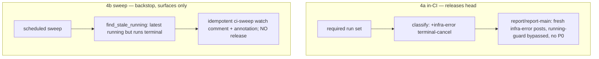

# Implementation Plan: CI Terminal-Cancel Verdict (infra-error)

**Branch**: `fix/ci-terminal-cancel-verdict` | **Date**: 2026-09-16 | **Spec**: [spec.md](./spec.md)
**Input**: Feature specification from `kitty-specs/ci-terminal-cancel-verdict-01M2NC7Z/spec.md`

## Summary

**4a (primary):** add a terminal-cancel class `infra-error` to the shared `classify()` (`scripts/ci/fleet_verdict.py`) so a fully-terminal required set with a cancelled run (no red) yields `infra-error` — a never-green, never-premature terminal class that the dedup running-guard does not suppress, so the head is **released** and re-triggerable. Threads to PR and `main` for free (both reuse `classify`); no P0 on `main`; zero dedup/regex/YAML change. **4b (backstop):** a new reactive `scripts/ci/stale_running_sweep.py` + a scheduled workflow that detects "latest verdict `running` but the head's required runs are all terminal" (the cancelled-reporter / cancelled-main residual 4a cannot reach) and surfaces it as an idempotent `[ci-sweep]` watch item — never auto-releasing. Detail: [research.md](./research.md).

## Technical Context

**Language/Version**: Python 3.11+ (stdlib only — `re`, `json`, `argparse`; mirrors `fleet_verdict.py`/`select_source_artifacts.py`)
**Primary Dependencies**: none new; `gh` at the workflow edge already exists. DIRECTIVE_051 supply-chain → N/A (explicit no-op, research D-07)
**Storage**: N/A — pure functions over injected run/label/comment JSON; GitHub comments/annotations at the edge
**Testing**: `pytest` `tests/ci/` — red-first unit tests + full-`report()` release tests (fake `API` harness, `test_fleet_verdict.py:58-97`) + an execution-grounded sweep-wiring guard
**Target Platform**: GitHub Actions (`ci-fleet-verdict.yml` reporter unchanged; a new scheduled sweep workflow) + local `pytest`
**Project Type**: single (CI tooling: `scripts/ci/` + `tests/ci/` + one new workflow)
**Performance Goals**: N/A — `classify` is O(runs); the sweep is O(open PRs) once per schedule
**Constraints**: `router_gate.py` classify untouched (C-001); Stage-1 concurrency levers + dedup guard/regex untouched (C-002); the sweep never auto-releases/re-triggers/posts a `[ci] <state>` verdict (C-003); `infra-error` never == red/green (C-004)
**Scale/Scope**: ~10-line `classify` edit + a comment line + docstring; ~1 new sweep module (~80 LOC) + tests + 1 new workflow

## Constitution / Charter Check

| Principle | Status |
|---|---|
| Single canonical authority | ✅ `classify` stays the sole verdict authority; the sweep is explicitly non-authoritative (surfaces only). |
| Honesty / never-green (ADR 2026-07-17-1) | ✅ `infra-error` requires ≥1 cancelled → never reachable for all-success; green path `:95` byte-unchanged. |
| Structural intervention (DIRECTIVE_040/043) | ✅ Adds a *class* to the verdict taxonomy (closes the whole terminal-cancel category by construction) rather than special-casing one string. |
| ATDD-first (C-011) | ✅ Red-first: strand-release via full `report()`, flipped pinned contracts, invariant tests, sweep detector red-first. |
| Locality / small diff (DIRECTIVE_024) | ✅ 4a is a localized classify edit; 4b is additive (new module + workflow). |
| Decision documentation (DIRECTIVE_003) | ✅ Precedence + reviewer's caught flaw recorded (research D-02); #4430 closure noted. |
| Terminology canon | ✅ "Mission"; "main verdict"/`infra-error` senses defined. |

No violations → Complexity Tracking empty.

## Project Structure

```
kitty-specs/ci-terminal-cancel-verdict-01M2NC7Z/
├── plan.md · research.md · data-model.md · quickstart.md · contracts/terminal-cancel.contract.md · tasks.md (later)

scripts/ci/
├── fleet_verdict.py          # 4a: classify infra-error branch + comment_body line + docstring (EDIT)
├── fleet_main.py             # reuses classify — NO edit (coherence free); only its TEST migrates
└── stale_running_sweep.py    # 4b: NEW pure detector + gh-edge main()

tests/ci/
├── test_fleet_verdict.py     # 4a: strand-release test + flip :175/:319 + INV-1..5 + incident-append test (EDIT)
├── test_fleet_main.py        # 4a: migrate :109 cancelled→infra-error+no-P0 (EDIT)
└── test_stale_running_sweep.py  # 4b: NEW red-first detector + wiring guard

.github/workflows/
└── ci-stale-running-sweep.yml   # 4b: NEW schedule + workflow_dispatch host (default; see point-cut)
```

**Structure Decision**: single-project CI tooling. 4a is a surgical edit to the shared classifier; 4b is an additive sweep module + a dedicated scheduled workflow (kept out of `ci-nightly.yml` to avoid its dual-mode contract).

## Design (Phase 1 summary — full contract in `contracts/`)

**4a — classify precedence** (evaluate in order, each returns immediately):
`red (:89) → deferred (:91) → incomplete (:93) → terminal-cancel NEW: all(present.status=="completed") AND any(present.conclusion=="cancelled") → "infra-error" → green/running (:95, unchanged)`. `comment_body` gains an `infra-error` explanatory line; docstring updated.

**4b — stale-running detector** (pure):
`find_stale_running(heads_with_latest_verdict, runs_by_head) -> list[StaleHead]` — a head is stale iff its latest `[ci]` verdict is `running @<head>` AND every required run for `<head>` is terminal (`status=="completed"`). Edge (`main()`): `gh` lists open PRs + their `[ci]` comments + required runs; the surface posts/updates a de-duplicated `[ci-sweep]` watch comment (idempotent by fingerprint) + a `::warning::` annotation. **Never** posts `[ci] <state>`, edits reporter comments, re-triggers, or auto-releases.



## Parallel Work Analysis

### Dependency Graph
```
WP01 (4a classify + tests)  ── independent ──┐
WP02 (4b sweep + workflow)  ── independent ──┘   (WP02 imports fleet_verdict read-only; no write overlap)
```

### Work Distribution
- **WP01 — 4a in-CI infra-error (FR-001..006, FR-009 part, NFR-001/002/003, C-001/C-002/C-004)**: edit `fleet_verdict.py` (classify branch + comment_body line + docstring); red-first tests in `tests/ci/test_fleet_verdict.py` (strand-release via full `report()`, flip `:175`/`:319`, INV-1..5, incident-append) + migrate `tests/ci/test_fleet_main.py:109`. Owns `scripts/ci/fleet_verdict.py`, `tests/ci/test_fleet_verdict.py`, `tests/ci/test_fleet_main.py`. **Frozen:** `router_gate.py`, the dedup guard/regex, Stage-1 levers, the `:95` green line, `fleet_main.py` code.
- **WP02 — 4b stale-running sweep (FR-007/008, FR-009 part, NFR-003/004, C-003)**: new `scripts/ci/stale_running_sweep.py` (pure detector + gh edge) + `tests/ci/test_stale_running_sweep.py` (red-first detector + execution-grounded wiring guard) + new `.github/workflows/ci-stale-running-sweep.yml` (schedule + workflow_dispatch). Imports `fleet_verdict` read-only. Owns those 3 files.

### Coordination
- WP01 ∥ WP02 (disjoint write-scopes) → 2 lanes, parallel.
- **Post-plan point-cut (operator):** confirm 4b host (dedicated `ci-stale-running-sweep.yml` vs a job in `ci-nightly.yml`) and 4b surface (`[ci-sweep]` de-duplicated watch comment + annotation vs. report-only vs. tracking issue).
- **Pre-PR gates:** `pytest tests/ci/test_fleet_verdict.py tests/ci/test_fleet_main.py tests/ci/test_stale_running_sweep.py`; `pytest tests/ci/` (blast radius); ruff check + `ruff format --check`; terminology guard; `actionlint` on the new workflow (raw output); contract yaml `# round-trip: skip`; retired-surface scan. Reopen #4430; `Closes #4430` (4a+4b) or `Refs`.
