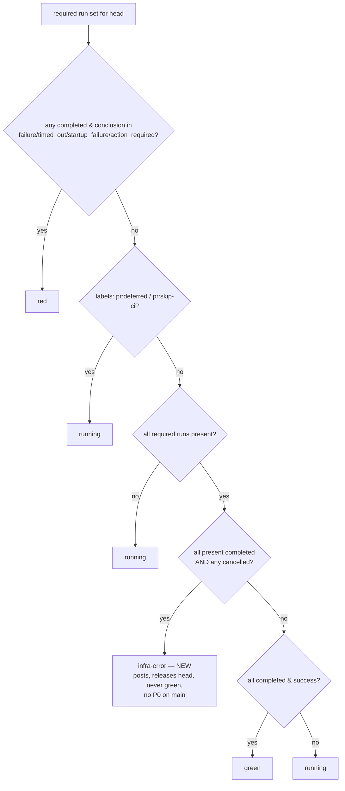

# Mission Specification: CI Terminal-Cancel Verdict (infra-error)

**Mission Branch**: `fix/ci-terminal-cancel-verdict`
**Created**: 2026-09-16
**Status**: Draft
**Input**: Stage 3 of the ratified CI "main-tip verdict topology" cluster (ADR `docs/adr/3.x/2026-09-15-1`, epic #4437). ADR Axis 4 (#4430) — lever **4a** (in-CI `infra-error`) **and 4b** (stale-running sweep backstop), operator-ratified 2026-09-16. Foundation: `work/ci-honesty-4437/stage3-squad-adjudication.md`.

## Context (why this mission exists)

`main`'s CI status is the release-authority signal (ADR `2026-07-17-1`): green must mean *actually proven*, red a *real regression*, and a non-green terminal state must **report itself** so the head is never silently wedged.

**The defect (verified live on `main`).** `scripts/ci/fleet_verdict.py` `classify()` red-set omits `cancelled`, so a terminally-cancelled required run classifies as **`running`**, not a terminal class. The dedup running-guard then *suppresses* the repost when the latest verdict is already `[ci] running @<head>` — so a cancelled run posts **no new comment, ever**, and the pull request **strands on a stale `[ci] running` forever** (head never released). Cancellation is frequent on this surface (22/80 recent `ci-modules.yml` runs cancelled), so this wedges PRs regularly. #4430 was closed COMPLETED at the ADR-ratification timestamp as a *process* closure — **the code fix never landed**.

**Two coupled fixes:**
- **4a — in-CI `infra-error` (primary).** Add a terminal-cancel class to the shared classifier: a *fully-terminal* required set with a cancelled run and no red → `infra-error`, a class distinct from both `running` and `green`. Because the dedup running-guard matches only `state=="running"`, a fresh `infra-error` **posts and releases the head**, still never-green. Threads to PR and `main` for free (both reuse `classify`); creates **no spurious P0** on `main`.
- **4b — reactive stale-running sweep (backstop).** 4a cannot help when *no reporter fired at all* — e.g. the fleet-verdict *reporter* run itself was cancelled (Stage-1 "survivor-no-successor" soft-wedge), or the cancelled-`main` residual. A scheduled/dispatchable sweep detects "latest verdict is `running` but the head's required runs are all terminal" and **surfaces it as a watch item** — it does **not** auto-release the head (release stays in-CI; the sweep is a safety net, never the authority).

## User Scenarios & Testing *(mandatory)*

### User Story 1 — A cancelled required run posts an honest verdict that releases the head (Priority: P1)

A contributor's required CI run is cancelled (external/timeout kill). The maintainer must see an honest terminal verdict that unblocks re-running — never a PR frozen on a stale `[ci] running`.

**Why this priority**: This is the release-authority honesty hole the mission closes; it wedges real PRs.

**Independent Test**: Full `report()` path against a fake GitHub whose latest comment is `[ci] running @head` and one required gate is `completed/cancelled`; assert TODAY the post is suppressed (`not api.posts`) and AFTER the fix a fresh `[ci] infra-error @head` is posted (the head is released).

**Acceptance Scenarios**:
1. **Given** a fully-terminal required set with one `completed/cancelled` run and none red, **When** `classify` runs, **Then** it returns `infra-error` (distinct from `running` and `green`).
2. **Given** the latest verdict is a stale `[ci] running @head` and a required run is cancelled, **When** `report()` runs, **Then** it posts a fresh `[ci] infra-error @head` (not suppressed by the running-guard) — the head is released and re-triggerable.
3. **Given** a cancelled required run on the `main` path, **When** the main reporter runs, **Then** it emits `infra-error` and creates **no** P0 incident (infra-error ≠ red).

### User Story 2 — The classifier is never-green and never fires prematurely (Priority: P1)

The classifier is the per-PR *and* per-`main` release gate; a wrong change green-washes or spuriously reds/terminates every head.

**Why this priority**: The invariants are the whole safety of the change.

**Independent Test**: Unit-test `classify` across the precedence table with injected `runs`/`labels` — no live API.

**Acceptance Scenarios**:
1. **Given** an all-`success` set, **When** classified, **Then** `green` — and `infra-error` is unreachable (requires ≥1 `cancelled`). (INV-1 never-green)
2. **Given** `{cancelled, in_progress}` or `{cancelled, absent}`, **When** classified, **Then** `running` — never a premature terminal while a gate still flies. (INV-2)
3. **Given** `{failure, cancelled}`, **When** classified, **Then** `red` — red dominates; a cancel never infra-washes a real failure. (INV-3)
4. **Given** a `pr:skip-ci`/`pr:deferred` PR with a cancelled run, **When** classified, **Then** `running` — intent not overridden. (INV-4)
5. **Given** `{skipped, success}`, **When** classified, **Then** `running` — `skipped` is legitimate, not infra. (INV-5)

### User Story 3 — A reactive sweep backstops the cases 4a cannot reach (Priority: P2)

When no reporter fired (cancelled reporter run; cancelled-`main` residual), a PR/main head can still sit on a stale `[ci] running`. A sweep must find and surface these without pretending to be the verdict authority.

**Why this priority**: Closes the residual wedge classes 4a structurally cannot (no in-CI reporter to release the head).

**Independent Test**: Unit-test the pure detector over injected PR/comment/run data (stale detected; not-stale when latest is terminal; not-stale when runs still in-flight); assert the surface is idempotent and posts no green/red verdict.

**Acceptance Scenarios**:
1. **Given** a head whose latest verdict is `[ci] running @head` and whose required runs are all terminal, **When** the sweep runs, **Then** it flags the head as a stale-running watch item.
2. **Given** the same head with a required run still `in_progress`, **When** the sweep runs, **Then** it does **not** flag it (evidence still pending).
3. **Given** an already-flagged stale head, **When** the sweep re-runs, **Then** it does not duplicate the surface (idempotent) and does not post a green/red verdict or re-trigger CI.

### User Story 4 — The fix is proven by non-fakeable, execution-grounded tests (Priority: P2)

A `classify(...)=="infra-error"` assertion alone does not prove the head is *released*; the proof must exercise the real `report()` suppression path and the sweep wiring.

**Acceptance Scenarios**:
1. **Given** the shipped code, **When** the red-first suite runs on today's code, **Then** the strand-release test and the flipped pinned contracts fail (red-first), and pass only on the correct fix.
2. **Given** the sweep workflow, **When** the wiring guard runs, **Then** it confirms the scheduled/dispatch step invokes the shipped sweep module.

### Edge Cases
- A cancel co-present with an `in_progress` or absent required run → `running` (more evidence coming) — never a premature terminal (INV-2).
- `{failure, cancelled}` across the set → `red` (INV-3) — a cancel never hides a real failure.
- `timed_out` (a GitHub timeout) stays `red` at the existing red-check; only `cancelled` (external kill) → `infra-error`.
- A cancelled *reporter* run (no classify fires) — 4a cannot release; 4b sweep surfaces it.
- 4b must fail closed/idempotent — a re-run must not spam the watch surface, and must never post a green/red verdict or re-trigger CI (that is the in-CI reporter's authority).

## Requirements *(mandatory)*

### Functional Requirements

| ID | Title | User Story | Priority | Status |
|----|-------|------------|----------|--------|
| FR-001 | `infra-error` terminal-cancel class | As a maintainer, I want `classify` to return `infra-error` for a fully-terminal required set with a cancelled run and no red, so a cancellation is an honest terminal verdict, not a silent `running`. | High | Open |
| FR-002 | Release the head | As a maintainer, I want an `infra-error` verdict to post a fresh `[ci] infra-error @head` that the dedup running-guard does NOT suppress, so a stranded PR is released and re-triggerable. | High | Open |
| FR-003 | Correct classify precedence | As a maintainer, I want the `infra-error` branch placed after red, after deferred, after the incomplete check, and gated on `all present runs completed`, so it never infra-washes a red, never overrides a deferred, and never fires while a gate is still in-flight. | High | Open |
| FR-004 | `skipped`/`timed_out` unchanged | As a maintainer, I want `skipped` to stay `running` (legitimate, not infra) and `timed_out` to stay `red`, so only an external `cancelled` becomes `infra-error`. | High | Open |
| FR-005 | Main-path coherence, no spurious P0 | As a maintainer, I want a cancelled `main` run to emit `infra-error` via the shared classifier and create NO P0 incident (infra-error ≠ red), so main-path semantics match the PR path. | High | Open |
| FR-006 | Honest infra-error surface | As a maintainer, I want the `infra-error` comment to carry a plain-language line ("a required run was cancelled — infra/timeout kill, not a code failure; re-run to release the head") and the classifier docstring updated, so the verdict is self-explanatory. | Medium | Open |
| FR-007 | Stale-running sweep (4b) — detect + flag | As a maintainer, I want a reactive sweep that flags any head whose latest verdict is `running` while its required runs are all terminal, so a wedge where no reporter fired (cancelled reporter, cancelled main) is surfaced as a watch item. | High | Open |
| FR-008 | Sweep is a backstop, not the authority | As a maintainer, I want the sweep to surface only (idempotently) — never auto-release the head, post a green/red verdict, or re-trigger CI — so in-CI stays the release authority and the sweep cannot green/red-wash. | High | Open |
| FR-009 | Non-fakeable, execution-grounded proof | As a reviewer, I want the strand-release proven via the full `report()` suppression path (not a bare classify assertion), the pinned `cancelled→running` contracts flipped, and the sweep wired via an execution-grounded guard, so the fix cannot ship dead or be faked. | High | Open |

### Non-Functional Requirements

| ID | Title | Requirement | Category | Priority | Status |
|----|-------|-------------|----------|----------|--------|
| NFR-001 | Never-green (structural) | `infra-error` requires ≥1 `cancelled`; an all-`success` set has zero, so `green ⇒ not infra-error` and `infra-error ⇒ not green`, by construction. The green path (`fleet_verdict.py:95`) is byte-unchanged; existing never-green tests stay green. False-green rate: exactly 0. | Reliability | High | Open |
| NFR-002 | Never premature-terminal | A cancel co-present with any non-terminal (`in_progress`/`queued`/absent) required run classifies `running`, verified by explicit tests for both the `in_progress` and absent cases. | Reliability | High | Open |
| NFR-003 | Pure, offline-testable | `classify` and the 4b detector are pure functions of injected inputs (run/label/comment data), network at the edge; 100% of their named branches covered by red-first unit tests with no live API. | Testability | High | Open |
| NFR-004 | Sweep idempotency | Re-running the 4b sweep against an already-flagged stale head produces no duplicate surface and no new verdict/trigger. | Reliability | Medium | Open |

### Constraints

| ID | Title | Constraint | Category | Priority | Status |
|----|-------|------------|----------|----------|--------|
| C-001 | Separate classifier untouched | Do NOT modify `scripts/ci/router_gate.py`'s unrelated `classify` (name collision only). | Technical | High | Open |
| C-002 | Stage-1 levers + dedup untouched | Do NOT change `ci-fleet-verdict.yml` concurrency levers (#4347/#4371) or the `fleet_verdict.py` dedup running-guard/recognition regex — 4a needs none (the regex already recognizes `infra-error`). | Technical | High | Open |
| C-003 | Sweep never auto-releases | 4b surfaces a watch item only; it never posts a `green`/`red` verdict, never edits/deletes the in-CI reporter's comments to force release, and never re-triggers CI. | Technical | High | Open |
| C-004 | `infra-error` is a distinct terminal class | `infra-error` is never equal to `red` or `green`; it is outside the green path and outside the red-incident path. | Technical | High | Open |
| C-005 | Proven where the defect lives | The classifier/report changes are unit- and `report()`-provable offline; the sweep wiring is proven by an execution-grounded guard. Main-path behavior is confirmed on the merged main tip after merge. | Process | Medium | Open |

### Domain Language *(canonical terms)*

- **Verdict / `[ci] <state> @<head>`** — the fleet reporter's comment; `state ∈ {green, red, running, infra-error, no suite}`.
- **`infra-error`** — a terminal, never-green class for an external cancellation of a required run; releases the head, distinct from `running` and `red`.
- **Terminal / fully-terminal** — every present required run is `completed` (any conclusion). Only a fully-terminal set may yield `infra-error`.
- **Release the head** — post a fresh, non-suppressed, non-green terminal verdict so the PR is no longer wedged waiting.
- **Stale-running** — the latest verdict is `running` but the head's required runs are all terminal (the wedge 4b sweeps).
- **`skipped` vs `cancelled`** — `skipped` = an `if:`-gated job (legitimate → `running`); `cancelled` = external/timeout kill (→ `infra-error`); `timed_out` = a GitHub timeout (→ `red`).
- Terminology canon: this is a **Mission**; the "main verdict" sense (release authority) is distinct from the overloaded `primary`/`merge`/`routing` senses.

## Success Criteria *(mandatory)*

- **SC-001**: A cancelled required run yields `classify → infra-error` and a fresh `[ci] infra-error @head` post that the running-guard does not suppress (proven via the full `report()` path) — the head is released. #4430's strand class is closed.
- **SC-002**: Never-green and never-premature hold: an all-`success` set is `green` with `infra-error` unreachable; a cancel among in-flight/absent runs stays `running`; `{failure,cancelled}` is `red` — all red-first tested.
- **SC-003**: The 4b sweep detects and idempotently flags a stale-running head (cancelled-reporter / cancelled-main residual) as a watch item, and never posts a green/red verdict or re-triggers CI.
- **SC-004**: A cancelled `main` run creates no P0 incident; the classifier docstring + `infra-error` comment line are honest and self-explanatory.

## Assumptions

- Stage 1 (#4347/#4371, PR #4541) and Stage 2 (#4360-A, PR #4596) are merged and verified. 4a threads to PR and `main` via the shared `classify` (no Stage-1 concurrency change).
- #4430 is closed-COMPLETED but the fix never landed (bug verified live on `main`); the PR reopens #4430 (default) or `Refs` it, per operator confirmation at PR time. 4a+4b together close #4430.
- 4b's exact surface (report line vs. de-duplicated watch comment vs. tracking issue) and host (a new dedicated scheduled workflow vs. an addition to `ci-nightly.yml`) are settled in plan against the ADR's "surface as a watch item, do not auto-release" constraint; the fix fails closed and idempotent.
