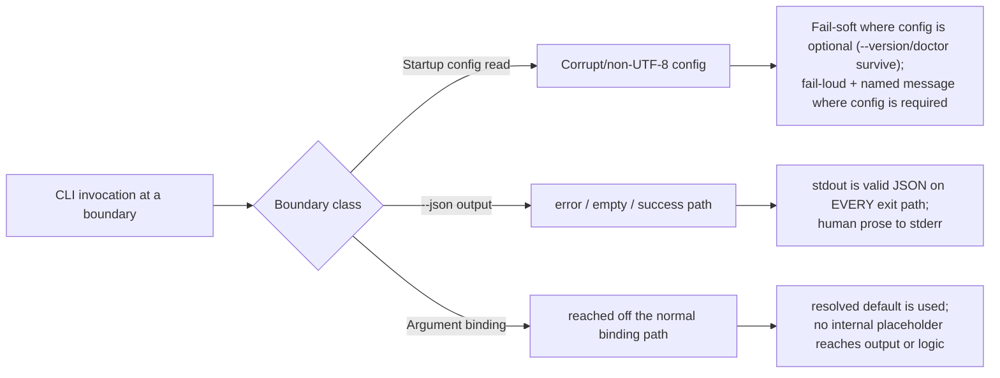

# Mission Specification: CLI Boundary Robustness

**Mission Branch**: `fix/cli-boundary-robustness`
**Created**: 2026-09-16
**Status**: Draft
**Input**: Harden the spec-kitty CLI boundary against three classes of ungraceful failure (startup config ingestion, `--json` output contract, argument-binding default leakage) that brick the tool or mislead machine consumers. Closes #4600 (P0), #4601 (P1), #4643 (P1), #4597 (P2), #4598 (P2), and — closed-by-construction via the ratified class-closure scope — #4533 and #4532. Parent tracker #4646 (OptionInfo family) gains two closed instances (#4597/#4598); #2779, #4642, #4637, #2605, #2899 are explicitly out of scope (see Deferred Follow-ups). MVP path / milestone 4.0.0.

## Overview

The CLI has three edges where it fails ungracefully today: it reads configuration
at startup, it promises machine-readable output via `--json`, and it binds
command arguments. Each edge has at least one failure mode that either bricks the
tool outright or silently violates the contract a machine consumer relies on. This
mission hardens all three so the CLI **degrades gracefully** and **honors its
machine contract on every exit path**. The single load-bearing invariant is:
a boundary failure produces a predictable, machine-legible outcome — never a raw
traceback, never prose where JSON was promised, never an internal placeholder as a
real value.

## User Scenarios & Testing *(mandatory)*

### User Story 1 - A corrupt config never bricks the CLI (Priority: P1)

An operator or automation runs any `spec-kitty` command in a project whose
`.kittify/config.yaml` has become unreadable (non-UTF-8 bytes, or malformed
content). Today this raises an uncaught error at startup and takes down **every**
command — including `--version` and `doctor`, the operator's own repair path.
After this mission, commands that do not need config content still work, and
commands that do need it fail with a clear, actionable message instead of a crash.

**Why this priority**: This is the P0 (#4600). It leaves the tool with no
in-product recovery path and reds mainline; it is the MVP-first slice and is
independently shippable as a hotfix.

**Independent Test**: In a project with a deliberately non-UTF-8
`.kittify/config.yaml`, run `spec-kitty --version` and `spec-kitty doctor` and
confirm they succeed; run a config-dependent command and confirm it fails with a
message naming the file and the decode problem, and with no traceback.

**Acceptance Scenarios**:

1. **Given** a project whose `.kittify/config.yaml` contains non-UTF-8 bytes, **When** the operator runs `spec-kitty --version`, **Then** it exits 0 and prints the version, and no stream contains a Python traceback or a decode-error class name.
2. **Given** the same corrupted project, **When** the operator runs `spec-kitty doctor`, **Then** it runs to a domain-level outcome (clean message or graceful skip), never an import-time crash.
3. **Given** the same corrupted project, **When** the operator runs a command that genuinely requires config content, **Then** the command exits non-zero with a message that names the offending file and indicates an encoding/decode failure, and emits no traceback.
4. **Given** a project whose `.kittify/config.yaml` is valid UTF-8 but malformed (parseable-but-invalid), **When** the operator runs `mission list` / `mission-type list`, **Then** those commands degrade gracefully (a named domain error, consistent with how `charter status` already behaves) rather than surfacing an uncaught configuration error.
5. **Given** a project with a valid `.kittify/config.yaml`, **When** the operator runs `--version` and any normal command, **Then** behavior is unchanged (no regression to the healthy path).

---

### User Story 2 - `--json` always returns machine-readable output (Priority: P1)

A machine consumer (agent, CI pipeline, `jq`) invokes any `--json`-capable command
and parses stdout. Today several commands emit human prose on their error paths and
on their empty/no-data paths — sometimes at exit 0, which falsely signals success to
a pipeline that then cannot parse the output. After this mission, **every**
`--json`-capable command produces valid JSON on **every** exit path (success, empty,
error), with a single canonical envelope, and human prose is confined to stderr.

**Why this priority**: These are the two P1 issues (#4601 error paths, #4643 empty
path) plus the systemic class the squad confirmed (~22 command groups share the
defect, driven by one prose-only project-root helper). Closing the class by
construction prevents the recurring re-report cycle.

**Independent Test**: Enumerate every command that accepts `--json`, drive each with
a known error input and with an empty-data input, and assert `json.loads(stdout)`
succeeds on both, with exit codes matching the non-`--json` behavior.

**Acceptance Scenarios**:

1. **Given** `context info --json` invoked against an unresolvable workspace / outside a worktree, **When** it fails, **Then** stdout parses as a JSON object carrying the canonical error envelope (a falsy success indicator and a machine-readable error `code`+`message`), and stdout contains no human prose.
2. **Given** `mission-type show <unknown> --json`, **When** it fails, **Then** stdout parses as JSON with a stable error `code` for the unknown-type condition, and no prose appears on stdout.
3. **Given** `agent tasks status --json` on a mission with zero work packages, **When** it runs, **Then** it exits 0 and stdout parses as JSON representing an empty result (normal success envelope with empty collections), with no "No work packages found" prose on stdout.
4. **Given** any `--json`-capable command run outside a project, **When** the not-in-project condition is hit, **Then** stdout is the canonical JSON error envelope (not prose), on every such command.
5. **Given** any `--json`-capable command on any of its exit paths, **When** it emits output, **Then** stdout contains only JSON and any human-readable text is written to stderr.
6. **Given** the successful (happy) path of every affected command, **When** run with `--json`, **Then** its existing success output is unchanged (no regression).

---

### User Story 3 - Command defaults resolve correctly off the binding path (Priority: P2)

An operator runs a command form that reaches the command body without the normal
argument-binding step — e.g. `spec-kitty context` with no subcommand, or an alias
that forwards to another command. Today the unset options hold an internal
framework placeholder instead of their declared default, so the command either
crashes leaking that placeholder into output or ignores a flag entirely (showing
inactive mission types that should be hidden). After this mission, these forms use
the resolved defaults and never surface an internal placeholder.

**Why this priority**: These are the two P2 issues (#4597, #4598). The class is
already nearly closed (only these two leak), so the remedy is a bounded point-fix
plus one negative-assertion guard, not a heavyweight structural gate.

**Independent Test**: Run `spec-kitty context` (no subcommand) and assert its output
equals `spec-kitty context info` with no placeholder repr present; run
`mission-type list` / `mission list` on a partially-activated charter and assert
only activated types are shown.

**Acceptance Scenarios**:

1. **Given** an initialized project with no active worktree, **When** the operator runs `spec-kitty context` with no subcommand, **Then** the output is identical (content and exit code) to `spec-kitty context info`, and no internal placeholder representation appears in any stream.
2. **Given** a charter that activates only a subset of mission types, **When** the operator runs `spec-kitty mission-type list` (no flag), **Then** only the activated types are listed — identical to the canonical `charter mission-type list` default — and inactive types are not shown.
3. **Given** the same partial charter, **When** the operator runs `spec-kitty mission list`, **Then** its output is identical to `spec-kitty mission-type list` (the alias inherits the corrected default).
4. **Given** the same partial charter, **When** the operator requests inactive types via the supported flag, **Then** activated ∪ inactive types are listed (inactive types remain reachable).
5. **Given** any command reachable off the binding path, **When** it runs on any path, **Then** no internal placeholder representation appears in user-facing output.

---

### Edge Cases

- **Fail-soft vs fail-loud split**: the same corrupt config must be *tolerated* by config-optional commands (`--version`, `doctor`) yet *reported* by config-required commands. The two behaviors coexist deliberately (partition captured in FR-001/FR-002).
- **Exit-0 masking**: an empty result on a `--json` path must stay exit 0 (empty is success, not error) while still emitting JSON — the failure mode is prose-at-exit-0, which is worse than an error-path gap because it lies to the pipeline.
- **Distinction between framework binding styles**: only options declared in the older default-assignment style leak the placeholder; options with a real declared default do not. Any negative-assertion guard must not mislabel the safe form.
- **Sibling reads beyond the filed bug**: other startup/config/version reads that lack decode-error handling must be folded in so the fix is not whack-a-field (FR-004).
- **Additional `--json` surfaces discovered by the enumeration gate**: any adopted command the gate flags for a shape violation is in scope; parseability applies universally. Full cross-repo shape convergence is deferred (Deferred Follow-ups).
- **Single canonical envelope**: the empty-success shape must not carry a stray `error` key (a smell where an exit-0 success path reuses an error-shaped payload).
- **Per-command exit codes**: the `--json` error exit code must equal the command's own non-json exit code (per the frozen #4242 tests: mostly 1, exit 2 only for a few doctor subcommands) — the class fix must NOT homogenize exit codes.
- **Multi-registration aliases**: `mission-type list` is reachable as `mission list`, `mission-type list`, `charter mission-type list`, and `doctrine mission-type list`; the last is a separate delegation path — the fix must route every alias through the corrected callee, verified by test.

## Requirements *(mandatory)*

### Functional Requirements

| ID | Title | User Story | Priority | Status |
|----|-------|------------|----------|--------|
| FR-001 | Import-time config read fails soft | As an operator, I want the earliest (import-time) config read to tolerate an unreadable `.kittify/config.yaml` and continue, so config-optional commands (`--version`, `doctor`) still work and I retain an in-product repair path. Partition is by **read site** (import-time = soft), not by a per-command allow/deny list. | High | Open |
| FR-002 | Content-load config read fails loud and clear | As an operator, I want a command that loads config *content* to exit non-zero with a message naming the file and the decode failure (no traceback) when the config is unreadable. The loud message is rendered in the command layer, not the import-time crash site (see C-009). | High | Open |
| FR-003 | Malformed-but-parseable config degrades gracefully | As an operator, I want `mission list` / `mission-type list` to degrade like `charter status` (named domain error, no uncaught configuration error) rather than crash on a parseable-but-invalid config. This is the #4600 Instance-2 content-load path (implemented in WP04). | High | Open |
| FR-004 | Sibling startup/config/version reads are hardened | As an operator, I want other unguarded reads (`charter/activation/consistency_check.py` config-mapping load, `runtime/doctor.py` version-file read) to degrade gracefully on unreadable/non-UTF-8 input so the repair tools themselves cannot be bricked; git-metadata reads gain explicit `encoding=` as campsite. | Medium | Open |
| FR-005 | `--json` error paths emit the canonical error envelope | As a machine consumer, I want every `--json`-capable command to emit valid JSON (canonical error envelope with a stable `code`) on its error paths so I never parse prose. | High | Open |
| FR-006 | `--json` empty paths emit valid JSON at the correct exit code | As a machine consumer, I want empty/no-data `--json` results to be valid JSON at exit 0 (success envelope with empty collections, no stray `error` key) so an empty result is not mistaken for an error or an unparseable success. Responsibility boundary: data-builders (e.g. `agent_utils/status.py`) return pure data with no `console.print` and no `error` key; the command owns the stream/format decision. | High | Open |
| FR-007 | `--json` stream discipline | As a machine consumer, I want `--json` output to place only JSON on stdout on every exit path, with human prose on stderr, so stdout is always parseable. | High | Open |
| FR-008 | Not-in-project path honors `--json` universally | As a machine consumer, I want the shared "not in a project" failure (`get_project_root_or_exit`) to emit the canonical JSON envelope for every `--json`-capable command, not prose. The helper gains a defaulted `json_output: bool = False` parameter so its ~12–13 call sites across 6 files compile unchanged; each owning WP opts its commands in (the 5 caller files not otherwise owned — `verify.py`, `validate_encoding.py`, `research.py`, `validate_tasks.py`, `dashboard.py` — are assigned to WP05, not left unowned). | High | Open |
| FR-009 | No-subcommand invocation uses resolved defaults | As an operator, I want `spec-kitty context` (no subcommand) to behave exactly like `context info` and never surface an internal placeholder as a value. | Medium | Open |
| FR-010 | List commands respect the activated-only default | As an operator, I want `mission-type list` / `mission list` to hide inactive types by default (matching the canonical command) while keeping inactive types reachable on request. | Medium | Open |
| FR-011 | No internal placeholder leaks into output | As an operator, I want no command reachable off the binding path to surface an internal argument placeholder in user-facing output on any path. | Medium | Open |
| FR-012 | Filed issues closed with traceable coverage | As a maintainer, I want #4600/#4601/#4643/#4597/#4598 each closed with issue-pinned regression coverage so the fixes cannot silently regress. | High | Open |

### Non-Functional Requirements

| ID | Title | Requirement | Category | Priority | Status |
|----|-------|-------------|----------|----------|--------|
| NFR-001 | Machine-contract completeness | An automated enumeration gate discovers every `--json`-capable command by structural Typer introspection (any bool option whose flag is `--json`, across the vocabularies `json_output`/`--json`/`json: bool`/`output_json`). A one-time discovery/triage classifies each discovered command into {adopted-shape, already-parseable, non-parseable-deferred}. Contract: (a) 100% of commands on the **parse allow-list** (adopted ∪ verified-already-parseable) produce `json.loads`-parseable stdout on the driven error/empty paths (0 failures); (b) commands this mission ADOPTS additionally satisfy the canonical error-envelope SHAPE on their error paths. The error arm is driven generically (run outside a project); the empty arm uses an explicit, extensible per-command fixture list. Commands discovered but not yet parseable (e.g. `events.py` emits error JSON to stderr with empty stdout) are recorded and **deferred** (excluded from the gate so it stays deterministic and cannot red on an unowned command). The gate fails if a newly added command on the allow-list is non-parseable, or if an adopted command regresses its envelope shape. (CliRunner-driven; cannot cover the import-time #4600 crash — that is NFR-003.) | Reliability | High | Open |
| NFR-002 | No raw traceback on boundary failures | Across the enumerated boundary-failure scenarios (corrupt config, `--json` error/empty), 0 invocations emit a Python traceback to any stream. | Reliability | High | Open |
| NFR-003 | Red-first regression discipline | The P0 (#4600) and the exit-0-masking bug (#4643) each carry an issue-pinned `@pytest.mark.regression` test that is RED on the mission base commit and GREEN on the final commit, driven through the pre-existing entry point. | Quality | High | Open |
| NFR-004 | Single canonical error-envelope authority | Exactly one shared definition of the `--json` **error** envelope exists (`cli/json_contract.py`), and every in-scope error path — including the divergent shapes inside touched files (`cli/helpers.py` `exit_git_resolution_failure`) and the doctor family — routes through it. Measured by: 1 authoritative error-envelope definition, 0 competing error-envelope definitions among in-scope surfaces. **Success payloads keep their existing per-command shape** (e.g. `glossary list`'s bare `[]`); this NFR governs the error/empty-error envelope only, not success shapes. | Maintainability | High | Open |
| NFR-005 | Startup/command latency budget | CLI startup and command completion remain under the 2s typical-project budget for a valid project. (The added `except UnicodeDecodeError` costs nothing on the happy path.) | Performance | Medium | Open |
| NFR-006 | Lint/type/format clean | New/changed code passes ruff and mypy with zero issues and the whole-repo format check, with no blanket suppressions. | Quality | High | Open |

### Constraints

| ID | Title | Constraint | Category | Priority | Status |
|----|-------|------------|----------|----------|--------|
| C-001 | Honor the frozen `--json` envelope precedent | Adopt the existing test-frozen #4242 envelope: errors → `{"ok": false, "error": {"code", "message"}}` (the `error` value is an object, never a bare string); empty-success → the command's normal success envelope with empty collections; **a `--json` error exit code equals that command's own non-`--json` exit code** — the frozen tests show this is per-command (most commands, and the shared `get_project_root_or_exit`, exit 1; only `doctor shim-registry`/`contracts`/`tool-surfaces` exit 2). Do NOT force a uniform "exit 2 for not-in-project". stdout JSON-only, prose to stderr. Do not create a second contract. | Technical | High | Open |
| C-002 | Client-repo boundary | This repository is a client of upstream zeitgeist/saas; no CLI↔SaaS API-contract edits are in scope. | Technical | High | Open |
| C-003 | ATDD-first | Every implementation work package begins with a failing-first acceptance test committed before implementation; the P0 reproduces red-first through the pre-existing startup entry point. | Process | High | Open |
| C-004 | Fail-soft vs fail-loud split for config reads | The import-time config-pointer read fails soft (tolerate + continue) to preserve `--version`/`doctor`; config-required command paths fail loud with a named, actionable message. | Technical | High | Open |
| C-005 | Bounded OptionInfo remedy | Fix #4597/#4598 plus one **behavioral/output-based** negative-assertion guard (assert no `OptionInfo`/`ArgumentInfo` repr appears in the output of any `invoke_without_command=True` callback), parameterized over ALL such callbacks (`__init__.py`, `migrate_cmd.py` ×2, `context.py`, `charter/list_cmd.py`). Do NOT add a structural AST/binding-style enforcement gate (operator-ratified fix-2+small-guard). Because the guard only scans output, it cannot mislabel the safe `Annotated[T, ...] = <real>` binding form — that form simply never emits the repr; no binding-style inspection is needed or permitted. Fix #4598 at the **call site** (pass `include_inactive=False`), not by adding sentinel-coercion into the callee. | Technical | Medium | Open |
| C-006 | `--json` class closed by construction (bounded) | The `--json` remedy is a class closure, not five point fixes: a shared envelope, a JSON-aware `get_project_root_or_exit`, and an enumeration gate. The gate (a) asserts `json.loads`-parseability on EVERY `--json`-capable command — discovered by structural Typer introspection over all four flag vocabularies (`json_output`, `--json`, `json: bool`, `output_json`), not a parameter-name match — and (b) asserts the canonical error-envelope SHAPE on the error paths of every command this mission ADOPTS. Same-file sibling `--json` subcommands and divergent shapes inside touched files (e.g. `cli/helpers.py` `exit_git_resolution_failure`) are in scope; the `doctrine mission-type list` delegation path must be verified to route through the corrected callee. Full cross-repo shape convergence of the remaining ~12 divergent shapes is explicitly OUT of scope and filed as a follow-up (see Deferred Follow-ups). Ratified via Decision Moment `01M2NRXNA9Y4P8QVTRMHP0D5KH`. | Technical | High | Open |
| C-009 | Bootstrap import purity (WP01) | The config-read hardening in the import-time path (`bootstrap/env_file.py`) must keep that module's transitive imports stdlib+kernel only (per `test_bootstrap_import_purity.py`) and must NOT read `os.environ` at import time. The import-time pointer read fails SOFT (returns without a value); the actionable, file-naming loud message for config-required paths is rendered in the command layer, never at the crash site. | Technical | High | Open |
| C-007 | Terminology Canon | Use "Mission" (never "Feature") in all canonical, operator-facing, and user-facing language and identifiers. | Business | Medium | Open |
| C-008 | No version prescription | This spec assigns no release/version number; versioning is owned by the product owner. | Business | Low | Open |

### Key Entities

- **Canonical `--json` error envelope**: the single machine-readable shape for a failed `--json` invocation — a falsy success indicator plus a stable error `code` and a human `message`. One authority (NFR-004), following #4242 (C-001).
- **Canonical `--json` empty-success envelope**: the shape for a successful-but-empty `--json` result — the command's normal success payload with empty collections, at exit 0, with no error key.
- **Startup config read**: the earliest configuration read on the command path; classified as config-optional (fail-soft) or config-required (fail-loud) per C-004.
- **Argument-binding placeholder**: the internal sentinel an unset option holds when a command body is reached off the normal binding path; must never reach output or logic (FR-009/FR-011).

## Success Criteria *(mandatory)*

### Measurable Outcomes

- **SC-001**: With a corrupt/non-UTF-8 `.kittify/config.yaml`, `spec-kitty --version` and `spec-kitty doctor` succeed (exit 0) 100% of the time, with 0 tracebacks.
- **SC-002**: 100% of commands on the parse allow-list (adopted ∪ verified-already-parseable) return `json.loads`-parseable stdout on their driven error and empty exit paths (verified by the enumeration gate); adopted commands additionally match the canonical error-envelope shape. Discovered-but-non-parseable commands are enumerated and deferred (filed follow-up), not silently in-scope.
- **SC-003**: 0 in-scope commands emit a raw Python traceback on a boundary-failure path.
- **SC-004**: 0 in-scope commands surface an internal argument placeholder in user-facing output.
- **SC-005**: For every in-scope command, a machine consumer can decide **error vs success** purely from parsed JSON plus exit code (error ⇔ canonical error envelope present / non-zero exit), with no prose parsing; an empty result is a success sub-case detected by empty collections in the success payload.
- **SC-006**: All five filed issues (#4600, #4601, #4643, #4597, #4598) plus the folded #4533 and #4532 are closed, each with issue-pinned regression coverage that is red on the base and green after (red-first for #4600 and #4643).

## Assumptions

- The pre-spec research squad's live reproductions (all five CONFIRMED-ON-MAIN at `3dc726d091` / v4.0.0rc3) hold; none were fixed between research and implementation.
- The set of `--json`-capable commands the enumeration gate discovers is the authoritative surface for the **parseability** contract; the **shape** contract applies to the commands this mission adopts (C-006), with full cross-repo shape convergence deferred (see below).
- The config read-site partition (import-time fail-soft vs content-load fail-loud, C-004/C-009) is fixed by mechanism, not a per-command allow/deny list; `--version`, `doctor`, `doctor skills` reach only the import-time read and therefore survive.

## Deferred Follow-ups (out of scope, to be filed)

- **Full cross-repo `--json` error-envelope convergence** — driving the remaining ~12 divergent error-envelope shapes outside this mission's touched files (`charter_bundle.py`, `implement.py`, `_mission_state_doctor.py`, `_coordination_doctor.py`, `next_cmd.py`, `lint.py`, `lifecycle.py`, `selector_resolution.py`, `tracker.py`, `merge.py`, `retrospective/cli.py`, …) onto the canonical shape, plus a single-authority guard asserting `cli/json_contract.py` is the only error-envelope definition. A DIRECTIVE_040 structural-intervention candidate. (Ratified deferral: DM `01M2NRXNA9Y4P8QVTRMHP0D5KH`.)
- **Non-parseable `--json` commands** — commands the enumeration discovery flags as emitting non-parseable stdout on the error arm (e.g. `cli/commands/events.py` → error JSON to stderr, empty stdout; and any others the WP06 triage records). Not owned/adopted by this mission; folded into the convergence follow-up so the parse gate stays deterministic.
- **State-file robustness** (#4642, #4637) — uncaught tracebacks on malformed per-mission state files / missing `pyproject.toml`; same shape as Cluster C, different files. Future mission.
- **`implement --json` stdout contamination** (#2605) — Rich output on a success path; `implement.py` not owned here. If WP06's gate flags it incidentally, link #2605 rather than silently absorbing it.
- **#2779** (retire the Typer-command-as-library call for `charter generate`/`synthesize`) stays open under parent **#4646**; explicitly deferred by the ratified fix-2 OptionInfo scope (C-005).

## Traceability

| Issue | Priority | User Story | Primary Requirements | Notes |
|-------|----------|------------|----------------------|-------|
| #4600 | P0 | US1 | FR-001, FR-002, FR-004, NFR-002, NFR-003, C-004, C-009 | Instance 1 → WP01 |
| #4600 | P0 | US1 | FR-003 | Instance 2 (`CharterPackConfigError`) → WP04 |
| #4601 | P1 | US2 | FR-005, FR-007, FR-008, NFR-001, C-001 | context info + mission-type show |
| #4643 | P1 | US2 | FR-006, FR-007, NFR-001, NFR-003, C-001 | ownership boundary per FR-006 |
| #4597 | P2 | US3 | FR-009, FR-011, C-005 | instance of parent #4646 |
| #4598 | P2 | US3 | FR-010, FR-011, C-005 | instance of parent #4646; fix at call site |
| #4533 | P2 | US2 | FR-008, NFR-001, C-006 | folded; add archive.py/materialize.py to gate surfaces |
| #4532 | P3 | US2 | FR-005, NFR-004, C-006 | folded; doctor guard promotion |
| (class) | — | US2 | FR-008, NFR-001, NFR-004, C-006 | bounded shape-gate + parse-universal |
