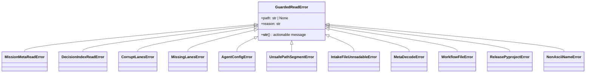

# Data Model — error taxonomy & envelope shapes

**Mission**: cli-error-surface-seam-01M2WJD2

This mission's "data" is the error type hierarchy and the presented error envelope,
not persisted records.

## Error taxonomy



### Base — `GuardedReadError`
- **Home**: `src/kernel/errors.py` (declared in `__all__`).
- **Carries**: the source `path`/handle (optional) and a human-facing `reason`; never
  a leaked stack. `__str__` yields the actionable one-liner the hook prints.
- **Role**: the single type the global CLI hook catches. Also the base every legacy
  and new domain-read error subclasses.

### Existing errors re-parented (D3, subclass — no flat replacement)
| Type | Current home | Kept importable at same path |
|------|--------------|------------------------------|
| `MissionMetaReadError` | `core/paths.py` | yes |
| `DecisionIndexReadError` | `decisions/store.py` | yes |
| `CorruptLanesError` / `MissingLanesError` | `lanes/persistence.py` | yes (pair kept coupled) |
| `AgentConfigError` | `core/agent_config.py` | yes |
| `UnsafePathSegmentError` (`ValueError` subclass today) | `core/paths.py` | yes (multiple-inherit `ValueError` + base, or base subclasses nothing that breaks `except ValueError`) |
| `IntakeFileUnreadableError` | `intake/…` | yes |
| `MetaDecodeError` | `kernel/meta_decode.py` | yes |

> `UnsafePathSegmentError` must stay catchable by both `except ValueError` and
> `except GuardedReadError`; confirm MRO keeps existing `except ValueError` sites green.

### New errors (this mission, subclass the base)
| Type | Raised by | Covers |
|------|-----------|--------|
| `WorkflowFileError` | `workflow_registry.load_workflow_file` caller guard | #4738 YAML/pydantic/wrong-type/unreadable |
| `ReleasePyprojectError` | `release/payload.py` | #4637 missing file / missing `[project].version` / malformed TOML |
| `NonAsciiNameError` | `lifecycle.py::_slugify_feature_input` | #4720 non-ASCII / no-usable-ASCII name |

## Guarded-read primitive (contract summary — see `contracts/guarded-read-primitive.md`)

```
read_guarded(path, parse, *, errors=(), error_cls=GuardedReadError) -> T
```
- reads `path` bytes/text, applies `parse`, and on any of
  `(OSError, UnicodeDecodeError, *errors)` raises `error_cls(path=…, reason=…)`.
- adds no extra decode pass and no extra `open` (NFR-003); happy path returns `parse`'s
  result unchanged.

## CLI error envelope (contract summary — see `contracts/error-envelope.md`)

- **Human (no `--json`)**: one line to stderr, `Error: <reason>` naming the
  file/handle; exit **1**.
- **`--json`**: one object on **stdout**, exit **1**:
  ```json
  {"error": "<reason>", "kind": "<error subclass name>", "path": "<path-or-handle-or-null>"}
  ```
- **Non-domain exception**: re-raised → Python traceback (real bugs stay visible).
- **Typer usage error**: unchanged (exit 2), never converted by the hook.
