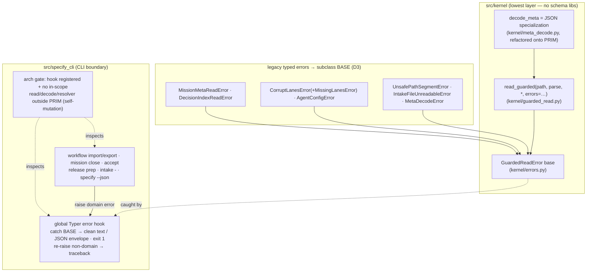
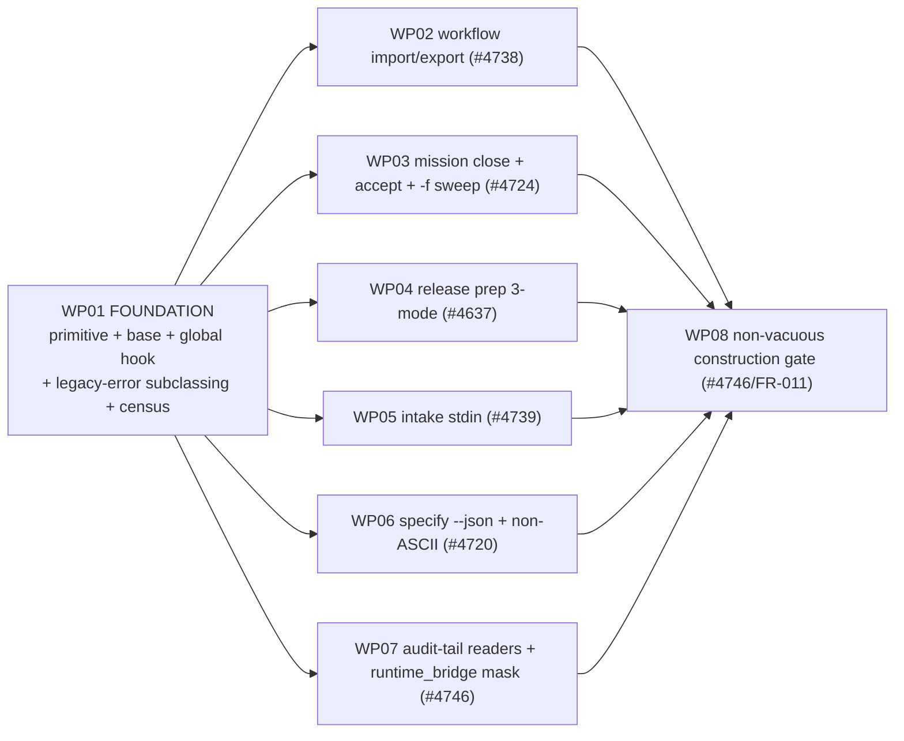

# Implementation Plan: Canonical guarded-read + CLI error-presentation seam

**Branch**: `fix/cli-error-surface-seam` | **Date**: 2026-09-19 | **Spec**: [spec.md](./spec.md)
**Input**: Feature specification from `kitty-specs/cli-error-surface-seam-01M2WJD2/spec.md`
**Umbrella**: #2899 · **Children in scope**: #4746, #4738, #4724, #4637, #4739, #4720

## Summary

Build two collaborating pieces and adopt them across the umbrella-#2899 open
remainder: (1) a **format-agnostic guarded-read primitive** in `kernel` that wraps a
caller-supplied parse callable + declared exception tuple into one typed
`GuardedReadError` base (always covering `OSError`/`UnicodeDecodeError`), and (2) a
**single global Typer error-presentation hook** in the CLI layer that catches that
base (+ subclasses), renders a clean human message or a `{"error": …}` JSON object at
exit 1, and re-raises everything else. The seven existing typed read errors become
subclasses of the base (preserving ~85 downstream `except` sites); the crashing
commands (`workflow import/export`, `mission close`, `accept`, `agent release prep`,
`intake -`, `specify --json`) raise domain errors the hook presents; the audit-tail
readers are hardened contract-preservingly; and a non-vacuous architectural gate
keeps the class closed.

## Technical Context

**Language/Version**: Python 3.11+ (CI runs 3.11/3.12; contributor reproductions on 3.13)
**Primary Dependencies**: typer + rich (CLI/presentation), PyYAML (`workflow_registry`), pydantic (runtime `WorkflowFile` model), `tomllib` (stdlib, release payload), ruamel.yaml (frontmatter). **No new dependency is added or upgraded.**
**Storage**: filesystem state files (JSON `meta.json`/`index.json`, YAML workflows/`wps.yaml`, TOML `pyproject.toml`); no database.
**Testing**: pytest (unit + integration + CLI), `@pytest.mark.regression` red-first repros, `tests/architectural/` (pytestarch layer rules + the new construction gate).
**Target Platform**: Linux / macOS / Windows CLI.
**Project Type**: single (CLI library, `src/` packages `kernel` → `specify_cli` + `runtime`).
**Performance Goals**: CLI < 2 s typical project; the primitive adds no extra decode pass and no additional file `open` vs the current reader (NFR-003, structural).
**Constraints**: `kernel` imports **no** schema/validation library (pydantic/tomllib/yaml decoders stay in the caller layer, C-004); cyclomatic complexity ≤ 15; ruff + mypy `--strict` clean, no gate-silencing suppressions (C-007); ≥ 90 % new-code coverage; kernel symbols declare `__all__` with ≥ 1 caller (C-007/charter).
**Scale/Scope**: 6 issues, 1 kernel primitive + 1 base error + 1 global hook, 7 tail readers hardened, 7 legacy errors re-parented, ~85 `except`-site census (src + tests), 1 arch gate; ~8 work packages.
**Supply-chain (DIRECTIVE_051)**: N/A for install-safety — this mission adds/upgrades/removes **no** dependency; all libraries used already ship. Recorded explicitly (silence ≠ compliance) in `research.md`.

## Constitution / Charter Check

*GATE: pass before Phase 0; re-check after Phase 1.*

| Principle | Status | Notes |
|-----------|--------|-------|
| Single canonical authority (DIRECTIVE_044) | ✅ | Exactly one primitive + one hook; legacy emitters fold in; legacy errors subclass one base. |
| Architectural alignment (DIRECTIVE_001) | ✅ | Primitive in `kernel` (lowest layer); no schema lib crosses into kernel; hook at the `specify_cli` CLI boundary. Verified against `tests/architectural/test_layer_rules.py`. |
| DDD + tiered rigour | ✅ | Kernel primitive = core (max rigour, full unit matrix); per-command adoption = glue (focused tests). |
| ATDD-first (C-011) | ✅ | Each defect WP lands a red-first `@pytest.mark.regression` repro through the pre-existing command entry point; constructive WPs proven by the self-mutation gate. |
| Terminology canon | ✅ | New strings/flags use `--mission`; `-f`=`--mission` alias removed, no `--feature` introduced. |
| Architectural gate discipline (DIRECTIVE_043, SO#5) | ✅ | FR-011 gate: concrete floor + self-mutation non-vacuity test + shrink-only allowlist. |
| `__all__` + dead-symbol (C-007) | ✅ | New kernel symbols declare `__all__`, exercised by callers. |
| Identifier safety | ✅ | Non-ASCII reject + no-partial-write negative assertion (NFR-005). |
| No gate-silencing suppressions (C-007) | ✅ | Complexity ≤ 15; helpers extracted; no blanket ignores. |

No violations → Complexity Tracking table omitted.

## Architecture



### Module placement (confirmed against the layer rules)

- `src/kernel/guarded_read.py` **(new)** — `read_guarded(path, parse, *, errors=(...))` and the primitive helpers. Declares `__all__`.
- `src/kernel/errors.py` **(edit)** — add the `GuardedReadError` base (or reuse the existing internal-consistency base family), declared in `__all__`.
- `src/kernel/meta_decode.py` **(edit)** — `decode_meta` refactored to sit on `read_guarded` (JSON specialization), preserving shipped #4600/#4642 behavior.
- Legacy errors re-parented **in place** (each remains importable at its current path): `core/paths.py` (`MissionMetaReadError`, `UnsafePathSegmentError`), `decisions/store.py` (`DecisionIndexReadError`), `lanes/persistence.py` (`CorruptLanesError`/`MissingLanesError`), `core/agent_config.py` (`AgentConfigError`), `intake/…` (`IntakeFileUnreadableError`).
- `src/specify_cli/cli/…` — the global Typer error hook registered on the top-level app; per-command edits raise domain errors instead of crashing / `typer.BadParameter`.
- `tests/architectural/test_cli_error_surface_seam.py` **(new)** — the FR-011 construction gate + self-mutation test.

## Project Structure

### Documentation (this mission)

```
kitty-specs/cli-error-surface-seam-01M2WJD2/
├── plan.md              # this file
├── research.md          # Phase 0
├── data-model.md        # Phase 1 (error taxonomy + envelope shapes)
├── quickstart.md        # Phase 1 (how to adopt the seam in a new command)
├── contracts/           # Phase 1 (error-envelope + primitive contracts)
├── traces/              # tracer files (seeded)
└── tasks/               # Phase 2 (/spec-kitty.tasks — NOT created here)
```

### Source Code (repository root)

```
src/
├── kernel/
│   ├── guarded_read.py        # NEW — format-agnostic primitive
│   ├── errors.py              # EDIT — GuardedReadError base
│   └── meta_decode.py         # EDIT — JSON specialization onto the primitive
├── specify_cli/
│   ├── cli/
│   │   ├── <app bootstrap>    # EDIT — register global error hook
│   │   └── commands/
│   │       ├── workflow.py    # EDIT (#4738)
│   │       ├── mission_type.py# EDIT (#4724 close + -f sweep)
│   │       ├── accept.py      # EDIT (#4724 sibling, found crashing)
│   │       ├── intake.py      # EDIT (#4739)
│   │       ├── lifecycle.py   # EDIT (#4720 _slugify_feature_input)
│   │       └── agent/status.py# EDIT (-f sweep siblings)
│   ├── release/payload.py     # EDIT (#4637 3-mode)
│   ├── decisions/service.py   # EDIT (#4746 partial-guard)
│   ├── merge/state.py         # EDIT (#4746 partial-guard)
│   ├── review/{baseline,lock,artifacts}.py  # EDIT (#4746)
│   ├── status/validate.py     # EDIT (#4746)
│   └── core/{paths,agent_config,wps_manifest}.py · lanes/persistence.py · decisions/store.py  # EDIT (subclassing)
└── runtime/next/
    ├── _internal_runtime/workflow_registry.py  # EDIT (#4738 caller-side guard)
    └── runtime_bridge.py      # EDIT (#4746 replace masking broad-except)

tests/
├── architectural/test_cli_error_surface_seam.py  # NEW gate
├── unit|status|cli|specify_cli/...               # per-WP regression + unit
```

**Structure Decision**: Single-project CLI library. The primitive lands in `kernel`
(importable by every consumer, no schema deps); the presentation hook lands at the
`specify_cli` CLI boundary; adoption edits are localized per command/reader.

## Parallel Work Analysis

### Dependency Graph



### Work Distribution

- **Sequential (foundation)**: **WP01** must land first — the primitive, the
  `GuardedReadError` base, the global hook, the legacy-error subclassing, and the
  `except`-site caller census (src + tests) that de-risks FR-013. Everything else
  imports from it.
- **Parallel streams (adoption)**: **WP02–WP07** each own a distinct command/reader
  set (see file map) and can run concurrently after WP01 — minimal file overlap.
- **Integration capstone**: **WP08** (the arch gate) lands last, after WP02–WP07,
  so the gate's concrete floor is clean and its self-mutation test is meaningful.

### Coordination Points

- **Shared file risk**: WP01 touches `kernel/*` + the 7 legacy-error definition
  files (subclassing). WP07 also touches some reader files that WP01's subclassing
  touches (`core/wps_manifest.py`, `decisions/store.py`). Sequence WP07 after WP01
  and keep WP01's edits to the *type hierarchy* only; WP07 owns the *reader logic*.
- **Census hand-off**: WP01 publishes the `except`-site census (a short table in
  `research.md` / a WP note) so every adoption WP knows which catchers depend on the
  type it may touch (NFR-006 back-compat regression).
- **Gate floor**: WP08 encodes the in-scope command list as the gate's floor; any WP
  that adds a new boundary updates the allowlist (shrink-only).

## STOP

Planning ends after Phase 1 artifacts. `/spec-kitty.tasks` will translate this into
work packages. Branch contract (repeat): plan ran on `fix/cli-error-surface-seam`;
planning/base branch `fix/cli-error-surface-seam`; completed changes consolidate into
`fix/cli-error-surface-seam`, then a PR targets `main` (upstream).
