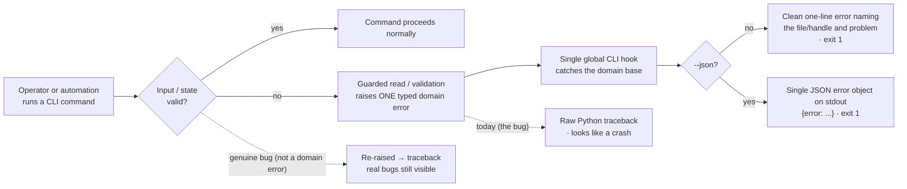

# Mission Specification: Canonical guarded-read + CLI error-presentation seam

**Mission Branch**: `fix/cli-error-surface-seam`
**Created**: 2026-09-19
**Status**: Draft
**Umbrella**: #2899 — harden traversal-guard / bad-input error surfaces
**Input**: Close the open remainder of umbrella #2899 by building the structural seam (#4746) and applying it to #4738, #4724, #4637, #4739, #4720.

## Summary

Several Spec Kitty CLI commands crash with a raw Python **traceback** when they meet
bad input or corrupt state — a malformed file, an invalid `--mission` handle, a
missing `pyproject.toml`, a non-UTF-8 stream. A traceback reads as *the tool broke*,
not *your input was rejected*, and it breaks machine consumers that parse `--json`
output. Every occurrence is the same defect class: an untyped exception reaching a
user-facing command boundary instead of a clean, actionable, typed error.

This mission closes the class **by construction** with two collaborating pieces:

1. **A format-agnostic guarded-read primitive in `kernel`** — it wraps a
   caller-supplied parse/decode callable and a caller-declared caught-exception
   tuple, always covers `OSError` + `UnicodeDecodeError`, and collapses the declared
   failures into **one typed domain-read error base**. It owns *read + guard*, not
   *decode + validate*: format/schema knowledge (YAML, pydantic, `tomllib`) stays in
   the caller's layer, so kernel imports no schema/validation library.
2. **A single global CLI-boundary error-presentation hook** — a Typer-level handler
   that catches the one domain base (and its subclasses), renders a clean human
   message (text) or a JSON error object (under `--json`) with exit code 1, and
   **re-raises everything else** so genuine bugs still surface as tracebacks. It is
   the single authority; the existing per-command bespoke emitters fold into it.

Because a single hook catches a single base, **every** command boundary is covered
at once, and a non-vacuous architectural gate keeps a *new* reader or command from
shipping crashing by omission.

The guards **fail closed**: they change only the *surface* (traceback → typed
error), never the *decision* (bad input is still rejected; the `..` traversal guard
still refuses traversal). Already-shipped fixes (#4600, #4642, #2878, #2879, #4533)
are generalized, not reworked; #2879 already closed the orchestrator-api half of the
umbrella, so scoping the new hook to the CLI boundary is correct, not under-delivery.

### Observable behavior (product intent)

### Design decisions carried from the post-spec adversarial squad

- **D1 — Format-agnostic kernel primitive.** The primitive takes a caller-supplied
  parse callable + declared exception tuple; kernel imports no pydantic / tomllib /
  yaml decoder. `meta_decode.decode_meta` is the JSON specialization layered on it.
- **D2 — Global Typer hook, not a decorator.** An opt-in decorator is forgettable
  (the omission that bit #4642) and only gate-able by gameable presence; the global
  hook cannot be forgotten and closes every boundary at once.
- **D3 — Subclass compatibility, never flat type replacement.** Legacy typed errors
  become subclasses of the shared base so the ~85 existing `except` sites keep
  matching (census: `src` + `tests`, before any raised-type change).
- **D4 — Exit codes.** Handled domain errors → exit **1** (matches #4600/#4642);
  Typer *usage* errors keep exit **2** and are never swallowed by the hook.
- **D5 — Missing-vs-corrupt contract preserved.** Hardening a reader keeps its
  current `None`/empty return for *absent* input; only decode/parse/schema failure
  routes to the typed error.

## User Scenarios & Testing *(mandatory)*

### User Story 1 - Bad input never crashes a command (Priority: P1)

An operator or automation agent runs an in-scope command with input that cannot be
honored. Instead of a Python traceback they get a single clean, actionable error
that names what was wrong, exit 1 (or a `{"error": …}` JSON object under `--json`).
Delivered by the format-agnostic primitive + the global presentation hook, adopted by
every affected command.

**Why this priority**: Core value; covers four of the six defects (#4738, #4724,
#4637, #4739). MVP — the "crash on bad input" class is visibly gone.

**Independent Test**: Run each documented reproduction from #4738/#4724/#4637/#4739;
assert exit 1, an actionable typed message, and zero traceback frames; assert the
`--json` variants emit one JSON object on stdout.

**Acceptance Scenarios**:

1. **Given** a malformed YAML file, **When** `spec-kitty workflow import bad.yaml`,
   **Then** a clean error names the file and the parse problem, exit 1 — no
   traceback. (#4738)
2. **Given** a valid-YAML-but-wrong-schema or wrong-top-level-type file, **When**
   `workflow import`, **Then** a clean "invalid workflow file" error, no pydantic
   traceback. (#4738)
3. **Given** a corrupt resolved/override workflow, **When** `spec-kitty workflow
   export <id> <dest>`, **Then** the same clean typed error, no traceback. (#4738,
   export path)
4. **Given** an invalid `--mission` value (`'bad seg!'`, `'..'`), **When**
   `spec-kitty mission close --mission '<value>'` **or** `spec-kitty accept --mission
   '<value>'`, **Then** a clean "not a safe path segment" / "mission not found" error
   via the hook, exit 1 — no `UnsafePathSegmentError` traceback. (#4724; `accept`
   found crashing live 2026-09-19 — same class, fixed for free by the single hook)
5. **Given** a project with **(a)** no `pyproject.toml`, **(b)** a `pyproject.toml`
   lacking `[project].version`, or **(c)** a malformed/unparseable `pyproject.toml`,
   **When** `spec-kitty agent release prep --channel alpha` (and `--json`), **Then**
   each yields a clean typed error (a JSON error object under `--json`), exit 1 — no
   `FileNotFoundError` / `KeyError` / `TOMLDecodeError` traceback. (#4637)
6. **Given** non-UTF-8 bytes on **stdin**, **When** `spec-kitty intake -`, **Then**
   the same clean exit-1 handling the file path already gives, no
   `UnicodeDecodeError` traceback. (#4739)

---

### User Story 2 - `specify` honors its JSON contract and rejects non-ASCII names clearly (Priority: P1)

An automation consumer calls `spec-kitty specify '<name>' --json`. Today a name that
slugifies to empty (any non-Latin-script name) is a Rich panel on stderr with exit 2
and empty stdout — inconsistent with every other `specify` error — and accented/mixed
names silently lose characters. After this mission, `specify` name validation stops
raising `typer.BadParameter` (which bypasses the hook and forces exit 2/stderr) and
raises a domain error the hook owns: all `specify` errors become a JSON error object
on stdout with a consistent exit code, and non-ASCII names are rejected explicitly
with the offending value named. No silent character drop; no partial identifier
written.

**Why this priority**: `--json` is the automation contract; non-ASCII names are a
correctness and identifier-safety issue (#4720); confirmed policy is *reject
explicitly*.

**Independent Test**: `specify '日本語' --json`, `specify 'Ünïcödé' --json`, `specify
'auth日本' --json`; assert a JSON error object on stdout, exit 1, message naming the
value, and that **no** mission directory / branch / slug / meta identifier is
created.

**Acceptance Scenarios**:

1. **Given** a name that reduces to no usable ASCII characters, **When** `specify
   '日本語' --mission-type software-dev --json`, **Then** stdout carries a JSON
   `{"error": …}` object with the same exit code as other `specify --json` errors —
   not a Rich panel on stderr with exit 2. (#4720)
2. **Given** an accented-Latin name, **When** `specify 'Ünïcödé' --json`, **Then** it
   is rejected with the value named — not silently slugified to `n-c-d`. (#4720)
3. **Given** a mixed ASCII-prefix + non-ASCII name, **When** `specify 'auth日本'
   --json`, **Then** it is rejected with the value named — **not** silently accepted
   as `auth` (the sharpest silent-drop case). (#4720)
4. **Given** the same non-ASCII rejection, **When** run without `--json`, **Then** a
   clean human-readable error stating the name has no usable ASCII characters and
   showing the value, exit 1.

---

### User Story 3 - The class stays closed by construction (Priority: P2)

A maintainer adds a new reader or command later. A non-vacuous architectural gate
fails the build if a user-facing command can reach the operator as an untyped
traceback. The known tail of still-unguarded readers is hardened so the gate starts
from a clean floor, and each is proven through its **real command entry point**, not
in isolation.

**Why this priority**: Without the gate the class re-opens on the next command (this
is already the 4th+ occurrence). Charter Standing Order #5 requires closing defect
classes with a non-vacuous call-site gate. Depends on US1's primitive + hook.

**Independent Test**: A self-mutation test that (a) removes the hook registration and
(b) introduces a simulated in-scope command with a bare read/decode outside the
primitive — the gate must fail on each; the gate must pass on the hardened tree. Plus
a command-boundary red-first repro per audit-tail reader.

**Acceptance Scenarios**:

1. **Given** the primitive + global hook exist, **When** the gate runs against a tree
   where the hook registration is removed OR an in-scope command reaches a
   read/decode/resolver outside the primitive, **Then** the gate fails (non-vacuity
   proven by the self-mutation test). (#4746, FR-011)
2. **Given** the named partial-guard readers (`decisions/service.py`,
   `merge/state.py`, `review/baseline.py`), **When** fed non-UTF-8 content **through
   their reachable command**, **Then** the operator sees the typed domain error, not
   `UnicodeDecodeError`. (#4746)
3. **Given** the named unguarded readers (`review/lock.py`, `review/artifacts.py`,
   `status/validate.py`, `core/wps_manifest.py`), **When** fed corrupt content
   **through their reachable command** (e.g. `finalize-tasks` for `wps_manifest`),
   **Then** the operator sees the typed error via the hook — and the masking broad
   `except Exception` around `wps_manifest`'s call in `runtime_bridge.py` is replaced
   by the typed seam without changing the behavior of the other operations that block
   currently guards. (#4746)
4. **Given** a reader whose *absent-input* path currently returns `None`/empty (e.g.
   `load_wps_manifest` → `None` when `wps.yaml` is absent), **When** the reader is
   hardened, **Then** the absent-input path still returns `None`/empty; only
   corrupt/malformed input routes to the typed error. (D5)

---

### User Story 4 - The `-f` = `--mission` footgun is removed (Priority: P3)

`mission close`'s `--mission` has a `-f` short flag, which reads as "force" and
collides with the destructive `--discard` path, so `mission close -f --discard` binds
`--discard` as the mission value and crashes. The `-f` alias is removed from every
`--mission` option that currently carries it, not just `mission close`.

**Why this priority**: Small, self-contained UX fix; eliminates the most common way
to trigger #4724.

**Independent Test**: `mission close --help` (and the other affected commands) show
no `-f` alias for `--mission`; `mission close -f --discard` no longer binds `-f` to
`--mission`.

**Acceptance Scenarios**:

1. **Given** the updated CLI, **When** `spec-kitty mission close --help`, **Then**
   `--mission` has no `-f` short alias. (#4724 secondary)
2. **Given** the sibling commands that also alias `-f`→`--mission`, **When** their
   `--help` is shown, **Then** none advertises `-f` for `--mission` (swept as one
   campsite class), or any deliberately retained alias is documented with rationale.

---

### Edge Cases

- A file that exists but is unreadable (permission denied) → typed error, not `OSError` traceback.
- An empty file / empty stdin → typed "empty or invalid" error, not a downstream `NoneType` crash.
- A workflow file whose `workflow_id` disagrees with the requested id → existing `UnknownWorkflowError` message, presented via the hook.
- A corrupt file under `--json` → one JSON error object, never partial JSON + traceback mixed on stdout.
- Whitespace-only name vs non-ASCII-only name → both rejected, with messages that distinguish "no name given" from "no usable ASCII characters in '<value>'".
- A genuine bug (a `KeyError` from real logic, not a declared domain failure) → re-raised by the hook as a traceback, so real defects stay visible.
- The traversal guard (`..`) must still *reject* — the fix changes surface, never the security decision.

## Requirements *(mandatory)*

### Functional Requirements

| ID | Title | User Story | Priority | Status |
|----|-------|------------|----------|--------|
| FR-001 | Format-agnostic guarded-read primitive (kernel) | As a maintainer, I want one kernel primitive that wraps a caller-supplied parse callable + declared exception tuple (always incl. `OSError`/`UnicodeDecodeError`) and collapses them into one typed domain-read base, owning read+guard only — no decode/schema library in kernel. (Source: #4746; squad C1/M2) | High | Open |
| FR-002 | Single global CLI-boundary presentation hook | As an operator, I want one Typer-level hook that catches the domain base (+ subclasses), renders a clean human message or a JSON error object with exit 1, and re-raises all non-domain exceptions; existing bespoke emitters fold into it. (Source: #4746; squad H1/D2) | High | Open |
| FR-003 | `workflow import` guards invalid files | As an operator, I want `workflow import` to reject malformed YAML, wrong-schema, wrong-top-level-type, and unreadable files with a clean error naming file + problem, via the hook. (Source: #4738) | High | Open |
| FR-004 | `workflow export` guards a corrupt resolved workflow | As an operator, I want `workflow export` to present a corrupt resolved/override workflow through the hook, not a traceback, with an acceptance test. (Source: #4738) | Medium | Open |
| FR-005 | `mission close` guards an invalid `--mission` | As an operator, I want `mission close` to reject an unsafe/`..` `--mission` value via the hook (exit 1); the single hook covers every command that resolves a mission handle, not just `mission close`. (Source: #4724) | High | Open |
| FR-006 | Remove `-f` short alias from `--mission` | As an operator, I want the `-f` short flag removed from every `--mission` option that carries it (`mission close` + the sibling sites), because `-f` reads as force on a command with a destructive discard path. (Source: #4724 secondary; squad M1) | Low | Open |
| FR-007 | `agent release prep` guards all pyproject failure modes | As an operator of a non-Python project, I want `agent release prep` to report a clean error (JSON object under `--json`, exit 1) for a missing `pyproject.toml`, a missing `[project].version`, and a malformed/unparseable file. (Source: #4637; squad H1) | High | Open |
| FR-008 | `intake -` guards non-UTF-8 stdin (text-stream path) | As an operator, I want `intake -` to handle non-UTF-8 stdin as the file path does (exit 1), by guarding the `stream.read()` for the text-stream path (or reading `stdin.buffer` and decoding inside the guard) — the existing bytes-branch guard does not cover it. (Source: #4739; squad H3) | Medium | Open |
| FR-009 | `specify` name validation raises a hook-owned domain error | As an automation consumer, I want `specify` name validation to stop raising `typer.BadParameter` and raise a domain error the hook owns, so every `specify` error is a JSON object on stdout with a consistent exit code. (Source: #4720; squad H2) | High | Open |
| FR-010 | `specify` rejects non-ASCII names explicitly | As an operator, I want a non-ASCII name rejected with the value named (never silently truncated); no partial identifier written; original preserved only for human display. Routes through the presentation hook, NOT the read primitive. (Source: #4720; decision 01M2WJE53KMFBGEJX8JMFT71EE) | High | Open |
| FR-011 | Non-vacuous closed-by-construction gate | As a maintainer, I want a gate whose named invariant is: the Typer app registers the domain-error hook, AND no in-scope command reaches a read/decode/resolver outside the primitive (AST/call-graph scan of the named helpers); proven non-vacuous by a self-mutation test. (Source: #4746; charter SO#5; squad C2) | High | Open |
| FR-012 | Harden the named audit-tail readers (contract-preserving) | As a maintainer, I want the named partial-guard and unguarded readers routed through the primitive, preserving each reader's missing-vs-corrupt return contract, replacing the masking broad `except Exception` at `runtime_bridge.py` with the typed seam, and tested through the real command entry point. (Source: #4746 item 3; squad CRITICAL-2/HIGH-1) | High | Open |
| FR-013 | Consolidate typed read errors by subclassing | As a maintainer, I want the concrete legacy errors (`MetaDecodeError`, `MissionMetaReadError`, `DecisionIndexReadError`, `CorruptLanesError`+`MissingLanesError`, `AgentConfigError`, `UnsafePathSegmentError`, `IntakeFileUnreadableError`) reconciled as subclasses of the shared base and routed through the hook — never flat-replaced — preceded by an `except`-site caller census across `src` + `tests`. (Source: #4746 item 1; squad CRITICAL-1/L1) | Medium | Open |

### Non-Functional Requirements

| ID | Title | Requirement | Category | Priority | Status |
|----|-------|-------------|----------|----------|--------|
| NFR-001 | Zero tracebacks on documented repros | 100% of the documented bad-input reproductions in #4738/#4724/#4637/#4739/#4720 produce a typed, actionable, exit-1 error with 0 traceback frames on any output stream. | Reliability | High | Open |
| NFR-002 | Machine-contract cleanliness + exit-code boundary | Under `--json`, every in-scope error path emits exactly one well-formed JSON object on stdout (parseable), no non-JSON prose on stdout; handled domain errors exit 1; the hook catches only the domain base and never converts a Typer usage error (exit 2) to exit 1. | Compatibility | High | Open |
| NFR-003 | No added read work | The guarded-read primitive performs no extra decode pass and opens no additional file handle vs the current reader; the happy path adds no I/O. (Structural budget — not a wall-clock micro-benchmark.) | Performance | Medium | Open |
| NFR-004 | New-code coverage | New/changed code meets ≥ 90% coverage; each new branch/helper has a focused test in the same commit (Sonar new-code gate). | Maintainability | High | Open |
| NFR-005 | Identifier-safety: no partial write on reject | On a rejected non-ASCII name, no mission directory / branch / slug / meta identifier is created (negative assertion — the real data-loss guard). Regression coverage includes ≥ 1 accented-Latin and ≥ 1 non-Latin-script example. | Security | High | Open |
| NFR-006 | Exception back-compat | Every consolidated legacy error type remains catchable by its existing `except` sites (including tuple-catches and the `MissingLanes`/`CorruptLanes` coupled pair); a regression test asserts each legacy type is still caught after consolidation. | Compatibility | High | Open |

### Constraints

| ID | Title | Constraint | Category | Priority | Status |
|----|-------|------------|----------|----------|--------|
| C-001 | Fail-closed preserved | Guards change only the error surface; no previously-rejected input becomes accepted. The `..` traversal guard still refuses traversal. | Technical | High | Open |
| C-002 | Single canonical authority | Exactly one guarded-read primitive and one presentation hook; existing bespoke emitters fold into the hook; no second parallel emit/guard path. | Technical | High | Open |
| C-003 | ATDD / red-first through the pre-existing entry point | Each defect lands an issue-pinned `@pytest.mark.regression` repro RED through the pre-existing command entry point before the fix; transitional repros become focused unit tests after. The constructive FR-001/002/011 are proven by the self-mutation gate (US3-1), not a pre-existing-entry-point repro. | Technical | High | Open |
| C-004 | Kernel placement + no decode libs + `__all__` | The primitive respects `kernel <- charter <- … <- specify_cli`; kernel imports no schema/validation library (pydantic/tomllib/yaml decoders stay in the caller layer); a kernel symbol declares `__all__` and has ≥ 1 caller in `src/` (charter C-007). | Technical | High | Open |
| C-005 | Subsumed fixes not reworked | Shipped behavior of #4600, #4642, #2878, #2879, #4533 stands; this mission generalizes and reconciles (subclassing), it does not rework them. | Technical | High | Open |
| C-006 | Terminology canon | New user-facing strings/flags use `Mission`/`--mission`, never `Feature`/`--feature`. | Business | Medium | Open |
| C-007 | No gate-silencing suppressions | No blanket `# noqa` / `# type: ignore` / per-file ignores to pass gates; cyclomatic complexity ≤ 15; ruff + mypy clean. | Technical | High | Open |

### Key Entities

- **Guarded-read primitive**: a kernel helper that performs read + guard around a caller-supplied parse callable, yielding one typed domain-read error base on declared failures.
- **Domain-read error base**: the single exception base the CLI hook catches; the legacy typed errors are its subclasses.
- **CLI presentation hook**: the single Typer-level authority that renders a domain error as human text or a `{"error": …}` JSON object (exit 1), re-raising non-domain exceptions.
- **In-scope command boundary**: each command that reads state or validates operator input (`workflow import/export`, `mission close`, `agent release prep`, `intake`, `specify`) plus the audit-tail readers' reachable commands.

## Success Criteria *(mandatory)*

### Measurable Outcomes

- **SC-001**: Every documented reproduction across #4738, #4724, #4637 (all three pyproject modes), #4739, #4720 produces a clean, actionable, exit-1 error with **zero** traceback frames.
- **SC-002**: Under `--json`, every in-scope error path returns a single parseable JSON error object on stdout with exit 1; no non-JSON prose on stdout; Typer usage errors still exit 2.
- **SC-003**: The construction gate **fails** when the hook registration is removed OR a simulated in-scope command reaches a read/decode/resolver outside the primitive (non-vacuity proven by the self-mutation test) and **passes** on the hardened tree.
- **SC-004**: Each named audit-tail reader has a regression test through its real command entry point proving the operator no longer sees a traceback on non-UTF-8 / corrupt input, and its absent-input `None`/empty contract is preserved.
- **SC-005**: `mission close --help` (and the swept siblings) show no `-f` alias for `--mission`; `mission close -f --discard` no longer crashes.
- **SC-006**: Non-ASCII names are rejected with the value named; no partial identifier written; the identifier-safety regression (accented-Latin + non-Latin-script + no-write assertion) passes.
- **SC-007**: Every consolidated legacy error type is still caught by its existing `except` sites (back-compat regression green).
- **SC-008**: All six umbrella-#2899 children in scope (#4746, #4738, #4724, #4637, #4739, #4720) map to passing acceptance scenarios and are closeable.

## Assumptions

- The primitive lives in `kernel`; the CLI hook lives at the CLI application boundary (`specify_cli`). Final module placement is confirmed at plan time against the `landscape` fixture.
- The hook catches a single domain base (`kernel/errors.py`'s existing base or a new `CliDomainError`), decided at plan time under C-002.
- `intake` file-path handling is the fix exemplar for #4739; `next`/`merge` (which DO catch `UnsafePathSegmentError`) are exemplars for #4724. `accept.py` is *not* an exemplar — verified live 2026-09-19 that `accept --mission 'bad seg!'` crashes with a traceback (exit 1); it is the same class and the single hook fixes it too, with its own regression test.
- Exit code 1 is the canonical handled-domain-error code (matches #4600/#4642). Scope decision: the **crashing** boundaries (`mission close`, `accept`, the file/stream commands) are fixed to exit 1 via the hook; `next` already returns a clean exit **2** and is left untouched (changing a working command adds test churn for no bug fix — charter locality/smallest-diff). The residual `next`(2)-vs-others(1) inconsistency is pre-existing and called out in the PR as an optional future consistency follow-up, not folded here.
- The FR-013 caller census (src + tests) is a plan/first-implement deliverable before any raised-type change.
