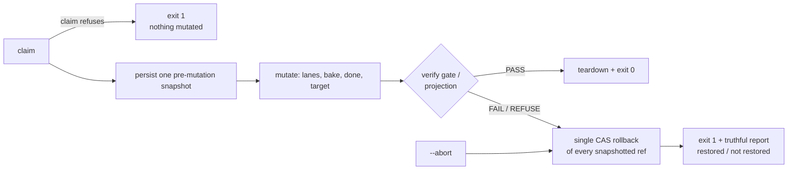

# Mission Specification: Consolidation claim, rollback and teardown integrity

**Mission Branch**: `issue-5338-consolidation-claim-rollback-integrity`  
**Created**: 2026-09-29  
**Status**: Draft  
**Input**: Slice 10 of epic #5001 — #5338 (P0), #5318 (P0), #5296 (P0), folded #5332 (P1). Operator decisions recorded as Decision Moments `01M3PD3NAECRSVPYZ6J5KWDTDW` (scope), `01M3PD3VP1YTQ4D17HT96JA0T2` (CAS ref restore), `01M3PD41NQ6J6EX8V2HYDDRGPZ` (planning self-heal refuses).

## Intent Summary

An **operator** runs `spec-kitty consolidate` on a mission. Today a consolidation that is going to refuse can first merge lanes into the mission branch, record work packages as done, assign a mission number, commit seed events and even advance the target branch — and then say "nothing was mutated". A later failure restores only the target, so the next attempt measures from an already-advanced base and refuses the mission's own work (or, combined with the missing refusal rollback, ships content that should never land). A planning work package that depends on code lanes can also merge those code lanes straight onto the target branch before consolidation ever runs.

This mission makes consolidation **transactional from the operator's point of view**:

- If consolidation can already tell at claim time that it must refuse, it exits non-zero **before touching anything**.
- If a later check fails or refuses, **one** rollback authority restores **every** branch the run moved back to **one** pre-mutation snapshot, using compare-and-swap so it never overwrites a branch someone else moved.
- `--abort` restores through the same authority, so the next run never starts from a poisoned base.
- A planning-lane claim never merges code lanes onto the target branch in the repository root checkout; it proceeds without them, and the code arrives through consolidation.
- Every refusal says truthfully what moved and what was restored.

**Invariant** (scoped, post-spec squad finding 4): a claim-time refusal, a reconciliation-gate FAIL/REFUSE, a squash-projection refusal, or an `--abort` leaves every branch the run may move at its pre-run value, or names each branch it could not restore and why. A landing the gate has already verified (a persisted PASS for the current target tip) is never rolled back. Exits after a gate PASS (push, teardown) are resumable and out of scope; other in-phase exits keep their existing rollbacks (residual R3).

## User Scenarios & Testing *(mandatory)*

### User Story 1 - A refusal known at claim time changes nothing (Priority: P1) — #5338

An operator resumes (or starts) a consolidation whose approved-work claim already cannot be proven — for example an approved lane's branch no longer exists. Consolidation stops immediately with a non-zero exit and recovery guidance, and the repository is exactly as it was.

**Why this priority**: it is the cheapest cut that stops the wedge at its source; every other refusal path becomes a rarer backstop.

**Independent Test**: build a real mission in a temporary repository, produce a claim-time refusal, run `spec-kitty consolidate`, and compare every branch tip, worktree list, `state.json` and event log before and after.

**Acceptance Scenarios**:

1. **Given** a mission whose consolidation claim refuses (an approved lane's branch is gone), **When** the operator runs `spec-kitty consolidate --resume`, **Then** the command exits non-zero, prints recovery guidance, and the target branch, mission branch and every lane branch keep their exact pre-run commit, and no done event, mission number or merge commit is written.
2. **Given** a fresh consolidation whose claim refuses, **When** it exits, **Then** no consolidation record is left behind that a later run would resume from.
3. **Given** a resumed consolidation whose reconciliation already passed before an interruption (the lanes are already torn down), **When** it resumes, **Then** it is **not** refused by this check and completes as before.

---

### User Story 2 - A failed gate restores every branch it moved (Priority: P1) — #5318, #5332

An operator's consolidation fails or is refused at the reconciliation gate (or at the squash-projection check) after lanes were merged, the mission number baked and work recorded done. Consolidation restores the target, the mission branch and any lane branch it moved to their pre-run commits, clears the bookkeeping it recorded, exits non-zero, and reports exactly which branches it restored. After the operator fixes the cause, a fresh run (or `--abort` followed by a fresh run) measures from the true pre-run base and succeeds.

**Why this priority**: without it every retry of a wedged mission refuses its own work, and a refusal can ship content that should never land.

**Independent Test**: real mission whose gate genuinely fails; run consolidate; compare every branch tip and the consolidation record to the pre-run snapshot; remove the cause; `--abort`; re-run; assert success.

**Acceptance Scenarios**:

1. **Given** a consolidation whose reconciliation gate FAILs, **When** the command exits, **Then** it exits non-zero and target, mission branch and lane branches are at their pre-run commits, and the consolidation record no longer claims the mission number was baked or any work package is completed.
2. **Given** a consolidation whose gate REFUSEs after mutating, **When** the command exits, **Then** the same restoration holds (never "target left advanced").
3. **Given** a consolidation whose squash-projection check refuses (including on the resume short-circuit), **When** the command exits, **Then** the same restoration holds and the exit is non-zero.
4. **Given** a failed consolidation, **When** the operator runs `--abort`, **Then** every snapshotted branch is restored before the record is cleared, and a following fresh run captures the true pre-run base.
5. **Given** a branch that someone else moved after the snapshot, **When** rollback runs, **Then** that branch is **not** overwritten, it is named as "not restored" with its observed and expected commits, and the command exits non-zero.

---

### User Story 3 - A planning work package never writes code-lane content onto the target (Priority: P2) — #5296

An operator claims a planning work package (which runs in the repository root checkout on the target branch) that depends on approved code work packages in other lanes. The claim proceeds, but the code lanes are **not** merged onto the target branch: the target branch does not move, and the code reaches the target only through `spec-kitty consolidate`, where it is attributed to its approved work packages. (Refusing the claim was rejected: consolidation requires every work package — including this planning one — to be approved first, so "consolidate the code lanes first" would deadlock; DM `01M3PJWGGKTRT9W03MJHFV44Q2` supersedes DM `01M3PD41NQ6J6EX8V2HYDDRGPZ`.)

**Why this priority**: it removes a way to bypass the consolidation window entirely; less frequent than stories 1–2 but equally destructive when hit.

**Independent Test**: real LANES mission with a code lane and a planning work package depending on it; approve the code work package; claim the planning work package; assert the claim succeeds, the target branch commit is unchanged and no code-lane file appears in the repository root checkout; then consolidate and assert the reconciliation gate passes with the code attributed.

**Acceptance Scenarios**:

1. **Given** a planning work package depending on an approved code-lane work package, **When** the operator claims it, **Then** the claim succeeds, the target branch commit is unchanged, and the code lane's files are not in the repository root checkout.
2. **Given** that mission after the planning work package is approved, **When** the operator runs `spec-kitty consolidate`, **Then** the code lands on the target through consolidation and the reconciliation gate passes (no "empty authored set" refusal).
3. **Given** a planning work package whose repository root checkout is on a branch **other than** the mission's target branch, **When** it is claimed, **Then** the dependency self-heal behaves exactly as before (positive control: the waiver is scoped to "root checkout HEAD is the target branch" only).
4. **Given** any consolidation refusal or failure, **When** the message is printed, **Then** it lists which branches advanced and which were restored, and never states "no refs/worktrees were mutated" when a branch moved.

### Edge Cases

- A lane branch deleted between two consolidation attempts (claim-time refusal on resume).
- A process killed after the snapshot is persisted but before any mutation — the snapshot equals current tips; rollback is a no-op that reports "already at snapshot".
- A branch moved by another actor after the snapshot — CAS refuses; the branch is named, never overwritten.
- A target already restored by another backstop (e.g. an earlier gate rollback) — rollback reports "already at snapshot", not an error.
- A resumed run whose reconciliation already passed and whose lanes are torn down — the claim-time refusal must not fire, and rollback must not revert the verified landing (FR-011).
- `--abort` when a branch cannot be restored — the snapshot is kept (the record is not cleared) so no information is lost.
- A mission with no coordination branch (LANES / SINGLE_BRANCH topology) — the snapshot covers target, mission branch and lane branches only.

## Domain Language

| Canonical term | Meaning | Avoid |
|---|---|---|
| Pre-mutation snapshot | The single persisted record of every branch tip a consolidation may move, captured once before its first mutation | "checkpoint" (ambiguous with the existing coordination checkpoint), "baseline" |
| Rollback authority | The one component that restores snapshotted branches with compare-and-swap and reports per branch | "revert", "reset" (different git operations) |
| Claim-time refusal | A refusal derived from the approved-work claim before any mutation | "pre-flight failure" |
| Lane consolidation | Merging lanes into the mission branch and the mission into the target (local only) | "merge" unqualified, "publish" |

## Requirements *(mandatory)*

### Functional Requirements

| ID | Title | User Story | Priority | Status | Delivery | No-op passable? |
|----|-------|------------|----------|--------|----------|-----------------|
| FR-001 | Claim-time refusal exits before mutating | As an operator, I want a consolidation whose approved-work claim fails its integrity check (explicit claim refusal, unresolved surface, or empty claim against a non-empty manifest) to exit non-zero with recovery guidance before any lane merge, so that the target, mission and lane branch commits, the worktree list, the done/mission-number bookkeeping and the status event logs are unchanged (the post-fix marker re-stamp and a pre-existing pending-reconcile heal are excluded from the comparison) (#5338). | High | Open | [build] | no |
| FR-002 | Already-passed resume is exempt | As an operator, I want a resumed consolidation whose reconciliation already passed for the current target tip to keep completing, so that the claim-time refusal never false-refuses a torn-down resume (#5021). | High | Open | [ratchet] | yes — paired with FR-001 on the same fixture (FR-001 must refuse, FR-002 must exit 0) |
| FR-003 | One persisted pre-mutation snapshot | As an operator, I want consolidation to persist, once and before its first mutation, the commit of every branch it may move — target branch, mission branch, coordination branch when present, and every lane branch including the planning lane — and, just before the reconciliation gate, the post-mutation commit of each of those branches; `--resume` reuses the persisted snapshot and never recaptures it. The existing per-phase live checkpoints are unaffected. | High | Open | [build] | no |
| FR-004 | Gate FAIL/REFUSE restores every snapshotted branch | As an operator, I want a reconciliation-gate FAIL or REFUSE to restore every snapshotted branch to its snapshot commit and, once all are restored, clear the mission-number-baked / completed / reconciliation-passed bookkeeping in the consolidation record, exiting non-zero, so that a fresh run after fixing the cause succeeds (#5318). | High | Open | [build] | no |
| FR-005 | `--abort` restores through the same authority | As an operator, I want `--abort` to restore every snapshotted branch (holding the consolidation lock) before clearing the consolidation record and tearing down coordination; when any branch cannot be restored, the record is kept and the branch is named; a record without a snapshot (pre-fix) keeps today's behaviour with a notice. | High | Open | [build] | no |
| FR-006 | Projection refusal restores | As an operator, I want a squash-projection refusal to restore through the same authority and exit non-zero (#5332); this supersedes the "no rollback on projection refusal" rule (FOLD-5) except where FR-011 applies. | Medium | Open | [build] | no |
| FR-007 | Compare-and-swap discipline | As an operator, I want rollback to restore a branch only while it is still at the last post-mutation commit this run recorded for it (recorded after every mutating phase and before the gate); a branch that differs from its snapshot but has no recorded post-mutation commit is never guessed at; otherwise to name it as not restored with observed and expected commits and exit non-zero, so that rollback never destroys another actor's work. | High | Open | [build] | no |
| FR-008 | Planning self-heal never merges onto the target checkout | As an operator, I want claiming a planning work package whose worktree is the repository root checkout on the target branch to skip merging code dependency lanes and to waive code-lane ancestry for that claim, leaving the target branch commit unchanged, so that code reaches the target only through consolidation's attribution (#5296; DM 01M3PJWGGKTRT9W03MJHFV44Q2). | High | Open | [build] | no |
| FR-009 | Truthful refusal and failure text | As an operator, I want every consolidation refusal/failure/abort message in scope to be followed by the rollback report (restored / already at snapshot / not restored), and never to claim "no refs/worktrees were mutated" when a branch moved during the run (#5296). | High | Open | [build] | no |
| FR-010 | Single rollback authority | As a maintainer, I want the rollback of snapshotted branches for the claim/gate/projection/abort paths to live in exactly one component that each of those paths calls (pinned by a non-vacuous architectural test), so that coverage cannot drift between paths again. | Medium | Open | [build] | no |
| FR-011 | A verified landing is never rolled back | As an operator, I want the rollback authority to refuse (retain everything, report "verified landing kept", exit non-zero) when the consolidation record holds a reconciliation PASS for the current target commit, or when a snapshotted branch no longer exists, so that a crash mid-teardown followed by `--abort` or a refused resume never destroys the only copy of approved work. | High | Open | [build] | no |

### Non-Functional Requirements

| ID | Title | Requirement | Category | Priority | Status |
|----|-------|-------------|----------|----------|--------|
| NFR-001 | Rollback cost | Restoring a 4-lane mission's snapshot adds ≤ 2 s wall-clock to a failed consolidation on the test fixture. | Performance | Medium | Open |
| NFR-002 | Coverage | New/changed lines reach ≥ 90% diff coverage (CI diff-cover gate). | Maintainability | High | Open |
| NFR-003 | Complexity | Every touched or added function stays at cyclomatic complexity ≤ 15 (ruff C901 / Sonar S3776). | Maintainability | High | Open |
| NFR-004 | Real-ref evidence | Every acceptance test asserts real branch commit identifiers read from a real repository before and after the command; no mocked git for acceptance. | Reliability | High | Open |

### Constraints

| ID | Title | Constraint | Category | Priority | Status |
|----|-------|------------|----------|----------|--------|
| C-001 | #5359 overlap | Do not edit the functions open PR #5359 changes (gate body `_phase_reconcile_before_teardown`, `_rollback_target_after_failed_reconciliation`, `recovery_guidance`, `verify`/`build_approved_wp_set` family, `_run_real_merge`, `consolidate`) beyond an unavoidable call-site line; rebase onto #5359 if it lands first and note the overlap in the PR. | Technical | High | Open |
| C-002 | Topology | The mission runs in LANES topology with no coordination branch; the fix must hold for LANES, SINGLE_BRANCH and coordination topologies. | Technical | High | Open |
| C-003 | Red-first | Each defect gets a failing-first reproduction through the real `spec-kitty` CLI entry point in a temporary repository, committed before its fix. | Process | High | Open |
| C-004 | No heavy suites | Per `NO_FULL_HEAVY_SUITES_IN_MISSION`, no full `tests/architectural/`, e2e, performance or `make test-full` run during implement/review; targeted files and named gates only. | Process | High | Open |
| C-005 | ADR amendment | Record the single snapshot + single CAS rollback authority, snapshot immutability across resume/abort, ledger-derived refusal text and the planning self-heal refusal as an amendment to ADR `2026-09-19-1` (superseding the revert-only rule on this path), not a parallel ADR. | Governance | Medium | Open |
| C-006 | Local consolidation only | Lane consolidation lands on local branches only; nothing is published to origin/`main` by this mission. | Process | High | Open |
| C-007 | Destructive-op census | The pinned internals of the dependency-lane merge helper are not restructured; the planning refusal is a guard at its caller. | Technical | Medium | Open |

### Key Entities

- **Pre-mutation snapshot**: branch name → commit for every branch the run may move, plus the run's bookkeeping markers (mission number baked, completed work packages); persisted in the consolidation record; immutable for the life of the record.
- **Rollback report**: per branch — restored / already at snapshot / not restored (observed vs expected commit) — the single source for refusal/failure text.

## Assumptions

- The existing persisted anchors (pre-mutation coordination commit, pre-interrupt lane tips, pre-mutation target commit) are the seed of the snapshot; the snapshot extends rather than duplicates them.
- Worktree checkouts of a restored branch are re-synchronised by the caller of the rollback authority, as the existing compare-and-swap restore already expects.
- Residual R3 (post-spec squad finding 4; post-plan residual hunt finding X — a LANES mission targeting a protected branch raises an uncaught bookkeeping-policy refusal after the squash, leaving the target advanced): the other in-phase exits after the first mutation (baseline/bake/mission→target/done/commit phases) keep their existing per-phase rollbacks; unifying them into the single authority is out of scope. Follow-up: #5385.
- Residuals R1 (hard-kill zero-progress record resumed, PR #5285 — see #5372) and R2 (resume short-circuit exits 0 with a null mission number, PR #5305 — see #5371) are out of scope.

## Success Criteria *(mandatory)*

### Measurable Outcomes

- **SC-001**: In the #5338 reproduction, the target, mission and lane branch commits, the done/mission-number bookkeeping and the status event logs are identical before and after the refused command, and the exit code is non-zero. — [build] · no-op passable: no
- **SC-002**: In the #5318 reproduction (coordination topology), after a gate failure every snapshotted branch — including the coordination/mission branch — is back at its pre-run commit and the consolidation record no longer claims a baked mission number or completed work packages; after removing the cause a fresh run (with and without `--abort`) exits 0 with the mission's work attributed. In LANES topology, the mission branch (today left at the lane-merge + bake commit) is likewise back at its pre-run commit. — [build] · no-op passable: no
- **SC-003**: In the #5296 reproduction, claiming the planning work package succeeds and leaves the target branch commit unchanged, and the following consolidation passes the reconciliation gate. — [build] · no-op passable: no
- **SC-004**: No consolidation refusal/failure/abort message in scope states that no branch was mutated in any scenario where a branch commit changed during the run (checked across all reproductions). — [build] · no-op passable: no
- **SC-005**: After a failed run, moving the mission branch with plain git and then running `--abort` leaves that branch at the moved commit, names it as not restored, and exits non-zero. — [build] · no-op passable: no
- **SC-006**: A resumed consolidation whose reconciliation already passed still completes with exit 0, and `--abort` on such a record keeps the verified landing. — [ratchet] · no-op passable: yes — paired with SC-001/SC-002 on the same fixtures
