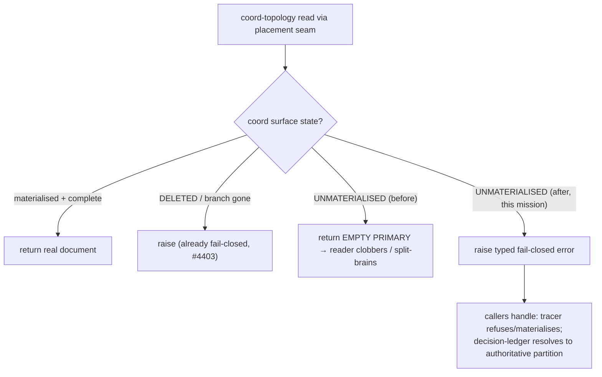

# Mission Specification: Coord Reads Fail Closed

**Mission Branch**: `fix/coord-read-fail-closed`
**Created**: 2026-09-24
**Status**: Draft
**Input**: Sibling P0 destructive-write bugs #4959 + #4966 under epic #5002 (coord husk / fail-closed). Grounded by a profile-loaded scope pass on current `main` (`d6533ea419`); all code refs verified live.

## Context

On a **coord-topology** mission, when the coordination worktree is **not materialised** (a fresh clone, a CI runner, a removed worktree, a pruned remote ref), the placement **read** seam (`src/mission_runtime/resolution.py`) returns an *empty PRIMARY* document — or, once the worktree exists, a *status-only husk* that lacks the mission's real files. Two commands then act on that empty/incomplete read **as if it were the authoritative document**, silently harming teammate-authored content at exit 0:

- **#4959 — tracer-append clobber.** `agent tracer-append` reads the coord `traces/<cat>.md`; on an unmaterialised surface (or an undecodable byte) the read returns `""`, and the writer starts from a default header and **commits it over the branch's real file**, fast-forwarding origin — every earlier finding destroyed, exit 0 "committed".
- **#4966 — decision-ledger husk split-brain.** The materialised coord worktree is status-only (holds `status.events.jsonl`/`status.json` and *nothing else*). The decision-ledger reader resolves through that husk (no `meta.json`, no `decisions/`), so `decision open` returns `MISSION_NOT_FOUND`, a deferred decision never reaches the PRIMARY index, `verify` says clean, and `accept` stays blocked forever on the spec.md clarification marker (which it reads from the PRIMARY ledger) — with no CLI way out.

**Operator decision (`DM-01M38VWD3KKSSTZNCK9V00N3TJ`): the fix is seam-level.** The placement read seam **raises** a typed fail-closed error on an unresolved/unmaterialised coord read. (Correction from the Phase-0 audit: today the seam raises only on `CoordState.DELETED` — via `CoordinationBranchDeleted`, #4403 — while `EMPTY`/`UNMATERIALIZED`/`NONE` all fall through to empty-PRIMARY. This mission adds a *sibling* fail-closed error for the `UNMATERIALIZED` state — coord branch exists but its worktree is not materialised, the fresh-clone/CI case — instead of returning empty PRIMARY on a coord-topology mission.) Both surfaces — and any future reader through the seam — inherit fail-closed by construction. The load-bearing consequence: **every caller of the read seam must be audited to handle the raise** (refuse / materialise / resolve-to-authoritative), and non-coord callers must be unaffected.

## User Scenarios & Testing *(mandatory)*

### User Story 1 - tracer-append never clobbers a real traces file (Priority: P1)

An operator or CI job runs `spec-kitty agent tracer-append` on a coord-topology mission from a checkout where the coordination worktree is not materialised. The real `traces/<cat>.md` (full of teammates' findings) must survive.

**Why this priority**: Active silent destruction of authored content at exit 0 — the epic's headline harm (#4959).

**Independent Test**: from an unmaterialised-coord checkout, run tracer-append against a `traces/<cat>.md` that already holds prior findings; assert the command fails closed (refuses or materialises first) and the real file is byte-intact — never rewritten from a default header. Red-first: the same test shows the file clobbered against pre-fix code. Also: an undecodable byte in the file makes the read refuse, not treat it as empty.

**Acceptance Scenarios**:

1. **Given** a coord mission whose coord worktree is unmaterialised and whose `traces/decisions.md` holds prior findings, **When** `agent tracer-append` runs, **Then** the command fails closed and the file is unchanged (0 findings lost).
2. **Given** the same file containing a non-UTF-8 byte, **When** tracer-append reads it, **Then** it refuses rather than starting from an empty default.
3. **Given** a materialised, complete coord surface, **When** tracer-append runs, **Then** it appends normally (no regression).

---

### User Story 2 - Decision ledger and accept agree; no husk dead-end (Priority: P1)

On a coord mission whose coord worktree is materialised (status-only husk), decision commands and `accept` must resolve the ledger to the authoritative partition rather than the husk.

**Why this priority**: A mission can be permanently un-acceptable with no CLI recovery (#4966) — a hard dead-end for real work.

**Independent Test**: on a coord mission with a materialised husk, `decision open` succeeds (no `MISSION_NOT_FOUND`), a deferred decision reaches the primary index, `verify` reflects it, and `accept` proceeds once the marker is resolved. Red-first shows `MISSION_NOT_FOUND` / permanent accept block pre-fix.

**Acceptance Scenarios**:

1. **Given** a coord mission with a materialised status-only husk, **When** `agent decision open` runs, **Then** it resolves the mission (no `MISSION_NOT_FOUND`) against the authoritative partition.
2. **Given** a deferred decision on that mission, **When** it is resolved and `accept` runs, **Then** `accept` sees the same ledger state the operator sees (no split-brain) and is not permanently blocked.

---

### User Story 3 - The read seam fails closed for every reader (Priority: P1)

The placement read seam raises a typed error on an unresolved/unmaterialised coord read, so no current or future reader can silently receive an empty/husk document and act on it.

**Why this priority**: This is the contract that closes the *class* (per the operator decision) rather than the two instances.

**Independent Test**: a coord read that cannot resolve the real surface raises the typed fail-closed error; a blast-radius audit confirms every seam caller handles it and no non-coord caller newly raises.

**Acceptance Scenarios**:

1. **Given** a coord-topology read whose surface is unresolved/unmaterialised, **When** the placement read seam resolves it, **Then** it raises the typed fail-closed error (never returns empty PRIMARY).
2. **Given** a SINGLE_BRANCH / LANES / flat (non-coord) mission, **When** any seam read runs, **Then** behavior is unchanged (no new raise).
3. **Given** the `DELETED` / branch-gone state, **When** the seam resolves it, **Then** it still raises `CoordinationBranchDeleted` (no #4403 regression).

### Edge Cases

- A non-UTF-8 byte in the real `traces/<cat>.md` → refuse, never treat as empty (#4959 trigger c).
- Coord worktree materialised but **status-only husk** (no `meta.json`/`decisions/`) → resolve to the authoritative partition, do not treat the husk as complete (#4966).
- Non-coord topologies (SINGLE_BRANCH/LANES/flat route everything to primary) → no coord surface, must **not** newly raise.
- `DELETED` / coordination branch gone from git → keeps raising `CoordinationBranchDeleted` (#4403 preserved). The new `UNMATERIALIZED` sibling is distinct: branch exists, worktree not materialised.
- A seam caller that today relies on the empty-PRIMARY return for a legitimate reason → must be found by the audit and adapted, not left to swallow the raise.

## Requirements *(mandatory)*

### Functional Requirements

| ID | Title | User Story | Priority | Status |
|----|-------|------------|----------|--------|
| FR-001 | Seam raises on unresolved coord read | As a maintainer, I want the placement read seam to raise a typed fail-closed error on an `UNMATERIALIZED` coord-topology read (a new sibling of the existing `DELETED`/`CoordinationBranchDeleted` error, #4403), so no reader silently receives empty PRIMARY. | High | Open |
| FR-002 | Tracer-append fails closed | As an operator, I want `agent tracer-append` to fail closed (refuse or materialise) when the coord surface is unresolved/unmaterialised, and to refuse on an undecodable byte, so it never rewrites the real `traces/<cat>.md` from a default. | High | Open |
| FR-003 | Decision ledger resolves to authoritative | As an operator, I want the decision-ledger reader to resolve `meta.json` + the ledger to the authoritative partition so decision commands and `accept` agree — no `MISSION_NOT_FOUND` husk, deferred decisions reach the primary index, and a blocked mission has a CLI path forward. | High | Open |
| FR-004 | Seam-caller blast-radius audit | As a maintainer, I want every caller of the placement read seam audited and adapted to handle the fail-closed raise (refuse/materialise/resolve), with non-coord callers unaffected and no caller silently swallowing it. | High | Open |
| FR-005 | Correct the husk docstring | As a maintainer, I want the `decisions/service.py` docstring corrected (the materialised coord worktree is status-only and does **not** carry `meta.json`), so the code's stated contract matches reality. | Medium | Open |
| FR-006 | Close #4959 and #4966 | As a maintainer, I want this mission to close #4959 and #4966 (siblings under epic #5002; the epic stays open for #4979). | Medium | Open |

### Non-Functional Requirements

| ID | Title | Requirement | Category | Priority | Status |
|----|-------|-------------|----------|----------|--------|
| NFR-001 | Zero destructive rewrites | Across the regression corpus, an unresolved/unmaterialised coord read results in a real authored file being overwritten by a default in exactly 0 cases (every such read either raises or resolves to the real file). | Reliability | High | Open |
| NFR-002 | No path regression | Materialised-coord, SINGLE_BRANCH, LANES, and flat missions continue to read/write/accept as before: 0 regressions in the existing coord / tracer / decision / accept suites. | Reliability | High | Open |
| NFR-003 | No permanent dead-end | A mission previously blocked by the husk split-brain has a working CLI path to acceptance once its clarification marker is resolved: 100% of the #4966 repro's `accept` attempts succeed post-fix. | Reliability | High | Open |

### Constraints

| ID | Title | Constraint | Category | Priority | Status |
|----|-------|------------|----------|----------|--------|
| C-001 | Seam-level contract | Per operator decision `DM-01M38VWD3KKSSTZNCK9V00N3TJ`, the fail-closed contract lives at the placement read seam (`resolution.py` raises); it must not be solved reader-by-reader only. | Technical | High | Open |
| C-002 | Do not touch #4979's seam | Do not modify `coordination/surface_resolver.py::_coord_branch_exists` or `doctor coordination --fix`'s flatten path — that is a separate mission and sits adjacent to the just-merged #4950. | Technical | High | Open |
| C-003 | Fail-closed toward retention | Refuse/raise rather than write a default or act on a husk; never destroy or hide authored content. | Technical | High | Open |
| C-004 | No dependency changes | No new runtime/dev dependencies. | Technical | Medium | Open |
| C-005 | DELETED + non-coord unaffected | The `DELETED` state keeps raising `CoordinationBranchDeleted` (#4403) unchanged; PRIMARY-partition reads (which short-circuit before any probe) and non-coord topologies must not newly raise. | Technical | High | Open |
| C-006 | Terminology canon | Canonical **Mission** vocabulary; no `feature*` aliases in new identifiers or prose. | Business | Medium | Open |

### Key Entities

- **Placement read seam**: `src/mission_runtime/resolution.py` — resolves a coord-state to a `TopologySurface` and reads a document/dir; the single choke point this mission makes fail-closed.
- **Coord surface states** (`CoordState`): MATERIALIZED-complete, MATERIALIZED-husk (status-only), EMPTY, UNMATERIALIZED (branch exists, worktree absent — the target), DELETED (branch gone — already raises), NONE (no coord topology) — the read behavior differs per state.
- **Authoritative partition**: where a mission's real `meta.json` / `decisions/` / `traces/` live (PRIMARY for planning artifacts) — what a fail-closed reader must resolve to, versus the status-only coord husk.

## Success Criteria *(mandatory)*

### Measurable Outcomes

- **SC-001**: Red-first — tracer-append from an unmaterialised-coord checkout overwrites a populated `traces/<cat>.md` pre-fix; post-fix the file is byte-intact and the command fails closed (0 findings lost).
- **SC-002**: Red-first — `decision open` on a materialised-husk coord mission returns `MISSION_NOT_FOUND` and `accept` is permanently blocked pre-fix; post-fix `decision open` resolves and `accept` proceeds.
- **SC-003**: The placement read seam raises the typed fail-closed error on an unresolved/unmaterialised coord read; a documented blast-radius audit shows every seam caller handles it and no non-coord caller newly raises.
- **SC-004**: 0 regressions in the materialised-coord / non-coord / tracer / decision / accept suites (NFR-002).
- **SC-005**: #4959 and #4966 are closed by this mission's PR; epic #5002 remains open for #4979.
