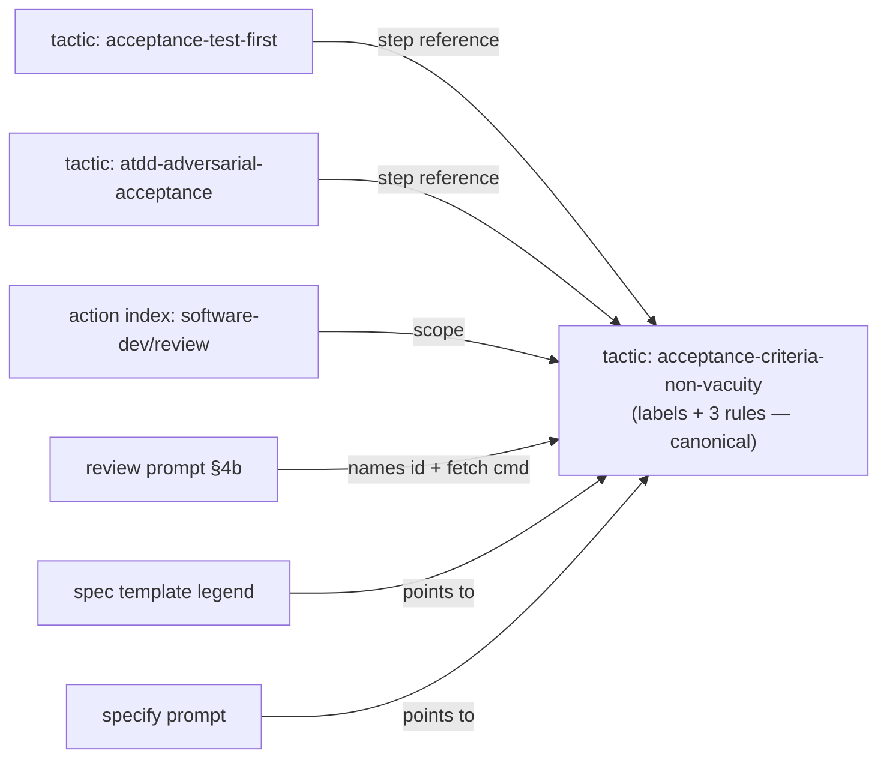

# Implementation Plan: Criterion delivery labels and positive-control review doctrine (#5061)

**Branch**: `claude/research-squad-remediation-mission-fvdk93` | **Date**: 2026-09-26 | **Spec**: [spec.md](spec.md)
**Input**: Mission specification from `kitty-specs/criterion-labels-positive-controls-01M3EWRT/spec.md`

Branch contract: current = planning base = merge target = `claude/research-squad-remediation-mission-fvdk93`
(`branch_matches_target: true`). Topology `coord` (coordination branch
`kitty/mission-criterion-labels-positive-controls-01M3EWRT`).

## Summary

Add one new built-in testing tactic, `acceptance-criteria-non-vacuity`, as the single canonical definition of the
delivery labels (`[build]` / `[ratchet]` / `[folded]`), the *no-op passable* mark, and the three review rules
(same-fixture positive control, half-by-half proof, production-path non-vacuity). Scope it to the software-dev
review action, point the two sibling ATDD tactics at it, and name it in the review prompt. Extend the software-dev
spec template with two trailing FR-table columns plus a legend and a success-criterion suffix, teach the specify
prompt to fill them, and pin both invariants (labelled rows stay declared; the scaffold stays non-substantive)
with tests that carry their own positive controls. Finally refresh this repository's `.kittify/overrides` copies.

## Technical Context

**Language/Version**: Python 3.11+ (tests); YAML doctrine artifacts; Markdown templates/prompts
**Primary Dependencies**: pytest, ruamel.yaml; in-repo `charter.offering` (DRG loader/query, schema validation), `specify_cli.requirement_mapping`, `specify_cli.missions._substantive`, `specify_cli` command-template renderer
**Storage**: Files only (`packs/built-in/**`, `.kittify/overrides/**`)
**Testing**: pytest — `tests/doctrine/`, `tests/charter/`, `tests/specify_cli/test_requirement_mapping.py`, `tests/specify_cli/missions/test_substantive_gate_formats.py`, specify snapshot baselines under `tests/specify_cli/`, `tests/architectural/test_no_legacy_terminology.py`, doctrine regen freshness tests
**Target Platform**: Spec Kitty CLI (Linux/macOS/Windows), consumers via the PyPI wheel (`packs/built-in` tier)
**Project Type**: single
**Performance Goals**: N/A (doctrine/template change; no runtime hot path touched)
**Constraints**: C-001..C-006 from the spec — built-in tier, guidance-only labels, trailing-column label placement, no parser-pattern widening, edit sources + declared overrides only, single definition
**Scale/Scope**: 1 new tactic, 2 tactic cross-refs, 1 action index, 1 spec template, 2 prompts, 21 drifted override files resynced + 1 deleted, ~4 test modules

## Charter Check

- **Single canonical authority** — labels + rules defined only in the new tactic; template legend, specify prompt
  and review prompt *reference* it (C-006). PASS.
- **Architectural alignment / pack tier** — consumer-governing doctrine → `packs/built-in` (C-001). Graph and
  manifest regenerated with `spec-kitty doctrine regenerate-graph`. PASS.
- **ATDD / red-first** — acceptance tests written first per WP; each "absence" test carries a positive control on
  the same fixture (the mission dogfoods its own rule). PASS.
- **Canonical sources** — edit `packs/built-in/**` sources; the full `.kittify/overrides` resync is an explicit
  operator decision (DM-01M3EWS93W9MRFDJV1QG1Y5WZK, DM-01M3EX8WE96MHDTQTEE5M8WT85), done by copying from the canonical
  source, not by editing agent copies. PASS.
- **User customization preservation** — overrides are project-owned; the operator (owner) authorised the resync.
  Override-only content is inventoried before overwrite. PASS.
- **Terminology canon** — "Mission", never "feature", in all new prose; terminology guard run (NFR-003). PASS.
- **Operator decision vs squad advice** — squad preferred extending `acceptance-test-first`; operator chose a new
  tactic (DM-01M3EWS6CVECE8C6JZ0QP6FH0S). Mitigation for the "second authority" risk: the new tactic is the only
  place the rules live; the siblings only reference it (FR-008). Recorded, no violation.

## Design



### Label shape (from the pre-spec squad's live parser probes)

- FR table: `| ID | Title | User Story | Priority | Status | Delivery | No-op passable? |`, values `[build]`,
  `[ratchet]`, `[folded]` and `yes`/`no` (a `yes` names its positive control, e.g. `yes — paired with …`).
- Success criteria bullets: trailing suffix `— [build] · no-op passable: no`.
- Never inside or before the id cell; no inline labels on FR bullets/headings (C-004). The id-parser regexes stay
  unchanged. `_substantive.py` reads only Title + User Story (`take_columns=2`), so trailing columns cannot make an
  unfilled scaffold look substantive — FR-004's test pins this as a ratchet with a positive control.

### Tactic content (schema: `src/charter/offering/schemas/tactic.schema.yaml`, `additionalProperties: false`)

`purpose`; `steps` — (1) label every criterion, (2) answer "no-op passable?", (3) pair refusal/absence
assertions with a same-fixture positive control, (4) prove compound fixes half by half, (5) exercise the
production path, not only a helper; `failure_modes` — blind probe, half-fix passes, helper-only test, label in the
id cell; `notes` — the label legend (single definition); `references` — `architectural-gate-non-vacuity`,
`mutation-testing-workflow`, `delete-the-assertion-not-the-test`, `acceptance-test-first`.

### Review prompt

New `### 4b. Criterion Non-Vacuity Check` after §4a, naming `acceptance-criteria-non-vacuity` and
`spec-kitty charter context --include tactic:acceptance-criteria-non-vacuity`, with three PASS/FAIL/N/A items.

## Project Structure

### Documentation (this mission)

```
kitty-specs/criterion-labels-positive-controls-01M3EWRT/
├── spec.md, plan.md, research.md, quickstart.md
├── research/pre-spec-squad.md
├── checklists/requirements.md
└── tasks.md + tasks/WP0*.md   (/spec-kitty.tasks)
```

### Source Code (repository root)

```
packs/built-in/
├── tactics/testing/acceptance-criteria-non-vacuity.tactic.yaml   # NEW (WP01)
├── tactics/testing/acceptance-test-first.tactic.yaml             # step reference (WP01)
├── tactics/testing/atdd-adversarial-acceptance.tactic.yaml       # step reference (WP01)
├── missions/software-dev/actions/review/index.yaml               # + tactic (WP01)
├── missions/mission-steps/software-dev/review/prompt.md          # §4b (WP01)
├── missions/software-dev/templates/spec-template.md              # columns + legend + SC suffix (WP02)
├── missions/mission-steps/software-dev/specify/prompt.md         # label guidance (WP02)
├── *.graph.yaml, pack-manifest.yaml                              # regenerated (WP01)
.kittify/overrides/missions/software-dev/           # WP03: every file with a built-in counterpart
├── command-templates/<cmd>.md  <- mission-steps/software-dev/<cmd>/prompt.md
├── {actions,templates}/**, mission*.yaml, expected-artifacts.yaml, README.md <- missions/software-dev/<same path>
└── command-templates/{README,constitution,dashboard}.md   # no counterpart: untouched, listed in follow-up
tests/
├── doctrine/test_acceptance_criteria_non_vacuity_wiring.py       # NEW (WP01)
├── specify_cli/test_requirement_mapping.py                       # labelled-row tests (WP02)
├── specify_cli/missions/test_substantive_gate_formats.py         # live-template tests (WP02)
└── specify_cli/.../specify snapshot baselines                     # regenerated (WP02)
```

## Implementation Concern Map

| Concern | FRs | WP |
|---------|-----|----|
| Canonical tactic + DRG wiring + review prompt | FR-005, FR-006, FR-007, FR-008 | WP01 |
| Template columns/legend + specify guidance + parser/gate pins | FR-001, FR-002, FR-003, FR-004, FR-009 | WP02 |
| Full repository override resync | FR-010 | WP03 |

## Risks

| Risk | Mitigation |
|------|------------|
| Explicit review scope shifts the DRG calibrator's derived review edges (daphne) | Diff `action.graph.yaml` after regen; re-pin `tests/doctrine/drg/test_reachability.py` only if an intended move |
| Specify prompt edit drifts committed snapshot baselines | Regenerate with the documented `PYTEST_UPDATE_SNAPSHOTS=1` flow and review the diff |
| Render test reads the override instead of the pack (vacuous) | Test renders `packs/built-in/.../review/prompt.md` directly; override covered separately in WP03 |
| New tactic read as a second authority | Rules live only in the new tactic; siblings only reference it |
| Inert deprecated `expected-artifacts.yaml` override pinned by a test | Operator: delete it and drop its entry from `TestOverrideMirrorDeprecation` (DM-01M3EXVSGFRQ8YKVFCCBWVSVZD) |
| Override guidelines newer than built-in (terminology) | Port the newer lines into built-in guidelines before resync |
| Live `mission-runtime.yaml` override changes this repo's DAG | Intended; run runtime bridge / next tests after resync |
| Resync overwrites intentional local override content | Inventory override-only hunks per file before overwrite (WP03 notes); run tests that read overrides (`tests/runtime/test_project_resolver.py` et al.) |
| Resync changes this repo's own agent flows (prompts differ) | Expected by the operator decision; run `make test-fast` + runtime/resolver tests |
| Future drift / orphan overrides | Follow-up issue: drift guard + the 3 orphan command-template overrides |

## Parallel Work Analysis

### Dependency Graph

```
WP01 (tactic + wiring + review prompt) ─┐
                                         ├─> WP03 (override refresh)
WP02 (template + specify + pins) ────────┘
```

### Work Distribution

- **Parallel streams**: WP01 and WP02 own disjoint files (WP02's legend names the tactic id by string only).
- **Sequential**: WP03 resyncs overrides from the finished built-in tree (after WP01/WP02 land).

### Coordination Points

- WP03 review checks every counterpart override is byte-identical to its built-in source.
- Post-merge: full `tests/doctrine`, `tests/charter`, regen `--check`, terminology guard on the merged tip.
