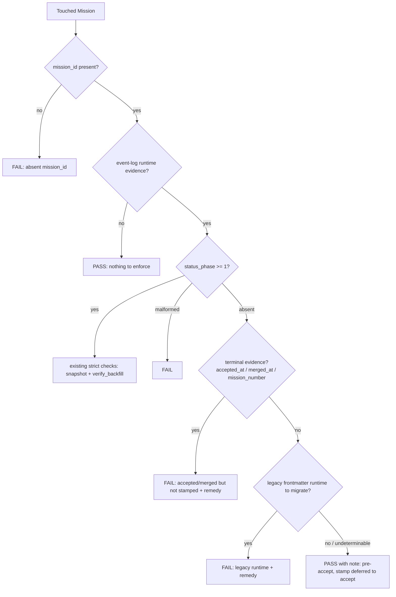

# Mission Specification: Cutover guard exempts pre-accept Missions

**Mission Branch**: `fix/cutover-guard-pre-accept-exemption`
**Created**: 2026-10-06
**Status**: Draft
**Input**: Issue #5835 (P0), folds #5300. Operator ruling: guard-side exemption; the `status_phase` stamp stays deferred to accept/consolidate.

## Intent Summary (confirmed)

A Mission driven only by canonical commands (create → plan → finalize → implement → move-task) goes red on the cutover-guard check from its first PR push. The event log carries runtime evidence from the first claim. The `status_phase` stamp is written only at accept or consolidate, by design (#2917). The guard, however, checks every touched Mission on every push. Operators work around it by running a legacy migration by hand.

After this mission, the shared cut-over predicate passes a Mission that is still in flight and has nothing legacy to migrate, and says so explicitly. It stays strict for everything else.

- **Primary actor:** an operator, or CI acting for them, pushing a PR that touches an in-flight Mission's `kitty-specs/<mission>/` directory.
- **Trigger:** `spec-kitty cutover-guard` runs over the touched Missions; the dogfood corpus test runs the same predicate over the whole corpus.
- **Outcome:** the in-flight Mission passes with a visible "pre-accept, stamp deferred to accept" note. No manual migration is needed.
- **Invariant:** once a Mission has terminal evidence, or carries legacy frontmatter runtime, the guard is exactly as strict as today.

The last arrow needs care. If the legacy-runtime check cannot be decided, for example because a WP file cannot be read, the verdict is **FAIL**, not PASS (FR-005).

## User Scenarios & Testing *(mandatory)*

### User Story 1 - An in-flight PR-bound Mission passes the guard (Priority: P1)

An operator opens a draft PR for a Mission that is mid-implementation: WP01 has been claimed, and nothing has been accepted. CI runs the cutover guard on the touched Mission and it passes. The report says the Mission is pre-accept and that the stamp is deferred to accept.

**Why this priority**: this is the P0. Today every PR-bound Mission is red from its first push.

**Independent Test**: build a Mission fixture with `meta.json` (mission_id, no `status_phase`, no terminal evidence), one claim event whose policy metadata carries runtime keys, and WP files with no runtime frontmatter. Run the guard's touched-Mission evaluation on it. It is red on the base and green after the change.

**Acceptance Scenarios**:

1. **Given** a pre-accept Mission with claim evidence and no legacy runtime, **When** the guard evaluates it, **Then** it is reported cut over with a note naming the pre-accept deferral.
2. **Given** the same Mission, **When** the dogfood corpus check evaluates the corpus, **Then** the Mission does not appear as a failure (#5300).

### User Story 2 - Strictness is preserved where it matters (Priority: P1)

A maintainer relies on the guard to catch an accepted or merged Mission that was never stamped, and a legacy Mission whose frontmatter runtime was never migrated.

**Why this priority**: an exemption that also lets those through would remove the guard's purpose.

**Independent Test**: on the same fixture shape, add terminal evidence, or legacy frontmatter runtime, or a malformed `status_phase`. Each variant still fails.

**Acceptance Scenarios**:

1. **Given** a Mission with `accepted_at` (or `merged_at`, or a non-null `mission_number`) and no `status_phase`, **When** evaluated, **Then** it fails, and the text names the missing stamp and the remedy.
2. **Given** a pre-accept Mission whose WP frontmatter still carries legacy runtime fields, **When** evaluated, **Then** it fails, and the text names the legacy runtime and the remedy.
3. **Given** a malformed `status_phase` value, **When** evaluated, **Then** it fails.
4. **Given** an accepted, stamped, verified Mission, **When** evaluated, **Then** it passes, unchanged from today.

### User Story 3 - The remaining failures explain themselves (Priority: P2)

When the guard still fails, the operator learns why this Mission is not exempt, and what to run.

**Independent Test**: the failure output for each still-failing case names the reason category and the remedy command.

### Edge Cases

- A Mission with no event-log runtime evidence keeps today's behaviour: it passes, with nothing to enforce.
- The legacy-runtime check cannot be decided (an unreadable or unparsable WP file): the Mission fails closed.
- A native Mission with checked `tasks.md` subtask rows and empty template claim fields passes (checkboxes are authoring, not legacy runtime).
- `meta.json` missing or unparsable: fail closed.
- `mission_number` is `0`: counts as terminal evidence.
- A coordination-topology Mission whose log is not on the PR head already passes via the no-evidence branch today; unchanged and out of scope (C-004).
- `status_phase` is present but `< 1` and well-formed (for example `"0"`): it is treated like an absent stamp for the exemption decision. Any terminal evidence still fails it.
- Missions that were stamped by hand keep their strict path, so their verdict does not change.
- An accepted Mission whose stamp was dropped later, for example by flattening (#3272), still fails. This mission does not hide #3272.

## Requirements *(mandatory)*

### Functional Requirements

| ID | Title | User Story | Priority | Status | Delivery | No-op passable? |
|----|-------|------------|----------|--------|----------|-----------------|
| FR-001 | Pre-accept exemption | As an operator, I want a Mission with event-log runtime evidence, no `status_phase` stamp, no terminal evidence and no legacy frontmatter runtime reported as cut over, so that my in-flight PR is not red. | High | Open | [build] | no — red on base for the same fixture |
| FR-002 | Exemption is visible | As a maintainer, I want an exempted verdict to carry an explicit reason note (pre-accept, stamp deferred to accept), so that the guard report stays honest about why it passed. | High | Open | [build] | no — asserts the note text is present |
| FR-003 | Terminal evidence stays strict | As a maintainer, I want a Mission with `meta.json` `accepted_at`, `merged_at` or a non-null `mission_number` and no stamp to keep failing, so that unstamped accepted/landed corpora are still caught. | High | Open | [ratchet] | yes — paired with the FR-001 fixture plus one terminal field, which must flip the verdict |
| FR-004 | Legacy frontmatter runtime stays strict | As a maintainer, I want a pre-accept Mission to keep failing when any WP's frontmatter carries a non-empty runtime value: claim-time runtime (`shell_pid`, `shell_pid_created_at`), a non-empty `assignee`, or a completed review override. `agent` and `tracker_refs` do NOT count: tasks-packages step 4a fills `agent` (with `agent_profile`, `role`, `model`) at planning time and authored WPs carry `tracker_refs`, so neither is evidence of an un-migrated claim (operator ruling of 2026-10-07). `tasks.md` subtask checkboxes are canonical authoring, not legacy runtime, and do not block the exemption. Empty template values (`shell_pid: ""`) count as absent. So unmigrated legacy Missions are not exempted, while native Missions with checked subtasks are. | High | Open | [ratchet] | yes — paired with the FR-001 fixture plus one non-empty frontmatter runtime value, which must flip the verdict; and a checked-subtask twin that must still pass |
| FR-005 | Fail closed when undecidable | As a maintainer, I want the exemption withheld when the legacy-runtime read raises (a WP or `tasks.md` that cannot be read or parsed), when `meta.json` is missing or unparsable, when `status_phase` is malformed, or when `mission_id` is absent, so that uncertainty never yields a pass. | High | Open | [build] | no — the undecidable fixture must fail where the decidable twin passes |
| FR-006 | One predicate, both consumers | As a maintainer, I want the exemption to live in the single shared cut-over predicate, so that the CI cutover-guard and the dogfood corpus check (#5300) agree. | High | Open | [build] | no — both consumers evaluated on the FR-001 fixture |
| FR-007 | Actionable failure text | As an operator, I want each remaining failure to say which condition blocked the exemption (terminal evidence without stamp / legacy runtime / malformed phase) and name the remedy command, so that I know what to do. | Medium | Open | [build] | no — asserts reason-specific text |
| FR-008 | Guard documentation | As a contributor, I want the cutover-guard documentation and the changelog to state the pre-accept exemption and its limits, so that the behaviour is discoverable. | Medium | Open | [build] | no — doc diff reviewed |

### Non-Functional Requirements

| ID | Title | Requirement | Category | Priority | Status |
|----|-------|-------------|----------|----------|--------|
| NFR-001 | No verdict drift outside the exemption | Across a synthetic test matrix covering every branch of the verdict, only the FR-001 shape changes verdict (FAIL → PASS); every other cell is unchanged. On the repository corpus, the verdict count is unchanged (baseline at spec time: 576 PASS, 5 FAIL for absent `mission_id`). | Reliability | High | Open |
| NFR-002 | Guard cost | The exemption adds at most one additional read of each touched Mission's `meta.json` and WP files per evaluation, with no git calls and no network. | Performance | Medium | Open |
| NFR-003 | Code health | Every touched function stays at cyclomatic complexity ≤ 15; ruff and mypy report 0 new issues. | Maintainability | High | Open |

### Constraints

| ID | Title | Constraint | Category | Priority | Status |
|----|-------|------------|----------|----------|--------|
| C-001 | No birth stamp | `status_phase` is not written at create, plan, finalize, implement or any status transition. The stamp stays deferred to accept/consolidate (#2917, FR-004 of `runtime-state-birth-cutover-all-paths-01KYH654`). | Technical | High | Open |
| C-002 | No new status_phase writer | The migration cutover remains the single writer of `status_phase`. | Technical | High | Open |
| C-003 | Reuse canonical evidence | Terminal evidence is any non-empty `accepted_at` or `merged_at`, any non-empty `accept_commit`, `merged_commit` or `acceptance_history`, or any non-null `mission_number` (including `0`), in `meta.json`. This is a SUPERSET of the fields `migrate backfill-wp-status` uses (`accepted_at`, `merged_at` through `resolve_terminal_evidence`): the guard adds `mission_number` and the commit and history markers. The guard reads `meta.json` as written; the migration path's `_canonicalize_meta` can also derive a `mission_number` from an `NNN-` slug prefix, which the guard does not see (it fails closed on every recorded value, so the difference is a missed exemption at worst, never a false pass). A present `accepted_at`/`merged_at` that is not a non-empty string, and a repeated top-level key in `meta.json`, decline the exemption. Legacy frontmatter runtime is read by the existing legacy reader and decided by a predicate on its existing per-WP record (alongside its claim-state predicate). No parallel reader or second definition is introduced. Accept-time artefacts outside `meta.json` (acceptance matrix, VCS lock) are not used: `accept` writes `accepted_at` in the same run, so they add no coverage. | Technical | High | Open |
| C-004 | Out of scope | #3272 (flatten drops seed events), the #2849 umbrella, and separating the frontmatter lane-mirror switch from `status_phase` are not addressed. Nor is the pre-existing behaviour that a coordination-topology Mission whose event log lives on its coordination branch shows no event-log evidence on a PR head and already passes via the no-evidence branch; this mission does not change which status surface the guard reads, and that gap is filed as a separate follow-up. | Business | Medium | Open |
| C-005 | Red-first | Each defect is pinned by a regression test that is red on the base through the pre-existing entry point before the fix lands (ADR `2026-07-17-1`). | Technical | High | Open |

### Key Entities

- **Mission metadata (`meta.json`)**: identity, the optional `status_phase` stamp, and terminal evidence (`accepted_at`, `merged_at`, `mission_number`).
- **Event-log runtime evidence**: lane events whose policy metadata carries runtime keys (for example the claiming agent).
- **Legacy frontmatter runtime**: runtime fields in WP files that a backfill would have to migrate into the event log.
- **Cut-over verdict**: pass/fail plus reason notes, consumed by the CI guard and the dogfood corpus check.

## Success Criteria *(mandatory)*

### Measurable Outcomes

- **SC-001**: A Mission driven only through canonical commands up to its first claim passes the cutover guard with 0 manual migration steps. — [build] · no-op passable: no
- **SC-002**: 100% of the strict cases (terminal evidence without stamp, legacy runtime, malformed phase, absent mission_id, undecidable legacy check) still fail. — [ratchet] · no-op passable: yes — paired with SC-001 on the same fixture family
- **SC-003**: The CI guard and the dogfood corpus check return the same verdict for every fixture in the test set. — [build] · no-op passable: no
- **SC-004**: Every remaining failure message names its blocking condition and a remedy command. — [build] · no-op passable: no

## Assumptions

- Canonical WP files carry only empty claim fields from the template, and `move-task` no longer writes runtime into WP frontmatter (it is event-only since the IC-04 flip), so a natively-born Mission meets the "no legacy frontmatter runtime" condition by construction. The red-first fixture uses the real template frontmatter to pin this.
- **Accepted residual (operator-confirmed):** a Mission merged to `main` mid-flight without accept, and carrying no legacy runtime, is no longer caught by this guard. Accept and consolidate remain the stamping points.

## Issue Traceability

| Issue | Role |
|-------|------|
| #5835 | Primary (P0): CI cutover-guard red on every PR-bound Mission |
| #5300 | Folded: dogfood corpus test red on every in-flight branch (same predicate) |
