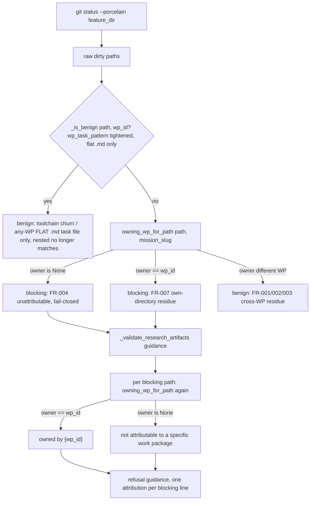

# Implementation Plan: Dirty-Tree Guard Is WP-Scoped

**Branch**: `issue-5007-dirty-tree-guard-wp-scoped` (current branch; Target Ref, `planning_base_branch`, and `merge_target_branch` are all `issue-5007-dirty-tree-guard-wp-scoped`; public PR target is `main`) | **Date**: 2026-09-28 | **Spec**: [spec.md](spec.md)
**Input**: Mission specification from `kitty-specs/dirty-tree-guard-wp-scoped-01M3M3TT/spec.md`

## Summary

`classify_dirty_paths` accepts `wp_id` but its helper `_is_benign` never reads it, so every
non-benign dirty path blocks `move-task` for *every* WP regardless of who actually produced it,
and `_validate_research_artifacts` then unconditionally narrates the blocking set as `"owned by
{wp_id}"` — the WP being moved — even when it never touched the path. This plan adds a new
per-path ownership-lookup helper, `owning_wp_for_path`, to `src/specify_cli/review/dirty_classifier.py`
that generalizes the existing `wp_task_pattern` directory-naming convention (already partially
implemented in `_is_review_handoff_survivor_path`) to match any file under a WP's task directory —
any extension, any nesting depth, and the bare-directory form git reports for a wholly-untracked
WP subdirectory. `classify_dirty_paths` consults this helper only for paths that are not already
benign under the existing toolchain-churn / review-handoff-survivor checks (the latter's
`wp_task_pattern` is tightened by this mission, not left unmodified — see Design Decision (a)'s
PLAN-ARCH-001 companion fix, which closes an over-match the adversarial plan review found in the
pre-existing pattern), and routes a path to `benign` only when it is provably owned by a *different*
WP than the one being moved — preserving the existing `(blocking, benign)` 2-tuple return shape
exactly. `tasks_parsing_validation.py` then calls the same helper per blocking path to build an
honestly-attributed refusal line ("owned by {wp_id}" only when true; "not attributable to a specific
work package" otherwise) instead of a single hardcoded header. The CLI layer never reimplements the
ownership regex — it only calls the service's public helper, mirroring how it already consumes
`classify_dirty_paths`.

## Charter Check

**Pass.** No drift found between `.kittify/charter/charter.md` and `AGENTS.md`/`CLAUDE.md` for this
mission's scope; both defer to the charter and the charter's content matches what `AGENTS.md`/
`CLAUDE.md` summarize (no contradiction to flag).

- **ATDD-first (C-011)**: each of IC-01 and IC-02 below starts with a failing-first test committed
  separately before any implementation commit (see Validation Strategy).
- **Single canonical authority / architectural alignment**: the new ownership-attribution logic has
  exactly one home (`dirty_classifier.py`); the CLI layer consumes it, never reimplements it
  (see Design Decision (f) below).
- **Campsite cleaning (Standing Order #2)**: `dirty_classifier.py` already carries the
  IC-07g/WP17 "justified-survivor" discipline (function-local literals, exemption-registry
  awareness) and is not an over-long or debt-bearing surface; `_validate_research_artifacts` is
  ~80 lines with a linear guidance-building shape. Neither needs a preceding tidy-first commit — the
  new logic is additive (a new function, and a small extraction in the CLI layer to hold the
  complexity ceiling — see Complexity Tracking). No campsite-clean commit is planned; a grab-bag
  would violate Locality of Change for no gain.
- **Smallest-viable-diff / locality (spec C-003)**: blast radius stays at 2 source files + 3 test
  files (see Project Structure) — 2 substantive edits (`dirty_classifier.py`,
  `tasks_parsing_validation.py`), exactly spec C-003's named surfaces. No file outside that set is
  touched.
- **No full heavy-suite runs in mission work**: Validation Strategy names only targeted files, the
  owning modules' fast tiers, and the specific architectural gate the diff implicates (mccabe
  complexity via `ruff check`), never a bare `tests/architectural/` sweep or `make test-full`.
- **Pre-existing Failure Reporting Rule**: N/A — the baseline (below) is fully green; there is
  nothing pre-existing to report.

## Project Structure

### Documentation (this mission)

    kitty-specs/dirty-tree-guard-wp-scoped-01M3M3TT/
    ├── plan.md              # this file
    ├── spec.md              # frozen behavior and acceptance contract
    ├── tracer-approach.md          # appended this phase
    ├── tracer-design-decisions.md  # appended this phase
    └── tracer-tooling-friction.md  # appended this phase

No `research.md`, `data-model.md`, `contracts/`, or `quickstart.md` artifact is created: the spec's
Key Entities section already fixes the data shape (`classify_dirty_paths`'s 2-tuple), there is no
external contract or event-schema change, and a quickstart would duplicate the acceptance scenarios
already in spec.md.

### Source Code (repository root)

    src/specify_cli/review/
    └── dirty_classifier.py             # owning_wp_for_path (new), classify_dirty_paths (edited),
                                         # _is_review_handoff_survivor_path's wp_task_pattern (edited
                                         # — tightened; see Design Decision (a), PLAN-ARCH-001 fix)
    src/specify_cli/cli/commands/agent/
    └── tasks_parsing_validation.py     # _validate_research_artifacts (edited: per-path attribution)
    tests/review/
    └── test_dirty_classifier.py        # new ownership-mechanism + no-new-blocking regression tests
    tests/specify_cli/cli/commands/agent/
    ├── test_tasks_parsing_validation.py  # message-wording tests (edited) + FR-009 truncation coverage (new)
    └── test_tasks.py                     # ATDD: 3 concretely-reported occurrences via public move-task route (new)

**Correction (review finding PLAN-GOV-003):** an earlier draft of this section claimed
`classify_dirty_paths` is "not re-exported from the package `__init__`." That is factually wrong —
`src/specify_cli/review/__init__.py` already imports `classify_dirty_paths` from `dirty_classifier`
and lists it in `__all__` today. That is the full extent of the correction: it is a factual note
about `classify_dirty_paths`'s existing (pre-mission) re-export status, nothing more.
`owning_wp_for_path` is **not** added to `__init__.py`. Per Design Decision (f), the CLI layer
consumes `owning_wp_for_path` via a direct import from `specify_cli.review.dirty_classifier` —
mirroring how `tasks_parsing_validation.py:289` already imports `classify_dirty_paths` directly
from the submodule today, never through the package root. `src/specify_cli/review/__init__.py` is
not on spec.md's C-003 named-surfaces list and is not touched by this mission.

Read-only reference, not edited by this mission: `tests/specify_cli/acceptance/test_accept_dirty_kitty_ops.py`
(run, not edited — its `_is_benign` counter-contracts must stay green unmodified; `_is_benign`'s own
signature and logic are not changed by this mission, though one of the helpers it calls internally,
`_is_review_handoff_survivor_path`, has its `wp_task_pattern` regex literal tightened — see Design
Decision (a) — which does not affect this test file's fixture, `_REAL_DIRT =
"src/specify_cli/acceptance/__init__.py"`, a path with no `kitty-specs/` segment at all).

**Structure Decision**: Single Python project, existing layout. The service module
(`src/specify_cli/review/`) owns the new ownership logic; the CLI module
(`src/specify_cli/cli/commands/agent/`) only consumes it to build the refusal message.

## Design Approach and Decisions

### (a) Per-path ownership attribution mechanism

**Decision**: add one new *public* (no leading underscore — it is consumed cross-module by design,
matching the existing `classify_dirty_paths` precedent) sibling helper in `dirty_classifier.py`:

```python
def owning_wp_for_path(path: str, mission_slug: str) -> str | None:
    """Return the WP id that owns *path* by directory/file-naming convention, or None.

    Generalizes the flat `.md`-only convention `_is_review_handoff_survivor_path`'s
    `wp_task_pattern` implements (see the companion fix to that pattern below) to also cover:
    - any file nested under a WP's task directory, any extension (FR-002)
    - the WP task directory reported as a bare, wholly-untracked path (FR-003)

    Scoped to `mission_slug` (FR-008): a same-numbered WP under a different
    mission's `kitty-specs/<other-slug>/tasks/` tree never matches.
    """
    normalised = to_posix(path).strip()
    pattern = re.compile(
        rf"^kitty-specs/{re.escape(mission_slug)}/tasks/WP(\d+)-[^/]+(?:\.md|/.*)$"
    )
    match = pattern.match(normalised)
    return f"WP{match.group(1)}" if match else None
```

The single combined regex covers all three FR-001/002/003 shapes in one pattern (`.md` alternative
for the existing flat-file case; `/.*` alternative for anything nested under the WP directory,
including the empty-remainder bare-directory form `kitty-specs/<slug>/tasks/WP01-foo/` git reports
for a wholly-untracked subdirectory — verified in `tracer-approach.md` against a sandbox repo).
`mission_slug` is interpolated via `re.escape` rather than a `[^/]+` wildcard so FR-008's
mission-scoping holds regardless of caller (not only because `_validate_research_artifacts`
happens to scope its `git status` call to the mission's own `feature_dir`).

**Companion fix required by adversarial review (PLAN-ARCH-001, HIGH severity) — tightening the
pre-existing `wp_task_pattern`.** The review confirmed, by executing the regex directly, that
`_is_review_handoff_survivor_path`'s CURRENT, unmodified pattern —
`re.compile(r"kitty-specs/[^/]+/tasks/WP\d+-.+\.md$")` at `dirty_classifier.py:81` — already
matches ANY nested `.md` file under ANY WP directory in ANY mission, because `.+` is not
`/`-anchored and Python's `.` matches `/` by default. Concretely, this means:

- `kitty-specs/<slug>/tasks/WP01-foo/scratch.md` — spec.md's own literal AC3 path (User Story 1,
  Acceptance Scenario 3), where the moving WP is WP01 — already matches `wp_task_pattern` and
  makes `_is_benign` return `True` for it *before* `owning_wp_for_path` is ever consulted, since
  `classify_dirty_paths`'s loop checks `_is_benign` first and short-circuits on a match. That
  directly contradicts AC3 ("the transition still blocks on that path") and FR-007.
- `kitty-specs/<other-slug>/tasks/WP01-foo/x.md` — FR-008's named cross-mission edge case — is
  matched the same way, independent of `owning_wp_for_path`'s own correct `mission_slug` scoping,
  because `_is_benign` claims it first.

**Remediation chosen: tighten `wp_task_pattern` itself (remediation path (a) of the two the
review named)**, not reordering `classify_dirty_paths`'s branches (path (b)). Rationale: path (a)
is the smaller, more local change — one regex literal — and it restores the pattern to the
"flat `.md`-only" behavior `owning_wp_for_path`'s own docstring already (and, pre-fix, incorrectly)
assumed it had, so no other design surface needs to change shape. Path (b) would additionally
require re-deriving `owning_wp_for_path`'s directory-shape detection independently inside
`classify_dirty_paths`'s loop ordering, which duplicates logic path (a) avoids entirely:

```python
# dirty_classifier.py:81 — before (over-matches nested/cross-mission `.md` paths):
wp_task_pattern = re.compile(r"kitty-specs/[^/]+/tasks/WP\d+-.+\.md$")
# after (tightened — `[^/]+` cannot cross a `/`, so only a FLAT `tasks/WPxx-*.md` file matches;
# any path with additional path segments before `.md` no longer matches):
wp_task_pattern = re.compile(r"kitty-specs/[^/]+/tasks/WP\d+-[^/]+\.md$")
```

This one-character-class change (`.+` → `[^/]+`) is sufficient to close BOTH gaps above, without
also needing to anchor the mission-slug segment (`[^/]+`) to the caller's actual `mission_slug`:
once nested paths can no longer match at all, `kitty-specs/<slug>/tasks/WP01-foo/scratch.md`
(AC3) and `kitty-specs/<other-slug>/tasks/WP01-foo/x.md` (FR-008) both stop matching
`wp_task_pattern` regardless of which mission's slug appears, fall through to
`owning_wp_for_path` unchanged, and resolve correctly there (`owner == wp_id` → blocking for
AC3; `owner is None`, since `owning_wp_for_path`'s pattern is anchored to the *current*
`mission_slug` and the path's slug segment is a different one → blocking for FR-008). The
pre-existing, orthogonal, cross-mission-*flat*-`.md`-file-is-benign behavior (unrelated to this
mission, exercised by two of the three pinned tests in Design Decision (c) below — the cross-WP
pair) is unaffected, because flat files still match the tightened pattern identically. This is a one-line edit to
`dirty_classifier.py` — still the file C-003 already names, so the blast radius (Project
Structure) is unaffected; it is now listed as an edited surface of that file above.

`classify_dirty_paths` is edited to consult `owning_wp_for_path` only when a path is not already
benign under the existing checks (`is_toolchain_generated_churn` unmodified;
`_is_review_handoff_survivor_path`'s `wp_task_pattern` tightened per the fix immediately above —
`_is_review_handoff_survivor_path`'s own control flow and its other two checks, `lanes.json` and
`.kittify/`, are unmodified):

```python
def classify_dirty_paths(dirty_paths, wp_id, mission_slug, wp_slug=None):
    blocking, benign = [], []
    for path in dirty_paths:
        if not path:
            continue
        if _is_benign(path, wp_id):          # toolchain churn + tightened flat-.md survivor check
            benign.append(path)
            continue
        owner = owning_wp_for_path(path, mission_slug)
        if owner is not None and owner != wp_id:
            benign.append(path)              # FR-001/002/003 — provably another WP's residue
        else:
            blocking.append(path)            # owner == wp_id (FR-007) or owner is None (FR-004)
    return blocking, benign
```

The existing `(blocking, benign)` 2-tuple return shape is unchanged; all three call sites named in
spec's Key Entities section (`tasks_parsing_validation.py`, the module docstring example,
`tests/specify_cli/acceptance/test_accept_dirty_kitty_ops.py`) keep unpacking it identically.
`_is_benign`'s own signature and body are **not modified** — it is called directly, outside
`classify_dirty_paths`, by `test_accept_dirty_kitty_ops.py`'s kitty-ops-orphan counter-contracts
(`_is_benign(_REAL_DIRT, wp_id)` must keep returning `False`); `_REAL_DIRT` is
`"src/specify_cli/acceptance/__init__.py"`, which has no `kitty-specs/` segment and so is
unaffected by the `wp_task_pattern` tightening either. Leaving `_is_benign` itself untouched (only
one literal inside a helper it calls is tightened) and adding the ownership fallback as a second
step inside `classify_dirty_paths` keeps that counter-contract test green without modification.

**FR-to-mechanism mapping**:
- FR-001 (cross-WP directory paths benign) / FR-002 (extension-independent) → the `/.*` regex
  alternative + the `owner != wp_id` branch.
- FR-003 (wholly-untracked WP directory, bare path) → the same alternative matches the trailing-slash,
  empty-remainder form.
- FR-004 (unattributable paths still block) → `owner is None` falls into the `else` (blocking) branch.
- FR-007 (own-directory residue still blocks) → `owner == wp_id` falls into the same `else` branch,
  AND (per the PLAN-ARCH-001 companion fix above) the tightened `wp_task_pattern` no longer
  short-circuits a nested own-directory `.md` path to benign before this branch is reached.
- FR-008 (mission-scoped) → `re.escape(mission_slug)` anchors `owning_wp_for_path`'s pattern to the
  exact mission, AND (per the PLAN-ARCH-001 companion fix above) the tightened `wp_task_pattern`
  no longer lets a different mission's nested `.md` path reach `benign` before `owning_wp_for_path`
  is consulted.

**C-001 compliance, stated explicitly**: `owning_wp_for_path` is a pure path-string regex over the
`kitty-specs/<mission_slug>/tasks/WP<n>-*` directory-naming convention — it does not read, import,
or extend `src/specify_cli/ownership/` (the `owned_files` frontmatter-driven module) in any way, and
requires no WP frontmatter lookup at all. This directly honors C-001: the ownership module is
structurally unable to answer this question for `kitty-specs/` paths on `code_change` WPs (the
"kitty-specs ownership ban", `INVALID_WP_OWNED_FILES_KITTY_SPECS`), and the chosen mechanism sidesteps
that limitation entirely by generalizing the *existing* `wp_task_pattern` convention instead.

**Rejected alternative**: reusing `_is_benign` itself (making it wp_id- and ownership-aware
directly) was rejected because `_is_benign` is called directly by
`test_accept_dirty_kitty_ops.py`'s kitty-ops counter-contract and by three `test_dirty_classifier.py`
tests that intentionally assert wp_id-blind behavior (see (c) below) — conflating "is this
recognised toolchain/handoff churn" with "who owns this path" inside one predicate would force
those pinned callers to thread `mission_slug` through a function whose contract has never needed
it, a larger and riskier change than adding one sibling helper.

### (b) Refusal-message style harmonization with #5151 WP02

**Decision**: proceed independently — no shared wording convention is adopted between this
mission's FR-005 and #5151's WP02.

**Reasoning**: WP02 (mission `lane-history-safe-handoff-5151-01M3JR6R`, issue #5151) edits
`_check_kitty_specs_contamination` and neighbours in the same file — a *lane-history provenance*
refusal (git-commit-ancestry authorship of planning artifacts vs. inherited coordinator history),
governed by a "name the planning/coordination/lane ref, preserve bytes, never prescribe a
destructive whole-tree operation" contract. This mission's FR-005 concerns a *WP-directory
ownership* refusal (which WP's task-directory convention a dirty path falls under) — a different
failure semantics with no git-ref or byte-preservation vocabulary in play. #5151's own plan.md
states explicitly: *"The third ask, dirty-root ownership, was transferred to #5007 and is excluded
from this mission's implementation, acceptance, and tests"* — confirming no wording-convergence
expectation exists on the #5151 side either. This mission's FR-005 wording is therefore
self-contained, taken directly from spec.md's own examples: `"owned by {wp_id}"` (only when true)
and `"not attributable to a specific work package"` (otherwise).

**Residual file-level merge-conflict risk (implementation-sequencing note, not a C-002 duplicate)**:
C-002 already sequences the *phases* (this mission's implement waits for WP02 to land or be
approved). That reduces but does not eliminate textual conflict risk in the two SHARED files
(`tasks_parsing_validation.py`, `test_tasks_parsing_validation.py`) — different functions in the
same file can still collide on nearby lines (shared imports, fixture helpers like `_make_subproc`,
or incidental proximity of the two refusal-construction blocks).

**Unauthorized tightening, corrected by operator ruling (review finding PLAN-GOV-002; operator
ruling 2026-09-28):** this plan originally tightened spec.md's C-002/Clarifications Q1 minimum bar
beyond what the spec required. In its PLAN-GOV-002 resolution, this plan stated: *"spec.md's C-002
and its Clarifications Q1 answer state the implement phase may start once WP02 has 'landed OR been
reviewed/approved on its own branch' — approval alone is explicitly sufficient under the spec's
binding contract. This plan chooses, deliberately, a stricter single condition for this mission's
own implement-start check: WP02 must have actually merged to `main`, not merely be
approved-but-unmerged on its own topic branch."* That tightening was never authorized by the
operator — spec.md's C-002 and Clarifications Q1 were never changed to match, and still state the
original "landed-or-approved" bar. On 2026-09-28 the operator ruled (binding, "operator ruling"):
*"Implement for this mission may start once sibling mission
lane-history-safe-handoff-5151-01M3JR6R's WP02 is approved (reviewed/approved on its own branch);
this mission builds off main and rebases onto #5151 at PR time; the residual same-file risk is
accepted as a small conflict in a different function."*

Going forward, this mission's implement-start check follows spec.md's C-002/Clarifications Q1
exactly: WP02 having **landed OR been reviewed/approved on its own branch** is sufficient —
merge-to-`main` is **not** required. The residual same-file-conflict risk described immediately
above (the two shared files, `tasks_parsing_validation.py` and
`test_tasks_parsing_validation.py`, colliding on nearby lines) is an **accepted** risk per the
operator's ruling, mitigated by rebasing this mission's branch onto #5151 at PR time — not a
justification for a stricter gate.

**Concrete, executable verification step (review finding PLAN-GOV-001 resolution):** before
claiming this mission's implement phase, the orchestrator must run one of the following and record
the result — not rely on unaided prose recollection. These are alternative ways to confirm WP02 has
**either** been approved on its own branch **or** landed/merged — either satisfies spec.md's C-002:

1. `spec-kitty agent tasks status --mission lane-history-safe-handoff-5151-01M3JR6R --json` and
   confirm WP02's lane is `approved`, `done`, or otherwise landed on `main`; or
2. once WP02's PR exists, `gh pr view <PR#> --json state,mergedAt,reviewDecision` and confirm
   `state == "MERGED"` or `reviewDecision == "APPROVED"`; or
3. `git log main --oneline -- src/specify_cli/cli/commands/agent/tasks_parsing_validation.py` and
   confirm a commit plausibly matching WP02's described change (`_check_kitty_specs_contamination`
   and neighbours) is present on `main`.

If none of these confirms WP02 has landed or been reviewed/approved, hold implementation and
re-check later, per spec.md's C-002 / Clarifications Q1 and the operator ruling above.

**Superseded (operator ruling 2026-09-28, later same day):** the operator lifted this
implement-phase hold outright. Implementation on this mission proceeds now, off `main`, without
waiting for sibling mission `lane-history-safe-handoff-5151-01M3JR6R`'s WP02 to land or be
reviewed/approved first — the "landed-or-approved" precondition and its three verification methods
above no longer gate the start of implementation. The two missions' PRs are independent; whichever
merges second rebases onto the first, and the residual same-file risk described above is accepted
as a small, localized conflict in a different function. The paragraphs above are retained as
history to record the rationale and the corrected bar that applied before the hold was lifted. See
spec.md's C-002 (superseding update) and Clarifications Q1 for the authoritative record.

### (c) The three existing wp_id-blind pinned tests

**Decision**: `test_other_wp_task_files_are_benign`, `test_wp_task_file_other_double_digit_is_benign`,
and `test_own_task_file_is_benign` stay **unmodified** — no re-pinning.

**Reasoning (revised — review finding PLAN-ARCH-001 retracts the "unmodified function" premise
this decision originally relied on):** all three tests exercise flat `kitty-specs/<slug>/tasks/WPxx-*.md`
paths with no additional path segments before `.md`. The first two are the cross-WP pair FR-006's
traceability row names explicitly (the fixture path's WP number differs from the `wp_id` passed to
`_classify`); the third, `test_own_task_file_is_benign`, is the own-WP case — the fixture path's WP
number *matches* the `wp_id` passed in (`tasks/WP01-my-feature.md` checked as `wp_id="WP01"`) — and
its coverage traces to spec.md's Edge Cases section ("its own task `.md` file is already benign")
rather than to FR-006's row. All three are "wp_id-blind" in the sense that matters here:
`_is_review_handoff_survivor_path`'s `wp_task_pattern` never branches on `wp_id` at all — it matches
(or doesn't) purely on path shape, so whether the path's own WP number equals the caller's `wp_id` is
irrelevant to whether the flat-file short-circuit fires.

`_is_review_handoff_survivor_path`'s `wp_task_pattern` is **not** left unmodified by this mission —
Design Decision (a)'s companion fix above tightens it (`.+` → `[^/]+`) specifically to stop it
over-matching *nested* `.md` paths, which is a real, in-scope edit to this function. What stays true,
and is why all three tests still need no re-pinning, is narrower than the original claim: the
tightened pattern still matches every FLAT `tasks/WPxx-*.md` path identically to before (a flat path
has nothing after `WPxx-` but a `[^/]+` basename and `.md` — the removed `.` → `/`-crossing
capability was never exercised by a flat path, own-WP or cross-WP alike), so `_is_benign` still
classifies all three tests' exact fixture paths as benign the same way, and `classify_dirty_paths`'s
loop still short-circuits on them *before* `owning_wp_for_path` is even called. All three tests'
inputs never reach the new ownership-lookup code path at all — their *observable behavior* (not "the
code path that produces it," which does change) is unaffected by this mission. Their names and
docstrings describe observable behavior ("other WP task files are benign", "own task file is
benign", "double-digit WP id is benign") that remains true and unchanged in meaning; there is no
implementation detail baked into the assertions that this mission's change invalidates. Judgment
call, stated per the charter's test-remediation discipline: valid, unaffected pins are left alone —
re-pinning them would be busywork with no signal, and deleting-to-green is explicitly forbidden.

### (d) Mid-flight missions when this lands

**Decision**: add one explicit regression test in `tests/review/test_dirty_classifier.py` —
`test_no_previously_benign_path_becomes_blocking` — that runs `classify_dirty_paths` over the full
set of paths every *existing* benign-classification test in that file already exercises (status
artifacts, `.kittify/` paths, `lanes.json`, root `tasks.md`, both same- and other-WP flat task `.md`
files, `meta.json`) across a representative sweep of `wp_id` values, and asserts every one of them is
still routed to `benign` after this mission's change (never regresses to `blocking`). This is
narrower than re-running the whole file (which SC-002 already covers via unmodified pre-existing
tests) — it is a single, explicit "benign only ever grows, never shrinks" assertion callable out by
name in review, matching spec's Compatibility & Reflexivity claim ("the guard becomes more precise,
never less strict").

Mission `lane-history-safe-handoff-5151-01M3JR6R` (issue #5151) is the concretely-named mid-flight
consumer of `move-task`'s guard per spec Constraint C-002; no absolute path is needed or used to
identify it.

### (e) PR shape

**Decision**: one PR per mission (the charter/AGENTS.md default: "Issue branch first... opened as a
pull request targeting `main`"; spec-kitty's `accept`→`merge` machinery assumes one mission branch,
and there is no per-WP-PR mandate here). Blast radius is 2 source files + 3 test files (5 files
total: `dirty_classifier.py` and `tasks_parsing_validation.py`, exactly spec C-003's named
surfaces) — small enough to review in one sitting. No split into multiple PRs is proposed.

### (f) Seam placement (layering rule)

**Decision, stated explicitly and binding on implementation**: `src/specify_cli/review/dirty_classifier.py`
(the review/ service) owns all ownership-attribution logic — the regex, `owning_wp_for_path`, and
`classify_dirty_paths`'s integration of it. `src/specify_cli/cli/commands/agent/tasks_parsing_validation.py`
(CLI layer) only **consumes** the service: it imports `owning_wp_for_path` directly from
`specify_cli.review.dirty_classifier` (mirroring its existing `classify_dirty_paths` import at line
289) to build the per-path attribution phrase for the refusal message. The CLI layer must never
reimplement or duplicate the WP-directory regex, and must never inspect `dirty_classifier.py`'s
internals (the `wp_task_pattern`/`_is_review_handoff_survivor_path` machinery) directly.

## Gate Statement

**This table is authoritative for this mission and supersedes the stale table in
`design-pipeline.md §2a` and `review-overlay.md`'s plan `verify` lens** (both known-stale per an
orchestrator ruling, confirmed 2026-09-23 against `.github/workflows/` and re-confirmed by
`make ci-parity` on this branch's spec-only diff). Do not let a later `verify` pass file findings
against the stale list.

**ENFORCED**:

- `ruff check .` AND `ruff format --check .` (whole repo, always-on).
- `uv lock --check` (always-on).
- TID251 import-boundary linting / import-linter (always-on).
- `spec-kitty regen --check` (generated artifacts up to date, always-on).
- Terminology guard `test_no_legacy_terminology.py` (always-on).
- Layer-rules / import direction + pyproject shape (always-on).
- Archive-freeze (byte-identical archive root, always-on).
- **Architectural-heavy battery — this mission's diff DOES trigger it.** Confirmed directly in
  `.github/workflows/ci-router.yml`'s `architectural-heavy` job `if:` condition: it ORs in
  `needs.changes.outputs.review` and `needs.changes.outputs.execution_context`. This mission's diff
  touches `src/specify_cli/review/**` (the `review` change-filter, per `.github/ci-module-registry.yml`
  module `review`, roots `src/specify_cli/review/**`) and `src/specify_cli/cli/commands/agent/**`
  (one of the `execution_context` aggregate module's roots). Both filters resolve `true`, so CI's
  architectural-heavy battery runs on this mission's PR. This is CI-owned per
  `NO_FULL_HEAVY_SUITES_IN_MISSION` — never run the bare `tests/architectural/` directory locally
  during mission work; the specific gate this diff plausibly implicates (mccabe complexity ceiling,
  `ruff check`'s `C901`) is covered by the always-on `ruff check .` above, so no additional named
  architectural gate file needs a local targeted run.
- **Routed test groups** (path-filtered by `.github/workflows/ci-router.yml`'s `changes` group;
  distinct from the per-module shards below — SKILL.md's authoritative gate table treats
  `tests-status`/`tests-cli`/`tests-docs`/`tests-corpus`/`tests-e2e`, owned by `ci-router.yml`
  itself, as a separate category from `module-tests.yml`/`ci-modules.yml`'s per-module shards).
  **Correction (review finding PLAN-VERIFY-001):** an earlier draft of this Gate Statement omitted
  this bullet's own category and conflated it with the per-module shards below. This mission's diff
  touches `src/specify_cli/cli/commands/agent/tasks_parsing_validation.py`, which matches the `cli:`
  paths-filter (`.github/workflows/ci-router.yml`'s `changes` group, `src/specify_cli/cli/**`) —
  confirmed via `grep -n "^\s*cli:" -A1 .github/workflows/ci-router.yml`. That independently fires
  the `tests-cli` job (`uv run --frozen pytest tests/cli -q`, `.github/workflows/ci-router.yml:609-625`),
  which `router-gate` (the terminal required check) lists in its own `needs:` (`ci-router.yml:703-727`),
  so a `tests-cli` failure or cancellation blocks the router gate the same way `tests-status`/
  `tests-docs`/`tests-corpus`/`tests-e2e` do. This routed test group runs on this mission's PR.
- **Per-module test shards** (`.github/ci-module-registry.yml`) — `module-tests.yml`/`ci-modules.yml`-owned,
  a category distinct from the routed test groups above:
  - `src/specify_cli/review/**` → module `review` — tier `standard`, `shard_count: 1`, test target
    `tests/review` (no explicit `test_dirs` override; falls back to the default `tests/{module}`
    mirror).
  - `src/specify_cli/cli/commands/agent/**` → the **aggregate** module `execution_context` — tier
    `standard`, `shard_count: 3`, `test_dirs`: `tests/mission_runtime`, `tests/runtime`,
    `tests/specify_cli/cli/commands/agent` (NOT a bare `tests/{module}` guess — this module has no
    single mirror directory; `module-tests.yml` consumes the explicit `test_dirs` list).
- `diff-cover ≥90%` of changed critical-path lines (`ci-aggregate.yml`'s `diff-cover` job — the real
  per-PR coverage gate). The new `owning_wp_for_path` helper and the CLI-side attribution logic must
  each carry direct, branch-level test coverage (see Validation Strategy) to clear this.
- Wheel build + `clean-install-verification` (always-on, the required check `protect-main.yml` names).
- **Doctrine packs gates (`packs.yml`) — do NOT apply.** This mission's blast radius (spec C-003)
  touches only `src/specify_cli/review/` and `src/specify_cli/cli/commands/agent/` plus their test
  files; no `packs/` source or schema is touched, so `packs.yml`'s change-filter never fires for this
  diff.

**NOT ENFORCED** (do not promise these; reasons, not silent omission):

- Commit-message lint (commitlint) — `ci-router.yml`'s `commit-msg` job only prints subjects, never
  fails.
- Markdownlint — runs with `|| true`, can never fail.
- Bandit / pip-audit — not present in any workflow.
- mypy — not present in any CI workflow; local `make typecheck` covers only 2 unrelated files, not
  this mission's files. (Code style still targets mypy-clean per the charter's "New code MUST pass
  ruff and mypy" guidance, but there is no CI gate to point to for it.)
- "Kernel 90%" / "mission-loader 90%" named coverage floors — no such floors exist; the real
  per-PR gate is `diff-cover`.
- SonarCloud Quality Gate — `sonar-pr` in `ci-aggregate.yml` is `continue-on-error`, informational
  only, excluded from the terminal `aggregate-gate` job's `needs:` set.
- Typer JSON error surface / `patch()` target validation / Contextive glossary freshness — no
  dedicated CI job for any of these; irrelevant to this diff regardless.

## Baseline

**Command** (as measured by the orchestrator before planning; re-run during this planning pass to
confirm):

```
.venv/bin/python -m pytest tests/review/test_dirty_classifier.py tests/specify_cli/cli/commands/agent/test_tasks_parsing_validation.py tests/specify_cli/acceptance/test_accept_dirty_kitty_ops.py -q
```

**Orchestrator-recorded result**: 77 passed, 0 failed, 0 errors (1.68s).
**Confirmation re-run during this plan pass**: 77 passed, 0 failed, 0 errors (1.57s) — same count,
trivial timing difference. This equals `main@af847be71` since no code changes exist yet on this
branch. **No pre-existing reds to record or flag for the orchestrator to file an issue about.**

Per spec FR-009: the blocking-lines truncation (`"... and N more"`) branch in
`_validate_research_artifacts` currently has **no test coverage** in `test_tasks_parsing_validation.py`
— verified directly: none of the three existing `_validate_research_artifacts` tests
(`test_validate_research_artifacts_clean_returns_none`,
`test_validate_research_artifacts_blocks_research_commit_format`,
`test_validate_research_artifacts_benign_only_passes_with_note`) constructs more than one blocking
path. This mission **adds** that coverage (IC-02); it is new coverage, not a pre-existing red, and is
not part of the 77-test baseline above.

## Data and Control Flow



## Validation Strategy

### Test-first sequence (ATDD, per IC — see Implementation Concern Map)

1. **IC-01 first commit (RED on `main`)**: a failing acceptance test through the public `move-task`
   entry point in `tests/specify_cli/cli/commands/agent/test_tasks.py`, reproducing all three
   concretely-reported occurrences (#5151 ask 3's non-`.md` cross-WP file; #5159 item 4's cross-WP
   `review-cycle` directory; kentonium3's wholly-untracked `review-cycle-N.md`) — each currently
   causes `move-task` to wrongly refuse. Shown RED on `main`, GREEN once `owning_wp_for_path` and the
   `classify_dirty_paths` integration land (SC-001).
2. **IC-01 unit-level coverage** (`tests/review/test_dirty_classifier.py`): direct tests for FR-001
   (cross-WP directory file benign), FR-002 (non-`.md` extension), FR-003 (bare wholly-untracked
   directory path), FR-004 (unattributable still blocks, paired positive/negative controls per SC-003),
   FR-007 (own-directory non-task-file residue still blocks), FR-008 (a same-numbered WP under a
   different mission's `kitty-specs/<other-slug>/tasks/` tree is not a match), plus the (d)
   no-new-blocking regression test. **Added per review finding PLAN-ARCH-001** (the gap IC-01's
   original "non-task-file residue" framing did not exercise, since it deliberately avoided the
   `.md` extension): two additional tests that specifically use a NESTED `.md` path, to pin the
   `wp_task_pattern` tightening in Design Decision (a) against regressing:
   - `test_own_directory_nested_md_file_still_blocks` — asserts spec.md's own literal AC3 path,
     `kitty-specs/<slug>/tasks/WP01-foo/scratch.md`, resolves to `blocking` when WP01 is the WP
     being moved (this is the exact path the un-tightened `wp_task_pattern` would have wrongly
     classified as `benign`, per PLAN-ARCH-001).
   - `test_cross_mission_nested_md_file_still_blocks` — asserts a companion FR-008 case,
     `kitty-specs/<other-slug>/tasks/WP01-foo/x.md`, resolves to `blocking` (or at minimum a
     non-`benign` outcome) when the caller's `mission_slug` is a different mission (`<slug>`, not
     `<other-slug>`) — proving the tightened `wp_task_pattern` no longer lets a nested cross-mission
     `.md` path reach `benign` before `owning_wp_for_path`'s own mission-scoping is even consulted.
3. **IC-02 first commit (RED against IC-01's own final state)**: a failing test in
   `test_tasks_parsing_validation.py` pinning the corrected FR-005 wording — e.g. a blocking path
   that is *not* the moving WP's own residue must produce `"not attributable to a specific work
   package"`, not `"owned by {wp_id}"`. RED before the CLI-layer change, GREEN after.
4. **IC-02 unit-level coverage**: per-line attribution correctness for the mixed-outcome case (User
   Story 2 Acceptance Scenario 3 — one line owned by the moving WP, one line unattributable, in the
   same refusal, each carrying its own attribution, not one shared header) (SC-004); the FR-009
   truncation-branch test (construct >5 blocking paths, assert `"... and N more"` still appears
   alongside correct per-shown-line attribution); the two existing tests
   (`test_validate_research_artifacts_blocks_research_commit_format`,
   `test_validate_research_artifacts_benign_only_passes_with_note`) updated to the new wording where
   the assertion text is affected (in-scope churn — the wording change is what FR-005 requires,
   distinct from the (c) pinned tests, which live in a different file and different code path).
5. Reviewer verifies each WP's first commit was RED on `issue-5007-dirty-tree-guard-wp-scoped` and
   GREEN at that WP's final commit (charter C-011).
6. Run targeted files, then the owning modules' fast tiers, then confirm the counter-contract file
   `tests/specify_cli/acceptance/test_accept_dirty_kitty_ops.py` (not edited, but in the blast
   radius of `_is_benign`/`classify_dirty_paths`) stays green unmodified. Do not run
   `tests/architectural/` in full or `make test-full` locally (CI's architectural-heavy battery
   already covers it — see Gate Statement).

### Targeted implementation test surface

- `tests/review/test_dirty_classifier.py` — unit coverage for `owning_wp_for_path` and
  `classify_dirty_paths`'s new branch.
- `tests/specify_cli/cli/commands/agent/test_tasks_parsing_validation.py` — message-construction
  coverage for `_validate_research_artifacts`.
- `tests/specify_cli/cli/commands/agent/test_tasks.py` — the public `move-task` route, ATDD for the
  three concretely-reported occurrences.
- `tests/specify_cli/acceptance/test_accept_dirty_kitty_ops.py` — run only, confirming the kitty-ops
  orphan counter-contracts stay green.
- `tests/cli/test_move_task_planned_guard.py` — run only, added per review finding PLAN-VERIFY-001:
  it exercises `_do_move_task` (via `specify_cli.cli.commands.agent.tasks`), and
  `src/specify_cli/cli/commands/agent/tasks_move_task.py:90` imports directly from this mission's
  edited `tasks_parsing_validation.py`, so this file is in this mission's blast radius even though
  it is not itself edited — found via `grep -rl "move-task\|move_task" tests/cli/`. This targeted
  run (not a full `tests/cli/` sweep) satisfies the charter's blast-radius rule while honoring
  `NO_FULL_HEAVY_SUITES_IN_MISSION`; the full suite still runs in CI's routed `tests-cli` job (see
  Gate Statement).
- Owning-module fast tiers: `tests/review/` (module `review`) and
  `tests/mission_runtime tests/runtime tests/specify_cli/cli/commands/agent` (aggregate module
  `execution_context`'s registered `test_dirs`).
- `ruff check .` / `ruff format --check .` for changed files.

### Mutation and failure controls

- Mutate a cross-WP directory-residue path's extension (`.py` → `.md` → no extension) — expected
  result stays `benign` in every case once under another WP's task directory (FR-002).
- Mutate the moving WP's own directory to contain a non-task-file — expected result stays `blocking`
  (FR-007), proving the cross-WP exemption does not leak to the WP's own residue.
- Mutate `mission_slug` to a sibling mission's slug for an otherwise-matching path — expected result
  is `None` from `owning_wp_for_path` (no cross-mission false positive, FR-008).
- Construct a dirty path with no relationship to any WP directory (e.g. a stray file directly under
  `kitty-specs/<slug>/`) — expected result stays `blocking` with `"not attributable to a specific
  work package"` (FR-004/SC-003, paired with the FR-001 positive control in the same test module).
- Construct a mixed blocking list (own-WP residue + unattributable path in one `move-task` call) —
  expected result: each guidance line carries its own attribution, never one shared header (Story 2
  AC3).
- **(PLAN-ARCH-001)** Mutate a nested `.md` path's directory depth (`tasks/WP01-foo/scratch.md` vs.
  the flat `tasks/WP01-foo.md`) under the moving WP's own directory — expected result: the flat form
  stays `benign` (pre-existing, unaffected `test_own_task_file_is_benign` behavior) while the nested
  form stays `blocking` (spec.md AC3; this is the exact boundary the `wp_task_pattern` tightening in
  Design Decision (a) draws).

## Compatibility, Rollout, and Risks

- **Compatibility**: per spec's Compatibility & Reflexivity section, the guard only narrows false
  positives — verified concretely by Design Decision (d)'s `test_no_previously_benign_path_becomes_blocking`
  regression, which asserts every path already benign under `main`'s behavior stays benign after this
  change. No path that blocks today starts passing except the narrowly-scoped cross-WP case
  (FR-001/002/003).
- **Mid-flight consumer**: mission `lane-history-safe-handoff-5151-01M3JR6R` (issue #5151) depends on
  `move-task`'s guard while in flight. **Superseded (operator ruling 2026-09-28, later same day):**
  the operator lifted the implement-phase hold outright — spec.md's C-002 previously sequenced (per
  Clarifications Q1) this mission's *implement* phase behind WP02 having landed OR been
  reviewed/approved on its own branch, and Design Decision (b) recorded an earlier ruling correcting
  that bar to "landed OR approved"; both are retained as history. Implementation now proceeds
  without waiting for WP02 at all. The residual same-file merge-conflict risk is an accepted risk,
  mitigated by rebasing this mission's branch onto #5151 at PR time rather than a manual merge. See
  Design Decision (b) for the concrete verification steps recorded before the hold was lifted, and
  spec.md's C-002 (superseding update) / Clarifications Q1 for the authoritative current record.
- **Rollout**: land through the issue branch and public PR targeting `main`; the operator/merge agent
  owns publication and merge, consistent with the charter's "Issue branch first" / "the merge agent
  merges" rules. No direct push to `main`.
- **NFR-002 (no new leak surface)**: the corrected refusal message stays repo-relative in every case
  — `owning_wp_for_path` operates on the same repo-relative path strings `classify_dirty_paths`
  already receives; no absolute checkout path is introduced.
- **NFR-001 (guard stays fast)**: the added regex compile-and-match is O(1) per dirty path, no new I/O
  or subprocess calls; `move-task`'s overall CLI budget (<2s) is unaffected for typical mission sizes.
- **Risk — complexity ceiling**: adding per-path attribution to `_validate_research_artifacts`'s
  guidance-construction loop risks pushing its cyclomatic complexity past the charter's ceiling of 15
  (`ruff` `C901`/Sonar `S3776`). Mitigation: extract a small, independently-testable helper (e.g.
  `_attribute_blocking_path(path, wp_id, mission_slug) -> str`) that wraps the
  `owning_wp_for_path` call and returns the attribution phrase, keeping `_validate_research_artifacts`
  itself a simple per-line loop over that helper.
- **Risk — same-file drift with #5151 WP02**: addressed in Design Decision (b).

## Complexity Tracking

No charter violations or architectural exceptions are proposed. The complexity-ceiling risk above is
addressed by design (a small extraction), not by an exception.

## Implementation Concern Map

### IC-01 — WP-scoped ownership attribution mechanism

- **Purpose**: Give `classify_dirty_paths` a real per-path ownership answer, replacing the
  never-read `wp_id` parameter's dead-letter status, so cross-WP residue is recognised as benign
  while a WP's own residue and truly unattributable paths keep blocking.
- **Relevant requirements**: FR-001, FR-002, FR-003, FR-004, FR-006 (observable behavior preserved —
  any WP's flat `tasks/WPxx-*.md` file stays benign; backing `wp_task_pattern` literal is edited,
  tightening its over-match scope, not left untouched — see Design Decision (a)/(c) and PLAN-ARCH-001),
  FR-007, FR-008; SC-001, SC-002, SC-003; C-001; NFR-001, NFR-002.
- **Affected surfaces**: `src/specify_cli/review/dirty_classifier.py` (new `owning_wp_for_path`,
  edited `classify_dirty_paths`, edited `_is_review_handoff_survivor_path`'s `wp_task_pattern`
  literal — tightened per Design Decision (a)/PLAN-ARCH-001 remediation; `_is_benign`'s own
  signature/body unchanged); `tests/review/test_dirty_classifier.py`;
  `tests/specify_cli/cli/commands/agent/test_tasks.py` (ATDD, public `move-task` route).
  `src/specify_cli/review/__init__.py` is not touched — `owning_wp_for_path` is consumed only via
  the direct submodule import Design Decision (f) describes, not a package re-export.
- **Sequencing/depends-on**: none within this mission. **Superseded (operator ruling 2026-09-28,
  later same day):** this was previously gated at the mission level by C-002 (implement phase held
  behind #5151 WP02's landing/approval, per spec.md's original "landed-or-approved" bar restored by
  the operator ruling in Design Decision (b)); the operator has since lifted that hold outright, so
  no mission-level gate applies to this IC's start. See Design Decision (b) for the historical ruling
  and its concrete verification step, and spec.md's C-002 (superseding update) for the current
  record.
- **Risks**:
  - the combined regex must not over-match (e.g. must not treat a flat non-`.md` file directly in
    `tasks/` — not inside a WP subdirectory — as WP-owned; no such case is claimed by the spec, and
    the pattern's `(?:\.md|/.*)` alternation does not match a bare `tasks/WP01-foo.py` with no
    subdirectory). Covered by an explicit negative-control test.
  - **(resolved by adversarial review, PLAN-ARCH-001)**: the PRE-EXISTING `wp_task_pattern` in
    `_is_review_handoff_survivor_path` over-matched nested `.md` paths across both WP-directory and
    mission boundaries, short-circuiting `_is_benign` to `True` before `owning_wp_for_path` was ever
    consulted — silently defeating spec.md's AC3 and FR-008 for a nested-`.md` shape. Fixed by
    tightening the pattern (`.+` → `[^/]+`) in the same commit that introduces `owning_wp_for_path`;
    covered by the two new tests named in Validation Strategy step 2
    (`test_own_directory_nested_md_file_still_blocks`,
    `test_cross_mission_nested_md_file_still_blocks`).

### IC-02 — Honest per-path refusal attribution

- **Purpose**: Replace the single hardcoded `"owned by {wp_id}"` header with a per-blocking-line
  attribution that is true in every case, and add missing coverage for the pre-existing truncation
  branch.
- **Relevant requirements**: FR-005, FR-009; SC-004; NFR-002.
- **Affected surfaces**: `src/specify_cli/cli/commands/agent/tasks_parsing_validation.py`
  (`_validate_research_artifacts` and its message construction, plus the new
  `_attribute_blocking_path` helper); `tests/specify_cli/cli/commands/agent/test_tasks_parsing_validation.py`.
- **Sequencing/depends-on**: IC-01 (calls `owning_wp_for_path`, which IC-01 introduces).
- **Risks**: the two existing message-assertion tests
  (`test_validate_research_artifacts_blocks_research_commit_format`,
  `test_validate_research_artifacts_benign_only_passes_with_note`) will need their expected-string
  assertions updated to the new per-line wording — expected, in-scope churn per FR-005 (not one of
  the (c) wp_id-blind pins, which live in a different file untouched by this IC).
