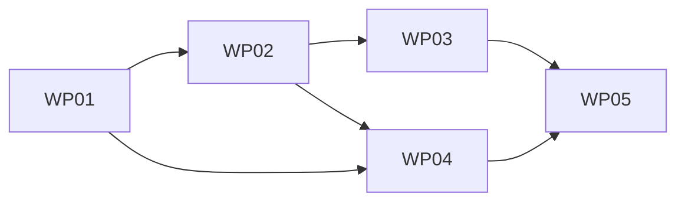

# Tasks: Docs lint: codespell and changelog Unreleased guard

**Mission**: `docs-lint-codespell-changelog-guard-01M3RFGJ` · **Issue**: #5426 · **Target branch**: `issue-5426-docs-lint` (stacked on PR #5420)
**Inputs**: [spec.md](spec.md) · [plan.md](plan.md) · [research.md](research.md) · [data-model.md](data-model.md) · [contracts/check-cli.md](contracts/check-cli.md) · [quickstart.md](quickstart.md)

Subtask completion is event-sourced: record it with `spec-kitty agent tasks mark-status T00N --status done`. The rows below are reference rows, not checkboxes.

## Subtask Index

| ID | Description | WP | Parallel |
|----|-------------|----|----------|
| T001 | `unreleased_section()` extractor in `scripts/release/validate_release.py` + tests | WP01 | |
| T002 | `check_changelog_style.py` skeleton: Entry/Finding model, entry parser, `main(argv)` CLI | WP01 | |
| T003 | Heading rules (set, order, uniqueness, `####` placement) | WP01 | [P] |
| T004 | Entry-shape rules (bold headline, refs outside bold, contrast, Internal single-line) | WP01 | [P] |
| T005 | Banned-token rules (boilerplate, requirement IDs, ULID, evidence/planning refs, all-caps, `spec-kitty merge`) | WP01 | [P] |
| T006 | Length rule (code points, nested items separate, warn > 900, fail > 1,200) | WP01 | [P] |
| T007 | Changelog text: fix the 2 Changed-entry defects, 2 released-section typos, add the Internal entry | WP01 | |
| T008 | Live-text pass + pre-rewrite real-world red control + subprocess entry-point test | WP01 | |
| T009 | `codespell==2.4.3` dev pin, `[tool.codespell]`, `uv.lock`, pyproject-shape gate | WP02 | |
| T010 | `check_spelling.py` core: subprocess runner, output parsing, Finding, `main(argv)`, exit codes | WP02 | |
| T011 | Typo pass over `docs/**/*.md`, `README.md`, `packs/built-in/**/*.md` | WP02 | |
| T012 | US pass over `docs/guides/`, `docs/context/` (code spans, fences, anchors exempt) | WP02 | |
| T013 | US pass over the Unreleased section with real-line offsets | WP02 | |
| T014 | Fixture-tree tests: planted typo/UK/skip pairs, exemptions, determinism, entry point | WP02 | |
| T015 | Live-tree spelling test (red first) | WP03 | |
| T016 | Fix the 2 ADR typos (`migrateable`, `re-using`) | WP03 | [P] |
| T017 | US prose fixes in `docs/guides/` and `docs/context/`; quoted literals → code spans | WP03 | [P] |
| T018 | Glossary heading renames with legacy anchors, in-page links, alias | WP03 | |
| T019 | Regenerate contextive glossary YAML | WP03 | |
| T020 | Regenerate the retrieval index; run the freshness check and terminology guard | WP03 | |
| T021 | Always-on `docs-lint` job in `ci-router.yml` | WP04 | |
| T022 | Router-gate `needs` + `_ALWAYS_ON_JOB_NAMES` | WP04 | |
| T023 | `make docs-lint` target (no pytest) | WP04 | [P] |
| T024 | CI-shape test for the `docs-lint` job (unconditional, unmasked, no pytest/make) | WP04 | |
| T025 | Run the named CI/architectural gate files | WP04 | |
| T026 | Contributor how-to section in `docs/development/how-to/review-gates.md` | WP05 | |
| T027 | `docs-lint` entry in `docs/development/reference/ci-gate-mechanics.md` | WP05 | [P] |
| T028 | Regenerate page inventory + retrieval index; `check_docs_freshness --ci` | WP05 | |
| T029 | Walk the documented steps on a clean tree; terminology guard | WP05 | |

## Phase 1 — Foundation

### WP01 — Changelog Unreleased style guard and canonical extractor

- **Prompt**: [tasks/WP01-changelog-style-guard.md](tasks/WP01-changelog-style-guard.md) · **Priority**: P1 (MVP) · **Estimated prompt size**: ~480 lines
- **Goal**: one shared Unreleased extractor, plus a guard script whose rules pass the current text and fail every planted violation and the pre-rewrite section.
- **Independent test**: `pytest tests/docs/test_changelog_style.py tests/docs/test_unreleased_section.py -q` is green, and each planted rule test fails when its rule function is stubbed out.
- **Included subtasks**:

T001 `unreleased_section()` extractor + tests (WP01)
T002 Guard skeleton, entry parser and CLI (WP01)
T003 Heading rules (WP01)
T004 Entry-shape rules (WP01)
T005 Banned-token rules (WP01)
T006 Length rule (WP01)
T007 Changelog text edits (WP01)
T008 Live-text, pre-rewrite control and entry-point tests (WP01)

- **Dependencies**: none.
- **Parallel**: T003–T006 are independent rule functions.
- **Risks**: rule calibration (research R-4 has the measured thresholds); the two Changed-entry fixes need the true before-behavior from #5100 history, not invented text.

## Phase 2 — Spelling

### WP02 — Spelling check tooling

- **Prompt**: [tasks/WP02-spelling-check-tooling.md](tasks/WP02-spelling-check-tooling.md) · **Priority**: P1 · **Estimated prompt size**: ~420 lines
- **Goal**: a pinned, config-driven codespell with one entry point running three passes, proven on a fixture tree.
- **Independent test**: `pytest tests/docs/test_check_spelling.py -q` is green; `tests/architectural/test_pyproject_shape.py` is green; `uv lock --check` is clean.
- **Included subtasks**:

T009 Dependency pin, config and lockfile (WP02)
T010 Runner core and CLI (WP02)
T011 Typo pass (WP02)
T012 US pass over guides/context (WP02)
T013 US pass over the Unreleased section (WP02)
T014 Fixture-tree tests (WP02)

- **Dependencies**: WP01 (uses `unreleased_section()`).
- **Risks**: skip-glob semantics (the `*dir,*dir/*` pair); US-only regexes must not leak into the typo pass; the Windows command-line length limit (batch file arguments).

### WP03 — Content fixes and the live-tree spelling gate

- **Prompt**: [tasks/WP03-spelling-content-fixes.md](tasks/WP03-spelling-content-fixes.md) · **Priority**: P1 · **Estimated prompt size**: ~380 lines
- **Goal**: the real tree is clean under all three passes, without weakening the dictionary.
- **Independent test**: `pytest tests/docs/test_docs_spelling_live.py -q` is red before T016–T018 and green after.
- **Included subtasks**:

T015 Live-tree test, red first (WP03)
T016 ADR typo fixes (WP03)
T017 US prose fixes (WP03)
T018 Glossary heading renames (WP03)
T019 Contextive regeneration (WP03)
T020 Retrieval index, freshness check and terminology guard (WP03)

- **Dependencies**: WP02.
- **Risks**: respelling a quoted CLI literal or a canonical identifier; the `src/specify_cli/.contextive/` edit triggers run-all CI.

## Phase 3 — Wiring and docs

### WP04 — CI and local wiring

- **Prompt**: [tasks/WP04-ci-and-make-wiring.md](tasks/WP04-ci-and-make-wiring.md) · **Priority**: P1 · **Estimated prompt size**: ~300 lines
- **Goal**: both checks block every PR through an always-on, unmasked job, and `make docs-lint` mirrors it.
- **Independent test**: the new CI-shape test and the named gate files are green.
- **Included subtasks**:

T021 `docs-lint` job (WP04)
T022 Router-gate needs + always-on list (WP04)
T023 Make target (WP04)
T024 CI-shape test (WP04)
T025 Named gate files (WP04)

- **Dependencies**: WP01, WP02. Can run in parallel with WP03.
- **Risks**: the router-gate `needs` set-equality check; the duplicate-suite ledger (no pytest, no make in the job); the workflow-script import guard.

### WP05 — Contributor guidance

- **Prompt**: [tasks/WP05-contributor-guidance.md](tasks/WP05-contributor-guidance.md) · **Priority**: P2 · **Estimated prompt size**: ~260 lines
- **Goal**: contributors can run both checks, add an ignore word, and exempt a quoted literal from the docs alone.
- **Independent test**: `check_docs_freshness.py --ci` reports errors=0; following the documented commands on a clean tree runs both checks green.
- **Included subtasks**:

T026 How-to section (WP05)
T027 CI reference entry (WP05)
T028 Inventory + index regeneration + freshness (WP05)
T029 Walk-through and terminology guard (WP05)

- **Dependencies**: WP03, WP04.
- **Risks**: the description-length gate (50–180 characters); `updated:` frontmatter dates.

## Dependency graph

**MVP**: WP01 alone delivers the changelog guard, the durable half of the PR #5420 fix.
