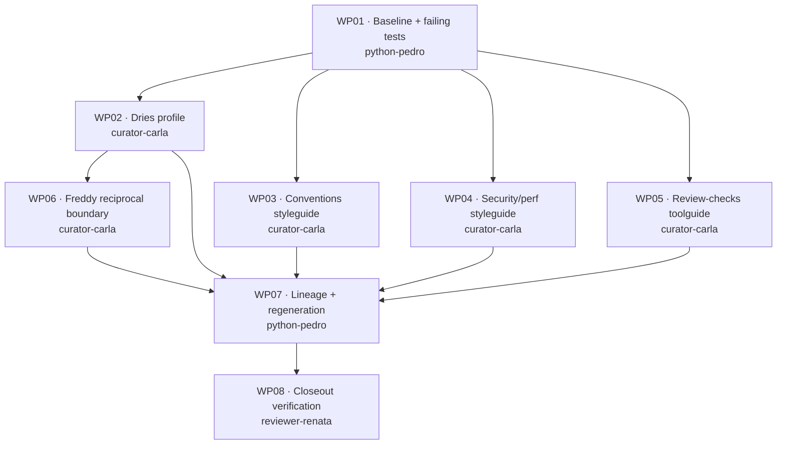

# Work Packages: Drupal Dries Agent Profile

**Mission**: `drupal-dries-profile-01M28X69`
**Branch**: `feat/drupal-dries-profile` | **Merge target**: `feat/drupal-dries-profile`
**Generated**: 2026-09-11
**Inputs**: [spec.md](./spec.md), [plan.md](./plan.md), [research.md](./research.md),
[data-model.md](./data-model.md), [contracts/](./contracts/), [quickstart.md](./quickstart.md)

## Overview

8 work packages, 43 subtasks. The decomposition follows two hard structural facts established in
planning, not a preference:

1. **Graph fragments are generated, and only one owner may regenerate them.** `packs/built-in/*.graph.yaml`
   is produced by `spec-kitty doctrine regenerate-graph` and gate-checked by `--check`. If each content
   WP regenerated, four packages would own the same files. Instead **WP07 alone owns the fragments and
   the extractor**, running after all content lands. Content WPs must *not* regenerate — see the
   standing rule below.
2. **Content files are disjoint.** Every other WP owns exactly one artifact (or one artifact pair), so
   WP02–WP06 parallelize with zero file contention.

### Standing rule for WP02–WP06

> Do **not** run `spec-kitty doctrine regenerate-graph`, and do **not** edit any `*.graph.yaml`.
> Those files belong to WP07. Your artifact is not "unwired" — the wiring is derived from it during
> integration. `regenerate-graph --check` will report stale from WP02 until WP07 completes; that is the
> expected state, not a defect to fix.

### Dependency graph

**Parallel wave**: WP02, WP03, WP04, WP05 run concurrently once WP01 lands — four disjoint files, no
shared state. WP06 joins as soon as WP02 is done.

**MVP scope**: WP01 + WP02 + WP07. That yields a loading, lineage-resolved Drupal profile — User
Story 1 satisfied end-to-end. The styleguides and toolguide (User Story 2) are additive on top.

### Subtask index

| ID | Description | WP | Parallel |
|----|-------------|----|----------|
| T001 | Sync the dev environment | WP01 | |
| T002 | Establish repo-pack graph freshness baseline | WP01 | |
| T003 | Capture profile-load health baseline | WP01 | |
| T004 | Failing test: profile loads and is not skipped | WP01 | [P] |
| T005 | Failing test: lineage resolves, DAG holds | WP01 | [P] |
| T006 | Failing test: inventory rises by exactly four | WP01 | [P] |
| T007 | Profile identity, roles, capabilities, routing | WP02 | |
| T008 | Purpose and specialization block | WP02 | |
| T009 | Collaboration, mode-defaults, initialization declaration | WP02 | |
| T010 | Specialization context | WP02 | |
| T011 | Self-review protocol | WP02 | |
| T012 | Directive/tactic references and provenance | WP02 | |
| T013 | Size and traceability audit | WP02 | |
| T014 | Conventions header and principles | WP03 | |
| T015 | Service and entity patterns | WP03 | |
| T016 | Plugin, form, routing, hook patterns | WP03 | |
| T017 | Drupal-native theming patterns | WP03 | |
| T018 | Convention-shaped anti-patterns (8 of 14) | WP03 | |
| T019 | Tooling, references, size audit | WP03 | |
| T020 | Security/perf header and principles | WP04 | |
| T021 | Sanitization patterns (anti-patterns 3, 6) | WP04 | |
| T022 | Access checking (anti-pattern 7) | WP04 | |
| T023 | Cacheability metadata (anti-pattern 10) | WP04 | |
| T024 | Query discipline and credential hygiene (anti-pattern 11) | WP04 | |
| T025 | Disjointness check against WP03 | WP04 | |
| T026 | Toolguide body: standards and analysis | WP05 | |
| T027 | Toolguide body: PHPUnit test tiers | WP05 | |
| T028 | Toolguide body: JS gates with the R-006 caveat | WP05 | |
| T029 | Environment adaptation note | WP05 | |
| T030 | Descriptor YAML matching the body | WP05 | |
| T031 | Freddy avoidance-boundary amendment | WP06 | |
| T032 | Verification-versus-authorship distinction | WP06 | |
| T033 | Blast-radius and ten-task boundary audit | WP06 | |
| T034 | Lineage entry in the extractor table | WP07 | |
| T035 | Regenerate graph fragments | WP07 | |
| T036 | Prove freshness and review the fragment diff | WP07 | |
| T037 | Confirm zero skipped profiles | WP07 | |
| T038 | Turn WP01's failing tests green | WP07 | |
| T039 | Provenance audit across all artifacts | WP08 | |
| T040 | Activation opt-in and context-unchanged proof | WP08 | |
| T041 | Full targeted test surface, lint, format, terminology | WP08 | |
| T042 | Anti-pattern completeness and Drupal claim sampling | WP08 | |
| T043 | Write the verification report | WP08 | |

---

## WP01 — Baseline and failing verification

**Prompt**: [tasks/WP01-baseline-and-failing-verification.md](./tasks/WP01-baseline-and-failing-verification.md)
**Priority**: P1 · **Depends on**: none · **Profile**: `python-pedro` (implementer)
**Estimated prompt size**: ~330 lines

**Goal**: Make the environment trustworthy and write the assertions that must fail now and pass at
WP07. This is the red half of red-first, and it exists because Phase 0 proved a globally installed
`spec-kitty` reports freshness for the wrong pack.

**Independent test**: The three new test files run and fail for the right reason — the profile does
not exist yet — not because of an import error or a missing environment.

**Included subtasks**

T001 Sync the dev environment (WP01)
T002 Establish repo-pack graph freshness baseline (WP01)
T003 Capture profile-load health baseline (WP01)
T004 Failing test: profile loads and is not skipped (WP01)
T005 Failing test: lineage resolves, DAG holds (WP01)
T006 Failing test: inventory rises by exactly four (WP01)

**Risks**: If the baseline is already red on `main`, that is a pre-existing condition to report, not
to absorb into this mission's diff.

---

## WP02 — Drupal Dries profile artifact

**Prompt**: [tasks/WP02-drupal-dries-profile.md](./tasks/WP02-drupal-dries-profile.md)
**Priority**: P1 · **Depends on**: WP01 · **Profile**: `curator-carla` (curator)
**Estimated prompt size**: ~450 lines

**Goal**: Author the profile itself — the artifact that makes User Story 1 true.

**Independent test**: Load the profile in isolation; the persona states Drupal backend and theming
competence, names its gates, and declares what it will not do.

**Included subtasks**

T007 Profile identity, roles, capabilities, routing (WP02)
T008 Purpose and specialization block (WP02)
T009 Collaboration, mode-defaults, initialization declaration (WP02)
T010 Specialization context (WP02)
T011 Self-review protocol (WP02)
T012 Directive/tactic references and provenance (WP02)
T013 Size and traceability audit (WP02)

**Risks**: NFR-001 caps the file at 215 lines while the source material is 1,492. Declarations belong
here; examples belong in WP03/WP04.

---

## WP03 — Drupal conventions styleguide

**Prompt**: [tasks/WP03-drupal-conventions-styleguide.md](./tasks/WP03-drupal-conventions-styleguide.md)
**Priority**: P1 · **Depends on**: WP01 · **Profile**: `curator-carla` (curator)
**Estimated prompt size**: ~430 lines

**Goal**: The "how do I write this?" half of the guidance — positive Drupal patterns plus the eight
convention-shaped anti-patterns, each as a `bad_example`/`good_example` pair.

**Independent test**: Read the file with no other artifact present; it stands alone as Drupal coding
guidance.

**Included subtasks**

T014 Conventions header and principles (WP03)
T015 Service and entity patterns (WP03)
T016 Plugin, form, routing, hook patterns (WP03)
T017 Drupal-native theming patterns (WP03)
T018 Convention-shaped anti-patterns (8 of 14) (WP03)
T019 Tooling, references, size audit (WP03)

**Parallel**: fully concurrent with WP02, WP04, WP05.

---

## WP04 — Drupal security and performance styleguide

**Prompt**: [tasks/WP04-drupal-security-performance-styleguide.md](./tasks/WP04-drupal-security-performance-styleguide.md)
**Priority**: P1 · **Depends on**: WP01 · **Profile**: `curator-carla` (curator)
**Estimated prompt size**: ~400 lines

**Goal**: The "how do I keep it safe and fast?" half — sanitization, access checking, cacheability,
query discipline, credential hygiene, carrying the six security/performance-shaped anti-patterns.

**Independent test**: Each pattern is verifiable against official Drupal documentation, and no
pattern name duplicates one in WP03.

**Included subtasks**

T020 Security/perf header and principles (WP04)
T021 Sanitization patterns (anti-patterns 3, 6) (WP04)
T022 Access checking (anti-pattern 7) (WP04)
T023 Cacheability metadata (anti-pattern 10) (WP04)
T024 Query discipline and credential hygiene (anti-pattern 11) (WP04)
T025 Disjointness check against WP03 (WP04)

**Risks**: WP03 and WP04 partition the 14 anti-patterns 8/6. Neither WP can confirm the total alone —
WP08 audits 14 of 14.

---

## WP05 — Drupal review-checks toolguide

**Prompt**: [tasks/WP05-drupal-review-checks-toolguide.md](./tasks/WP05-drupal-review-checks-toolguide.md)
**Priority**: P2 · **Depends on**: WP01 · **Profile**: `curator-carla` (curator)
**Estimated prompt size**: ~360 lines

**Goal**: The verification command set — body plus descriptor, environment-agnostic, with no invented
threshold.

**Independent test**: Every command in the descriptor appears in the body and vice versa; each traces
to a named section of the source guide.

**Included subtasks**

T026 Toolguide body: standards and analysis (WP05)
T027 Toolguide body: PHPUnit test tiers (WP05)
T028 Toolguide body: JS gates with the R-006 caveat (WP05)
T029 Environment adaptation note (WP05)
T030 Descriptor YAML matching the body (WP05)

**Risks**: NFR-006 forbids invented thresholds. The source names no PHPStan level; supplying one
would be fabrication.

---

## WP06 — Frontend Freddy reciprocal boundary

**Prompt**: [tasks/WP06-frontend-freddy-reciprocal-boundary.md](./tasks/WP06-frontend-freddy-reciprocal-boundary.md)
**Priority**: P2 · **Depends on**: WP02 · **Profile**: `curator-carla` (curator)
**Estimated prompt size**: ~250 lines

**Goal**: The only edit to a pre-existing profile. Isolated into its own package precisely so a
reviewer can audit that blast radius in one diff (NFR-007).

**Independent test**: A reader assigns ten sample Drupal frontend tasks using only the two boundary
declarations, with no ties.

**Included subtasks**

T031 Freddy avoidance-boundary amendment (WP06)
T032 Verification-versus-authorship distinction (WP06)
T033 Blast-radius and ten-task boundary audit (WP06)

**Risks**: Depends on WP02 because the two boundaries must be semantically reciprocal. Quote Dries's
text; do not paraphrase it from memory.

---

## WP07 — Lineage and graph regeneration

**Prompt**: [tasks/WP07-lineage-and-graph-regeneration.md](./tasks/WP07-lineage-and-graph-regeneration.md)
**Priority**: P1 · **Depends on**: WP02, WP03, WP04, WP05, WP06 · **Profile**: `python-pedro` (implementer)
**Estimated prompt size**: ~380 lines

**Goal**: The integration package. Add the one Python lineage entry, regenerate every fragment, prove
freshness, and turn WP01's failing tests green.

**Independent test**: `regenerate-graph --check` exits 0 against the repository pack, and the fragment
diff contains only this mission's four nodes and their edges.

**Included subtasks**

T034 Lineage entry in the extractor table (WP07)
T035 Regenerate graph fragments (WP07)
T036 Prove freshness and review the fragment diff (WP07)
T037 Confirm zero skipped profiles (WP07)
T038 Turn WP01's failing tests green (WP07)

**Risks**: Sole owner of `*.graph.yaml` and `extractor.py`. Touching `src/charter/offering/` pulls both
`tests/charter/` and `tests/doctrine/` into the blast radius.

---

## WP08 — Closeout verification

**Prompt**: [tasks/WP08-closeout-verification.md](./tasks/WP08-closeout-verification.md)
**Priority**: P2 · **Depends on**: WP07 · **Profile**: `reviewer-renata` (reviewer)
**Estimated prompt size**: ~330 lines

**Goal**: Prove the cross-cutting claims no single content WP can prove: 14 of 14 anti-patterns,
provenance everywhere, activation still opt-in, and the full targeted test surface green.

**Independent test**: The verification report records real commands with real pass/fail counts, ready
to paste into the PR's *Tests run* section.

**Included subtasks**

T039 Provenance audit across all artifacts (WP08)
T040 Activation opt-in and context-unchanged proof (WP08)
T041 Full targeted test surface, lint, format, terminology (WP08)
T042 Anti-pattern completeness and Drupal claim sampling (WP08)
T043 Write the verification report (WP08)

**Risks**: This is the only package positioned to catch an anti-pattern that WP03 and WP04 each
assumed the other had taken.

---

## Requirement coverage

| WP | Requirements |
|----|--------------|
| WP01 | FR-013, NFR-002, NFR-003 |
| WP02 | FR-001, FR-002, FR-003, FR-009, FR-011, NFR-001 |
| WP03 | FR-006, FR-008 |
| WP04 | FR-006, NFR-006 |
| WP05 | FR-007 |
| WP06 | FR-004, NFR-007 |
| WP07 | FR-005, NFR-002 |
| WP08 | FR-010, FR-012, NFR-004, NFR-005 |

All 13 functional requirements are mapped. Constraints C-001…C-008 are cross-cutting and enforced in
every package's Definition of Done.
