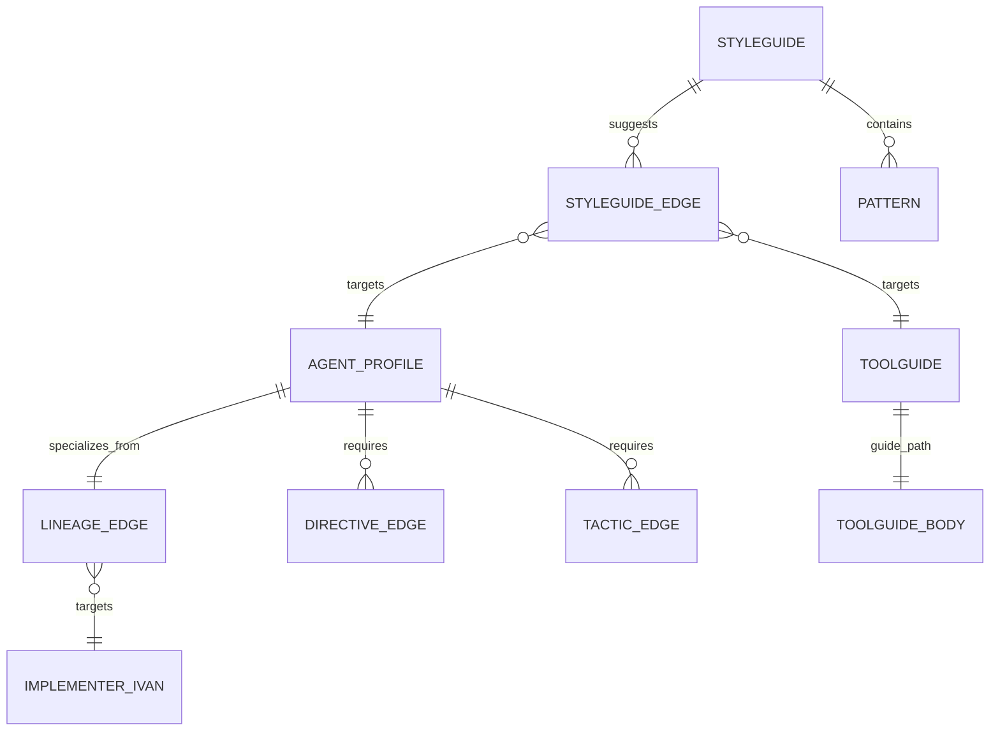

# Data Model: Drupalling Dries Agent Profile

**Mission**: `drupalling-dries-profile-01M28X69`
**Date**: 2026-09-11

This mission introduces no runtime data store, no persisted state, and no schema migration. The
"data" is declarative doctrine content: YAML artifacts conforming to existing schemas, and the
graph nodes and edges derived from them. This document specifies the entities, their fields, the
relationships between them, and the invariants that must hold.

## Entity overview

---

## E1 — Drupalling Dries profile

**Location**: `packs/built-in/agent_profiles/drupalling-dries.agent.yaml`
**Schema**: the existing agent-profile schema, version `"1.0"` (peers: `java-jenny`,
`python-pedro`, `node-norris`, `frontend-freddy`)

| Field | Value / shape | Source |
|-------|---------------|--------|
| `profile-id` | `drupalling-dries` | FR-001 |
| `name` | `Drupalling Dries` | FR-001 |
| `description` | one line distinguishing it from the other specialists | FR-001 |
| `schema-version` | `"1.0"` | peer convention |
| `roles` | `[implementer]` | specify decision `01M28XGDEW396YNYGG2R3103WP` |
| `applies_to_languages` | `[php, twig, yaml]` | FR-002, FR-003 |
| `capabilities` | Drupal module implementation, entity/plugin/hook work, config management, theming, PHPUnit tiers, code review response | FR-002, FR-003 |
| `routing-priority` | `80` | peer norm — every specialist uses 80 |
| `max-concurrent-tasks` | `5` | peer norm |
| `purpose` | prose statement of what Dries does and explicitly does not decide | FR-001, FR-011 |
| `specialization.primary-focus` | backend + Drupal-native theming | FR-002, FR-003 |
| `specialization.secondary-awareness` | migration, batch/queue, content moderation, Composer | FR-002 |
| `specialization.avoidance-boundary` | architecture decisions, infrastructure, generic browser authorship (deferred to Freddy), non-Drupal PHP frameworks | FR-004 |
| `specialization.success-definition` | tested idiomatic Drupal code passing all gates and approved by a reviewer | FR-009 |
| `collaboration.handoff-to` | `[reviewer]` | FR-004 |
| `collaboration.handoff-from` | `[architect, planner]` | peer norm |
| `mode-defaults` | implementation, debugging, refactoring | peer norm |
| `initialization-declaration` | first-person statement of identity, gates, and boundaries | FR-001 |
| `specialization-context` | `languages`, `frameworks`, `file-patterns`, `domain-keywords` | FR-002, FR-003 |
| `self-review-protocol.steps` | ordered gates — see E2 | FR-009 |
| `directive-references` | 010, 024, 025, 030, 034, 051 with rationale each | FR-005, R-005 |
| `tactic-references` | dependency-hygiene, tdd-red-green-refactor, supply-chain-install-safety, bug-fixing-checklist | FR-005, R-005 |

**Invariants**:
- **I1.1** Total length within 140-215 lines (NFR-001).
- **I1.2** No `specializes-from` field. The model rejects it (R-001).
- **I1.3** `file-patterns` must match real Drupal layouts — `modules/custom/**/*.php`,
  `**/*.module`, `**/*.info.yml`, `**/*.routing.yml`, `**/*.services.yml`, `themes/**/*.twig`.
- **I1.4** Every Drupal claim traceable to the source guide or official docs (NFR-006).
- **I1.5** States the Drupal 10.x/11.x + PHP 8.3+ baseline (FR-011, C-005).

---

## E2 — Self-review protocol (value object inside E1)

Ordered steps, each a `name` plus a `gate`, and a `command` where one exists.

| # | Step | Command | Gate |
|---|------|---------|------|
| 1 | coding-standards | `vendor/bin/phpcs --standard=Drupal,DrupalPractice .` | zero violations |
| 2 | static-analysis | `vendor/bin/phpstan analyse` | clean at the project's configured level |
| 3 | deprecation-scan | `vendor/bin/drupal-check .` | no deprecated API use |
| 4 | tests | `vendor/bin/phpunit` | all tiers in scope pass |
| 5 | js-tests | `npm run test` | passes — theming JS Dries authored (R-006) |
| 6 | js-accessibility | `npm run test:a11y` | passes |
| 7 | dependency-audit | `composer audit` | no unreviewed advisories |
| 8 | cache-rebuild | `drush cr` | rebuild succeeds against the change |
| 9 | acceptance-review | — | every acceptance criterion has a passing test |
| 10 | locality-review | — | only files related to the objective are modified |

**Invariants**:
- **I2.1** No invented threshold — no PHPStan level, no coverage percentage (NFR-006, R-007).
- **I2.2** Commands bare, with one adaptation note for containerized setups (C-004, R-008).
- **I2.3** Steps 5-6 carry the verification-scope caveat from R-006.

---

## E3 — Lineage edge

**Location**: `_CURATED_ARTIFACT_EDGES`, `src/charter/offering/drg/migration/extractor.py`

| Field | Value |
|-------|-------|
| source | `agent_profile:drupalling-dries` |
| target | `agent_profile:implementer-ivan` |
| relation | `Relation.SPECIALIZES_FROM` |

**Invariants**:
- **I3.1** Endpoint form `<kind>:<id>` — anything else is refused at merge with
  `unresolved_edge_endpoint` (C-002).
- **I3.2** The `specializes_from` subgraph must remain a DAG; the validator checks acyclicity.
  A leaf pointing at `implementer-ivan` cannot introduce a cycle.
- **I3.3** Added adjacent to the four existing specialist entries, preserving their ordering style.

---

## E4 — Drupal conventions styleguide

**Location**: `packs/built-in/styleguides/drupal-conventions.styleguide.yaml`

| Field | Shape |
|-------|-------|
| `schema_version` | `"1.0"` |
| `id` | `drupal-conventions` |
| `title` | `Drupal Conventions Styleguide` |
| `scope` | `code` |
| `applies_to_languages` | `[php, twig]` |
| `principles` | 8-10 one-line rules |
| `patterns` | entries of `name`, `description`, `bad_example`, `good_example` |
| `tooling` | formatter / linter / analyzer names |
| `references` | source attribution (FR-010) |

**Content**: positive patterns (constructor DI, entity query with `accessCheck(TRUE)`, plugin
annotation, `ConfigFormBase`, route/controller, Twig auto-escaping, thin `.module`) plus the 14
source anti-patterns as paired bad/good entries.

**Invariants**:
- **I4.1** All 14 source anti-patterns present, or an explicit omission reason (SC-003).
- **I4.2** Every `bad_example` paired with a `good_example` — the `python-conventions` shape.
- **I4.3** Target 150-210 lines (NFR-001 rationale). Widened from 200 after the ceiling forced a
  219-character single-line constructor and a merged `} }` into a *conventions* styleguide — a
  badly-formatted exemplar defeats the artifact's purpose, while 10 extra lines cost nothing
  against the context-loadability goal the bound actually serves.

---

## E5 — Drupal security & performance styleguide

**Location**: `packs/built-in/styleguides/drupal-security-performance.styleguide.yaml`

Same schema as E4. Content: sanitization (`#plain_text`, `Html::escape()`, never `|raw`),
access checking (`accessCheck(TRUE)` — deprecated implicit checking in 9.2.0, error from 10.0.0), cacheability metadata (tags,
contexts, max-age), query discipline, credential hygiene (`settings.local.php` excluded from VCS),
render-array and caching strategy.

**Invariants**:
- **I5.1** Version-sensitive claims carry their version (I1.5, FR-011).
- **I5.2** No overlap with E4 beyond a cross-reference — the split must be a real boundary.

---

## E6 — Drupal review-checks toolguide

**Location**: `packs/built-in/toolguides/DRUPAL_REVIEW_CHECKS.md` (body) +
`drupal-review-checks.toolguide.yaml` (descriptor)

Descriptor fields, matching `maven-review-checks.toolguide.yaml`: `schema_version`, `id`, `tool`,
`title`, `guide_path`, `applies_to_languages`, `summary`, `commands`.

**Invariants**:
- **I6.1** `guide_path` resolves to the committed body file.
- **I6.2** `commands` lists exactly the commands the body documents — no drift.
- **I6.3** Environment adaptation note present (C-004).

---

## E7 — Derived graph edges

Minted by regeneration, never hand-written (R-002).

| Source | Target | Relation | Origin |
|--------|--------|----------|--------|
| `agent_profile:drupalling-dries` | `agent_profile:implementer-ivan` | `specializes_from` | E3 |
| `agent_profile:drupalling-dries` | `directive:DIRECTIVE_0{10,24,25,30,34,51}` | `requires` | E1 `directive-references` |
| `agent_profile:drupalling-dries` | `tactic:{dependency-hygiene, tdd-red-green-refactor, supply-chain-install-safety, bug-fixing-checklist}` | `requires` | E1 `tactic-references` |
| `styleguide:drupal-conventions` | `agent_profile:drupalling-dries` | `suggests` | `java-conventions` precedent |
| `styleguide:drupal-conventions` | `toolguide:drupal-review-checks` | `suggests` | same |
| `styleguide:drupal-security-performance` | `agent_profile:drupalling-dries` | `suggests` | same |

**Invariants**:
- **I7.1** Committed fragments byte-identical to a fresh regeneration (R-002).
- **I7.2** Every endpoint resolves; an unresolved endpoint is refused at merge (C-002).
- **I7.3** Node count rises by exactly 4 (1 profile, 2 styleguides, 1 toolguide), matching the
  filesystem-derived inventory in `tests/doctrine/_builtin_inventory.py`, which globs source files
  independently of the graph.

---

## E8 — Frontend Freddy boundary amendment

**Location**: `packs/built-in/agent_profiles/frontend-freddy.agent.yaml`

The single modification to a pre-existing artifact. Freddy's `specialization.avoidance-boundary`
already defers server-side work to Node Norris and UX decisions to Designer Dagmar; this adds
Drupal-native theming, deferred to Drupalling Dries, in the same voice.

**Invariants**:
- **I8.1** Confined to the boundary declaration — no other field changes (NFR-007).
- **I8.2** Semantically reciprocal with Dries's own boundary; the pair must not contradict.
- **I8.3** Carries the R-006 verification/authorship distinction.

---

## State transitions

None. These are declarative artifacts with no lifecycle of their own. The only state-like property
is **activation**, which is pre-existing machinery this mission neither extends nor alters:
`charter activate agent-profile drupalling-dries` (FR-012). Inactive is the shipped default, and an
unactivated profile contributes nothing to loaded governance context (NFR-005).

## Externally visible events

None. No event is emitted, no integration is called, no API surface changes.
