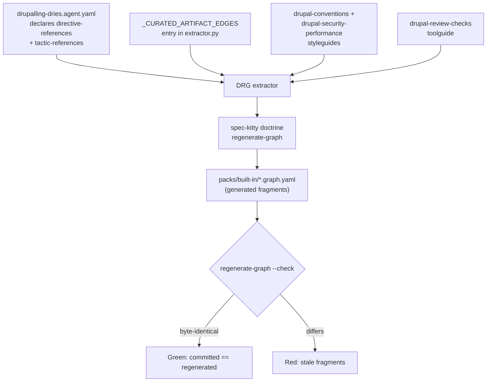

# Implementation Plan: Drupalling Dries Agent Profile

**Branch**: `feat/drupalling-dries-profile` | **Date**: 2026-09-11 | **Spec**: [spec.md](./spec.md)
**Input**: Feature specification from `kitty-specs/drupalling-dries-profile-01M28X69/spec.md`

## Summary

Add **Drupalling Dries**, a Drupal-specialist implementer, delivered as a complete specialist
package in the shape the Java, Python, and Node specialists already use. The Drupal knowledge is
distilled from amazee.io's `drupal-agents-md` (Vanilla variant, 1,492 lines) into this
repository's own artifact contracts.

The technical approach is dictated by three facts established during Phase 0 investigation, not
chosen freely:

1. **Lineage is Python, not YAML.** The `specializes_from` edge that makes Dries inherit
   implementer discipline is authored in a hardcoded table, `_CURATED_ARTIFACT_EDGES` in
   `src/charter/offering/drg/migration/extractor.py:267`, which the code itself names "the single
   source of lineage truth" after the per-profile field was retired. FR-005 therefore requires a
   source change in `src/charter/offering/`, which per the repository's blast-radius rule pulls in
   both `tests/charter/` and `tests/doctrine/`.
2. **Graph fragments are generated and gate-checked.** `packs/built-in/*.graph.yaml` is produced by
   `spec-kitty doctrine regenerate-graph`; `--check` regenerates into a temp directory and exits
   non-zero if the committed fragments differ. Hand-editing them is not an option — it would go red.
3. **Directive and tactic edges are extracted from the profile YAML.** The extractor reads
   `directive-references` and `tactic-references` (`extractor.py:634,646`), so those edges arrive
   automatically once the profile declares them. Only lineage needs the curated table.

## Technical Context

**Language/Version**: Python 3.11+ (repository source) and YAML 1.2 (doctrine pack artifacts);
the *subject matter* is Drupal 10.x/11.x on PHP 8.3+, which is content, not a build dependency
**Primary Dependencies**: none added — C-006. Existing internals only: `charter.offering.drg`
(extractor, merge, validator), `charter.offering.agent_profiles` (repository, schema models),
`charter.offering.styleguides`, and the `spec-kitty doctrine regenerate-graph` CLI
**Storage**: files — YAML artifacts under `packs/built-in/` and generated `*.graph.yaml` fragments.
No database, no runtime state
**Testing**: pytest. Targeted surfaces: `tests/doctrine/agent_profiles/`,
`tests/doctrine/styleguides/`, `tests/doctrine/drg/`, `tests/charter/`, plus
`tests/architectural/test_no_legacy_terminology.py`. Baseline `make test-fast`
**Target Platform**: the Spec Kitty CLI wherever it runs — macOS/Linux, Python 3.11+
**Project Type**: single project — additive doctrine-pack content plus one source-table entry
**Performance Goals**: no measurable regression in profile load or graph assembly; the charter's
<2s CLI budget already binds and this mission must not erode it. Two styleguides of ~150-200 lines
rather than one 400+ line guide keeps per-activation context load near the existing peer norm
**Constraints**: C-001 source pack only, never generated agent copies; C-002 lineage as a graph
edge in canonical endpoint form; C-003 distillation not reproduction; C-004 environment-agnostic
commands; C-005 Drupal 10.x/11.x + PHP 8.3+; C-006 no new dependencies; C-007 no mission type;
C-008 terminology canon. Plus NFR-004: zero new lint/format/type/terminology issues and zero new
suppressions
**Scale/Scope**: 8 files — 5 new pack artifacts, 2 edits (one existing profile, one Python table),
and 1 regenerated graph fragment set. Estimated ~900 lines of new YAML/Markdown content, ~6 lines
of Python

## Charter Check

*GATE: Must pass before Phase 0 research. Re-checked after Phase 1 design.*

The charter is present at `.kittify/charter/charter.md`.

| Principle | Assessment | Verdict |
|-----------|-----------|---------|
| **Single canonical authority** | Lineage goes in the one place the code names as lineage truth (`_CURATED_ARTIFACT_EDGES`), not a second mechanism. Drupal anti-patterns go in the styleguide channel that already carries stack anti-patterns (`python-conventions`), not into the `anti_pattern` graph channel reserved for cross-cutting DDD concepts. No second authority is created. | PASS |
| **Architectural alignment** | The package aligns to the existing specialist structure rather than around it: same profile schema, same styleguide→profile/toolguide edge pattern as `java-conventions`, same generated-graph discipline. No module seam is crossed; `src/charter/offering/` is edited in place by one table entry. | PASS |
| **Domain-driven splits + tiered rigour** | Higher rigour on the one Python change (it feeds a gate-checked generator) than on the YAML content. The conventions/security split follows a bounded-context line rather than a size heuristic. | PASS |
| **ATDD-first** | Every WP is driven from a spec acceptance scenario. The verification WP is written first as failing assertions against the not-yet-existing profile, per the red-first standing order. | PASS |
| **Glossary & terminology adherence** | All delivered prose uses canonical terms; `tests/architectural/test_no_legacy_terminology.py` runs pre-push because this mission touches both `src/charter/offering/` and user-facing prose. | PASS |

**Post-Phase-1 re-check**: PASS, unchanged. The design added no new authority, no new dependency,
and no new module boundary. One tension surfaced and was resolved in design rather than deferred —
see the JS-gate boundary refinement in [research.md](./research.md), R-006.

**Testing-requirement note.** The charter mandates 90%+ coverage for new code and `mypy --strict`.
Six of the eight changed files are YAML/Markdown content carrying no executable branches; the
coverage obligation attaches to the Python table entry and to the tests that assert pack integrity.
NFR-003's ≥90% diff-cover gate is the operative measure, and the verification WP exists to satisfy
it honestly rather than by counting uncovered data files as covered.

## Project Structure

### Documentation (this mission)

```
kitty-specs/drupalling-dries-profile-01M28X69/
├── plan.md              # This file
├── spec.md              # Committed, substantive (13 FR / 7 NFR / 8 C)
├── research.md          # Phase 0 output
├── data-model.md        # Phase 1 output
├── quickstart.md        # Phase 1 output
├── contracts/           # Phase 1 output
│   ├── profile-contract.md
│   └── styleguide-toolguide-contract.md
├── checklists/
│   └── requirements.md
└── decisions/           # 7 Decision Moments (5 specify, 2 plan)
```

### Source Code (repository root)

```
packs/built-in/
├── agent_profiles/
│   ├── drupalling-dries.agent.yaml            # NEW  — the profile
│   └── frontend-freddy.agent.yaml             # EDIT — reciprocal boundary clause (FR-004)
├── styleguides/
│   ├── drupal-conventions.styleguide.yaml     # NEW  — style, patterns, 14 anti-patterns
│   └── drupal-security-performance.styleguide.yaml  # NEW — sanitization, access, cacheability
├── toolguides/
│   ├── DRUPAL_REVIEW_CHECKS.md                # NEW  — the guide body
│   └── drupal-review-checks.toolguide.yaml    # NEW  — the descriptor
├── agent_profile.graph.yaml                   # REGENERATED — never hand-edited
├── styleguide.graph.yaml                      # REGENERATED
└── toolguide.graph.yaml                       # REGENERATED

src/charter/offering/drg/migration/
└── extractor.py                               # EDIT — one _CURATED_ARTIFACT_EDGES entry

tests/doctrine/
├── agent_profiles/                            # profile load, resolution, schema
└── styleguides/                               # styleguide model/repository/validation
```

**Structure Decision**: Single project, additive within the existing built-in doctrine pack. No new
package, module, or directory is introduced. The only file outside `packs/built-in/` is
`src/charter/offering/drg/migration/extractor.py`, and it receives a single tuple entry.

### Delivery flow



The gate at the bottom is why no work package may hand-edit a `*.graph.yaml` file: the check
regenerates from source and compares, so a hand-edit is indistinguishable from staleness.

## Implementation Concern Map

Concerns for `/spec-kitty.tasks` to translate into work packages. Ordering below is a dependency
statement, not a work-package count.

| # | Concern | Touches | Depends on | Spec coverage |
|---|---------|---------|-----------|---------------|
| IC-1 | **Verification first.** Author the failing assertions: profile loads, lineage resolves, zero skipped profiles, graph fresh. | `tests/doctrine/agent_profiles/`, `tests/doctrine/drg/` | — | FR-013, NFR-002, NFR-003 |
| IC-2 | **The profile.** Identity, roles, capabilities, specialization, collaboration, mode defaults, initialization declaration, specialization context, self-review protocol, directive/tactic references, version baseline. | `packs/built-in/agent_profiles/drupalling-dries.agent.yaml` | IC-1 | FR-001, FR-002, FR-003, FR-009, FR-011, NFR-001 |
| IC-3 | **Lineage + regeneration.** One `_CURATED_ARTIFACT_EDGES` entry, then regenerate fragments and prove `--check` green. | `src/charter/offering/drg/migration/extractor.py`, `packs/built-in/*.graph.yaml` | IC-2 | FR-005, C-002, NFR-002 |
| IC-4 | **Conventions styleguide.** Style, DI, entity/plugin/hook/form/routing patterns, theming, and all 14 source anti-patterns as `bad_example`/`good_example` pairs. | `packs/built-in/styleguides/drupal-conventions.styleguide.yaml` | IC-1 | FR-006, FR-008, SC-003 |
| IC-5 | **Security/performance styleguide.** Sanitization, `accessCheck(TRUE)`, cacheability metadata, query discipline, credential hygiene. | `packs/built-in/styleguides/drupal-security-performance.styleguide.yaml` | IC-1 | FR-006, NFR-006 |
| IC-6 | **Review-checks toolguide.** Guide body plus descriptor; environment-agnostic commands with the adaptation note. | `packs/built-in/toolguides/DRUPAL_REVIEW_CHECKS.md`, `drupal-review-checks.toolguide.yaml` | IC-1 | FR-007, C-004 |
| IC-7 | **Boundary reciprocity.** Dries's `avoidance-boundary` plus the reciprocal clause in Frontend Freddy, including the verification-vs-authorship distinction. | `packs/built-in/agent_profiles/frontend-freddy.agent.yaml`, and the Dries profile | IC-2 | FR-004, NFR-007, SC-004 |
| IC-8 | **Provenance and closeout.** Attribution in every delivered artifact; activation-stays-opt-in confirmed; full targeted test surface green. | all delivered artifacts | IC-2..IC-7 | FR-010, FR-012, NFR-005, SC-006, SC-007 |

IC-4, IC-5, and IC-6 are mutually independent once IC-1 lands and are the natural parallel stream.
IC-3 must follow IC-2 because the lineage edge references a profile that must already exist, and
IC-7 must follow IC-2 for the same reason.

## Complexity Tracking

No Charter Check violations. One deliberate deviation from the peer pattern is recorded here
because a reviewer will notice it:

| Deviation | Why Needed | Simpler Alternative Rejected Because |
|-----------|------------|-------------------------------------|
| Two styleguides where Java and Python each ship one | Drupal's distilled content is roughly 2.5x a peer's. One file would land at 400+ lines against a 158-170 line norm, loaded in full on every activation. | A single guide was the simpler option and was rejected on context cost and concern-mixing; the split falls on a real bounded-context line (how to write it vs. how to keep it safe and fast), not on file size alone. |
| The mission edits a Python file, not only pack YAML | `_CURATED_ARTIFACT_EDGES` is the only mechanism that can mint `specializes_from` for a built-in profile; the per-profile field was retired and is rejected by the profile model. | Declaring lineage in the profile YAML was tried against the model and is rejected at load time. Omitting lineage entirely would violate FR-005 and break inheritance of implementer discipline. |

## Parallel Work Analysis

### Dependency Graph

```
IC-1 (verification, red)
   │
   ├──────────────┬──────────────┬──────────────┐
   ▼              ▼              ▼              ▼
 IC-2          IC-4           IC-5           IC-6
(profile)   (conventions)  (security)    (toolguide)
   │              │              │              │
   ├──────┐       └──────────────┴──────────────┘
   ▼      ▼                      │
 IC-3   IC-7                     │
(lineage)(boundary)              │
   └──────┴──────────────────────┘
                │
                ▼
              IC-8 (provenance + closeout)
```

### Work Distribution

- **Sequential work**: IC-1 first — the red-first standing order means assertions exist before the
  artifacts they describe. IC-3 and IC-7 are gated on IC-2 by reference, not by convention.
- **Parallel streams**: IC-4, IC-5, IC-6 touch three disjoint files and share no state. IC-2 can run
  alongside them.
- **Agent assignments**: file-level ownership is already disjoint per the Implementation Concern Map
  — no two concerns write the same file, with the single exception that IC-7 and IC-2 both touch the
  Dries profile. IC-7 must therefore either follow IC-2 in the same lane or be sequenced after it.

### Coordination Points

- **After IC-2**: the profile exists, unblocking IC-3 and IC-7.
- **After IC-3**: graph fragments are regenerated. Any later change to a profile's
  `directive-references` or `tactic-references` requires re-running regeneration — a second
  regeneration pass at closeout is cheaper than discovering staleness in review.
- **Integration check (IC-8)**: `spec-kitty doctrine regenerate-graph --check` green,
  `spec-kitty doctor doctrine --json` reporting zero skipped profiles, and the targeted test surface
  green: `tests/doctrine/`, `tests/charter/`,
  `tests/architectural/test_no_legacy_terminology.py`, plus `make test-fast` as baseline.

## Risks

| Risk | Likelihood | Impact | Mitigation |
|------|-----------|--------|------------|
| Regenerating graph fragments produces diff noise beyond this mission's nodes — e.g. an unrelated drift already sitting in the tree | Medium | Review confusion; a reviewer cannot tell which lines are ours | Run `regenerate-graph --check` **before** any change (IC-1) to establish a clean baseline. If it is already stale on `main`, that is a pre-existing condition to report, not to silently absorb. |
| A globally installed `spec-kitty` checks the wrong pack — it reports freshness for the pack bundled inside its own venv, not this repository's | **Verified — it happens** | A confident false green that says nothing about the change under review | R-003. IC-1 must run `make dev-setup` (or `uv sync --frozen --all-extras`) and drive regeneration from repository source. This checkout has no `.venv` today, so the repo-pack baseline is currently **unverified**. |
| Drupal claims drift from the source or from current Drupal practice | Medium | NFR-006 violated; the profile teaches something wrong | Every claim traces to the source guide or official Drupal docs. `accessCheck(TRUE)` is the clearest version-sensitive case and is why FR-011 forces a stated baseline — and the upstream source states it WRONG (its line 701 claims 10.2/Drupal 12; actually deprecated 9.2.0, error from 10.0.0), which is why NFR-006 requires tracing to official Drupal docs rather than to the source guide alone. |
| The JS-gate decision reopens the FR-004 boundary | High if unaddressed | Two profiles that contradict each other | Resolved in design, not deferred: verification scope ≠ authorship scope. See research.md R-006; IC-7 carries it into both profiles' text. |
| Peer-norm size pressure (NFR-001, 140-215 lines) versus the volume of distilled content | Medium | An over-long profile that dominates context | The two-styleguide split exists partly to absorb content that would otherwise bloat the profile. The profile holds declarations; the styleguides hold examples. |

## Supply-Chain Security Assessment

This mission **adds, upgrades, and removes zero dependencies** in every ecosystem (C-006). The
`051-supply-chain-install-safety` directive and `supply-chain-install-safety` tactic are therefore
engaged in one direction only: as *content Dries carries downstream*, not as a change to this
repository's own dependency posture.

- **Registry authenticity**: N/A for this repository — nothing is installed. Dries's guidance names
  Packagist/Composer and npm for consumer projects and inherits `tactic:dependency-hygiene` and
  `tactic:supply-chain-install-safety` so that discipline propagates.
- **Package freshness**: N/A here. `composer audit` is carried into the toolguide from the source
  guide so downstream projects check advisories.
- **Lifecycle-script discipline**: N/A here. Worth stating plainly — Composer's `post-install-cmd`
  and npm's `postinstall` are exactly the deny-by-default surface 051 targets, and Drupal projects
  routinely run `drupal-scaffold` through them.
- **Node Active LTS**: relevant only because the JS-gate decision adds `npm run test` to Dries's
  self-review. It is a command Dries *runs in a consumer project*, not a runtime this repository
  acquires.

**Adversarial evidence**: no security-impacting dependency decision was made, so no adversarial
squad challenge pass is triggered. This is a genuine N/A, not a silent skip — it is recorded here
and in research.md so a later reviewer can see the determination rather than infer it.
