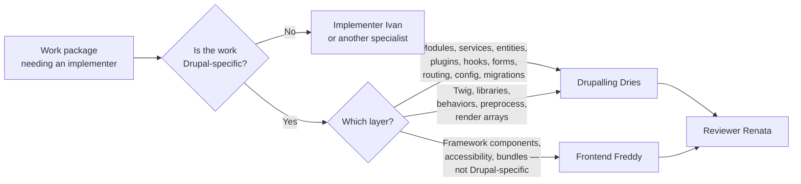

# Mission Specification: Drupalling Dries Agent Profile

**Mission Branch**: `feat/drupalling-dries-profile`
**Created**: 2026-09-11
**Status**: Draft
**Input**: User description: "The spec-kitty codebase contains agent profiles like debugger debby. I would like to create a new agent profile \"Drupalling Dries\". An agent that knows everything about Drupal. I found this information online, an AGENTS.md for Drupal. I guess you can take a lot of info from here. And maybe add what might be missing. Can you create a separate feature branch, in order for me to ask for a pull request? Thanks!"

## Overview

Spec Kitty ships a roster of built-in agent profiles. Several are stack specialists — Java
Jenny, Python Pedro, Node Norris, Frontend Freddy — each giving a mission an implementer who
already knows a stack's conventions, tooling, and quality gates. Drupal has no such persona.
An operator running a Drupal work package today gets either a generic implementer or a
wrong-stack specialist, and must hand-feed Drupal conventions every time.

This mission adds **Drupalling Dries** as a first-class built-in Drupal specialist, delivered
as a complete specialist package in the same shape the Java and Python specialists already
use, so the knowledge has somewhere durable to live rather than being compressed into a
single profile file.

### Domain Language

| Canonical term | Meaning in this mission | Avoid |
|----------------|-------------------------|-------|
| Agent profile | A named persona with declared roles, competence, boundaries, and self-review gates | "agent", "role", "persona" used interchangeably |
| Specialist package | The full set of artifacts a stack specialist ships with: profile + lineage/graph wiring + conventions styleguide + review-checks toolguide + anti-patterns | "the profile" (understates scope) |
| Drupal-native theming | Twig templates, library declarations, Drupal behaviors, render arrays, preprocess functions | "frontend" (ambiguous — see FR-004) |
| Generic browser work | Framework components, accessibility compliance, bundle concerns not specific to Drupal | "frontend" (same ambiguity) |
| Source guide | The community AGENTS.md this mission distils from | "the docs" |

### Routing Boundary

The split at the bottom of that diagram is the one genuinely ambiguous edge this mission
creates, and FR-004 requires it be declared from **both** sides rather than left to
interpretation.

## User Scenarios & Testing *(mandatory)*

### User Story 1 - An operator gets a Drupal-competent implementer (Priority: P1)

An operator is running a Spec Kitty mission on a Drupal codebase. A work package calls for a
new custom module with a settings form and a block plugin. Today they must either accept a
generic implementer and then correct its Drupal mistakes in review, or paste conventions into
the prompt by hand. After this mission they select Drupalling Dries and the implementer
already knows the module file layout, that services come through dependency injection rather
than `\Drupal::` calls in classes, and which test tier a settings form belongs in.

**Why this priority**: This is the entire point of the mission. Without it, nothing else
delivered has value.

**Independent Test**: Load the Drupalling Dries profile in isolation and confirm the persona
it produces states Drupal backend competence, names its quality gates, and declares what it
will not do — without any other artifact from this mission being present.

**Acceptance Scenarios**:

1. **Given** a project with the built-in pack available, **When** an operator lists the
   selectable agent profiles, **Then** Drupalling Dries appears as an implementer-role
   Drupal specialist with a description distinguishing it from the other specialists.
2. **Given** the Drupalling Dries profile, **When** it is loaded for a work package,
   **Then** its declared persona covers Drupal module structure, dependency injection,
   the entity and plugin systems, hooks, forms, routing, and configuration management.
3. **Given** a Drupal work package that is actually a database-schema or infrastructure
   decision, **When** Dries is loaded, **Then** its declared boundary defers that decision
   rather than accepting it.

---

### User Story 2 - Conventions and gates are reusable, not trapped in the persona (Priority: P1)

The source guide carries far more Drupal knowledge than a profile declaration can hold —
coding standards, security rules, performance practice, a catalogue of things never to do,
and a concrete command set for verifying work. An operator (or another profile) needs that
material available as its own referenceable guidance, not paraphrased inside one persona.

**Why this priority**: Equal to P1 above because the chosen scope is the full specialist
package; a profile alone would discard most of the sourced value and is explicitly not what
was asked for.

**Independent Test**: With the profile set aside, confirm the conventions guidance and the
verification-command guidance each stand alone and are individually referenceable.

**Acceptance Scenarios**:

1. **Given** the delivered package, **When** an operator looks for Drupal coding conventions,
   **Then** a Drupal conventions styleguide exists covering code style, development patterns,
   and security requirements.
2. **Given** the delivered package, **When** an implementer needs to verify Drupal work,
   **Then** a Drupal review-checks toolguide supplies the coding-standard, static-analysis,
   and test-tier commands with the gate each must meet.
3. **Given** an operator working in a containerized Drupal environment, **When** they read
   those commands, **Then** the guidance states plainly how to adapt them, and no command
   presumes one environment silently.
4. **Given** the source guide's catalogue of forbidden practices, **When** the package is
   delivered, **Then** those practices are recorded as Drupal anti-patterns.

---

### User Story 3 - The Dries/Freddy boundary is decidable (Priority: P2)

An operator has a work package that touches a Twig template and a JavaScript behavior. Two
profiles now plausibly claim it. They need the answer to be readable off the profiles
themselves rather than inferred.

**Why this priority**: P2 because the package is useful before this is perfect, but the
overlap is created by this mission and left unaddressed would produce recurring routing
confusion.

**Independent Test**: Read both profiles' boundary declarations and confirm a reader can
assign a mixed Twig-plus-JavaScript task without consulting anything else.

**Acceptance Scenarios**:

1. **Given** the Drupalling Dries profile, **When** its boundary is read, **Then** it claims
   the Drupal-native theming layer and defers generic browser work to Frontend Freddy by name.
2. **Given** the Frontend Freddy profile, **When** its boundary is read, **Then** it defers
   Drupal-native theming to Drupalling Dries by name, in the same style Freddy already uses
   to defer server-side work.
3. **Given** a task described only as "frontend work on a Drupal site", **When** an operator
   consults both boundaries, **Then** the layer named in the task determines the profile with
   no remaining ambiguity.

---

### User Story 4 - Adopting Dries is the operator's choice (Priority: P3)

A team that does no Drupal work upgrades Spec Kitty. Their governance context should not grow
a Drupal persona they never asked for.

**Why this priority**: P3 — a correctness and hygiene property rather than a capability, but
cheap to honour and expensive to retrofit.

**Independent Test**: Confirm that on a project which has not activated the profile, the
active governance context is unchanged by this mission.

**Acceptance Scenarios**:

1. **Given** a project that has not activated Drupalling Dries, **When** its governance
   context is loaded, **Then** no Drupal material appears in it.
2. **Given** an operator who wants Dries, **When** they activate it through the ordinary
   profile-activation path, **Then** it becomes available with no bespoke step.

### Edge Cases

- **A Drupal task that is really an architecture decision** (should this be a custom entity or
  a node bundle?). Dries must defer rather than decide — the boundary has to name this.
- **A task mixing Drupal theming and framework JavaScript.** Resolved by FR-004's reciprocal
  boundary; if the task genuinely spans both, the boundary must make a split readable rather
  than forcing one profile to take all of it.
- **A Drupal 7 or other legacy-version codebase.** Out of the declared baseline. Dries must
  state its version baseline so an operator on an unsupported version is not silently given
  advice that does not apply.
- **A project running commands inside a container.** Every verification command must be
  usable, or its adaptation stated.
- **Generic PHP work with no Drupal involved** (a Symfony or Laravel service). Outside Dries's
  competence; must not be silently absorbed.
- **The profile failing to load** because of a malformed declaration or an unresolvable
  lineage edge. A specialist that fails to load must surface as a load failure, never be
  reported as healthy.

## Requirements *(mandatory)*

### Functional Requirements

| ID | Title | User Story | Priority | Status |
|----|-------|------------|----------|--------|
| FR-001 | Drupal specialist profile exists | As an operator, I want a selectable Drupalling Dries implementer profile in the built-in roster so that Drupal work packages have a competent default. | High | Open |
| FR-002 | Drupal backend competence declared | As an operator, I want Dries to declare competence in module structure, dependency injection, entity and plugin systems, hooks, forms, routing, configuration management, and long-running-operation patterns so that I do not supply them per task. | High | Open |
| FR-003 | Drupal-native theming competence declared | As an operator, I want Dries to declare competence in Twig templates, library declarations, behaviors, render arrays, and preprocess functions so that Drupal theming work routes to a Drupal specialist. | High | Open |
| FR-004 | Reciprocal boundary with Frontend Freddy | As an operator, I want both Dries and Frontend Freddy to name each other's territory in their own boundary declarations so that mixed frontend tasks are decidable from either side. | High | Open |
| FR-005 | Implementer discipline inherited | As a governance owner, I want Dries to inherit the shared implementer lineage and its directive set rather than restate discipline locally so that one change to implementer discipline reaches every specialist. | High | Open |
| FR-006 | Drupal conventions guidance delivered | As an operator, I want Drupal code style, development patterns, and security requirements available as standalone conventions guidance so that they are referenceable independently of the persona. | High | Open |
| FR-007 | Verification command guidance delivered | As an implementer, I want a Drupal review-checks guide naming the coding-standard, static-analysis, and test-tier commands with the gate each must meet so that I can verify work before handoff. | High | Open |
| FR-008 | Drupal anti-patterns recorded | As a reviewer, I want the source guide's forbidden practices recorded as Drupal anti-patterns so that they are citable during review. | Medium | Open |
| FR-009 | Self-review protocol with concrete gates | As a reviewer, I want Dries to run a declared self-review sequence before handoff so that work arrives already checked against Drupal standards and tests. | High | Open |
| FR-010 | Source provenance recorded | As a maintainer, I want the delivered artifacts to credit the community source they distil so that provenance is traceable and attribution is honoured. | Medium | Open |
| FR-011 | Version baseline stated | As an operator, I want Dries to state the Drupal and language-runtime versions it targets so that I know when its guidance does not apply to my codebase. | Medium | Open |
| FR-012 | Activation stays opt-in | As a team that does no Drupal work, I want the profile to be available but inactive by default so that my governance context does not grow material I never requested. | Medium | Open |
| FR-013 | Profile load health is observable | As a maintainer, I want a malformed or unresolvable Dries declaration to surface as a load failure in diagnostics so that a broken specialist is never reported healthy. | Medium | Open |

### Non-Functional Requirements

| ID | Title | Requirement | Category | Priority | Status |
|----|-------|-------------|----------|----------|--------|
| NFR-001 | Profile declaration stays context-sized | The Drupalling Dries declaration stays within the size band of existing peer specialists (140–215 lines), so it remains loadable as context rather than dominating it. | Maintainability | High | Open |
| NFR-002 | Zero load failures | After delivery, the profile-load diagnostic reports 0 skipped profiles and 0 unresolved lineage edges across the built-in pack. | Reliability | High | Open |
| NFR-003 | Diff coverage gate met | Changed lines meet the repository's existing ≥90% diff-coverage gate. | Quality | High | Open |
| NFR-004 | Repository gates stay green | Lint, format, type, and terminology gates pass with zero new issues and zero new suppressions. | Quality | High | Open |
| NFR-005 | Governance context unchanged when inactive | For a project that has not activated the profile, the loaded governance context for every action is byte-identical to its pre-mission content. | Compatibility | Medium | Open |
| NFR-006 | Distillation fidelity | Every Drupal claim in the delivered artifacts is traceable to the source guide or to official Drupal documentation; no invented API, command, or convention. | Correctness | High | Open |
| NFR-007 | Existing profiles undisturbed | Exactly one pre-existing profile is modified (Frontend Freddy), and that modification is confined to its boundary declaration. | Compatibility | High | Open |

### Constraints

| ID | Title | Constraint | Category | Priority | Status |
|----|-------|------------|----------|----------|--------|
| C-001 | Source pack is the only edit surface | Authoring happens in the built-in source pack; generated agent copies are never hand-edited. | Technical | High | Open |
| C-002 | Lineage declared as a graph edge | Profile lineage is declared as a relationship edge in the canonical graph using the canonical endpoint form, never as a per-profile field. | Technical | High | Open |
| C-003 | Distillation, not reproduction | Source material is distilled into the repository's own artifact contracts; the source guide is not copied verbatim into the repository. | Legal | High | Open |
| C-004 | Environment-agnostic commands | Verification commands are written without presuming a host or containerized setup; adaptation is stated explicitly. | Technical | Medium | Open |
| C-005 | Declared version baseline | Guidance targets Drupal 10.x/11.x on PHP 8.3+; older major versions are out of scope. | Technical | Medium | Open |
| C-006 | No new runtime dependencies | Delivery adds no new runtime dependency to the project. | Technical | High | Open |
| C-007 | No new mission type | This mission delivers a profile package only; it does not introduce a Drupal mission type or workflow. | Business | High | Open |
| C-008 | Terminology canon applies | Delivered prose uses canonical product terminology; prohibited legacy terms do not appear. | Business | Medium | Open |

### Key Entities

- **Drupalling Dries profile**: the persona declaration — identity, implementer role, Drupal
  competence, boundaries, collaboration handoffs, self-review sequence, version baseline.
- **Profile lineage edge**: the relationship declaring Dries a specialization of the shared
  implementer persona, plus the directive relationships that carry implementer discipline.
- **Drupal conventions guidance**: standalone code-style, development-pattern, and security
  guidance distilled from the source.
- **Drupal review-checks guidance**: the verification command set and the gate each must meet.
- **Drupal anti-patterns**: named forbidden practices, citable in review.
- **Frontend Freddy boundary clause**: the single reciprocal amendment to an existing profile.

## Success Criteria *(mandatory)*

### Measurable Outcomes

- **SC-001**: An operator can assign a Drupal work package to a Drupal specialist in a single
  selection step, supplying zero Drupal conventions by hand — down from the current state where
  no Drupal-aware option exists.
- **SC-002**: The delivered package covers all six Drupal competence areas named in FR-002 and
  all five theming areas named in FR-003, verifiable by reading the artifacts alone.
- **SC-003**: 100% of the source guide's forbidden-practice entries are either recorded as
  anti-patterns or explicitly recorded as deliberately omitted with a stated reason.
- **SC-004**: Given ten sample Drupal frontend tasks, a reader using only the two boundary
  declarations assigns every one to a single profile with no ties.
- **SC-005**: Profile-load diagnostics report zero skipped profiles and zero unresolved
  lineage edges after delivery.
- **SC-006**: A project that has not activated the profile sees zero change in its loaded
  governance context.
- **SC-007**: Every Drupal claim in the delivered artifacts traces to the source guide or
  official Drupal documentation; a reviewer sampling ten claims finds ten traceable.

## Assumptions

1. **Source and usage mode**: distilled from amazee.io's `drupal-agents-md` (Vanilla variant),
   confirmed during discovery as mode B — mined for domain facts and re-expressed in this
   repository's artifact contracts, not copied.
2. **Version baseline**: Drupal 10.x/11.x on PHP 8.3+, the baseline the source guide states.
3. **Availability without activation**: the profile ships in the built-in pack but is not
   activated in any charter; adoption uses the ordinary activation path.
4. **Attribution**: the community source is credited in the delivered artifacts.
5. **Not a bulk edit**: this mission introduces new identifiers and changes no existing
   identifier across files, so the bulk-edit guardrail does not apply.
6. **Reviewer handoff**: Dries hands off to the existing reviewer persona; no new review
   surface is introduced.

## Out of Scope

- A Drupal mission type, workflow, or step contract.
- General PHP framework expertise (Symfony, Laravel) not specific to Drupal.
- Drupal 7 or other pre-10 major versions.
- Any change to continuous-integration configuration.
- Building or modifying an actual Drupal site.
- Reviewer or debugger roles for Dries — implementer only, confirmed during discovery.
