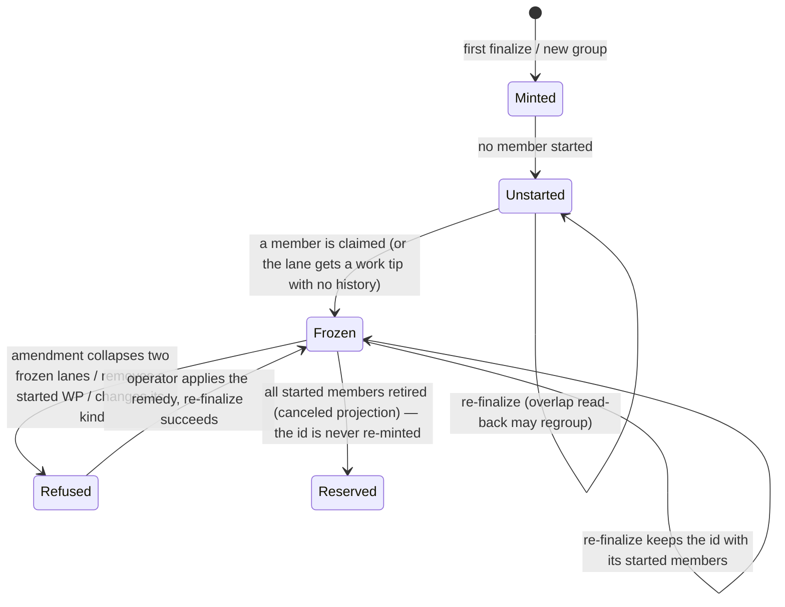

# Data model: Frozen lanes for started work packages

All types are frozen dataclasses in the pure module `src/specify_cli/lanes/frozen_membership.py`, except the error,
which lives in `lanes/compute.py` beside `LaneDependencyCycleError`.

## FrozenLaneMembership (value object)

| Field | Type | Meaning |
|---|---|---|
| `bindings` | `Mapping[str, str]` (wp_id → lane_id) | Every started WP that the previous manifest records in a lane, mapped to that recorded lane id, `lane-planning` included |
| `retired_wp_ids` | `frozenset[str]` | Present WPs that the existing cancellation projection excluded from lane inputs. A missing binding WP that is retired is leaving, not moved. |

**Invariants**
- **Empty value.** `FrozenLaneMembership.empty()` has no bindings and no retired ids. Passing it, or `None`, is
  behaviour-identical to the base commit.
- **Reserved ids.** `reserved_lane_ids` is the set of `bindings` values.

## MembershipConflict (value object)

| Field | Type | Meaning |
|---|---|---|
| `reason` | `Literal["started_lanes_collapsed", "started_wp_removed", "started_wp_kind_changed", "status_unreadable"]` | Why the frozen membership cannot be honoured |
| `wp_ids` | `tuple[str, ...]` | The started WPs involved (sorted) |
| `recorded_lanes` | `tuple[str, ...]` | Their recorded lane ids (sorted, distinct) |
| `remedy` | `str` | A reason-specific, non-destructive remedy (see the contract) |

## LaneMembershipFrozenError (LaneComputationError)

- `error_code: ClassVar[str] = "LANE_MEMBERSHIP_FROZEN"`
- `conflicts: tuple[MembershipConflict, ...]` (non-empty)
- `reason`: the first conflict reason in the precedence order `started_lanes_collapsed`, `started_wp_removed`,
  `started_wp_kind_changed`, `status_unreadable`
- `next_step: str`: the remedies joined, one per distinct reason
- the message names every conflicting WP and lane

## Started set (derived, not stored)

`started_wp_ids(events) -> frozenset[str]` (in `lanes/frozen_membership.py`):
- A WP is included iff some event for it has `to_lane ∉ {planned, blocked, canceled}`.
- It is never stored; it is recomputed from the status log on each finalize.

## Lifecycle of a lane id under re-finalize

