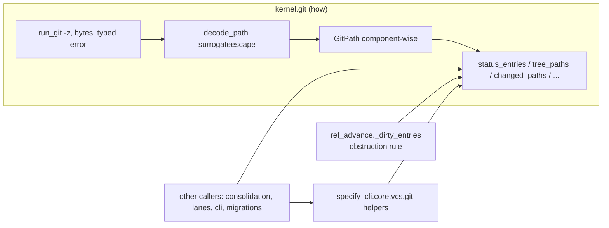

# Implementation Plan: Git paths are data, not text

**Branch**: `claude/git-path-remediation-rnrzfz` | **Date**: 2026-09-30 | **Spec**: [spec.md](spec.md)
**Input**: Mission specification from `kitty-specs/git-paths-are-data-01M3SSXR/spec.md`

## Summary

#5392 and #5400 are two symptoms of one habit: each caller builds its own git
argv, reads git's newline display text, and compares paths as strings. Git
quotes a path with a space in `status` output (`!! "src/local data/"`) but not
in `ls-tree`, so the obstruction guard compares two different spellings and
fails open (#5392); and the guard only checks one direction of containment
(#5400).

The fix splits the **how** from the **what**:

- **How — `src/kernel/git/`.** One runner (argv, cwd, env, timeout, bytes, a
  typed error), NUL-delimited (`-z`) output for every path listing, one
  lossless decode rule (UTF-8 with `surrogateescape`), a `GitPath` value type
  whose relations compare components, and typed results (`StatusEntry`,
  `NameStatusEntry`). It also hosts the intent-named listing queries
  (`status_entries`, `tree_paths`, `changed_paths`, `changed_entries`,
  `commit_paths`, `tracked_paths`, `is_tracked`) because the branch-advance
  module must import zero `specify_cli` (C-002) and every layer may use them.
- **What — callers.** Each caller states intent through those queries (or
  through the existing `specify_cli.core.vcs.git` helpers, which are re-based
  onto them and remain the specify_cli-facing query surface). Domain rules stay
  with their owners: the reset-obstruction rule stays in `ref_advance`
  (`_dirty_entries` / `reset_would_obstruct_untracked`, the single authority
  T019 already protects), now evaluated with `GitPath.overlaps`.

`ref_advance` migrates first (the P0 fix, separately landable). The remaining
path-listing call sites and the seven existing hand-written `-z` parsers
migrate by subsystem. A new architectural gate with an **empty** allowlist
closes the class. The ratchet ruling is recorded in a 4.x ADR, the charter and
the packs.

## Technical Context

**Language/Version**: Python 3.11+ (CI also runs 3.12–3.14)
**Primary Dependencies**: standard library only (`subprocess`, `dataclasses`); git ≥ 2.25 on PATH
**Storage**: N/A (reads git state; no new persisted state)
**Testing**: pytest with real temporary git repositories (no git mocks for the P0 paths); `@pytest.mark.regression` issue-pinned repros red-first per ADR 2026-07-17-1, then converted; AST gate under `tests/architectural/`
**Target Platform**: Linux, macOS, Windows (git for Windows emits UTF-8 paths with `-z`)
**Project Type**: single (existing `src/` layout, `kernel <- charter <- … <- specify_cli`)
**Performance Goals**: ≤ 1 git process per migrated call site (NFR-005); no added process on the consolidate hot path
**Constraints**: complexity ≤ 15; ruff/format/mypy clean; kernel imports nothing above it; `ref_advance` imports zero `specify_cli`; AC-F1 (`env=` threaded on merge-pipeline git calls); AC-B3 (`update-ref` only in `ref_advance`); T019 (no new porcelain-parsing predicate in the merge seam)
**Scale/Scope**: 85 regex hits at base (74 excluding `-z` and `worktree list`) across ~46 files; 7 existing `-z` parsers; ~25 sites genuinely parse paths

## Charter Check

| Charter rule | How the plan complies |
|---|---|
| Single canonical authority | One owner for git path output (`kernel/git`); the seven ad-hoc `-z` decoders and the non-`-z` parsers are folded into it, not duplicated. The obstruction rule keeps its one owner (`ref_advance._dirty_entries`). |
| Architectural alignment | The "how" sits in the kernel floor (precedent: `kernel/git_topology.py` already shells out to git), so every layer may use it without breaking the enforced chain. |
| Standing order 2 (campsite first) | WP02 first tidies `ref_advance` (extract the porcelain handling behind the kernel query) as a behaviour-preserving step before the functional fix commits. |
| Standing order 4 / ATDD / C-011 | Issue-pinned `@pytest.mark.regression` repros for #5392 and #5400 committed red on the base first, then fixed, then converted to focused unit tests. |
| Standing order 5 (gate discipline) | New gate is non-vacuous (concrete floor at base, self-mutation test) and, per Stijn's ruling, ships with an **empty** allowlist instead of a shrink-only ratchet. The charter amendment in this mission changes the order's wording to match. |
| Standing order 3 (tracers) | Three tracer files seeded under `research/`. |
| No heavy suites in mission | WPs run targeted tests plus the named gate files (`test_layer_rules.py`, `test_destructive_op_routing.py`, `test_merge_pipeline_ratchets.py`, `test_no_dead_symbols.py`, the new gate). |
| Pack tiers | Generic "a ratchet carries recurring cost; drain it" note → `packs/built-in` ratchet tactic; CI-money rationale → `packs/internal` + ADR; `spec-kitty doctrine regenerate-graph` after. |
| `__all__` convention | Every new `kernel/git` module declares `__all__`, and each exported name has a `src/` caller (dead-symbol gate). |
| No version bump | None. |

No violations to justify.

## Project Structure

### Documentation (this mission)

```
kitty-specs/git-paths-are-data-01M3SSXR/
├── plan.md
├── research.md
├── data-model.md
├── quickstart.md
├── contracts/kernel-git-api.md
├── research/            # tracer files (tooling-friction, approach, design-decisions)
└── tasks.md             # /spec-kitty.tasks
```

### Source Code (repository root)

```
src/kernel/git/
├── __init__.py          # re-exports the public surface (__all__)
├── runner.py            # run_git, GitResult, GitCommandError, decode_path
├── paths.py             # GitPath
└── listing.py           # StatusEntry, NameStatusEntry, status_entries, tree_paths,
                         # changed_paths, changed_entries, commit_paths, tracked_paths, is_tracked

src/specify_cli/git/ref_advance.py        # WP02: queries + GitPath.overlaps
src/specify_cli/core/vcs/git.py           # helpers re-based onto kernel.git
src/specify_cli/{consolidation,coordination,lanes,git,...}/  # call-site migration
tests/kernel/test_git_*.py                 # unit tests (quoted, non-ASCII, ' -> ', renames, failure)
tests/git/                                 # #5392/#5400 regression through advance_branch_ref
tests/architectural/test_git_path_listing_owner.py   # empty-allowlist gate + self-mutation
docs/adr/4.x/2026-09-30-1-allowlist-ratchets-are-priced-debt.md
```

**Structure Decision**: single project; new kernel package beside `kernel/git_topology.py` (which stays put — `test_git_topology_one_copy.py` pins it).

## Design



Key decisions (details in [research.md](research.md)):

1. **Always `-z`.** `core.quotePath=false` is not enough: `status` still quotes a path with a space. Only `-z` is lossless on every verb.
2. **One decode rule.** `bytes.decode("utf-8", "surrogateescape")` — lossless round trip, never `errors="replace"`.
3. **`GitPath.overlaps(other)`** = equal, ancestor or descendant, compared on components. The obstruction rule becomes `any(path.overlaps(t) for t in target_paths)`, which covers #5400's reverse case and makes `store` vs `storehouse` impossible to confuse.
4. **Status `-z` rename order is `XY new\0old\0`; `diff --name-status -z` is `R100\0old\0new\0`.** Each parser lives once, in `listing.py`, with tests from real git output.
5. **Fail closed.** A non-zero git exit raises `GitCommandError`; no query returns an empty result on failure. Callers that deliberately tolerate failure catch it explicitly.
6. **Gate, empty allowlist (FR-009).** An AST rule reusing the argv-token
   resolution of the destructive-op gate (T018's `argv_tokens`): outside
   `src/kernel/git/`, flag any git argv whose subcommand lists paths —
   `ls-files`, `ls-tree`, `status` (always, except `-q`/`--quiet`/`--exit-code`
   forms), and `diff`/`diff-tree`/`diff-index`/`diff-files`/`log`/`show`/
   `check-ignore`/`grep` when they carry `--name-only`, `--name-status`,
   `--porcelain*` or `-z`; and flag `split` on `" -> "`, `"\0"`, `"\x00"` or
   `b"\0"`. `worktree list` is excluded (negative control). Non-vacuity: a
   floor on files scanned, a planted-hit test that must fail, and a base count
   N > 0 recorded in the PR. T019's porcelain-literal scan becomes redundant
   and is folded into this gate (single authority); T019's function registry
   shrinks as predicates migrate.
7. **Runner is command-agnostic (C-007).** Destructive argv (`reset --hard`,
   `update-ref`, `worktree remove`) stays at its guarded sites in
   `specify_cli`; `ref_advance` keeps its own `_run_git` for those, and only its
   listing moves. A test asserts `src/kernel/git/` contains no destructive literal.
8. **Literal paths (FR-014).** Listing queries put pathspecs after `--` and
   run git with `--literal-pathspecs`; a caller that needs a glob passes
   `glob=True`.
9. **Fail-open classification (FR-013).** `git_diff_names` /
   `merge_base_changed_files` return `()` and `git_ls_tree_names_checked`
   returns `None` on failure today; each caller is classified guard (let
   `GitCommandError` propagate) vs advisory (catch at the call site with a
   rationale). The helpers keep their current return contract where an
   advisory caller depends on it, implemented as an explicit `try/except
   GitCommandError`.
10. **Out of scope.** `kernel/git_topology.py` keeps its own subprocess call
    (pinned by `test_git_topology_one_copy.py`); plain non-listing git runners
    and `worktree list` parsing go to the follow-up issue (FR-010).

## Implementation Concern Map

### IC-01 — Kernel git owner

- **Purpose**: one runner, lossless path listing, `GitPath`, typed entries and queries.
- **Relevant requirements**: FR-003, FR-004, FR-005, FR-006, FR-014, NFR-002, NFR-003, NFR-004, C-001, C-007, C-008
- **Affected surfaces**: `src/kernel/git/**`, `tests/kernel/test_git_*.py`, `src/kernel/README.md`
- **Sequencing/depends-on**: none
- **Risks**: dead-symbol gate requires every `__all__` name to have a `src/` caller — export only what migrations use. The mission ships as one PR, so WP01's callers land with it; a standalone P0 cut (C-009) prunes the exports WP02 does not call.

### IC-02 — Branch advance on the owner (P0)

- **Purpose**: fix #5392 and #5400 through the shared owner, red-first; carry PR #5437's commit and tests.
- **Relevant requirements**: FR-001, FR-002, FR-007, C-002, C-003, C-007, C-009
- **Affected surfaces**: `src/specify_cli/git/ref_advance.py`, `tests/git/`, `tests/architectural/test_destructive_op_routing.py` (T019 baseline)
- **Sequencing/depends-on**: IC-01
- **Risks**: `is_residue` and the `meta.json` VCS-lock escape consume path strings; they must receive the decoded path. Messages keep the `_RESET_OBSTRUCTION_MARKER` contract.

### IC-03 — Merge-seam call sites

- **Purpose**: migrate `core/vcs/git.py`, `consolidation/`, `coordination/`, `lanes/`, `git/` (sparse checkout, commit helpers, report transaction).
- **Relevant requirements**: FR-008, FR-013, FR-014, NFR-001, NFR-005
- **Affected surfaces**: those packages and their tests
- **Sequencing/depends-on**: IC-01
- **Risks**: AC-F1 (`env=`), T019 baseline entries move; `git_probes` leading-space `.strip()` hazard.

### IC-04 — CLI command call sites

- **Purpose**: migrate `cli/commands/**` path listings (agent tasks, mission finalize/setup-plan/record-analysis/repair, safe-commit, implement, accept, mission-type, charter bundle, coordination doctor, review dead-code).
- **Relevant requirements**: FR-008, NFR-001
- **Affected surfaces**: `src/specify_cli/cli/commands/**`
- **Sequencing/depends-on**: IC-01
- **Risks**: `tasks_move_task`'s `.strip('"')` half-decoder; large god-modules — keep edits local.

### IC-05 — Remaining call sites and existing `-z` parsers

- **Purpose**: migrate acceptance, agent_tasks_ports, bulk_edit, charter_runtime, core (mission_creation, git_preflight), migration, missions, policy, post_merge, status, task_utils, upgrade (autocommit, migrations), live_work.
- **Relevant requirements**: FR-008
- **Affected surfaces**: those modules
- **Sequencing/depends-on**: IC-01
- **Risks**: migrations are version-pinned snapshots — behaviour must stay identical.

### IC-06 — Empty-allowlist gate

- **Purpose**: close the class by construction.
- **Relevant requirements**: FR-009, SC-002, SC-003, C-009
- **Affected surfaces**: `tests/architectural/test_git_path_listing_owner.py`, `tests/architectural/test_destructive_op_routing.py` (fold T019's porcelain scan)
- **Sequencing/depends-on**: IC-02..IC-05
- **Risks**: vacuity — needs a concrete floor (counts the base offenders in a fixture copy) and a self-mutation test.

### IC-07 — Ratchet governance

- **Purpose**: record ratchets as priced debt; file the plain-runner follow-up.
- **Relevant requirements**: FR-010, FR-011, FR-012, C-005
- **Affected surfaces**: `docs/adr/4.x/`, `.kittify/charter/charter.md`, `packs/built-in/**/frozen-baseline-shrink-only-ratchet*`, `packs/internal/**`, docs index
- **Sequencing/depends-on**: none
- **Risks**: pack edits trip the manifest regen gate — run `spec-kitty doctrine regenerate-graph`.
