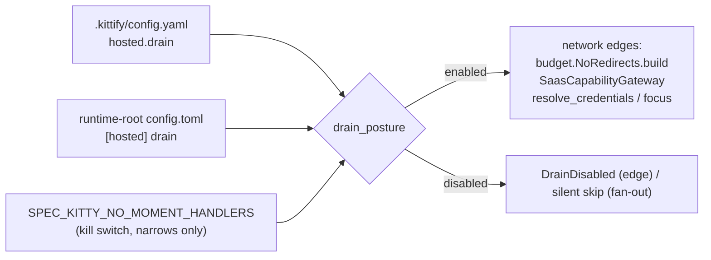

# Implementation Plan: Opt-in hosted drain and ledger flags

**Branch**: `claude/spec-kitty-mission-impl-8u6zmc` (planning base = merge target) | **Date**: 2026-09-26 | **Spec**: [spec.md](spec.md)
**Input**: Mission specification from `kitty-specs/hosted-opt-in-drain-ledger-01M3FFEV/spec.md` (issue #4971)

## Summary

Make every automatic hosted interaction opt-in and remove the shipped live endpoint.
Three independent seams:

1. **Drain posture** — a new pure reader, `specify_cli/core/hosted_posture.py`, combines the
   repository key (`.kittify/config.yaml` → `hosted.drain`) and the personal activation
   (runtime-root `config.toml` → `[hosted] drain`) into one effective boolean with provenance.
   The effective value is on only when both are on. Enforcement lives **at the network edge**
   (`zeitgeist_client/budget.NoRedirects.build` and `resolution.SaasCapabilityGateway`), so any
   relay call, present or future, is covered without extra wiring. Cheap early exits in the
   fan-out paths save threads and credential reads. An architectural test backs this up.
2. **Ledger posture** — `.kittify/config.yaml` → `ledger.projection` (default on). When on, the
   derived execution-state projection under `.kittify/derived/<mission>/` is refreshed after every
   durably persisted lane transition, using a write-free snapshot. When off, nothing is refreshed
   automatically. Lane state is never affected either way.
3. **Endpoint opt-in** — delete the packaged-default branch from the server-target resolver and
   from `get_saas_base_url`. An unconfigured machine resolves to *no target*: explicit commands
   show guidance, automatic paths stay silent. Update the retired-target migration so it drops
   the stale key instead of rewriting it. Record everything in an ADR that reverses #3980 D-5.

## Technical Context

**Language/Version**: Python 3.11+
**Primary Dependencies**: typer, rich, ruamel.yaml (`.kittify/config.yaml`), tomllib/toml (runtime-root `config.toml`), httpx and urllib (existing hosted transports; no new dependencies)
**Storage**: config files only (`.kittify/config.yaml`, runtime-root `config.toml`), plus the gitignored `.kittify/derived/<mission>/*.json`
**Testing**: pytest (unit, CLI via typer `CliRunner`, and architectural AST gates); mypy --strict; ruff + ruff format
**Target Platform**: Linux, macOS, Windows 10+ (runtime root resolved through `specify_cli.paths.get_runtime_root`)
**Project Type**: single Python CLI package (`src/specify_cli`)
**Performance Goals**: with drain off, 0 network attempts and 0 credential reads; the posture check reads at most two small files and is cached per process and repo root (NFR-003)
**Constraints**: no server change (C-001); no sync vocabulary (C-002); layering `kernel <- charter <- {runtime, mission_runtime} <- specify_cli` with no new runtime→specify_cli edge (C-004)
**Scale/Scope**: about 15 source files touched and about 20 test files re-pinned (the default-URL assertions)

## Charter Check

| Rule | Status | Notes |
|---|---|---|
| Single canonical authority (DIRECTIVE_044) | PASS | One posture reader (`core/hosted_posture.py`) and one endpoint resolver (`auth/server_target.py`). The `SPEC_KITTY_ENABLE_SAAS_SYNC` residue is **not** reused as a gate. |
| Close defect class by construction (DIRECTIVE_043) | PASS | The gate sits at the relay opener factory and the SaaS gateway. The architectural test has a concrete floor, a self-mutation check and a shrink-only allowlist. |
| ATDD-first (C-011) | PASS | Each WP opens with a failing acceptance test, committed separately. |
| Terminology canon | PASS | Mission, not feature. "Drain" is used, never "sync". |
| Credentials discipline (DIRECTIVE_050) | PASS | Guidance messages never echo tokens. |
| ADR for policy reversal | PASS | New ADR `docs/adr/3.x/2026-09-26-2-hosted-interaction-opt-in.md` (FR-014). |
| CLI↔SaaS contract file | N/A | No wire change. The CLI simply stops calling by default. |

## Design

### D1 — Drain posture (`src/specify_cli/core/hosted_posture.py`, new)



*Alt text: the repository key, the personal key and the kill switch feed one posture function.
Every hosted network edge consults it; when it is disabled the edge refuses and the fan-out
skips.*

- `DrainPosture` is a frozen dataclass: `enabled`, `repo_value`, `repo_source`, `personal_value`,
  `personal_source`, `reason` (one human sentence naming the scope that is off).
- `drain_posture(project_root: Path | None = None) -> DrainPosture`. The repo root comes from
  `locate_project_root(cwd)`. Parse errors or non-boolean values count as off, with one warning
  per file per process. The env kill switch (`moment_handlers_disabled_reason()`) forces off.
- `require_drain(context: str) -> None` raises `DrainDisabled` (subclass of `RuntimeError`,
  carrying the human line) when disabled.
- Personal activation writer: `set_personal_drain(enabled: bool)` does a load–mutate–dump of the
  runtime-root `config.toml` `[hosted]` table and preserves other tables.
- **R-1**: no environment variable can enable either scope. The personal value is read only from `get_runtime_root().base / "config.toml"` `[hosted] drain`; the repo value only from `.kittify/config.yaml` `hosted.drain`. Env narrowers (`moment_handlers_disabled_reason()`, folding `SPEC_KITTY_NO_MOMENT_HANDLERS` + `SPEC_KITTY_SYNC_DISABLE`) force off. Evaluated per call (cached per process and repo root with mtime invalidation), never frozen at import.
- **Test hook**: `SPEC_KITTY_HOSTED_DRAIN_TEST_OVERRIDE` is **not** added. Tests pin the
  posture by writing the two files under a tmp `SPEC_KITTY_HOME` plus a tmp repo, or by
  monkeypatching `drain_posture`. Keep the operator surface minimal.

### D2 — Enforcement points

| Edge | Change |
|---|---|
| `zeitgeist_client/budget.py::NoRedirects.build` (every relay HTTP opener: offer, snapshot, watch, history) | Call `require_drain("relay")` first |
| `zeitgeist_client/resolution.py::SaasCapabilityGateway.__init__` (admission + mint) | Call `require_drain("capability")` first |
| `resolution.resolve_credentials` / `resolve_focus_capability` / `resolve_focus_lease` | Return `None` when drain is off, **before the cache read** (closes the cached-credential vector) |
| `status/adapters.py` `fire_saas_fanout` / `fire_resolved_binding_fanout` / `fire_lifecycle_saas_fanout` | Early silent return when drain is off (no thread spawn) |
| runtime moments producer (`specify_cli/events/runtime_moments.py::_publish`) | The producer skips when drain is off. Nothing is added to `runtime/next/_internal_runtime/events.py` (C-004). |
| `live_work` publish/authored, retrospective live-work frames (`retrospective/lifecycle_events.py`), `live-work hook` | Covered by the budget edge. Add an early skip to avoid work. |
| Operator-typed relay commands (`zeitgeist send/reply/outbox approve/activity/read/inbox`) and MCP relay tools (`mcp_stdio.py`) | Covered by the budget/gateway edge. Each command maps `DrainDisabled` to one guidance line (R-3). |
| OAuth refresh (`auth/token_manager.py`) | Not drain-gated itself (explicit auth surface). It is reachable automatically only through the capability gateway, which is gated first. |
| CLI `zeitgeist status/watch/history`, MCP `zeitgeist_status/watch` | Catch `DrainDisabled` and print one line of guidance, exit 0 for status and 1 for watch. No traceback. |

`DrainDisabled` raised at an edge must never escape an automatic path. The fan-out wrappers
already catch `Exception` (non-raising contract), and the early exit makes the path silent.

### D3 — Ledger posture and projection

- `ledger_posture(project_root) -> LedgerPosture(enabled, source)` goes in the same module. It
  reads `.kittify/config.yaml` → `ledger.projection`, default `True`. A non-boolean value keeps
  the default and warns.
- `status/views.py::refresh_execution_projection(feature_dir, repo_root) -> bool` (new):
  - Builds the snapshot **write-free** (`reduce(read_events(...))` + identity, the same
    construction `materialize_if_stale` returns).
  - Writes `status.json` and `board-summary.json` under `.kittify/derived/<mission>/` via
    `_atomic_write_json`, plus progress and lifecycle if their generators can take a snapshot
    without writing tracked files. The implementer verifies this; otherwise only status and
    board-summary are written.
  - Skips during a git operation (`git_operation_in_progress`).
  - Never touches `kitty-specs/**/status.json`.
- Hook: `status/emit.py::_post_persist_projection(feature_dir, repo_root)` is called right before
  each `_saas_fan_out` call site (`emit.py` flat and batch; `coordination/status_transition.py`),
  **independent of the `fan_out` flag**. It is best-effort (catches and logs), and is gated on
  `ledger_posture`.
- Arch guard (FR-010): `ledger_posture` and `drain_posture` must not be referenced from
  `status/store.py`, `status/reducer.py`, `coordination/transaction.py`,
  `coordination/status_transition.py` (apart from the hook call), `decisions/` or
  `events/decision_log.py`.

### D4 — Endpoint opt-in

- `auth/config.py`:
  - `DEFAULT_HOSTED_SAAS_URL` is **renamed** `CANONICAL_HOSTED_SAAS_URL`. It remains the
    identity of the first-party host, used by `is_canonical_hosted_url` and noncanonical
    warnings, but it is no longer a fallback.
  - `get_saas_base_url()` raises `ConfigurationError` (guidance text) when neither env nor
    config names a target.
  - Rewrite the module docstring.
- `auth/server_target.py`:
  - `_classify_override` returns `OverrideMode.UNCONFIGURED, None` when neither source is set.
  - Explicit endpoint sources (R-2) are unchanged: env `SPEC_KITTY_SAAS_URL` (including `.kitty.env`), runtime-root `[sync].server_url`, and `.kittify/saas-auth.json` `saas_url` with its own token. Only the implicit packaged fallback goes.
  - `resolve_server_target()` raises `HostedEndpointUnconfigured(ConfigurationError)` with
    guidance. A `resolve_server_target_or_none()` helper is added for automatic and best-effort
    callers.
  - Remove `OverrideMode.PACKAGED_DEFAULT`.
- Callers:
  - `_auth_saas_target.py` catches the new error and prints "no hosted endpoint configured"
    (fixes the `auth status` traceback risk).
  - `_auth_login.py` shows guidance on its existing `ConfigurationError` branch.
  - `tracker/saas_client.py` construction becomes a guarded error.
  - `saas_client/auth.py`, `tracker/saas_readiness.py` and `_auth_doctor.py` already tolerate
    errors, so they only need a verification test.
- Migration `m_4_0_0_retired_hosted_target.py` (R-4: machines already rewritten keep their now-explicit value): when the value is `app.spec-kitty.ai`, **delete**
  `[sync].server_url` and record the change with guidance to configure an endpoint. Do not write
  the live default.
- The guidance text is a module constant, used ≥3× (Sonar S1192):
  `"No hosted endpoint configured. Set SPEC_KITTY_SAAS_URL or [sync].server_url in <runtime-root>/config.toml."`

### D5 — Operator surface and docs

- CLI: add `spec-kitty moments drain [on|off|status]` under the existing `moments` group, which
  already manages `[moments]` preference scopes.
  - `on`/`off` write the personal activation, and write the repo key with `--repo`.
  - `status` prints the effective posture plus both sources.
  - `spec-kitty zeitgeist status` shows the drain line first.
  - Help text covers both scopes and the "both must be on" rule.
- Docs:
  - `docs/api/configuration.md` (new `hosted:` and `ledger:` sections).
  - `docs/api/environment-variables.md` (`SPEC_KITTY_SAAS_URL` wording changes from "override
    the packaged default" to "configures the hosted endpoint").
  - `docs/context/team-kitty.md` (remove the "no client-side opt-in" claim; add a drain section).
  - `docs/changelog/CHANGELOG.md` `[Unreleased]` → Changed.
  - ADR (FR-014).

## Project Structure

### Documentation (this mission)

```
kitty-specs/hosted-opt-in-drain-ledger-01M3FFEV/
├── spec.md  plan.md  research.md  data-model.md  quickstart.md
├── contracts/hosted-posture.md
├── checklists/requirements.md
└── tasks.md + tasks/ (next step)
```

### Source Code (repository root)

```
src/specify_cli/core/hosted_posture.py            # NEW: drain + ledger posture, writer, DrainDisabled
src/specify_cli/zeitgeist_client/budget.py        # edge gate (relay opener)
src/specify_cli/zeitgeist_client/resolution.py    # edge gate (gateway) + pre-cache check
src/specify_cli/status/adapters.py                # fan-out early exits
src/specify_cli/events/runtime_moments.py         # producer skip
src/specify_cli/live_work/{publisher,authored}.py # early skip
src/specify_cli/cli/commands/{moments,zeitgeist}.py (+ zeitgeist_client/mcp_stdio.py)  # UX
src/specify_cli/status/views.py                   # refresh_execution_projection
src/specify_cli/status/emit.py, coordination/status_transition.py  # projection hook
src/specify_cli/auth/{config,server_target}.py    # endpoint opt-in
src/specify_cli/cli/commands/{_auth_saas_target,_auth_login}.py, tracker/saas_client.py
src/specify_cli/upgrade/migrations/m_4_0_0_retired_hosted_target.py
tests/architectural/test_hosted_drain_gate.py     # NEW non-vacuous gate
docs/adr/3.x/2026-09-26-2-hosted-interaction-opt-in.md, docs/api/*, docs/context/team-kitty.md, CHANGELOG
```

## Complexity Tracking

| Violation | Why Needed | Simpler Alternative Rejected Because |
|---|---|---|
| Two config homes for one flag (repo YAML + runtime-root TOML) | Operator decision D-1: repo opt-in plus personal consent | Repo-only lets one commit opt in every clone. Personal-only ignores the issue's config.yaml requirement. |

## Parallel Work Analysis

### Dependency Graph

```
WP01 posture core ──► WP02 drain enforcement (edges + fan-out + arch gate)
                  ├─► WP03 ledger projection
                  └─► WP05 operator surface + docs + ADR (needs WP02, WP04 wording)
WP04 endpoint opt-in (independent)
```

### Work Distribution

- **Sequential**: WP01 comes first, because it defines `DrainPosture`/`LedgerPosture`/`DrainDisabled`.
- **Parallel**: WP02, WP03 and WP04 own disjoint files.
- **WP05** owns the CLI/UX and docs and lands last.

### Coordination Points

- Integration test (WP02): a full 9-lane walk plus a decision round-trip with every edge
  instrumented, across {ledger on/off} × {drain on/off} (NFR-001/NFR-004).
