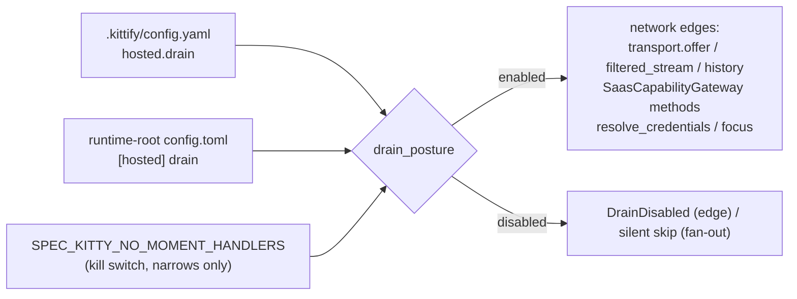

# Implementation Plan: Opt-in hosted drain and ledger flags

**Branch**: `claude/spec-kitty-mission-impl-8u6zmc` (planning base = merge target) | **Date**: 2026-09-26 | **Spec**: [spec.md](spec.md)
**Input**: Mission specification from `kitty-specs/hosted-opt-in-drain-ledger-01M3FFEV/spec.md` (issue #4971)

## Summary

Make every automatic hosted interaction opt-in and remove the shipped live endpoint.
Three independent seams:

1. **Drain posture** — a new pure reader, `specify_cli/core/hosted_posture.py`, combines the
   repository key (`.kittify/config.yaml` → `hosted.drain`) and the personal activation
   (runtime-root `config.toml` → `[hosted] drain`) into one effective boolean with provenance.
   The effective value is on only when both are on. Enforcement lives **at the network edge** —
   `transport.ZeitgeistClient.offer`, the `filtered_stream` snapshot/watch methods, `history.read_history`
   and the `SaasCapabilityGateway.check_repo_admission`/`mint_capability` methods (F-1/F-2; `budget.py`
   stays stdlib-only) — plus a pre-flight on every relay CLI command and MCP relay tool ahead of any
   credential read (D1-fold). Cheap early exits in the fan-out paths save threads and credential
   reads. An architectural test backs this up.
2. **Ledger posture** — `.kittify/config.yaml` → `ledger.projection` (default on). When on, the
   derived execution-state projection under `.kittify/derived/<mission>/` is refreshed after every
   durably persisted lane transition, using a write-free snapshot. When off, nothing is refreshed
   automatically. Lane state is never affected either way.
3. **Endpoint opt-in** — delete the packaged-default branch from the server-target resolver and
   from `get_saas_base_url`. An unconfigured machine resolves to *no target*: explicit commands
   show guidance, automatic paths stay silent. Update the retired-target migration so it drops
   the stale key instead of rewriting it. Record everything in an ADR that reverses #3980 D-5.

## Technical Context

**Language/Version**: Python 3.11+
**Primary Dependencies**: typer, rich, ruamel.yaml (`.kittify/config.yaml`), tomllib/toml (runtime-root `config.toml`), httpx and urllib (existing hosted transports; no new dependencies)
**Storage**: config files only (`.kittify/config.yaml`, runtime-root `config.toml`), plus the gitignored `.kittify/derived/<mission>/*.json`
**Testing**: pytest (unit, CLI via typer `CliRunner`, and architectural AST gates); mypy --strict; ruff + ruff format
**Target Platform**: Linux, macOS, Windows 10+ (runtime root resolved through `specify_cli.paths.get_runtime_root`)
**Project Type**: single Python CLI package (`src/specify_cli`)
**Performance Goals**: with drain off, 0 network attempts and 0 credential reads; each posture evaluation reads at most two small files, with no cache (read per call — F-7 m1 supersedes the earlier caching idea) (NFR-003)
**Constraints**: no server change (C-001); no sync vocabulary (C-002); layering `kernel <- charter <- {runtime, mission_runtime} <- specify_cli` with no new runtime→specify_cli edge (C-004)
**Scale/Scope**: about 15 source files touched and about 20 test files re-pinned (the default-URL assertions)

## Charter Check

| Rule | Status | Notes |
|---|---|---|
| Single canonical authority (DIRECTIVE_044) | PASS | One posture reader (`core/hosted_posture.py`) and one endpoint resolver (`auth/server_target.py`). The `SPEC_KITTY_ENABLE_SAAS_SYNC` residue is **not** reused as a gate. |
| Close defect class by construction (DIRECTIVE_043) | PASS | The gate sits at the relay opener factory and the SaaS gateway. The architectural test has a concrete floor, a self-mutation check and a shrink-only allowlist. |
| ATDD-first (C-011) | PASS | Each WP opens with a failing acceptance test, committed separately. |
| Terminology canon | PASS | Mission, not feature. "Drain" is used, never "sync". |
| Credentials discipline (DIRECTIVE_050) | PASS | Guidance messages never echo tokens. |
| ADR for policy reversal | PASS | New ADR `docs/adr/3.x/2026-09-26-2-hosted-interaction-opt-in.md` (FR-014). |
| CLI↔SaaS contract file | N/A | No wire change. The CLI simply stops calling by default. |

## Design

### D1 — Drain posture (`src/specify_cli/core/hosted_posture.py`, new)


```mermaid
flowchart LR
  R[".kittify/config.yaml<br/>hosted.drain"] --> P{drain_posture}
  G["runtime-root config.toml<br/>[hosted] drain"] --> P
  K["SPEC_KITTY_NO_MOMENT_HANDLERS<br/>(kill switch, narrows only)"] --> P
  P -->|enabled| E["network edges:<br/>transport.offer / filtered_stream / history<br/>SaasCapabilityGateway methods<br/>resolve_credentials / focus"]
  P -->|disabled| X["DrainDisabled (edge) / silent skip (fan-out)"]
```

*Alt text: the repository key, the personal key and the kill switch feed one posture function.
Every hosted network edge consults it; when it is disabled the edge refuses and the fan-out
skips.*

- `DrainPosture` is a frozen dataclass: `enabled`, `repo_value`, `repo_source`, `personal_value`,
  `personal_source`, `reason` (one human sentence naming the scope that is off).
- `drain_posture(project_root: Path | None = None) -> DrainPosture`. The repo root comes from
  `locate_project_root(cwd)`. Parse errors or non-boolean values count as off, with one warning
  per file per process. The env kill switch (`moment_handlers_disabled_reason()`) forces off.
- `require_drain(context: str) -> None` raises `DrainDisabled` (subclass of `RuntimeError`,
  carrying the human line) when disabled.
- Personal activation writer: `set_personal_drain(enabled: bool)` does a load–mutate–dump of the
  runtime-root `config.toml` `[hosted]` table and preserves other tables (including `[sync]`). It
  **refuses** (raises, writes nothing) when the existing file is unparseable, instead of starting
  from an empty document — that file also carries `[sync].server_url` (post-tasks fold D7).
  Repo writer: `set_repo_drain(project_root: Path, enabled: bool)`.
- **R-1**: no environment variable can enable either scope. The personal value is read only from `get_runtime_root().base / "config.toml"` `[hosted] drain`; the repo value only from `.kittify/config.yaml` `hosted.drain`. Env narrowers (`moment_handlers_disabled_reason()`, folding `SPEC_KITTY_NO_MOMENT_HANDLERS` + `SPEC_KITTY_SYNC_DISABLE`) force off. Evaluated per call with no cache (F-7 m1 supersedes the mtime-cache idea), never frozen at import. `ruamel.yaml` is imported lazily inside the repo-key reader so the hot path pays no import cost when `.kittify/config.yaml` is absent.
- **Test hook**: `SPEC_KITTY_HOSTED_DRAIN_TEST_OVERRIDE` is **not** added. Tests pin the
  posture through ONE root-level autouse fixture in `tests/conftest.py` that monkeypatches
  `specify_cli.core.hosted_posture.drain_posture` to enabled; tests that exercise the real
  reader opt out with the `real_drain_posture` marker (registered in `tests/conftest.py`'s
  `pytest_configure`, like `real_worktree_detection`), and a `drain_off` fixture forces it off
  (post-tasks fold O1; supersedes F-8's three per-directory conftests). Keep the operator
  surface minimal. Call sites must resolve `drain_posture` through the module attribute
  (`hosted_posture.drain_posture()`) or `require_drain`, never a `from … import drain_posture`
  local binding, so the fixture's patch is effective.

### D2 — Enforcement points

> Rewritten after the post-plan (F-1/F-2) and post-tasks folds; the original table (gate in
> `budget.NoRedirects.build` and `SaasCapabilityGateway.__init__`) is **superseded**.

| Edge | Change | WP |
|---|---|---|
| `zeitgeist_client/transport.py::ZeitgeistClient.offer` (control POST) | `require_drain("relay")` before `run_with_deadline`; returns new `OfferOutcome.DRAIN_DISABLED` (no thread, never `DROPPED_UNREACHABLE`). `budget.py` stays stdlib-only and untouched. | WP02 |
| `filtered_stream.FilteredStream.seed_from_snapshot` / `.watch`, `history.read_history` (stream GET ×2, history GET) | `require_drain("relay")` first statement; raise `DrainDisabled` before any opener or `credentials.load` | WP02 |
| Relay CLI commands (`zeitgeist status/watch/activity/read/inbox/send/reply/outbox approve`) and all 7 MCP relay tools (`mcp_stdio.py`) | **Pre-flight** `require_drain("relay")` as the first statement, before `subscription.resolve_stream` (which calls `credentials.load` and raises `NotCheckedOut` at `subscription.py:294`) or any authored/outbox call. CLI maps `DrainDisabled` to `DRAIN_GUIDANCE_LINE` (status exit 0, others exit 1); MCP lets it propagate as a tool error. | WP02 |
| `operability.timeout_drill`, `operability._DROPPED_OUTCOMES` | Drill reports `skipped: drain off`; `DRAIN_DISABLED` is never counted as a drop signal. | WP02 |
| `resolution.SaasCapabilityGateway.check_repo_admission` / `.mint_capability` | `require_drain("capability")` first statement; `__init__` stays ungated (`_http=` seam) | WP03 |
| `resolution.resolve_credentials` / `resolve_focus_capability` (and `resolve_focus_lease` by composition) | Return `None` before any cache/credential read, debug reason `drain-off` | WP03 |
| `status/adapters.py` `fire_saas_fanout` / `fire_resolved_binding_fanout` / `fire_lifecycle_saas_fanout` | Early silent return (no thread spawn); composes with the import-time kill switch | WP03 |
| `status/zeitgeist_bridge.py::_log_offer_outcome` | `DRAIN_DISABLED` logged at debug, never the `dropped … no retry` WARNING | WP03 |
| `events/runtime_moments.py::_publish` | Producer skips when drain is off; nothing added under `src/runtime/` (C-004) | WP03 |
| `live_work/publisher.py`, `live_work/authored.py`, `retrospective/lifecycle_events.py`, `cli/commands/live_work.py` hook | Early skip; authored send/reply refuse with the distinct `AuthoredMessageError` code `drain_off`; the bounded retry retries only an explicit retryable set, so `DRAIN_DISABLED` is never retried and never sleeps (C-005) | WP03 |
| `cli/commands/routes.py` | `drain_posture().enabled` checked before `_gateway_for`; prints `DRAIN_GUIDANCE_LINE` | WP03 |
| `widen/prereq.py::check_prereqs` (automatic probe at interview startup) | Returns an all-`False` `PrereqState` without any HTTP call when drain is off | WP03 |
| OAuth refresh (`auth/token_manager.py`) | Not drain-gated itself (explicit auth surface); reachable automatically only through the capability gateway, which is gated first. | – |

`DrainDisabled` raised at an edge must never escape an automatic path. The fan-out wrappers
already catch `Exception` (non-raising contract), and the early exit makes the path silent.

### D3 — Ledger posture and projection

- `ledger_posture(project_root) -> LedgerPosture(enabled, source)` goes in the same module. It
  reads `.kittify/config.yaml` → `ledger.projection`, default `True`. A non-boolean value keeps
  the default and warns.
- `status/views.py::refresh_execution_projection(feature_dir, repo_root) -> bool` (new):
  - Builds the snapshot **write-free** with `status.reducer.materialize_snapshot(feature_dir)`
    (`reducer.py:367` — the exact snapshot `materialize()` writes, minus the write; a bare
    `reduce(read_events(...))` lacks cancellation provenance, implementer-of-record, schema
    version and retrospective, so it would drift from `spec-kitty materialize` output — post-tasks
    fold C1).
  - Writes `status.json` and `board-summary.json` under `.kittify/derived/<mission>/` via
    `_atomic_write_json`, plus progress and lifecycle if their generators can take a snapshot
    without writing tracked files. The implementer verifies this; otherwise only status and
    board-summary are written.
  - Skips during a git operation (`git_operation_in_progress`).
  - Never touches `kitty-specs/**/status.json`.
- Hook: `status/emit.py::_post_persist_projection(feature_dir, repo_root)` is called right before
  each `_saas_fan_out` call site (`emit.py` flat and batch; `coordination/status_transition.py`),
  **independent of the `fan_out` flag**. It is best-effort (catches and logs), and is gated on
  `ledger_posture`.
- Arch guard (FR-010): `ledger_posture` and `drain_posture` must not be referenced from
  `status/store.py`, `status/reducer.py`, `coordination/transaction.py`,
  `coordination/status_transition.py` (apart from the hook call), `decisions/` or
  `events/decision_log.py`.

### D4 — Endpoint opt-in

- `auth/config.py`:
  - ~~`DEFAULT_HOSTED_SAAS_URL` is renamed `CANONICAL_HOSTED_SAAS_URL`~~ — **superseded by F-7
    (m4)**: the name is kept. It remains the identity of the first-party host, used by
    `is_canonical_hosted_url` and noncanonical warnings, but it is no longer a fallback.
  - `get_saas_base_url()` stays env-only and raises `HostedEndpointUnconfigured` (guidance text)
    when `SPEC_KITTY_SAAS_URL` is unset. `auth/http/transport.py::_targets_configured_saas` stops
    calling it and resolves through `resolve_server_target_or_none()`, so `config.toml`-configured
    users keep the stdlib-fallback path (post-tasks fold D4; this is also `_or_none`'s non-test
    caller).
  - Rewrite the module docstring.
- `auth/server_target.py`:
  - `_classify_override` returns `OverrideMode.UNCONFIGURED, None` when neither source is set.
  - Explicit endpoint sources (R-2) are unchanged: env `SPEC_KITTY_SAAS_URL` (including `.kitty.env`), runtime-root `[sync].server_url`, and `.kittify/saas-auth.json` `saas_url` with its own token. Only the implicit packaged fallback goes.
  - `resolve_server_target()` raises `HostedEndpointUnconfigured(ConfigurationError)` with
    guidance. A `resolve_server_target_or_none()` helper is added for automatic and best-effort
    callers.
  - Remove `OverrideMode.PACKAGED_DEFAULT`.
- Callers:
  - `_auth_saas_target.py` catches the new error and prints "no hosted endpoint configured"
    (fixes the `auth status` traceback risk).
  - `_auth_login.py` shows guidance on its existing `ConfigurationError` branch.
  - `tracker/saas_client.py` construction becomes a guarded error.
  - `saas_client/auth.py`, `tracker/saas_readiness.py` and `_auth_doctor.py` already tolerate
    errors, so they only need a verification test.
- Migration `m_4_0_0_retired_hosted_target.py` (R-4: machines already rewritten keep their now-explicit value): when the value is `app.spec-kitty.ai`, **delete**
  `[sync].server_url` and record the change with guidance to configure an endpoint. Do not write
  the live default.
- The guidance text is a module constant, used ≥3× (Sonar S1192):
  `"No hosted endpoint configured. Set SPEC_KITTY_SAAS_URL or [sync].server_url in <runtime-root>/config.toml."`

### D5 — Operator surface and docs

- CLI: add `spec-kitty moments drain [on|off|status]` under the existing `moments` group, which
  already manages `[moments]` preference scopes.
  - `on`/`off` write the personal activation, and write the repo key with `--repo`.
  - `status` prints the effective posture plus both sources.
  - `spec-kitty zeitgeist status` shows the drain line first.
  - Help text covers both scopes and the "both must be on" rule.
- Docs:
  - `docs/api/configuration.md` (new `hosted:` and `ledger:` sections).
  - `docs/api/environment-variables.md` (`SPEC_KITTY_SAAS_URL` wording changes from "override
    the packaged default" to "configures the hosted endpoint").
  - `docs/context/team-kitty.md` (remove the "no client-side opt-in" claim; add a drain section).
  - `docs/changelog/CHANGELOG.md` `[Unreleased]` → Changed.
  - ADR (FR-014).

## Project Structure

### Documentation (this mission)

```
kitty-specs/hosted-opt-in-drain-ledger-01M3FFEV/
├── spec.md  plan.md  research.md  data-model.md  quickstart.md
├── contracts/hosted-posture.md
├── checklists/requirements.md
└── tasks.md + tasks/ (next step)
```

### Source Code (repository root)

```
src/specify_cli/core/hosted_posture.py            # NEW: drain + ledger posture, writer, DrainDisabled
src/specify_cli/zeitgeist_client/{transport,filtered_stream,history,operability}.py  # relay edge gates (budget.py untouched, F-1)
src/specify_cli/zeitgeist_client/resolution.py    # edge gate (gateway methods) + pre-cache check
src/specify_cli/status/{adapters,zeitgeist_bridge}.py  # fan-out early exits + debug-level DRAIN_DISABLED log
src/specify_cli/widen/prereq.py                   # automatic widen probe gated
src/specify_cli/events/runtime_moments.py         # producer skip
src/specify_cli/live_work/{publisher,authored}.py # early skip
src/specify_cli/cli/commands/{moments,zeitgeist}.py (+ zeitgeist_client/mcp_stdio.py)  # UX
src/specify_cli/status/views.py                   # refresh_execution_projection
src/specify_cli/status/emit.py, coordination/status_transition.py  # projection hook
src/specify_cli/auth/{config,server_target}.py    # endpoint opt-in
src/specify_cli/cli/commands/{_auth_saas_target,_auth_login}.py, tracker/saas_client.py
src/specify_cli/auth/http/transport.py            # _targets_configured_saas via resolve_server_target_or_none
src/specify_cli/upgrade/migrations/m_4_0_0_retired_hosted_target.py (+ new m_4_0_0rc5_hosted_endpoint_session_backfill.py)
tests/conftest.py                                 # root autouse drain fixture + real_drain_posture marker
tests/architectural/test_hosted_drain_gate.py     # NEW non-vacuous gate
docs/adr/3.x/2026-09-26-2-hosted-interaction-opt-in.md, docs/api/*, docs/context/team-kitty.md, CHANGELOG
```

## Complexity Tracking

| Violation | Why Needed | Simpler Alternative Rejected Because |
|---|---|---|
| Two config homes for one flag (repo YAML + runtime-root TOML) | Operator decision D-1: repo opt-in plus personal consent | Repo-only lets one commit opt in every clone. Personal-only ignores the issue's config.yaml requirement. |

## Parallel Work Analysis

> Rewritten to match the 8-WP split in *Revised work-package split* below; the earlier 5-WP
> graph is superseded.

### Dependency Graph

```
WP01 posture core ──┬─► WP02 relay edges + relay CLI/MCP pre-flight ──┐
                    ├─► WP03 capability + fan-out + authored + widen ─┼─► WP04 arch gate + matrix
                    └─► WP05 ledger projection ───────────────────────┘      (needs WP02, WP03, WP05)
WP06 endpoint opt-in ─► WP07 migration + re-pins
WP08 operator surface + docs + ADR  (needs WP02, WP03, WP05, WP07)
```

### Work Distribution

- **Sequential**: WP01 first — it defines `DrainPosture`/`LedgerPosture`/`DrainDisabled`/`DRAIN_GUIDANCE_LINE`
  and the root test fixture.
- **Parallel**: WP02, WP03 and WP05 (after WP01) and WP06 (from the start) own disjoint files.
  WP02 does not depend on WP03: its relay CLI pre-flight refuses before any authored call (D1-fold).
  WP03 does not depend on WP02: the authored retry uses an explicit retryable set, so it never
  needs to name `OfferOutcome.DRAIN_DISABLED` (D3-fold).
- **WP04** (verification capstone) and **WP08** (operator surface, docs, ADR) land last.

### Coordination Points

- Integration test (WP04): a full 9-lane walk plus a decision round-trip with every edge
  instrumented, across {ledger on/off} × {drain on/off} on flat and coord topologies
  (NFR-001/NFR-004).

## Implementation Concern Map

| IC | Concern | Plan section | Requirements |
|---|---|---|---|
| IC-01 | Drain + ledger posture reader, writer, `DrainDisabled` | D1 | FR-001, FR-002, FR-003, FR-008, C-003 |
| IC-02 | Drain enforcement at network edges + fan-out/producer early exits | D2 | FR-004, FR-005, FR-006, NFR-001, NFR-003, C-004, C-005 |
| IC-03 | Non-vacuous architectural drain gate + FSM-integrity matrix | D2, Coordination Points | NFR-002, NFR-004 |
| IC-04 | Execution-state projection refresh (write-free) + ledger floor guard | D3 | FR-009, FR-010 |
| IC-05 | Endpoint opt-in (resolver, callers, migration) | D4 | FR-011, FR-012, FR-013 |
| IC-06 | Operator surface (moments drain CLI, zeitgeist/MCP guidance) | D5 | FR-007, FR-005 |
| IC-07 | ADR + docs + changelog | D5 | FR-014, FR-015 |

## Post-plan squad folds (2026-09-26, architect-alphonso — supersede the sections above where they conflict)

- **F-1 (M1) relay gate placement.**
  - `budget.py` stays stdlib-only; it gets no `specify_cli.core` import.
  - Gate in `transport.ZeitgeistClient.offer` **before** `run_with_deadline`. It returns a new `OfferOutcome.DRAIN_DISABLED`, so no worker thread is spawned and the result is never misclassified as `DROPPED_UNREACHABLE`.
  - Gate at the top of the `filtered_stream` snapshot/watch methods and `history` fetch (they call `NoRedirects.build()` directly); these raise `DrainDisabled`.
  - `operability.timeout_drill` reports `skipped: drain off`.
  - Relay CLI commands map `DRAIN_DISABLED` / `DrainDisabled` to the one-line guidance.
  - Cross-link: see #4737.
- **F-2 (M2) gateway gate placement.**
  - Gate inside `SaasCapabilityGateway.check_repo_admission` and `mint_capability`, not `__init__` (the `_http=` test seam stays intact).
  - `spec-kitty routes` is drain-gated as well as endpoint-gated, because it mints; it prints "Live drain is off…".
  - `resolve_credentials`/`resolve_focus_capability` return `None` before any cache read and log a distinct debug reason `drain-off` (see #4322).
- **F-3 (M3) projection hook sites.**
  - Flat path: call `refresh_execution_projection` directly next to `emit.py`'s `_saas_fan_out` sites (flat and batch).
  - Transactional path: register it as a post-commit deferred outbound (`txn.defer_outbound`), next to every `_defer_fan_out` / `queue_saas_emission` site in `coordination/status_transition.py` (enumerate all; ~5).
  - The NFR-004 test exercises the coordination transactional path.
- **F-4 (M4) single derived-view writer.**
  - Add an optional `snapshot:` parameter to `write_derived_views`, `generate_progress_json` and `generate_lifecycle_json`.
  - `refresh_execution_projection` and `materialize_if_stale` pass `status.reducer.materialize_snapshot(feature_dir)` (write-free, byte-parity with `spec-kitty materialize`; post-tasks fold C1 supersedes the earlier `reduce(read_events())` wording), so neither rewrites tracked `status.json` (campsite fix of a latent defect).
  - No new parallel builder.
- **F-5 (M5) resolver shape.**
  - `resolve_server_target()` raises `HostedEndpointUnconfigured`.
  - `resolve_server_target_or_none()` returns `ResolvedServerTarget | None`.
  - `resolved_server_url` stays `str`; there is no `UNCONFIGURED` enum member (data-model.md corrected).
  - Caller census: 14 files, including `auth/flows/{authorization_code,device_code,refresh}.py`, `auth/token_manager.py` (`resolve_token_endpoint`), `auth/http/transport.py` and `tracker/egress_verdict.py`. Each caller is classified explicit (raise → guidance) or automatic (`_or_none`).
- **F-6 (M6, operator decision D-6).** In migration `m_4_0_0_retired_hosted_target` (or a new sibling migration if it has already been applied), when no endpoint is configured and a stored session carries an `issuer_url`, backfill `[sync].server_url` from it. A prior login counts as explicit opt-in; drain stays off.
- **F-7 minors.**
  - No mtime cache: read the two small files per call (m1).
  - The new arch gate cross-references `test_egress_consent_boundary.py`, and the `resolution.py` allowlist note is updated, since drain is now a consent (m2).
  - `moments drain status` prints all four hosted-posture files.
  - The personal writer reuses a shared atomic TOML table rewrite extracted from `moments.write_agents_mode`.
  - Repo root comes from `core/paths.locate_project_root` (m3).
  - Keep the `DEFAULT_HOSTED_SAAS_URL` name. Only its fallback role goes, which reduces churn (m4).
  - Tests: `SPECIFY_REPO_ROOT` redirect and `SPEC_KITTY_HOME` not settable from `.kitty.env` (m5).
- **F-8 test harness** (per-directory placement superseded by post-tasks fold O1).
  - No autouse config writes into `SPEC_KITTY_HOME`.
  - ~~A `drain_on` autouse fixture in three per-directory conftests~~ → ONE root autouse fixture in `tests/conftest.py` monkeypatching `specify_cli.core.hosted_posture.drain_posture` to enabled, an opt-out marker `real_drain_posture` (registered in `tests/conftest.py` `pytest_configure`), and a `drain_off` fixture. Every automatic path in the whole suite (status, zeitgeist_client, live_work, runtime moments, widen, decisions) is covered, not only three directories.
  - The real default is proven with file-based tests under `canonical_home`.
  - Re-pin blast radius is ~55–60 test files.

### Revised work-package split

| WP | Scope | Depends |
|---|---|---|
| WP01 | Posture core: `core/hosted_posture.py`, shared TOML table writer, `DrainDisabled`, root test fixture | – |
| WP02 | Relay edges: `offer` + `OfferOutcome.DRAIN_DISABLED`, stream/history gates, drill, relay CLI/MCP pre-flight + guidance | WP01 |
| WP03 | Capability + fan-out: gateway methods, `resolve_*`, adapters early exits, bridge log level, runtime producer, live_work (authored `drain_off`), routes, widen prereq probe | WP01 |
| WP04 | Drain test harness + non-vacuous arch gate + NFR-001/NFR-004 integration walk | WP02, WP03, WP05 |
| WP05 | Ledger: single-writer refactor + projection refresh + hook sites + ledger-floor guard | WP01 |
| WP06 | Endpoint resolver + 14 callers (explicit vs automatic; transport via `_or_none`) | – |
| WP07 | Migration (retired target delete + D-6 backfill) + default-URL test re-pin | WP06 |
| WP08 | Operator surface (`moments drain`), ADR, docs, changelog | WP02, WP03, WP05, WP07 |

## Post-tasks squad folds (2026-09-26 — supersede the sections above where they conflict)

- **O1 test harness**: one root autouse drain fixture in `tests/conftest.py` + `real_drain_posture`
  opt-out marker + `drain_off` fixture (WP01). `tests/conftest.py` is cross-cutting, so WP01 also
  runs `tests/architectural/`.
- **C1 write-free snapshot**: `status.reducer.materialize_snapshot()` (WP05), with a parity test
  against `spec-kitty materialize` output.
- **D1 relay pre-flight**: every relay CLI command and all 7 MCP relay tools call
  `require_drain("relay")` before any credential read (WP02).
- **D2 routes**: `drain_posture().enabled` checked before `_gateway_for` (WP03) — no dead
  `except DrainDisabled` around a function that returns `None`.
- **D3 single refusal contract**: authored send/reply raise `AuthoredMessageError("drain_off", …)`;
  the authored retry only retries `THROTTLED`/`DROPPED_BUDGET`/`DROPPED_UNREACHABLE`, so a drain
  refusal is never retried and never sleeps (C-005) (WP03). `outbox approve` is local-only
  (`outbox_approval.py` makes no network call); it is refused by WP02's CLI pre-flight per R-3.
- **D4 transport**: `_targets_configured_saas` resolves through `resolve_server_target_or_none()` (WP06).
- **D5/D6 backfill**: skip retired first-party issuers; read the session store without
  `EncryptedFileStorage.read()` (which mutates); decrypt errors are a no-op; session dir byte-unchanged (WP07).
- **D7 strict personal writer**: never overwrite an unparseable runtime-root `config.toml` (WP01).
- **D8 logging**: `zeitgeist_bridge` logs `DRAIN_DISABLED` at debug (WP03); `operability` never counts it as a drop (WP02).
- **G1/G2**: D-6 + FR-016 recorded in spec.md (WP07); the widen prereq probe is automatic egress and is drain-gated (WP03).
- **S1 dead symbols**: every new public symbol has a named non-test `src/` caller (see each WP), and
  `tests/architectural/test_no_dead_symbols.py` joins every implementing WP's validation list.
- **S2 campsite-first**: functions already at C901 14–15 are extracted (behaviour-preserving, before/after recorded) before gate code lands — WP02: `filtered_stream.FilteredStream.watch` (15), `cli/commands/zeitgeist.py::watch` (14), `mcp_stdio.build_server` (14), `history.read_history` (14); WP06: `tracker/saas_client.py::_physical_request_with_retry` (15), `_auth_doctor._check_server_session` (14).
