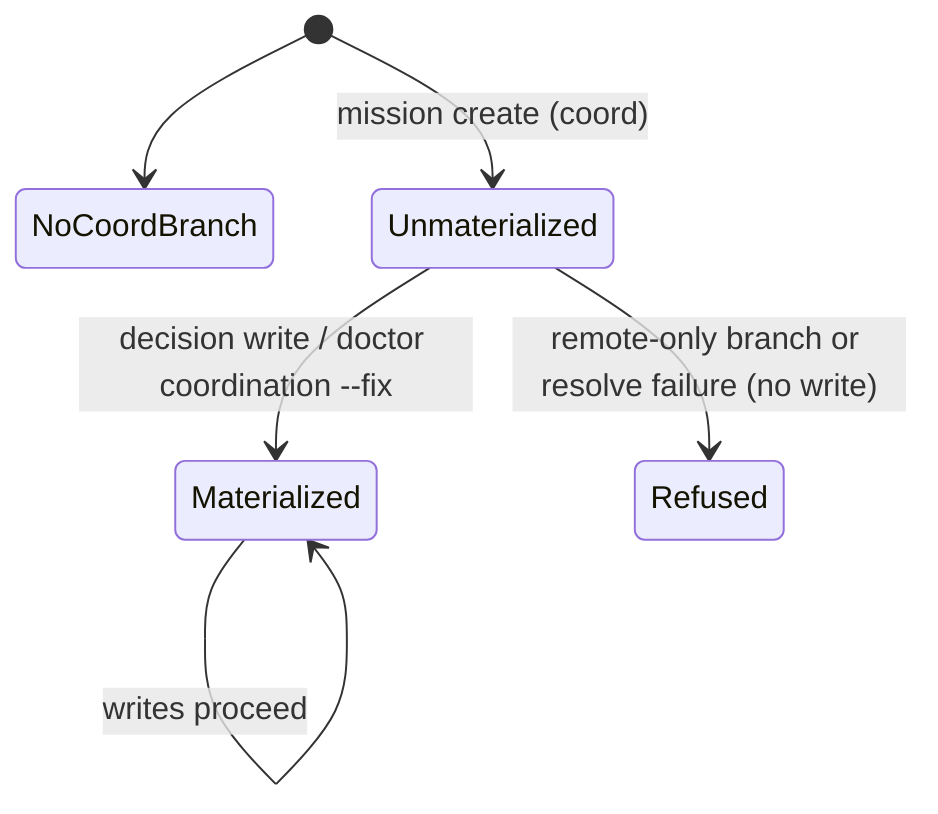

# Data Model: Lane Branch Naming Authority

No persisted schema changes (C-002). This mission changes which inputs derive existing values and adds invariants over them.

## Entities

### Lane (from `lanes.json` → `ExecutionLane`)
| Field | Source | Notes |
|---|---|---|
| `lane_id` | minted at first finalize, read back on re-finalize (FR-010, landed) | `lane-[a-z]+`; `lane-planning` is special |
| created branch | **derived**: `lane_branch_name(LanesManifest.mission_slug, lane_id)` | never persisted; the only composable form |
| created worktree | **derived**: `worktree_path(repo_root, LanesManifest.mission_slug, lane_id=…)` | dir name = verbatim `<slug>-<lane_id>` |

**Invariants**
- I-1: The created branch/worktree of a lane depends only on `(mission_slug, lane_id)` — never on `mission_id`.
- I-2: Every consumer obtains the created name from the naming authority; no consumer composes or probes.
- I-3: `lane-planning` resolves to the planning base branch (unchanged).

### LanesManifest (`lanes.json`)
| Field | Change |
|---|---|
| `mission_slug` | unchanged; the naming key for lanes |
| `mission_id` | unchanged; **not** an input to lane naming |
| `mission_branch` | **preserved across re-finalize** (FR-011): `previous.mission_branch` wins over the recomputed value; first finalize unchanged |

### MergeState.pre_interrupt_lane_tips (`state.json`)
- Keyed by the lane's **created branch name** (FR-004).
- Captured only on coordination topology (with `pre_mutation_coord_sha`).
- **Resume invariant (FR-005)**: if `coord_topology and pre_mutation_coord_sha`, every non-planning lane that is not fully canceled must have a tip under its created branch name; otherwise refuse naming `spec-kitty merge --abort`.

### ApprovedWpCommitSet (reconciliation claim)
- New refusal arm (FR-003): an approved, non-planning, non-canceled lane whose created branch does not exist → `refusal = "approved lane <id>: created branch '<branch>' does not exist …"` (never an empty commit set).

### Decision ledger (FR-013)
- Write sequence for `open` / `resolve` / `defer` / `cancel`: (1) materialize coordination surface if UNMATERIALIZED (local branch) — refuse if remote-only or materialization fails; (2) pre-resolve ledger + events targets; (3) write ledger; (4) emit event. Failure in (1)–(2) leaves all files byte-identical.
- Partition of each file unchanged (C-006). Read paths never materialize.

## State: coordination surface (as seen by decision writes)

