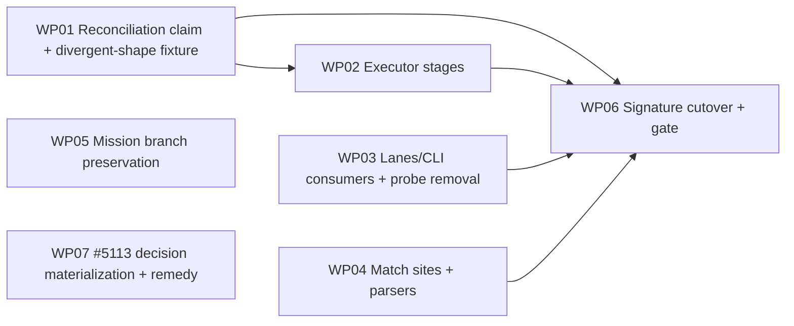

# Implementation Plan: Lane Branch Naming Authority

**Branch**: planning `claude/charter-load-mission-q9ajcz` → merge target `claude/charter-load-mission-q9ajcz` (coordination `kitty/mission-lane-branch-naming-authority-01M3EVC4`) | **Date**: 2026-09-26 | **Spec**: [spec.md](spec.md)
**Input**: Mission specification from `kitty-specs/lane-branch-naming-authority-01M3EVC4/spec.md` (rev 2). Research: [research.md](research.md).

## Summary

Lane branches and worktrees are **created** from the Mission slug + lane id only (`lanes/worktree_allocator.py::predict_lane_worktree`). Six read sites re-derive the name *with* the Mission identity (reconciliation claim, pre-interrupt tip capture, safety preflight, cleanup residue scan, `lifecycle_sync` probe, acceptance source roots), so any Mission whose slug-derived and identity-derived names differ is refused at merge (#5108). The fix removes the identity parameter from the public lane-naming surface (`lane_branch_name`, `worktree_dir_name`, `worktree_path`) so the created name is the only name that can be composed; routes every compose and match site through `lanes/branch_naming.py` (new parsers for worktree dirs; `is_lane_branch` accepts the plain-legacy grammar); arms the resume guard (tips keyed by created name; refuse on an unanchored record); preserves the recorded Mission branch across re-finalize; and adds a non-vacuous architectural gate. Independently, `decision open`/`resolve`/`defer`/`cancel` materialize an absent coordination worktree before any write, and the unmaterialized-coordination remedy names a command that actually materializes it (#5113).

## Technical Context

**Language/Version**: Python 3.11+
**Primary Dependencies**: typer, rich, ruamel.yaml (existing); git CLI via existing `lanes/_git.py` / `git/git_probes.py` helpers. No dependency added, upgraded or removed (supply-chain review: not applicable).
**Storage**: Files — `kitty-specs/<mission>/lanes.json` (schema unchanged, C-002), `.kittify/runtime/merge/<id>/state.json` (`MergeState.pre_interrupt_lane_tips`, schema unchanged), decision ledger `decisions/index.json` + `DM-*.md`, `status.events.jsonl`.
**Testing**: pytest (+ pytest-xdist `--dist loadfile`), real temporary git repositories for merge/decision fixtures (no git mocks for the red-first cases), pytestarch/AST architectural gates under `tests/architectural/`.
**Target Platform**: Spec Kitty CLI on Linux/macOS/Windows (path handling via `pathlib`).
**Project Type**: single (existing `src/` packages).
**Performance Goals**: No measurable regression: one extra `git rev-parse --verify` per approved lane in the reconciliation claim (FR-003 existence check); materialization happens at most once per fresh coordination Mission.
**Constraints**: C901 ≤ 15 on every touched function (NFR-002); `compute_lanes` (CC34) and `backfill_ownership` (CC24) are behind `ruff.toml` per-file ignores and are **not edited**; layer direction `kernel <- charter <- {glossary, runtime, mission_runtime} <- specify_cli` unchanged (C-003); no probing (C-004); decision-ledger partitions unchanged (C-006).
**Scale/Scope**: ~30 source call sites across ~25 modules; ~61 test call sites across 18 test files migrate; 7 work packages.

## Charter Check

| Charter rule | Status |
|---|---|
| Single canonical authority | ✅ The existing creation-side authority is extended; identity-aware lane composition is removed, not wrapped. |
| Architectural alignment / layers | ✅ All changes stay in `specify_cli`; no new cross-layer import. `decisions` → `coordination` import is intra-package, function-local (cold-import boundary). |
| DDD + tiered rigour | ✅ Merge/reconciliation (core integrity) gets real-git red-first tests per divergent shape; mechanical kwarg drops rely on the gate + existing suites. |
| ATDD-first / red-first (DIRECTIVE_034/041) | ✅ Every diverging site gets a red-first test through its pre-existing entry point; `TestPlanningArtifactReachesTarget` (red on HEAD) must go green with its fixture unedited. |
| Close defect class by construction (DIRECTIVE_043) | ✅ Signature removal + compose/match gate with recorded baseline, shrink-only allow-list, self-mutation test. |
| Canonical sources (DIRECTIVE_044) | ✅ Reuse `CoordinationWorkspace.resolve`, `_coordination_doctor` fixer dispatch, `_ratchet_keys.composite_key`. |
| Campsite / tidy-first (DIRECTIVE_025) | ✅ Behaviour-preserving extractions precede functional change inside each WP (see Complexity Tracking). |
| Terminology canon | ✅ Mission (never feature) in new code/prose; terminology guard run before push. |
| Test policy | ✅ Per-WP targeted suites + owning subsystem dirs + `make test-fast`; `tests/architectural/` in full for WP06 (new gate). |

No violations requiring justification.

## Design Decisions (see research.md for rationale/alternatives)

- **PD-1 Authority API.** `predict_lane_worktree(repo_root, mission_slug, lane_id)` remains the placement decision. Public lane grammar becomes `lane_branch_name(mission_slug, lane_id, planning_base_branch=None)`, `worktree_dir_name(mission_slug, *, lane_id)`, `worktree_path(repo_root, mission_slug, *, lane_id)` — bodies = today's `mission_id is None` branches, byte-identical. `mission_branch_name`/`coord_branch_name`/`resolve_branch_name` keep `mission_id` (Mission/coordination naming, not lanes).
- **PD-2 Slug key.** `LanesManifest.mission_slug` (= `kitty-specs/<dir>` = `meta.json.mission_slug`; stable across backfill). Executor sites unify on it via a private `_created_lane_branch(run, lane_id)`.
- **PD-3 Golden reading of NFR-001** (operator-intent adjudication). "Every golden that describes a *created* name is byte-unchanged." Lane/worktree golden columns that encode identity-injected names creation never produces (`test_branch_naming_ssot_entrypoint.py` `_PARITY_CASES` rows 1, 2, 5; `test_branch_naming_seam.py` `GOLDEN_ROWS["legacy-NNN-with-mid8-1589"]` lane/worktree columns; lane cases in `tests/core/test_branch_naming_human_slug.py`) pin the defect: they are re-pinned to the created name, with new rows asserting divergent shapes compose the created name. Mission-branch, coordination and mission-dir columns are unchanged. (Charter #4: judge the test — stale → re-pin.)
- **PD-4 FR-005 scope.** The unanchored-record refusal applies where tips are captured and persisted: coordination topology with a persisted `pre_mutation_coord_sha`. Non-coordination Missions never persist tips and are unaffected.
- **PD-5 FR-003 refusal.** `build_approved_wp_set` checks each approved, non-planning, non-canceled lane's created branch exists (`lanes/_git.branch_exists`) and refuses naming it; `_lane_tip_commits`/spine stay tolerant only on the canceled axis.
- **PD-6 FR-011.** Preserve `previous_lanes.mission_branch` in `compute_and_write_lanes` (`lanes/compute_and_persist.py`, CC2) via `_preserved_mission_branch`; `compute_lanes` untouched. Also fold `status/aggregate.py:751` (prefers manifest `mission_branch` before recomposing) — same defect class, one line.
- **PD-7 Match sites (FR-008).** New additive parsers in `branch_naming.py`: `parse_lane_worktree_dir(name) -> (slug, lane_id) | None` and `lane_id_for_worktree_dir(name, mission_slug) -> lane_id | None` (recognition by recomposition). `is_lane_branch` accepts the plain-legacy grammar. Sites: `git/sparse_checkout.py:229` (+ hand-rolled compose `:236`), `cli/commands/_coordination_doctor.py:774`, `status/doctor.py:287`, `live_work/bindings.py:40`, `policy/commit_guard.py:40`, plus folded extras `merge/resolve.py:44` (redundant regex, delete) and `core/vcs/detection.py:159`. Parsers accept `lane-[a-z]+`.
- **PD-8 Acceptance site.** `acceptance/__init__.py:770` (`_approved_lane_source_roots`) — an additional divergent site found in research — folded into FR-006.
- **PD-9 #5113 (FR-013).** New `coordination/surface_resolver.py::materialize_coord_surface_for_write(repo_root, mission_slug)` (UNMATERIALIZED + local branch → `CoordinationWorkspace.resolve`; remote-only → refuse before write; resolve failure → `CoordinationWorktreeUnmaterialized`). Called (function-local import) in `decisions/service.py` `open_decision` (after dry-run return, before ledger lock) and `_terminal_command` (before `_apply_terminal_under_lock`); events path pre-resolved at both sites. Read paths (`list`, `verify`) never materialize. CLI verbs render `StatusReadPathNotFound` as structured JSON (no new `DecisionErrorCode`).
- **PD-10 #5113 (FR-014).** `spec-kitty doctor coordination --mission <slug> --fix` gains a missing-worktree fixer (`COORDINATION_WORKTREE_MISSING`); every emitter of the unmaterialized-coordination remedy names it: `coordination/surface_resolver.py:133,323-332`, `runtime/next/runtime_bridge.py:2965`, `mission_runtime/write_target_degrade.py:241`, `cli/commands/implement_cores.py:703`, `cli/commands/implement.py:1088`, `cli/commands/agent/mission_record_analysis.py:148`. Pinned text ("materializ", no "flatten") preserved.

## Gate Baseline (NFR-003, measured at mission start, `src/specify_cli`, naming module excluded)

| Idiom | Count at start | Target at close |
|---|---|---|
| Lane-naming calls passing `mission_id` (non-None) | 6 | 0 (impossible after PD-1) |
| Lane-naming calls passing `mission_id=None` | 18 | 0 (impossible after PD-1) |
| Hand-rolled lane-name compose (f-string/concat) | 1 (`git/sparse_checkout.py:236`) | 0 |
| Lane-name match sites outside the naming module | 7 | 0 |
| Allow-listed (spec-excluded) sites | 5 (recovery enumeration `lanes/recovery.py:136`; prose `lanes/stale_check.py:118`, `context.py:101`, `coordination/workspace.py:126`, `coordination/policy.py:189`) | ≤ 5 |
| Existing `test_no_worktree_name_guess.py` `_NAME_COMPOSE_BASELINE_RAW_MATCHES` | 5 | 4 (after `detection.py:159`) |

## Project Structure

### Documentation (this mission)

```
kitty-specs/lane-branch-naming-authority-01M3EVC4/
├── spec.md  plan.md  research.md  data-model.md  quickstart.md
├── checklists/requirements.md
├── decisions/            # Decision Moments
├── traces/               # tracer files (friction / approach / design-decisions)
└── tasks/                # /spec-kitty.tasks output
```

### Source Code (repository root)

```
src/specify_cli/
├── lanes/        branch_naming.py (authority grammar + parsers), worktree_allocator.py,
│                 compute_and_persist.py, lifecycle_sync.py, merge.py, recovery.py, implement_support.py
├── merge/        reconciliation.py, executor.py, resolve.py
├── decisions/    service.py (materialize-before-write)
├── coordination/ surface_resolver.py, status_transition.py
├── cli/commands/ decision.py, _coordination_doctor.py, doctor.py, mission_type.py, implement*.py,
│                 agent/tasks_parsing_validation.py, agent/mission_record_analysis.py
├── acceptance/__init__.py, workspace/context.py, context/resolver.py, core/worktree_topology.py,
│   core/vcs/detection.py, git/sparse_checkout.py, status/doctor.py, status/aggregate.py,
│   live_work/bindings.py, policy/commit_guard.py, orchestrator_api/commands.py, migration/backfill_ownership.py
src/runtime/next/runtime_bridge.py; src/mission_runtime/write_target_degrade.py  (remedy text only)
tests/merge/ tests/lanes/ tests/specify_cli/lanes/ tests/core/ tests/integration/ tests/terminus/
tests/specify_cli/cli/commands/ tests/coordination/ tests/architectural/
```

**Structure Decision**: existing single-project layout; no new packages. New test modules: `tests/merge/_divergent_shapes.py` (shared real-allocator fixture builder), `tests/merge/test_reconciliation_divergent.py`, `tests/merge/test_executor_lane_naming.py`, `tests/specify_cli/lanes/test_lane_naming_parsers.py`, `tests/lanes/test_refinalize_mission_branch.py`, `tests/specify_cli/cli/commands/test_decision_fresh_coord_5113.py`, `tests/architectural/test_lane_naming_authority_gate.py`.

## Complexity Tracking

| Function | CC now | Plan |
|---|---|---|
| `merge/executor.py::_phase_cleanup_worktrees_and_branches` | 10 | tidy-first: extract `_remove_lane_worktrees`, `_delete_lane_branches` (→ ~4) |
| `cli/commands/_coordination_doctor.py::_check_lane_sparse_checkout_drift` | 10 | parser swap only; stays ≤ 10 |
| `merge/executor.py::_enforce_resume_anchor_integrity` | 5 | + `_unanchored_lane_branches` helper (→ ~6) |
| `lanes/compute.py::compute_lanes` | 34 (ignored) | **not edited** (PD-6) |
| `migration/backfill_ownership.py::backfill_ownership` | 24 (ignored) | only the already-correct call at L148 is left as is; not edited |
| all other touched functions | ≤ 8 | unchanged ceiling |

## Parallel Work Analysis

### Dependency Graph



### Work Distribution

- **WP01** Reconciliation claim (FR-003, FR-012) — `merge/reconciliation.py`, divergent-shape fixture.
- **WP02** Executor stages (FR-004, FR-005, FR-006 executor, SC-001/002 end-to-end) — `merge/executor.py`.
- **WP03** Lanes + CLI consumers (FR-006 rest incl. acceptance, FR-007).
- **WP04** Match sites + parsers (FR-008) — additive in `branch_naming.py`.
- **WP05** Mission branch (FR-011, FR-010 re-verify) — `lanes/compute_and_persist.py`, `status/aggregate.py`.
- **WP06** Signature cutover + gate (FR-002, FR-009) — `branch_naming.py` removal, allocator, test migration, gates.
- **WP07** #5113 (FR-013, FR-014) — decisions + coordination doctor + remedy text.

Parallel: {WP01, WP03, WP04, WP05, WP07} → WP02 → WP06.

### Coordination Points

- WP04 (additive parsers) and WP06 (signature removal) both touch `lanes/branch_naming.py`: serialized by dependency.
- WP01–WP04 drop `mission_id=None` kwargs in their own files (legal before cutover); WP06 owns only the seam, the allocator, tests and gates.
- `surface_resolver.py` is owned solely by WP07.

## Risks

1. Invalid-identity shapes may still fail at non-naming merge steps that read `mission_id` (post-fix marker, baseline id); the WP02 end-to-end test (SC-001, 4/4) is the proof — any such failure is folded into WP02.
2. Behaviour changes inside "re-routes" (sparse-checkout expected branch for `NNN-` coordination Missions, live-work binding by slug, `is_lane_branch` accepting plain-legacy) each get a named test.
3. Test churn (~61 call sites): fixtures composing names with an identity move to allocator-built fixtures, not kwarg deletion (FR-012).
4. Concurrent materialization (WP07): `CoordinationWorkspace.resolve` uses an in-process lock; re-probe once after a failed `git worktree add`.
5. Follow-ups to file at close-out (not in scope): recovery enumeration prefix over-match (`lanes/recovery.py:136`); review-workspace second lane-creation path (`cli/commands/agent/workflow.py:1691`, naming-compliant); `migration/mission_state.py:1621` rebuild without prior manifest; lane-id grammar past 26 lanes.
