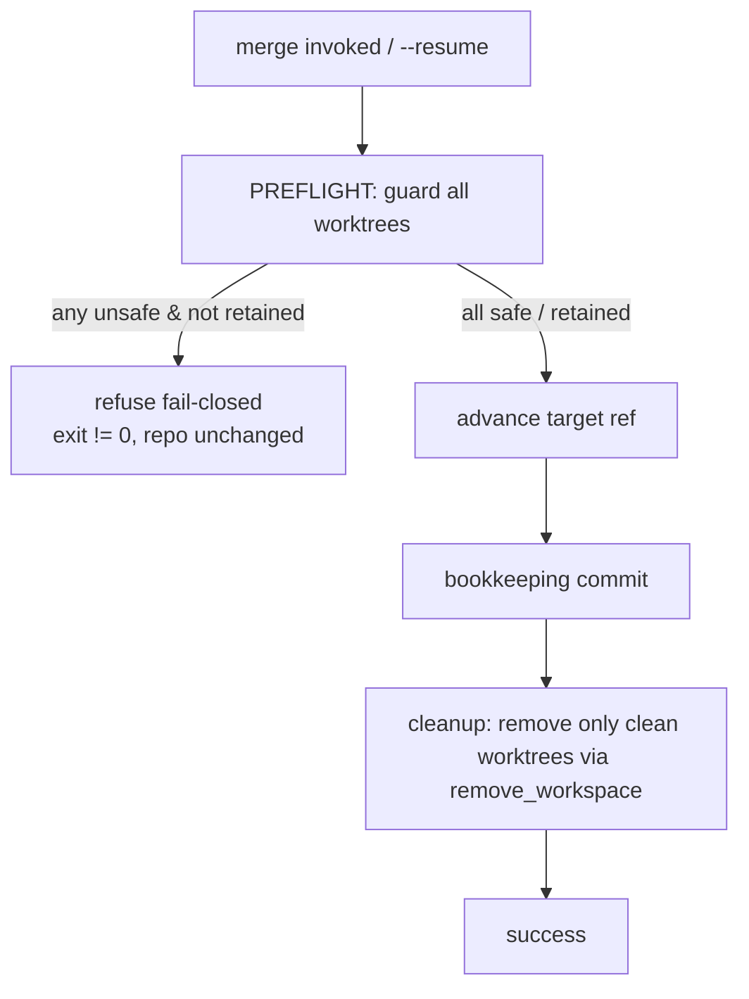

# Phase 1 Data Model — Merge/Git Destructive-Operation Safety

No persistent datastore. The "entities" are the in-memory guard primitive, its
typed refusal, and the safety invariants they enforce.

## Entity: `DestructiveOpRefused` (new typed exception)

- **Represents**: a pre-mutation refusal to run a destructive git op because a
  target checkout/worktree is off-target or dirty.
- **Modeled on**: `git.ref_advance.RefAdvanceDirtyWorktreeError`
  (`error_code`, human message, remediation text). Do NOT reuse
  `SafeCommitHeadMismatch` (C-002).
- **Fields**: `error_code` (e.g. `MERGE_UNSAFE_PRIMARY_OFF_TARGET`,
  `MERGE_UNSAFE_PRIMARY_DIRTY`, `MERGE_UNSAFE_WORKTREE_DIRTY`), `worktree_path`,
  `current_branch` / `expected_branch` (branch case), `dirty_entries` (list),
  `remediation` (actionable next step incl. `--resume` note).
- **Invariant**: raised BEFORE any ref advance or destructive command (NFR-001).

## Entity: refuse-before-destroy guard (new, `git/destructive_guard.py`)

Two pure, plumbing-level checks (no `specify_cli` import; caller injects the churn
classifier — C-005):

- `assert_checkout_on_target(repo_root, expected_branch) -> None`
  - Reuses the logic of `merge/preflight._enforce_planning_artifact_target_branch`
    (`git rev-parse --abbrev-ref HEAD`); raises `DestructiveOpRefused` when
    `current != expected`.
- `assert_worktree_clean(worktree, *, new_sha=None, is_residue) -> None`
  - Reuses `ref_advance._dirty_entries` (residue-aware, `--ignored`,
    tree-obstruction, meta-lock exemption) with the injected `is_residue`
    classifier; raises `DestructiveOpRefused` with the dirty entries when non-empty.
- `guarded_worktree_remove(worktree, *, retain, is_residue) -> RemoveResult`
  - The shared removal chokepoint (NOT the dead `core/vcs/git.py remove_workspace`):
    asserts clean unless `retain`; removes clean/retained-clean worktrees; keeps a
    retain+dirty worktree; raises `DestructiveOpRefused` on dirty+no-retain. The
    single authority every live destroy site (executor lane cleanup, coordination
    teardown + stale-prune, orchestrator cleanup) calls.

## Value: guard decision (per worktree)

| Input | Condition | Outcome |
|-------|-----------|---------|
| primary checkout | off target branch | refuse (US1 AC1) |
| primary checkout | on target, tracked-dirty (non-residue) | refuse (US1 AC2) |
| primary checkout | on target, clean or residue-only | proceed (US1 AC3, NFR-003) |
| lane worktree | dirty, no retention | refuse fail-closed (US2 AC1) |
| lane worktree | dirty, retention in effect | retain, do not remove (US2 AC2) |
| lane worktree | clean | remove as today (US2 AC3) |
| coord worktree | dirty | refuse + hold coupled triple teardown (US2 AC4, FR-004) |
| scratch workspace | any | always remove unconditionally (C-006, out of scope) |

## Invariants

- **INV-1 Pre-mutation atomicity (NFR-001)**: on refusal, the destructive call site
  (`reset --hard`, `worktree remove --force`, `git merge --abort`) is never
  reached; repo state byte-identical to pre-invocation.
- **INV-2 Coord-triple coupling (FR-004, CLAUDE.md #3131)**:
  `teardown_coordination = delete_branch AND remove_worktree AND clear_marker` — a
  guard refusal on the coord worktree holds back all three.
- **INV-3 Single authority (FR-007, NFR-006)**: the three destructive commands are
  invoked only behind the guard / `remove_workspace` chokepoint; no new parallel
  dirty predicate is introduced.
- **INV-4 Residue honesty (NFR-003)**: a `meta.json` diff limited to the VCS-lock
  stamp never triggers refusal.
- **INV-5 Abort scope (FR-005)**: `git merge --abort` runs only when active
  spec-kitty merge state exists, scoped to the spec-kitty merge workspace, never the
  bare `repo_root`.

## State transition (merge, guarded)

