# Data Model: Merge-seam placement, test-isolation sweep & model-slot verdict

No persistent product data changes. The entities below are code-level value objects and test-gate records.

## Merge domain (#5119)

| Entity | Fields | Invariants |
|---|---|---|
| `MergeDriverOutcome` (frozen dataclass) | `notice: str \| None` | Produced only by a body; never carries an exit code. |
| `MergeDriverError` (exception) | message = `str(exc)` | Wraps foreign errors with `from exc`; message text is what stderr prints. |
| `MergeDriverBody` (callable) | `(base: str, ours: str, theirs: str) -> MergeDriverOutcome` | Writes the reconciled result to `ours`; never exits the process; never imports `specify_cli.cli`. |
| `MERGE_DRIVER_BODIES` (mapping) | command name → body | Keys == `_MERGE_DRIVERS`-derived command names == `merge-driver-*` registrars (6). |
| Golden case | `O`, `A`, `B`, `expected_A`, `case.json{exit_code, stdout, stderr, absent}` | Captured pre-move; post-move diff over the goldens dir is empty. |

## Census gate (#5118)

| Entity | Fields | Invariants |
|---|---|---|
| Site | `file`, `qualname`, `kind`, `lineno` (display only), `token_line` (display only) | Detected in test code only; excludes SPEC_KITTY_HOME writes owned by `_home_pin_scan` and `patch.dict` calls. |
| Key | `(file, qualname, kind)` | No line numbers. |
| Allowlist row | key + `count` + `class` + `reason` | `count` == actual site count for the key; `reason` non-empty for non-transitional classes. |
| Shard | `S1..S8` \| `deferred-01M3EW3Z` | Permanent; owns a fixed file set (`research/sweep_shards.tsv`); its `transitional-sweep` rows are drained by its sweep WP, justified rows stay. |
| Justification class | `transitional-sweep`, `process-bootstrap`, `subprocess-entry`, `leak-sentinel`, `deferred-01M3EW3Z` | After Seal: `transitional-sweep` forbidden; each other class capped (6 / 13 / 2 / 16). |

### Lifecycle

```mermaid
stateDiagram-v2
  [*] --> Red: WP01-A gate + empty allowlist (471 unallowlisted)
  Red --> Green_transitional: WP01-B shards S1..S8 + deferred-01M3EW3Z.yaml
  Green_transitional --> Green_transitional: sweep WP drains its shard's transitional rows
  Green_transitional --> Sealed: Seal test (no transitional rows; caps frozen)
```

## Agent profile (#5117)

| Entity | Field | Invariants |
|---|---|---|
| `AgentProfileSchema.preferred_model` (`schema_models.py`) | YAML key `model`, `str \| None`, description = consumer-authored routing preference | Generated YAML schema agrees (`generate_schemas.py --check`). Built-in profiles do not set it. |
| Routing recommendation candidate | provenance = profile, `model_id` = authored `model` | Reached from a profile YAML on disk via the profile repository and `invocation.executor._compute_recommendation`. |
