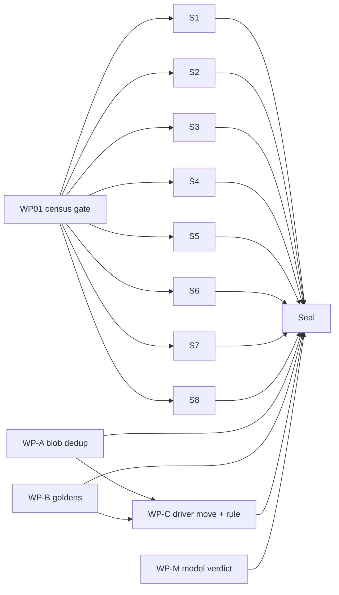

# Implementation Plan: Merge-seam placement, test-isolation sweep & model-slot verdict

**Branch**: `issue-5119-merge-seam-test-isolation` | **Date**: 2026-09-26 | **Spec**: [spec.md](spec.md)
**Input**: Mission specification from `kitty-specs/merge-seam-test-isolation-campsite-01M3F61E/spec.md`

## Summary

Three tech-debt slices, each closed by a non-vacuous guard:

1. **#5119 merge seam** — one raw git blob reader in the merge domain; the file-level bodies of all six registered merge drivers move from `cli/commands/merge_driver.py` into a new `specify_cli/merge/drivers.py` so git's subprocess path and the merge integrity gate's in-process replay execute the same body; the CLI module becomes a thin shell; the layer-rules collector gains a merge → `specify_cli.cli.commands` rule (red-first). Behavior is pinned by pre-move golden characterisation.
2. **#5118 test isolation** — a local AST census gate over every `*.py` under `tests/` (471 manual global-state mutation sites today) lands red-first, then green over a sharded transitional allowlist; eight directory-cohesive sweep WPs convert sites to scoped patching facilities and drain their own shard; a seal WP freezes ≤ 37 justified sites under per-class caps.
3. **#5117 `model` slot** — keep-verdict recorded in the schema's canonical source (Pydantic `schema_models.py`, YAML regenerated) and pinned by a disk → repository → dispatch-advisory test with a mutation proof.

Research: [research.md](research.md) (R1–R9).

## Technical Context

**Language/Version**: Python 3.11+ (repo floor); no new syntax beyond 3.11 (`contextlib.chdir` is 3.11+).
**Primary Dependencies**: existing only — typer (CLI shell), pydantic v2 (schema models), pytest (+ xdist, `monkeypatch`), stdlib `ast`/`contextlib`/`unittest.mock`. No dependency added, upgraded or removed.
**Storage**: files — golden fixtures under `tests/merge/merge_driver_goldens/`; YAML allowlist shards under `tests/architectural/global_state_allowlist/`; generated `src/charter/offering/schemas/agent-profile.schema.yaml`.
**Testing**: pytest; red-first per ADR 2026-07-17-1; `make test-fast` baseline + blast radius per CLAUDE.md test policy; full `tests/architectural/` for WP-C (moves a scanned directory), WP01/seal (new architectural gate), and S8 (root `conftest.py`, cross-cutting); junit-xml before/after per sweep WP (NFR-002).
**Target Platform**: Linux/macOS/Windows developer machines and GitHub Actions (lean modular CI, `--dist loadfile`).
**Project Type**: single project (`src/` + `tests/`).
**Performance Goals**: census gate < 10 s over the full `tests/` tree (prototype 3.9 s); merge-driver import cost unchanged (±5%).
**Constraints**: C-001 subprocess contract/registry unchanged; C-002 no ratchet-mission (`01M3EW3Z`) file edits except the approved `test_inline_meta_read_gate.py` re-pin; C-005 sweep touches test code/config only; no `__init__.py` edits (version-bump rule); complexity ≤ 15; zero new suppressions.
**Scale/Scope**: ~950 moved lines (merge drivers); 471 sites / 155 test files; 14 WPs.

## Charter Check

*GATE: passed before Phase 0; re-checked after Phase 1 design — no violations.*

| Charter rule | How this plan complies |
|---|---|
| Single canonical authority | One blob reader; one driver body per kind shared by subprocess + replay; the merge→CLI rule extends the existing layer-rules collector (no bespoke guard); census reuses `specify_cli.contracts.anchoring` and `_home_pin_scan`; `model` verdict owned by `schema_models.py`. |
| Architectural alignment | Removes the merge-domain → CLI-command-layer upward edge; `cli.console` recorded as a named shrink-only ledger. |
| ATDD / red-first (SO #4) | Layer rule and census gate commit RED through their entry points first; goldens captured green before the move; `model` chain uses a mutation proof (behavior already works). |
| Non-vacuous gates (SO #5) | Self-mutation tests for both gates (all import forms; aliased census forms); scanned-files floor ≥ 3000; exact-count allowlist rows fail on under- and over-count; completeness test for the driver table. |
| Campsite / tidy-first (SO #2) | WP-A dedup and WP-B characterisation precede the functional move; stale docstrings refreshed in touched files only. |
| Tracer files (SO #3) | Seeded at planning (`tracer-*.md`); appended during implement. |
| Mission hygiene (SO #8) | Issues #5119/#5118/#5117 claimed + assigned; matrix rows at tasks; reviewer ≠ implementer (sonnet implements, opus reviews). |
| Reconcile change-scope tensions | File sets fixed per WP (disjoint); boy-scout only inside them; sibling `status`/`tasks` → CLI leaks recorded as follow-up (C-008). |
| Terminology canon | "Mission" only; no `feature*` identifiers introduced. |

## Project Structure

### Documentation (this mission)

```
kitty-specs/merge-seam-test-isolation-campsite-01M3F61E/
├── spec.md, plan.md, research.md, data-model.md, quickstart.md
├── contracts/
│   ├── merge-driver-body.md          # MergeDriverError / MergeDriverOutcome / MERGE_DRIVER_BODIES
│   └── global-state-allowlist.md     # allowlist shard schema + gate verdict rules
├── research/                          # prototype detector, classified sites, shard assignment, rule probe
├── tracer-{tooling-friction,approach,design-decisions}.md
└── tasks.md + tasks/                  # /spec-kitty.tasks output
```

### Source Code (repository root)

```
src/specify_cli/merge/
├── drivers.py                 # NEW — six driver bodies, MergeDriverError, MergeDriverOutcome, MERGE_DRIVER_BODIES
├── git_probes.py              # resolver → MERGE_DRIVER_BODIES (function-local import); canonical blob reader
└── bookkeeping_projection.py  # duplicate blob reader removed; imports git_probes'
src/specify_cli/cli/commands/merge_driver.py   # thin shell: same six Typer fn names
src/charter/offering/agent_profiles/schema_models.py   # `model` description
src/charter/offering/schemas/agent-profile.schema.yaml # regenerated

tests/architectural/
├── test_global_state_allowlist_sealed.py      # NEW (Seal)
├── test_layer_rules.py                        # site-level collector + TestMergeCliBoundary
├── _global_state_scan.py                      # NEW detector
├── test_no_manual_global_state_mutation.py    # NEW gate (allowlist I/O + comparison live here)
└── global_state_allowlist/{S1..S8,deferred-01M3EW3Z}.yaml   # NEW (permanent shards; transitional rows drained)
tests/merge/
├── merge_driver_goldens/<command>/<case>/…    # NEW goldens
└── test_merge_driver_goldens.py               # NEW (subprocess + in-process legs; all-six-resolve)
tests/doctrine/test_agent_profile_model_field.py   # extended
tests/** (155 files)                            # sweep conversions per research/sweep_shards.tsv
```

**Structure Decision**: single project; new code only in `src/specify_cli/merge/drivers.py`; everything else edits existing modules or adds tests.

## Implementation Concern Map

| Concern | Spec refs | Planned WP | Depends on |
|---|---|---|---|
| Blob-reader dedup | FR-001, SC-002 | WP-A | — |
| Driver golden characterisation + all-six-resolve | NFR-001, SC-006 | WP-B | — |
| Merge→CLI rule (red) → driver-body move → shell → resolver → re-points | FR-002..005, C-001, SC-001, SC-006 | WP-C | WP-A, WP-B |
| Census gate red → sharded allowlist green | FR-007..009, NFR-004/005, C-006 | WP01 (gate) | — |
| Sweep shard S1 charter CLI (54 sites / 7 files) | FR-006, NFR-002 | S1 | WP01 |
| Sweep shard S2 widen/decision CLI (64 / 10) | FR-006, NFR-002 | S2 | WP01 |
| Sweep shard S3 doctrine/doctor/upgrade CLI (52 / 6) | FR-006, NFR-002 | S3 | WP01 |
| Sweep shard S4 misc CLI (48 / 12) | FR-006, NFR-002 | S4 | WP01 |
| Sweep shard S5 other `tests/specify_cli` (49 / 20) | FR-006, NFR-002 | S5 | WP01 |
| Sweep shard S6 import hygiene: docs/architectural/release/scripts/ci/lint (58 / 46) | FR-006, NFR-002 | S6 | WP01 |
| Sweep shard S7 integration + research (51 / 12) | FR-006, NFR-002 | S7 | WP01 |
| Sweep shard S8 remaining dirs incl. root `conftest.py` (79 / 37; includes E1–E3 rows) | FR-006, NFR-002 | S8 | WP01 |
| Seal: sealed-invariant test (no transitional rows; frozen per-class caps) | NFR-003, SC-003 | Seal | WP01, S1–S8 |
| `model` keep-verdict + disk→advisory test | FR-010, FR-011, SC-007 | WP-M | — |

Shard file sets are fixed by `research/sweep_shards.tsv` (E4 deferred files excluded from every shard). The 16 deferred sites (5 ratchet-owned files, incl. `tests/architectural/surface_resolution_audit/**`) sit in `deferred-01M3EW3Z.yaml` from WP01 onward.

## Parallel Work Analysis

### Dependency Graph



### Work Distribution

- **Sequential**: WP-A + WP-B before WP-C; WP01 before any sweep shard; all shards **and** WP-A/WP-B/WP-C/WP-M before Seal (its final census must count their new test files). Multi-dependency lanes are cut at the mission base: WP-C (WP04) stacks the WP-A + WP-B lanes before verifying, and Seal (WP14) stacks WP01 + all other lanes before sealing.
- **Parallel streams**: {WP-A, WP-B, WP01, WP-M} start together; S1–S8 run in parallel lanes after WP01.
- **Ownership** (disjoint): WP-A `bookkeeping_projection.py` + the enrolment `inventory.md` navigation rows (the git_probes L609 docstring fix is WP-C/WP04 T018 — WP-C owns `git_probes.py`); WP-B `tests/merge/merge_driver_goldens/**` + `tests/merge/test_merge_driver_goldens.py`; WP-C `merge/drivers.py`, `cli/commands/merge_driver.py`, `git_probes.py` resolver, `test_layer_rules.py`, re-pointed tests (R4); WP01 `_global_state_scan.py`, the gate, `global_state_allowlist/**`; S1–S8 their shard's files (+ a recorded out-of-map edit of exactly their own `global_state_allowlist/S<n>.yaml`); Seal a new `tests/architectural/test_global_state_allowlist_sealed.py`; WP-M `schema_models.py`, generated schema, `test_agent_profile_model_field.py`.
- **Overlap watch**: WP-A and WP-C both touch `git_probes.py` (docstring vs resolver) → WP-C depends on WP-A. S-shards never touch `tests/architectural/test_no_manual_global_state_mutation.py`; S6 edits other `tests/architectural/*` test files only.

### Coordination Points

- Each sweep WP captures junit-xml for its files before and after, runs them under `-n auto --dist loadfile`, and runs the census gate (its shard's transitional rows must be gone, other shards untouched).
- WP-C and Seal run the full `tests/architectural/`; S8 too (root `conftest.py`).
- Post-consolidation: rebase on `upstream/main`; re-run the census gate; if `01M3EW3Z` has merged, shrink (never raise) the `deferred-01M3EW3Z.yaml` rows to the actual counts, re-pin `test_inline_meta_read_gate.py` against its WP13 version (keep WP04's hunk minimal), and file the deferred registry registration.
- WP02–WP05 lanes do not contain the census gate until consolidation; their new/changed tests must carry zero manual global-state mutations (verified with the prototype scanner).

## Complexity Tracking

No charter violations. Two recorded deferrals (not violations): central baselines-registry registration (C-007, blocked by C-002) and the #5117 drift check (C-003).
