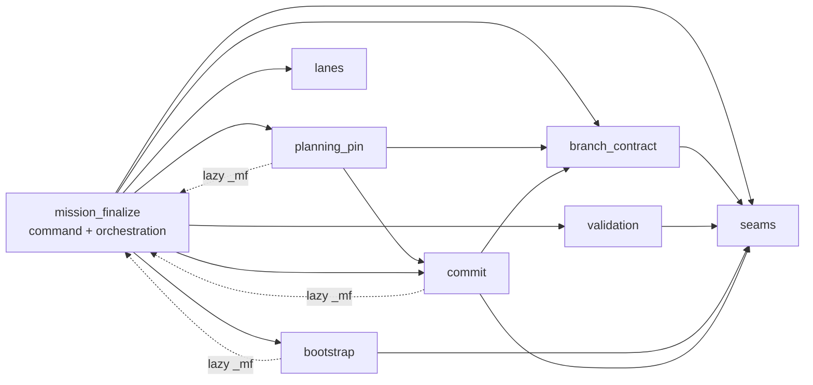

# Implementation Plan: Decompose mission_finalize god-module

**Branch**: `claude/modest-keller-6mvhd4` | **Date**: 2026-10-04 | **Spec**: [spec.md](spec.md)
**Input**: Mission specification from `kitty-specs/mission-finalize-degod-01M43EW2/spec.md`

## Summary

Split `src/specify_cli/cli/commands/agent/mission_finalize.py` (5,678 LOC) into seven sibling phase modules, with every body moved verbatim. The command module keeps `finalize_tasks`, its context/phase orchestration and the artifact helpers, and re-exports every moved name with the `x as x` form already used by `tasks.py`. Names that tests patch on `mission_finalize` are called from phase modules through a lazy, in-function `from specify_cli.cli.commands.agent import mission_finalize as _mf`. This is the seam-bridge idiom `tasks_shared.py` uses, so patches keep intercepting. Source-reading structural pins are re-pointed at the module that now owns their target, or read the whole family through one test helper.

The extraction is mechanical and AST-driven: each top-level statement is assigned to a module by its phase range. Cross-module classes and constants are imported at module scope, in an acyclic order. Cross-module functions and patched names are routed through `_mf`.

## Technical Context

**Language/Version**: Python 3.11+
**Primary Dependencies**: typer, rich (unchanged; no dependency added, upgraded or removed, so the supply-chain checks in DIRECTIVE_051 do not apply)
**Storage**: N/A (files and git, unchanged)
**Testing**: pytest. The finalize corpus is every test that mentions `mission_finalize`/`finalize_tasks`/`finalize-tasks` (about 5,200 tests). Plus new focused seam tests, ruff, mypy and `ruff format --check`.
**Target Platform**: Linux/macOS/Windows CLI (unchanged)
**Project Type**: single
**Performance Goals**: no measurable change. The lazy `_mf` import is a cached `sys.modules` lookup.
**Constraints**: behaviour parity (NFR-001), no size gate (C-001), no plan/apply split (C-002), layering untouched (C-003), no module-scope import of `mission_finalize` from a phase module (C-004).
**Scale/Scope**: 1 source module becomes 8 modules. About 6 test files need re-pointing, plus 2 new test files and 1 test helper.

## Charter Check

- **Single canonical authority**: each phase function has exactly one definition. `mission_finalize` only re-exports. ✅
- **Architectural alignment**: new modules are sibling leaves in `specify_cli/cli/commands/agent/`, matching the `mission_*` / `tasks_*` leaf convention. No layer boundary is crossed. ✅
- **Domain-driven splits**: the module boundaries follow the finalize phases (branch contract → validation → bootstrap → planning pin → lanes → commit). ✅
- **ATDD / red-first**: this is a behaviour-preserving refactor with no defect, so no regression repro is owed. Parity is proven by the unchanged behavioural corpus, and the new seam tests pin the split's own invariants. ✅
- **Campsite (DIRECTIVE_025)**: two mypy findings that existed before the move (`no-any-return` and `no-redef`, carried verbatim) are fixed in place. ✅
- **Locality (DIRECTIVE_024)**: no change outside the finalize family, its tests and its doc page. ✅

## Project Structure

### Documentation (this mission)

```
kitty-specs/mission-finalize-degod-01M43EW2/
├── spec.md
├── plan.md
├── research.md
├── data-model.md
├── quickstart.md
└── tasks/
```

### Source Code (repository root)

```
src/specify_cli/cli/commands/agent/
├── mission_finalize.py                  # command + orchestration + artifact helpers + re-exports
├── mission_finalize_seams.py            # constants, owned-envelope ContextVar, _emit_json, mission-routed seams
├── mission_finalize_branch_contract.py  # target-branch resolution, branch contract, override persistence
├── mission_finalize_validation.py       # requirement / dependency / issue-matrix gates
├── mission_finalize_bootstrap.py        # per-WP bootstrap loop, ownership gates, validate-only report, local events
├── mission_finalize_planning_pin.py     # planning-commit pin preserve / refresh
├── mission_finalize_lanes.py            # lane computation, acceptance-matrix scaffold
└── mission_finalize_commit.py           # commit pipeline, success report, rollback guards
tests/_support/finalize_source.py        # family-source helper for structural pins
tests/specify_cli/cli/commands/agent/test_mission_finalize_phase_modules.py
```

**Structure Decision**: sibling leaf modules (not a sub-package), to match the existing `mission_*.py` decomposition and keep the `specify_cli.cli.commands.agent.mission_finalize` import path stable.



## Complexity Tracking

No charter violations. Lazy routing adds one import line to each routed function. That cost is accepted to keep the historical patch surface (alternative rejected in research.md R-2).

## Implementation Concern Map

### IC-01 — Phase extraction with a stable patch surface

- **Purpose**: move every phase body verbatim into its phase module, re-export it from `mission_finalize`, and route patched names through `_mf`. Re-point every source-reading pin in the same change, so no commit is red.
- **Relevant requirements**: FR-001, FR-002, FR-003, FR-004, FR-005, NFR-001, NFR-002, NFR-003, C-001..C-004
- **Affected surfaces**: `src/specify_cli/cli/commands/agent/mission_finalize*.py`; `tests/_support/finalize_source.py`; `tests/architectural/test_finalize_refresh_pin_authority.py`, `test_no_write_side_rederivation.py`, `test_issue_matrix_json_migration_completeness.py`; `tests/coordination/test_commit_outcome_consumer_pin.py`; `tests/git/test_guard_capability_regression.py`; new seam tests.
- **Sequencing/depends-on**: none
- **Risks**: (a) a patch that resolves but stops intercepting. Mitigated by routing every patched name, scanning tests for every `mission_finalize.<attr>` reference, and adding interception tests. (b) A pin that silently loses coverage. Mitigated by re-pointing per moved function and adding the moved call sites to the guard-capability scan. (c) ruff `--fix` dropping an import that only exists as a patch seam. Mitigated by explicit `x as x` re-exports.

### IC-02 — Developer documentation

- **Purpose**: add a module map to `docs/api/finalize-tasks-internals.md`, fix its stale code pointer, and regenerate the docs retrieval index.
- **Relevant requirements**: FR-006
- **Affected surfaces**: `docs/api/finalize-tasks-internals.md`, `docs/development/docs-retrieval-index.yaml`
- **Sequencing/depends-on**: IC-01
- **Risks**: docs freshness gate. Run `scripts.docs.check_docs_freshness --ci` (errors=0).
