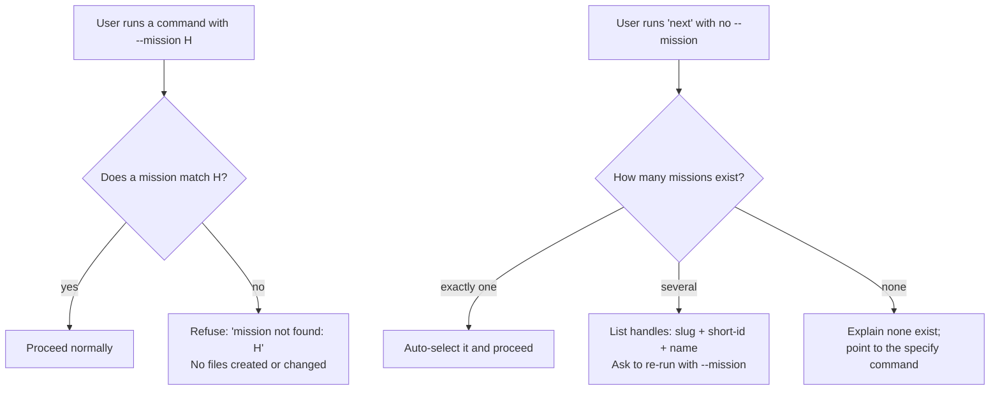

# Mission Specification: Consistent Mission-Handle Resolution

**Mission Branch**: `issue-4631-4682-mission-handle-resolution`
**Created**: 2026-09-18
**Status**: Draft
**Input**: Closes #4631 (a nonexistent `--mission` handle behaves inconsistently across commands, including a phantom directory write) and #4682 (`spec-kitty next` without `--mission` dead-ends on a usage error instead of listing missions). Both issues are in the MVP-launch milestone.

## Overview

The command-line tool identifies each unit of work by a **mission handle** (a slug, its short id, or the full id). Today the tool disagrees with itself about what to do when that handle is wrong or missing:

- Most commands, when handed a handle that names no real mission, say plainly *"mission not found"*.
- Four commands misbehave: two give the wrong advice, one silently creates a junk mission folder that pollutes the workspace, and one blames a downstream setup step as if the mission existed.
- A separate paper-cut: running the advancement command with **no** handle at all fails as a usage error, dead-ending a newcomer who does not yet know their handle.

This mission makes handle behavior uniform and legible: a wrong handle always produces the same clear "not found" message and never changes any files; a missing handle triggers helpful discovery (proceed when there is one obvious mission, list them when there are several, point to setup when there are none).

## User Scenarios & Testing *(mandatory)*

### User Story 1 - A mistyped handle never corrupts the workspace (Priority: P1)

A developer runs a command with a handle that does not exist (a typo, a stale copy-paste, a mission they never actually created). Every command refuses cleanly and, critically, changes nothing on disk. Today the research command instead scaffolds a whole mission directory (`kitty-specs/<typo>/` with `data-model.md`, `research.md`, and a `research/` subtree) for a mission that was never created — silent workspace corruption the user then has to find and delete.

**Why this priority**: This is the only defect in the set that mutates the filesystem. A phantom mission directory pollutes the specs tree, can confuse later commands and listings, and the user has no signal it happened. Correctness and data-integrity outrank the messaging paper-cuts.

**Independent Test**: In a workspace with two real missions, run the research command with a nonexistent handle; assert it exits non-zero with a "mission not found" naming the handle, and that the specs tree is byte-for-byte identical before and after (no new directory, no new files).

**Acceptance Scenarios**:

1. **Given** a workspace with missions `alpha` and `beta` and no mission `zznope`, **When** the user runs the research command with `--mission zznope`, **Then** it exits non-zero with `Mission not found: zznope` and creates no `kitty-specs/zznope/` directory and no files anywhere under the specs tree.
2. **Given** the same workspace, **When** the user runs the research command with a path-unsafe handle (e.g. `../x`), **Then** the pre-existing path-safety refusal still fires (this behavior is unchanged and is not converted into a "mission not found").

---

### User Story 2 - Every command tells the truth about an unknown handle (Priority: P1)

A developer passes an explicit `--mission` handle that does not match any mission. Instead of one clear answer, today they get contradictory stories: the plan and tasks commands say *"N missions found, pass --mission to disambiguate"* (wrong — the user *did* pass one), and the merge command says *"lanes.json is required… run the task-finalization step"* (wrong — it implies the mission exists but is unfinished). All in-scope commands must instead give the single, honest answer: this handle names no mission.

**Why this priority**: Misleading errors send users down the wrong recovery path — re-passing a flag they already passed, or hunting for a finalization step for a mission that does not exist. Truthful, uniform errors are the core of the mission.

**Independent Test**: In a workspace with two or more real missions, run each of plan, tasks, and merge with a nonexistent handle; assert each emits a "mission not found" naming the handle, and specifically that plan/tasks do **not** emit the "disambiguate" message and merge does **not** emit the "lanes.json / finalization" message.

**Acceptance Scenarios**:

1. **Given** two real missions exist, **When** the user runs the plan command with `--mission zznope`, **Then** the output is `Mission not found: zznope` and does not contain "missions found, pass --mission" or "to disambiguate".
2. **Given** two real missions exist, **When** the user runs the tasks command with `--mission zznope`, **Then** the output is `Mission not found: zznope` and does not contain the disambiguate message.
3. **Given** two real missions exist, **When** the user runs the merge command **fresh** with `--mission zznope`, **Then** the output is `Mission not found: zznope` and does not contain "lanes.json is required" or "task-finalization".
4. **Given** two real missions exist and no interrupted merge, **When** the user runs the merge command with `--resume --mission zznope`, **Then** the output is `Mission not found: zznope` and does not contain "No interrupted merge to resume" (the unknown-handle refusal pre-empts the no-state message).
5. **Given** a genuine multi-mission ambiguity where the user passed **no** handle, **When** the user runs plan or tasks, **Then** the existing "N missions found, pass --mission to disambiguate" guidance is still shown (this is the correct message for that different situation and must not regress).
6. **Given** a mission cleanup is mid-flight, **When** the user runs the merge command with `--abort` and an unresolvable handle, **Then** abort remains tolerant and completes its coordination cleanup (it must not be converted into a hard "mission not found" refusal).

---

### User Story 3 - A newcomer with no handle is guided, not blocked (Priority: P2)

A developer who just set up the tool runs the advancement command without `--mission`, because they do not yet know their handle (the ids are long and opaque). Today they hit `Invalid value: --mission <slug> is required` — a dead end. Instead the tool should help them forward.

**Why this priority**: This is an onboarding paper-cut, not data corruption or a false statement — real friction, but lower blast radius than Stories 1 and 2. It shares the same underlying resolution seam, so it rides along naturally.

**Independent Test**: Run the advancement command with no `--mission` in three workspaces — zero, one, and several missions — and assert the three distinct helpful behaviors, and that none of them is a usage/"Invalid value" error.

**Acceptance Scenarios**:

1. **Given** exactly one mission exists, **When** the user runs the advancement command with no `--mission`, **Then** it auto-selects that mission and proceeds as if the handle had been supplied.
2. **Given** several missions exist, **When** the user runs the advancement command with no `--mission`, **Then** it lists each available mission as `slug + short-id + friendly name`, asks the user to re-run with `--mission <handle>`, and exits with a clean non-usage error (not `Invalid value`).
3. **Given** no missions exist, **When** the user runs the advancement command with no `--mission`, **Then** it explains no missions were found and points to the specify command, exiting non-zero.
4. **Given** any of the three cases above, **When** the command is run with the machine-readable output flag, **Then** the same outcome is expressed in that structured output (including the list of available missions where applicable).

---

### Edge Cases

- **Path-unsafe handle** (`../x`, absolute paths, multi-segment): the existing path-safety refusal takes precedence and is preserved; it is a distinct error from "mission not found".
- **Ambiguous handle** (a prefix matching more than one mission): remains the existing structured ambiguous-selector error — distinct from both "not found" and the no-handle listing.
- **Single mission in a terminal/complete state** under bare `next`: auto-selection still resolves the handle; the runtime then reports that mission's actual state. Changing terminal-state reporting is out of scope.
- **Specs tree containing only malformed directories** (no `meta.json`/`spec.md`): counts toward discovery per the existing enumeration rules; this mission does not redefine what counts as a mission, only how a missing/unknown handle is handled.
- **Legacy mission without a `mission_id`** (pre-identity-model, un-backfilled): still counts as an existing mission for both discovery and sole-mission auto-select. Discovery must **not** report "no missions found" when an un-backfilled mission is present, and must not silently narrow the count by dropping it. When such missions are detected, a one-line "N mission(s) need `spec-kitty migrate backfill-identity`" nudge accompanies the affected branch. This is the specific miscount the shared population definition (FR-012) exists to prevent.
- **A nonexistent explicit handle to the advancement command** (as opposed to a *missing* one): must continue to produce the clean "mission not found" it already produces — the no-handle change must not regress the bad-handle path.

## Requirements *(mandatory)*

### Functional Requirements

| ID | Title | User Story | Priority | Status |
|----|-------|------------|----------|--------|
| FR-001 | Research refuses an unknown handle before any write | As a developer, when I pass a nonexistent `--mission` to the research command, I want it to refuse with "mission not found" and create no directory or files, so a typo never pollutes my workspace. | High | Open |
| FR-002 | Plan reports unknown handle truthfully | As a developer, when I pass a nonexistent `--mission` to the plan command, I want "mission not found: <handle>" instead of a "pass --mission to disambiguate" message, so I am not told to re-supply a flag I already supplied. | High | Open |
| FR-003 | Tasks reports unknown handle truthfully | As a developer, when I pass a nonexistent `--mission` to the tasks command, I want "mission not found: <handle>" instead of the disambiguate message. | High | Open |
| FR-004 | Merge reports unknown handle truthfully | As a developer, when I pass a nonexistent `--mission` to a fresh or resumed merge, I want "mission not found: <handle>" instead of a "lanes.json required / run task-finalization" message that implies the mission exists. | High | Open |
| FR-005 | Merge abort stays tolerant of an unresolvable handle | As a developer recovering an interrupted merge, I want `merge --abort` to keep tolerating an unresolvable handle so coordination cleanup can still complete. | High | Open |
| FR-006 | Shared "mission not found" phrasing | As a developer, I want the fixed commands (plan, tasks, research, merge fresh/resume) plus `next` to name the offending handle using one shared source constant in the canonical form `Mission not found: <handle>`, so the fixed surfaces read coherently. Commands that already emit a clean not-found with a richer envelope — notably the identity-aware resolver error that must keep its `spec-kitty migrate backfill-identity` remediation, and `reconcile`'s semantically distinct "dossier not found" — keep their envelopes and are NOT collapsed into the bare constant. | High | Open |
| FR-007 | Bare advancement with one mission auto-selects | As a newcomer with a single mission, when I run the advancement command without `--mission`, I want it to auto-select that mission and proceed. | Medium | Open |
| FR-008 | Bare advancement with several missions lists them | As a developer with several missions, when I run the advancement command without `--mission`, I want a legible list of `slug + short-id + friendly name` and a prompt to re-run with `--mission`, exiting with a clean non-usage error. | Medium | Open |
| FR-009 | Bare advancement with no missions guides to setup | As a newcomer with no missions, when I run the advancement command without `--mission`, I want a message explaining none exist and pointing me to the specify command. | Medium | Open |
| FR-010 | No usage/"Invalid value" error for a missing handle | As a developer, I never want the advancement command's missing-handle case to surface as a usage/"Invalid value" error; it must resolve to auto-select, list, or the no-missions guidance. | Medium | Open |
| FR-011 | Machine-readable parity where a JSON surface exists | As an automation author, for the commands that already expose machine-readable output — `next`, the plan/tasks agent commands, and materialize — I want every changed outcome (not-found and the available-missions listing) reflected there. Commands without a general JSON surface are explicitly out of this parity claim: research has no `--json`, and merge's `--json` is dry-run-only; adding new JSON surfaces to them is out of scope for this mission. | Medium | Open |
| FR-012 | Shared mission-population definition | As a maintainer, I want ONE shared definition of "which missions exist and which is the sole mission", used by `next` discovery and count-compatible with the plan/tasks auto-detect, so the two never disagree. The population counts any mission directory bearing `spec.md` or `meta.json` (legacy, un-backfilled missions included), reading `mission_id`/`mid8`/`friendly_name` best-effort. `next` renders each entry as `slug + mid8 + friendly_name` (friendly_name falling back to the slug when absent); plan/tasks retain their existing `available_missions` string-list output to preserve pinned contracts — unifying the render shape is a follow-up, not this mission. | Medium | Open |
| FR-013 | Correct commands stay correct | As a developer, I want the commands that already report a nonexistent handle cleanly (accept, review, advancement-with-handle, materialize, reconcile) to keep doing so, so this mission adds consistency without regressing them. | Medium | Open |

### Non-Functional Requirements

| ID | Title | Requirement | Category | Priority | Status |
|----|-------|-------------|----------|----------|--------|
| NFR-001 | Zero workspace mutation on unknown handle | For every in-scope command, a nonexistent `--mission` leaves the specs tree unchanged: 0 files created, modified, or deleted, verified by an identical before/after directory snapshot. | Reliability | High | Open |
| NFR-002 | Message uniformity across the fixed surfaces | The fixed commands (plan, tasks, research, merge fresh/resume) and `next`'s missing/unknown-handle paths emit the not-found message from a single shared source constant in the form `Mission not found: <handle>` (verbatim handle). Pre-existing correct commands already emit a clean, handle-naming not-found; their richer envelopes (identity/backfill remediation; reconcile's dossier wording) are preserved, not overwritten. Measured: every fixed command routes through the one shared constant, and no pre-existing correct-command test is regressed. | Usability | High | Open |
| NFR-003 | Seam contract preserved | The shared path-composition seam behavior is unchanged: all its existing automated tests, and existing callers that depend on its lenient composition (including `merge --abort`), pass without modification. | Compatibility | High | Open |
| NFR-004 | Quality gates green | All new and changed code passes lint and type checks with zero issues and zero suppressions, keeps each touched function at or below the project complexity ceiling of 15, and ships focused tests for every new branch/helper in the same change. | Maintainability | High | Open |

### Constraints

| ID | Title | Constraint | Category | Priority | Status |
|----|-------|------------|----------|----------|--------|
| C-001 | Gate at the callers, not the seam | The lenient path-composition seam (which only composes a path and does not check existence) must not be changed; existence gating is added at each command's call site, mirroring the already-correct command's pattern. | Technical | High | Open |
| C-002 | No silent fallback (Identity Model WP07) | An explicit but unmatched handle must never be silently dropped and re-resolved as "no handle given"; that behavior is the specific defect being removed and reintroducing any silent fallback is a regression. | Technical | High | Open |
| C-003 | Abort tolerance is scoped | Existence gating for merge applies only to the fresh/resume entry path; `merge --abort` must retain its non-raising tolerance of an unresolvable handle. | Technical | High | Open |
| C-004 | Scope discipline | The change is confined to caller-side existence gating and one shared discovery capability; it closes #4631 and #4682 and does not redefine what counts as a mission, the ambiguous-selector behavior, or path-safety validation. | Business | Medium | Open |

### Key Entities

- **Mission handle**: the user-supplied identifier for a mission — a slug, its short id, or its full id. The subject of every scenario here.
- **Mission**: a unit of work with a directory under the specs tree; "exists" means that directory is present. Discovery enumerates existing missions.
- **Available-missions listing**: the human- and machine-readable enumeration surfaced when no handle is given and several missions exist — each entry carrying slug, short id, and friendly name.

## Success Criteria *(mandatory)*

### Measurable Outcomes

- **SC-001**: In a workspace with real missions present, passing a nonexistent `--mission` to any of plan, tasks, research, or merge (fresh and resume) yields a `Mission not found: <handle>` naming the handle **and** leaves the specs tree unchanged (no phantom directory) in 100% of cases.
- **SC-002**: Running the advancement command with no `--mission` never dead-ends on a required-flag usage error; it instead proceeds (exactly one mission), lists the available missions (several), or points to setup (none) — verified across all three population sizes, including a workspace whose sole mission is a legacy un-backfilled one.
- **SC-003**: For a nonexistent handle, the fixed commands (plan, tasks, research, merge fresh/resume) and `next` emit the shared `Mission not found: <handle>` phrasing from one source constant; the pre-existing correct commands continue to emit a clean handle-naming not-found (verified present, not regressed).
- **SC-004**: Zero regressions: the previously-correct commands still emit clean not-found errors, the path-composition seam's existing tests still pass, and `merge --abort` still tolerates an unresolvable handle.
