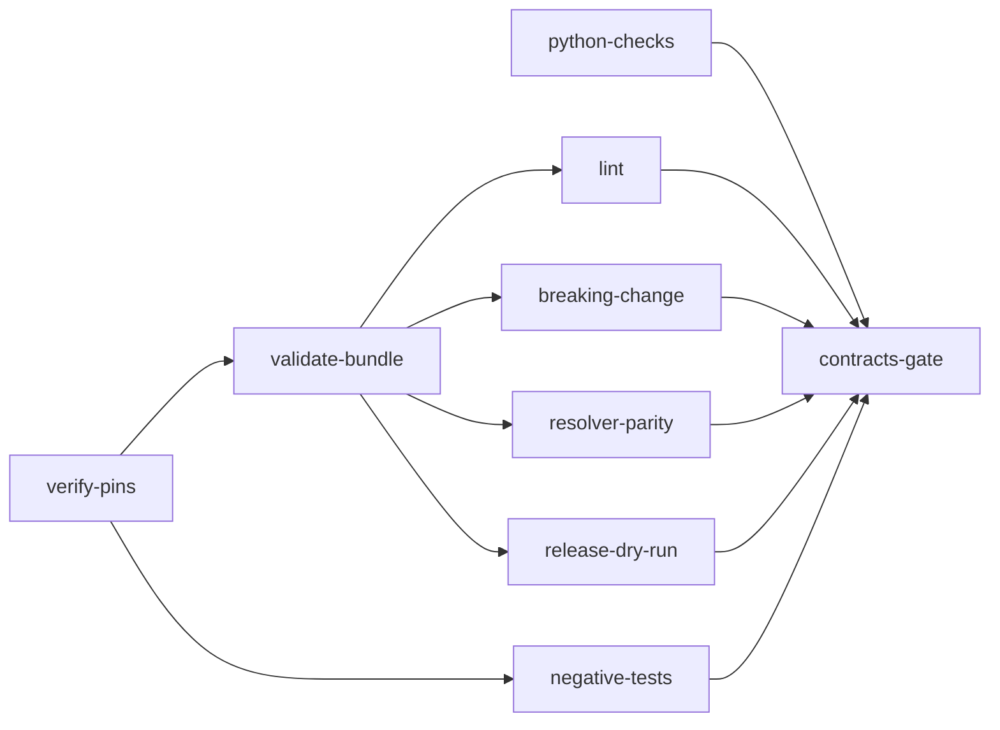

# Implementation Plan: Mission Status contract v1

**Branch**: `issue-5558-mission-status-contract-v1` | **Date**: 2026-10-01 | **Spec**: [spec.md](spec.md)
**Input**: Mission specification from `kitty-specs/mission-status-contract-v1-01M3WC5X/spec.md` (issue #5558, part of #5528)

**Note**: Filled in from the canonical plan template (`packs/built-in/missions/software-dev/templates/plan-template.md`) through `spec-kitty agent mission setup-plan`. Companion planning artifacts in this directory: [research.md](research.md), [data-model.md](data-model.md), [quickstart.md](quickstart.md), [contracts/tools-and-workflows.md](contracts/tools-and-workflows.md) and the three tracer files (`tracer-*.md`).

## Branch contract

- Current branch at plan start: `issue-5558-mission-status-contract-v1`.
- Planning/base branch and merge target recorded by the tooling: `issue-5558-mission-status-contract-v1` (`branch_matches_target: true`).
- Integration branch for the finished work: `main`, through one pull request opened as a **draft** from this branch. The PR stays a draft until a maintainer acknowledges the design on #5528 (CL-1, C-001). Implementers never merge, and nothing is pushed to `main`.
- Topology recorded in `meta.json`: `lanes`. Work packages run in lane worktrees, so write scopes below are disjoint across parallel lanes (see tracer F-2), with these declared exceptions, each either append-only or sequenced: (1) the corpus registry `tests/architectural/test_ci_corpus_trigger_completeness.py`, where every WP that adds a corpus-marked module lists its own rows, rows are appended in sorted order, and the lane that merges later keeps the union of both row sets and re-runs the completeness test before it lands; (2) the contract root map, the `_index.yaml` files and the path files under `contracts/mission-status/`, written by IC-02, IC-03 and IC-04 in sequence and, only if the spike records a brace spelling other than the default, once more by IC-08's opening re-sweep (also touching any literal path-file name in IC-02 to IC-06 tests and fixtures), which starts after IC-04 and every content lane has merged; (3) `.github/workflows/contracts.yml`, written by IC-07a, then IC-07b, then IC-08, never in parallel; (4) `contracts/tools/contract_resolver.py`, owned by IC-01, whose one `BRACE_REF_SPELLING` constant is edited a single time by that same IC-08 re-sweep, and only in that case.

## Summary

Deliver the Mission Status Read API contract as a versioned, split OpenAPI 3.1 module (`contracts/mission-status/`, plus `contracts/_shared/`), the Node-free CI that keeps it honest (a path-filtered contracts workflow and a tag-only release workflow), a reality-check test that validates payloads built from this repository's own Missions against the contract, and `CODEOWNERS` for `contracts/`. No file under `src/` changes (C-002).

Technical approach, in one paragraph. Every check that does not need a JVM is a plain Python script under `contracts/tools/`, built on one shared resolver (`contracts/tools/contract_resolver.py`) that is also the reality check's only way of reading the contract (OQ-1, decided below). The JVM-dependent steps (validate, bundle, lint, breaking-change diff) run only in the contracts workflow, behind pinned and checksum-verified tooling. A resolver-parity script, run in the same workflow, compares the Python resolution of the split files with the CI bundle after a short, capped list of named normalisations, and a second, library-based dereference check cross-reads the same files; what these two checks do and do not prove is stated under D-P2, and neither is described as an independent proof of the resolver. The reality check runs exactly once per change, in the router's `tests-corpus` job, selected by one added glob (`contracts/**`). The mission opens with a measured baseline and, if the re-count at implement start still holds, one distinct, behaviour-preserving tidy-first commit (see Campsite-clean).

## Technical Context

**Language/Version**: Python 3.11+ for `contracts/tools/` scripts and `tests/` (CI runs 3.12; no 3.12-only syntax, target is `py311`); YAML (OpenAPI 3.1, Spectral-format ruleset); a Gradle build script (Groovy or Kotlin DSL, implementer's choice, recorded in `research.md`) for the CI-only JVM step.
**Primary Dependencies**: Locked Python dependencies only (`pyyaml`, `jsonschema` with `referencing`, both already in `uv.lock`; no new Python dependency, `pyproject.toml` and `uv.lock` untouched). CI-only, pinned and verified (versions chosen and recorded at implement time in `contracts/tools/pins.json`, never invented here): a JDK from a SHA-pinned setup action, a Gradle distribution, the openapi-generator Gradle plugin and its transitive artefacts (Gradle dependency verification), vacuum (Go binary), oasdiff (Go binary). **Python in the contracts workflow** comes from one prelude shared by every job that runs a `contracts/tools/` script: the SHA-pinned `astral-sh/setup-uv` action with `python-version: '3.12'` (the version CI uses elsewhere; the code floor stays `py311`), then `uv sync --frozen --no-install-project`, which installs exactly the locked set (`pyyaml`, `jsonschema` and its `referencing` dependency are base dependencies in `pyproject.toml`, so no extra is needed for them). The prelude does **not** install `rfc3339-validator` or `jsonpointer`: in `uv.lock` both are reached only through the `format-nongpl` extra of `jsonschema` that `cyclonedx-python-lib` requests for `cyclonedx-bom`, which `pyproject.toml` lists in the `lint` extra, while `tests-corpus` runs `uv sync --frozen --all-extras` and so has it. Format validation therefore never depends on the environment (D-P14). No bare `pip install` appears anywhere (FR-018); `verify_pins` accepts exactly this form and fails an unpinned install (decision D-P12).
**Storage**: Files only. Committed: split contract files, examples, `CHANGELOG.md`, `pins.json`, `verification-metadata.xml`, planted fixtures. Never committed: the bundle and its sha256 (build products, uploaded as workflow artifacts and release assets).
**Testing**: pytest for the reality check, its helper and the unit tests of each `contracts/tools/` script (single-line `corpus` marker, selected once by `tests-corpus`); pytest in `tests/ci/` for workflow-file guards (selected by the module-matrix `ci` row); a class-A negative-test job in the contracts workflow for every `contracts/tools/` script and every JVM tool (planted fixture, asserted message, clean control).
**Target Platform**: GitHub Actions `ubuntu-24.04` for the workflows; contributors' Linux, macOS, Windows for the Python tools (stdlib plus locked dependencies only). The JVM steps are CI-only; no JVM, Gradle, vacuum or oasdiff exists on the planning workstation (tracer F-7).
**Project Type**: Single repository, new top-level `contracts/` tree outside the wheel; no `src/` change.
**Performance Goals**: Reality check at most 120 s for the module and 60 s per case, fixture setup included (NFR-001); own-directory snapshot pass measured at about 0.5 s for 539 Missions and 2936 snapshot work packages on this checkout (read-only `materialize_snapshot`, zero exceptions), so the budget is dominated by payload building and jsonschema validation, measured from the CI job log at implement start. Two builds of one commit are byte-identical (NFR-002).
**Constraints**: C-001 to C-011 of the spec; plus the plan-level constraints in the sections below (seam, generated artefacts, gate set, public-repo hygiene). Public repository: no absolute host path, no e-mail address, no private-discussion reference in any file this Mission authors (C-006).
**Scale/Scope**: Five v1 resources, three event kinds, about 539 corpus Missions and 3125 work package files at measurement; 17 workflow files today, 19 after (ceiling 20).

## Charter Check

*GATE: passed before research; re-checked after design (second column).*

| Charter rule | Pre-design | Post-design | Plan element |
|---|---|---|---|
| Single canonical authority (`DIRECTIVE_044`) | pass | pass | One resolver (`contract_resolver.py`) serves the reality check and the parity script; one leak-pattern library serves the text scan and the payload scan; derived inventory regenerated by its own script, never hand-edited; the router's `gate_selection` authority is consumed, not re-encoded. |
| Architectural alignment (`DIRECTIVE_001`) | pass | pass | See "Seam" below: no `src/` change, no kernel reach, no core-loop coupling to sync or transport. |
| Tiered rigour | pass | pass | Contract and the tools that guard it are the core of this Mission and get planted-violation proof; glue (workflow YAML) is covered by guard tests and by the dry run. |
| ATDD-first (C-010) | pass | pass | Each WP's first commit is a failing test or planted fixture, red on the planning base, green on the final commit; the reviewer verifies red then green. |
| Terminology (Mission, never feature; status lane vs code lane vs repo-root lane; workflow phase vs glossary `phase`) | pass | pass | The spec's terminology section is binding on every new file; the README states the distinctions; the forbidden-property-name list is the only place legacy spellings appear, as quoted data. |
| Standing Order 1 (adversarial squad at point-cuts) | n/a here | requested after this point-cut | The squad after the plan point-cut (and the supply-chain challenge pass for the dependency decisions) is advisory and never a gate; its findings are folded into this plan and the review trail under `reviews/`. No contested finding is left undispositioned in the plan text. |
| Standing Order 2 (campsite first) | pass | pass | The opening commit is decided in "Campsite-clean" below, on a counted, verified duplicate literal in the file about to change; the plan states how it is dropped if the count no longer holds. |
| Standing Order 3 (tracer files) | pass | pass | Three tracer files seeded with real content. |
| Standing Order 5 (non-vacuous gates, priced debt) | pass | pass with priced debt | Every check has a concrete floor and a planted-violation test; no gate carries an allowlist (the empty-allowlist invariant holds for every gate this Mission adds: no ledger row, no `WORKFLOW_FILES` row, no baseline entry, and no exempt directory or exempt marker line in the text-level leak scan, because planted leak-class fixtures are assembled at run time from fragments, D-P11). The one planned transient list is the pinned shrink-only ceiling for the snapshot-versus-files disagreement list (FR-019), a ratchet over data this Mission does not own, so it is priced debt: its tracker issue is opened before IC-09 starts; the owner is a named GitHub handle or team, filled in when the issue is opened (a role is not an owner); the exit condition is a disagreement list of length zero, with a `drain_by` calendar date set by the maintainers on the tracker issue (Burn-down Policy (a); no release version is used as a date, C-008). IC-09 does not start until the issue exists. The pinned fixture header carries `issue`, `owner` and `drain_by` keys and a unit test fails when any of them is missing or empty. |
| Standing Order 6 (canonical sources) | pass | pass | Canonical plan template used; generated files are regenerated, never hand-patched (see "Generated artefacts"). |
| Standing Order 7 (git and workflow) | pass | pass | PRs only; draft until acknowledged; no version numbers in scope (C-008). |
| Pre-existing Failure Reporting Rule | pass | pass | Baseline taken before the first change; see "Baseline". |
| `NO_FULL_HEAVY_SUITES_IN_MISSION` | pass | pass | Only named gate files are run in mission work; the architectural directory is never swept. |
| `__all__` convention (applies to `src/charter`, `src/kernel`) | n/a | n/a | No file in those trees changes. |

**Drift flagged (charter wins).** The charter says nothing on GitHub enforces the PR workflow and no check can block a PR; the repository's CLAUDE.md says branch protection and review requirements enforce it. A read-only probe of the default branch returns 404 for branch protection and an empty rulesets list, so the charter is correct. This plan therefore never uses "enforced" without a tier, and none of the tiers is a GitHub required check:

- **Tier 1, gate-blocking.** The job is a `needs` of a terminal gate (`router-gate` in `ci-router.yml`, `modules-gate` in `ci-modules.yml`, `aggregate-gate` in `ci-aggregate.yml`) and its red turns that gate red. This is the strongest tier that exists here.
- **Tier 2, fleet-reported.** The workflow is in the fleet-verdict inventory (`PR_WORKFLOWS`), so its result is read into the verdict comment, but no terminal gate turns red when it fails (examples: `release-readiness.yml` including its `cutover-guard` job, `packs.yml`, `ci-quality.yml`, `ci-windows.yml`).
- **Tier 3, local discipline.** Nothing in CI reads it.

Because no branch protection or ruleset exists, even a tier 1 red stops a merge only because the merge agent declines to merge on a red gate; a tier 2 red is information in a comment. CODEOWNERS review is advisory for the same reason (FR-023). In the gate set below, a row says "Enforced" only for tier 1 unless it names tier 2; the tier of each new gate is its own column.

## Seam: where the change lands (a)

None of kernel, doctrine, CLI or sync. The change lands at four places that sit outside the runtime layering `kernel <- charter <- {glossary, runtime, mission_runtime} <- specify_cli`:

| Surface | New or edited | What goes there |
|---|---|---|
| `contracts/` (new top-level tree, not in the wheel) | new | `_shared/`, `mission-status/`, `tools/`, `gradle/`, `README.md`. The wheel packages list and the sdist include list name `src/**` and `packs/built-in/**` (plus a few top-level files in the sdist), so nothing here ships to consumers. |
| `.github/` | new files, one edited file | `workflows/contracts.yml`, `workflows/contracts-release.yml`, `CODEOWNERS` (plus the `.gitignore` allowlist line that lets it be tracked: the rule `.github/*` ignores new files there); one glob line in `workflows/ci-router.yml`; one name in `workflows/ci-fleet-verdict.yml`. |
| `scripts/ci/` and `tests/ci/`, `tests/architectural/`, `tests/release/` | edited | One `PR_WORKFLOWS` entry in `scripts/ci/fleet_verdict.py`; expected-set edits in `tests/ci/test_fleet_verdict.py`; registry rows in `tests/architectural/test_ci_corpus_trigger_completeness.py`; the regenerated derived inventory `tests/release/pinning_rule_inventory.json` and the hand-maintained documentation copy of the corpus globs in `tests/release/ci_retirement_scrub.json` (`non_src_router_groups`, see Generated artefacts). |
| `tests/contract/` and `tests/ci/` | new | Reality check, its helper, unit tests of every script, workflow guard tests. |

Boundary rules this plan holds:

1. **No `src/` change (C-002).** The reality check composes the status domain's existing public readers from the test side only: `MissionStatus.load` (`specify_cli.status.aggregate`), `materialize_snapshot` (`specify_cli.status.reducer`), `resolve_mission_identity` (`specify_cli.mission_metadata`), `resolve_mid8` (`mission_runtime.identity`), `compute_weighted_progress` (`specify_cli.status.progress`), `reconstruct_wp_view` (`specify_cli.status.wp_view`), `dependency_readiness_for_wp` (`specify_cli.core.dependency_graph`), the tail reader (`specify_cli.status.tail_reader`), and `read_authored_wp_frontmatter` (`specify_cli.status.wp_metadata`). It never imports `kernel` internals, never opens `status.events.jsonl` with a hand-rolled parser where a public reader exists, and never rebuilds a status path by hand (ADR D-3: the API composes existing read models). A command reaching past a service into kernel internals is therefore impossible by construction: there is no command.
2. **No core-loop to sync or transport coupling.** The event stream (`GET /events`) is a documented contract only; this Mission implements no emitter, server or transport. The live hosted path (`status/emit.py` to the Zeitgeist bridge) is untouched and not described by the contract. The word "sync" appears nowhere in new files except in quoted legacy identifiers, if at all.
3. **`contracts/tools/` never imports pytest or anything under `tests/`.** `tests/contract/` imports from `contracts/tools/` (the allowed direction), by file path through `importlib.util`, because `contracts/` is not a package and `pytest.ini` puts only `src` on the path. Tools run as bare scripts (`python contracts/tools/<script>.py`) and import their sibling library modules by name, which works because a bare script's own directory is `sys.path[0]`. They import nothing from `scripts.`, so the workflow-script import guard (`tests/ci/test_workflow_script_import_guard.py`) has nothing to flag.
4. **Name collision to avoid.** `src/specify_cli/contracts/` is the shared-contract registry of the CLI (anchoring and retirement obligations), unrelated to the top-level `contracts/` tree of this Mission. The README states it in one line so a reader does not conflate them. A per-Mission `kitty-specs/<mission>/contracts/` directory is a planning artefact, also unrelated (this Mission's own is `contracts/tools-and-workflows.md` in this directory).

## Generated artefacts: what is generated, by which command (b)

Hand-patching a generated file is forbidden. This Mission touches or creates the following, and says how each is produced.

| Artefact | Generated by | Committed? | Handling |
|---|---|---|---|
| The bundled `openapi.yaml` and `openapi.yaml.sha256` per module | `contracts/tools/bundle.py`, which drives the Gradle `openapi-yaml` generator twice and compares digests | **No** (FR-001 layout check fails on a tracked bundle). Uploaded as a workflow artifact; published as a release asset. | Never edited; two builds must be byte-identical. |
| `contracts/gradle/verification-metadata.xml` | `gradle --write-verification-metadata sha256 <task>` (Java toolguide) | Yes | Regenerated by that command when the plugin pin moves; never hand-edited. The planted-tamper fixture is a copy under `contracts/tools/fixtures/`, altered by a test helper at run time, not by hand in the real file. |
| `contracts/tools/pins.json` (tool versions and sha256) | Written by the implementer from the vendor's published artefacts, then verified by `contracts/tools/verify_pins.py`; each entry records the publication date for the freshness control | Yes | The only authored (not generated) manifest; the verifier refuses an empty manifest, a missing checksum or an unpinned `uses:`. |
| `tests/release/pinning_rule_inventory.json` | `python3 scripts/ci/derive_pinning_inventory.py` | Yes | **Hidden gate, see tracer F-5.** Editing `scripts/ci/fleet_verdict.py`, `tests/ci/test_fleet_verdict.py` or `tests/ci/test_fleet_main.py` shifts recorded line numbers; the file is regenerated with its own script in the WP that makes those edits, and `tests/release/test_pinning_inventory_fresh.py` is run as a named gate. **Where this gate actually runs (verified by calling `select_modules` read-only):** the router selects the `release` module when a changed path lies under its test mirror `tests/release`, and its shard runs the whole `tests/release` directory (15 test modules). A diff that edits `scripts/ci/fleet_verdict.py` and `tests/ci/` but not `tests/release/` selects the `ci` shard only, so on that diff the freshness test never runs; with the regenerated inventory in the diff both `ci` and `release` are selected. Regeneration is therefore a hard obligation of every WP that shifts a scanned line, and CI will not catch a missed one on the WP's own diff. New text must not reference `ci-quality.yml`, the retired sonar job id or `make test-fast`, or the deriver reports a new rule with a null disposition. |
| Agent command copies (12 agent directories, `.agents/skills/`), Contextive glossary, doctrine schemas, DRG graph, pack manifest | `spec-kitty regen`, `spec-kitty doctrine regenerate-graph`, the glossary tooling | n/a | **Not touched.** No template, skill, doctrine artefact, glossary entry or mission-step source changes, so `spec-kitty regen --check` is unaffected. It is run once at close-out as a no-diff confirmation, not as a gate this Mission relies on. |
| Pinned expected-output fixture for the derived lifecycle values (FR-019) | A one-off extraction of the two pure derivation functions from the dashboard code as it stood at commit `d78aa2345` (recoverable with `git show d78aa2345:src/specify_cli/dashboard/scanner.py`), run once in a scratch directory over the named sample of Missions | Yes (the fixture only) | The fixture header records the commit, the two function names and the sample selection rule; the generator is not committed (it would reintroduce removed code). The reality check compares the helper's output with the fixture on every run and never skips. |
| `tests/release/ci_retirement_scrub.json` `non_src_router_groups` (documentation copy of the `docs`, `corpus` and `e2e` router globs) | **Not generated.** Verified: no script writes it and nothing reads `non_src_router_groups` (the router-transcription guard reads only `groups`); it is hand-maintained data. | Yes | The `contracts/**` glob is added to its `corpus` roots by hand in the same IC-01 commit as the router line, so the copy keeps equalling the router; any `tests/release/**` edit selects the `release` shard (already selected by the regenerated inventory). If a maintainer prefers it untouched, the staleness is stated in the PR body instead. |
| `docs/development/docs-retrieval-index.yaml` | `python -m scripts.docs.docs_index --write` | Yes | A new `##` heading in `docs/development/reference/ci-gate-mechanics.md` changes the committed index anchors; regenerate with that command (never by hand) when the section lands, or add the content under an existing heading. The freshness check is `tests/docs/test_docs_index_freshness.py` (selected through the docs group, tier 1). |
| `kitty-specs/<mission>/status.events.jsonl`, `meta.json`, `tasks/`, `tasks.md` | The `spec-kitty` CLI | Yes | Written only by CLI commands; never hand-edited. |

## Contracts: what moves and what is preserved (c)

| Contract | Verdict | Reason |
|---|---|---|
| Doctrine schemas, DRG, pack manifests | **Preserved**, not touched | No `packs/` or `src/charter/offering/` edit. |
| Mission step contracts and action indices | **Preserved**, not touched | No `packs/built-in/missions/` edit; the plan flow itself is read only. |
| `orchestrator-api` command surface | **Preserved**, not touched | No `src/` edit; the new contract describes a different, read-only resource set and does not alias `orchestrator-api` output. |
| Vendored `spec_kitty_events` upstream contract (`specify_cli/core/upstream_contract.json`, loaded by `tests/contract/conftest.py`) | **Preserved**, not touched | The new `tests/contract/` modules do not use that conftest's fixtures and must not change it. Note for implementers: the conftest's module-level load runs for every test in the directory, so a new test module there is collected under it; nothing in it conflicts. |
| `contracts/fixtures/` (handoff fixtures) and `tests/contract/test_handoff_fixtures.py` | **Preserved**, untouched (C-004; `git diff --stat` shows nothing there) | Left exactly as is. |
| `spec-kitty-events` and `spec-kitty-tracker` (external packages) | **Preserved** | Not consumed by new code beyond what the status readers already do. |
| Status event schema, `status.events.jsonl` row shapes, `meta.json` shape | **Preserved** | The contract's event projection is read-only and drops every row kind it does not allow-list (FR-007). |
| CI router filter (`ci-router.yml` `corpus` group) | **Explicitly changed, additive** | One glob line, `contracts/**`; every existing glob untouched. |
| Fleet-verdict inventory (`PR_WORKFLOWS`, the reporter's `workflow_run` list) | **Explicitly changed, additive** | One entry and one name; the finite inventory check fails closed otherwise (FR-017). |
| **New: `contracts/mission-status/` v1** | **New, explicitly versioned** | `info.version` `1.0.0` for the first release; semver rules in the README: breaking changes move the major, additive the minor, documentation-only the patch; `x-provisional` elements may change without a major bump but are diffed and reported separately (D-7). First-release baseline: the one allowed "no previous release tag" state (D-12, FR-016). |
| **New: `contracts/_shared/`** | **New, unversioned in v1** | Shared pieces (`Problem`, page cursor, `PageInfo`, parameters, responses) are versioned through the modules that reference them; a change to a shared piece is a change to every referencing module and is diffed through each module's bundle. Admission criteria are stated in the README. |
| **New: release tag namespace `contract-<module>-v<semver>`** | **New** | Disjoint from the CLI's `v*.*.*` namespace, asserted by a guard test implementing GitHub's filter-pattern semantics (FR-022). |

## Upgrade chain, migration impact and reflexivity (d)

**Upgrade and migration chain impact: none.** Reason: no file under `src/` changes, so no migration module, `spec-kitty upgrade` step, template, agent command copy, skill, mission step or schema version moves (C-002). Nothing here is installed into a consumer project; `contracts/` is excluded from the wheel and the sdist. The `contracts/**` router glob and the new workflows exist only in this repository's CI.

**Reflexivity: Missions in flight when this lands.**

1. **Runtime.** Unchanged. In-flight Missions run, claim, review and consolidate exactly as before; the Mission Status contract describes a service that does not exist yet, so no in-flight Mission sees a behaviour change.
2. **CI coupling (the one new coupling).** The router's `corpus` filter already selects `kitty-specs/**/spec.md`, `plan.md`, `tasks/**`, nested `contracts/**` and `acceptance-matrix.json`, so every Mission work-package PR already runs `tests-corpus`. After this lands that job also runs the whole-corpus reality check over every other Mission's committed data. A data defect in an unrelated in-flight Mission (partial frontmatter, a non-numeric `mission_number`, a missing event log) can therefore redden a stranger's PR. Mitigation, from the spec (R-4) and made concrete here: zero exclusions at delivery; a failure naming a Mission the PR does not touch is first classified (contract gap, reader defect, or data defect) and routed to that Mission's owner on the PR; the exclusion path (an issue, an owner and a drain date, printed in the test output) is pre-approved so a stranger's PR is never stuck; the failure output names the Mission, the work package and the JSON pointer.
3. **This Mission is part of its own corpus.** Its scaffold, its `status.events.jsonl` (which carries a git identity in a CLI-written `MissionCreated` actor, tracer F-9) and its work-package files are validated by the reality check. Corpus floors (500 Missions, 3000 file-backed payloads, 2800 snapshot work packages) are therefore re-measured at implement start and again after the last rebase, and pinned below the measured values.
4. **Readers that write.** The reality check proves it left every tracked file under `kitty-specs/` byte-identical (hash before and after) and never calls `materialize`. This is the direct consequence of the spec-phase incident (tracer F-1).
5. **Reader drift is not selected before merge** (R-14, accepted): a PR that edits a status reader selects module shards, not `tests-corpus`. The push-to-`main` run of `built-in-corpus-suite` catches it on the next merge. The README tells reader authors to run the reality check locally (one command), and the PR body names the uncovered reader paths so a maintainer can add them to the `corpus` group later.
6. **History.** The branch already contains one merge of `main`. Before the first implementation commit, and again at PR prep, the branch is re-synced onto current `main` (rebase, then the compact-history step of `mission-wrap-up-sequence`) and every cited path in this plan is re-verified (R-1, R-2). Both steps rewrite commits, so a bare commit hash handed to an outside team would not survive them; the refs offered to the UI team are immutable tags in a non-release namespace (see UI early-start point).
7. **Data drift on files the router does not select (accepted risk P-9, sibling of R-14).** The check reads every Mission's `meta.json`, `status.events.jsonl` and `tasks.md`, plus `.kittify/config.yaml` for the project name, none of which the `corpus` filter selects (it lists `spec.md`, `plan.md`, `tasks/**`, nested `contracts/**` and `acceptance-matrix.json`). By design a commit touching only `meta.json` or `status.events.jsonl`, which is every status transition, selects no `tests-corpus` run (the C-001 comment in `tests/architectural/test_ci_corpus_trigger_completeness.py` forbids a bare `kitty-specs/**` or `status.events.jsonl` glob, and this Mission does not edit it). A data defect committed that way therefore merges unchecked and surfaces on the next corpus-selected run, attributed to the wrong author. **Accepted, with a named detection point:** the push-to-`main` run of `built-in-corpus-suite` (and the nightly full run, whose scheduled default mode is `full`). **Triage rule:** a red that names a Mission the pull request does not touch is classified first (contract gap, reader defect, or data defect); the first red on `main` is routed to the owner of the named Mission, not to the author of the pull request that happened to carry it. The router globs are not widened. The PR body lists the data files the check reads that the router does not select.
8. **An edit confined to `tests/contract/**` selects no job (accepted risk P-10).** Verified read-only with `select_modules` and `select_gates`: after merge a pull request that edits only `tests/contract/_mission_status_payloads.py` or a tool's unit-test module matches no router group and no module row, so neither the edited test nor its helper runs per pull request; the push-to-`main` `built-in-corpus-suite` is the only net. The spec's single-glob constraint (C-003) rules out a second glob in this Mission. Mitigation: the one-line local command sits in `contracts/README.md` next to the reader-author warning, and the PR body asks the maintainers whether `tests/contract/**` may join the same `corpus` filter line (a question, not an edit made here).

## The gate set (e)

Verified on this checkout from `.github/workflows/` and `.github/ci-module-registry.yml`. "Enforced" means tier 1 as defined under Branch contract (the job is a `needs` of `router-gate`, `modules-gate` or `aggregate-gate`); rows that are only fleet-reported say "tier 2"; no GitHub required check exists.

### Existing gates, re-verified

| Gate | Where | Status on this checkout | In this Mission's gate set? | Reason or how |
|---|---|---|---|---|
| `ruff check .` and `ruff format --check .` (whole repo) | `ci-router.yml` `ruff` job; `ci-quality.yml` `lint` job | Enforced | **Yes** | New Python under `contracts/tools/` and `tests/`. Rules in force include `S` (bandit) and the banned-API list: `hashlib.sha256` is banned (TID251) outside charter use, so checksum code carries a one-line `# noqa: TID251` with a file-integrity justification (the ban message permits exactly that), and any XML read of `verification-metadata.xml` avoids `xml.etree` (S314) by a narrow regex or a justified suppression. Run locally as `ruff check .` and `ruff format --check .` with the venv binary. |
| `uv lock --check` | `ci-router.yml` `uv-lock`; `ci-quality.yml` `uv-lock-check` | Enforced | No (run once at close-out) | No dependency, extra or `pyproject.toml` change, so the lock cannot go stale; a close-out run confirms. |
| TID251 import-linter (`ruff check --select TID251 .`) | `ci-router.yml` `import-linter` | Enforced | **Yes** (inside the ruff run) | Same ruleset; the sha256 ban is the live risk. |
| `spec-kitty regen --check` | `ci-router.yml` `regen-check`; `packs.yml` `built-in-regen-check` | Enforced | No (run once at close-out) | No template, skill, doctrine or mission-step change (see Generated artefacts). |
| Terminology guard | `ci-router.yml` `terminology` (`tests/architectural/test_no_legacy_terminology.py`) | Enforced (two retired terms only; the Mission-versus-feature half is review-enforced) | **Yes** | Cheap (about 0.1 s), and new prose lands in `tests/` and `docs/`. |
| Layer rules | `ci-router.yml` `layer-rules` (`tests/architectural/test_layer_rules.py`, `test_pyproject_shape.py`) | Enforced | No | They pin `src/` import direction and `pyproject.toml` shape; this Mission touches neither. |
| Archive freeze | `ci-router.yml` `archive-freeze` | Enforced | No | Guards frozen archive roots; nothing archived is touched. |
| Architectural heavy battery | `ci-router.yml` `architectural-heavy` (code-scoped; selected here because `tests/architectural/**` is edited) | Enforced, CI-owned | **Named files only** (below) | Charter: no full architectural sweep in mission work. CI runs the full battery on the PR. |
| Routed test groups (`tests-consolidation`, `tests-status`, `tests-cli`, `tests-e2e`) and `tests-corpus` | `ci-router.yml`; `router-gate` aggregates | Enforced | `tests-corpus` yes (it is the reality check's home); the others no | The others are selected by paths this Mission does not touch (verified by simulation, below). `tests-docs` is the exception and has its own row. |
| `docs-lint` (`python -m scripts.docs.check_spelling`, `python -m scripts.docs.check_changelog_style`) | `ci-router.yml`, always-on | Enforced | **Yes** | Always runs, and this Mission edits the changelog and a docs page. It checks the `## [Unreleased]` section for American spelling and the house entry shape, which differs from this plan's own British prose: every sentence this Mission adds to the changelog or to `docs/` is written in American spelling. Run both commands locally and record the result. |
| `tests-docs` (`pytest tests/docs`) | `ci-router.yml`; selected by the `docs` group (`docs/**`) | Enforced | **Yes**, named files | This Mission edits `docs/development/reference/ci-gate-mechanics.md` and `docs/changelog/CHANGELOG.md`, so the docs group matches and the job runs in CI over the whole directory (65 test modules, CI-owned). The named local files are those that read the touched pages: `tests/docs/test_docs_index_freshness.py`, `test_docs_index.py`, `test_docs_freshness_invariant.py`, `test_changelog_style.py`, `test_check_spelling.py`. |
| Per-module shards and `modules-gate` | `ci-modules.yml` with `.github/ci-module-registry.yml` | Enforced | **`ci` and `release` modules** | `tests/ci/**` and `scripts/ci/**` select the `ci` row. The regenerated `tests/release/pinning_rule_inventory.json` (and the `ci_retirement_scrub.json` edit) select the `release` row through its test mirror `tests/release`, whose shard runs the whole `tests/release` directory (15 test modules, only one of them in the named set), so those modules join the baseline (below) and a red there must be classed against it. No other module row is selected by this diff (simulated read-only with `select_modules`). `tests/contract` is registry-excluded by design and is not claimed (editing the registry would be a conflict with the open CI PR). |
| diff-cover at least 90 percent of changed critical-path lines | `ci-aggregate.yml` `diff-cover` (a `needs` of `aggregate-gate`) | Enforced, but vacuous here | No | The scope is the hard-coded `CRITICAL_PATHS` tuple in `scripts/ci/aggregate_source.py` (kernel, charter, `specify_cli/status`, `lanes/branch_naming.py`, consolidation, `runtime/next`, `mission_runtime`), not the coverage source map. No file under `tests/`, `scripts/` or `contracts/` can ever be scored, and most of `src/` is outside it too. This diff changes none of those paths, so the expected observable (recorded at implement start, baseline step 6) is: `critical.diff.patch` is empty, `validate_diff_coverage.py` writes an empty `statement.diff.patch`, and `diff-cover` reports no scorable lines. Whether the job runs at all on this diff is read from an existing PR with the same module selection (it follows the `CI Modules` run, which does run here through the `ci` and `release` shards). Coverage of new test-helper code is therefore **local discipline only** (NFR-007: the local `pytest --cov` run over the helper). |
| Wheel build and `clean-install-verification` | `ci-quality.yml` | Tier 2 (fleet-reported) | No | `contracts/` is outside the wheel include list; guarded by `tests/cross_cutting/packaging/test_packaging_safety.py`, which is not edited. |
| Packs gate | `packs.yml` (`built-in-regen-check`, DRG check, pack-manifest, `built-in-corpus-suite`, plugin validate, internal validity, packaging safety) | Tier 2 (its own `packs-gate`, fleet-reported) | No, with one exception | No `packs/` change selects the lanes on a pull request. The exception is the one that matters: on a push to `main`, and on a diff touching the packs `built_in` filter paths, `built-in-corpus-suite` also collects every `corpus`-marked test, so the reality check and every `contracts/tools/` unit-test module must pass there too, with no JVM and `--cov=src/doctrine`. That job has `timeout-minutes: 20`, runs `-n auto --dist loadfile` with a coverage tracer attached (so the reality check module, one file, runs serially on one worker under `--cov`), and is a different cost profile from `tests-corpus`; NFR-001 is measured on both (baseline step 5, IC-10). |
| Release readiness (`check-readiness` and `cutover-guard`), shared-package drift, Windows critical, docs pages | `release-readiness.yml` (path filter includes `kitty-specs/**`), `check-spec-kitty-events-alignment.yml`, `ci-windows.yml`, `docs-pages.yml` | Tier 2 where triggered | **`cutover-guard`: yes**; the rest no | Release readiness is selected by the Mission's own `kitty-specs/**` files. Its `cutover-guard` job (`spec-kitty cutover-guard --base-ref origin/main`, `src/specify_cli/cli/commands/cutover_guard.py`) checks every `kitty-specs/<mission>/` the diff touches, this Mission's own directory included, so it is in the gate set: a read-only record of its verdict is taken at implement start and at PR prep (baseline step 7). The other three workflows are not selected by this diff. |
| Fork guard | `tests/ci/test_fork_guard.py` | Enforced | **Yes** | Both new workflows have a `push` trigger, so every root job needs the canonical guard. |
| Fleet verdict and fleet main | `tests/ci/test_fleet_verdict.py`, `tests/ci/test_fleet_main.py` | Enforced | **Yes** | The contracts workflow is a `pull_request` workflow and joins the finite inventory. |
| Workflow-count ceiling | `test_reusable_workflow_ceiling_respected` in `tests/architectural/test_module_shard_registry.py` | Enforced | **Yes** | 17 workflow files today, 19 after, ceiling 20 (re-verified after the rebase, because open PR #5557 may consume the slot). |
| Duplicate-suite and workflow-coherence gates | `tests/architectural/test_no_duplicate_suite_execution.py`, `tests/architectural/test_workflow_coherence.py` | Enforced | **Yes** | Neither new workflow invokes pytest, so no ledger row and no `WORKFLOW_FILES` row is added; `contracts/**` must match at least one tracked path once the tree exists. |
| Corpus-trigger completeness | `tests/architectural/test_ci_corpus_trigger_completeness.py` | Enforced | **Yes** | Registry rows only; its glob and data-root sets are not edited (#5557 rewrites them). |
| Router derivation guards | `tests/architectural/test_gate_selection_authority.py`, `tests/architectural/test_ci_router_transcription_guards.py` | Enforced | **Yes** | The router is edited. The `corpus` group is not a row of the scrub JSON `groups` list, so the verbatim-derivation guard does not apply to it (read, not assumed; the file is run). |
| Derived pinning inventory freshness | `tests/release/test_pinning_inventory_fresh.py` | Enforced (hidden) | **Yes** | See tracer F-5; the baseline passed. |
| Router prose-only down-route | `scripts/ci/prose_only.py` via `ci-router.yml` `prose-scan`; `tests/ci/test_prose_only.py` | Enforced | **Yes** (a new pin test, below) | R-11 answered below. |
| Module wiring | `tests/ci/test_ci_module_wiring.py` (runs in the `ci` shard) | Enforced | **Yes** | It asserts the `ci` group and registry-row wiring the router edit sits next to; the router is edited, so it is a named gate and part of the baseline. |

**Not enforced (local discipline only, stated so nobody relies on them):**

- commitlint: the `commit-msg` job only prints `git log` subjects and ends in `|| true`; commit subjects are conventional by discipline, and the scaffold commit's legacy wording is fixed at PR prep (tracer F-3).
- markdownlint: `npx --yes markdownlint-cli2 "**/*.md" || true` cannot fail. This Mission neither relies on it nor adds a Node markdownlint step (C-005); the README and CHANGELOG structural check is a Python script instead.
- Bandit and pip-audit as separate jobs do not exist; ruff's `S` rules are the only security lint in force.
- mypy does not run in any workflow, and `ruff.toml` carries a legacy baseline. New Python is written to pass `mypy --strict` anyway (charter), checked locally, as local discipline only.
- The named 90 percent floors for `kernel` and the mission-loader do not exist as jobs; irrelevant here.
- SonarCloud on pull requests (`sonar-pr`) is informational and `continue-on-error`.
- Typer JSON error surface, `patch()` target hygiene and Contextive freshness have no dedicated job; none applies (no CLI or glossary change).

### New gates this Mission adds, and where each runs

Tier is defined under Branch contract (tier 1 gate-blocking, tier 2 fleet-reported, tier 3 local). A contracts job is **not** a merge gate: a red contracts run on a contracts-only pull request is reported, never blocking.

| New gate | Runs in | Runner | Selected by | Tier | When it cannot do its job (silent-success rule, D-15) |
|---|---|---|---|---|---|
| Reality check (floors, controls, snapshot equality, read-only hash, parametrisation count) | `tests-corpus` (once per change); also `built-in-corpus-suite` on push to `main` by existing design | pytest, `tests/contract/test_mission_status_reality.py` | Router glob `contracts/**` | **1** via `router-gate` (`tests-corpus`); on push also tier 2 via `packs-gate` | Fails, never skips: fewer than 500 Missions, zero work packages, an unavailable resolver or contract, an invalid payload, or any tracked `kitty-specs/` file changed. **Parametrisation guard (the whole-selection exit-5 floor does not protect this module):** the per-Mission case list comes from the same enumeration function as the own-directory floors pass; an empty case list is a collection error (`pytest.ini` sets no `empty_parameter_set_mark`, so an empty parameter set would otherwise skip silently and stay green); a corpus-level, non-skippable test asserts that (a) the number of generated cases equals the Missions-with-`meta.json` count and is at least the floor, and (b) the number of cases that actually executed (a module-level counter) equals that count. The counting test is the last test of the file; under `--dist loadfile` the whole file runs on one worker in definition order, so the counter is complete when it runs. |
| `verify-pins` | Contracts workflow job | `contracts/tools/verify_pins.py` | Workflow path filter | 2 | Altered or missing checksum, empty manifest, unpinned `uses:`, an unpinned install form (anything but the shared prelude), a non-HTTPS URL, a missing publication date, or zero tools or `uses:` lines verified: non-zero. |
| Resolver parity and independent dereference check | `resolver-parity` job | `contracts/tools/resolver_parity.py` | Workflow path filter | 2 | Exits non-zero naming the first differing JSON pointer; also when the bundle is missing or empty, the resolver cannot be imported, fewer than five path items, zero schemas or zero resolved references were compared, the normalisation list exceeds its cap, or the independent check disagrees (see D-P2); prints the counts. |
| Validate, bundle (and determinism) | `validate-bundle` job | Gradle `openapi-generator` plugin via `contracts/tools/bundle.py` | Path filter | 2 | Zero modules found, a module without a root `openapi.yaml`, a missing JVM or Gradle, a checksum mismatch, a plugin resolution failure, an empty bundle, fewer than five paths, or two differing builds: all non-zero, naming module and cause. |
| Generate-from-split client smoke | A step of the `validate-bundle` job (so `contracts-gate` sees it through that job's result) | `contracts/tools/client_smoke.py`: an openapi-generator TypeScript client generator run through the pinned Gradle build against the **split** root of every module; generation only, the output is not compiled | Path filter | 2 | Exit 2: no module discovered, zero files emitted, Gradle or JVM missing. Exit 1 `GENERATION_FAILED`, naming the module and the generator message. Prints `modules`, `files_emitted`, `generator_warnings`. The step is `continue-on-error` only while the IC-07a spike runs; IC-08 removes that, so from then a generation failure turns `validate-bundle`, and therefore `contracts-gate`, red. Negative test: the plant recorded by the IC-07a spike as making the pinned generator fail (or, if the generator only warns, as producing the warning that `client_smoke.py` counts and fails on), with a clean control, in `negative-tests`. A plan-level addition, D-P13. |
| Lint | `lint` job | vacuum with the Spectral-format ruleset in `contracts/` | Path filter | 2 | Missing or empty ruleset, zero rules loaded, zero files linted, missing binary or mismatching checksum: non-zero. |
| Breaking-change diff | `breaking-change` job | oasdiff via `contracts/tools/breaking_check.py` | Path filter; full history with tags | 2 | No baseline and not the initial version, a shallow checkout, a tag listing error, an unfetchable baseline, a missing tool: non-zero. The one allowed "no baseline" state is printed loudly and written to the job summary. Until the first release tag exists the job also prints an informational (never failing) report against the recorded preview ref (see UI early-start point). |
| Layout, citation, provisional, example and orphan-example, event-mapping, enum-pinning, leak and text-level scans, README and CHANGELOG structure, CODEOWNERS, no-pytest scan | `python-checks` job | `contracts/tools/*.py` | Path filter (`contracts/**`, `.github/CODEOWNERS`, the workflow file itself) | 2 | Each asserts a minimum input count before checking properties and fails on zero (matrix in FR-025). |
| Negative tests (class-A evidence) | `negative-tests` job | Each script and tool against committed planted fixtures under `contracts/tools/fixtures/` (leak-class fixtures assembled at run time by `contracts/tools/fixture_builder.py`), with a clean control | Path filter | 2 | Passes only if the check failed **for the expected reason** (stable message code asserted), and a control run on the same fixture root passed. Needs `verify-pins` and installs its own tools. |
| Release dry run | `release-dry-run` job of the contracts workflow (pull request); `contracts-release.yml` `workflow_dispatch` dry-run mode after merge | `contracts/tools/release_check.py` and the shared build wrapper | Path filter | 2 | Empty bundle, sha256 mismatch, a tag that violates the rules, a missing module or version, zero modules, or a module-root parameter naming a directory with no module: non-zero before any publication step. |
| Workflow guard tests (shape, no Node, no pytest, fork guard on every self-starting job including `contracts-gate` and the release job, SHA pin, the exact `needs` set of every job, publish-step condition and `--latest=false`, tag namespace, release trigger rules) | `ci` module shard | pytest, `tests/ci/test_contracts_workflows.py` | Module-matrix `ci` row | **1** via `modules-gate` | Each first asserts it parsed at least one workflow file, job, `uses:` line, publish step and CLI release tag; a test that found nothing fails. |
| Router selection pin (new) | `ci` module shard | pytest, `tests/ci/test_contracts_routing.py` | Module-matrix `ci` row | **1** via `modules-gate` | Asserts the glob is present exactly once, that a contracts-only path set selects `tests-corpus` and no module shard, and the R-11 effect below; fails on an empty router filter. |
| `contracts-gate` terminal job | Contracts workflow | Shell step over `needs.*.result` | n/a | 2 | `if: (<canonical fork guard>) && always()` (D-P4); fails when any needed job is anything but `success` on a non-fork run, so a skipped job is never read as a pass. |

**Fleet-verdict coverage is observable only after merge.** `ci-fleet-verdict.yml` is a `workflow_run` workflow, so GitHub runs the default-branch copy of it: on the delivering pull request the verdict uses `main`'s inventory and `main`'s workflow files and does not include the contracts workflow at all. The tier-2 integration (the verdict listing `Contracts` as required on a diff touching `contracts/**`) is therefore confirmed only post-merge. Pre-merge evidence is the unit coverage in `tests/ci/test_fleet_verdict.py`. The PR body says this in one line, and the post-merge close-out (next to SC-009) opens or inspects the first pull request touching `contracts/` to confirm the verdict lists the contracts workflow, and records the result.

### Where this plan departs from, or adds to, the spec's gate analysis

- **Added gate: the derived pinning inventory** (`tests/release/test_pinning_inventory_fresh.py`). Not in the spec; found while reading which tests pin the files the spec's FR-017 edits (tracer F-5).
- **`tests/ci/test_fleet_main.py` probably needs no edit.** The spec (FR-017 (d)) says its conditional-gate expectations gain the contracts workflow. On this checkout `MainAPI` builds a run for every `PR_WORKFLOWS` member, and `test_absent_conditional_gate_is_explicit_and_its_failure_is_observed` pops only the drift workflow, so adding a member should not change it. The WP runs the file red-first after the `PR_WORKFLOWS` edit and edits it only if a test says so; the spec's "(d)" is treated as a possibility, not a requirement.
- **Router selection, verified by simulation** (not assumed): with the glob added in a scratch copy of the workflow, `select_gates` for `contracts/mission-status/openapi.yaml` and for `contracts/tools/<script>.py` selects the `corpus` group, the `tests-corpus` job, and no code shard and no module shard; `.github/CODEOWNERS` alone selects nothing in the router (the contracts workflow's own path filter covers it). Without the glob, a contracts-only change selects no test job at all. An edit confined to `tests/contract/**` selects no job and no module either way (read-only simulation; accepted residual P-10).
- **R-11 (prose-only down-route), answered.** `prose_only_pr_verdict` treats a path matching the router's `docs` or `corpus` globs (matched with `fnmatch`, where `*` crosses `/`) as a doc or corpus path. After the glob, any file under `contracts/`, including `contracts/tools/*.py`, counts as such. Effect: a diff made only of `contracts/**` files and docstring-only Python edits can classify as prose-only and skip code shards, which is harmless here because no code shard covers `contracts/`. `tests/ci/test_contracts_routing.py` pins this so a later change to the classifier cannot silently alter it.

## Baseline: pre-existing red versus introduced red (f)

**Rule.** The charter's Pre-existing Failure Reporting Rule: a pre-existing failure encountered is reported in a tracker issue (command run, failure summary, why it is believed pre-existing) before it is treated as accepted baseline; it is never absorbed or blamed on this Mission without a base measurement. The old counts from the closed #3284 are stale and are not used. The shared test-venv lock timeout (#3283) is recognised as an environment failure, never as a product red.

**Taken during planning (on this branch's planning base, tree identical to `main` for every file under test).** One invocation, targeted files only:

- `tests/architectural/test_ci_corpus_trigger_completeness.py`, `test_no_duplicate_suite_execution.py`, `test_workflow_coherence.py`, `test_module_shard_registry.py`
- `tests/ci/test_fork_guard.py`, `test_fleet_verdict.py`, `test_fleet_main.py`
- `tests/release/test_pinning_inventory_fresh.py`

Result: **265 passed, 1 skipped, 0 failed** (68 s). That covers those eight files only. The rest of the enforced set this diff selects (router-derivation guards, prose-only and module-wiring tests, terminology, the `release` shard's directory, the docs files, ruff, docs-lint, `cutover-guard`) is added at implement start in steps 3 and 7 below; until then a red outside the eight files cannot be classed pre-existing or introduced.

**To be taken at implement start (WP01, before its first change), recorded in the PR body and in `tracer-approach.md`:**

1. Re-sync onto current `main`; record the base commit.
2. Re-run the planning-time command above (all green is the expected baseline).
3. Add, each as its own recorded run with counts: `-m corpus` over `tests/contract` only (the pre-existing corpus-marked modules of that directory); the two router-derivation guards (`tests/architectural/test_gate_selection_authority.py`, `test_ci_router_transcription_guards.py`); `tests/ci/test_prose_only.py` and `tests/ci/test_ci_module_wiring.py`; the terminology file `tests/architectural/test_no_legacy_terminology.py`; the whole `tests/release` directory (the `release` shard this diff selects; it is small and not a heavy suite, unlike the architectural directory, which is never swept); the named `tests/docs` files from the gate set; `.venv/bin/ruff check .` and `.venv/bin/ruff format --check .` (measured clean at planning on 2922 files); and `python -m scripts.docs.check_spelling` and `python -m scripts.docs.check_changelog_style` (the `docs-lint` commands).
4. Re-measure the floors: Missions with `meta.json`, `tasks/WP*.md` files, summed own-directory snapshot work packages, status-lane and topology coverage, and the disagreement list (indicative at planning: 539, 3125, 2936, 52 with 45 fewer and 7 more; a read-only pass of `materialize_snapshot` over every Mission directory took about 0.5 s with zero exceptions). Figures that differ between a developer clone and the `tests-corpus` log are a defect in the own-directory pass, fixed before any number is pinned.
5. Read one `tests-corpus` job log on a recent base for the whole-job duration against its 10 minute timeout (headroom of at least 50 percent after this Mission's tests, NFR-001), **and** read the latest push-to-`main` `built-in-corpus-suite` log (`packs.yml`, 20 minute timeout, `-n auto --dist loadfile --cov=src/doctrine`), recording its duration. That job runs the whole corpus plus the 539-Mission reality check with a coverage tracer attached, a different cost profile from `tests-corpus`, and a timeout there would be red on `main` only after merge. IC-10 re-measures both: after the first draft-PR run, `packs.yml` is dispatched in `full` mode on the branch and the duration is read from the job log. The 60 second per-case budget applies under `--cov` as well.
6. Confirm how `diff-cover` behaves on a PR with no changed critical-path lines (read the aggregate result of an existing PR whose diff selects the same `ci` and `release` module shards). The expected observable, stated so a surprise is visible: `critical.diff.patch` is empty, `validate_diff_coverage.py` writes an empty `statement.diff.patch`, `diff-cover` reports no scorable lines, and the job passes. Record whether the `diff-cover` job runs at all for that selection.
7. Record the `cutover-guard` verdict read-only (`.venv/bin/spec-kitty cutover-guard --base-ref origin/main`) at implement start and again at PR prep; this Mission's own directory is in its scope, and the first record is the baseline.

Any red found in steps 2, 3 and 7 is binned (pre-existing known-P0, CI-environment, stale install, stale venv, or introduced), and a pre-existing one is reported as a tracker issue before work continues; it is not folded into this Mission.

## Campsite-clean (g)

**Opening commit (distinct, behaviour-preserving, tidy-first):** `refactor(ci): name the workflows directory once in the fleet-verdict tests (#5558)`. It is conditional on the re-count under "Drop rule".

- **Surface and debt (re-derived by reading and counting, not from a Sonar report).** In `tests/ci/test_fleet_verdict.py` the whole-string literal `".github/workflows"` appears five times: twice in `test_new_pr_workflow_fails_closed`, once in `test_reporter_trigger_covers_every_registered_workflow_and_reruns`, twice in `replay_fixture` (a path-spelling duplicate that the repo's own Sonar expectations name: a literal used three or more times in one module becomes a named constant, the S1192 class). Two of those three functions are the ones the FR-017 edit exercises (the inventory-fails-closed test and the reporter-list test, which goes red-first until the new name is added), so this is domain-matched debt in the file about to change. Hoisting the literal into one module constant removes real duplication.
- **Correction recorded.** An earlier draft of this plan named a pair of workflow names (`release-readiness.yml`, `check-spec-kitty-events-alignment.yml`) as repeated across three assertions of `test_all_existing_pr_workflows_are_registered`. That was false: the pair occurs once in that function (as a subtraction set) and is not a duplicate. The justification is withdrawn and that function is **not** tidied; the FR-017 edit is a one-element addition to an existing expression either way.
- **Behaviour-preserving proof.** The same test ids pass before and after with identical counts, and every assertion's expected value is unchanged. Both counts are recorded by running `tests/ci/test_fleet_verdict.py` before and after.
- **Fenced.** One test file only, no production code. The constant does not mention `ci-quality.yml`, the retired sonar job id or `make test-fast`, so the derived pinning inventory gains no new rule; because the edit shifts line numbers the inventory is regenerated with its own script in the same commit (tracer F-5), a cost this commit pays knowingly.
- **Drop rule.** After the implement-start rebase the literal is re-counted. If it occurs fewer than three times (another change moved it), the opening commit is **none**: the PR body and `tracer-approach.md` record "no domain-matched debt found in the FR-017 edit surface", and the inventory is regenerated only with the functional edits. Campsite work is optional when nothing qualifies.
- **Not a grab-bag.** Nothing else is tidied. In particular the stale `_CORPUS_GLOBS` documentation in `test_ci_corpus_trigger_completeness.py` and the legacy `ruff.toml` baseline are left alone (open PR #5557 rewrites the first; the second is unrelated). No `src/` debt is folded: C-002 forbids it, and the status readers this Mission cites are consumed, not changed.
- **Not read.** No Sonar report was fetched (informational, token-free read is available but not needed).

## Project structure

### Documentation (this mission)

```
kitty-specs/mission-status-contract-v1-01M3WC5X/
├── spec.md                              # specify output (done)
├── plan.md                              # this file
├── research.md                          # decisions, alternatives, verification record
├── data-model.md                        # contract entities, projection rules, derivations
├── quickstart.md                        # how an implementer runs every check locally
├── contracts/
│   └── tools-and-workflows.md           # the internal contract between WPs: script CLIs, message codes, job graph
├── tracer-tooling-friction.md           # charter standing order 3
├── tracer-approach.md
├── tracer-design-decisions.md
├── reviews/                             # spec-phase review trail (existing)
└── tasks.md                             # NOT created by plan (/spec-kitty.tasks)
```

### Source code (repository root)

```
contracts/
├── README.md                            # conventions (FR-001)
├── fixtures/                            # existing handoff fixtures, UNTOUCHED (C-004)
├── _shared/
│   ├── schemas/  (Problem, PageCursor, PageInfo, _index.yaml)
│   ├── parameters/  (_index.yaml, page parameters)
│   └── responses/  (_index.yaml, shared Problem response)
├── mission-status/
│   ├── openapi.yaml                     # info, servers, tags, path-to-file map only
│   ├── CHANGELOG.md
│   ├── paths/                           # project.yaml, missions.yaml, missions_{missionId}.yaml,
│   │                                    # missions_{missionId}_work-packages_{wpId}.yaml, events.yaml
│   ├── schemas/  parameters/  responses/  examples/   (each with _index.yaml where specified)
├── gradle/
│   └── verification-metadata.xml        # generated, strict dependency verification
├── build.gradle.kts (or build.gradle), settings.gradle.kts (or settings.gradle)
├── .vacuum / ruleset (Spectral-format file; exact name chosen at IC-07b)
└── tools/                               # NOT a module (no root openapi.yaml), ignored by the layout check
    ├── contract_resolver.py             # the single resolution authority (library); also the one BRACE_REF_SPELLING constant
    ├── schema_formats.py                # the one FormatChecker (formats=(), stdlib date-time check only), shared by every validating tool (D-P14)
    ├── leak_patterns.py                 # the single leak-pattern authority (library)
    ├── fixture_builder.py               # assembles leak-class planted fixtures from fragments at run time (library + CLI)
    ├── layout_check.py  citation_check.py  provisional_check.py  example_check.py
    ├── event_mapping_check.py  enum_pin_check.py  leak_scan.py  structure_check.py
    ├── codeowners_check.py  no_pytest_scan.py  verify_pins.py
    ├── bundle.py  breaking_check.py  resolver_parity.py  release_check.py  install_tools.py  client_smoke.py
    ├── pins.json
    └── fixtures/                        # committed planted violations (non-leak classes) and clean controls, one subdirectory per check; leak-class plants are NOT committed (D-P11)

.github/
├── CODEOWNERS                           # new
└── workflows/  contracts.yml  contracts-release.yml  (new)   ci-router.yml (+1 line)   ci-fleet-verdict.yml (+1 name)

scripts/ci/fleet_verdict.py              # +1 PR_WORKFLOWS entry
tests/contract/                          # reality check, helper, helper unit tests, unit tests per tool, pinned expected-output fixture
tests/ci/                                # test_contracts_workflows.py, test_contracts_routing.py, edited test_fleet_verdict.py
tests/architectural/test_ci_corpus_trigger_completeness.py   # registry rows only
tests/release/pinning_rule_inventory.json                    # regenerated, derived
tests/release/ci_retirement_scrub.json                       # hand edit: +1 root in the documentation copy `non_src_router_groups`
.gitignore                               # + !.github/CODEOWNERS (the `.github/*` rule ignores new files there; verified with git check-ignore) and .gradle/ (bundle output is already covered by the existing build/ ignore); IC-06 owns both lines
CHANGELOG.md -> docs/changelog/CHANGELOG.md      # root file is a symlink: the [Unreleased] entry is written to docs/changelog/CHANGELOG.md in American spelling and the house entry shape, never through a tool that replaces the symlink with a regular file
docs/development/reference/ci-gate-mechanics.md   # short section on the contracts gates
docs/development/docs-retrieval-index.yaml        # regenerated with scripts.docs.docs_index --write if a new heading is added
```

**Structure Decision.** One new top-level tree for the contract and its tooling, one new `tests/contract/` module family for the Python-side proofs, and the minimum edits to shared CI. Rejected: placing the tools under `scripts/ci/` (the module-matrix `ci` row would select them, but an edit confined to `contracts/` would then not select them; D-19 requires each check to run on exactly the edits it guards), and placing the resolver under `src/` (C-002).

## Architecture

### Design decisions that bind the work packages

**D-P1 OQ-1 resolution: a Python reference resolver, cross-checked against the CI bundle.** See the decision register below. The reality check, the parity script and every `contracts/tools/` check read the contract through `contracts/tools/contract_resolver.py`: one authority, imported by file path.

**D-P2 Checks read the resolved tree, not the bundle.** Layout is checked on the files; citation, provisional, example, event-mapping, enum and leak checks run over the resolver's fully dereferenced tree. That keeps all of them JVM-free, locally runnable and fast, and the parity job proves the tree equals the bundle. If parity ever fails, every check's conclusion is suspect, so parity is a `needs` of the terminal gate and the first thing to read on a red run.

**What parity proves, and what it does not.** The bundle comes from the Java generator and the tree from the Python resolver, and the comparison runs through the same Python code. Parity proves the generator's output equals the resolver's output after the named normalisations, which exposes a resolver defect the generator does not share and a generator rewrite the resolver does not share. It does **not** prove that both read a construct correctly when both read it the same wrong way (sibling keywords beside `$ref`, composition), so it is a consistency check and is never described as an independent proof. Two further checks reduce that gap: (1) **golden trees**, resolver unit tests asserting the dereferenced result of each supported construct against hand-written expected trees (an oracle that does not run the resolver); (2) an **independent dereference check** in `resolver_parity.py` (code `INDEPENDENT_DEREF_DISAGREES`) that validates every committed example against its schema twice, once through the resolver's tree and once through `jsonschema` with a `referencing.Registry` that retrieves the split files itself (library resolution, no code from `contract_resolver.py`), and fails when the two verdicts differ for any example, planted invalid ones included. The JVM validate step also rejects a dangling reference on its own.

**Named normalisations: ceiling and review rule.** Each entry names the construct, the tool behaviour observed in the spike, and a planted unit test, and lives in one list in `resolver_parity.py` capped at eight entries (`MAX_NORMALISATIONS`, enforced by a unit test). An entry that drops information (removes a keyword or value instead of renaming or reordering) is not a normalisation: it is an E-1 decision for the maintainers, as is growth past the cap. An addition is one commit touching the list, its planted test and the R-3 table together.

**Resolver change control.** The supported-construct list is one constant in `contract_resolver.py`. Any contract keyword outside the OQ-1 list (for example `$defs`, `$anchor`, `discriminator`) is added to the resolver and its parity fixtures in the same commit that first uses it in the contract; the resolver refuses unlisted forms with a stable code, so a contract author cannot use one silently. IC-01 therefore fixes a floor, not the final supported set.

**Canonical `$ref` spelling for brace-named files.** Path files carry braces (`missions_{missionId}.yaml`). The layout rules fix one spelling for a `$ref` to such a file, decided in the IC-07a spike and tested against all three readers: the Python resolver, the Java parser and an openapi-generator TypeScript client generation. Default candidate: percent-encoded braces (`%7B`, `%7D`), because a raw brace is not a legal URI character and strict URI parsers reject it; the Python resolver percent-decodes before the filesystem lookup. If no single spelling works in all three, that is escalation E-4, not a per-tool workaround. `layout_check` gains the rule `BRACE_REF_SPELLING` with a planted non-canonical fixture, so a first-run mismatch is a decided form, not a named normalisation. The IC-07a spike only records the spelling. If it differs from the default, one mechanical re-sweep applies it (the constant edit, every path-file rename and every `$ref`, root map and `_index.yaml` entry) as the opening of IC-08, which depends on IC-04, so no content lane is in flight; if it equals the default, there is no re-sweep. The re-sweep is red-first: its first commit plants a non-canonical `$ref` fixture for the `BRACE_REF_SPELLING` rule, which fails against the edited constant, and that commit or its immediate successor renames and rewrites until the rule is green again. When there is no re-sweep, IC-08 opens with its own red test, the `tests/ci/test_contracts_workflows.py` guard for the first remaining job, failing before the job exists. Tests and fixtures owned by IC-02 to IC-06 never hard-code a path-file name or a brace `$ref`: they derive the name from `contract_resolver.BRACE_REF_SPELLING` and from a directory listing of `contracts/mission-status/paths/`, and an acceptance check (a grep of `tests/contract/` and `contracts/tools/fixtures/` for `missions_{` and `%7B`, which must match nothing outside `layout_check`'s own planted fixtures) proves it. Any such literal that remains is listed in the sweep scope and rewritten by the re-sweep.

**D-P3 Stable message codes.** Every script prints failures as `CONTRACT-CHECK <name>: <CODE>: <detail>` and one final `counts:` line; exit 1 for a violation, exit 2 for "cannot do its job" (missing input, empty corpus, missing tool). Negative tests assert the code, not just a non-zero exit (FR-021). Full table in `contracts/tools-and-workflows.md`.

**D-P4 Contracts workflow job graph** (one workflow file, no pytest on any event):



The arrows show leaf edges. `contracts-gate` lists all eight other jobs in its `needs` so that a skipped dependency is seen. The `needs` sets here and in the job table of `contracts/tools-and-workflows.md` are one and the same, and `tests/ci/test_contracts_workflows.py` asserts the exact `needs` set of every job, so two lanes cannot implement different graphs. `negative-tests` depends on `verify-pins` only and runs `install_tools.py` itself (its planted dangling-reference, tampered-metadata, vacuum and oasdiff cases need the JVM toolchain), so it runs beside `validate-bundle`, not behind it; likewise every JVM job installs its own tools (separate runners, no caching).

**Self-starting jobs and the fork guard.** Both new workflows have a `push` trigger, so `tests/ci/test_fork_guard.py` requires the canonical guard as the first top-level conjunct of the `if:` of every root job and of every job whose `if:` uses `always()` (a job with `always()` runs even when its needs were skipped, so the test counts it as self-starting). The canonical guard for `contracts.yml` is `(github.repository == 'spec-kitty/spec-kitty' || github.event_name == 'pull_request' || github.event_name == 'workflow_dispatch')`, the form `ci-router.yml` uses and that test evaluates. `python-checks` and `verify-pins` are root jobs and carry it. `validate-bundle` is also a root job in the IC-07a skeleton (IC-06 owns `verify_pins.py`, so the skeleton cannot wait for the `verify-pins` job; IC-08 adds `needs: verify-pins`), so it carries the guard from its first commit and keeps it. `contracts-gate` needs `always()` to read the result of a failed need, which makes it self-starting, so its `if` is `(<canonical guard>) && always()`. The release workflow's one job carries `(github.repository == 'spec-kitty/spec-kitty' || github.event_name == 'workflow_dispatch')`, which the test accepts (a fork's manual dry run stays allowed, a fork's tag push skips). The discovered-jobs parametrisation of that test covers all of these automatically; `tests/ci/test_contracts_workflows.py` adds explicit cases for `contracts-gate` and the release job, so the named gate is not red on the first run.

**Prelude.** Every job that runs a `contracts/tools/` script starts with the same prelude (D-P12). The JVM jobs then share one `install_tools.py` step that downloads over HTTPS, verifies sha256 against `pins.json` **before** anything executes, and refuses an empty manifest. No tool is installed through an unpinned package-manager command; no caching of tool or Gradle directories (reproducibility over speed).

**D-P5 Release workflow.** Triggers: tag push `contract-*-v*.*.*` and `workflow_dispatch` with a dry-run input defaulting to true. One job, top-level permissions `contents: read`, the job alone granted `contents: write`. It calls the same `install_tools.py`, `bundle.py` and `release_check.py` as the dry-run job; publication is `gh release create` (the runner's CLI, no third-party action), every publish step gated by `github.event_name == 'push' && startsWith(github.ref, 'refs/tags/')`. No `pull_request` trigger, no branch push, no Node, no pytest. The `gh release create` command always carries `--latest=false`: a Release for `contract-mission-status-v1.0.0` would otherwise be a candidate for the repository-level Latest marker and appear in the releases feed that users and tooling read as the CLI's release stream (tag-filter disjointness, FR-022, protects the CLI release workflow's triggers, not the Releases UI or API). `--prerelease` is added only when the tag's semver carries a prerelease suffix; the first release, `v1.0.0`, is a normal release with `--latest=false`. `release_check.py` prints the exact `gh release create` argument list in dry-run mode, the guard test asserts both flags in the publish step, and the post-merge close-out step (SC-009) has a maintainer verify that the repository's Latest release is still the CLI's.

**D-P6 Breaking-change baseline is rebuilt, not downloaded.** `breaking_check.py` lists tags matching `contract-<module>-v<semver>` (failing on a shallow clone), extracts the module and `_shared/` at the latest tag with `git archive`, builds that baseline with the same pinned Gradle build and compares with oasdiff. Rebuilding needs no network call to a release host and exercises the same code path as the candidate. A release asset is not used as the baseline source (FR-016 allows either).

**D-P7 Workflow triggers carry `branches: [main]`** on both `pull_request` and `push` of the contracts workflow, with exactly the three paths of FR-017 (`contracts/**`, `.github/CODEOWNERS`, the workflow file). This matches how the repository's other path-filtered workflows are written and keeps the fleet-verdict applicability set honest for release-branch pull requests (the existing release-branch expectation in `tests/ci/test_fleet_verdict.py` is unchanged).

**D-P8 Reality check layout.** One helper module `tests/contract/_mission_status_payloads.py` (builders, projection and derivation functions, redaction, leak classes; no test collected from it) with its own unit-test module `tests/contract/test_mission_status_payloads.py`; one test module `tests/contract/test_mission_status_reality.py` with a parametrised per-Mission test (case id is the directory name) and a few corpus-level tests, each corpus-level test marked with an explicit `timeout` and the rationale beside it. Setup is lazy per case (a module-scoped fixture would charge the whole build to the first test and break the 60 s per-case budget). The own-directory pass (floors, ceilings, disagreement list) is a separate cheap function.

**D-P9 Pinned expected-output fixture** lives with the tests (`tests/contract/` fixture file, JSON), holds the lifecycle values for a named sample of Missions where the file set and the snapshot set agree, each documented quirk (blocked-only reads as planned; all-canceled with `acceptedAt` reads as done) and each lifecycle value, and records its provenance in its header, together with the ratchet's `issue`, `owner` and `drain_by` keys (a unit test fails when one is missing or empty; Charter Check, Standing Order 5).

**D-P10 No bulk edit.** The Mission creates new identifiers and does not rename any existing one; `occurrence_map.yaml` is not produced.

**D-P11 Planted leak fixtures are built at run time, not committed.** Fixtures that must contain literal host paths, e-mail addresses or forbidden property names to be detected are assembled by `contracts/tools/fixture_builder.py` from string fragments into a temporary root, invoked by the `negative-tests` job and by the unit tests; only clean controls are committed. The text-level `leak_scan` therefore has no exempt directory and no exempt marker line (a real leak copied anywhere under `contracts/` is reported), no planted leak-shaped string sits in this public repository (C-006), and the "no allowlist" statement in the Charter Check holds. **Self-reference, answered.** `leak_scan` detects forbidden property names on parsed YAML and JSON keys only (a text-level pass over `.py` files applies the host-path and e-mail patterns only), and `leak_patterns.py` and `fixture_builder.py` write their pattern sources and name lists from fragments so they do not match their own rules. A unit test runs `leak_scan` over the real `contracts/tools` tree, expects zero findings and asserts a floor on files scanned (at least the number of `.py` files found by globbing the directory), so neither a self-match nor a silent skip is possible. Non-leak plants (a bad file name, a missing `_index.yaml` entry, a citation to a missing symbol) stay committed under `contracts/tools/fixtures/` because they contain nothing leak-shaped; `leak_scan` scans them like any other file.

**D-P12 One dependency-install prelude for the contracts workflow (FR-018).** The SHA-pinned `astral-sh/setup-uv` action with `python-version: '3.12'`, then `uv sync --frozen --no-install-project`, then the scripts run through the synced environment. This is the only Python install form; a bare `pip install` or an unfrozen sync is `UNPINNED_INSTALL` in `verify_pins`, which has a planted fixture for the bad form and a clean control that is exactly the prelude. The action's commit SHA is one already vetted in the repository's other workflows, recorded in the PR body. The prelude installs the base set and the `dev` group only, not the `lint` extra, so `rfc3339-validator` is absent from contracts jobs and present in `tests-corpus` (`--all-extras`); D-P14 makes that difference harmless.

**D-P13 Plan-level additions for the early-start point (no spec requirement).** The spec defines no preview tag, preview diff, shape-change heading or client-generation step; they are added by this plan so that an outside UI team can plan against the contract before the first release tag, a time when `breaking-change` has no baseline and cannot see shape changes. They are: the lightweight tag namespace `preview/mission-status/p<N>` (a process convention, plus one guard-test assertion that neither release filter matches it); the informational `PREVIEW_DELTA` report of `breaking_check.py` (never changes an exit status); the `Pre-release shape change` CHANGELOG heading; and `contracts/tools/client_smoke.py` (counted, floor-guarded, with a planted negative test; see the new-gates table). Whether the maintainers want them is not known: CL-1 lets them restructure at acknowledgement, so the PR body lists them next to DEV-1 and DEV-2 (E-2). If declined, removal is bounded: the tags and the heading are convention only, `PREVIEW_DELTA` is one optional report function, and the smoke is one script and one step.

**D-P14 One date-time policy, independent of the environment.** `jsonschema` enforces `format: date-time` only when `rfc3339-validator` is importable and a format checker is passed. Both `rfc3339-validator` and `jsonpointer` are reached in `uv.lock` only through the `format-nongpl` extra of `jsonschema` (requested by `cyclonedx-python-lib` for `cyclonedx-bom`, which `pyproject.toml` lists in the `lint` extra). The contracts prelude does not install them and `tests-corpus` does, and a bare `FormatChecker()` also switches on `uri`, `json-pointer`, `duration` and similar formats exactly when that extra is present, so relying on it would give different verdicts for one example. `contracts/tools/schema_formats.py` therefore builds `FORMAT_CHECKER = FormatChecker(formats=())` (no format enabled by default) and registers only the formats the contract uses, today `date-time`, as a stdlib RFC 3339 check (pattern plus `datetime` parse). A later use of any other format registers its own explicit check in that module; a unit test asserts the registered set of `FORMAT_CHECKER` is exactly `{date-time}`. Every validating code path passes it: `tests/contract/test_mission_status_examples.py` (IC-02, the first validating path and the basis of P0), `example_check`, the independent dereference check in `resolver_parity.py`, the reality check and `fixture_builder` controls. A planted malformed timestamp example is asserted to fail in the examples test module, through the resolver path and through the library path. Environment independence is tested in subprocesses, not with a `sys.modules` stub (a stub installed after `jsonschema` is imported cannot change an already registered checker, so such a test passes with or without the override): the same malformed-timestamp validation runs in two child interpreters, one with a `sys.meta_path` blocker for `rfc3339_validator` and `jsonpointer` installed before `jsonschema` is imported and one without, and both must return the same verdict (reject). The test is shown to have teeth by a mutation check: replacing `FORMAT_CHECKER` with a bare `FormatChecker()` makes it fail in an environment where the validator is installed.

### Decision register: open questions resolved (k)

| ID | Question | Decision | Reason |
|---|---|---|---|
| **OQ-1** | How does the reality check get a real verdict in the JVM-less corpus jobs? | **Python reference resolver `contracts/tools/contract_resolver.py`, cross-checked against the CI bundle by `resolver_parity.py` in the contracts workflow (a consistency check, with golden trees and an independent library dereference check beside it; see D-P2 for what is and is not proved).** The resolver implements only what the contract uses (relative file `$ref`, in-file JSON pointer, sibling keywords next to `$ref`, `allOf`/`oneOf`/`anyOf`), refuses anything else loudly (an unknown keyword form, a URL `$ref`, a cycle), and returns one dereferenced tree. Parity compares that tree with the fully dereferenced bundle, key order ignored, after applying only the **named normalisations** discovered by the fidelity spike (R-3 in `research.md`); each normalisation has a planted test, the list is capped (D-P2), and an undocumented difference fails. | The rejected options all break a spec constraint: giving `tests-corpus` and `built-in-corpus-suite` a JDK edits two existing jobs (C-003, FR-017, SC-008); consuming a committed bundle violates "never committed" (CL-5, FR-001); downloading the CI artefact into a test makes the test depend on a prior job, the network and fork-safe tokens, and gives a local run no verdict. A second resolver with no equality proof was excluded by the OQ-1 constraint itself. |
| **OQ-4** | DEV-1 and DEV-2: confirm or overturn the realised reading. | **Closed for planning by a maintainer ruling recorded on the issue and the draft PR (2026-10-01): ACCEPTED.** The reality check runs **once**, in the router's `tests-corpus` job (selected also by `contracts/**`); the contracts workflow runs the resolver-parity check instead of a second pytest run. The plan builds exactly that: no ledger row, no `WORKFLOW_FILES` row, no deselection from `tests-corpus`. DEV-2 (the PR-green dry run is the contracts workflow's `release-dry-run` job; the release workflow has only a tag push and `workflow_dispatch`) is planned as written, because OQ-4 as the spec states it covers both and the ruling closes OQ-4. The PR body still lists both deviations as confirmation items (SC-010). | Keeps the Python suites' critical path unchanged and the exactly-once invariant checkable. **Question E-2 below** asks only to confirm the ruling's scope includes DEV-2. |
| PQ-1 | Which Gradle provisioning keeps FR-018 and R-10 both true? | **No committed wrapper jar.** The workflow downloads the pinned distribution archive over HTTPS, verifies its sha256 from `pins.json`, unpacks it and runs it. | R-10 prefers a pinned distribution over a binary in the repository. FR-018's parenthetical names `distributionSha256Sum`, which is a wrapper property and needs the wrapper; the manifest check delivers the same guarantee (a mismatching or missing checksum fails before execution). Departure from the literal parenthetical is recorded here and in the PR body. |
| PQ-2 | Where do tool pins live? | One committed `contracts/tools/pins.json` plus `gradle/verification-metadata.xml`. | One checksum authority; the verifier and the installer read the same file. |
| PQ-3 | Source of the breaking-change baseline? | Rebuild from the latest matching tag (D-P6). | No network host dependency, same build path; first release is the loud no-baseline state. |
| PQ-4 | Workflow trigger branch scope? | `branches: [main]` (D-P7). | Consistent with sibling path-filtered workflows; no release branch carries `contracts/`. |
| PQ-5 | How does the read-only proof hash tracked files? | Hash the bytes of every file listed by `git ls-files kitty-specs` before and after the whole build, fail on any difference, fail when it hashed zero files. | Cheap, exact, and independent of which reader a future edit introduces. It requires `git` in the test environment (present in both corpus jobs). |
| PQ-6 | Does the pinning inventory need regenerating? | Yes, in the WP that edits the three files; its freshness test is a named gate (tracer F-5). | Hidden byte-for-byte gate. |
| PQ-7 | CHANGELOG and docs? | One `[Unreleased]` entry written to `docs/changelog/CHANGELOG.md` (the root `CHANGELOG.md` is a symlink to it; the file is edited in place so the symlink survives), in American spelling and the house entry shape that `docs-lint` checks, and a short section in `docs/development/reference/ci-gate-mechanics.md` (frontmatter `updated` bumped; `docs/development/docs-retrieval-index.yaml` regenerated if a heading is added). `contracts/README.md` is the contract's own documentation. | Charter documentation standards; a new workflow family deserves a place in the existing gate-mechanics reference. |
| PQ-8 | Unversioned `_shared/`? | Yes for v1 (see Contracts). | Versioning a shared directory separately would need a second release stream the spec does not ask for. |
| PQ-9 | Which Python checks run on which edit? | All `contracts/tools/` checks run on any `contracts/**` edit (path filter), including README and CHANGELOG edits. | D-19: each check runs on exactly the edits it guards. |
| PQ-10 | The citation resolver and dataclass fields. | The resolver treats annotated class-level targets (`x: int` with no value) as defined names, in addition to `def`, `class` and assignment targets. | The stream cursor's `invariant` is the field `content_invariant` of the `TailCursor` dataclass in the tail reader, a bare annotation. Without this the spec's own citation could not resolve. |
| **E-1** | **Escalation (conditional).** If the bundler fidelity spike (R-3) shows the openapi-generator `openapi-yaml` output drops or rewrites 3.1 constructs the contract relies on (extension keywords on nested properties, `unevaluatedProperties`, type arrays, sibling keywords beside `$ref`), what then? | **Not decided here; escalated.** Candidate fallbacks, in the order the plan prefers: (a) a longer, documented normalisation list in the parity script; (b) a different Node-free bundler for the same Gradle validate step (for example the bundle command of the Go linter already pinned), which changes CL-6 and needs a maintainer decision. | CL-6 names the generator; a tool swap is a decision for the maintainers, not for the plan author. The spike (with a minimal contracts workflow skeleton that can execute it) is the first deliverable of IC-07a, which depends only on IC-01, so the question is answered early with CI evidence; its recorded result is an entry criterion of IC-05 and IC-07b, so no content check is built on a resolver tree the bundler later contradicts. |
| **E-2** | **Escalation.** Does the 2026-10-01 ruling closing OQ-4 include DEV-2, and may the plan-level additions of D-P13 stay? | Planned as included (see OQ-4 and D-P13). Asked once, in the draft PR, with DEV-1, DEV-2 and the D-P13 additions listed. | Avoids silent scope reading. Non-blocking. |
| **E-3** | **Maintainer action.** Publish the UI preview and stable refs to the UI team on #5528. | Recorded in this plan and in the PR body as **tag names**, not commit hashes (a branch hash does not survive the rebase and compact-history steps); the tags are pushed and the comment is posted by a maintainer (the plan itself posts nothing and pushes nothing). After the compact-history step the point is re-published under a new tag and the old tag stays until the UI team has moved. | The UI team is outside this repository. |
| **E-4** | **Escalation (conditional).** If no single `$ref` spelling for brace-named path files works in the Python resolver, the Java parser and a TypeScript client generator (D-P2), what then? | **Not decided here.** Candidates: a different file-naming convention for path files (this changes the FR-001 layout rule and is a maintainers' decision), or a longer, documented per-tool note. | FR-001 fixes the names; a rename is a spec-level change. |

### Dashboard references re-verified against the current tree (l)

Main (including #5545 and #5530) is merged into this branch. `git ls-files` shows no tracked file under `src/specify_cli/dashboard/` (an untracked residue directory exists on disk, tracer F-10); `scanner.py` and `api_types.py` are gone. Dashboard code is still readable, read-only, at the recorded base commit (`git show d78aa2345:<path>`), which is an ancestor of this branch. Surviving sources were checked by reading the file and grepping the symbol (class, attribute and function names below were re-read against the code, not copied from the spec). **The corrections in this table are binding on the contract authors and the citation check; `spec.md` is not edited, and where it differs this table governs.** Every row is re-grepped after each rebase.

| Spec citation (deleted source) | What the spec uses it for | Correction in this plan |
|---|---|---|
| `scanner.py` `_derive_mission_status` | Lifecycle derivation (D-5) | No code source survives: `x-derived` with the rule in the schema description and inputs `statusLaneCounts`, `wpTotal` (contract fields) and the `meta.json` keys read through `load_meta` in `specify_cli/mission_metadata.py`. The pinned fixture (D-P9) is the executable check. |
| `scanner.py` `_derive_next_action` | `nextAction` (provisional) | `x-derived`, provisional; inputs `statusLaneCounts`, `acceptedAt` and the merge baseline key in `meta.json`. No `x-source` to the deleted file. |
| `scanner.py` `build_mission_registry`, `scan_all_features` | Mission count, registry cross-check | `missionCount` is `x-derived` from the overview record count only (FR-003); the registry is not a cross-check any more (no code to run), the reality check's own count is the definition. |
| `scanner.py` `get_workflow_status` | Workflow phases | `x-derived` rules of FR-005; inputs are artefact presence plus the six phase-marker constants `SPECIFY_STARTED`, `SPECIFY_COMPLETED`, `PLAN_STARTED`, `PLAN_COMPLETED`, `TASKS_STARTED` and `TASKS_COMPLETED` in `specify_cli/status/lifecycle_events.py`, which exist (the event stream's allow-list is a different, seven-member set, see below). |
| `scanner.py` friendly-name fallback, WP title read, subtask progress, prompt body read, accepted and discarded stamps | `friendlyName`, `title`, `subtaskProgress`, `promptMarkdown`, `acceptedAt`, `mergedAt`, `discardedAt` | `friendlyName`: the `friendly_name` key, declared in `MissionMetaRequired` in `specify_cli/mission_metadata.py` (**not** a field of `MissionIdentity`, whose fields are `mission_slug`, `mission_number`, `mission_type` and `mission_id`), read through `load_meta`, with the slug fallback written as an `x-derived` rule. `title`, `phaseLabel`, authored lists, `promptMarkdown`: `read_authored_wp_frontmatter` (returns metadata and body) and `WPMetadata` in `specify_cli/status/wp_metadata.py`. `subtaskProgress`: `x-derived` from `ResolvedGroup.subtasks` in `specify_cli/status/wp_view.py` (the event-sourced mapping of subtask id to state, reached as `WPView.resolved.subtasks`; **`WPView` itself has no `subtasks` attribute**); done and total both come from that resolved mapping, and `AuthoredGroup.subtasks` (a tuple of authored ids, reached as `WPView.authored.subtasks`) is not used, so authored intent is never mixed with what ran; the state vocabulary is read from the code at IC-03, not assumed. `acceptedAt`: `accepted_at`, declared in `MissionMetaOptional` and stamped by `record_acceptance` in `mission_metadata.py`. `mergedAt`: `merged_at`, declared in `MissionMetaOptional` and stamped by `record_baseline_merge_commit` in `specify_cli/consolidation/baseline.py`. `discardedAt`: stamped by `record_discard` in `mission_metadata.py`, and **not declared in either TypedDict**, so its `x-source` or `x-derived` names the raw meta mapping returned by `load_meta` and the `discarded_at` key, and the citation check resolves the function, not a type. |
| `api_types.py` | (cited indirectly by the data-shape note) | No contract field cites it; nothing to replace. |
| ADR cites of `scanner.py` line numbers | Context in `docs/adr/4.x/2026-10-01-2-mission-status-read-api-and-dashboard-extraction.md` | Not edited (a Proposed ADR; C-011). Treated as history. |
| Spec "Citation drift check" sentence saying #5545 "has merged ... after this branch's base" | Risk R-2 | Now true of the branch itself: main is merged in. The rebase step (Reflexivity item 6) still applies before implementation. |
| `tests/ci/test_corpus_blocking_home.py` (spec C-003, R-1) | Test added by open PR #5557 | Does not exist on this checkout; cited as future. Re-checked after each rebase. |
| `.kittify/release/downstream-verified.json` (D-16 item 1, in `_CORPUS_GLOBS`) | Doc glob of the corpus-completeness test | Does not exist on disk; harmless (documentation of a path set that no gate reads) and left alone. |

**Event-stream allow-list ownership (binding).** The seven forwarded lifecycle types are **contract-owned**: a set defined by the projection helper and the contract's event mapping, not a constant in `lifecycle_events.py`. They are `MISSION_CREATED`, `SPECIFY_STARTED`, `SPECIFY_COMPLETED`, `PLAN_STARTED`, `PLAN_COMPLETED`, `TASKS_STARTED` and `TASKS_COMPLETED`. `LIFECYCLE_EVENT_TYPES` in that module has **twelve** members (those seven plus `PROJECT_INITIALIZED`, `WP_CREATED`, `REVIEWER_SELF_APPROVAL`, `MISSION_REOPENED` and `FOLLOW_UP_RECORDED`), so the seven are a deliberate subset, and a lifecycle type added upstream later is dropped by design. To make that a visible, deliberate drop rather than a silent one, `event_mapping_check` (and the reality check's output) prints `LIFECYCLE_EVENT_TYPES` minus the allow-list on every run as a counted informational list, never an error.

Also confirmed to exist and still correct: `MissionStatus.load` and `CoordinationBranchDeleted` (`specify_cli/coordination/surface_resolver.py`; the aggregate also names `CoordAuthorityUnavailable` and `MissionMetadataUnavailable` in `specify_cli/status/aggregate.py`, which the helper must treat the same way as the spec's "36 Missions fall back to own-directory" case), `materialize_snapshot`, `reconstruct_wp_view`, `compute_weighted_progress`, `ProgressResult`, `dependency_readiness_for_wp`, `resolve_mid8`, `poll_once`, `TailCursor`, `PollResult`, `ResumeRefused`, `decode_actor`, `actor_identity_str`, `StaleState`, `ProjectIdentity`, `StatusSnapshot`, `StatusEvent`, `Lane`. One naming point: the stream cursor's contract field `invariant` is `content_invariant` on `TailCursor`; the citation names the class and attribute (PQ-10).

## Test strategy per acceptance criterion (i)

Rule for every row: the test fails when the change is reverted, and its first commit is red on the planning base (C-010). "Planted" means a committed fixture or a run-time assembled value; planted values in test code are assembled from fragments so test sources do not hold literal paths or addresses.

| FR (spec) | Red-first test (fails on revert) | Where it runs |
|---|---|---|
| FR-001 layout and README | `layout_check` unit tests: one planted violation per rule listed in the AC (bad path-file name, root maps a missing file, orphan path file, schema name differs from file, `_index.yaml` lists a missing or omits a present file, URL or absolute or `~1` `$ref`, a `$ref` to a brace-named file in a non-canonical spelling, `_shared/` used for a module-specific piece, tracked bundle), each with a clean control on the same fixture; `structure_check` unit tests for the README and CHANGELOG headings (planted missing heading, zero headings read); `git diff --stat` shows nothing under `contracts/fixtures/` | `tests-corpus` (unit); `negative-tests` (class A) |
| FR-002 shared pieces | Lint fixture: a path file declaring a non-2xx response with another content type fails; example validation of `Problem` | `lint` and `negative-tests` |
| FR-003 to FR-006 resources | Reality check: `missionCount` equals the number of overview records; list strictly ordered by `createdAt` descending then `missionId` ascending; the overview builder run with reads of `tasks/WP*.md` trapped (patched `open` and `Path.read_text`); phase-rule unit tests for every branch with planted lane-count fixtures; snapshot-equality assertion with a positive and a negative control (frontmatter `lane`, `agent`, `assignee` deliberately differ from the event log); a bad `basis` entry fails; schema tests that the page cursor and the stream cursor share no `$ref` (FR-009) and that `history` entries constrain `kind` to the single value `transition` (FR-006), each with a planted violating schema | `tests-corpus` |
| FR-007 event stream | `event_mapping_check` with a planted name without a schema and a schema without a name, and zero names found; reality check projects every committed log, validates every projected event, asserts at least one event of each row-derived kind, prints dropped counts per event type, and a planted unknown row kind is dropped, never forwarded; one example per refusal reason; `LIFECYCLE_EVENT_TYPES` minus the allow-list is printed and counted | `tests-corpus`, `negative-tests` |
| FR-008 vocabularies | `enum_pin_check` planted add and remove; breaking-change fixture pair for a narrowed enum; the contract contains no `columns` or board grouping schema (checked) | `negative-tests`, `tests-corpus` |
| FR-009 identity | Reality check fails on a duplicate `missionId`, passes on duplicate `displayNumber`; path parameters accept only the ULID pattern | `tests-corpus` |
| FR-010 citations | `citation_check` planted cases: nested property without a citation; a symbol present only in a comment or string; a free-text `x-derived`; an empty `rule`; an empty or missing `inputs`; an input naming a missing symbol or a missing contract field; `x-source` plus `x-derived` counts must equal the computed property count and the total above zero; reuse above five properties is reported | `negative-tests`, `tests-corpus` |
| FR-011 provisional | `provisional_check` planted cases: staleness or next action without the marker; a marker without a description naming the open decision; provisional fields nullable; the populated example validates | `negative-tests` |
| FR-012 no leaks | `leak_scan` and payload-scan planted values of each kind (host path, e-mail, forbidden property name, absolute path in a human-text field) in each field class, assembled at run time from fragments by `fixture_builder.py` (only clean controls are committed; the scan has no exempt directory, D-P11), same-fixture positive controls, the two named real pass controls of D-14, and a floor per class | `tests-corpus`, `negative-tests` |
| FR-013 closed schemas and examples | `example_check` planted invalid example, an orphan example, and a payload with an extra property failing validation; a **required-example manifest** (code `REQUIRED_EXAMPLE_MISSING`) naming one example per resource, one per event kind, a populated provisional example, a discarded-Mission example, and the page-cursor cases (first, middle and last page), with a planted fixture missing one of them (a contract with no discarded-Mission example must fail); a planted malformed `date-time` example fails through the resolver path and the library path, with the same verdict whether or not the optional `rfc3339-validator` is importable (D-P14) | `tests-corpus`, `negative-tests` |
| FR-014 validate and bundle | Planted dangling reference, planted schema that breaks 3.1, planted module without a root file, double-build digest comparison | `negative-tests` (JVM) |
| FR-015 lint | One planted fixture per ruleset rule plus a clean control under the same ruleset; empty ruleset, zero rules, zero files | `negative-tests` (vacuum) |
| FR-016 breaking-change | Committed baseline and candidate pair: removed property, removed path, newly required parameter, narrowed enum, changed type each fail without a major move and pass with one; a change confined to an `x-provisional` element does not fail and is reported in its own section of the report (`provisional_changes` in the `counts:` line, planted and asserted); the informational preview-ref report prints and never fails; no-baseline state printed loudly and allowed only for the initial version; shallow checkout fails | `negative-tests` (oasdiff) |
| FR-017 workflow shape and shared CI | `tests/ci/test_contracts_workflows.py` (trigger path set, no Node, no pytest, fork guard on every self-starting job including `contracts-gate` and the release job, SHA pin, the exact `needs` set of every job, publish-step condition) with planted workflow text for each; `test_fleet_verdict.py` red-first on the missing member, then green after the one-entry edit | `ci` module shard |
| FR-018 pinned tooling | `verify_pins` planted altered checksum, missing checksum, empty manifest, unpinned `uses:`, a bare `pip install` or unfrozen sync (the clean control is exactly the shared prelude, D-P12); strict Gradle verification with a planted tampered metadata copy | `negative-tests`, `ci` shard |
| FR-019 reality check | Floors, controls on one shared fixture (real payload validates; the same payload with a planted e-mail, host path, unknown status lane or extra property fails), snapshot-equality controls, hash-before-and-after read-only proof, disagreement-list ceiling, and the parametrisation count (cases generated equals Missions-with-`meta.json` and is above the floor; cases executed equals cases generated; an empty case list is a collection error) with a planted empty-enumeration case; for the resolver: golden-tree unit tests, the normalisation-cap test and the independent dereference check with a planted resolver defect both sides share | `tests-corpus`, `negative-tests` |
| FR-020 CI placement | `tests/ci/test_contracts_routing.py` (the glob is selected exactly once, a contracts-only path set selects `tests-corpus` and no module shard, the R-11 effect); the named architectural files; `pytest --collect-only -m "corpus and not windows_ci" tests/contract/test_mission_status_reality.py` collects it (recorded) | `ci` shard; local record |
| FR-021 planted-violation proof | Class A: the `negative-tests` job asserts the message code for every `contracts/tools/` script and JVM tool, with controls. Class B: the in-test cases of the reality check and the `tests/ci/` guards, whose ids are listed in the PR body | contracts workflow; `tests-corpus`; `ci` shard |
| FR-022 release | `release_check` planted fixtures (version without a CHANGELOG heading; mismatched version) with a clean control; publish-step guard evaluated for pull request, dispatch, push to `main` and the contract tag (false, false, false, true), zero publish steps fails, and the publish step carries `--latest=false` (and `--prerelease` only for a prerelease semver); **release-workflow trigger rules** (tag push `contract-*-v*.*.*` and `workflow_dispatch` with `dry_run` defaulting to true only; no `pull_request`, no branch push) each with a planted violating workflow text; namespace guard with GitHub filter-pattern semantics (a tag differing only by a slash is not matched; an empty CLI tag list fails; a preview tag outside the namespace is not matched) | `negative-tests`, `ci` shard |
| FR-023 CODEOWNERS | `codeowners_check` planted missing file, zero rules, missing handle, a pattern not covering `contracts/mission-status/`, and a file that is ignored or untracked (a throw-away git repository whose ignore rules cover the path; exit 2 `NOT_TRACKED`); a unit test asserts `git ls-files .github/CODEOWNERS` lists the real file and `git check-ignore .github/CODEOWNERS` reports nothing (the `.gitignore` allowlist line) | `negative-tests` |
| FR-024 versioning and CHANGELOG | `structure_check` current-version heading; breaking-change job fails when the bundle changed but `info.version` did not | `negative-tests` |
| FR-025 fail-loud matrix | One planted-violation test per matrix row, each asserting a minimum input count before the property assertion | per row, as above |

**How coverage is held for diff-cover (honestly).** `diff-cover` scores only changed lines under the hard-coded `CRITICAL_PATHS` tuple in `scripts/ci/aggregate_source.py` (not the coverage source map); this diff changes none, so the gate is vacuous for this Mission and is not evidence. Coverage of the new Python is therefore held by behaviour, as NFR-007 states: every projection helper function has a direct unit test; every script has a unit-test module with a planted case per branch and a clean control; and the implementer runs the non-gating `pytest --cov=<helper module> --cov-branch --cov-fail-under=90` over the helper's unit-test file and pastes the output in the PR. This is local discipline only.

## Phases, work-package decomposition intent, and the UI early-start point (j)

This is intent for `/spec-kitty.tasks`, not the task list. One PR for the whole Mission, draft until acknowledged on #5528. Estimated size: eleven work packages (IC-07 is split so a workflow skeleton can run the bundler-fidelity spike early). The first commit of every WP is its red test or planted fixture; this includes IC-08, whose conditional re-sweep opens with the red `BRACE_REF_SPELLING` planted fixture (see the brace-spelling paragraph).

### Implementation Concern Map

| Concern | Purpose | Requirements | Write scope (disjoint across lanes) | Depends on | Chokepoint and risk |
|---|---|---|---|---|---|
| **IC-01 Baseline, tidy-first, libraries, shared pieces, corpus wiring** | Measure the baseline (extended set, steps 1 to 7), land the opening commit if its re-count holds, then the three libraries (`contract_resolver.py`, which also holds the single brace-spelling constant `BRACE_REF_SPELLING`; `leak_patterns.py`; `schema_formats.py`), `layout_check.py` (its brace rule reads that constant, so it is parametric until the spike decides), `contracts/_shared/**`, a README skeleton, the router glob and the first registry rows | FR-001, FR-002, FR-012 (patterns), FR-020 (glob), FR-025 | `tests/ci/test_fleet_verdict.py` (campsite only), `tests/release/pinning_rule_inventory.json` (regenerated), `tests/release/ci_retirement_scrub.json` (documentation copy, +1 root), `contracts/tools/contract_resolver.py`, `leak_patterns.py`, `schema_formats.py`, `layout_check.py`, `contracts/_shared/**`, `contracts/README.md`, `.github/workflows/ci-router.yml` (one line), `tests/architectural/test_ci_corpus_trigger_completeness.py` (rows for the modules IC-01 adds), `tests/ci/test_contracts_routing.py`, `tests/contract/test_contract_resolver.py`, `test_leak_patterns.py`, `test_schema_formats.py`, `test_layout_check.py` | none | **Resolver** is imported by everything; **router glob and the registry file** are shared CI. Land the glob in the same commit as the first corpus-marked module so the corpus-completeness gate is never red. |
| **IC-02 Vocabularies, project and overview resources** | `contracts/mission-status/` skeleton and the first two resources | FR-003, FR-004, FR-008, FR-009, FR-013 (partial), FR-010 and FR-011 content for these schemas | `contracts/mission-status/openapi.yaml`, `CHANGELOG.md` (initial entry), `paths/project.yaml`, `paths/missions.yaml`, their `schemas/`, `parameters/`, `examples/`, `tests/contract/test_mission_status_examples.py`, one registry row | IC-01 | Root map and `_index.yaml` files are append-only chokepoints. IC-02, IC-03 and IC-04 run **sequentially** so those files never conflict. The examples test validates with `schema_formats.FORMAT_CHECKER` (D-P14) and carries a planted malformed `date-time` example that it must reject, so the P0 claim that every example validates includes timestamp format. |
| **IC-03 Mission detail and work package resources** | Phases, work package summaries, work package detail, review, history, readiness, provisional staleness and next action | FR-005, FR-006, FR-010, FR-011 | `paths/missions_{missionId}.yaml`, `paths/missions_{missionId}_work-packages_{wpId}.yaml`, their schemas and examples, root map and index appends | IC-02 | Chokepoint: root map and indices. The prompt body parameter and `x-derived` phase rules are the review-heavy part. **Brace spelling:** IC-03 creates the first brace-named path files and uses the default candidate provisionally, through the one `BRACE_REF_SPELLING` constant; if the IC-07a spike records a spelling other than that default, the re-sweep of every `$ref` and path-file name is owned by IC-08 (its opening commit, which follows IC-04, so no content lane is in flight; if the spike result is recorded before IC-03 creates the files, IC-03 uses the recorded spelling and no sweep is needed), and `layout_check` turns any stale reference red, so the rework is bounded and cannot go unnoticed. |
| **IC-04 Event stream resource** | `events.yaml`, three event schemas, convention prose, refusal problems, examples | FR-007 | `paths/events.yaml`, event schemas and examples, root map and index appends | IC-03 | Chokepoint: root map and indices. Ends the contract content; its last commit is the **unvalidated preview** point P0 (UI early-start section). |
| **IC-05 Content checks** | `citation_check`, `provisional_check`, `example_check`, `event_mapping_check`, `enum_pin_check`, `leak_scan` | FR-010 to FR-013, FR-025 | `contracts/tools/<those scripts>`, `contracts/tools/fixture_builder.py`, `contracts/tools/fixtures/<one subdirectory per script>`, `tests/contract/test_<script>.py` modules with their registry rows | IC-01 and IC-07a (complete: the spike table is recorded, with the E-1 decision and the canonical `$ref` spelling). A fixture that contains a brace-named `$ref` uses the recorded spelling | Fixture subdirectories are owned one per script so lanes never collide; registry rows are append-only. Develops against fixtures; goes green on the real contract once IC-04 lands. The `leak_scan` self-reference control (D-P11) lands with the scan. |
| **IC-06 Hygiene checks and CODEOWNERS** | `structure_check`, `codeowners_check`, `no_pytest_scan`, `verify_pins`, `.github/CODEOWNERS` | FR-001 (structure), FR-018 (pins), FR-023, FR-017 (no-pytest half) | `contracts/tools/<those scripts>` (`verify_pins.py` is tested against fixture manifests under `contracts/tools/fixtures/verify_pins/` and does not write `pins.json`, which IC-07a creates and IC-07b appends), fixtures, `tests/contract/test_<script>.py` with their registry rows, `.github/CODEOWNERS`, and `.gitignore` (the whole edit, both lines: `!.github/CODEOWNERS` and `.gradle/`) | IC-01 | The no-pytest scan scans itself and every sibling; keep it last in this WP so it covers all scripts present. **`.github/CODEOWNERS` is git-ignored today** (`git check-ignore -v` matches the `.github/*` rule), so a plain add would skip it and `codeowners_check` would pass on an untracked file: the `!.github/CODEOWNERS` negation lands in the same commit as the file, the acceptance includes `git ls-files .github/CODEOWNERS` being non-empty, and `codeowners_check` exits 2 `NOT_TRACKED` for an ignored or untracked file in a git checkout. |
| **IC-07a Workflow skeleton, shared-CI edits, bundler-fidelity and client-smoke spike** | The minimal `contracts.yml` skeleton that can execute the spike, the shared-CI edits that skeleton forces, the toolchain bootstrap, and the spike on a one-module fixture (bundler fidelity, canonical brace `$ref` spelling, generate-from-split client smoke) | FR-014 (bootstrap), FR-017 (shared-CI edits), FR-018 (install path), FR-019 (parity, first cut) | `.github/workflows/contracts.yml` (skeleton: the three-path trigger, top-level permissions, the D-P12 prelude, SHA pins, jobs `validate-bundle` and `resolver-parity`, the client-smoke step with `continue-on-error` while the spike runs, and a guarded `contracts-gate` listing the jobs that exist; `validate-bundle` is a root job here and carries the fork guard, because `verify_pins.py` belongs to IC-06 and IC-08 adds `needs: verify-pins`), `.github/workflows/ci-fleet-verdict.yml` (one name), `scripts/ci/fleet_verdict.py` (one entry), `tests/ci/test_fleet_verdict.py`, `tests/ci/test_fleet_main.py` (only if red), `tests/release/pinning_rule_inventory.json` (regenerated), `contracts/build.gradle*`, `settings.gradle*`, `contracts/gradle/**`, `contracts/tools/{install_tools,bundle,resolver_parity,client_smoke}.py` (first cut), `contracts/tools/pins.json` (created here with the JDK, Gradle and plugin entries; IC-07b appends), a spike module under `contracts/tools/fixtures/spike/`, their tests with registry rows | IC-01 | The skeleton and its `PR_WORKFLOWS` entry land in one commit (a new `pull_request` workflow without its entry fails the finite inventory check closed). **CI-only feedback loop** (tracer F-7). **Exit criterion:** the spike table (named normalisations, canonical brace `$ref` spelling, client-smoke result) is recorded in `research.md` R-3, and E-1 and E-4 are closed or escalated; IC-05 and IC-07b do not start before IC-07a is complete, and completion is exactly that record. The table also records, from a pushed run, the exact plant that makes the pinned generator exit non-zero (a dangling `$ref` target is a candidate, not an assumption); if the generator only warns and still emits files, the spike records the warning text that `client_smoke.py` treats as `GENERATION_FAILED` and counts in `generator_warnings`. That plant is the one the `negative-tests` row names. IC-07a edits no contract file and no resolver constant: it records the brace spelling, and any re-sweep it implies is IC-08's opening commit. |
| **IC-07b Remaining JVM and Go tools, their jobs, release script** | Vacuum ruleset and lint, `breaking_check.py` (with the informational preview-ref mode), `release_check.py` (prints the `gh release create` argument list), double-build determinism, the remaining `pins.json` entries, and the three workflow jobs that run these tools | FR-015, FR-016, FR-018, FR-022 (script), FR-024 | ruleset file, `contracts/tools/{breaking_check,release_check}.py`, `bundle.py` (determinism; same owner after IC-07a), `contracts/tools/pins.json` (appends the vacuum and oasdiff entries), `.github/workflows/contracts.yml` (adds `lint`, `breaking-change` and `release-dry-run`, each `needs: validate-bundle`, and extends `contracts-gate`; sequential after IC-07a, whose lane is finished once the spike is recorded), fixtures, tests with registry rows | IC-07a (complete: the spike table is recorded) | **CI-only feedback loop, moved early:** because IC-07b owns its three jobs, `lint`, `breaking-change` and `release-dry-run` first execute on the draft PR at IC-07b's own push, before IC-08. The permanent planted proof for vacuum and oasdiff (the `negative-tests` job) first executes at IC-08; until then IC-07b records one pushed planted input per tool and its log excerpt in `research.md`. Supply-chain evidence for the five controls is recorded here. |
| **IC-08 Remaining workflow jobs, release workflow, guards, negative tests** | The remaining jobs of `contracts.yml` (`verify-pins`, `python-checks`, `negative-tests`, `needs: verify-pins` on `validate-bundle`, the client smoke made failing, the full `contracts-gate`), `contracts-release.yml`, the guard tests; and, only if the spike records a non-default brace spelling, the red-first re-sweep that applies it (FR-001) | FR-017, FR-018, FR-021, FR-022; FR-001 (conditional: the brace-spelling re-sweep) | `.github/workflows/contracts.yml` (extends the IC-07a and IC-07b jobs; both lanes are finished), `.github/workflows/contracts-release.yml`, and, only if the IC-07a spike records a brace spelling other than the default, the opening re-sweep commit: the `BRACE_REF_SPELLING` edit in `contracts/tools/contract_resolver.py` and the rename and `$ref` rewrite over `contracts/mission-status/**` (path files, root map, `_index.yaml` files, examples), with `layout_check` red until it is complete (the planted non-canonical fixture is its first commit), plus any literal path-file name or brace `$ref` in the tests and fixtures owned by IC-02 to IC-06 (`tests/contract/test_mission_status_examples.py`, the `layout_check` and resolver fixtures), `tests/ci/test_contracts_workflows.py`, the negative-test fixture wiring | IC-04, IC-05, IC-06, IC-07b (which follows IC-07a) | **Shared CI gate chokepoint.** Needs a rebase on #5557 state before and after; workflow-count ceiling re-verified (18 files after IC-07a, 19 after this). IC-04 is also what lets the opening re-sweep commit run with every content lane merged. IC-04 is a dependency because, with no module under `contracts/mission-status`, the content jobs exit 2 by design (`NO_MODULE`, `ZERO_PATH_FILES`) and `contracts-gate` cannot be shown green; the draft-PR push is the first full execution of every job and the first possible green gate. |
| **IC-09 Reality check** | The helper, the test, the pinned fixture, floors, controls and the parametrisation count | FR-003 to FR-006, FR-009, FR-012, FR-019, NFR-001 | `tests/contract/_mission_status_payloads.py`, `tests/contract/test_mission_status_payloads.py` (its unit tests), `tests/contract/test_mission_status_reality.py`, the pinned fixture (with the ratchet's `issue`, `owner`, `drain_by` header; the tracker issue is opened before IC-09 starts), registry rows for the two test modules | IC-01 to IC-05 and IC-08 (IC-05 writes `fixture_builder.py`, the single authority for planted leak classes that the payload scan uses; IC-08 makes the first possible green `contracts-gate`, which P2 requires) | **Runtime-state contract**: reads status snapshots only through public readers; must never call a writer; floors depend on the corpus at rebase time. May force changes to IC-02 to IC-04 schemas; each change to the shape of a field a client could already have generated against is logged in the module `CHANGELOG.md` under a `Pre-release shape change` heading (making a property optional or nullable is breaking for generated clients). |
| **IC-10 Close-out** | README final, CHANGELOG entry, docs section, floors and NFR-001 measurement (both `tests-corpus` and `built-in-corpus-suite`), evidence for the PR body, tracer assessment | FR-001, FR-024, SC-001 to SC-010, NFR-006, NFR-007 | `contracts/README.md`, `contracts/mission-status/CHANGELOG.md`, `docs/changelog/CHANGELOG.md`, `docs/development/reference/ci-gate-mechanics.md`, `docs/development/docs-retrieval-index.yaml` (regenerated if a heading was added), tracer files | all | Single writer of the README final; no new behaviour. |

Critical path to PR-ready: IC-01 to IC-02 to IC-03 to IC-04 to IC-08 (which also needs IC-05, IC-06 and IC-07b) to IC-09 to IC-10. IC-07a starts after IC-01, beside IC-02 to IC-04, and its recorded result (the E-1 and E-4 decisions; IC-07a is complete when they are recorded) gates IC-05 and IC-07b, so no content check is built on a resolver tree the bundler later contradicts. IC-06 runs in parallel after IC-01. IC-08 follows IC-04, IC-05, IC-06 and IC-07b; IC-09 follows IC-08 and IC-05. `contracts.yml` has one writer at a time: IC-07a, then IC-07b, then IC-08. A conditional brace re-sweep, if the spike records a non-default spelling, is the opening commit of IC-08 and so sits on the critical path only in that case.

### UI early-start point

Three published points, each with a different promise. Only the last two promise anything, and none is a commit hash.

**P0, unvalidated preview: the last commit of IC-04** (working-title `feat(contracts): events stream resource and examples (#5558)`). At that commit all five paths exist (`project`, `missions`, `missions/{missionId}`, `missions/{missionId}/work-packages/{wpId}`, `events`), the three vocabularies are fixed (`StatusLane` nine values, `LifecycleStatus` five, `Topology` five), identity and nullability rules are written, `x-provisional` fields (`nextAction`, staleness) are marked, and every example validates against its schema in `tests/contract/test_mission_status_examples.py`. **But the only things that have read the split contract are the Python resolver and the examples test.** No content check (IC-05), no OpenAPI 3.1 validator, no lint, no bundle, no reality check against the 539 real Missions and no client generator has run, and any of them can force schema changes. Unproven risk factors in the layout are brace-named files in `$ref`, chained refs through `_index.yaml`, refs that leave the module directory into `../_shared/`, a path-item `$ref` in the root `paths` map, and OpenAPI 3.1 type arrays and sibling keywords beside `$ref`, which many TypeScript generators handle only partly. **P0 therefore carries no stability promise and no compatibility promise.** It is a preview an outside team may read to plan against, nothing more. The **generate-from-split smoke** is what first tests it: `contracts/tools/client_smoke.py`, a CI-only step of the `validate-bundle` job added in the IC-07a skeleton (non-failing only while the spike runs; failing from IC-08, so `contracts-gate` sees it), which runs an openapi-generator TypeScript client generator (Java, so Node-free, C-005 holds) against the **split** root of every discovered module, first on the spike module and then on the real contract the moment it exists, prints a counted result (`modules`, `files_emitted`, `generator_warnings`) and exits 2 on zero modules or zero files emitted. A planted module that the spike proved the generator rejects, with a clean control, is in `negative-tests`. It proves generation only; compiling the generated TypeScript would need a Node toolchain and is not done here.

**P1, stable marker: the first commit whose contracts-workflow run is green on the draft PR**, meaning `contracts-gate` succeeded (so `verify-pins`, `python-checks` with the citation, provisional, example and leak checks over the real contract, `validate-bundle`, `lint`, `resolver-parity` with its independent dereference check, `release-dry-run` and `negative-tests`). The client smoke is a step of `validate-bundle`, so a green gate already includes its counted result on the real split root. P1 is recorded as a commit plus the run id. It is when generating a client for development is reasonable; the shape can still change by what IC-09 forces.

**P2, pin-grade: the last commit of IC-09** (which follows IC-08, so the gate exists in full), on which the reality check is green with zero exclusions and `contracts-gate` is green. Like P1 it is recorded as a commit plus the run id. This is the point to pin generated clients to; the release (`contract-mission-status-v1.0.0`) follows merge.

**Earlier partial points** (usable for a subset of screens, each equally unvalidated): the last commit of IC-02 gives the project header and Mission list (`GET /project`, `GET /missions`, vocabularies, stream cursor); the last commit of IC-03 adds the Mission page and work package page.

**What can still change after P0, and what is and is not promised.** From P0 on, the authors make no removal, rename, enum-value removal or type narrowing of a published field without recording it, and every change to the shape of a published field is listed in the module `CHANGELOG.md` under a `Pre-release shape change` heading with its reason, **unless the #5528 acknowledgement requests otherwise** (CL-1: the maintainers can still ask for structural changes at acknowledgement, and that request wins over this commitment). The one planned post-P0 rename is the conditional brace re-sweep at the opening of IC-08, which renames path files and rewrites `$ref` spellings; it falls under this commitment: if it happens and P0 was already published, every already-published preview point (`p0`, and `p1` or `p2` if published) is re-published under a new suffixed tag (see the suffix rule under Immutable refs; the old tags stay) and the CHANGELOG gets a `Pre-release shape change` line naming the renamed files. This is a process commitment, not a compatibility guarantee. **Making a response property optional or nullable is itself breaking for generated clients** (a TypeScript `T` becomes `T | null` or optional) and `oasdiff` classes it as breaking once a baseline exists, so the earlier wording "only additive or nullability-relaxing changes are safe" is withdrawn. Before the first release tag there is no baseline and the gate cannot see such a change, so it is allowed but must be announced under the heading above; after `contract-mission-status-v1.0.0` the same change fails `breaking_check.py` without a major bump (D-P6, FR-016). To make the commitment checkable before the first tag, the draft-PR `breaking-change` job prints an **informational, never failing** oasdiff report against the latest published preview ref (`PREVIEW_DELTA` lines, `preview_ref=<name>` in `counts:`, `PREVIEW_REF_NONE` when none exists yet).

**Immutable refs for the UI team.** The refs are lightweight tags in a non-release namespace, `preview/mission-status/p0`, `p1` and `p2`, outside both `contract-<module>-v<semver>` (which the breaking-change baseline listing and the release workflow read) and the CLI's `v*.*.*`; the guard test asserts neither release filter matches them. A branch commit hash is not offered: the plan has two history-rewriting steps (rebase and the compact-history step), after either of which a branch hash is unreachable from the branch, while a tag keeps its commit reachable and fetchable. After the compact-history step, and after a conditional brace re-sweep that lands once P0 is published, each already-published point is re-published under a new suffixed tag and the old tag stays until the UI team has moved. The suffix is an increasing counter per point, `-r2`, `-r3` and so on, assigned in the order of re-publication of that point, whatever the cause: the first re-publication of `p0` is `p0-r2`, the next (for the other cause, or a second event) is `p0-r3`, and the counters of `p1` and `p2` are independent, so no two trees claim one tag. Each re-publication names its cause (`brace re-sweep` or `compact history`) in its #5528 note. The tags are pushed, and named on #5528, by a maintainer (E-3); they are not release tags, but the push stays a maintainer act. Fallback if no maintainer pushes the tags: a `git archive` tarball of the split tree with its sha256, posted on #5528. The names (not hashes) are recorded in `tracer-approach.md` when they exist.

### Post-merge close-out (maintainer-run, SC-009)

These steps cannot be done or observed before merge, so the PR body lists them and a maintainer runs them afterwards:

1. Push the release tag `contract-mission-status-v1.0.0` (never by a contributor's ordinary change).
2. Verify the GitHub Release was created with `--latest=false`: the repository's Latest release is still the CLI's, and the contract release is not marked Latest.
3. Open or inspect the first pull request that touches `contracts/` and confirm the fleet-verdict comment lists the contracts workflow as required (the fleet verdict runs the default-branch copy, so this cannot be seen on the delivering PR); record the result. Pre-merge evidence is the unit coverage in `tests/ci/test_fleet_verdict.py`.
4. Read the push-to-`main` `built-in-corpus-suite` run for its duration and result, and apply the first-red triage rule of Reflexivity item 7 if it is red.
5. Run `spec-kitty regen --check` once as a no-diff confirmation.

## Reality-check design notes (FR-019 anchors for IC-09)

- Reader chain: `MissionStatus.load` for the coordination-aware read directory; on `CoordinationBranchDeleted`, `CoordAuthorityUnavailable` or `MissionMetadataUnavailable`, fall back to the Mission's own directory, list the Mission and print the count (environment-dependent, never floored or ceilinged). All pinned numbers come from a second cheap own-directory pass, so the same figures hold in a developer clone and in CI.
- Derivations without a public reader (lifecycle, phases, `readyToStart`, `missionCount`) live in the helper as the executable form of the rule written in the contract's schema descriptions (the single authority is the description). The helper's unit tests cover every branch; the pinned fixture (D-P9) keeps it from testing only itself.
- Event projection is an allow-list (FR-007): only status transitions and the seven contract-owned lifecycle types (`MISSION_CREATED` and the six phase markers; a subset of the twelve-member `LIFECYCLE_EVENT_TYPES`, with the difference printed on every run) are forwarded; `missionId` always comes from the Mission's `meta.json` identity, never from `aggregate_id`.
- Actor projection follows D-10: structured actor copied field by field through the handle filter; a pattern-matching plain string becomes `tool`; anything else becomes all-null; the model sentinel projects to null.
- Leak classes follow D-14: strict fields null or error, human-text fields redacted by substring with the fixed tokens, authored markdown excluded from corpus payload scans but scanned in `examples/`. Every redaction is printed with its Mission and field.
- It selects no skip path: an unavailable contract or resolver is a test failure, and an empty per-Mission case list is a collection error with a counted generated-versus-executed assertion (see the new-gates table).

## Risks added or sharpened by planning

| # | Risk | Mitigation |
|---|---|---|
| P-1 | The `openapi-yaml` generator output may not preserve OpenAPI 3.1 constructs the contract needs, which would make parity fail for reasons unrelated to the resolver. | Spike first, in IC-07a behind a minimal workflow skeleton so CI can run it before IC-05; its recorded result gates IC-05 and IC-07b; named normalisations only, capped; escalations E-1 and E-4. |
| P-2 | CI-only feedback for the JVM and Go tools; each iteration is a push to the draft PR. | Keep every Python check locally runnable; make the IC-07a spike a single minimal module; one `install_tools.py` shared by both workflows so the dry run exercises what the release uses. |
| P-3 | Hidden gate pins line numbers in files this Mission edits (tracer F-5). | Regenerate by script in IC-01 (campsite and router edits) and IC-07a (the `PR_WORKFLOWS` entry and fleet tests); no scanned file is edited later; named gate; no new text mentioning the three subjects. |
| P-4 | Registry file chokepoint: about fifteen corpus-marked modules each need a row. | One row per module in the WP that adds it, appended in sorted order; the registry is a declared shared file (Branch contract), the lane that merges later keeps the union of both row sets and re-runs the completeness test; each WP's gate run proves its own row. |
| P-5 | `tests-corpus` timeout (10 minutes), and the 20 minute `built-in-corpus-suite` timeout on every push to `main`, where the reality check runs under `--cov=src/doctrine`. | Measure both from CI logs at implement start and after IC-09 (NFR-001), including a full-mode `packs.yml` dispatch after the first draft-PR run; the reality check module is one file, so under `--dist loadfile` it runs serially on one worker: keep the heavy work inside the per-case budget, which holds under `--cov` too. |
| P-6 | The ADR the contract builds on is Proposed (D-3 to D-7 await ratification). | Spec C-011 keeps ADR work out of scope; the PR body states the dependency and the draft status. |
| P-7 | Stale tool versions or an incident-window release pinned unknowingly. | `pins.json` records each artefact's publication date; the supply-chain table in `research.md` fixes the freshness rule and the incident-feed check; adverse results need operator acknowledgement. |
| P-8 | The first real execution of both workflows is the draft PR, and the fleet-verdict integration of the contracts workflow is observable only after merge (`workflow_run` runs the default-branch copy). | Dry-run and negative-test jobs are the PR evidence; the release workflow's publish step is proven only after merge (R-12) and is covered by the guard tests; the verdict coverage is unit-tested pre-merge and confirmed by the post-merge close-out step. |
| P-9 | Data defects committed through `meta.json` or `status.events.jsonl` select no `tests-corpus` run and surface later, on the wrong author. | Accepted (Reflexivity item 7): detected on push to `main` by `built-in-corpus-suite` and the nightly full run; first-red triage routes to the named Mission's owner; router globs not widened (C-001 comment in the completeness test respected). |
| P-10 | An edit confined to `tests/contract/**` selects no job, so the reality check's own code is not run when only it changes. | Accepted (Reflexivity item 8): caught on push to `main`; one-line local command in the README; PR body asks whether `tests/contract/**` may join the corpus filter line. |
| P-11 | An outside team pins a preview ref that later changes shape, or a published ref is lost to history rewriting. | P0 carries no promise; pin-grade is P2; refs are tags outside the release namespaces, re-published after compact-history; shape changes are announced in the module CHANGELOG and shown by the informational preview-ref report. |
| P-12 | A contract GitHub Release takes the repository's Latest marker. | `--latest=false` in the publish step, asserted by the guard test and printed by the dry run; a maintainer verifies the Latest release afterwards (D-P5). |

## Complexity Tracking

| Violation | Why needed | Simpler alternative rejected because |
|---|---|---|
| Two languages and a JVM in CI | CL-6 fixes the toolchain (Gradle, vacuum, oasdiff) | The maintainers chose it; Node-free is a hard constraint (C-005). |
| A custom Python resolver beside the JVM bundler | OQ-1: a JVM-less corpus job must give a real verdict | The three alternatives each break a spec constraint (see OQ-1). Cost is bounded by the parity check and the independent dereference check. |
| Eleven work packages (IC-07 is split in two) | The tree is large and has three chokepoints | Fewer, larger WPs would collide on the root map, the registry and shared CI. |

## Traceability: spec identifiers to plan elements

| Spec id | Plan element |
|---|---|
| FR-001, FR-024 | IC-01 (layout check, README skeleton), IC-06 (structure check), IC-10; Generated artefacts (bundle never committed); test table |
| FR-002 | IC-01 (`contracts/_shared/**`); lint fixture in IC-07b |
| FR-003, FR-004 | IC-02; reality check IC-09; Reality-check design notes |
| FR-005, FR-006 | IC-03; IC-09 (phase rules, snapshot equality) |
| FR-007 | IC-04; `event_mapping_check` (IC-05); event projection in IC-09 |
| FR-008, FR-009 | IC-02; `enum_pin_check` (IC-05); IC-09 identity assertions |
| FR-010, FR-011 | Authored with the schemas in IC-02 to IC-04; `citation_check`, `provisional_check` (IC-05); PQ-10 |
| FR-012 | `leak_patterns.py` (IC-01), `leak_scan` (IC-05), payload scan (IC-09) |
| FR-013 | `example_check` (IC-05); examples with each resource WP |
| FR-014, FR-015, FR-016 | IC-07a (Gradle bootstrap, spike), IC-07b (vacuum, oasdiff); D-P6; contracts workflow jobs |
| FR-017 | IC-07a (skeleton and fleet-verdict edits), IC-08 (remaining jobs, release workflow, guard tests); Seam |
| FR-018 | `pins.json`, `verify_pins.py` (IC-06), `install_tools.py` and Gradle verification (IC-07a, IC-07b); D-P12; PQ-1, PQ-2; supply-chain table in `research.md` |
| FR-019 | IC-01 (resolver), IC-07a (parity first cut, independent dereference check), IC-09 (reality check, parametrisation guard); OQ-1; D-P2 |
| FR-020 | IC-01 (glob and rows), `tests/ci/test_contracts_routing.py`; Gate set |
| FR-021 | `negative-tests` job (IC-08) over fixtures from IC-05 to IC-07b; class-B in-test cases |
| FR-022 | D-P5; IC-07b (`release_check.py`), IC-08 (workflow, guards); the tag push, the `--latest=false` check and the fleet-verdict check are maintainer steps after merge (Post-merge close-out) |
| FR-023 | IC-06 (`codeowners_check`, `.github/CODEOWNERS`, the `.gitignore` allowlist line, tracked-file test) |
| FR-025 | Fail-loud column of the new-gates table; per-script floors; contracts note |
| NFR-001 | IC-09 and IC-10 measurement (`tests-corpus` and `built-in-corpus-suite`); Baseline step 5 |
| NFR-002 | `bundle.py` double build (IC-07b) |
| NFR-003 | `verify_pins`, SHA-pin guard (IC-06, IC-08); D-P12 |
| NFR-004 | FR-012 scans |
| NFR-005 | Router selection pin; simulation result in the Gate set |
| NFR-006 | `quickstart.md`; README prerequisite and command (IC-10) |
| NFR-007 | Test strategy (coverage paragraph); local `--cov` run |
| C-001 | Branch contract |
| C-002 | Seam rule 1; structure |
| C-003 | Seam table; Gate set (named gates re-run after every rebase) |
| C-004 | Contracts table; `git diff --stat` check |
| C-005 | Guard tests; D-P4 and D-P5 |
| C-006 | Public-repo hygiene scan in `leak_scan` text mode over `contracts/` and test fixtures; this plan scanned before commit |
| C-007 | Charter Check; README distinctions |
| C-008 | Contracts table (artefact version is not a CLI version) |
| C-009 | Baseline |
| C-010 | Test strategy rule; each IC's first commit |
| C-011 | Risk P-6 |
| SC-001 to SC-010 | SC-001, SC-003, SC-004, SC-005 by IC-05, IC-07a and IC-07b evidence; SC-002 by IC-09; SC-006 by `release-dry-run`; SC-007 and SC-008 by the Gate set and the router pin; SC-009 by the post-merge close-out step below; SC-010 by IC-06 and the PR body |
| OQ-1, OQ-4 | Decision register |
| **Plan-level additions (no spec FR, SC or NFR)** | Preview tag namespace, `PREVIEW_DELTA` report, `Pre-release shape change` heading and `client_smoke.py`: D-P13 (rationale: an outside UI team needs a checkable early-start point while no release baseline exists; asked of the maintainers via E-2). Single date-time format policy and `schema_formats.py`: D-P14 (serves FR-013 and FR-019 verdicts being environment-independent). `.gitignore` allowlist line for `.github/CODEOWNERS`: IC-06 (needed so FR-023 is deliverable at all). The priced ratchet header keys: Charter Check, Standing Order 5 (serves FR-019, D-4). |

## Final report notes for the next command

Branch contract, repeated for the report: current branch `issue-5558-mission-status-contract-v1`; planning/base branch `issue-5558-mission-status-contract-v1`; final merge target `main` through a draft PR. Next suggested command: `/spec-kitty.tasks` (the user runs it; this plan does not generate work packages).
