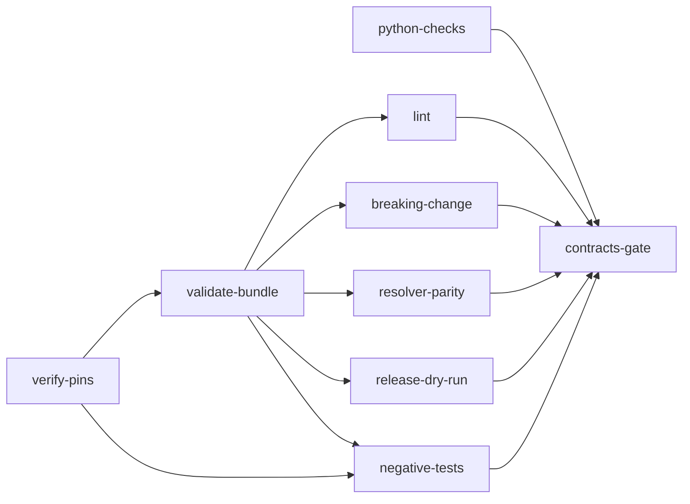

# Implementation Plan: Mission Status contract v1

**Branch**: `issue-5558-mission-status-contract-v1` | **Date**: 2026-10-01 | **Spec**: [spec.md](spec.md)
**Input**: Mission specification from `kitty-specs/mission-status-contract-v1-01M3WC5X/spec.md` (issue #5558, part of #5528)

**Note**: Filled in from the canonical plan template (`packs/built-in/missions/software-dev/templates/plan-template.md`) through `spec-kitty agent mission setup-plan`. Companion planning artifacts in this directory: [research.md](research.md), [data-model.md](data-model.md), [quickstart.md](quickstart.md), [contracts/tools-and-workflows.md](contracts/tools-and-workflows.md) and the three tracer files (`tracer-*.md`).

## Branch contract

- Current branch at plan start: `issue-5558-mission-status-contract-v1`.
- Planning/base branch and merge target recorded by the tooling: `issue-5558-mission-status-contract-v1` (`branch_matches_target: true`).
- Integration branch for the finished work: `main`, through one pull request opened as a **draft** from this branch. The PR stays a draft until a maintainer acknowledges the design on #5528 (CL-1, C-001). Implementers never merge, and nothing is pushed to `main`.
- Topology recorded in `meta.json`: `lanes`. Work packages run in lane worktrees, so write scopes below are disjoint across lanes (see tracer F-2).

## Summary

Deliver the Mission Status Read API contract as a versioned, split OpenAPI 3.1 module (`contracts/mission-status/`, plus `contracts/_shared/`), the Node-free CI that keeps it honest (a path-filtered contracts workflow and a tag-only release workflow), a reality-check test that validates payloads built from this repository's own Missions against the contract, and `CODEOWNERS` for `contracts/`. No file under `src/` changes (C-002).

Technical approach, in one paragraph. Every check that does not need a JVM is a plain Python script under `contracts/tools/`, built on one shared resolver (`contracts/tools/contract_resolver.py`) that is also the reality check's only way of reading the contract (OQ-1, decided below). The JVM-dependent steps (validate, bundle, lint, breaking-change diff) run only in the contracts workflow, behind pinned and checksum-verified tooling. A resolver-parity script, run in the same workflow, proves that the Python resolution of the split files equals the CI bundle, so there is one resolution authority or a proven-equal pair. The reality check runs exactly once per change, in the router's `tests-corpus` job, selected by one added glob (`contracts/**`). The mission opens with a distinct, behaviour-preserving tidy-first commit and a measured baseline.

## Technical Context

**Language/Version**: Python 3.11+ for `contracts/tools/` scripts and `tests/` (CI runs 3.12; no 3.12-only syntax, target is `py311`); YAML (OpenAPI 3.1, Spectral-format ruleset); a Gradle build script (Groovy or Kotlin DSL, implementer's choice, recorded in `research.md`) for the CI-only JVM step.
**Primary Dependencies**: Locked Python dependencies only (`pyyaml`, `jsonschema` with `referencing`, both already in `uv.lock`; no new Python dependency, `pyproject.toml` and `uv.lock` untouched). CI-only, pinned and verified (versions chosen and recorded at implement time in `contracts/tools/pins.json`, never invented here): a JDK from a SHA-pinned setup action, a Gradle distribution, the openapi-generator Gradle plugin and its transitive artefacts (Gradle dependency verification), vacuum (Go binary), oasdiff (Go binary).
**Storage**: Files only. Committed: split contract files, examples, `CHANGELOG.md`, `pins.json`, `verification-metadata.xml`, planted fixtures. Never committed: the bundle and its sha256 (build products, uploaded as workflow artifacts and release assets).
**Testing**: pytest for the reality check, its helper and the unit tests of each `contracts/tools/` script (single-line `corpus` marker, selected once by `tests-corpus`); pytest in `tests/ci/` for workflow-file guards (selected by the module-matrix `ci` row); a class-A negative-test job in the contracts workflow for every `contracts/tools/` script and every JVM tool (planted fixture, asserted message, clean control).
**Target Platform**: GitHub Actions `ubuntu-24.04` for the workflows; contributors' Linux, macOS, Windows for the Python tools (stdlib plus locked dependencies only). The JVM steps are CI-only; no JVM, Gradle, vacuum or oasdiff exists on the planning workstation (tracer F-7).
**Project Type**: Single repository, new top-level `contracts/` tree outside the wheel; no `src/` change.
**Performance Goals**: Reality check at most 120 s for the module and 60 s per case, fixture setup included (NFR-001); own-directory snapshot pass measured at about 0.5 s for 539 Missions and 2936 snapshot work packages on this checkout (read-only `materialize_snapshot`, zero exceptions), so the budget is dominated by payload building and jsonschema validation, measured from the CI job log at implement start. Two builds of one commit are byte-identical (NFR-002).
**Constraints**: C-001 to C-011 of the spec; plus the plan-level constraints in the sections below (seam, generated artefacts, gate set, public-repo hygiene). Public repository: no absolute host path, no e-mail address, no private-discussion reference in any file this Mission authors (C-006).
**Scale/Scope**: Five v1 resources, three event kinds, about 539 corpus Missions and 3125 work package files at measurement; 17 workflow files today, 19 after (ceiling 20).

## Charter Check

*GATE: passed before research; re-checked after design (second column).*

| Charter rule | Pre-design | Post-design | Plan element |
|---|---|---|---|
| Single canonical authority (`DIRECTIVE_044`) | pass | pass | One resolver (`contract_resolver.py`) serves the reality check and the parity script; one leak-pattern library serves the text scan and the payload scan; derived inventory regenerated by its own script, never hand-edited; the router's `gate_selection` authority is consumed, not re-encoded. |
| Architectural alignment (`DIRECTIVE_001`) | pass | pass | See "Seam" below: no `src/` change, no kernel reach, no core-loop coupling to sync or transport. |
| Tiered rigour | pass | pass | Contract and the tools that guard it are the core of this Mission and get planted-violation proof; glue (workflow YAML) is covered by guard tests and by the dry run. |
| ATDD-first (C-010) | pass | pass | Each WP's first commit is a failing test or planted fixture, red on the planning base, green on the final commit; the reviewer verifies red then green. |
| Terminology (Mission, never feature; status lane vs code lane vs repo-root lane; workflow phase vs glossary `phase`) | pass | pass | The spec's terminology section is binding on every new file; the README states the distinctions; the forbidden-property-name list is the only place legacy spellings appear, as quoted data. |
| Standing Order 1 (adversarial squad at point-cuts) | n/a here | deferred to orchestrator | This plan author was dispatched with no sub-agent budget. The squad after the plan point-cut (and the supply-chain challenge pass required by the plan prompt for dependency decisions) is requested from the orchestrator; no contested finding exists yet to disposition. Advisory, never a gate. |
| Standing Order 2 (campsite first) | pass | pass | Opening commit named in "Campsite-clean" below. |
| Standing Order 3 (tracer files) | pass | pass | Three tracer files seeded with real content. |
| Standing Order 5 (non-vacuous gates, priced debt) | pass | pass | Every check has a concrete floor and a planted-violation test; no allowlist is added (the empty-allowlist invariant holds: no ledger row, no `WORKFLOW_FILES` row, no baseline entry). The one planned list is the pinned shrink-only ceiling for the snapshot-versus-files disagreement list (FR-019), which is a ratchet over data this Mission does not own and carries an issue, owner and drain note in the PR. |
| Standing Order 6 (canonical sources) | pass | pass | Canonical plan template used; generated files are regenerated, never hand-patched (see "Generated artefacts"). |
| Standing Order 7 (git and workflow) | pass | pass | PRs only; draft until acknowledged; no version numbers in scope (C-008). |
| Pre-existing Failure Reporting Rule | pass | pass | Baseline taken before the first change; see "Baseline". |
| `NO_FULL_HEAVY_SUITES_IN_MISSION` | pass | pass | Only named gate files are run in mission work; the architectural directory is never swept. |
| `__all__` convention (applies to `src/charter`, `src/kernel`) | n/a | n/a | No file in those trees changes. |

**Drift flagged (charter wins).** The charter says nothing on GitHub enforces the PR workflow and no check can block a PR; the repository's CLAUDE.md says branch protection and review requirements enforce it. A read-only probe of the default branch returns 404 for branch protection and an empty rulesets list, so the charter is correct. This plan therefore uses "enforced" to mean "a job whose red turns `router-gate` or `aggregate-gate` red and is read by the fleet verdict", never "a GitHub required check". CODEOWNERS review is advisory for the same reason (FR-023).

## Seam: where the change lands (a)

None of kernel, doctrine, CLI or sync. The change lands at four places that sit outside the runtime layering `kernel <- charter <- {glossary, runtime, mission_runtime} <- specify_cli`:

| Surface | New or edited | What goes there |
|---|---|---|
| `contracts/` (new top-level tree, not in the wheel) | new | `_shared/`, `mission-status/`, `tools/`, `gradle/`, `README.md`. The wheel packages list and the sdist include list name `src/**` and `packs/built-in/**` (plus a few top-level files in the sdist), so nothing here ships to consumers. |
| `.github/` | new files, one edited file | `workflows/contracts.yml`, `workflows/contracts-release.yml`, `CODEOWNERS`; one glob line in `workflows/ci-router.yml`; one name in `workflows/ci-fleet-verdict.yml`. |
| `scripts/ci/` and `tests/ci/`, `tests/architectural/`, `tests/release/` | edited | One `PR_WORKFLOWS` entry in `scripts/ci/fleet_verdict.py`; expected-set edits in `tests/ci/test_fleet_verdict.py`; registry rows in `tests/architectural/test_ci_corpus_trigger_completeness.py`; the regenerated derived inventory `tests/release/pinning_rule_inventory.json`. |
| `tests/contract/` and `tests/ci/` | new | Reality check, its helper, unit tests of every script, workflow guard tests. |

Boundary rules this plan holds:

1. **No `src/` change (C-002).** The reality check composes the status domain's existing public readers from the test side only: `MissionStatus.load` (`specify_cli.status.aggregate`), `materialize_snapshot` (`specify_cli.status.reducer`), `resolve_mission_identity` (`specify_cli.mission_metadata`), `resolve_mid8` (`mission_runtime.identity`), `compute_weighted_progress` (`specify_cli.status.progress`), `reconstruct_wp_view` (`specify_cli.status.wp_view`), `dependency_readiness_for_wp` (`specify_cli.core.dependency_graph`), the tail reader (`specify_cli.status.tail_reader`), and `read_authored_wp_frontmatter` (`specify_cli.status.wp_metadata`). It never imports `kernel` internals, never opens `status.events.jsonl` with a hand-rolled parser where a public reader exists, and never rebuilds a status path by hand (ADR D-3: the API composes existing read models). A command reaching past a service into kernel internals is therefore impossible by construction: there is no command.
2. **No core-loop to sync or transport coupling.** The event stream (`GET /events`) is a documented contract only; this Mission implements no emitter, server or transport. The live hosted path (`status/emit.py` to the Zeitgeist bridge) is untouched and not described by the contract. The word "sync" appears nowhere in new files except in quoted legacy identifiers, if at all.
3. **`contracts/tools/` never imports pytest or anything under `tests/`.** `tests/contract/` imports from `contracts/tools/` (the allowed direction), by file path through `importlib.util`, because `contracts/` is not a package and `pytest.ini` puts only `src` on the path. Tools run as bare scripts (`python contracts/tools/<script>.py`) and import their sibling library modules by name, which works because a bare script's own directory is `sys.path[0]`. They import nothing from `scripts.`, so the workflow-script import guard (`tests/ci/test_workflow_script_import_guard.py`) has nothing to flag.
4. **Name collision to avoid.** `src/specify_cli/contracts/` is the shared-contract registry of the CLI (anchoring and retirement obligations), unrelated to the top-level `contracts/` tree of this Mission. The README states it in one line so a reader does not conflate them. A per-Mission `kitty-specs/<mission>/contracts/` directory is a planning artefact, also unrelated (this Mission's own is `contracts/tools-and-workflows.md` in this directory).

## Generated artefacts: what is generated, by which command (b)

Hand-patching a generated file is forbidden. This Mission touches or creates the following, and says how each is produced.

| Artefact | Generated by | Committed? | Handling |
|---|---|---|---|
| The bundled `openapi.yaml` and `openapi.yaml.sha256` per module | `contracts/tools/bundle.py`, which drives the Gradle `openapi-yaml` generator twice and compares digests | **No** (FR-001 layout check fails on a tracked bundle). Uploaded as a workflow artifact; published as a release asset. | Never edited; two builds must be byte-identical. |
| `contracts/gradle/verification-metadata.xml` | `gradle --write-verification-metadata sha256 <task>` (Java toolguide) | Yes | Regenerated by that command when the plugin pin moves; never hand-edited. The planted-tamper fixture is a copy under `contracts/tools/fixtures/`, altered by a test helper at run time, not by hand in the real file. |
| `contracts/tools/pins.json` (tool versions and sha256) | Written by the implementer from the vendor's published artefacts, then verified by `contracts/tools/verify_pins.py`; each entry records the publication date for the freshness control | Yes | The only authored (not generated) manifest; the verifier refuses an empty manifest, a missing checksum or an unpinned `uses:`. |
| `tests/release/pinning_rule_inventory.json` | `python3 scripts/ci/derive_pinning_inventory.py` | Yes | **Hidden gate, see tracer F-5.** Editing `scripts/ci/fleet_verdict.py`, `tests/ci/test_fleet_verdict.py` or `tests/ci/test_fleet_main.py` shifts recorded line numbers; the file is regenerated with its own script in the WP that makes those edits, and `tests/release/test_pinning_inventory_fresh.py` is run as a named gate. New text must not reference `ci-quality.yml`, the retired sonar job id or `make test-fast`, or the deriver reports a new rule with a null disposition. |
| Agent command copies (12 agent directories, `.agents/skills/`), Contextive glossary, doctrine schemas, DRG graph, pack manifest | `spec-kitty regen`, `spec-kitty doctrine regenerate-graph`, the glossary tooling | n/a | **Not touched.** No template, skill, doctrine artefact, glossary entry or mission-step source changes, so `spec-kitty regen --check` is unaffected. It is run once at close-out as a no-diff confirmation, not as a gate this Mission relies on. |
| Pinned expected-output fixture for the derived lifecycle values (FR-019) | A one-off extraction of the two pure derivation functions from the dashboard code as it stood at commit `d78aa2345` (recoverable with `git show d78aa2345:src/specify_cli/dashboard/scanner.py`), run once in a scratch directory over the named sample of Missions | Yes (the fixture only) | The fixture header records the commit, the two function names and the sample selection rule; the generator is not committed (it would reintroduce removed code). The reality check compares the helper's output with the fixture on every run and never skips. |
| `kitty-specs/<mission>/status.events.jsonl`, `meta.json`, `tasks/`, `tasks.md` | The `spec-kitty` CLI | Yes | Written only by CLI commands; never hand-edited. |

## Contracts: what moves and what is preserved (c)

| Contract | Verdict | Reason |
|---|---|---|
| Doctrine schemas, DRG, pack manifests | **Preserved**, not touched | No `packs/` or `src/charter/offering/` edit. |
| Mission step contracts and action indices | **Preserved**, not touched | No `packs/built-in/missions/` edit; the plan flow itself is read only. |
| `orchestrator-api` command surface | **Preserved**, not touched | No `src/` edit; the new contract describes a different, read-only resource set and does not alias `orchestrator-api` output. |
| Vendored `spec_kitty_events` upstream contract (`specify_cli/core/upstream_contract.json`, loaded by `tests/contract/conftest.py`) | **Preserved**, not touched | The new `tests/contract/` modules do not use that conftest's fixtures and must not change it. Note for implementers: the conftest's module-level load runs for every test in the directory, so a new test module there is collected under it; nothing in it conflicts. |
| `contracts/fixtures/` (handoff fixtures) and `tests/contract/test_handoff_fixtures.py` | **Preserved**, untouched (C-004; `git diff --stat` shows nothing there) | Left exactly as is. |
| `spec-kitty-events` and `spec-kitty-tracker` (external packages) | **Preserved** | Not consumed by new code beyond what the status readers already do. |
| Status event schema, `status.events.jsonl` row shapes, `meta.json` shape | **Preserved** | The contract's event projection is read-only and drops every row kind it does not allow-list (FR-007). |
| CI router filter (`ci-router.yml` `corpus` group) | **Explicitly changed, additive** | One glob line, `contracts/**`; every existing glob untouched. |
| Fleet-verdict inventory (`PR_WORKFLOWS`, the reporter's `workflow_run` list) | **Explicitly changed, additive** | One entry and one name; the finite inventory check fails closed otherwise (FR-017). |
| **New: `contracts/mission-status/` v1** | **New, explicitly versioned** | `info.version` `1.0.0` for the first release; semver rules in the README: breaking changes move the major, additive the minor, documentation-only the patch; `x-provisional` elements may change without a major bump but are diffed and reported separately (D-7). First-release baseline: the one allowed "no previous release tag" state (D-12, FR-016). |
| **New: `contracts/_shared/`** | **New, unversioned in v1** | Shared pieces (`Problem`, page cursor, `PageInfo`, parameters, responses) are versioned through the modules that reference them; a change to a shared piece is a change to every referencing module and is diffed through each module's bundle. Admission criteria are stated in the README. |
| **New: release tag namespace `contract-<module>-v<semver>`** | **New** | Disjoint from the CLI's `v*.*.*` namespace, asserted by a guard test implementing GitHub's filter-pattern semantics (FR-022). |

## Upgrade chain, migration impact and reflexivity (d)

**Upgrade and migration chain impact: none.** Reason: no file under `src/` changes, so no migration module, `spec-kitty upgrade` step, template, agent command copy, skill, mission step or schema version moves (C-002). Nothing here is installed into a consumer project; `contracts/` is excluded from the wheel and the sdist. The `contracts/**` router glob and the new workflows exist only in this repository's CI.

**Reflexivity: Missions in flight when this lands.**

1. **Runtime.** Unchanged. In-flight Missions run, claim, review and consolidate exactly as before; the Mission Status contract describes a service that does not exist yet, so no in-flight Mission sees a behaviour change.
2. **CI coupling (the one new coupling).** The router's `corpus` filter already selects `kitty-specs/**/spec.md`, `plan.md`, `tasks/**`, nested `contracts/**` and `acceptance-matrix.json`, so every Mission work-package PR already runs `tests-corpus`. After this lands that job also runs the whole-corpus reality check over every other Mission's committed data. A data defect in an unrelated in-flight Mission (partial frontmatter, a non-numeric `mission_number`, a missing event log) can therefore redden a stranger's PR. Mitigation, from the spec (R-4) and made concrete here: zero exclusions at delivery; a failure naming a Mission the PR does not touch is first classified (contract gap, reader defect, or data defect) and routed to that Mission's owner on the PR; the exclusion path (an issue, an owner and a drain date, printed in the test output) is pre-approved so a stranger's PR is never stuck; the failure output names the Mission, the work package and the JSON pointer.
3. **This Mission is part of its own corpus.** Its scaffold, its `status.events.jsonl` (which carries a git identity in a CLI-written `MissionCreated` actor, tracer F-9) and its work-package files are validated by the reality check. Corpus floors (500 Missions, 3000 file-backed payloads, 2800 snapshot work packages) are therefore re-measured at implement start and again after the last rebase, and pinned below the measured values.
4. **Readers that write.** The reality check proves it left every tracked file under `kitty-specs/` byte-identical (hash before and after) and never calls `materialize`. This is the direct consequence of the spec-phase incident (tracer F-1).
5. **Reader drift is not selected before merge** (R-14, accepted): a PR that edits a status reader selects module shards, not `tests-corpus`. The push-to-`main` run of `built-in-corpus-suite` catches it on the next merge. The README tells reader authors to run the reality check locally (one command), and the PR body names the uncovered reader paths so a maintainer can add them to the `corpus` group later.
6. **History.** The branch already contains one merge of `main`. Before the first implementation commit, and again at PR prep, the branch is re-synced onto current `main` (rebase, then the compact-history step of `mission-wrap-up-sequence`) and every cited path in this plan is re-verified (R-1, R-2).

## The gate set (e)

Verified on this checkout from `.github/workflows/` and `.github/ci-module-registry.yml`. "Enforced" has the meaning given under Branch contract: the job's red makes the router, modules or aggregate gate red and is observed by the fleet verdict; no GitHub required check exists.

### Existing gates, re-verified

| Gate | Where | Status on this checkout | In this Mission's gate set? | Reason or how |
|---|---|---|---|---|
| `ruff check .` and `ruff format --check .` (whole repo) | `ci-router.yml` `ruff` job; `ci-quality.yml` `lint` job | Enforced | **Yes** | New Python under `contracts/tools/` and `tests/`. Rules in force include `S` (bandit) and the banned-API list: `hashlib.sha256` is banned (TID251) outside charter use, so checksum code carries a one-line `# noqa: TID251` with a file-integrity justification (the ban message permits exactly that), and any XML read of `verification-metadata.xml` avoids `xml.etree` (S314) by a narrow regex or a justified suppression. Run locally as `ruff check .` and `ruff format --check .` with the venv binary. |
| `uv lock --check` | `ci-router.yml` `uv-lock`; `ci-quality.yml` `uv-lock-check` | Enforced | No (run once at close-out) | No dependency, extra or `pyproject.toml` change, so the lock cannot go stale; a close-out run confirms. |
| TID251 import-linter (`ruff check --select TID251 .`) | `ci-router.yml` `import-linter` | Enforced | **Yes** (inside the ruff run) | Same ruleset; the sha256 ban is the live risk. |
| `spec-kitty regen --check` | `ci-router.yml` `regen-check`; `packs.yml` `built-in-regen-check` | Enforced | No (run once at close-out) | No template, skill, doctrine or mission-step change (see Generated artefacts). |
| Terminology guard | `ci-router.yml` `terminology` (`tests/architectural/test_no_legacy_terminology.py`) | Enforced (two retired terms only; the Mission-versus-feature half is review-enforced) | **Yes** | Cheap (about 0.1 s), and new prose lands in `tests/` and `docs/`. |
| Layer rules | `ci-router.yml` `layer-rules` (`tests/architectural/test_layer_rules.py`, `test_pyproject_shape.py`) | Enforced | No | They pin `src/` import direction and `pyproject.toml` shape; this Mission touches neither. |
| Archive freeze | `ci-router.yml` `archive-freeze` | Enforced | No | Guards frozen archive roots; nothing archived is touched. |
| Architectural heavy battery | `ci-router.yml` `architectural-heavy` (code-scoped; selected here because `tests/architectural/**` is edited) | Enforced, CI-owned | **Named files only** (below) | Charter: no full architectural sweep in mission work. CI runs the full battery on the PR. |
| Routed test groups (`tests-consolidation`, `tests-status`, `tests-cli`, `tests-docs`, `tests-e2e`) and `tests-corpus` | `ci-router.yml`; `router-gate` aggregates | Enforced | `tests-corpus` yes (it is the reality check's home); the others no | The others are selected by paths this Mission does not touch (verified by simulation, below). |
| Per-module shards and `modules-gate` | `ci-modules.yml` with `.github/ci-module-registry.yml` | Enforced | **`ci` module only** | `tests/ci/**` and `scripts/ci/**` select the `ci` row; no other module row is selected by this diff (simulated). `tests/contract` is registry-excluded by design and is not claimed (editing the registry would be a conflict with the open CI PR). |
| diff-cover at least 90 percent of changed critical-path lines | `ci-aggregate.yml` `diff-cover` | Enforced, but vacuous here | No | It scores changed `src/` lines. This diff changes none, so it has nothing to score. Behaviour on a zero-line diff is verified at implement start against an existing no-`src/` PR, and recorded. Coverage of new test-helper code is therefore **local discipline only** (NFR-007: the local `pytest --cov` run over the helper). |
| Wheel build and `clean-install-verification` | `ci-quality.yml` | Enforced | No | `contracts/` is outside the wheel include list; guarded by `tests/cross_cutting/packaging/test_packaging_safety.py`, which is not edited. |
| Packs gate | `packs.yml` (`built-in-regen-check`, DRG check, pack-manifest, `built-in-corpus-suite`, plugin validate, internal validity, packaging safety) | Enforced | No, with one exception | No `packs/` change selects the lanes on a pull request. The exception is the one that matters: on a push to `main`, and on a diff touching the packs `built_in` filter paths, `built-in-corpus-suite` also collects every `corpus`-marked test, so the reality check and every `contracts/tools/` unit-test module must pass there too, with no JVM and `--cov=src/doctrine`. |
| Release readiness, shared-package drift, Windows critical, docs pages | `release-readiness.yml` (path filter includes `kitty-specs/**`), `check-spec-kitty-events-alignment.yml`, `ci-windows.yml`, `docs-pages.yml` | Enforced where triggered | No | Release readiness is selected by the Mission's own `kitty-specs/**` files and is read-only against this Mission; the others are not selected. |
| Fork guard | `tests/ci/test_fork_guard.py` | Enforced | **Yes** | Both new workflows have a `push` trigger, so every root job needs the canonical guard. |
| Fleet verdict and fleet main | `tests/ci/test_fleet_verdict.py`, `tests/ci/test_fleet_main.py` | Enforced | **Yes** | The contracts workflow is a `pull_request` workflow and joins the finite inventory. |
| Workflow-count ceiling | `test_reusable_workflow_ceiling_respected` in `tests/architectural/test_module_shard_registry.py` | Enforced | **Yes** | 17 workflow files today, 19 after, ceiling 20 (re-verified after the rebase, because open PR #5557 may consume the slot). |
| Duplicate-suite and workflow-coherence gates | `tests/architectural/test_no_duplicate_suite_execution.py`, `tests/architectural/test_workflow_coherence.py` | Enforced | **Yes** | Neither new workflow invokes pytest, so no ledger row and no `WORKFLOW_FILES` row is added; `contracts/**` must match at least one tracked path once the tree exists. |
| Corpus-trigger completeness | `tests/architectural/test_ci_corpus_trigger_completeness.py` | Enforced | **Yes** | Registry rows only; its glob and data-root sets are not edited (#5557 rewrites them). |
| Router derivation guards | `tests/architectural/test_gate_selection_authority.py`, `tests/architectural/test_ci_router_transcription_guards.py` | Enforced | **Yes** | The router is edited. The `corpus` group is not a row of the scrub JSON `groups` list, so the verbatim-derivation guard does not apply to it (read, not assumed; the file is run). |
| Derived pinning inventory freshness | `tests/release/test_pinning_inventory_fresh.py` | Enforced (hidden) | **Yes** | See tracer F-5; the baseline passed. |
| Router prose-only down-route | `scripts/ci/prose_only.py` via `ci-router.yml` `prose-scan`; `tests/ci/test_prose_only.py` | Enforced | **Yes** (a new pin test, below) | R-11 answered below. |

**Not enforced (local discipline only, stated so nobody relies on them):**

- commitlint: the `commit-msg` job only prints `git log` subjects and ends in `|| true`; commit subjects are conventional by discipline, and the scaffold commit's legacy wording is fixed at PR prep (tracer F-3).
- markdownlint: `npx --yes markdownlint-cli2 "**/*.md" || true` cannot fail. This Mission neither relies on it nor adds a Node markdownlint step (C-005); the README and CHANGELOG structural check is a Python script instead.
- Bandit and pip-audit as separate jobs do not exist; ruff's `S` rules are the only security lint in force.
- mypy does not run in any workflow, and `ruff.toml` carries a legacy baseline. New Python is written to pass `mypy --strict` anyway (charter), checked locally, as local discipline only.
- The named 90 percent floors for `kernel` and the mission-loader do not exist as jobs; irrelevant here.
- SonarCloud on pull requests (`sonar-pr`) is informational and `continue-on-error`.
- Typer JSON error surface, `patch()` target hygiene and Contextive freshness have no dedicated job; none applies (no CLI or glossary change).

### New gates this Mission adds, and where each runs

| New gate | Runs in | Runner | Selected by | When it cannot do its job (silent-success rule, D-15) |
|---|---|---|---|---|
| Reality check (floors, controls, snapshot equality, read-only hash) | `tests-corpus` (once per change); also `built-in-corpus-suite` on push to `main` by existing design | pytest, `tests/contract/test_mission_status_reality.py` | Router glob `contracts/**` | Fails, never skips: fewer than 500 Missions, zero work packages, an unavailable resolver or contract, an invalid payload, or any tracked `kitty-specs/` file changed. Collection of zero tests is already an exit-5 failure in `tests-corpus`. |
| Resolver parity | Contracts workflow `resolver-parity` job | `contracts/tools/resolver_parity.py` | Workflow path filter | Exits non-zero naming the first differing JSON pointer; also when the bundle is missing or empty, the resolver cannot be imported, or fewer than five path items, zero schemas or zero resolved references were compared; prints the three counts. |
| Validate, bundle (and determinism) | `validate-bundle` job | Gradle `openapi-generator` plugin via `contracts/tools/bundle.py` | Path filter | Zero modules found, a module without a root `openapi.yaml`, a missing JVM or Gradle, a checksum mismatch, a plugin resolution failure, an empty bundle, fewer than five paths, or two differing builds: all non-zero, naming module and cause. |
| Lint | `lint` job | vacuum with the Spectral-format ruleset in `contracts/` | Path filter | Missing or empty ruleset, zero rules loaded, zero files linted, missing binary or mismatching checksum: non-zero. |
| Breaking-change diff | `breaking-change` job | oasdiff via `contracts/tools/breaking_check.py` | Path filter; full history with tags | No baseline and not the initial version, a shallow checkout, a tag listing error, an unfetchable baseline, a missing tool: non-zero. The one allowed "no baseline" state is printed loudly and written to the job summary. |
| Layout, citation, provisional, example and orphan-example, event-mapping, enum-pinning, leak and text-level scans, README and CHANGELOG structure, CODEOWNERS, no-pytest scan, pin and checksum verification | `python-checks` job | `contracts/tools/*.py` | Path filter (`contracts/**`, `.github/CODEOWNERS`, the workflow file itself) | Each asserts a minimum input count before checking properties and fails on zero (matrix in FR-025). |
| Negative tests (class-A evidence) | `negative-tests` job | Each script and tool against committed planted fixtures under `contracts/tools/fixtures/`, with a clean control | Path filter | Passes only if the check failed **for the expected reason** (stable message code asserted), and a control run on the same fixture root passed. |
| Release dry run | `release-dry-run` job of the contracts workflow (pull request); `contracts-release.yml` `workflow_dispatch` dry-run mode after merge | `contracts/tools/release_check.py` and the shared build wrapper | Path filter | Empty bundle, sha256 mismatch, a tag that violates the rules, a missing module or version, zero modules, or a module-root parameter naming a directory with no module: non-zero before any publication step. |
| Workflow guard tests (shape, no Node, no pytest, fork guard, SHA pin, publish-step condition, tag namespace) | `ci` module shard | pytest, `tests/ci/test_contracts_workflows.py` | Module-matrix `ci` row | Each first asserts it parsed at least one workflow file, job, `uses:` line, publish step and CLI release tag; a test that found nothing fails. |
| Router selection pin (new) | `ci` module shard | pytest, `tests/ci/test_contracts_routing.py` | Module-matrix `ci` row | Asserts the glob is present exactly once, that a contracts-only path set selects `tests-corpus` and no module shard, and the R-11 effect below; fails on an empty router filter. |
| `contracts-gate` terminal job | Contracts workflow | Shell step over `needs.*.result` | n/a | Fails when any needed job is anything but `success` on a non-fork run, so a skipped job is never read as a pass. |

### Where this plan departs from, or adds to, the spec's gate analysis

- **Added gate: the derived pinning inventory** (`tests/release/test_pinning_inventory_fresh.py`). Not in the spec; found while reading which tests pin the files the spec's FR-017 edits (tracer F-5).
- **`tests/ci/test_fleet_main.py` probably needs no edit.** The spec (FR-017 (d)) says its conditional-gate expectations gain the contracts workflow. On this checkout `MainAPI` builds a run for every `PR_WORKFLOWS` member, and `test_absent_conditional_gate_is_explicit_and_its_failure_is_observed` pops only the drift workflow, so adding a member should not change it. The WP runs the file red-first after the `PR_WORKFLOWS` edit and edits it only if a test says so; the spec's "(d)" is treated as a possibility, not a requirement.
- **Router selection, verified by simulation** (not assumed): with the glob added in a scratch copy of the workflow, `select_gates` for `contracts/mission-status/openapi.yaml` and for `contracts/tools/<script>.py` selects the `corpus` group, the `tests-corpus` job, and no code shard and no module shard; `.github/CODEOWNERS` alone selects nothing in the router (the contracts workflow's own path filter covers it). Without the glob, a contracts-only change selects no test job at all.
- **R-11 (prose-only down-route), answered.** `prose_only_pr_verdict` treats a path matching the router's `docs` or `corpus` globs (matched with `fnmatch`, where `*` crosses `/`) as a doc or corpus path. After the glob, any file under `contracts/`, including `contracts/tools/*.py`, counts as such. Effect: a diff made only of `contracts/**` files and docstring-only Python edits can classify as prose-only and skip code shards, which is harmless here because no code shard covers `contracts/`. `tests/ci/test_contracts_routing.py` pins this so a later change to the classifier cannot silently alter it.

## Baseline: pre-existing red versus introduced red (f)

**Rule.** The charter's Pre-existing Failure Reporting Rule: a pre-existing failure encountered is reported in a tracker issue (command run, failure summary, why it is believed pre-existing) before it is treated as accepted baseline; it is never absorbed or blamed on this Mission without a base measurement. The old counts from the closed #3284 are stale and are not used. The shared test-venv lock timeout (#3283) is recognised as an environment failure, never as a product red.

**Taken during planning (on this branch's planning base, tree identical to `main` for every file under test).** One invocation, targeted files only:

- `tests/architectural/test_ci_corpus_trigger_completeness.py`, `test_no_duplicate_suite_execution.py`, `test_workflow_coherence.py`, `test_module_shard_registry.py`
- `tests/ci/test_fork_guard.py`, `test_fleet_verdict.py`, `test_fleet_main.py`
- `tests/release/test_pinning_inventory_fresh.py`

Result: **265 passed, 1 skipped, 0 failed** (68 s). So the named gate set is green on the base; any red in those files after a change is introduced by the change.

**To be taken at implement start (WP01, before its first change), recorded in the PR body and in `tracer-approach.md`:**

1. Re-sync onto current `main`; record the base commit.
2. Re-run the planning-time command above (all green is the expected baseline).
3. Add `-m corpus` over `tests/contract` only (the pre-existing corpus-marked modules of that directory) and the two router-derivation guards (`test_gate_selection_authority.py`, `test_ci_router_transcription_guards.py`).
4. Re-measure the floors: Missions with `meta.json`, `tasks/WP*.md` files, summed own-directory snapshot work packages, status-lane and topology coverage, and the disagreement list (indicative at planning: 539, 3125, 2936, 52 with 45 fewer and 7 more; a read-only pass of `materialize_snapshot` over every Mission directory took about 0.5 s with zero exceptions). Figures that differ between a developer clone and the `tests-corpus` log are a defect in the own-directory pass, fixed before any number is pinned.
5. Read one `tests-corpus` job log on a recent base for the whole-job duration against its 10 minute timeout (headroom of at least 50 percent after this Mission's tests, NFR-001).
6. Confirm how `diff-cover` behaves on a PR with no changed `src/` lines (read an existing docs-only PR's aggregate result).

Any red found in steps 2 to 3 is binned (pre-existing known-P0, CI-environment, stale install, stale venv, or introduced), and a pre-existing one is reported as a tracker issue before work continues; it is not folded into this Mission.

## Campsite-clean (g)

**Opening commit (distinct, behaviour-preserving, tidy-first):** `refactor(ci): name the path-filtered pull-request workflows once in the fleet-verdict applicability test (#5558)`.

- **Surface and debt.** `tests/ci/test_fleet_verdict.py::test_all_existing_pr_workflows_are_registered` repeats the same hand-written set of path-filtered workflow names (`release-readiness.yml`, `check-spec-kitty-events-alignment.yml`) across three assertions. This Mission's FR-017 edit must add the contracts workflow to exactly those sets, so the function is "about to change". Hoisting the pair into one named module constant, used by the assertions, removes the duplicated literal (the Sonar S1192 class named in the repo's own expectations) and turns the later edit into a one-element change.
- **Behaviour-preserving proof.** The same test ids pass before and after with identical counts, and each assertion's expected value is unchanged (the constant holds exactly today's pair). Verified by running `tests/ci/test_fleet_verdict.py` before and after and recording both counts.
- **Fenced.** One test file only, no production code. The constant does not mention `ci-quality.yml`, the retired sonar job id or `make test-fast`, so the derived pinning inventory gains no new rule; because the edit shifts line numbers the inventory is regenerated with its own script in the same commit (tracer F-5).
- **Not a grab-bag.** Nothing else is tidied. In particular the stale `_CORPUS_GLOBS` documentation in `test_ci_corpus_trigger_completeness.py` and the legacy `ruff.toml` baseline are left alone (open PR #5557 rewrites the first; the second is unrelated). No `src/` debt is folded: C-002 forbids it, and the status readers this Mission cites are consumed, not changed.
- **Not read.** No Sonar report was fetched (informational, token-free read is available but not needed); the debt above was found by reading the methods about to change.

## Project structure

### Documentation (this mission)

```
kitty-specs/mission-status-contract-v1-01M3WC5X/
├── spec.md                              # specify output (done)
├── plan.md                              # this file
├── research.md                          # decisions, alternatives, verification ledger
├── data-model.md                        # contract entities, projection rules, derivations
├── quickstart.md                        # how an implementer runs every check locally
├── contracts/
│   └── tools-and-workflows.md           # the internal contract between WPs: script CLIs, message codes, job graph
├── tracer-tooling-friction.md           # charter standing order 3
├── tracer-approach.md
├── tracer-design-decisions.md
├── reviews/                             # spec-phase review trail (existing)
└── tasks.md                             # NOT created by plan (/spec-kitty.tasks)
```

### Source code (repository root)

```
contracts/
├── README.md                            # conventions (FR-001)
├── fixtures/                            # existing handoff fixtures, UNTOUCHED (C-004)
├── _shared/
│   ├── schemas/  (Problem, PageCursor, PageInfo, _index.yaml)
│   ├── parameters/  (_index.yaml, page parameters)
│   └── responses/  (_index.yaml, shared Problem response)
├── mission-status/
│   ├── openapi.yaml                     # info, servers, tags, path-to-file map only
│   ├── CHANGELOG.md
│   ├── paths/                           # project.yaml, missions.yaml, missions_{missionId}.yaml,
│   │                                    # missions_{missionId}_work-packages_{wpId}.yaml, events.yaml
│   ├── schemas/  parameters/  responses/  examples/   (each with _index.yaml where specified)
├── gradle/
│   └── verification-metadata.xml        # generated, strict dependency verification
├── build.gradle.kts (or build.gradle), settings.gradle.kts (or settings.gradle)
├── .vacuum / ruleset (Spectral-format file; exact name chosen at WP07)
└── tools/                               # NOT a module (no root openapi.yaml), ignored by the layout check
    ├── contract_resolver.py             # the single resolution authority (library)
    ├── leak_patterns.py                 # the single leak-pattern authority (library)
    ├── layout_check.py  citation_check.py  provisional_check.py  example_check.py
    ├── event_mapping_check.py  enum_pin_check.py  leak_scan.py  structure_check.py
    ├── codeowners_check.py  no_pytest_scan.py  verify_pins.py
    ├── bundle.py  breaking_check.py  resolver_parity.py  release_check.py  install_tools.py
    ├── pins.json
    └── fixtures/                        # planted violations and clean controls, one subdirectory per check

.github/
├── CODEOWNERS                           # new
└── workflows/  contracts.yml  contracts-release.yml  (new)   ci-router.yml (+1 line)   ci-fleet-verdict.yml (+1 name)

scripts/ci/fleet_verdict.py              # +1 PR_WORKFLOWS entry
tests/contract/                          # reality check, helper, helper unit tests, unit tests per tool, pinned expected-output fixture
tests/ci/                                # test_contracts_workflows.py, test_contracts_routing.py, edited test_fleet_verdict.py
tests/architectural/test_ci_corpus_trigger_completeness.py   # registry rows only
tests/release/pinning_rule_inventory.json                    # regenerated, derived
.gitignore                               # + .gradle/ (bundle output is already covered by the existing build/ ignore)
CHANGELOG.md                             # [Unreleased] entry
docs/development/reference/ci-gate-mechanics.md   # short section on the contracts gates
```

**Structure Decision.** One new top-level tree for the contract and its tooling, one new `tests/contract/` module family for the Python-side proofs, and the minimum edits to shared CI. Rejected: placing the tools under `scripts/ci/` (the module-matrix `ci` row would select them, but an edit confined to `contracts/` would then not select them; D-19 requires each check to run on exactly the edits it guards), and placing the resolver under `src/` (C-002).

## Architecture

### Design decisions that bind the work packages

**D-P1 OQ-1 resolution: a Python reference resolver, proven equal to the CI bundle.** See the decision register below. The reality check, the parity script and every `contracts/tools/` check read the contract through `contracts/tools/contract_resolver.py`: one authority, imported by file path.

**D-P2 Checks read the resolved tree, not the bundle.** Layout is checked on the files; citation, provisional, example, event-mapping, enum and leak checks run over the resolver's fully dereferenced tree. That keeps all of them JVM-free, locally runnable and fast, and the parity job proves the tree equals the bundle. If parity ever fails, every check's conclusion is suspect, so parity is a `needs` of the terminal gate and the first thing to read on a red run.

**D-P3 Stable message codes.** Every script prints failures as `CONTRACT-CHECK <name>: <CODE>: <detail>` and one final `counts:` line; exit 1 for a violation, exit 2 for "cannot do its job" (missing input, empty corpus, missing tool). Negative tests assert the code, not just a non-zero exit (FR-021). Full table in `contracts/tools-and-workflows.md`.

**D-P4 Contracts workflow job graph** (one workflow file, no pytest on any event):



`python-checks` and `verify-pins` are root jobs with the canonical fork guard. The JVM jobs share one `install_tools.py` step that downloads over HTTPS, verifies sha256 against `pins.json` **before** anything executes, and refuses an empty manifest. No tool is installed through an unpinned package-manager command; no caching of tool or Gradle directories (reproducibility over speed).

**D-P5 Release workflow.** Triggers: tag push `contract-*-v*.*.*` and `workflow_dispatch` with a dry-run input defaulting to true. One job, top-level permissions `contents: read`, the job alone granted `contents: write`. It calls the same `install_tools.py`, `bundle.py` and `release_check.py` as the dry-run job; publication is `gh release create` (the runner's CLI, no third-party action), every publish step gated by `github.event_name == 'push' && startsWith(github.ref, 'refs/tags/')`. No `pull_request` trigger, no branch push, no Node, no pytest.

**D-P6 Breaking-change baseline is rebuilt, not downloaded.** `breaking_check.py` lists tags matching `contract-<module>-v<semver>` (failing on a shallow clone), extracts the module and `_shared/` at the latest tag with `git archive`, builds that baseline with the same pinned Gradle build and compares with oasdiff. Rebuilding needs no network call to a release host and exercises the same code path as the candidate. A release asset is not used as the baseline source (FR-016 allows either).

**D-P7 Workflow triggers carry `branches: [main]`** on both `pull_request` and `push` of the contracts workflow, with exactly the three paths of FR-017 (`contracts/**`, `.github/CODEOWNERS`, the workflow file). This matches how the repository's other path-filtered workflows are written and keeps the fleet-verdict applicability set honest for release-branch pull requests (the existing release-branch expectation in `tests/ci/test_fleet_verdict.py` is unchanged).

**D-P8 Reality check layout.** One helper module `tests/contract/_mission_status_payloads.py` (builders, projection and derivation functions, redaction, leak classes; no test collected from it) with its own unit-test module; one test module `tests/contract/test_mission_status_reality.py` with a parametrised per-Mission test (case id is the directory name) and a few corpus-level tests, each corpus-level test marked with an explicit `timeout` and the rationale beside it. Setup is lazy per case (a module-scoped fixture would charge the whole build to the first test and break the 60 s per-case budget). The own-directory pass (floors, ceilings, disagreement list) is a separate cheap function.

**D-P9 Pinned expected-output fixture** lives with the tests (`tests/contract/` fixture file, JSON), holds the lifecycle values for a named sample of Missions where the file set and the snapshot set agree, each documented quirk (blocked-only reads as planned; all-canceled with `acceptedAt` reads as done) and each lifecycle value, and records its provenance in its header.

**D-P10 No bulk edit.** The Mission creates new identifiers and does not rename any existing one; `occurrence_map.yaml` is not produced.

### Decision register: open questions resolved (k)

| ID | Question | Decision | Reason |
|---|---|---|---|
| **OQ-1** | How does the reality check get a real verdict in the JVM-less corpus jobs? | **Python reference resolver `contracts/tools/contract_resolver.py`, proven equal to the CI bundle by `resolver_parity.py` in the contracts workflow.** The resolver implements only what the contract uses (relative file `$ref`, in-file JSON pointer, sibling keywords next to `$ref`, `allOf`/`oneOf`/`anyOf`), refuses anything else loudly (an unknown keyword form, a URL `$ref`, a cycle), and returns one dereferenced tree. Parity compares that tree with the fully dereferenced bundle, key order ignored, after applying only the **named normalisations** discovered by the fidelity spike (R-3 in `research.md`); each normalisation has a planted test, and an undocumented difference fails. | The rejected options all break a spec constraint: giving `tests-corpus` and `built-in-corpus-suite` a JDK edits two existing jobs (C-003, FR-017, SC-008); consuming a committed bundle violates "never committed" (CL-5, FR-001); downloading the CI artefact into a test makes the test depend on a prior job, the network and fork-safe tokens, and gives a local run no verdict. A second resolver with no equality proof was excluded by the OQ-1 constraint itself. |
| **OQ-4** | DEV-1 and DEV-2: confirm or overturn the realised reading. | **Closed for planning by operator ruling 2026-10-01: ACCEPTED.** The reality check runs **once**, in the router's `tests-corpus` job (selected also by `contracts/**`); the contracts workflow runs the resolver-parity check instead of a second pytest run. The plan builds exactly that: no ledger row, no `WORKFLOW_FILES` row, no deselection from `tests-corpus`. DEV-2 (the PR-green dry run is the contracts workflow's `release-dry-run` job; the release workflow has only a tag push and `workflow_dispatch`) is planned as written, because OQ-4 as the spec states it covers both and the ruling closes OQ-4. The PR body still lists both deviations as confirmation items (SC-010). | Keeps the Python suites' critical path unchanged and the exactly-once invariant checkable. **Operator question E-2 below** asks only to confirm the ruling's scope includes DEV-2. |
| PQ-1 | Which Gradle provisioning keeps FR-018 and R-10 both true? | **No committed wrapper jar.** The workflow downloads the pinned distribution archive over HTTPS, verifies its sha256 from `pins.json`, unpacks it and runs it. | R-10 prefers a pinned distribution over a binary in the repository. FR-018's parenthetical names `distributionSha256Sum`, which is a wrapper property and needs the wrapper; the manifest check delivers the same guarantee (a mismatching or missing checksum fails before execution). Departure from the literal parenthetical is recorded here and in the PR body. |
| PQ-2 | Where do tool pins live? | One committed `contracts/tools/pins.json` plus `gradle/verification-metadata.xml`. | One checksum authority; the verifier and the installer read the same file. |
| PQ-3 | Source of the breaking-change baseline? | Rebuild from the latest matching tag (D-P6). | No network host dependency, same build path; first release is the loud no-baseline state. |
| PQ-4 | Workflow trigger branch scope? | `branches: [main]` (D-P7). | Consistent with sibling path-filtered workflows; no release branch carries `contracts/`. |
| PQ-5 | How does the read-only proof hash tracked files? | Hash the bytes of every file listed by `git ls-files kitty-specs` before and after the whole build, fail on any difference, fail when it hashed zero files. | Cheap, exact, and independent of which reader a future edit introduces. It requires `git` in the test environment (present in both corpus jobs). |
| PQ-6 | Does the pinning inventory need regenerating? | Yes, in the WP that edits the three files; its freshness test is a named gate (tracer F-5). | Hidden byte-for-byte gate. |
| PQ-7 | CHANGELOG and docs? | One `[Unreleased]` entry in `CHANGELOG.md` (docs-lint checks its style) and a short section in `docs/development/reference/ci-gate-mechanics.md` (frontmatter `updated` bumped). `contracts/README.md` is the contract's own documentation. | Charter documentation standards; a new workflow family deserves a place in the existing gate-mechanics reference. |
| PQ-8 | Unversioned `_shared/`? | Yes for v1 (see Contracts). | Versioning a shared directory separately would need a second release stream the spec does not ask for. |
| PQ-9 | Which Python checks run on which edit? | All `contracts/tools/` checks run on any `contracts/**` edit (path filter), including README and CHANGELOG edits. | D-19: each check runs on exactly the edits it guards. |
| PQ-10 | The citation resolver and dataclass fields. | The resolver treats annotated class-level targets (`x: int` with no value) as defined names, in addition to `def`, `class` and assignment targets. | The stream cursor's `invariant` is the field `content_invariant` of the `TailCursor` dataclass in the tail reader, a bare annotation. Without this the spec's own citation could not resolve. |
| **E-1** | **Escalation (conditional).** If the bundler fidelity spike (R-3) shows the openapi-generator `openapi-yaml` output drops or rewrites 3.1 constructs the contract relies on (extension keywords on nested properties, `unevaluatedProperties`, type arrays, sibling keywords beside `$ref`), what then? | **Not decided here; escalated.** Candidate fallbacks, in the order the plan prefers: (a) a longer, documented normalisation list in the parity script; (b) a different Node-free bundler for the same Gradle validate step (for example the bundle command of the Go linter already pinned), which changes CL-6 and needs a maintainer decision. | CL-6 names the generator; a tool swap is a decision for the maintainers, not for the plan author. The spike is the first task of WP07 so the question is answered early, with CI evidence. |
| **E-2** | **Escalation.** Does the 2026-10-01 ruling closing OQ-4 include DEV-2? | Planned as included (see OQ-4). Asked once, in the draft PR, with DEV-1 and DEV-2 both listed. | Avoids silent scope reading. Non-blocking. |
| **E-3** | **Operator action.** Publish the UI early-start commit to the UI team on #5528. | Recorded in this plan and in the PR body; the comment itself is an operator action (the plan author posts nothing). | The UI team is outside this repository. |

### Dashboard references re-verified against the current tree (l)

Main (including #5545 and #5530) is merged into this branch. `git ls-files` shows no tracked file under `src/specify_cli/dashboard/` (an untracked residue directory exists on disk, tracer F-10); `scanner.py` and `api_types.py` are gone. Dashboard code is still readable, read-only, at the recorded base commit (`git show d78aa2345:<path>`), which is an ancestor of this branch. Surviving sources were checked by reading the file and grepping the symbol.

| Spec citation (deleted source) | What the spec uses it for | Correction in this plan |
|---|---|---|
| `scanner.py` `_derive_mission_status` | Lifecycle derivation (D-5) | No code source survives: `x-derived` with the rule in the schema description and inputs `statusLaneCounts`, `wpTotal` (contract fields) and the `meta.json` keys read through `MissionIdentity` / `load_meta` in `specify_cli/mission_metadata.py`. The pinned fixture (D-P9) is the executable check. |
| `scanner.py` `_derive_next_action` | `nextAction` (provisional) | `x-derived`, provisional; inputs `statusLaneCounts`, `acceptedAt` and the merge baseline key in `meta.json`. No `x-source` to the deleted file. |
| `scanner.py` `build_mission_registry`, `scan_all_features` | Mission count, registry cross-check | `missionCount` is `x-derived` from the overview record count only (FR-003); the registry is not a cross-check any more (no code to run), the reality check's own count is the definition. |
| `scanner.py` `get_workflow_status` | Workflow phases | `x-derived` rules of FR-005; inputs are artefact presence plus the seven lifecycle event type constants (`SPECIFY_STARTED` and siblings in `specify_cli/status/lifecycle_events.py`), which exist. |
| `scanner.py` friendly-name fallback, WP title read, subtask progress, prompt body read, accepted and discarded stamps | `friendlyName`, `title`, `subtaskProgress`, `promptMarkdown`, `acceptedAt`, `discardedAt` | `friendlyName`: `friendly_name` in `specify_cli/mission_metadata.py` (the `MissionIdentity` field) with the slug fallback written as an `x-derived` rule. `title`, `phaseLabel`, authored lists, `promptMarkdown`: `read_authored_wp_frontmatter` (returns metadata and body) and `WPMetadata` in `specify_cli/status/wp_metadata.py`. `subtaskProgress`: `x-derived` from the `subtasks` mapping in `WPView` (`specify_cli/status/wp_view.py`). `acceptedAt`, `mergedAt`, `discardedAt`: the stamping functions and `MissionIdentity` fields in `specify_cli/mission_metadata.py`. |
| `api_types.py` | (cited indirectly by the data-shape note) | No contract field cites it; nothing to replace. |
| ADR cites of `scanner.py` line numbers | Context in `docs/adr/4.x/2026-10-01-2-mission-status-read-api-and-dashboard-extraction.md` | Not edited (a Proposed ADR; C-011). Treated as history. |
| Spec "Citation drift check" sentence saying #5545 "has merged ... after this branch's base" | Risk R-2 | Now true of the branch itself: main is merged in. The rebase step (Reflexivity item 6) still applies before implementation. |
| `tests/ci/test_corpus_blocking_home.py` (spec C-003, R-1) | Test added by open PR #5557 | Does not exist on this checkout; cited as future. Re-checked after each rebase. |
| `.kittify/release/downstream-verified.json` (D-16 item 1, in `_CORPUS_GLOBS`) | Doc glob of the corpus-completeness test | Does not exist on disk; harmless (documentation of a path set that no gate reads) and left alone. |

Also confirmed to exist and still correct: `MissionStatus.load` and `CoordinationBranchDeleted` (`specify_cli/coordination/surface_resolver.py`; the aggregate also names `CoordAuthorityUnavailable` and `MissionMetadataUnavailable` in `specify_cli/status/aggregate.py`, which the helper must treat the same way as the spec's "36 Missions fall back to own-directory" case), `materialize_snapshot`, `reconstruct_wp_view`, `compute_weighted_progress`, `ProgressResult`, `dependency_readiness_for_wp`, `resolve_mid8`, `poll_once`, `TailCursor`, `PollResult`, `ResumeRefused`, `decode_actor`, `actor_identity_str`, `StaleState`, `ProjectIdentity`, `StatusSnapshot`, `StatusEvent`, `Lane`. One naming point: the stream cursor's contract field `invariant` is `content_invariant` on `TailCursor`; the citation names the class and attribute (PQ-10).

## Test strategy per acceptance criterion (i)

Rule for every row: the test fails when the change is reverted, and its first commit is red on the planning base (C-010). "Planted" means a committed fixture or a run-time assembled value; planted values in test code are assembled from fragments so test sources do not hold literal paths or addresses.

| FR (spec) | Red-first test (fails on revert) | Where it runs |
|---|---|---|
| FR-001 layout and README | `layout_check` unit tests: one planted violation per rule listed in the AC (bad path-file name, root maps a missing file, orphan path file, schema name differs from file, `_index.yaml` lists a missing or omits a present file, URL or absolute or `~1` `$ref`, `_shared/` used for a module-specific piece, tracked bundle), each with a clean control on the same fixture; `structure_check` unit tests for the README and CHANGELOG headings (planted missing heading, zero headings read); `git diff --stat` shows nothing under `contracts/fixtures/` | `tests-corpus` (unit); `negative-tests` (class A) |
| FR-002 shared pieces | Lint fixture: a path file declaring a non-2xx response with another content type fails; example validation of `Problem` | `lint` and `negative-tests` |
| FR-003 to FR-006 resources | Reality check: `missionCount` equals the number of overview records; list strictly ordered by `createdAt` descending then `missionId` ascending; the overview builder run with reads of `tasks/WP*.md` trapped (patched `open` and `Path.read_text`); phase-rule unit tests for every branch with planted lane-count fixtures; snapshot-equality assertion with a positive and a negative control (frontmatter `lane`, `agent`, `assignee` deliberately differ from the event log); a bad `basis` entry fails | `tests-corpus` |
| FR-007 event stream | `event_mapping_check` with a planted name without a schema and a schema without a name, and zero names found; reality check projects every committed log, validates every projected event, asserts at least one event of each row-derived kind, prints dropped counts per event type, and a planted unknown row kind is dropped, never forwarded; one example per refusal reason | `tests-corpus`, `negative-tests` |
| FR-008 vocabularies | `enum_pin_check` planted add and remove; breaking-change fixture pair for a narrowed enum; the contract contains no `columns` or board grouping schema (checked) | `negative-tests`, `tests-corpus` |
| FR-009 identity | Reality check fails on a duplicate `missionId`, passes on duplicate `displayNumber`; path parameters accept only the ULID pattern | `tests-corpus` |
| FR-010 citations | `citation_check` planted cases: nested property without a citation; a symbol present only in a comment or string; a free-text `x-derived`; an empty `rule`; an empty or missing `inputs`; an input naming a missing symbol or a missing contract field; `x-source` plus `x-derived` counts must equal the computed property count and the total above zero; reuse above five properties is reported | `negative-tests`, `tests-corpus` |
| FR-011 provisional | `provisional_check` planted cases: staleness or next action without the marker; a marker without a description naming the open decision; provisional fields nullable; the populated example validates | `negative-tests` |
| FR-012 no leaks | `leak_scan` and payload-scan planted values of each kind (host path, e-mail, forbidden property name, absolute path in a human-text field) in each field class, same-fixture positive controls, the two named real pass controls of D-14, and a floor per class | `tests-corpus`, `negative-tests` |
| FR-013 closed schemas and examples | `example_check` planted invalid example, an orphan example, and a payload with an extra property failing validation | `tests-corpus`, `negative-tests` |
| FR-014 validate and bundle | Planted dangling reference, planted schema that breaks 3.1, planted module without a root file, double-build digest comparison | `negative-tests` (JVM) |
| FR-015 lint | One planted fixture per ruleset rule plus a clean control under the same ruleset; empty ruleset, zero rules, zero files | `negative-tests` (vacuum) |
| FR-016 breaking-change | Committed baseline and candidate pair: removed property, narrowed enum, changed type fail without a major move and pass with one; no-baseline state printed loudly and allowed only for the initial version; shallow checkout fails | `negative-tests` (oasdiff) |
| FR-017 workflow shape and shared CI | `tests/ci/test_contracts_workflows.py` (trigger path set, no Node, no pytest, fork guard, SHA pin, publish-step condition) with planted workflow text for each; `test_fleet_verdict.py` red-first on the missing member, then green after the one-entry edit | `ci` module shard |
| FR-018 pinned tooling | `verify_pins` planted altered checksum, missing checksum, empty manifest, unpinned `uses:`; strict Gradle verification with a planted tampered metadata copy | `negative-tests`, `ci` shard |
| FR-019 reality check | Floors, controls on one shared fixture (real payload validates; the same payload with a planted e-mail, host path, unknown status lane or extra property fails), snapshot-equality controls, hash-before-and-after read-only proof, disagreement-list ceiling | `tests-corpus` |
| FR-020 CI placement | `tests/ci/test_contracts_routing.py` (the glob is selected exactly once, a contracts-only path set selects `tests-corpus` and no module shard, the R-11 effect); the named architectural files; `pytest --collect-only -m "corpus and not windows_ci" tests/contract/test_mission_status_reality.py` collects it (recorded) | `ci` shard; local record |
| FR-021 planted-violation proof | Class A: the `negative-tests` job asserts the message code for every `contracts/tools/` script and JVM tool, with controls. Class B: the in-test cases of the reality check and the `tests/ci/` guards, whose ids are listed in the PR body | contracts workflow; `tests-corpus`; `ci` shard |
| FR-022 release | `release_check` planted fixtures (version without a CHANGELOG heading; mismatched version) with a clean control; publish-step guard evaluated for pull request, dispatch, push to `main` and the contract tag (false, false, false, true), zero publish steps fails; namespace guard with GitHub filter-pattern semantics (a tag differing only by a slash is not matched; an empty CLI tag list fails) | `negative-tests`, `ci` shard |
| FR-023 CODEOWNERS | `codeowners_check` planted missing file, zero rules, missing handle, a pattern not covering `contracts/mission-status/` | `negative-tests` |
| FR-024 versioning and CHANGELOG | `structure_check` current-version heading; breaking-change job fails when the bundle changed but `info.version` did not | `negative-tests` |
| FR-025 fail-loud matrix | One planted-violation test per matrix row, each asserting a minimum input count before the property assertion | per row, as above |

**How coverage is held for diff-cover (honestly).** `diff-cover` scores changed lines under the coverage configuration's source map, which is `src/`; this diff changes none, so the gate is vacuous for this Mission and is not evidence. Coverage of the new Python is therefore held by behaviour, as NFR-007 states: every projection helper function has a direct unit test; every script has a unit-test module with a planted case per branch and a clean control; and the implementer runs the non-gating `pytest --cov=<helper module> --cov-branch --cov-fail-under=90` over the helper's unit-test file and pastes the output in the PR. This is local discipline only.

## Phases, work-package decomposition intent, and the UI early-start point (j)

This is intent for `/spec-kitty.tasks`, not the task list. One PR for the whole Mission, draft until acknowledged on #5528. Estimated size: ten work packages. The first commit of every WP is its red test or planted fixture.

### Implementation Concern Map

| Concern | Purpose | Requirements | Write scope (disjoint across lanes) | Depends on | Chokepoint and risk |
|---|---|---|---|---|---|
| **IC-01 Baseline, tidy-first, libraries, shared pieces, corpus wiring** | Measure the baseline, land the opening commit, then the two libraries (`contract_resolver.py`, `leak_patterns.py`), `layout_check.py`, `contracts/_shared/**`, a README skeleton, the router glob and the first registry rows | FR-001, FR-002, FR-012 (patterns), FR-020 (glob), FR-025 | `tests/ci/test_fleet_verdict.py` (campsite only), `tests/release/pinning_rule_inventory.json` (regenerated), `contracts/tools/contract_resolver.py`, `leak_patterns.py`, `layout_check.py`, `contracts/_shared/**`, `contracts/README.md`, `.github/workflows/ci-router.yml` (one line), `tests/architectural/test_ci_corpus_trigger_completeness.py` (rows), `tests/ci/test_contracts_routing.py`, `tests/contract/test_contract_resolver.py`, `test_leak_patterns.py`, `test_layout_check.py` | none | **Resolver** is imported by everything; **router glob and the registry file** are shared CI. Land the glob in the same commit as the first corpus-marked module so the corpus-completeness gate is never red. |
| **IC-02 Vocabularies, project and overview resources** | `contracts/mission-status/` skeleton and the first two resources | FR-003, FR-004, FR-008, FR-009, FR-013 (partial), FR-010 and FR-011 content for these schemas | `contracts/mission-status/openapi.yaml`, `CHANGELOG.md` (initial entry), `paths/project.yaml`, `paths/missions.yaml`, their `schemas/`, `parameters/`, `examples/`, `tests/contract/test_mission_status_examples.py`, one registry row | IC-01 | Root map and `_index.yaml` files are append-only chokepoints. IC-02, IC-03 and IC-04 run **sequentially** so those files never conflict. |
| **IC-03 Mission detail and work package resources** | Phases, work package summaries, work package detail, review, history, readiness, provisional staleness and next action | FR-005, FR-006, FR-010, FR-011 | `paths/missions_{missionId}.yaml`, `paths/missions_{missionId}_work-packages_{wpId}.yaml`, their schemas and examples, root map and index appends | IC-02 | Chokepoint: root map and indices. The prompt body parameter and `x-derived` phase rules are the review-heavy part. |
| **IC-04 Event stream resource** | `events.yaml`, three event schemas, convention prose, refusal problems, examples | FR-007 | `paths/events.yaml`, event schemas and examples, root map and index appends | IC-03 | Chokepoint: root map and indices. Ends the contract content. |
| **IC-05 Content checks** | `citation_check`, `provisional_check`, `example_check`, `event_mapping_check`, `enum_pin_check`, `leak_scan` | FR-010 to FR-013, FR-025 | `contracts/tools/<those scripts>`, `contracts/tools/fixtures/<one subdirectory per script>`, `tests/contract/test_<script>.py` modules, registry rows | IC-01 | Fixture subdirectories are owned one per script so lanes never collide; registry rows are append-only. Develops against fixtures; goes green on the real contract once IC-04 lands. |
| **IC-06 Hygiene checks and CODEOWNERS** | `structure_check`, `codeowners_check`, `no_pytest_scan`, `verify_pins`, `.github/CODEOWNERS` | FR-001 (structure), FR-018 (pins), FR-023, FR-017 (no-pytest half) | `contracts/tools/<those scripts>`, `contracts/tools/pins.json` (schema and verifier, entries filled in IC-07), fixtures, `tests/contract/test_<script>.py`, `.github/CODEOWNERS` | IC-01 | The no-pytest scan scans itself and every sibling; keep it last in this WP so it covers all scripts present. |
| **IC-07 JVM toolchain and release script** | Fidelity spike first, then Gradle build, dependency verification metadata, `install_tools.py`, `bundle.py`, `breaking_check.py`, `release_check.py`, `resolver_parity.py`, the vacuum ruleset, `.gitignore` | FR-014 to FR-016, FR-018, FR-019 (parity), FR-022 (script), FR-024 | `contracts/build.gradle*`, `settings.gradle*`, `contracts/gradle/**`, ruleset file, `contracts/tools/{install_tools,bundle,breaking_check,release_check,resolver_parity}.py`, `pins.json` entries, fixtures, tests, `.gitignore` | IC-01 (a real bundle needs IC-02 content; starts on a fixture module) | **CI-only feedback loop** (no JVM locally, tracer F-7); **bundler fidelity (E-1)** may force a plan change; supply-chain evidence for the five controls is recorded here. |
| **IC-08 Workflows and shared-CI edits** | The two workflow files, the fleet-verdict edits, the guard tests, the regenerated inventory, the negative-test job | FR-017, FR-018, FR-021, FR-022 | `.github/workflows/contracts.yml`, `contracts-release.yml`, `.github/workflows/ci-fleet-verdict.yml`, `scripts/ci/fleet_verdict.py`, `tests/ci/test_contracts_workflows.py`, `tests/ci/test_fleet_verdict.py`, `tests/ci/test_fleet_main.py` (only if red), `tests/release/pinning_rule_inventory.json` (regenerated) | IC-05, IC-06, IC-07 | **Shared CI gate chokepoint.** Needs a rebase on #5557 state before and after; workflow-count ceiling re-verified. A draft-PR push is the first real execution of the workflows. |
| **IC-09 Reality check** | The helper, the test, the pinned fixture, floors and controls | FR-003 to FR-006, FR-009, FR-012, FR-019, NFR-001 | `tests/contract/_mission_status_payloads.py`, its unit tests, `tests/contract/test_mission_status_reality.py`, the pinned fixture, registry rows | IC-01 to IC-04 | **Runtime-state contract**: reads status snapshots only through public readers; must never call a writer; floors depend on the corpus at rebase time. May force additive or nullability fixes to IC-02 to IC-04 schemas (logged in the module CHANGELOG). |
| **IC-10 Close-out** | README final, CHANGELOG entry, docs section, floors and NFR-001 measurement, evidence for the PR body, tracer assessment | FR-001, FR-024, SC-001 to SC-010, NFR-006, NFR-007 | `contracts/README.md`, `contracts/mission-status/CHANGELOG.md`, `CHANGELOG.md`, `docs/development/reference/ci-gate-mechanics.md`, tracer files | all | Single writer of the README final; no new behaviour. |

Critical path to PR-ready: IC-01 to IC-02 to IC-03 to IC-04 to IC-09 to IC-10, with IC-05, IC-06 and IC-07 in parallel lanes after IC-01 and IC-08 after them.

### UI early-start point

**Earliest commit at which `contracts/mission-status/` schemas and examples are stable enough for a downstream UI team to generate a TypeScript client against a draft: the last commit of IC-04** (working-title `feat(contracts): events stream resource and examples (#5558)`). At that commit:

1. All five paths exist (`project`, `missions`, `missions/{missionId}`, `missions/{missionId}/work-packages/{wpId}`, `events`), the three vocabularies are fixed (`StatusLane` nine values, `LifecycleStatus` five, `Topology` five), identity and nullability rules are written, and `x-provisional` fields (`nextAction`, staleness) are marked so a client treats them as optional.
2. Every example validates against its schema in `tests/contract/test_mission_status_examples.py` (grown by IC-02, IC-03 and IC-04, each adding its own examples), so the draft is internally consistent before any later check exists.
3. A client can be generated straight from the split files: point a multi-file-capable generator at `contracts/mission-status/openapi.yaml` on the mission branch at that commit. The bundled single document is not yet downloadable (it needs IC-07 and IC-08); no consumer should wait for it.

**Earlier partial points** (usable for a subset of screens): the last commit of IC-02 gives the project header and Mission list (`GET /project`, `GET /missions`, vocabularies, stream cursor); the last commit of IC-03 adds the Mission page and work package page.

**What can still change after the early-start point, and how a consumer is protected.** IC-09 (the reality check against all 539 real Missions) may find a required property that real data lacks. The rule: such a fix is additive or a nullability relaxation, never a removal or rename of a field a client already generated against, and each is logged in the module `CHANGELOG.md` with its reason. The **pin-grade point**, the one to pin generated clients to, is the last commit of IC-09 (reality check green, zero exclusions); the release (`contract-mission-status-v1.0.0`) follows merge. The commit hash of the early-start point is recorded in `tracer-approach.md` when it exists and offered to the UI team on #5528 by the operator (E-3).

## Reality-check design notes (FR-019 anchors for IC-09)

- Reader chain: `MissionStatus.load` for the coordination-aware read directory; on `CoordinationBranchDeleted`, `CoordAuthorityUnavailable` or `MissionMetadataUnavailable`, fall back to the Mission's own directory, list the Mission and print the count (environment-dependent, never floored or ceilinged). All pinned numbers come from a second cheap own-directory pass, so the same figures hold in a developer clone and in CI.
- Derivations without a public reader (lifecycle, phases, `readyToStart`, `missionCount`) live in the helper as the executable form of the rule written in the contract's schema descriptions (the single authority is the description). The helper's unit tests cover every branch; the pinned fixture (D-P9) keeps it from testing only itself.
- Event projection is an allow-list (FR-007): only status transitions and the seven lifecycle types are forwarded; `missionId` always comes from the Mission's `meta.json` identity, never from `aggregate_id`.
- Actor projection follows D-10: structured actor copied field by field through the handle filter; a pattern-matching plain string becomes `tool`; anything else becomes all-null; the model sentinel projects to null.
- Leak classes follow D-14: strict fields null or error, human-text fields redacted by substring with the fixed tokens, authored markdown excluded from corpus payload scans but scanned in `examples/`. Every redaction is printed with its Mission and field.
- It selects no skip path: an unavailable contract or resolver is a test failure.

## Risks added or sharpened by planning

| # | Risk | Mitigation |
|---|---|---|
| P-1 | The `openapi-yaml` generator output may not preserve OpenAPI 3.1 constructs the contract needs, which would make parity fail for reasons unrelated to the resolver. | Spike first in IC-07 with CI evidence; named normalisations only; escalation E-1. |
| P-2 | CI-only feedback for the JVM and Go tools; each iteration is a push to the draft PR. | Keep every Python check locally runnable; make the IC-07 spike a single minimal module; one `install_tools.py` shared by both workflows so the dry run exercises what the release uses. |
| P-3 | Hidden gate pins line numbers in files this Mission edits (tracer F-5). | Regenerate by script in IC-01 and IC-08; named gate; no new text mentioning the three subjects. |
| P-4 | Registry file chokepoint: about fifteen corpus-marked modules each need a row. | One row per module in the WP that adds it, appended in sorted order; the integration merge resolves; each WP's gate run proves its own row. |
| P-5 | `tests-corpus` timeout (10 minutes) with a larger corpus job. | Measure from a CI log at implement start and after IC-09 (NFR-001); the reality check parallelises per file under `--dist loadfile`, so keep the heavy work inside the per-case budget. |
| P-6 | The ADR the contract builds on is Proposed (D-3 to D-7 await ratification). | Spec C-011 keeps ADR work out of scope; the PR body states the dependency and the draft status. |
| P-7 | Stale tool versions or an incident-window release pinned unknowingly. | `pins.json` records each artefact's publication date; the supply-chain table in `research.md` fixes the freshness rule and the incident-feed check; adverse results need operator acknowledgement. |
| P-8 | The first real execution of both workflows is the draft PR. | Dry-run and negative-test jobs are the PR evidence; the release workflow's publish step is proven only after merge (R-12) and is covered by the guard tests. |

## Complexity Tracking

| Violation | Why needed | Simpler alternative rejected because |
|---|---|---|
| Two languages and a JVM in CI | CL-6 fixes the toolchain (Gradle, vacuum, oasdiff) | The maintainers chose it; Node-free is a hard constraint (C-005). |
| A custom Python resolver beside the JVM bundler | OQ-1: a JVM-less corpus job must give a real verdict | The three alternatives each break a spec constraint (see OQ-1). Cost is bounded by the parity proof. |
| Ten work packages | The tree is large and has three chokepoints | Fewer, larger WPs would collide on the root map, the registry and shared CI. |

## Traceability: spec identifiers to plan elements

| Spec id | Plan element |
|---|---|
| FR-001, FR-024 | IC-01 (layout check, README skeleton), IC-06 (structure check), IC-10; Generated artefacts (bundle never committed); test table |
| FR-002 | IC-01 (`contracts/_shared/**`); lint fixture in IC-07 |
| FR-003, FR-004 | IC-02; reality check IC-09; Reality-check design notes |
| FR-005, FR-006 | IC-03; IC-09 (phase rules, snapshot equality) |
| FR-007 | IC-04; `event_mapping_check` (IC-05); event projection in IC-09 |
| FR-008, FR-009 | IC-02; `enum_pin_check` (IC-05); IC-09 identity assertions |
| FR-010, FR-011 | Authored with the schemas in IC-02 to IC-04; `citation_check`, `provisional_check` (IC-05); PQ-10 |
| FR-012 | `leak_patterns.py` (IC-01), `leak_scan` (IC-05), payload scan (IC-09) |
| FR-013 | `example_check` (IC-05); examples with each resource WP |
| FR-014, FR-015, FR-016 | IC-07 (Gradle, vacuum, oasdiff); D-P6; contracts workflow jobs |
| FR-017 | IC-08; Seam; fleet-verdict edits; guard tests |
| FR-018 | `pins.json`, `verify_pins.py` (IC-06), `install_tools.py` and Gradle verification (IC-07); PQ-1, PQ-2; supply-chain table in `research.md` |
| FR-019 | IC-01 (resolver), IC-07 (parity), IC-09 (reality check); OQ-1 |
| FR-020 | IC-01 (glob and rows), `tests/ci/test_contracts_routing.py`; Gate set |
| FR-021 | `negative-tests` job (IC-08) over fixtures from IC-05 to IC-07; class-B in-test cases |
| FR-022 | D-P5; IC-07 (`release_check.py`), IC-08 (workflow, guards); close-out tag is an operator step after merge |
| FR-023 | IC-06 (`codeowners_check`, `.github/CODEOWNERS`) |
| FR-025 | Fail-loud column of the new-gates table; per-script floors; contracts note |
| NFR-001 | IC-09 and IC-10 measurement; Baseline step 5 |
| NFR-002 | `bundle.py` double build (IC-07) |
| NFR-003 | `verify_pins`, SHA-pin guard (IC-06, IC-08) |
| NFR-004 | FR-012 scans |
| NFR-005 | Router selection pin; simulation result in the Gate set |
| NFR-006 | `quickstart.md`; README prerequisite and command (IC-10) |
| NFR-007 | Test strategy (coverage paragraph); local `--cov` run |
| C-001 | Branch contract |
| C-002 | Seam rule 1; structure |
| C-003 | Seam table; Gate set (named gates re-run after every rebase) |
| C-004 | Contracts table; `git diff --stat` check |
| C-005 | Guard tests; D-P4 and D-P5 |
| C-006 | Public-repo hygiene scan in `leak_scan` text mode over `contracts/` and test fixtures; this plan scanned before commit |
| C-007 | Charter Check; README distinctions |
| C-008 | Contracts table (artefact version is not a CLI version) |
| C-009 | Baseline |
| C-010 | Test strategy rule; each IC's first commit |
| C-011 | Risk P-6 |
| SC-001 to SC-010 | SC-001, SC-003, SC-004, SC-005 by IC-05 and IC-07 evidence; SC-002 by IC-09; SC-006 by `release-dry-run`; SC-007 and SC-008 by the Gate set and the router pin; SC-009 by the post-merge close-out step; SC-010 by IC-06 and the PR body |
| OQ-1, OQ-4 | Decision register |

## Final report notes for the next command

Branch contract, repeated for the report: current branch `issue-5558-mission-status-contract-v1`; planning/base branch `issue-5558-mission-status-contract-v1`; final merge target `main` through a draft PR. Next suggested command: `/spec-kitty.tasks` (the user runs it; this plan does not generate work packages).
