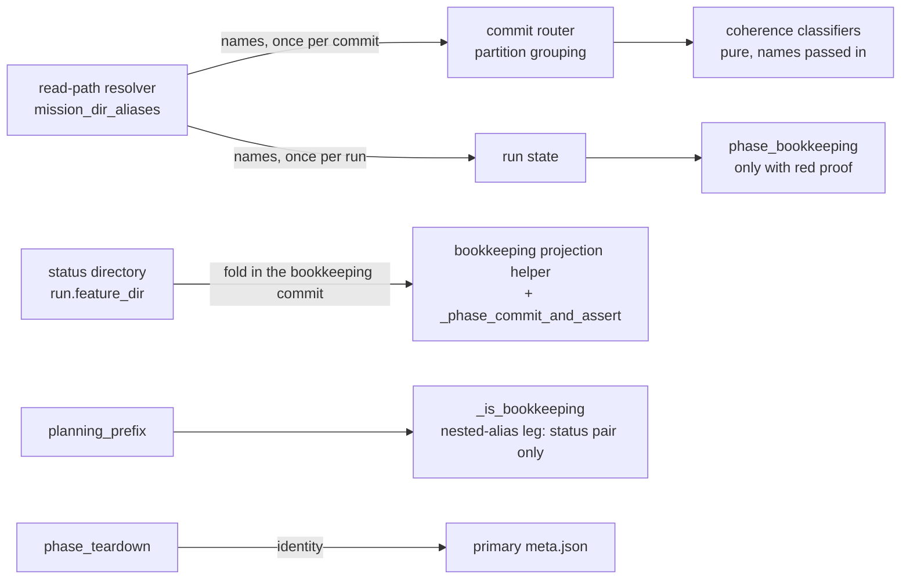

# Implementation Plan: Nightly suites green on main

**Branch**: `issue-5611-5419-nightly-green` | **Date**: 2026-10-05 | **Spec**: [spec.md](spec.md)
**Input**: Mission specification from `kitty-specs/nightly-suites-green-01M44FEP/spec.md`

Planning questions were answered by the operator brief and three recorded rulings
(alias authority; fold the landed records into one directory; move the recipe gate).
Evidence is in [research/code-grounding.md](research/code-grounding.md); decisions are
summarised in [research.md](research.md).

## Summary

Four nightly jobs are red on `main` @ `9adc68803f` for three unrelated causes. Each is
fixed at its structural cause, in its own lane, and delivered as one pull request.

| Track | Fix |
|---|---|
| A | One directory alias authority for a Mission's primary and composed coordination directory names, consumed by the commit-router partition classifier, the reconciliation bookkeeping exemption and the landing projection, so a bare-slug coordination Mission's seeded status files commit on the coordination branch, pass reconciliation, and land as one directory on the target. Teardown reads identity from the primary metadata. A refused seed commit stops consolidate with its own error code. |
| B | The owned-checkout performance tests assert a ratio to a start-up floor measured interleaved in the same run; start-up itself is asserted against a fixed interpreter workload measured in the same run. One authority module holds the limits and the measuring helper. A planted-work test proves the assertion goes red. A git-subprocess count pin gives a clock-free signal. |
| C | The recipe scanner classifies by command-line shape. The allowlist shrinks to live hits. The gate moves to `tests/architectural/`, which pull-request CI selects for every `src/specify_cli` change. |

## Technical Context

**Language/Version**: Python 3.11+ (CI also runs 3.12 and 3.13)
**Primary Dependencies**: typer, rich, ruamel.yaml, pytest, pytest-xdist; no dependency is added, upgraded or removed
**Storage**: Files and git refs only (`kitty-specs/<mission>/status.events.jsonl`, `status.json`, `meta.json`)
**Testing**: pytest. Named files only during implement and review (`NO_FULL_HEAVY_SUITES_IN_MISSION`); owning directories and nightly selections once at closeout, by operator request. Red-first per ADR `2026-07-17-1`.
**Target Platform**: Linux, macOS, Windows developer machines; GitHub-hosted Linux runners for CI
**Project Type**: single (CLI plus library, `src/` and `tests/`)
**Performance Goals**: NFR-001 to NFR-004 in the spec (30 of 30 green under throttle, 10 of 10 red with planted work, owned-checkout tests at most 90 s, recipe gate under 15 s)
**Constraints**: Paths owned by running missions are not edited (grounding section 6); only the body of `_is_bookkeeping` changes in `consolidation/reconciliation.py`; no new size or ratchet gate; no loosening without evidence; cyclomatic complexity at most 15; `mypy --strict` and `ruff` clean
**Scale/Scope**: About 12 source files in `src/specify_cli/{missions,coordination,consolidation}` and `src/mission_runtime/write_location.py`; 4 performance test files and 1 helper; 1 gate file moved; 2 decision records; 1 doc page

## Charter Check

*GATE: passed before Phase 0; re-checked after design.*

| Charter rule | Status | Note |
|---|---|---|
| Single canonical authority (DIRECTIVE_044) | Pass | Track A extends the existing read-path resolver module, no sixth name composer. Track B extends `tests/_perf_helpers.py`. Track C keeps one scanner. |
| Architectural alignment, layer rules | Pass | The alias is resolved in `specify_cli` and passed down; `mission_runtime/artifacts.py` and the outbound ledger are untouched. |
| ATDD / red-first (Standing Order 4, C-011) | Pass | Each track opens with a red test; Track B's "red" is defined in spec C-005. |
| Campsite cleaning, tidy-first (Standing Order 2, DIRECTIVE_025) | Pass | Track A opens with two behaviour-preserving enablers. |
| Gate discipline (Standing Order 5, ADR `2026-09-30-1`) | Pass | No new allowlist; the recipe allowlist shrinks from 14 to its live hits; each new assertion has a planted-break proof. |
| Canonical sources (Standing Order 6) | Pass | Per-PR coverage through the existing job-selection authority; no workflow edit. |
| Git and workflow discipline (Standing Order 7) | Pass | Topic branch, draft pull request, operator merges. |
| Mission hygiene (Standing Order 8) | Pass | Issues claimed and assigned; reviewer and implementer are separate profile-loaded agents. |
| Red-main discipline (Standing Order 9) | Pass | No red is hidden: the #5651 reproduction goes green through a product fix, the budget change is backed by measurements. |
| No full heavy suites in mission work | Pass with operator exception | Closeout runs the owning directories and nightly selections once, as the brief requests. |
| Charter "CLI operations under 2 seconds" | Noted, out of scope | Cold start is about 1.0 s here and 1.7 to 1.95 s on shared runners; the standing 0.36 s import chain is filed as a follow-up, not hidden in a test budget. |
| Pre-existing failure reporting | Pass | Findings outside the mission (grounding section 8) are filed as issues at closeout. |

The brief asks for a draft pull request that is marked ready once green; the generic
mission-from-issue procedure says non-draft from the start. The brief and directive
`046` (fold review findings while still a draft) agree, so the draft-first path is used.

## Project Structure

### Documentation (this mission)

```
kitty-specs/nightly-suites-green-01M44FEP/
├── plan.md
├── research.md                 # decisions (this command)
├── research/code-grounding.md  # evidence (grounding squad)
├── quickstart.md               # reproduction and proof commands
├── traces/                     # three tracer files, seeded at tasks
└── tasks.md                    # /spec-kitty.tasks
```

No `data-model.md` or `contracts/`: the mission adds no entity, schema or external
interface. The one new operator-visible contract is the `COORD_SEED_COMMIT_REFUSED`
refusal, specified in FR-006.

### Source Code (repository root)

```
src/specify_cli/
├── missions/_read_path_resolver.py        # A: directory alias authority (new function + __all__)
├── coordination/
│   ├── coherence.py                       # A: classifiers accept a collection of directory names
│   ├── commit_router.py                   # A: resolve aliases once, thread through partition grouping
│   └── coord_seed.py                      # A: set the structured refusal field on the seed report
├── consolidation/
│   ├── reconciliation.py                  # A: body of _is_bookkeeping only
│   ├── run_state.py, executor.py          # A: resolve aliases once per run
│   ├── phase_bookkeeping.py               # A: only with a red proof
│   ├── bookkeeping_projection.py          # A: fold composed-directory records onto the primary directory
│   ├── phase_teardown.py                  # A: identity from run.target_feature_dir
│   ├── entry_preflight.py                 # A: refuse on a refused seed commit
│   └── _constants.py                      # A: COORD_SEED_COMMIT_REFUSED
src/mission_runtime/write_location.py      # A: defaulted field on SeedReport

tests/
├── _perf_helpers.py                                   # B: limits + interleaved measuring helper
├── performance/test_owned_checkout_perf.py            # B: ratio assertions + planted-work test
├── performance/test_cli_startup_budget_4409.py        # B: median against calibration workload
├── performance/test_cli_startup_agent_commands_freshness.py  # B: limit from the authority
├── specify_cli/workspace/test_owned_checkout_git_calls.py    # B: count pin (new)
├── architectural/test_commit_recipe_strings.py        # C: moved scanner + allowlist + fixtures
├── specify_cli/cli/commands/test_commit_recipes.py    # C: keeps the renderer unit tests only
├── integration/test_merge_lane_planning_data_loss.py  # A: docstring; end-state assertions
├── coordination/, specify_cli/coordination/, consolidation/, mission_runtime/   # A: focused tests

docs/
├── adr/4.x/2026-10-05-1-*.md, 2026-10-05-2-*.md       # decision records (A, B)
├── development/testing/testing-flakiness.md           # B: runner-relative budget guidance
└── changelog/CHANGELOG.md                              # closing work package
```

**Structure Decision**: single project; changes follow the existing module layout. No
file is shared between tracks. The changelog and `docs/adr/4.x/index.md` belong to one
closing work package.

## Design notes

### Track A



*Diagram: where the alias set is resolved and which consumers receive it. `_is_bookkeeping` derives the composed name from its existing `planning_prefix` argument; the fold reads the status directory's name and needs no run-state field.*

- **Authority**: `mission_dir_aliases(repo_root, mission_slug) -> frozenset[str]` returns
  the primary directory name plus `coord_mission_dir_name(primary, mid8)`, with `mid8`
  only from the primary `meta.json` through the existing identity helpers. No recorded
  identity means the set holds the primary name alone.
- **Classifier**: `coherence.is_coord_residue_churn` and `is_status_state_path` gain an
  optional collection of directory names and apply the existing exact-name check per
  name. Existing callers are unaffected.
- **Reconciliation**: one leg appended to the body of `_is_bookkeeping`, existing legs
  byte-identical, function-local import. `alias` is the last segment of `planning_prefix`;
  the leg applies only for a nested prefix (`<something>/kitty-specs/<alias>`) with
  `alias != mission_slug`, and exempts only a root-anchored three-segment path
  `kitty-specs/<alias>/<file>` whose kind is `STATUS_STATE`. It is added only if a
  `--strategy merge` variant of the reproduction is red without it (the probe saw three
  commits flagged: seed, fold, and the `done` status transition). Under squash the fold
  alone suffices, so a zero diff in `reconciliation.py` is the preferred outcome.
- **One directory on the target (FR-019)**: fold in the existing bookkeeping commit.
  The union of the composed log into the primary directory already happens
  (`bookkeeping_projection.py:309-353`). `_phase_commit_and_assert` additionally takes the
  target-side `kitty-specs/<composed>/{status.events.jsonl,status.json}`, asserts every
  `event_id` is in the unioned primary log (fail closed), unlinks the two files and appends
  them to the commit's path list, so the existing door commits the deletion. No new git
  argv, no run-state field, no edit outside `phase_bookkeeping.py` and
  `bookkeeping_projection.py`. The end state is pinned by the reproduction itself, switched
  from the over-mocked helper to the real bookkeeping door (operator ruling: replacing a
  mock of product code with the real path is allowed). See research.md D7 and
  code-grounding sections 10 and 11.
- **Backstop**: `SeedReport.commit_refused: str | None`; `_resolve_run_status_dir` keeps
  the `WriteLocation` and refuses through the existing pre-mutation abort helper, with
  wording that names the kept files.
- **Unproven consumers**: `phase_bookkeeping.py:567` is converted only if a test goes red
  without it; otherwise it is left alone and listed in the follow-up issue.

### Track B

- **Measure**: `measure_interleaved(command, floor, runs)` in `tests/_perf_helpers.py`
  alternates floor and command spawns and returns both medians. Assertion:
  `assert_timing_budget(command_median / floor_median, RATIO_LIMIT, name=...)`.
- **Sample counts**: 5 floor and 5 command spawns per owned test (about 12 s each idle),
  the same for the planted-work test; estimated 55 to 60 s total against the 90 s limit.
- **Calibration spike (first subtask, results go into the decision record)**:
  1. Pick the start-up floor command among `--version`, `agent --help` and
     `python -c "import specify_cli"` by lowest ratio spread between idle and throttled.
  2. Pick the throttle that yields a floor of at least 1.9 s (CPU-affinity pinning plus
     burners) and confirm the old absolute assertion is red there.
  3. Record 30 idle and 30 throttled clean ratios and 10 planted ratios each; set
     `RATIO_LIMIT` between the largest clean and smallest planted value and state the
     headroom. If the two ranges overlap, stop and report.
- **Start-up signal**: start-up median divided by the median of a fixed interpreter
  workload (a fixed list of standard-library imports in a fresh interpreter), calibrated
  the same way. `--help` moves from one shot to a median.
- **Planted work**: a `sitecustomize` module on the child's `PYTHONPATH` that runs a
  fixed-iteration CPU loop when the child is an `agent` command; test-side only.
- **Count pin**: `tests/specify_cli/workspace/test_owned_checkout_git_calls.py`, in-process
  through the CLI runner with `subprocess` spawns counted, three agreeing samples before
  pinning, plus a planted extra call. Unmarked, so the marker guard does not apply. The
  job-selection dry run output is recorded. Known limit: a module shard runs it when its
  owning module or an unmapped source path changes; other changes reach it in the nightly.

### Track C

- **Classifier**: one function deciding "recipe-shaped" per FR-013, applied to string
  constants and f-string literal parts as today; docstring and argv-list exemptions stay.
- **Fixtures**: the 11 historical recipes verbatim from the tree before `3e09226fb4`, one
  positive per shape in FR-013, and negatives (the help text, a log line, passing prose).
- **Allowlist**: reduced to what still hits; stale-entry and distinctiveness checks stay.
- **Move**: scanner, allowlist and fixture tests to
  `tests/architectural/test_commit_recipe_strings.py` with the `architectural` marker and
  a corrected repository-root anchor. Renderer unit tests stay where they are.
- **Proof**: job-selection dry run for three `src/specify_cli` paths, and a planted
  recipe that turns the moved file red.

## Complexity Tracking

No charter violation needs justification.

## Implementation Concern Map

### IC-01 — Track A enablers

- **Purpose**: Behaviour-preserving preparation so the fix lands on clean seams.
- **Relevant requirements**: FR-006 (typed field), FR-001 (teardown identity), C-005
- **Affected surfaces**: `consolidation/phase_teardown.py`, `mission_runtime/write_location.py`, `coordination/coord_seed.py`
- **Sequencing/depends-on**: none
- **Risks**: `SeedReport` is on the mission_runtime surface; the new field must be defaulted and not a new root export.

### IC-02 — Directory alias authority and partition classification

- **Purpose**: Make the seed commit for a bare-slug Mission group to the COORD partition.
- **Relevant requirements**: FR-002, FR-003, FR-004, FR-005
- **Affected surfaces**: `missions/_read_path_resolver.py`, `coordination/coherence.py`, `coordination/commit_router.py`, their tests
- **Sequencing/depends-on**: IC-01
- **Risks**: dead-symbol and read-side gates; one `meta.json` read per commit; the `owned` path bypasses grouping and must stay untouched.

### IC-03 — Consolidation consumers and the one-directory end state

- **Purpose**: Pass reconciliation without widening the closed world, and land one directory on the target.
- **Relevant requirements**: FR-001, FR-003, FR-004, FR-005, FR-018, FR-019
- **Affected surfaces**: `consolidation/reconciliation.py` (`_is_bookkeeping` body), `run_state.py`, `executor.py`, `phase_bookkeeping.py`, `bookkeeping_projection.py`, `tests/consolidation/`, `tests/integration/test_merge_lane_planning_data_loss.py`
- **Sequencing/depends-on**: IC-02
- **Risks**: adjacency to the approved-claim bound (#5668); the fixture mocks `done` bookkeeping, so `done` placement needs its own check; a fold that needs a destructive operation is a stop condition.

### IC-04 — Refused seed commit backstop

- **Purpose**: Replace a misleading dirty-worktree refusal with the real cause.
- **Relevant requirements**: FR-006
- **Affected surfaces**: `consolidation/entry_preflight.py`, `consolidation/_constants.py`, tests
- **Sequencing/depends-on**: IC-01
- **Risks**: must not delete seeded files (I-SEED-10); the trigger is a rejecting commit hook through the CLI.

### IC-05 — Performance limit authority and calibration

- **Purpose**: One module for limits and the interleaved measure, with limits set from recorded data.
- **Relevant requirements**: FR-008, FR-012, NFR-001, NFR-002
- **Affected surfaces**: `tests/_perf_helpers.py`, the Track B decision record
- **Sequencing/depends-on**: none
- **Risks**: clean and planted ratio ranges may overlap (stop condition); the floor command may not be clean.

### IC-06 — Runner-relative performance tests

- **Purpose**: Rewrite the owned-checkout and start-up assertions and prove them non-vacuous.
- **Relevant requirements**: FR-007, FR-009, FR-010, NFR-003
- **Affected surfaces**: `tests/performance/test_owned_checkout_perf.py`, `test_cli_startup_budget_4409.py`, `test_cli_startup_agent_commands_freshness.py`
- **Sequencing/depends-on**: IC-05
- **Risks**: the marker guard restricts assertion vocabulary; isolated CLI home per measurement.

### IC-07 — Git-subprocess count pin

- **Purpose**: A clock-free signal for extra work in owned-checkout commands.
- **Relevant requirements**: FR-011
- **Affected surfaces**: `tests/specify_cli/workspace/test_owned_checkout_git_calls.py`
- **Sequencing/depends-on**: none
- **Risks**: counts must be stable across three samples; counting must see child processes spawned in-process.

### IC-08 — Recipe classifier, fixtures and allowlist

- **Purpose**: Flag recipes, not mentions.
- **Relevant requirements**: FR-013, FR-014, FR-015, C-011
- **Affected surfaces**: the recipe gate test file
- **Sequencing/depends-on**: none
- **Risks**: false negatives on unusual shapes; the two remaining allowlist entries point at files owned by other missions (only the allowlist text refers to them).

### IC-09 — Move the recipe gate to the per-pull-request battery

- **Purpose**: Make the gate go red on the introducing pull request.
- **Relevant requirements**: FR-016, NFR-004
- **Affected surfaces**: `tests/architectural/test_commit_recipe_strings.py`, `tests/specify_cli/cli/commands/test_commit_recipes.py`
- **Sequencing/depends-on**: IC-08
- **Risks**: marker and path anchor; battery partition and naming gates.

### IC-10 — Decision records, guidance and closing records

- **Purpose**: Record the two decisions, update the flakiness guidance, write the changelog entry and file follow-ups.
- **Relevant requirements**: FR-017, C-007
- **Affected surfaces**: `docs/adr/4.x/`, `docs/development/testing/testing-flakiness.md`, `docs/changelog/CHANGELOG.md`, the docs retrieval index
- **Sequencing/depends-on**: IC-03, IC-05, IC-09
- **Risks**: `CHANGELOG.md` and the ADR index are contended by other missions; number records `2026-10-05-N`.
