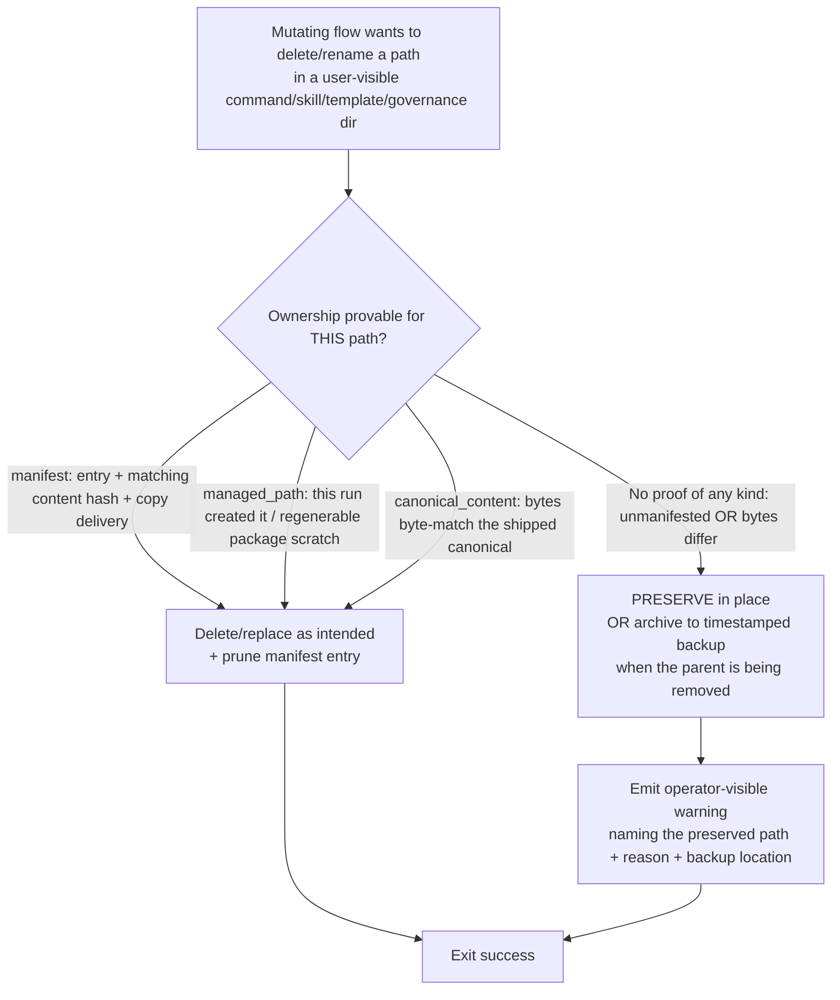

# Mission Specification: Ownership-Boundary Preservation for Mutating Flows

**Mission Branch**: `fix/ownership-boundary-preservation`
**Created**: 2026-09-21
**Status**: Draft
**Input**: P0 data-loss cluster — mutating flows (`init`, `upgrade`, migrations) delete user-authored content by name/directory without proving package ownership and without backup, while exiting 0. Closes epic #4792 (via #4861); advances epic #3347 (#4859, #4862). Scope expanded (operator decision) to close the whole same-root class across the mutating-flow module set.

## Overview

Spec Kitty's maintainer-owned cleanup paths decide *"delete this"* from a **name or directory
basename alone** — never proving Spec Kitty actually shipped the file — and delete it
**without a backup**, while still reporting success. A user who authored their own slash
command, skill, command template, or governance file whose name collides with a shipped name
loses that work silently. This violates the binding charter section **User Customization
Preservation → Ownership Boundaries for Mutating Flows** (charter L463–479): *name-based
heuristics are not ownership proof* (L470); *if ownership cannot be proven, preserve + warn
instead of deleting* (L472); *every such site must document its ownership proof* (L479).

Three sites are the P0/P1 headline (grounded on `main` @ `32cfc272ee`):

| Issue | Site | Mechanism |
|-------|------|-----------|
| #4859 (P0) | `upgrade/migrations/m_3_2_0rc45_retire_standalone_skill_surface.py::apply()` | `_safe_rmtree`/`_safe_unlink` any path whose **basename** ∈ `RETIRED_STANDALONE_SKILL_NAMES`, before manifest pruning; manifests only prune stale *entries*, never protect an unmanifested collision. |
| #4861 (P0) | `cli/commands/init.py` cleanup loop `("templates","command-templates",".scratch")` | `shutil.rmtree` of `.kittify/command-templates/` by **directory name** (a legitimate LEGACY resolver tier), no backup. Residual after #4759 fixed only `missions/`+`memory/`. |
| #4862 (P1) | `upgrade/migrations/m_3_1_1_charter_rename.py::_normalize_layouts()` | On the constitution→charter merge, files that already exist in `charter/` are reported **"Skipped"** then destroyed by the residual `rmtree(constitution_dir)` — no backup. |

**Scope was expanded (operator decision `DM` in trace)** from these three to the **whole
same-root class**: a non-vacuous census of the mutating-flow module set (`cli/commands/init.py`
+ `upgrade/migrations/*.py`) surfaces additional structurally-identical retirement/cleanup
sites that delete by name with no ownership proof and no backup — the `m_0_10_0_python_only.py`
script sweeps (`.kittify/scripts/bash/*.sh` — which even *warns* "custom scripts will be
removed" then deletes them — and `powershell/*.ps1`), `m_0_10_2_update_slash_commands.py`
(`.kittify/commands/*.toml`), `m_2_1_2_remove_release_skill.py`,
`m_2_0_11_remove_clarify_command.py` (a broad `spec-kitty.clarify*` match — exactly the pattern
the charter warns about), and the two `spec-kitty.profile-context.md` retirements
(`m_2_2_0_profile_context_deployment.py`, `m_3_2_0rc43_retire_profile_context_command.py`).
Every destructive filesystem op in that module set that can reach a user-visible
command/skill/template/governance directory by name is either **routed through one shared
ownership-mutation guard** or is a **genuinely-safe op frozen in a rationalized, shrink-only
allowlist**. Notably, `m_3_1_2_globalize_commands.py` — the charter's *named* motivating hazard
(L478) — is **already correctly guarded** (its `_is_generated_file` version-marker check), and
serves as the **canonical exemplar** the shared guard's `canonical_content` prover is modeled
on (alongside `m_2_0_0` managed-hook, `m_2_0_7` byte-match, `m_3_2_0rc35` owned-unedited-plus-
archive). The exhaustive per-op census (the definitive fix list, the exemplars, the initial
allowlist, and four borderline sites resolved by red-first probe) is finalized in
`plan.md`/`data-model.md`.

The class is closed **by construction**: one shared *prove-ownership-or-preserve/archive-with-
diagnostic* decision surface in `specify_cli` (dispatching to one prover per ownership signal),
plus a non-vacuous architectural gate that (a) positively asserts each fixed site routes
through the guard and (b) fails if any *new* un-routed destructive op appears anywhere in the
module set.

## User Scenarios & Testing *(mandatory)*

> Story priority below is a *delivery-slice* scale (S1 = first shippable slice). The issue
> priority (P0/P1) is shown separately per story to avoid conflating the two scales.

### User Story 1 - A user-authored asset with a colliding name survives a retirement upgrade (Slice: S1 · Issue #4859, P0)

A Spec Kitty user hand-authored a governance skill directory (e.g.
`.claude/skills/spec-kitty.advise/`) that Spec Kitty never shipped, with their own content and
**no manifest entry**. They run `spec-kitty upgrade`, which runs the standalone-skill
retirement migration.

**Why this priority**: Issue #4859 is a P0 release blocker on the overdue MVP-launch milestone;
silent loss of user-authored governance content is the exact charter-class defect the mission closes.

**Independent Test**: Seed an unmanifested `spec-kitty.advise` skill with distinctive bytes,
run the migration, assert the content survives (in place or recoverable from a backup) with a
diagnostic naming it — while a genuinely manifest-owned retired skill (entry + matching
content hash + copy delivery) is still removed and its entry pruned.

**Acceptance Scenarios**:

1. **Given** an unmanifested `.claude/skills/spec-kitty.advise/SKILL.md` with distinctive bytes, **When** the retirement migration `apply()` runs, **Then** the file's bytes survive (in place or in a recoverable backup), the migration reports `success`, and a warning names the preserved path as not-package-owned.
2. **Given** a `spec-kitty.advise` skill whose managed manifest entry's `content_hash` matches the on-disk bytes and whose delivery mode is `copy`, **When** the migration runs, **Then** the skill is removed and its manifest entry pruned (legitimate retirement preserved).
3. **Given** a manifested `spec-kitty.advise` skill whose bytes have **drifted** from the recorded `content_hash`, **When** the migration runs, **Then** the skill is preserved with a diagnostic (fail-closed toward retaining user edits), not deleted.

### User Story 2 - A user-authored command template survives re-init (Slice: S1 · Issue #4861, P0)

A user placed a custom template at `.kittify/command-templates/<name>.md` (a legitimate LEGACY
resolver tier). They run `spec-kitty init` — both with and without a `.kittify/config.yaml`.

**Why this priority**: Issue #4861 is a P0 release blocker and the residual after #4759.
Closing it closes epic #4792.

**Independent Test**: Seed `.kittify/command-templates/custom.md` with known bytes, run the
real `init` CLI, assert the bytes survive (in place or in `.kittify/.backup-<ts>/`) and the
command exits 0 with a diagnostic — while a project that never seeded that directory still
ends with no `.kittify/command-templates/` (unchanged cleanup for genuinely regenerable scratch).

**Acceptance Scenarios**:

1. **Given** a project with `.kittify/command-templates/custom.md` (known bytes) and **no** `config.yaml`, **When** `spec-kitty init` runs, **Then** the custom template's bytes survive (in place or verbatim in a timestamped backup), `init` exits 0, and a diagnostic names the preserved path.
2. **Given** the same seeded project **with** a `.kittify/config.yaml` present, **When** `spec-kitty init` runs, **Then** the custom template is likewise preserved — proving the fix is not gated on config.yaml-absence.
3. **Given** a project that never authored `.kittify/command-templates/`, **When** `spec-kitty init` runs, **Then** genuinely regenerable scratch this run created (`.kittify/templates/`, `.kittify/.scratch/`, `.resolved-*`, `.merged-*`) is still removed and the project ends with no leftover `.kittify/command-templates/` (existing behavior preserved).

### User Story 3 - A conflicting governance file reported "Skipped" is not destroyed (Slice: S2 · Issue #4862, P1)

A project in a partial constitution→charter layout has both a legacy `.kittify/constitution/`
and a `.kittify/charter/` with a same-named, differing file. The charter-rename migration
reports the colliding file as **"Skipped"** during the merge.

**Why this priority**: Issue #4862 — same charter-class root, folded in per operator decision
(milestone: MVP launch; priority: kept P1).

**Acceptance Scenarios**:

1. **Given** `.kittify/constitution/<file>` and a differing `.kittify/charter/<file>`, **When** the charter-rename migration merges layouts, **Then** the constitution-side file it reports as "Skipped" is preserved (in place or in a recoverable backup) with a diagnostic, and is not destroyed by the residual directory removal.
2. **Given** a `.kittify/constitution/` whose files all merge without collision, **When** the migration runs, **Then** the now-empty residual directory is removed as before (legitimate cleanup preserved).

### User Story 4 - Every shipped-asset retirement migration preserves an unmanifested collision (Slice: S3 · class closure, epic #3347)

The same delete-by-name hazard exists in the other retirement/cleanup migrations
(`m_3_1_2_globalize_commands`, `m_2_1_2_remove_release_skill`, `m_3_2_0rc43…`, `m_2_0_11…`,
`m_3_2_0rc35…`, `m_2_2_0…`, and any surfaced by the census).

**Why this priority**: The gate cannot honestly claim to close the class while structurally
identical sites remain un-routed; the operator expanded scope to fix the whole class now.

**Acceptance Scenarios**:

1. **Given** any retirement/cleanup migration in the module set and a user-authored file that collides by name with the asset it retires but is not package-owned, **When** the migration runs, **Then** the user's file is preserved (in place or backup) with a diagnostic, not deleted.
2. **Given** the same migration and a genuinely package-owned target, **When** it runs, **Then** the target is still removed (no regression to legitimate retirement).

### Edge Cases

- A retired-name path that is a **symlink**: treated as unprovable ownership → preserved, never followed/unlinked by name alone.
- A **directory** whose members mix package-owned and untracked files: owned only if every tracked member matches and there are no untracked members; otherwise preserved.
- A **same-second** re-run needing a backup: the timestamped backup allocation must be collision-safe (reuse `_allocate_backup_dir`).
- A **corrupt or unreadable** manifest: fail closed toward preservation (treat as unprovable), never toward deletion.
- The backup location must survive the deletion it protects against (place backups outside any ancestor about to be removed).
- **Genuinely-safe destructive ops** (ephemeral scratch/tmp/worktree teardown, package-internal structural moves with no possible user collision) are NOT routed through the guard; they are frozen in the gate's rationalized allowlist.

## Requirements *(mandatory)*

### Functional Requirements

| ID | Title | User Story | Priority | Status |
|----|-------|------------|----------|--------|
| FR-001 | Prove ownership before destructive mutation | As a Spec Kitty user, I want every mutating flow to prove a path is package-owned before deleting/overwriting/renaming it, via one of three explicit signals — **manifest** (entry + matching `content_hash` + `copy` delivery), **managed_path** (an explicit package-managed/regenerable-this-run contract, for locations that carry no manifest such as `.kittify/command-templates/`), or **canonical_content** (bytes byte-match the shipped canonical) — so a name/directory collision alone can never authorize destruction. | High | Open |
| FR-002 | Preserve-or-archive with diagnostic when ownership is unprovable | As a Spec Kitty user, I want an unprovable-ownership path **preserved in place** when its parent survives, and archived verbatim to a timestamped backup only when the parent directory is itself being removed — always with an operator-visible warning naming the path and reason — so my content is never lost and never needlessly relocated. | High | Open |
| FR-003 | Legitimate retirement/cleanup still deletes proven-owned paths | As a maintainer, I want genuinely package-owned assets (proven owned by any signal) still removed and their manifest entries pruned, so intended retirements and scratch cleanup are not regressed. | High | Open |
| FR-004 | #4859: skill-retirement migration is ownership-gated | As a Spec Kitty user, I want the standalone-skill retirement migration to preserve an unmanifested or byte-drifted retired-basename skill and remove only proven-owned ones (checking both the managed-skills and command-skills manifests). | High | Open |
| FR-005 | #4861: init preserves user-authored command-templates | As a Spec Kitty user, I want `spec-kitty init` to preserve a user-authored `.kittify/command-templates/` (on both the config.yaml-present and -absent paths) while still removing genuinely regenerable scratch it created this run (`.kittify/templates/`, `.kittify/.scratch/`, `.resolved-*`, `.merged-*`). | High | Open |
| FR-006 | #4862: charter-rename preserves "Skipped" governance files | As a Spec Kitty user, I want the charter-rename migration to preserve any conflicting governance file it reports as "Skipped" instead of destroying it in the residual directory removal. | High | Open |
| FR-007 | One shared ownership-mutation guard (decision surface + pluggable provers) | As a maintainer, I want ONE shared `specify_cli` guard that returns a prove-ownership-or-preserve/archive **decision**, dispatching to a per-signal prover (`manifest`/`managed_path`/`canonical_content`) and delegating mechanical write/backup to reused primitives, routed into every site — so the class is fixed once, not via N drifting per-site patches. | High | Open |
| FR-008 | Preservation still reports success | As a Spec Kitty user, I want a flow that preserved my content to still exit success; preservation is signalled by surviving content plus a warning, never by a failing exit code. | Medium | Open |
| FR-009 | Diagnostic names path, reason, and backup location | As an operator, I want each preservation diagnostic to name the preserved path, the reason (not package-owned / bytes differ), and the backup location when archived, so I can recover or reconcile. | Medium | Open |
| FR-010 | Whole-class coverage across the mutating-flow module set | As a maintainer, I want every destructive filesystem op in the module set (`cli/commands/init.py` + `upgrade/migrations/*.py`) that can reach a user-visible command/skill/template/governance directory by name routed through the shared guard — the same-root residual is `m_0_10_0` (scripts `*.sh`/`*.ps1`), `m_0_10_2` (`commands/*.toml`), `m_2_1_2` (release skill), `m_2_0_11` (clarify), `m_2_2_0` + `m_3_2_0rc43` (profile-context), plus the three headline sites and any surfaced by the census — while already-guarded sites (`m_3_1_2_globalize_commands`, `m_2_0_0`, `m_2_0_7`, `m_2_1_3`, `m_3_2_0rc35`) stay as exemplars and genuinely-safe ops are allowlisted, so the defect class is genuinely closed, not just its three headline instances. | High | Open |

### Non-Functional Requirements

| ID | Title | Requirement | Category | Priority | Status |
|----|-------|-------------|----------|----------|--------|
| NFR-001 | Zero user-byte loss | Across every routed flow, 100% of unprovable-ownership cases preserve the exact user bytes (file present in place OR byte-identical in a recoverable backup) in the red-first repros; 0 cases of silent deletion. | Reliability | High | Open |
| NFR-002 | Non-vacuous architectural gate | A gate over the enumerated module set (`cli/commands/init.py` + `upgrade/migrations/`) performs a LIVE AST census of destructive filesystem ops (`shutil.rmtree`, `Path.unlink`/`os.unlink`, `shutil.move`, and the `_safe_rmtree`/`_safe_unlink` wrappers). Every op is EITHER routed through the shared guard OR a member of a frozen, individually-rationalized, **shrink-only** allowlist (genuinely-safe ops only). The gate: (a) **positively asserts** each fixed site calls the shared guard (mirroring `test_live_worktree_removal_sites_route_through_the_guard`), so it cannot be satisfied by allowlisting a target op; (b) FAILS on a planted un-routed op; (c) FAILS when one real allowlist entry is dropped (self-mutation, both directions). It reuses the AST-census/shrink-only/self-mutation *pattern* of `tests/architectural/test_destructive_op_routing.py` in a NEW filesystem-op gate (that existing gate covers git commands, not FS ops). | Maintainability | High | Open |
| NFR-003 | Layering integrity | Ownership judgement stays in `specify_cli`; only mechanical write/backup delegates to `kernel`. `tests/architectural/test_layer_rules.py` stays green; no `specify_cli` manifest/AGENT_DIRS knowledge leaks into `kernel`/`charter`. | Architecture | High | Open |
| NFR-004 | Bounded, honest blast radius | Change clusters in `specify_cli` (init + upgrade migrations + one new guard module + skills). `make test-fast` plus the targeted module/subsystem suites and `tests/architectural/` (new module + gate) pass. The expanded scope touches many migration modules; each carries its own red-first coverage. | Maintainability | Medium | Open |
| NFR-005 | Clean lint/type | `ruff check`, `ruff format --check`, and `mypy --strict` pass with zero new issues and zero new blanket suppressions. | Quality | High | Open |
| NFR-006 | In-code ownership-proof rationale (charter L479) | Every routed site and every allowlist entry carries an in-code rationale documenting its ownership proof (or why the op cannot hit custom user files), satisfying charter L479 "must document its ownership proof". | Maintainability | Medium | Open |

### Constraints

| ID | Title | Constraint | Category | Priority | Status |
|----|-------|------------|----------|----------|--------|
| C-001 | ATDD red-first | Each routed site's failing reproduction test is committed BEFORE its fix; the reviewer verifies red-on-base → green-on-fix (charter C-011 / Standing Order #4). The existing test `test_apply_removes_retired_skill_surface_from_all_known_project_roots` (which locks in the #4859 bug) is reworked. | Process | High | Open |
| C-002 | Reuse canonical primitives, honestly scoped | Reuse the `OwnershipProof` *type* (`tool_surface/operations.py`) as the per-signal vocabulary; reuse `_replacement_is_owned` (skills manifests) only for the skills-family sites; reuse the mechanical copy-then-unlink core of `_archive_existing_path` and `back_up_operator_subtrees` (`template/manager.py`) for backup. Do NOT force skills-manifest machinery onto the manifest-less sites (#4861/#4862); introduce per-signal provers instead. Do not hand-roll new backup mechanisms. | Technical | High | Open |
| C-003 | Distinct guard name | The new guard package is `specify_cli/asset_preservation/` — named distinctly, NOT placed in or overloading `specify_cli/ownership/` (WP-scope ownership) and avoiding the `git/destructive_guard.py` "guard" token. | Technical | High | Open |
| C-004 | Terminology + `__init__` coupling | No new `--feature` CLI surface (internal `feature_dir`/`feature_slug` params are the tolerated exception); keep guard code out of `specify_cli/__init__.py` to avoid the mandatory version-bump + CHANGELOG coupling. | Technical | Medium | Open |
| C-005 | Do not trip existing arch gates | Must not reintroduce retired `sync` tokens in migration prose (`test_no_retired_subsystems.py`); must not break `test_no_dead_modules.py`/`test_no_dead_symbols.py`; a new symbol under `kernel` needs a real caller in the same change (C-007). | Technical | High | Open |
| C-006 | Preserve legitimate-cleanup tests | Keep `test_init_minimal_integration.py` no-seed deletion case green; keep the manifest-owned retirement path green across every touched migration. | Process | High | Open |

### Key Entities

- **Ownership proof**: evidence a path is package-owned — `manifest` (entry + matching `content_hash` + `copy` delivery), `managed_path` (explicit package-managed/regenerable-this-run contract), or `canonical_content` (bytes byte-match the shipped canonical). Presence-by-name is explicitly NOT proof.
- **Ownership-mutation guard**: the shared `specify_cli` decision surface — verdict `owned` (delete-ok) or `unprovable` (preserve/archive + warn) — dispatching to a per-signal prover and delegating mechanical write/backup down.
- **Managed manifest**: `.kittify/skills-manifest.json` and `.kittify/command-skills-manifest.json`, each carrying per-file content hashes (the `manifest` signal). Some sites (command-templates, charter governance) have **no manifest** and use `managed_path`/`canonical_content`.
- **Backup/quarantine location**: a timestamped, collision-safe directory placed so it survives the removal it protects against.
- **Mutating-flow cleanup site**: a destructive filesystem operation in `init` or a migration that can reach user-visible command/skill/template/governance directories.

## Success Criteria *(mandatory)*

### Measurable Outcomes

- **SC-001**: In every routed flow, a user-authored asset sharing a shipped name survives (bytes intact in place or byte-identical in a recoverable backup) in 100% of unprovable-ownership repro cases; the migration/command exits success with a diagnostic.
- **SC-002**: Genuinely package-owned retired assets are still removed and their manifest entries pruned — the reworked #4859 test and the retained legitimate-cleanup tests (including `test_init_minimal_integration.py` no-seed) all pass.
- **SC-003**: The non-vacuous gate (a) positively asserts every fixed site calls the shared guard, (b) fails on a planted un-routed destructive op, and (c) fails on a one-entry-shrunk allowlist — and passes against the real tree. It cannot be made green by allowlisting a target op.
- **SC-004**: Every routed flow that preserves content emits an operator-visible diagnostic naming the preserved path, reason, and backup location (when archived), and exits success.
- **SC-005**: Every destructive filesystem op in the module set (`init.py` + `upgrade/migrations/`) is, at merge, either routed through the shared guard or a rationalized allowlist member — i.e. no un-routed, un-rationalized delete-by-name of user-visible content remains.

## Traceability

- **Owns work for**: #4859 (P0), #4861 (P0), #4862 (P1), plus the same-root residual retirement/cleanup sites surfaced by the census (fixed under the class-closure scope, epic #3347). Issue-matrix rows required before WP approval for the cited issues.
- **Closes**: epic #4792 (via #4861 — its only other child #4759 is already closed).
- **Advances**: epic #3347 (#4859, #4862, and the same-root residual — does not fully close it; #3788/#4027/#4763 remain).
- **Extends the pattern of**: #4759 (`back_up_operator_subtrees`), and reuses the *methodology* of the non-vacuous gate `tests/architectural/test_destructive_op_routing.py`.
- **Scope decisions** (trace Decision Moments): #4862 folded in → milestone "MVP launch (2026-09-15)", priority kept P1; scope expanded to fix the whole same-root class (not just the three headline sites); #4868 evaluated and **excluded** (verdict-matrix RMW / wrong-source-dir root, not ownership-boundary).
- **Explicitly out of scope**: #4858 (concurrency lost-update), #4868 (issue-matrix migration RMW), #2482, #3788, #4027, #4763.
