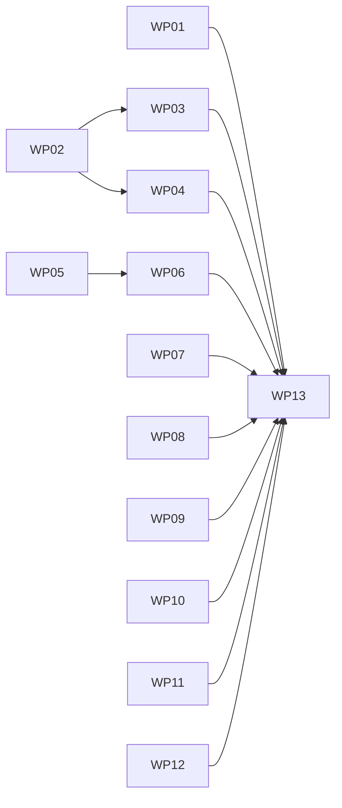

# Implementation Plan: Ratchet, baseline & census gate remediation

**Branch**: `claude/spec-kitty-remediation-wfje22` (planning base = merge target) | **Date**: 2026-09-26 | **Spec**: [spec.md](spec.md)
**Input**: Mission specification from `kitty-specs/ratchet-baseline-census-gate-remediation-01M3EW3Z/spec.md` (rev 2 + errata)
**Design source**: [research.md](research.md) (Phase 0 design research, architect lens, HEAD `3717c7ea`; section letters A–G below refer to it)

## Summary

Make every ratchet, allowlist and census gate in epic #5104's scope either measure what it claims (content-identified, non-vacuous, drift-tolerant) or be retired with its residue. Technical approach:

1. **Widen the positional-anchor ban** (research §A) with a predicate owned by the ban's test module, covering Python allowlists and `_exemptions/*.txt`; it finds 94 line-pinned entries on the planning base.
2. **Migrate hand-curated allowlists** (join, kernel, os-detect) to `ContentDescriptor` entries via a new shared matcher `_content_identity.py`, where one entry suppresses at most one finding (§B).
3. **Re-key the 80 census entries** to `CensusKey(rel, qualname, token_line, op, occurrence)` built on `_ratchet_keys.composite_key`, deleting the census helper's duplicate qualname algorithm; equivalence proven by a mapping CSV and a base-vs-head script (§C).
4. **Derive enforced baseline leaves** from a single hoisted comparison table; fail on non-enforcing leaves; retire the dead inert-slot machinery (§D).
5. **Retire** the surface-resolution converter directory (keeping the scanner functions in `_surface_resolution_scan.py`) and `resolution_gate_allowlist.yaml` (§E).
6. **Parity remediation** per file (§F): non-vacuous runtime-parity ban, delete `status/test_parity.py` after relocating its live invariants, convert context parity to an on-disk packs fixture, split bridge-parity P0 tests from the oracle.

## Engineering Alignment

The operator instructed an end-to-end autonomous run ("drive mission e2e"), so planning questions were resolved from the confirmed spec, the Decision Moments and the design research rather than by further interrogation. Plan-level decisions (recorded in `tracer-design-decisions` and research §8):

| ID | Decision | Rationale |
|----|----------|-----------|
| D-OP-1 | Census identity = composite key + op + `op_ordinal` (renamed from `occurrence` to avoid clashing with `ContentDescriptor.occurrence`) | Only 3/80 need occurrence > 0; rejects both widening and arg drift (§C1) |
| D-OP-2 | Remove `category_1` and `skip_marker_blocks` leaves rather than enforce them | Neither is a size ceiling; `category_1`'s equality pin shows the "toll drain" never worked (§D3) |
| D-OP-3 | Comment-only `src/` edits allowed under C-005 with AST-equality proof | Needed for SC-003 (`status/aggregate.py:543`); behaviour provably unchanged |
| D-OP-4 | Deletion-only WPs prove red-first by tracer evidence + a green surviving test, never tombstones | C-001 as amended; avoids the class #3285 removed |
| D-OP-5 | FR-015 proceeds via `SPEC_KITTY_PACKS_ROOT` mirror fixture | Prototyped with zero private patches; defer only if Windows-symlink or cache-order checks fail |
| D-OP-6 | The text-file arm makes `path:line` exemption shapes unusable at zero entries (clock, lock-ban) | Intended: those gates are shrink-only at zero |
| D-OP-7 | Interim 94 per-site exemptions in WP01, pinned empty in WP12 | Lets the ban land green and the migrations run in parallel; the interim state never reaches `main` because the mission ships as one PR |
| D-OP-9 | `_content_identity.py` is the single matching authority (one entry suppresses at most one finding, path always part of the key); census `diff_against_allowlist` adopts it in WP04; other matchers follow up | Paula post-plan: it would otherwise be the 8th matcher (DIRECTIVE_044) |
| D-OP-10 | Mirror packs fixture is always copied, never symlinked | Copy costs 0.05 s; Windows safety (Debbie post-plan) |
| D-OP-8 | Stale policy split: hand-curated allowlists fail, census allowlists warn | Epic "no re-pin toll on unrelated changes" (post-spec divergence adjudicated) |

## Technical Context

**Language/Version**: Python 3.11+ (repo `.venv`, `uv sync --frozen --all-extras`)
**Primary Dependencies**: pytest, pytest-xdist, `ast` (stdlib), existing substrate `tests/architectural/_ratchet_keys.py` (`composite_key`, `ContentDescriptor`, `resolve_descriptor`)
**Storage**: Files only — Python allowlist literals, `tests/architectural/_baselines.yaml`, `_inert_slots_baseline.yaml`, `_exemptions/*.txt`, mission CSV artefact
**Testing**: pytest; per-WP blast radius (research §G3) + `make test-fast`; full `tests/architectural/` for WPs touching shared helpers, `_baselines.yaml` or `pyproject.toml`
**Target Platform**: CI Linux + Windows CI lane (`ci-windows.yml`) for WP10 symlink behaviour
**Project Type**: single (test infrastructure inside the existing repo)
**Performance Goals**: widened ban < 10 s over `tests/architectural/` (prototype 1.4 s); bridge P0 module < 60 s (oracle ~389 s untouched)
**Constraints**: C-001 red-first (amended), C-002 oracle untouched, C-004 one identity mechanism, C-005 no `src/` behaviour change, complexity ≤ 15, zero new suppressions
**Scale/Scope**: 13 WPs; ~94 line-pinned entries migrated; 45 parity modules cataloged; estimated +1.7k / −3.3k lines

## Charter Check

*Gate evaluated before Phase 0 and re-checked after design.*

| Charter rule | Status | Evidence |
|--------------|--------|----------|
| Single canonical authority (DIRECTIVE_044) | PASS | C-004 deletes the census helper's second qualname algorithm; one comparison table for baselines (§D2) |
| ATDD-first (C-011) | PASS | Every WP names a RED-on-base acceptance test (table below); deletion-only WPs follow D-OP-4 |
| Architectural gate discipline (SO #5, DIRECTIVE_043) | PASS | NFR-002 floors + real-path self-mutation per ban; shrink-only baselines (NFR-003) |
| Test remediation discipline (SO #4, DIRECTIVE_041) | PASS | Parity verdicts per discriminator; NFR-006 requires a surviving test or mutation proof per retirement |
| Campsite cleaning (SO #2) | PASS | #2972 findings cleaned only in touched test files (FR-020) |
| Pack tiers | N/A | No doctrine pack edits |
| Terminology canon | PASS | Mission terminology; `test_no_legacy_terminology.py` in WP12 blast radius |
| Git workflow (DIRECTIVE_045/046) | PASS | Topic branch, one PR to `main`, compressed history, operator merges |
| Pre-existing failure reporting | WATCH | Any base-red test encountered is classified and, if pre-existing, filed as an issue before continuing |

Post-design re-check: PASS. No violations, so Complexity Tracking is empty.

## Project Structure

### Documentation (this mission)

```
kitty-specs/ratchet-baseline-census-gate-remediation-01M3EW3Z/
├── spec.md
├── plan.md                  # this file
├── research.md              # Phase 0 design (sections A–G)
├── data-model.md            # Phase 1 entities
├── quickstart.md            # verification commands
├── research/                # grounding, post-spec squad, census equivalence script (WP04)
├── census-rekey-map.csv     # WP04/WP05 artefact
├── checklists/requirements.md
└── tasks.md, tasks/         # /spec-kitty.tasks output
```

### Source Code (repository root)

```
tests/architectural/
├── test_ratchet_positional_anchor_ban.py   # WP01 (widen), WP12 (pin empty)
├── _content_identity.py                    # NEW (WP02) shared matcher
├── test_content_identity.py                # NEW (WP02)
├── test_built_in_location_authority.py     # WP02 join allowlist
├── test_kernel_no_doctrine_import.py       # WP03
├── _os_detection_exemptions.py, _exemptions/os-detect-ban-*.txt, test_os_detection_ban.py  # WP03
├── _destructive_op_census.py               # WP04 (CensusKey, unify qualname)
├── test_destructive_op_routing.py, test_overwrite_ownership_routing.py  # WP04
├── test_mutation_ownership_routing.py      # WP05
├── test_ratchet_baselines.py, _baselines.yaml, _inert_slots*.py/.yaml, test_no_inert_schema_slots.py  # WP06
├── surface_resolution_audit/ → _surface_resolution_scan.py  # WP07 (directory retired)
├── resolution_gate_allowlist.yaml          # WP12 (retired)
└── test_execution_context_parity.py, test_docs_cli_reference_parity.py  # WP08
tests/next/test_internal_runtime_parity.py  # WP08
tests/missions/test_surface_resolution_equivalence.py, tests/review/test_transition_gate_parity.py  # WP08
tests/status/test_parity.py (deleted), test_reducer.py, test_transitions.py  # WP09
tests/charter/test_context_parity.py → test_context_bootstrap_markers.py  # WP10
tests/runtime/test_bridge_parity.py, test_next_board_authority.py (NEW), _next_mission_scaffold.py (NEW)  # WP11
pyproject.toml (format-exclude lines)       # WP07 then WP09
```

**Structure Decision**: all changes live in the existing test tree; no new packages. File ownership is exclusive per WP except the sequenced hotspots below.

## Parallel Work Analysis

### Dependency Graph (revision 2, post-plan squad folded)



Critical path: WP02 → WP04 → WP13.

### Work packages

| WP | Title | FRs | Deps | Size | Red-first acceptance test |
|----|-------|-----|------|------|---------------------------|
| WP01 | Widen positional-anchor ban + interim per-site exemptions | FR-001, FR-002, FR-003 (interim), NFR-002, NFR-004 | — | M | widened arms report 94 findings on base (one exemption row per line); 4 inverted tests |
| WP02 | Content-identity matching authority + join allowlist | FR-004, FR-007, NFR-001, NFR-003 | — | S | `test_join_allowlist_entries_each_suppress_a_live_join` (RED: 2 dead) + drift test (15 files) |
| WP03 | Kernel + os-detect exemptions; retarget lock-ban/clock loaders | FR-005, FR-007, NFR-001 | WP02 | S | kernel + os-detect drift tests; `path:line` loader shape rejected |
| WP04 | Census re-key (all 80) on `_content_identity` + composite key | FR-006, C-004, NFR-001 | WP02 | L (split commits: helper → destructive+overwrite → mutation) | census drift tests (15/21/2 files) + `test_second_identical_op_in_exempted_function_fails`; equivalence 80/80 |
| WP05 | Inert-slot retirement (#3026, #3962) | FR-010 | — (#5117 filed) | M | D-OP-4: uncalled symbols + stale rows evidence; baseline 38→36; survivor suite green |
| WP06 | Baseline leaf enforcement | FR-011, NFR-003 | WP05 | M | `test_every_baseline_leaf_is_enforced_by_a_size_ratchet` (RED: 4 leaves) + lower-below-live mutations; hand-kept key lists derived |
| WP07 | Surface-resolution converter retirement | FR-008, FR-009 | — | S | D-OP-4: `audit.py` exit 1 evidence; survivor green; path-qualified token search 0 |
| WP08 | Runtime-parity bans + parity residue + `test_next_no_unknown_state` | FR-013, FR-016 | — | S/M | `test_rich_typer_ban_inspects_live_runtime_package` (RED: 0 files) + planted violation |
| WP09 | Status parity retirement | FR-014, NFR-006 | — | M | D-OP-4 for duplicates (matrix tests already enforced in `test_transitions.py`); relocated determinism tests; L407/L660 dispositions |
| WP10 | Context parity conversion | FR-015 | — | M | `test_context_markers_use_no_src_patch_targets` (RED: 6 patch sites + 2 private calls); copy mirror, no symlinks |
| WP11 | Bridge parity split | FR-017, C-002, NFR-004 | — | M (separate move/format/rename commits) | `test_board_authority_module_does_not_import_the_oracle` + node-ID set equality (16; oracle keeps 8) |
| WP12 | Parity verdict catalog | FR-018, NFR-006 | — | S (planning_artifact) | catalog covers all 45 swept modules |
| WP13 | Closeout: pin exemptions empty, retire orphan gate data, format-exclude removals, follow-ups, matrix | FR-003 (final), FR-012, FR-019(d), FR-020 | all | M | `test_positional_anchor_exemptions_are_pinned_empty` (RED: 94 rows) |

### Coordination points (shared hotspots)

| Hotspot | Owners | Resolution |
|---------|--------|------------|
| `test_ratchet_positional_anchor_ban.py` | WP01, WP13 | WP13 depends on WP01 (sequenced out-of-map edit) |
| `pyproject.toml` format-exclude | WP07, WP09 (deletions), WP13 (rewritten files) | Deletion WPs remove their own exclude lines (hunks ~1,600 lines apart); WPs that rewrite an excluded file leave the line and do not run `ruff format` on it; WP13 formats those files and removes their lines in one commit |
| `_destructive_op_census.py` + all three census gates | WP04 only | merged WP (the `enclosing_qualname` signature change would otherwise break another lane) |
| `_content_identity.py` | WP02 | matching authority; WP03, WP04 depend on WP02; remaining hand-rolled matchers → follow-up (FR-019d) |
| `_baselines.yaml` | WP06 (owner); WP05 edits its three inert leaves as a sequenced out-of-map edit | WP06 depends on WP05 |

### External coordination

- **#4506** (repo-wide reformat, re-claimed 2026-09-22): conflicts with five WPs if it lands mid-mission; the operator should sequence it relative to this PR.
- **#4727** owns an os-detect exemption that WP03 migrates; **#3206** kernel exemptions (FR-005); **#2633** gates the oracle (#5116); **#2560, #5061, #5068, #1979** adjacent, no action.

### Integration tests

After lane consolidation: full `tests/architectural/` (`-n auto --dist loadfile`), `make test-fast`, the WP-specific blast radius from research §G3, and `research/census_rekey_equivalence.py --base 3717c7ea`.

## Complexity Tracking

No charter violations; nothing to justify.

## Follow-ups outside this mission (tracked, not in scope)

- `tests/contract/test_next_no_unknown_state.py:40` vacuous rglob of deleted `src/specify_cli/next` (same class as FR-013).
- Consolidate `tests/cross_branch/test_parity.py`.
- Stale `test_resolution_authority_gates.py` references in docs/ADR beyond those FR-012 touches.
