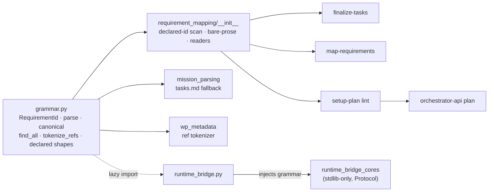

# Implementation Plan: Requirement-ID grammar and finalize-tasks diagnostics

**Branch**: `issue-2991-requirement-id-grammar` (planning/base = merge target; coordination branch `kitty/mission-requirement-id-grammar-01M3NRCA`) | **Date**: 2026-09-29 | **Spec**: [spec.md](spec.md)
**Input**: Mission specification from `kitty-specs/requirement-id-grammar-01M3NRCA/spec.md`

## Summary

The work gives Spec Kitty one requirement-ID grammar and makes every consumer use it. The grammar lives in `specify_cli/requirement_mapping/grammar.py`; the module becomes a package, with no change to any import path. The consumers are finalize-tasks, map-requirements, the runtime readiness check and a new check in `setup-plan`. The grammar admits:
- `SC` as a fourth kind;
- a single lowercase letter suffix;
- a `<mission-slug>#` qualifier for citing another mission's ID.

Along with the grammar:
- finalize-tasks stops rewriting authored `requirement_refs`;
- map-requirements becomes append-only;
- every unusable ref is classified as `malformed`, `unknown_spec_id` or `foreign_qualified`, with one shared verdict table;
- finalize reports the spec IDs it parsed;
- `setup-plan` refuses a malformed declared ID before tasks exist.

Engineering alignment was confirmed by the operator on 2026-09-29 (Decision Moment `01M3NSSWXBQNHPYDSFS3ME035F`). Seam file:line references come from the brownfield seam scout and were verified on `main` `aedb30cddd`.

## Technical Context

**Language/Version**: Python 3.11+ (`mypy --strict`, ruff lint + format)
**Primary Dependencies**: stdlib `re` via `kernel._safe_re` (the RE2-safe wrapper); typer/rich (CLI); ruamel.yaml (frontmatter); no new third-party dependency
**Storage**: Files only. WP frontmatter (`kitty-specs/<mission>/tasks/WP*.md`), `spec.md`, `wps.yaml` (schema unchanged)
**Testing**: pytest with ATDD/red-first. Issue-pinned `@pytest.mark.regression` repros go through the pre-existing CLI or runtime entry points, then are demoted to focused unit/functional tests. Per WP: the test files covering the touched files, the owning module's fast tier, and the named architectural gate files only (C-007)
**Target Platform**: Spec Kitty CLI on Linux/macOS/Windows
**Project Type**: single (the `src/` layered packages `kernel <- charter <- {runtime, …} <- specify_cli`)
**Performance Goals**: ≤ 50 ms added to finalize-tasks on a 30-WP fixture. Measured as the median of 20 in-process runs against the merge-base (NFR-003)
**Constraints**: One grammar authority (C-001). No new import-ledger key or baseline (C-002). Stdlib-only runtime cores. RE2-safe patterns (C-005). Complexity ≤ 15 (`finalize_tasks` is already at 15 with a `noqa`, so no branch may be added there). Additive JSON only (NFR-002)
**Scale/Scope**: 518 existing specs and their WP files as the compatibility corpus. About 12 source files (including `requirement_mapping/lint.py`, `review/antipattern_checklist.py` and the `envelope.py` version bump), 7 prompt/template files (the spec template plus the specify, tasks, tasks-outline, tasks-packages, tasks-finalize and review prompts), 3 action-guidelines files, 1 ADR, 1 glossary pack

## Charter Check

*GATE: Must pass before Phase 0 research. Re-checked after Phase 1 design: PASS.*

| Charter rule | How this plan complies |
|---|---|
| Single canonical authority (DIRECTIVE_044) | One grammar module. An AST literal-scan architectural gate (modelled on `test_charter_path_literal_authority.py`) forbids requirement-ID regex literals elsewhere, with a shrink-only allowlist whose count is checked two-sided against a recorded baseline. It holds 2 frozen entries (`missions/_substantive.py`, `retrospective/generator.py`), each naming a follow-up ticket. WP01 lands it with 3 entries and baseline 3 (the 2 frozen plus 1 transitional `runtime_bridge_cores.py` entry); WP04 removes the transitional entry and lowers the baseline to 2, so at head it is 2. `consolidation/retention.py` is not allowlisted: WP01 migrates it onto the grammar (HiC ruling, Decision Moment `01M3P2HXKASQY2ZKSEY3MAWA9H`) |
| Architectural alignment / layering | The grammar stays inside `specify_cli`. The runtime cores receive it by injection through a `Protocol`. `test_layer_rules.py`, `test_ratchet_baselines.py` and `test_bridge_cores_import_boundary.py` stay unchanged and green |
| ATDD / red-first (ADR 2026-07-17-1, C-011) | NFR-005: 4 issue-pinned repros, each RED on the planning base through the real entry point before its fix commit |
| Campsite cleaning, tidy-first (Standing Order #2) | IC-00 extracts helpers from `_run_bootstrap_loop` (cx 12), `_emit_requirement_mapping_report` (cx 10) and `_classify_wp_requirement_refs`, and merges the duplicate WP-ref readers, with behaviour preserved, before the functional change |
| Non-vacuous gates (Standing Order #5) | The C-001 gate has a concrete floor (it must see the grammar module's own literal), a self-mutation test, and a shrink-only allowlist |
| Pack tiers | Only `packs/built-in/` SOURCE templates and prompts change, because these govern consumers. Nothing goes in `packs/internal/` |
| No heavy suites (`NO_FULL_HEAVY_SUITES_IN_MISSION`) | Every WP names its targeted files and gate files. No `tests/architectural/` directory sweep, no `make test-full` |
| Terminology canon | Mission, never feature. `tests/architectural/test_no_legacy_terminology.py` runs on the ADR, glossary and prompts |
| Sonar | Complexity ≤ 15. Literals used 3+ times hoisted. Every new helper tested in the same commit |

No violations. Complexity Tracking is not needed.

## Project Structure

### Documentation (this mission)

```
kitty-specs/requirement-id-grammar-01M3NRCA/
├── spec.md, plan.md, research.md, data-model.md, quickstart.md
├── contracts/            # JSON payload deltas + grammar contract
├── checklists/requirements.md
├── traces/               # tooling-friction.md, approach.md, design-decisions.md
└── tasks/ + wps.yaml     # /spec-kitty.tasks output (not created here)
```

### Source Code (repository root)

```
src/specify_cli/requirement_mapping/        # was requirement_mapping.py (587 lines)
├── __init__.py      # section/prose policy + WP-ref readers + re-exports (import path unchanged)
├── grammar.py       # NEW: RequirementId, parse/canonical/find_all/tokenize_refs, declared-shape patterns, verdicts
└── lint.py          # NEW (WP05): lint_spec_requirement_ids → SpecLintResult (setup-plan errors + warnings)
src/specify_cli/cli/commands/agent/
├── mission_parsing.py          # tasks.md fallback (:96-131) → grammar
├── mission_finalize.py         # stop ref rewrite; per-ref verdicts; report keys; retire SC warning
├── mission_setup_plan.py       # _evaluate_spec_gate: lint → SPEC_REQUIREMENT_IDS_INVALID (exit 1); warnings key
├── tasks_map_requirements.py   # grammar canonicalisation; append-only merge; reasons; parsed_spec_ids
└── tasks_mapping_core.py       # _merge_refs append-only
src/specify_cli/orchestrator_api/commands.py   # plan verb: PLAN_SETUP_FAILED + reason in data
src/specify_cli/orchestrator_api/envelope.py   # CONTRACT_VERSION 1.7.0 → 1.8.0 (once, WP06)
src/specify_cli/status/wp_metadata.py          # :335-336 tokenizer → grammar.tokenize_refs
src/specify_cli/consolidation/retention.py     # :12 _CONSTRAINT_ROW_ID → grammar.parse (unqualified kind C; C-007a now counts)
src/specify_cli/review/antipattern_checklist.py  # item 4 (FR coverage) names the grammar
src/runtime/next/runtime_bridge_cores.py       # Protocol + required grammar arg; drop :93 pattern
src/runtime/next/runtime_bridge.py             # :511-528, :1063 supply the grammar
packs/built-in/missions/software-dev/templates/spec-template.md
packs/built-in/missions/mission-steps/software-dev/{specify,tasks-outline,tasks-packages,tasks-finalize,review,tasks}/prompt.md
packs/built-in/missions/mission-steps/software-dev/{specify,tasks,review}/guidelines.md   # relocated from software-dev/actions/ by upstream #5202 (rebase, 2026-09-29)
packs/built-in/glossary_packs/…                # Requirement ID, Success criterion, Qualified citation
docs/adr/3.x/2026-09-29-1-requirement-id-grammar-single-authority.md
docs/context/spec-driven.md
tests/architectural/test_requirement_id_grammar_single_source.py   # NEW C-001 gate (+ allowlist yaml)
```

**Structure Decision**: This is a single-project layout. The grammar stays in `specify_cli`, its only consuming package. `kernel` was rejected because its README admits only cross-package infrastructure, and `charter` because it has no consumer there. The runtime's needs are met by injection.

## Design

### Grammar (IC-01)



- **Core pattern:** `(?:FR|NFR|SC|C)-\d+(?-i:[a-z])?`, compiled case-insensitive for the kind only. The suffix is case-sensitive, so spec scanning never parses `FR-00N`. A tolerant variant (`[a-zA-Z]`) is used only by `canonical()` when matching WP refs or `--refs` input.
- **Qualified finder:** `(?:([a-z0-9][a-z0-9-]*(?:-[0-9A-Z]{8})?)#)?` followed by the core (the mid8 tail is exactly 8 characters). RE2 has no lookbehind, so the finder consumes the qualifier and code classifies a match with a qualifier as foreign. `slug#FR-001` is therefore never counted as a local `FR-001`.
- **Token boundary:** `\b` at both ends (RE2-safe; `group(0)` is the bare token) plus an in-code check after the match (analysis F9): no ASCII letter or digit before or after the token (the lowercase suffix is part of it), and a trailing `-word` makes the token malformed in declared positions and not an ID in prose (`contracts/grammar.md`).
- **Declared shapes:** the four existing shapes (table first cell, heading, bullet or numbered lead, bold lead) are generated from the core, with the same "first ID on the line wins" rule. Struck-through or bold wrappers are still tolerated.
- **Malformed declared token (FR-013):** a token in a declared position that starts with a case-sensitive, uppercase kind `(FR|NFR|SC|C)[-_]` followed by a digit or uppercase letter, but does not match the full core. It runs spec-wide over declared positions; `- C-style strings`, `| C-suite |` and `- c-001 lowercase` never match. Content inside HTML comments is skipped; the spec template's `FR-EXAMPLE` comment row makes this mandatory.
- **One tokenizer:** `tokenize_refs(value)` handles a list or a scalar string and splits on `[,\s]+`. It replaces `requirement_mapping.py:582/586` and `wp_metadata.py:335-336`.
- **Verdicts:** `classify(ref, declared) -> Accepted | Rejected(reason)`, plus the constant table `FAILS = {malformed: True, unknown_spec_id: True, foreign_qualified: False}` (FR-019).

### Behavioural changes by surface

| Surface | Today (seam) | After |
|---|---|---|
| finalize-tasks ref write | `mission_parsing.py:114-131` normalises through `findall`, then `mission_finalize.py:1539` → `_apply_bootstrap_fields:1432-1434` sets refs → `_flush_frontmatter_writes:1644-1649` | Refs are never passed to `bld.set`, so the item list stays byte-identical (FR-004) |
| finalize-tasks mapping | `_classify_wp_requirement_refs:1176-1180`: any unknown ref suppresses the whole WP | Per-ref verdicts. Valid refs always count; failing reasons fail (FR-019) |
| finalize-tasks report | `_emit_requirement_mapping_report:1214`, JSON `:1227-1235` | Adds `parsed_spec_ids{functional,non_functional,constraint,success_criteria}`, `rejected_requirement_refs{WP:[{ref,reason}]}` and `success_criteria_coverage` |
| SC discard warning | `find_discarded_sc_refs` (`:194-214`), import `:79`, splice `:3408-3411`, output `:1936/:2864` | Deleted (FR-007). The test at `test_mission_finalize_phases.py:754-766` is re-pinned to assert it is absent |
| map-requirements input | `ref.upper()` at `:228`, `:239` | `grammar.canonical()` |
| map-requirements merge | `_mr_plan:368` reads normalised refs; `_merge_refs` core `:109-128` sorted set | Reads raw items. Append-only: existing items kept in order, new refs added in canonical form, deduplicated by canonical form (FR-005) |
| map-requirements refusal | `_mr_gate_offenders:401-438` (hint `:413`); `_mr_stale_gate:501-563` | Adds `parsed_spec_ids` to the pre-write refusal. `stale_ref_reasons` gains `foreign_qualified`. The hint names the grammar (FR-012) |
| runtime readiness | cores `:93` pattern, `_iter_requirement_refs:207-209`, `_evaluate_requirement_mapping:266-277` all-or-nothing | A `RequirementGrammarLike` Protocol in the cores and a required `grammar` argument, carried in `RequirementMappingFacts`. `runtime_bridge.py` supplies it lazily; the one-argument delegate signature is kept. Same verdicts as finalize (FR-016) |
| setup-plan | `_evaluate_spec_gate:404-475` never reads the spec text | After `:445`: `lint_spec_requirement_ids(text)`. Errors → **exit 1** with `error_code: SPEC_REQUIREMENT_IDS_INVALID` and `invalid_requirement_ids:[{token,line,rule}]`. Warnings → an additive `requirement_id_warnings` key in `_build_setup_plan_result:896` |
| orchestrator-api `plan` | `_classify_delegate_error:2342-2345` trusts any payload `error_code` | Local to `plan`: `is_allowed_error_code` fallback (the pattern of `_fail_from_destructive_op_refused`). The envelope is `PLAN_SETUP_FAILED`, with `data.reason = SPEC_REQUIREMENT_IDS_INVALID` plus the IDs. The shared helper is not changed for `tasks`/`specify` |

### Test and gate surface (C-007)

| Area | Targeted test files | Named arch gates |
|---|---|---|
| Grammar + package | `tests/specify_cli/test_requirement_mapping.py`, `test_requirement_mapping_coord_surface.py`, `test_bare_prose_false_negative_sample.py`, new `test_requirement_id_grammar.py`, `tests/consolidation/test_retention.py` | `test_layer_rules.py` (incl. `TestMergeCliBoundary` for the `consolidation` import), `test_no_dead_symbols.py`, `test_no_dead_modules.py`, `test_bare_prose_corpus_ratchet.py`, new `test_requirement_id_grammar_single_source.py` |
| finalize-tasks | `test_mission_finalize_phases.py`, `test_feature_finalize_bootstrap.py`, `test_mission_parsing.py`, `test_mission_shim_reexports.py`, `tests/agent/test_agent_feature.py`, `missions/test_write_surface_coherence.py` | none extra |
| map-requirements | `test_cli/test_map_requirements.py`, `test_tasks_map_requirements_seam.py`, `test_tasks_json_bytes.py` (byte contracts) | none extra |
| runtime | `tests/runtime/test_bridge_cores.py`, `tests/next/test_runtime_bridge_unit.py`, `tests/specify_cli/next/test_runtime_bridge.py` | `test_bridge_cores_import_boundary.py`, `test_ratchet_baselines.py` |
| setup-plan / orchestrator-api | `test_mission_setup_plan_phases.py`, `test_setup_plan_read_surface.py`, `test_mission_planning_entry.py`, `orchestrator_api/test_specify_plan_tasks_verbs.py`, `tests/contract/test_orchestrator_api.py` | none extra |
| templates / ADR / glossary | `test_command_template_cleanliness.py`, `test_builtin_pack_provenance_ratchet.py` | `test_no_legacy_terminology.py` |

## Complexity Tracking

Not needed; the Charter Check has no violations.

## Implementation Concern Map

> Implementation concerns are not work packages. `/spec-kitty.tasks` translates them.

### IC-00 — Tidy-first campsite on the touched seams

- **Purpose**: Make room for the functional change without breaching complexity ≤ 15, preserving behaviour.
- **Relevant requirements**: NFR-004 (enabler for FR-004, FR-011, FR-019)
- **Affected surfaces**: `mission_finalize.py` `_run_bootstrap_loop:1480` (cx 12; extract per-WP ref resolution), `_emit_requirement_mapping_report:1214` (cx 10; extract the payload builder), `_classify_wp_requirement_refs:1176`; `requirement_mapping.py:509-568` (merge the two near-duplicate WP-ref reader loops)
- **Sequencing/depends-on**: none
- **Risks**: Must be byte-behaviour-preserving. Every existing test in the finalize and requirement-mapping files stays green unchanged. `finalize_tasks:3217` (cx 15, `noqa`) is not touched.

### IC-01 — Grammar package and single-source gate

- **Purpose**: Establish the one grammar authority, and the gate that keeps it single.
- **Relevant requirements**: FR-001, FR-002, FR-003, FR-009 (finder), FR-019 (verdict table), C-001, C-005, SC-006
- **Affected surfaces**:
  - `requirement_mapping.py` → `requirement_mapping/{__init__,grammar}.py`. Moves: patterns `:15-78`, `_declared_ids`, `_raw_ref_tokens`, `validate_refs`, `validate_ref_format`, `classify_stale_refs`, `compute_coverage`, `normalize_requirement_refs_value`, `_extract_raw_tokens`.
  - `mission_parsing.py:108`.
  - `wp_metadata.py:335-336`.
  - `consolidation/retention.py:12,64`: `_CONSTRAINT_ROW_ID` replaced by a `grammar.parse` check (unqualified, `kind == "C"`, kind case-insensitive). Intended behaviour change: `C-007a` now counts as a retention constraint row; `slug#C-001` never does (HiC ruling, Decision Moment `01M3P2HXKASQY2ZKSEY3MAWA9H`).
  - New arch gate + allowlist (2 frozen + 1 transitional, baseline 3).
- **Sequencing/depends-on**: IC-00
- **Risks**: Keep `_requirement_named_sections` and `find_bare_prose_requirement_ids` in the same module, because `test_requirement_mapping.py:361` monkeypatches one to affect the other. Private names imported by `test_bare_prose_false_negative_sample.py:33-38` must stay importable from the package. The bare-prose candidate set stays unsuffixed FR/NFR/C (C-009); `test_bare_prose_corpus_ratchet.py` must stay at 1.

### IC-02 — finalize-tasks fidelity and diagnostics

- **Purpose**: Never erase or rewrite refs, apply per-ref verdicts, and report the parsed IDs, reasons and SC coverage.
- **Relevant requirements**: FR-004, FR-007, FR-008, FR-010, FR-011, FR-019; NFR-005 defects (a), (c), (d)
- **Affected surfaces**: `mission_finalize.py` (`:1049`, `:1539`, `:1432-1434`, `:1176-1180`, `:1214-1235`, `:79`, `:3408-3411`, `:1936`, `:2864`), `mission_parsing.py:114-131`
- **Sequencing/depends-on**: IC-01
- **Risks**:
  - The legacy scalar-string `requirement_refs` is re-serialised by `model_dump` (hypothesis H from the seam map); pin it with a test.
  - Suffixed FRs now reach the acceptance-matrix seed at `:2632`, but only for new matrices (C-008).
  - A dossier hash changes for WPs whose refs were previously erased (Assumption).

### IC-03 — map-requirements append-only and reasons

- **Purpose**: Accept SC and suffixed IDs, stop erasing, share the reason vocabulary, and explain refusals.
- **Relevant requirements**: FR-005, FR-006, FR-010, FR-012, FR-019; NFR-005 defect (b)
- **Affected surfaces**: `tasks_map_requirements.py` (`:228`, `:239`, `:368`, `:401-438`, `:464-475`, `:501-563`, `:608-660`), `tasks_mapping_core.py:109-128,141-142`, `byte_contracts.json:91-105,123-137`
- **Sequencing/depends-on**: IC-01
- **Risks**: Byte-contract fixture flips must be listed in the changelog (NFR-002). Order preservation changes the output for existing multi-ref mappings; this is intended, because it is no longer sorted.

### IC-04 — Runtime readiness parity

- **Purpose**: The runtime evaluates refs with the injected grammar and the same verdicts, so it passes exactly what finalize passes.
- **Relevant requirements**: FR-016, FR-019, C-002, SC-007
- **Affected surfaces**: `runtime_bridge_cores.py:93,182-231,253-277`; `runtime_bridge.py:511-528,1022-1098`
- **Sequencing/depends-on**: IC-01
- **Risks**: Signature pins in `tests/runtime/test_bridge_cores.py:58-70,118-120,150-222`, `tests/next/test_runtime_bridge_unit.py:715-748` and `tests/specify_cli/next/test_runtime_bridge.py:260-288`. The delegate stays one-argument. The cores must not import the grammar: its boundary gate's self-test uses exactly that module as the offender. Two different `_is_requirement_heading` functions exist (`requirement_mapping.py:117` vs `runtime_bridge_cores.py:221`); do not merge them in this mission.

### IC-05 — setup-plan authoring check and orchestrator-api parity

- **Purpose**: Refuse a malformed declared ID at the planning hand-off, warn on suspect prose, and keep the orchestrator-api contract closed.
- **Relevant requirements**: FR-013, FR-014, FR-015, C-009, SC-004, NFR-002
- **Affected surfaces**: `mission_setup_plan.py:404-475,896`; `orchestrator_api/commands.py:2342-2345` and the `plan` verb at `:2438`; `core/upstream_contract.json` (read-only reference). The additive `plan` data key and the remap are covered by the single orchestrator-api contract minor bump (`CONTRACT_VERSION` 1.7.0 → 1.8.0, NFR-002), which IC-06 makes once
- **Sequencing/depends-on**: IC-01
- **Risks**:
  - The refusal must exit 1, or the orchestrator envelopes it as success (`commands.py:2459-2469`).
  - Skip HTML comments (the template's `FR-EXAMPLE`).
  - The 4 known corpus specs will be refused on a re-plan (NFR-001(b)); that is expected.
  - Latent: `SPEC_FILE_MISSING` already leaks through `_classify_delegate_error`. Fix it only inside `plan`, and note it for a follow-up.

### IC-06 — Consumer guidance, ADR, glossary, corpus scan

- **Purpose**: Make the shipped guidance, the recorded policy and the measured compatibility match the new behaviour.
- **Relevant requirements**: FR-017, FR-018, NFR-001, NFR-002, NFR-003, SC-005
- **Affected surfaces**:
  - `spec-template.md:84,145-148`.
  - Prompts: tasks-outline `:96,178`; tasks-packages `:203`; tasks-finalize `:45,109`; review `:217-219`; tasks `:243-246,315-325`.
  - Guidelines: `specify/guidelines.md`, `actions/tasks/guidelines.md`.
  - `review/antipattern_checklist.py:30`.
  - Glossary pack, plus `doctrine regenerate-graph`.
  - `orchestrator_api/envelope.py`: the orchestrator-api contract minor version is bumped once, `CONTRACT_VERSION` 1.7.0 → 1.8.0, for the additive `tasks`/`plan` data keys (NFR-002), with its literal pins re-pinned.
  - `docs/context/spec-driven.md`, the new ADR. (`docs/changelog/CHANGELOG.md` is written by the orchestrator at closeout, from the WPs' hand-off changelog notes.)
  - A committed corpus-scan script plus its report under `kitty-specs/requirement-id-grammar-01M3NRCA/research/`.
- **Sequencing/depends-on**: IC-01 through IC-05 (it documents final behaviour and scans the head)
- **Risks**:
  - The `test_builtin_pack_provenance_ratchet.py:49` baseline counts `FR-\d+`, so examples use `SC-`/`NFR-` or `FR-###` placeholders, never `FR-006a`.
  - Use `<mission-slug>#`, never a real slug (`test_command_template_cleanliness.py:138`).
  - Run the docs index plus the freshness check and the terminology guard.
  - The changelog is written by the orchestrator at closeout; no WP owns `docs/changelog/CHANGELOG.md`.
