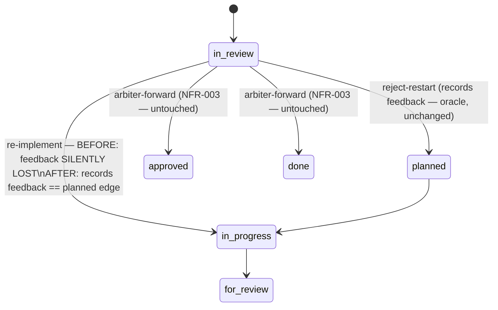

# Data Model — Rejection feedback reaches the implementer

This mission touches no new persistent schema; it corrects the routing and gating of EXISTING entities.
The "model" here is the set of domain entities from spec.md and the state edges they flow across.

## Entities

### Rejection edge (value)
A transition of a WP out of review. Two members handle feedback and must behave identically:
- `in_review → planned` (full restart) — the reference oracle; already records feedback correctly.
- `in_review → in_progress` (re-implement) — the defective edge (#4899).

Classified by the new pure predicate `is_review_rejection_edge(old_lane, target_lane)`:
`resolve_lane_alias(old) == IN_REVIEW and resolve_lane_alias(target) in (PLANNED, IN_PROGRESS)`, unioned with
`target == PLANNED` (to preserve any-source `→planned` rollback). Arbiter-forward edges
(`in_review → {approved, done}`) are deliberately excluded (NFR-003).

### Review-cycle record (durable, committed artifact)
`ReviewCycleArtifact` under `tasks/<wp_slug>/review-cycle-<N>.md`, written by
`persist_rejected_review_cycle_for_rollback` (`tasks_verdict_persistence.py:930`) and committed via the
`CoordCommitRouter`. Fields consumed by parity (FR-003): `cycle_number`, reviewer, verdict, feedback body,
`reference`. Partition: `WORK_PACKAGE_TASK` (routed via `_review_cycle_wp_dir`) — same on both topologies.
Invariant (FR-008): `cycle_number` increments exactly once per rejection.

### Feedback reference (pointer left on the event)
`event.review_ref` on the emitted `status.events.jsonl` transition. Two shapes:
- **Resolvable pointer** — `review-cycle://…` (real feedback location). Required outcome of a rejection edge.
- **Non-resolvable synthetic marker** — `review:<WP>` etc. (`is_non_resolvable_review_ref` skips these).
  The re-implement edge wrongly emits this today.
Partition of the event log: `STATUS_STATE` → COORD on coord topologies (the F4 defect surface).

### Fix-mode prompt (regenerated implementer prompt)
Produced by `generate_fix_prompt` from the latest `ReviewCycleArtifact`
(`workflow_executor.py::implement_try_render_fix_mode_prompt`). Must carry the reviewer's feedback text
(FR-005). On generation failure the system must surface a visible warning (FR-006) rather than silently
substitute a feedback-less full prompt.

## State edges (before → after this mission)

## Field-level parity contract (FR-003, SC-001)

For identical reviewer feedback text `F`, the record produced by `in_review → in_progress` must equal the
record produced by `in_review → planned` **by value**:

| Field | Parity requirement |
|-------|--------------------|
| committed artifact | both produce a committed `review-cycle-<N>.md` |
| feedback location (body) | both populated; resolving the reference yields text == `F` (not empty, not a placeholder) |
| `event.review_ref` | both a resolvable `review-cycle://…` pointer (not synthetic) |
| reviewer / verdict / `cycle_number` | equal field-for-field |

A record whose fields all exist but whose feedback content is empty/placeholder does NOT satisfy parity
(spec US1 scenario 3).

## Read-path partition model (F4 / FR-007)

| Read | Kind | Partition (coord) | Correct source |
|------|------|-------------------|----------------|
| review-cycle artifact | `WORK_PACKAGE_TASK` | PRIMARY | `_review_cycle_wp_dir` (already correct) |
| event log (`review_ref`) | `STATUS_STATE` | COORD | must route `read_dir(STATUS_STATE)` — the render fix |

Single-branch topology collapses PRIMARY and COORD to `repo_root`, so the re-route is a no-op there and
cannot regress single-branch rendering.
