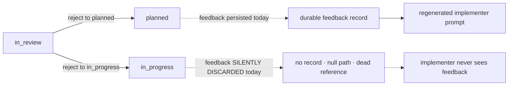

# Mission Specification: Rejection feedback reaches the implementer

**Mission Branch**: `issue-4899-review-feedback-to-implementer`
**Created**: 2026-09-27
**Status**: Draft
**Input**: Fix the rejection → re-implement review-feedback pipeline so a reviewer's rejection feedback survives all the way to the implementer's regenerated prompt (issues #4899 and #5024, epic #3044).

## User Scenarios & Testing *(mandatory)*

This mission repairs a broken loop in the review workflow: a reviewer rejects a
work package with written feedback, the work package returns to the implementer,
and the implementer is expected to see that feedback in the prompt they are
handed to try again. Today the feedback can be silently lost — either at the
moment it is recorded, or at the moment the follow-up prompt is generated.

### User Story 1 - Rejection feedback is durably recorded on the re-implement edge (Priority: P1)

A reviewer rejects a work package that is in review and sends it back to the
implementer to keep working (the in_review → in_progress transition), attaching
written feedback that explains what must change. Today, on this specific edge,
the feedback is silently discarded: no review-cycle record is written, the
stored feedback location is empty, and only a reference that cannot be resolved
is left behind. The sibling edge that sends the work package all the way back to
"planned" already records feedback correctly. This story makes the re-implement
edge behave identically to the "planned" edge.

**Why this priority**: This is the structural root cause. Until the feedback is
durably recorded with a resolvable reference on this edge, nothing downstream can
surface it — the implementer's prompt has nothing to read. Every other outcome
in this mission depends on this being fixed first.

**Independent Test**: Reject an in-review work package onto the re-implement edge
with feedback, then inspect the recorded review state: a review-cycle record must
exist and be committed, the feedback location must be populated, and the
reference left behind must resolve to the recorded feedback — matching, field for
field, what the "planned" edge produces from the same feedback. Compare against
the "planned" edge on a shared fixture so the parity claim cannot silently drift.

**Acceptance Scenarios**:

1. **Given** a work package in review with reviewer feedback, **When** the reviewer rejects it onto the in_review → in_progress (re-implement) edge, **Then** a committed review-cycle record is produced, the feedback location is populated, and the reference left behind resolves to that feedback — the same durable record the in_review → planned edge produces from identical feedback.
2. **Given** a reviewer rejecting an in-review work package onto the re-implement edge, **When** the rejection carries no rationale, **Then** the rejection is refused (it is not silently accepted).
3. **Given** an in-review work package rejected onto the re-implement edge with a specific feedback text, **When** the resulting record is compared with the record from the in_review → planned edge for the *same* feedback text, **Then** the two records are equivalent **by value** — the reference resolves to feedback text equal to the reviewer's input text, and every field matches the in_review → planned record field-for-field by value (not merely the same set of populated fields; a record whose fields all exist but whose feedback content is empty or a placeholder does NOT satisfy this).

---

### User Story 2 - Recorded feedback reaches the regenerated implementer prompt, or the failure is visible (Priority: P1)

Once feedback is durably recorded, the implementer must actually see it. When the
implementer is handed a fresh, focused "fix-mode" prompt after a rejection, that
prompt must contain the reviewer's feedback. There is a second, independent
defect here: if generating that focused prompt fails for any reason, the system
today quietly hands back a prompt with no feedback and no signal that anything
went wrong — so the implementer never learns feedback existed. This story
guarantees the feedback is rendered, and that a generation failure is loud rather
than silent, across both a single-branch mission and a coordination-topology
mission.

**Why this priority**: Persisting feedback (Story 1) is worthless if the
implementer never reads it. The silent feedback-less fallback is a distinct
failure mode from the write-side loss and must be closed separately: a correct
record can still be dropped on the floor at render time.

**Independent Test**: With feedback already persisted (Story 1), regenerate the
implementer's fix-mode prompt and confirm the feedback text appears in it — on
both a single-branch mission and a coordination-topology mission. Separately,
force fix-mode prompt generation to fail and confirm a visible warning is
surfaced and no feedback-less prompt is silently substituted.

**Acceptance Scenarios**:

1. **Given** durably recorded rejection feedback, **When** the implementer's fix-mode prompt is regenerated, **Then** the reviewer's feedback text is present in that prompt.
2. **Given** fix-mode prompt regeneration that fails for any reason, **When** the system handles that failure, **Then** it surfaces a visible warning and does not silently substitute a feedback-less prompt.
3. **Given** durably recorded rejection feedback in a single-branch mission and, separately, in a coordination-topology mission, **When** the fix-mode prompt is regenerated in each, **Then** the resolved feedback file's *contents* — the actual reviewer feedback text — render into the prompt in both topologies. On the coordination topology this MUST be verified against the resolved feedback file contents, not merely the presence of a feedback-reference string, so that a reference found but resolved against the wrong partition (feedback file missing) is caught rather than passing vacuously.
4. **(End-to-end coupling — anti-mask control)** **Given** a reviewer enters a *specific* feedback text and rejects an in-review work package onto the in_review → in_progress (re-implement) edge — with no pre-seeding of the record — **When** the implementer's fix-mode prompt is subsequently regenerated (exercised on both single-branch and coordination topologies), **Then** that exact feedback text appears in the regenerated prompt. This single continuous flow forces all the write-side gates *and* the render path to work together; it must not be satisfiable by pre-seeding a record on a fixture that bypasses the re-implement write edge.

### Edge Cases

- **No rationale on the re-implement edge**: a rejection with no feedback text on the in_review → in_progress edge must be refused, not accepted as an empty rejection. (Contrast: the pre-mission behavior wrongly accepts it.)
- **Fix-mode generation failure**: any failure while building the focused post-rejection prompt must produce a visible warning; the system must never silently degrade to a feedback-less prompt.
- **Coordination vs single-branch parity**: feedback must render in the regenerated prompt regardless of whether the mission is single-branch or coordination-topology; a fix that only works for one topology is incomplete.
- **Review-cycle counting on the new edge (conditional)**: if the review-cycle counter is observed to double-increment on the re-implement edge, that miscount (#3451) is corrected as part of the write-side change; if it does not reproduce on this edge, it stays out of scope.
- **Feedback vocabulary unchanged**: the synthetic-marker / resolvable-pointer grammar that distinguishes a real feedback pointer from a placeholder already exists and is correct; this mission reuses it and does not alter it.

## Requirements *(mandatory)*

### Functional Requirements

| ID | Title | User Story | Priority | Status | Delivery | No-op passable? |
|----|-------|------------|----------|--------|----------|-----------------|
| FR-001 | Persist a durable feedback record on the re-implement edge | As a reviewer, I want my rejection feedback on the in_review → in_progress edge to be durably recorded so that the implementer can act on it. | High | Open | [build] | no |
| FR-002 | Populate a resolvable feedback reference on the re-implement edge | As an implementer, I want the reference left by a re-implement rejection to resolve to the actual feedback so that the feedback can be located and read. | High | Open | [build] | no |
| FR-003 | Parity with the in_review → planned edge | As a maintainer, I want the re-implement rejection edge to produce the same durable feedback record (committed artifact, populated feedback location, resolvable reference) as the in_review → planned edge so that feedback handling is uniform across rejection edges. | High | Open | [build] | no — proven against the →planned edge on a shared fixture |
| FR-004 | Refuse a no-rationale rejection on the re-implement edge | As a maintainer, I want a rejection with no rationale on the re-implement edge to be refused so that empty rejections cannot silently drop through. "Refused" means an **observable failure** — the transition is aborted / returns a non-zero error — not a logged no-op that still records the transition. | High | Open | [build] | no — paired with an accepted with-rationale rejection on the same fixture |
| FR-005 | Render recorded feedback into the regenerated implementer prompt | As an implementer, I want persisted rejection feedback to appear in my regenerated fix-mode prompt so that I know what to change. | High | Open | [build] | no |
| FR-006 | Emit a visible warning on fix-mode prompt-generation failure | As an implementer, I want a fix-mode prompt-generation failure to raise a visible warning instead of silently handing me a feedback-less prompt so that lost feedback never goes unnoticed. The bar is that the failure is **surfaced visibly to the operator/implementer** (not merely written to a log that the prompt-consuming surface never shows); a warn-then-still-substitute path satisfies this ONLY if that warning is genuinely visible on the surface the implementer reads. | High | Open | [build] | no — paired with a positive control that renders feedback on the success path |
| FR-007 | Render feedback across single-branch and coordination topologies | As an implementer on any mission topology, I want recorded feedback to render into my regenerated prompt on both single-branch and coordination-topology missions so that the fix is not topology-specific. | High | Open | [build] | no |
| FR-008 | Correct the review-cycle counter on the re-implement edge if it double-increments | As a maintainer, I want the review-cycle counter to increment correctly on the re-implement edge so that cycle counts are accurate. If #3451 reproduces on this edge, this FR carries its OWN red-first scenario proving the counter increments exactly once (not twice) on a re-implement rejection; if it does not reproduce, it stays out of scope. | Medium | Open | [folded] | no — conditional fold of #3451 into the write-side work; carries its own red-first count-correctness scenario when triggered |

### Non-Functional Requirements

| ID | Title | Requirement | Category | Priority | Status |
|----|-------|-------------|----------|----------|--------|
| NFR-001 | Reuse existing feedback vocabulary | The mission must reuse the existing synthetic-marker / resolvable-pointer grammar without modifying it; zero changes to that grammar's definition. | Compatibility | High | Open |
| NFR-002 | Red-first regression coverage per defect | Each defect must carry an issue-pinned acceptance scenario that is demonstrably red before the fix and green after: the write-side loss (#4899), the silent render-time fallback (#5024), the end-to-end coupling (SC-005), and — *if* the conditional #3451 fold triggers — the counter double-increment (see FR-008). 100% of the acceptance criteria are covered by such scenarios, subject to the SC-004 coord red-first caveat resolved in plan. | Reliability | High | Open |
| NFR-003 | No regression of the arbiter-override moment | The write-side change must not regress the arbiter-override moment behavior (#4809); existing arbiter-override coverage must remain green. | Reliability | High | Open |

### Constraints

| ID | Title | Constraint | Category | Priority | Status |
|----|-------|------------|----------|----------|--------|
| C-001 | Scope limited to #4899 and #5024 | The mission delivers only issues #4899 and #5024 under epic #3044; no other issues are folded except the conditional #3451 fold. | Scope | High | Open |
| C-002 | Explicit non-goals | #4327 (summary-attribute CLI wiring), #5007 (issue-matrix approval gating), #4809 (arbiter-override moment drop, though non-regression is required), and #3563 (frozen, deferred retirement) are explicitly out of scope and must not be folded in. | Scope | High | Open |
| C-003 | Coupled write-side change | The write-side fix (durable record + populated feedback location + resolvable reference + no-rationale refusal) is one coupled behavioral change; a partial fix that leaves feedback invisible is not acceptable. | Technical | High | Open |
| C-004 | No version numbers in scope | No version numbers are part of this mission's scope or acceptance. | Business | Medium | Open |

### Key Entities

- **Rejection edge**: a state transition of a work package out of review — either back to "planned" (full restart) or to "in_progress" (re-implement). The two edges must handle feedback identically.
- **Review-cycle record**: the durable, committed artifact that captures a single reviewer rejection and its feedback for a work package.
- **Feedback reference**: the pointer left behind by a rejection that must resolve to the recorded feedback; it must be a resolvable pointer, not a non-resolvable synthetic placeholder.
- **Fix-mode prompt**: the focused prompt regenerated for the implementer after a rejection, which must carry the reviewer's feedback.

## Assumptions & Dependencies

- **Parent epic**: this mission is one instance under epic #3044 ("a negative verdict must survive to its consumer"); it does not close the epic.
- **Grammar precondition (NFR-001)**: the synthetic-marker / resolvable-pointer feedback vocabulary already exists and is correct on the current base (shipped by #4801). This mission assumes and reuses it unchanged; if that grammar were found broken, that would be a separate defect outside this scope.
- **Sibling edge is the reference oracle**: the in_review → planned rejection edge is assumed to persist feedback correctly today and is used as the parity oracle for the re-implement edge.
- **Coord render dependency (see SC-004 caveat)**: whether the coordination-topology render defect is independent of the write-side loss is unconfirmed at spec time and is resolved during plan.

## Success Criteria *(mandatory)*

### Measurable Outcomes

- **SC-001**: A rejection onto the re-implement edge with feedback produces a committed review-cycle record, a populated feedback location, and a resolvable reference — matching the in_review → planned edge for the same feedback on a shared fixture. — [build] · no-op passable: no
- **SC-002**: A rejection carrying no rationale on the re-implement edge is refused 100% of the time (0 empty rejections silently accepted). — [build] · no-op passable: no — paired with an accepted with-rationale rejection on the same fixture
- **SC-003**: A fix-mode prompt-generation failure surfaces a visible warning in 100% of failure cases and never substitutes a silent feedback-less prompt. — [build] · no-op passable: no — paired with a success-path positive control that renders feedback
- **SC-004**: Recorded rejection feedback renders into the regenerated implementer prompt on both single-branch and coordination-topology missions (both topologies pass). The coordination-topology check MUST assert the **resolved feedback file contents** (the actual feedback text rendered), not merely that a feedback-reference string was located — otherwise a reference resolved against the wrong partition (feedback file missing) would pass the assertion vacuously and leave the coord defect masked. — [build] · no-op passable: no — **red-first caveat (resolve in plan)**: the coord half is a valid red-first defect scenario ONLY if coord render is independently broken *given a feedback record already present*; the plan must confirm this. If coord render is merely a downstream consequence of the write-side loss (i.e. green once the record is resolvable), reclassify the coord half as a **non-regression / parity** assertion rather than a red-first defect.
- **SC-005**: One continuous end-to-end flow — reviewer's specific feedback text → reject onto the re-implement edge (no pre-seeding) → same text present in the regenerated fix-mode prompt — passes on both topologies. This is the anti-mask control that fails if any of the write-side gates or the render path is left unfixed. — [build] · no-op passable: no — cannot be satisfied by a fixture that pre-seeds the record and bypasses the re-implement write edge
