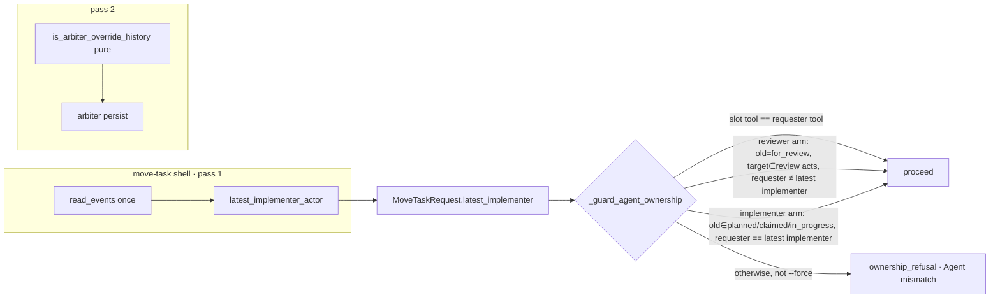

# Implementation Plan: Rework is not an override

**Branch**: `issue-5196-rework-is-not-an-override` | **Date**: 2026-09-28 | **Spec**: [spec.md](spec.md)
**Input**: Mission specification from `kitty-specs/rework-is-not-an-override-01M3MQV6/spec.md`

## Summary

`move-task` is the only red surface for an ordinary review loop. `agent action implement`/`review` and the orchestrator API run no ownership check, so they already work unforced. Two defects make the loop dishonest:

1. **Role-blind ownership guard.** `_guard_agent_ownership` (`src/specify_cli/cli/commands/agent/tasks_transition_core.py:439`) compares only the tool of the agent slot's occupant with the tool of the requester. After a rejection or a resubmit, that slot holds the *other* role, so the implementer's rework and the reviewer's review acts are refused and need `--force`.
2. **Over- and under-matching override classifier.** `_is_arbiter_override` (`src/specify_cli/review/arbiter.py:337`) flags any forced move out of `planned` to `for_review`/`claimed`/`approved` whose *latest event* is a `for_review → planned` rejection.

The design adds **one role fact**, resolved by the shell from **one read** of the WP's events, plus **two narrow allow-arms** in the ownership guard:

- **Reviewer arm**: a review act from `for_review` by an actor distinct from the latest implementer is allowed.
- **Implementer arm**: a rework move from `planned`/`claimed`/`in_progress` by the latest implementer is allowed.

Separately, the override classifier becomes a **pure predicate over the WP's event history**. It fires only for a forced `planned → approved/done` whose putting-into-`planned` transition is a review rejection, from either `for_review` or `in_review`. The slot re-plant behaviour of #4673 is unchanged: no slot mutation, and the `replants_claim` test stays valid.

## Engineering Alignment

- **Invariant**: an arbiter override is recorded iff a *forced* `planned → approved|done` follows a rejection (a transition into `planned` from `for_review|in_review` carrying a `review_ref`). Nothing else records one.
- **Invariant**: the ownership guard is still the default. The allow-arms only admit the two roles the event log proves, `--force` remains the escape hatch, and `in_review → *` verdicts stay claim-holder-only (C-008).
- **Transition/event assumption**: no new event types and no wire change (C-006). The facts derive from existing `StatusEvent`s (`from_lane`, `to_lane`, `actor`, `review_ref`, `force`).
- **Decision basis**: operator brief plus #5196 acceptance, and Decision Moment `01M3MQXYAFEYE62RA5513KKNX6` (the arbiter definition). No further operator question was needed: the mechanism choice below is evidence-driven and preserves every existing contract, and it is recorded in research.md (R-01..R-04).

## Technical Context

**Language/Version**: Python 3.11+ (mypy --strict, ruff incl. C901 ≤ 15)
**Primary Dependencies**: typer (CLI), existing `specify_cli.status` event store (`read_events`), `spec_kitty_events` (consumed, unchanged)
**Storage**: append-only `status.events.jsonl` in the mission directory (read-only for the new facts). The arbiter decision persists through the existing `persist_arbiter_decision` → `InnerStateChanged` review delta, unchanged.
**Testing**: pytest. ATDD red-first acceptance through the real `move-task` Typer app (`CliRunner`, LANES / non-coord fixture adapted from `tests/specify_cli/cli/commands/agent/test_move_task_reject_fix_approve_cycle.py`), plus pure unit truth tables for the two predicates.
**Target Platform**: cross-platform CLI (Linux/macOS/Windows)
**Project Type**: single project (`src/specify_cli`)
**Performance Goals**: at most one additional `read_events` per `move-task` invocation (NFR-001, < 2 s CLI budget)
**Constraints**: C-001..C-008 of the spec. In particular, no edits under `src/specify_cli/consolidation/**` or `tests/integration/**`; keep the `ownership_refusal` code and the `Agent mismatch` prefix; no heavy suites (`NO_FULL_HEAVY_SUITES_IN_MISSION`).
**Scale/Scope**: ~200 src LOC and ~650 test LOC across 4 work packages (post-spec sizing lens)

## Charter Check

| Charter rule | Status | Note |
|---|---|---|
| Single canonical authority | PASS, with a flagged residual | One pure "who is the implementer" projection is added in the status domain. `consolidation/preflight.py::_latest_actor_for_transition` is a parallel read that Slice 1 owns (C-001). It is recorded as a split-brain follow-up and not unified here (research R-04). |
| ATDD-first / red-first | PASS | The first WP lands the RED real-CLI acceptance matrix before any behaviour change (charter C-011). |
| Campsite (SO #2) | PASS | Tidy-first: split `_is_arbiter_override` into a pure predicate plus an I/O shell with a characterization truth table (behaviour-preserving). |
| Architectural gate discipline | PASS | No new gate. The guard change is covered by non-vacuous positive/negative pairs on one fixture. |
| Terminology canon | PASS | Mission, not feature. The terminology guard runs on the guidance edits. |
| Pack tiers | PASS | Guidance edits target shipped skills (`src/charter/offering/skills/…`) and `packs/built-in/.../review/prompt.md`: consumer doctrine that states consumer behaviour. No maintainer-only prose. |
| No heavy suites | PASS | Per-WP targeted files only; closeout runs the targeted set. |
| Complexity ≤ 15 | WATCH | `_do_move_task` is cc 14 and `build_transition_plan` cc 12. New logic lives in new pure helpers, and the guard gains ≤ 2 branches (extract `_ownership_role_allowance`). |

## Design



- **Role projection** (new, pure; `src/specify_cli/status/review_roles.py`): `latest_implementer_actor(events, wp_id) -> str | None`. The exact rule is in `contracts/ownership-role-allowance.md`: it skips reviewer rework verdicts and generic actors.
- **Request fact**: `MoveTaskRequest.latest_implementer: str | None = None`. The default keeps `_base_request` test constructors valid. It is resolved inline in `_mt_gather_review_facts` (`tasks_move_task.py:~947`) via `read_events_transactional` (same keywords as `_mt_current_event_lane`), fails closed to `None`, and is passed into `_mt_build_request` as a keyword. No new top-level `_mt_*` function is added, because the compat surface registry would force a re-export.
- **Guard** (`_guard_agent_ownership`): after the existing generic-actor and same-key checks, consult a new pure `_ownership_role_allowance(req)`. `True` → `None` (allowed). The refusal body, code and diagnostic are unchanged (C-008).
- **Override classifier** (`review/arbiter.py`): `is_arbiter_override_history(events, wp_id, old_lane, target_lane, force)` is pure. It requires `force`, `old == planned`, `target ∈ {approved, done}`, and a latest event that is a rejection (`→ planned` from `for_review|in_review` with a `review_ref`; this is a private helper, also used by `_run_arbiter_override`). `_is_arbiter_override` becomes a thin shell over it. The consumers are unchanged: `arbiter_persist_signal`, `Emit.arbiter_forward`, and `tasks_verdict_persistence.py:842`.
- **Guidance**: the ownership refusal hint gains one line. After a review rejection, the implementer resumes with their own identity, and a reviewer distinct from the implementer can review, with no `--force` for either. The skills, `references/review-checklist.md` and `docs/guides/how-to/missions/review-work-package.md:142` drop `--force` from the ordinary reject/rework/re-review steps and keep the arbiter guidance.

## Project Structure

### Documentation (this mission)

```
kitty-specs/rework-is-not-an-override-01M3MQV6/
├── spec.md, plan.md, research.md, data-model.md, quickstart.md
├── contracts/ (ownership-role-allowance.md, arbiter-override-classification.md)
├── traces/ (tooling-friction.md, approach.md, design-decisions.md)
└── tasks/ (generated by /spec-kitty.tasks)
```

### Source Code (repository root)

```
src/specify_cli/status/review_roles.py                       # NEW pure leaf: latest_implementer_actor (re-exported by status/__init__.py)
src/specify_cli/status/__init__.py                           # facade re-export (SR-2 boundary gate)
src/specify_cli/review/arbiter.py                            # pure predicate + shell
src/specify_cli/cli/commands/agent/tasks_transition_core.py  # request field + guard allow-arms
src/specify_cli/cli/commands/agent/tasks_move_task.py        # resolve latest_implementer (pass 1)
src/charter/offering/skills/spec-kitty-implement-review/SKILL.md
src/charter/offering/skills/spec-kitty-runtime-review/SKILL.md (+ references/review-checklist.md)
packs/built-in/missions/mission-steps/software-dev/review/prompt.md
tests/specify_cli/cli/commands/agent/_rework_loop_harness.py + test_rework_{guard_ratchets,unforced_loop,override_classification}.py   # NEW acceptance
tests/unit/status/test_review_roles.py                                    # NEW (precedent: review_claim_predicate)
docs/guides/how-to/missions/review-work-package.md                        # guidance (:142)
tests/specify_cli/review/test_arbiter.py, tests/review/test_arbiter.py    # re-pin stale over-match pins
tests/specify_cli/cli/commands/agent/test_tasks_transition_core.py        # guard unit rows
```

**Structure Decision**: single project. The new pure module sits in `specify_cli.status` next to the event model it projects. No layer-rule change: `status` is already imported by `review` and by `cli`.

## Complexity Tracking

No charter violations requiring justification.

## Implementation Concern Map

The decomposition follows the post-plan design lens. Owned files are strictly disjoint, and each WP owns its own RED-first acceptance file.

### IC-01 — Shared acceptance harness and ratchet controls

- **Purpose**: provide a real-CLI, distinct-tool, every-hop-driven loop harness with the five override probes, and pin the behaviour that is green on the base and must stay green.
- **Relevant requirements**: FR-006, FR-008, FR-005 (the for_review-source ratchet), SC-004, C-007, NFR-004
- **Affected surfaces**: `tests/specify_cli/cli/commands/agent/_rework_loop_harness.py` (new); `tests/specify_cli/cli/commands/agent/test_rework_guard_ratchets.py` (new)
- **Sequencing/depends-on**: none
- **Risks**: blind probes. The for_review-source genuine override must light up all five probes on the same fixture. The harness must never seed hops with past timestamps.

### IC-02 — Ownership guard role allow-arms

- **Purpose**: let the latest implementer resume and resubmit rework, and let a non-implementer review from `for_review` (claim, approve, reject), without `--force`, while unrelated agents stay refused on rework moves and `in_review` verdicts.
- **Relevant requirements**: FR-001, FR-002, FR-003, FR-006, C-004, C-008, NFR-001, NFR-002
- **Affected surfaces**: `src/specify_cli/status/review_roles.py` (new), `src/specify_cli/status/__init__.py`, `src/specify_cli/cli/commands/agent/tasks_transition_core.py`, `src/specify_cli/cli/commands/agent/tasks_move_task.py`, `tests/unit/status/test_review_roles.py` (new), `tests/specify_cli/cli/commands/agent/test_tasks_transition_core.py`, `tests/specify_cli/cli/commands/agent/test_rework_unforced_loop.py` (new; first commit RED)
- **Sequencing/depends-on**: IC-01
- **Risks**: generic-actor and review-verdict exclusions (contract). The refusal `error` string is pinned byte-exact, so any hint goes in `console_warning` only. Named arch gates: `test_status_module_boundary.py`, `test_no_dead_symbols.py`, `test_no_dead_modules.py`, `test_layer_rules.py`, `test_cold_import_status_boundary.py`, `test_fast_tier_marker_completeness.py`, `test_src_reachability_guard.py`, `test_status_events_writes_gate.py`, `test_2093_authority_invariant.py`, `test_verdict_vocab_single_source.py`.

### IC-03 — Arbiter override classification narrowed

- **Purpose**: record an override only for a forced `planned → approved|done` after a rejection from `for_review` or `in_review`, via a pure predicate. Tidy-first: split the predicate out, pinned by a characterization truth table, before the behaviour change.
- **Relevant requirements**: FR-004, FR-005, SC-002, SC-003
- **Affected surfaces**: `src/specify_cli/review/arbiter.py`, `tests/specify_cli/review/test_arbiter.py`, `tests/review/test_arbiter.py`, `tests/specify_cli/cli/commands/agent/test_rework_override_classification.py` (new; RED deltas first)
- **Sequencing/depends-on**: IC-01; parallel with IC-02
- **Risks**: the approved-cycle suppression at `tasks_verdict_persistence.py:~810-842` now also applies after an `in_review` rejection, so it needs a test. The `planned → done` row needs `--done-override-reason` (use the unit table for `done` and the CLI for `approved`). Named arch gates: `test_no_dead_symbols.py`, `test_verdict_vocab_single_source.py`, `test_untrusted_path_containment.py`.

### IC-04 — Guidance matches the unforced loop

- **Purpose**: stop the shipped guidance from teaching `--force` for ordinary reject/rework/re-review, and keep the arbiter, self-review and done-override guidance.
- **Relevant requirements**: FR-007
- **Affected surfaces**: `src/charter/offering/skills/spec-kitty-implement-review/SKILL.md` (≈429, 498, 535, 932-934), `src/charter/offering/skills/spec-kitty-runtime-review/SKILL.md:120`, `src/charter/offering/skills/spec-kitty-runtime-review/references/review-checklist.md:26`, `docs/guides/how-to/missions/review-work-package.md:142`, `tests/doctrine/test_rework_guidance_unforced.py` (new RED guard). `packs/built-in/.../review/prompt.md` is dropped from scope: it already uses an unforced `--to in_progress`.
- **Sequencing/depends-on**: IC-02, IC-03
- **Risks**: skill content tests (`tests/doctrine/test_spec_kitty_skill_content.py`, `test_spk_skill_pack.py`) and the terminology guard. Guidance must not overclaim reviewer independence (research R-07).
