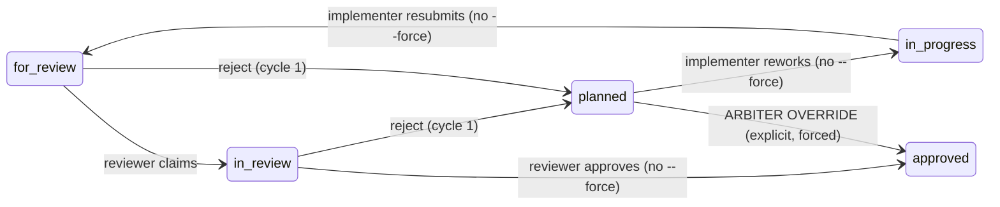

# Mission Specification: Rework is not an override

**Mission Branch**: `issue-5196-rework-is-not-an-override`
**Created**: 2026-09-28
**Status**: Draft
**Input**: Operator brief (slice 7 of epic #3044, "rework is not an override") plus issue #5196. #3473 was evaluated in pre-planning and closed as overlapping #3010 (see Assumptions).

## Intent Summary

- **Primary actors**: an **implementer** agent who owns a work package (WP), and an **independent reviewer** agent who reviews it.
- **Trigger**: a reviewer rejects a WP (it returns to `planned` with review feedback). The implementer reworks it and resubmits it, and a reviewer approves the reworked WP.
- **Desired outcome**: this ordinary two-cycle loop (reject → rework → resubmit → approve) completes **without `--force` at any step**. The review history then shows two review cycles and **no arbiter override**, because none happened.
- **Rule that must always hold**: an *arbiter override* is recorded **only** when someone explicitly overrules a rejection. That means forcing a rejected WP from `planned` straight to `approved`/`done` without a new review. A genuine arbiter override is still recorded, whether the rejection came from `for_review` or from `in_review`.
- **Boundary**: the agent-ownership guard stays a guard. An unrelated agent that neither owns the WP nor is reviewing it is still refused without `--force`.

Today the ownership check keys on the WP's agent slot, and the three ordinary review routes leave that slot wrong for the next actor:

- A **`for_review → planned` rejection** by the reviewer is itself refused without `--force`. Forcing it re-plants the reviewer into the agent slot, and the implementer's rework claim, `in_progress` and resubmit are then all refused.
- An **`in_review → in_progress` rejection**, the route the shipped review prompt uses, leaves the reviewer in the slot, so the implementer's resubmit is refused.
- An **`in_review → planned` rejection** releases the slot (#4673), so rework itself works. However, the implementer's resubmit puts the implementer back in the slot, and the reviewer's next review claim (`for_review → in_review`) or single-hop approval is then refused.

Each refusal is cleared with `--force`. The override heuristic then treats a forced forward move out of `planned` after a `for_review` rejection as an arbiter override, so an ordinary rework is reported as `Cycle N: rejected → overridden`. It also misses genuine overrides after an `in_review` rejection.

The ownership check compares agent **tools** only (e.g. `claude`), not full identities. An implementer and a reviewer running on the same tool never trip it. That residual is out of scope (C-007).

## User Scenarios & Testing *(mandatory)*

### User Story 1 - Rework loop needs no --force (Priority: P1)

An implementer's WP is rejected. They pick the WP back up, address the feedback and resubmit it for review, all without `--force`. A different reviewer then approves it without `--force`.

**Why this priority**: every mission with a rejection cycle hits this today (seen in `criterion-labels-positive-controls-01M3EWRT`, #5061). Having to use `--force` on the normal path teaches agents to reach for `--force` and blurs genuine bypasses.

**Independent Test**: drive a real mission fixture through the CLI. Implement, submit, reject with feedback, rework, resubmit, then approve. The implementer, reviewer and third agent must use identities with **different tools** (C-007). Cover each of the three rejection routes. Every hop after the initial submission goes through `move-task`, and none is seeded. Assert that every command succeeds without `--force` and that no event after the rejection has `force: true`.

**Acceptance Scenarios**:

1. **Given** a WP in `for_review` submitted by implementer I, **When** reviewer R (R ≠ I) rejects it to `planned` with feedback, or claims it into `in_review`, without `--force`, **Then** the move succeeds.
2. **Given** a WP rejected by R through any of the three routes (`for_review → planned`, `in_review → planned`, `in_review → in_progress`), **When** I resumes it (claim / `in_progress`) and resubmits it to `for_review` without `--force`, **Then** each move succeeds.
3. **Given** the resubmitted WP, **When** R (or another reviewer distinct from I) claims it into `in_review` and approves it, or approves it in a single hop from `for_review`, without `--force`, **Then** each move succeeds.
4. **Given** the WP after rejection and before resubmission, **When** a third agent X (neither I nor the review-claim holder) tries to resume or resubmit it without `--force`, **Then** the ownership guard still refuses: exit code non-zero, the `Agent mismatch` refusal, and no event appended.
5. **Given** a WP in `in_review` claimed by R, **When** X tries to approve or reject it without `--force`, **Then** the ownership guard still refuses.

---

### User Story 2 - Review history tells the truth (Priority: P1)

After an ordinary two-cycle loop, the operator reads the WP's review history and sees two review cycles, one rejected and one approved, and no arbiter override.

**Why this priority**: a fabricated "overridden" verdict falsely signals that a rejection was overruled. That corrupts review-integrity signals (#3044) and inflates hollow-review proxies (#3010).

**Independent Test**: after the loop in Story 1, inspect **every** override surface:
- the raw event log, for any review-override delta ever written;
- the reduced review slot and override listing;
- the `review_ref` on forward events leaving `planned`;
- the move command's "Arbiter override recorded" output;
- the `agent tasks status` override history.

None may show an override. The same probes must light up on the genuine-override fixture of Story 3.

**Acceptance Scenarios**:

1. **Given** the completed two-cycle loop, **When** the WP status and review history are read, **Then** there is no persisted arbiter decision and no review-override record for the WP, and the history reads cycle 1 rejected, cycle 2 approved.
2. **Given** a rejected WP, **When** its implementer resumes it (`claimed`) or resubmits it (`for_review`) *with* a redundant `--force` (a legacy habit), **Then** neither move is recorded as an arbiter override.
3. **Given** the completed two-cycle loop, **When** the WP's review-cycle records are listed, **Then** `review-cycle-1.md` (rejected) and `review-cycle-2.md` (approved) both exist with those verdicts (observed for #5194; see Assumptions).

---

### User Story 3 - A genuine arbiter override is still recorded (Priority: P1)

An arbiter deliberately overrules a rejection by forcing a rejected WP from `planned` straight to `approved` or `done`, with a note. That is recorded as an arbiter override exactly as today. After an `in_review` rejection, which today is silently missed, it is now recorded too.

**Why this priority**: this is the positive control. Narrowing the classification must not blind the system to real overrides.

**Independent Test**: reject a WP (once via `for_review`, once via `in_review`), then force it `planned → approved` with a note. Assert an arbiter decision is persisted and the history shows `rejected → overridden`.

**Acceptance Scenarios**:

1. **Given** a WP rejected from `for_review`, **When** it is forced `planned → approved` with a note, **Then** an arbiter decision is persisted and the cycle reads `rejected → overridden`.
2. **Given** a WP rejected from `in_review`, **When** it is forced `planned → approved` with a note, **Then** an arbiter decision is persisted and the cycle reads `rejected → overridden`.
3. **Given** a WP rejected and then given an intervening annotation (a non-lane event), **When** it is forced `planned → approved`, **Then** the override is still recorded. This is a ratchet: it is green on the base and pinned.

### Edge Cases

- A rejection whose `review_ref` is absent (a plain forced rollback, not a review rejection) is not treated as a rejection for override purposes. This is unchanged.
- The rework is resumed through the canonical `agent action implement WP##` path rather than `move-task`. That path needs no `--force` either, and records no override.
- The reviewer rejects again in cycle 2, giving a three-cycle loop. Each resubmission is still not an override.
- The same agent identity is both implementer and reviewer (self-review). The existing self-review fallback path, with its `--force` and `ReviewerSelfApproval` recording, is unchanged. This mission does not change self-review semantics.
- After an `in_review → planned` rejection the agent slot is **released** (#4673), and an unclaimed WP is open to claim by any agent, today and after this mission. The FR-006 refusals apply while the slot is occupied: after a `for_review → planned` or `in_review → in_progress` rejection, and while the implementer or review-claim holder owns the WP.
- A direct `planned → in_review` move that skips the resubmission is not an ordinary resubmission, and the acceptance tests must not rely on it. Its current behaviour is unchanged.
- The implementer and reviewer run on the same tool (e.g. both `claude:*`). The ownership check never fires between them; that is out of scope (C-007).
- The WP moves `planned → for_review` without passing through `in_progress` after rework. It is still an ordinary resubmission, subject to the existing subtask checks, and not an override.

## Requirements *(mandatory)*

### Functional Requirements

| ID | Title | User Story | Priority | Status | Delivery | No-op passable? |
|----|-------|------------|----------|--------|----------|-----------------|
| FR-001 | Implementer resumes rework unforced (move-task) | As the implementer of a WP rejected by any of the three routes, I want to resume it via `move-task` (claim / `in_progress`) without `--force` so that ordinary rework is not a bypass. | High | Open | [build] | no — red today on the `for_review → planned` and `in_review → in_progress` routes; paired with FR-006 on the same fixture |
| FR-002 | Implementer resubmits rework unforced | As that implementer, I want to move the reworked WP to `for_review` without `--force` so that resubmission is an ordinary transition. | High | Open | [build] | no — red today ("Agent mismatch … Use --force") |
| FR-003 | Independent reviewer reviews unforced via move-task | As a reviewer distinct from the implementer, I want to claim a `for_review` WP into `in_review`, approve it (single hop or from my `in_review` claim), and reject it to `planned` with feedback, all via `move-task` without `--force`, whoever the agent slot currently holds, so that independent review is not recorded as a forced bypass. | High | Open | [build] | no — review claim and single-hop approval are red today |
| FR-004 | Rework is never an arbiter override | As an operator, I want a rework resumption or resubmission (forced or not, to `claimed`, `in_progress` or `for_review`) to persist no arbiter decision and no review-override record, so that the review history never reports `rejected → overridden` for ordinary rework. | High | Open | [build] | no — red today via forced resubmit; paired with FR-005 (positive control on the same rejection fixture) |
| FR-005 | Genuine arbiter override still recorded, incl. after in_review rejection | As an arbiter, I want a forced `planned → approved`/`done` move after a rejection (from `for_review` *or* `in_review`) to be recorded as an arbiter override, so that real overrides stay visible. | High | Open | [build] (in_review source) / [ratchet] (for_review source) | no — in_review case red today (undetected) |
| FR-006 | Ownership guard still refuses unrelated agents | As an operator, I want an agent that is neither the WP's latest implementer nor its review-claim holder to still be refused without `--force` on rework moves and on `in_review` verdicts, so that relaxing the guard does not remove it. | High | Open | [ratchet] | yes — green before and after; it is the positive control that makes FR-001/FR-002/FR-003 non-vacuous (same fixture, distinct tool) |
| FR-007 | Guidance matches the unforced loop | As an agent following Spec Kitty guidance, I want the shipped rework/review guidance to stop telling me to use `--force` for ordinary rejection, rework or re-review. That covers the implement-review and runtime-review skills, the review-checklist reference, the ownership refusal text, and the review mission-step prompt. Otherwise I record fake bypasses. The legitimate arbiter-override guidance stays. | Medium | Open | [build] | no — current text instructs `--to planned --force` |
| FR-008 | Canonical implement path stays unforced | As the implementer, I want `agent action implement WP##` on a rejected WP to keep working without `--force` and to record no override. | Medium | Open | [ratchet] | yes — green on base today (pinned so the move-task fix cannot regress it) |

### Non-Functional Requirements

| ID | Title | Requirement | Category | Priority | Status |
|----|-------|-------------|----------|----------|--------|
| NFR-001 | No transition slowdown | A `move-task` transition on a WP with a 2-cycle history completes within the existing CLI budget (< 2 s on a typical project), adding at most one extra read of the WP's event log per transition. | Performance | Medium | Open |
| NFR-002 | Complexity ceiling | Every function touched or added has cyclomatic complexity ≤ 15 (ruff C901 / Sonar S3776). | Maintainability | High | Open |
| NFR-003 | New-code coverage | Changed lines reach ≥ 90% diff coverage, and every new branch/helper has a focused test in the same work package. | Quality | High | Open |
| NFR-004 | Red-first proof | Every `[build]` FR/SC has a test shown RED on the planning base and GREEN at the WP's final commit, driven through the real `move-task` CLI entry point. `[ratchet]` rows are shown GREEN on both. | Quality | High | Open |

### Constraints

| ID | Title | Constraint | Category | Priority | Status |
|----|-------|------------|----------|----------|--------|
| C-001 | Sibling-slice ownership | No edits under `src/specify_cli/consolidation/**` or `tests/integration/**` (Slice 1). No re-pinning of golden/snapshot files or doctor/decision surfaces under `tests/specify_cli/**` (Slice 3). | Technical | High | Open |
| C-002 | force_count semantics out of scope | This mission does not change how `force_count` is computed or warned on (#3010, events package + consolidation preflight). Fewer forced transitions is an accepted side effect, not a goal. | Technical | High | Open |
| C-003 | Self-review unchanged | The `--self-review-fallback` path (its `--force` requirement and `ReviewerSelfApproval` recording) is not changed. | Technical | Medium | Open |
| C-004 | Guard retained | The agent-ownership guard is narrowed, not removed or bypassed wholesale. `--force` remains the explicit escape hatch for genuine bypasses. | Technical | High | Open |
| C-005 | No heavy suites in mission | Per `NO_FULL_HEAVY_SUITES_IN_MISSION`, validation runs targeted test files, owning-module fast tiers and named architectural gate files only. | Process | High | Open |
| C-007 | Tool-scoped guard residual | The ownership check compares agent tools, not full identities. Tests must use implementer/reviewer/third-agent identities with **distinct tools** (e.g. `claude:…:implementer`, `codex:…:reviewer`, `gemini:…`). Same-tool cross-role pairs are out of scope, noted as a residual. | Technical | High | Open |
| C-008 | Refusal contract preserved | The ownership refusal keeps its `ownership_refusal` code and its `Agent mismatch` message prefix. The reviewer-vs-reviewer race on `in_review` verdicts keeps its classification. | Technical | High | Open |
| C-006 | External contracts untouched | No change to `spec_kitty_events` / `spec_kitty_tracker` contracts or the event wire format. | Technical | High | Open |

### Key Entities

- **Work package (WP)**: the unit moving through the 9-lane status machine. It has an **agent assignment** (the slot the ownership guard checks) and an event history.
- **Rejection**: a review verdict returning the WP for rework (`for_review → planned`, `in_review → planned` or `in_review → in_progress`) that carries review feedback (a `review_ref`).
- **Rework resumption / resubmission**: the implementer's moves after a rejection (`planned → claimed/in_progress`, then `→ for_review`).
- **Arbiter override**: an explicit overruling of a rejection, i.e. a forced `planned → approved/done` after a rejection. It is persisted as an arbiter decision plus a review-override record, and shown as `rejected → overridden`.
- **Agent-ownership guard**: the transition check that refuses a move by an agent (compared by tool) other than the WP's assigned agent, unless `--force` is given.
- **Latest implementer**: the actor of the WP's most recent move into `claimed`/`in_progress`.
- **Review-claim holder**: the actor who moved the WP into `in_review`.

## Success Criteria *(mandatory)*

### Measurable Outcomes

- **SC-001**: A two-cycle reject → rework → resubmit → approve loop, driven through the real CLI for each of the 3 rejection routes, has **0** events with `force: true` after the rejection. — [build] · no-op passable: no
- **SC-002**: After that loop, the WP has **0** persisted arbiter decisions and **0** review-override records, and its history lists exactly 2 review cycles (rejected, approved). — [build] · no-op passable: no (paired with SC-003 on the same fixture)
- **SC-003**: A forced `planned → approved` after a rejection records **exactly 1** arbiter override, for both rejection sources (`for_review`, `in_review`). — [build] · no-op passable: no (the in_review case is 0 today)
- **SC-004**: An unrelated agent's unforced rework move and `in_review` verdict are still refused (**2/2** refusals, 0 events appended). — [ratchet] · no-op passable: yes (positive control for SC-001). Review acts from `for_review` are open to any non-implementer by design (spec Assumptions).

## Assumptions

- **Arbiter action definition** (Decision Moment `01M3MQXYAFEYE62RA5513KKNX6`, resolved from the operator brief and #5196): only a forced move from `planned` straight to `approved`/`done` after a rejection is an arbiter override. Forced rework to `claimed`/`in_progress`/`for_review` never is.
- **#3473 disposition**: evaluated with evidence and closed as overlapping #3010, via a tracker comment rather than this mission's PR. Every `--self-review-fallback` emits `ReviewerSelfApproval`, and consolidation preflight warns on it regardless of `force_count`, so the "single fallback never warns" rescope does not hold on main.
- **Reviewer identity**: a reviewer is any actor distinct from the WP's latest implementer who performs a review act from `for_review`. The same holds today for `agent action review`, which starts review without an ownership check. `in_review` verdicts stay reserved for the review-claim holder. Plan decides the precise mechanism.
- **Post-plan squad** (debugger-debbie, architect-alphonso, 2026-09-28): the latest-implementer rule now counts `action implement` rework and skips generic actors; `done` was dropped from the reviewer arm; #4116 is not folded (the probe shows unforced re-approval already passes); the pre-existing residuals are documented in research R-07.
- **Post-spec squad** (architect-alphonso, reviewer-renata, 2026-09-28): corrected the causal chain; added the `in_review → in_progress` route, the review-claim/single-hop acts (FR-003), C-007/C-008 and FR-008; hardened the SCs against a blind probe.
- **Related, not folded**: #3010 (force_count semantics), #4116 (historical Markdown rejection blocking re-approval; folded only if the acceptance loop is blocked by it), #5194 (cycle-2 overwrote cycle-1; the acceptance loop asserts both cycle records exist. If that assertion reproduces the defect, the finding goes to #5194 and the assertion is re-scoped rather than the mission absorbing the fix), #4809, #2267, #3451.

## Out of Scope

- Changing `force_count` computation or its preflight warning (#3010).
- Self-review fallback semantics (C-003).
- The retrospect classifier (#2267) and the arbiter override wire codec (#4809).
