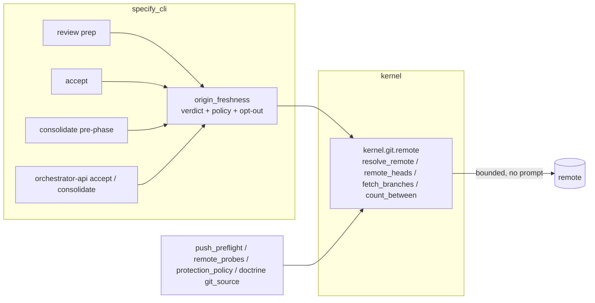

# Implementation Plan: Second clones reconcile with origin before every terminus gate

**Branch**: `claude/happy-keller-r38xig` | **Date**: 2026-10-06 | **Spec**: [spec.md](spec.md)
**Input**: Mission specification from `kitty-specs/second-clone-origin-reconciliation-01M48V8W/spec.md`

## Summary

Every evidence gate (review workspace preparation, `accept`, `consolidate`, `orchestrator-api accept-mission` / `consolidate-mission`) runs one **origin freshness check** before it trusts the clone's local branches. The ref-level "how" (resolve the branch's remote, ask the remote which branches exist, fetch them, count commits between two refs, optionally scoped to a path) is a new foundation module `kernel.git.remote`, which also becomes the only place in `src/` that runs a remote-contacting git command. The "what" (which branch carries this Mission's status evidence, which lanes are approved, what a verdict means at each gate, the operator opt-out) is one application module `specify_cli.git.origin_freshness`. Separately, `init` on an already-initialized clone and `upgrade` install the clone-local merge-driver git config through the existing `_ensure_merge_driver_git_config`. Two architectural gates close the class with empty allowlists, and an ADR amends ADR 2026-06-05-1.

## Technical Context

**Language/Version**: Python 3.11+ (repository floor; CI runs 3.11-3.13)
**Primary Dependencies**: git CLI (>= 2.25 floor, already required), typer, rich; no new third-party dependency
**Storage**: git refs only (`refs/remotes/<remote>/<branch>` written by fetch; `refs/heads/<lane>` advanced by the existing CAS `advance_branch_ref`; `refs/spec-kitty/lane-tip/<lane>` by `record_tip`); local git config for merge drivers
**Testing**: pytest; real-git fixtures (bare `file://` remote + two clones) for the regression tests and kernel tests; isolated `HOME`/`XDG_CONFIG_HOME`/`GIT_CONFIG_GLOBAL` per test (#5602); AST census tests under `tests/architectural/`
**Target Platform**: Linux, macOS, Windows 10+ (git subprocess only; no shell features)
**Project Type**: single (CLI + library)
**Performance Goals**: no-remote path adds < 200 ms per gate (NFR-003); one `ls-remote` + one `fetch` per remote per gate invocation (NFR-001)
**Constraints**: every remote contact bounded (`ls-remote` 5 s as today in `remote_probes`, `fetch` 15 s), `GIT_TERMINAL_PROMPT=0` and SSH `BatchMode=yes` (NFR-002); never moves the status evidence branch (C-002); lane moves only through `advance_branch_ref` (C-003); PR #5810 files untouched (C-007)
**Scale/Scope**: 7 terminus entry points, 4 existing remote-contact sites drained, 3 regression tests, 2 arch gates, 1 ADR

**Supply chain**: no dependency is added, upgraded or removed; DIRECTIVE_051 controls not triggered.

## Charter Check

| Principle / order | Status | Note |
|---|---|---|
| Single canonical authority | PASS | One owner of remote contact (`kernel.git.remote`) absorbs `remote_probes`' ls-remote, `push_preflight`'s fetch, `protection_policy`'s `remote show`, `doctrine.sources.git_source`'s clone/fetch, and the two #4969 ref builders; one intent module for verdict policy. |
| Architectural alignment | PASS | `kernel <- ... <- specify_cli` respected: kernel module knows refs and remotes only (C-001). |
| ATDD / red-first (SO #4, ADR 2026-07-17-1) | PLANNED | Each WP's first commit is its failing acceptance test through the real entry point; the three issue reproductions are two-clone real-git tests marked `@pytest.mark.regression`, proven red on the planning base. |
| Campsite first (SO #2) | PLANNED | Behaviour-preserving extractions land as the first commit of the WP that touches the surface (see IC map). |
| Tracer files (SO #3) | ACTIVE | `traces/` seeded; appended per WP. |
| Architectural gates (SO #5, ADR 2026-09-30-1) | PLANNED | Both gates start and close with empty allowlists, concrete floors and planted-violation self-tests. |
| Terminology canon | PASS | "evidence gate", "origin freshness check", "freshness verdict"; no "sync", no "feature". |
| No heavy suites in mission | PLANNED | Targeted files + named gate files + `make test-fast` only. |
| ADR for architecture decisions | PLANNED | New ADR `docs/adr/4.x/2026-10-06-3-evidence-gates-check-origin-freshness.md` amends ADR 2026-06-05-1 Decisions 1 and 2. |

No violations; Complexity Tracking not needed.

## Project Structure

### Documentation (this mission)

```
kitty-specs/second-clone-origin-reconciliation-01M48V8W/
├── spec.md
├── plan.md            # this file
├── research.md        # design decisions and alternatives
├── data-model.md      # verdict / policy / mode value objects
├── quickstart.md      # how to exercise the fix by hand with two clones
├── contracts/
│   ├── kernel-git-remote.md       # foundation API
│   ├── origin-freshness.md        # intent API, codes, opt-out, envelope fields
│   └── cli-surface.md             # new flags, env var, refusal text shape
├── checklists/requirements.md
├── decisions/
└── traces/
```

### Source Code (repository root)

```
src/kernel/git/
├── remote.py                        # NEW: no_prompt_env, resolve_remote, tracking_ref, remote_heads, fetch_branches, divergence, describe_remote_head, clone/fetch-for-doctrine helpers (all on run_git)
└── __init__.py                      # export + docstring: owner of path reading AND remote contact
src/specify_cli/git/
├── origin_freshness.py              # NEW: verdicts, policy, mode/env, codes, gate helpers
├── remote_probes.py                 # keeps its API; ls-remote via kernel.git.remote
└── protection_policy.py             # remote show via kernel.git.remote
src/specify_cli/consolidation/
├── executor.py                      # pre-phase calls origin_freshness (status evidence + approved lanes)
└── push_preflight.py                # fetch via kernel.git.remote; policy unchanged
src/specify_cli/cli/commands/
├── consolidate.py                   # --origin-check option threaded to the executor
├── accept.py                        # origin freshness check + --origin-check
├── agent/workflow.py                # _prepare_review_workspace prepares the lane from the remote
└── init.py                          # already-initialized path installs merge-driver config
src/specify_cli/cli/commands/upgrade.py   # finalizer installs merge-driver config, reported in UpgradeOutcome
src/specify_cli/orchestrator_api/consolidation.py  # accept-mission / consolidate-mission checks, contract 1.11.0
src/specify_cli/orchestrator_api/envelope.py       # CONTRACT_VERSION bump
src/specify_cli/workspace/context.py, lanes/implement_support.py  # #4969 ref builders use kernel.git.remote.tracking_ref
src/specify_cli/doctrine/sources/git_source.py     # clone/fetch via kernel.git.remote
tests/kernel/test_git_remote.py                     # NEW real-git unit tests
tests/specify_cli/git/test_origin_freshness.py      # NEW
tests/architectural/test_remote_contact_owner.py    # NEW census gate (FR-013)
tests/architectural/test_evidence_gates_check_origin.py  # NEW registry gate (FR-014)
tests/regressions/ (or the owning subsystem dirs)  # three two-clone regression tests (#5780, #5758, #5759)
docs/adr/4.x/2026-10-06-3-evidence-gates-check-origin-freshness.md
docs/api/environment-variables.md, docs/api/orchestrator-api.md, docs/context/orchestration.md, docs/changelog/CHANGELOG.md
```

**Structure Decision**: single project; the new code is two modules (one per layer) plus call sites. Regression tests live with the subsystem they exercise, named after behaviour, with the issue number in the marker/docstring (respecting `tests/architectural/test_issue_named_test_census.py`).

## Design



**Freshness check algorithm (one branch set, one gate invocation)**
1. Resolve the remote per FR-017 (`branch.<b>.remote` → sole remote → `origin` → none). None → `no_remote` verdicts, no contact.
2. `ls-remote --heads <remote> refs/heads/<b>...` (one contact). Failure/timeout → every branch `unreachable`.
3. For branches the remote lists, one `fetch --no-tags <remote> +refs/heads/<b>:refs/remotes/<remote>/<b> ...`. Failure → `unreachable`. Branches it does not list → `remote_missing` (concluded from the answered ls-remote only).
4. Classify local vs `refs/remotes/<remote>/<b>` with `rev-list --count`, optionally scoped `-- <path>`: `behind` = remote-only commits (scoped), `ahead` = local-only commits; `local_missing` when the local branch does not exist.

**Policy table**

| Gate | Branch class | `up_to_date` / `ahead` / `remote_missing` / `no_remote` | `behind` | `diverged` | `local_missing` (remote has it) | `unreachable` |
|---|---|---|---|---|---|---|
| consolidate, accept, orchestrator-api | status evidence (scoped to `kitty-specs/<slug>/status.events.jsonl`) | pass | refuse `ORIGIN_STATUS_STALE` | refuse `ORIGIN_STATUS_STALE` | existing `COORDINATION_WORKTREE_UNMATERIALIZED` path | refuse `ORIGIN_UNREACHABLE` |
| consolidate, orchestrator consolidate | approved code lanes (unscoped) | pass | refuse `ORIGIN_LANE_STALE` | refuse `ORIGIN_LANE_STALE` | refuse `ORIGIN_LANE_STALE` | refuse `ORIGIN_UNREACHABLE` |
| review prep | the WP's lane (unscoped) | pass | fast-forward (CAS, all checkouts clean except lock residue, no live foreign lock) else refuse | refuse `ORIGIN_LANE_DIVERGED` | create workspace from `refs/remotes/<r>/<lane>` | warn, continue |

`--origin-check warn` / `SPEC_KITTY_ORIGIN_CHECK=warn` turns every refusal above into a warning that names the verdict and the opt-out source (`flag` or `environment`). Review's fast-forward and create are not refusals and are unaffected. `accept --no-commit` / `--diagnose` (read-only) always warn.

**Remedy text**: status evidence → `git -C <evidence checkout> pull <remote> <branch>`; with a merge record present → `spec-kitty consolidate --abort`, then the pull, then `spec-kitty consolidate`. Lane at consolidate → `git fetch <remote> <lane> && git branch -f <lane> <remote>/<lane>` (or `git -C <lane worktree> merge --ff-only <remote>/<lane>` when checked out), then re-run. Diverged lane at review → inspect `git log <lane>...<remote>/<lane>`, reconcile in the lane worktree, re-run.

**Where each gate calls the check** (post-plan squad folded)
- `consolidate` (as built, post-tasks fold): ONE call, `consolidation.origin_gate.check_origin_before_status_dir(main_repo, seam, origin_check)`, right after `seam = placement_seam(...)` and BEFORE `_resolve_run_status_dir(seam)` (which can seed/commit the coordination surface) and before the lock. It selects lanes read-only (`approved_lane_branches`, `completed_wps` from the persisted record on `--resume`) and delegates the single combined contact (evidence + lanes, one ls-remote + one fetch per remote), the coordination `local_missing` pass-through and `enforce_merge_gate` to the shared `git.origin_gate.run_origin_gate`; it keeps only rendering, the merge-record footer and `typer.Exit`. Evidence branch from `seam.write_target(STATUS_STATE).ref`; path scope from `mission_dir_aliases`. `--dry-run` returns before the executor and is exempt (recorded in the registry gate).
- `accept` (CLI): one site, between `_verify_merge_commit` and `_collect_summary_or_exit`; `owned=` threaded.
- `orchestrator-api accept-mission`: before `materialize`; `MISSION_NOT_READY` + `data.preflight_error_code` + `data.origin_freshness`. `consolidate-mission`: before `_execute_lane_merge` (covers the planning-only arm); `PREFLIGHT_FAILED` + `data.preflight_error_code(s)` + `data.origin_freshness`. Contract 1.10.0 -> 1.11.0.
- review (as built, post-tasks fold): `_reconcile_review_lane` in the `review` command, right after `review_resolve_wp_and_lane_gate` and BEFORE the bulk-edit gate and `review_claim_transition`, so a refusal leaves status and lock untouched; skipped when `workspace.runs_in_checkout_root` (C-002). Fast-forward re-verifies ancestry of the ls-remote tip, refuses a live foreign review lock, then calls `advance_branch_ref(repo, lane, remote_sha, expected_old_sha=local_sha)` with NO `is_residue` and records the lane tip. A missing lane is created from `refs/remotes/<r>/<lane>` via `_prepare_review_workspace(create_from=...)`.
- `local_missing` on a non-coordination status evidence branch (e.g. a `single_branch` second clone without `kitty/mission-*`) refuses `ORIGIN_STATUS_STALE`; on a coordination branch the existing `COORDINATION_WORKTREE_UNMATERIALIZED` path applies.

**Kernel contract simplifications** (duplication lens): no `run_remote_git` (every function calls the existing `run_git(..., env=no_prompt_env(), timeout=...)`; `no_prompt_env` moves verbatim from `remote_probes`); no `count_between`; ONE `divergence(cwd, local, remote_ref, *, paths=())` using `rev-list --left-right --count local...remote [-- paths]` (`ahead` is meaningful only unscoped), which `push_preflight.inspect_target_branch_sync` also uses with byte-identical states and messages; `remote_probes.RemoteLookup` is built from `remote_heads` outcomes (its all-remotes existence semantics and per-process cache are kept and documented; the cache is never consulted for freshness).

**Residuals recorded in the ADR** (not changed by this mission): push safety and the push itself keep the literal remote `origin` (`push_preflight` default, `phase_finalize` push, `orchestrator_api/consolidation.py:170`, `consolidation/preflight.py:307`, `mission_branch_context.py:228`, `coordination/policy.py:112`, `core/git_ops.py:331`) — FR-015 keeps push safety unchanged; with a non-`origin` remote the freshness check uses FR-017 while push uses `origin` (tested). `--push` therefore refreshes the target twice (freshness + push preflight) in lanes topology; NFR-001's "once per remote" applies to the freshness check. `write_target` may itself run the #4979 `ls-remote` existence probe for a coordination branch with neither a local head nor a tracking ref (pre-existing).

**Test impact** (architecture lens): most gate fixtures are built on `tests/_support/git_template` and DO have an `origin` holding only `main`, so lane/coord branches read `remote_missing` and pass, but each gate now contacts the bare remote. Run explicitly: `tests/consolidation/test_target_branch_preflight.py`, `tests/cli/commands/test_merge_strategy.py`, `tests/cli/commands/test_merge_status_commit.py`, `tests/consolidation/test_executor_coverage.py`, `tests/integration/test_coord_single_home_workflow.py`, `tests/review/test_verdict_commit_queue.py`, `tests/coordination/test_coord_staleness.py`, and executor tests that patch `subprocess.run` with fixed call sequences (`test_ordering_bake_seam.py`, `test_mission_number_truthful_4900.py`). Regression tests share ONE bare-remote + second-clone fixture in `tests/terminus/` (next to `test_repro_4969.py`, reusing its conftest and per-test HOME isolation).

## Complexity Tracking

Not needed (no Charter Check violation).

## Implementation Concern Map

> Concerns are not work packages; `/spec-kitty.tasks` decides the slicing.

### IC-01 — Foundation: one owner of remote contact

- **Purpose**: give every remote-contacting git command one bounded, non-prompting home and one remote-resolution rule, so gates never build fetch argv themselves.
- **Relevant requirements**: FR-006, FR-013, FR-016, FR-017, NFR-001, NFR-002, C-001, C-004
- **Affected surfaces**: `src/kernel/git/remote.py` (new), `src/kernel/git/__init__.py`, `src/specify_cli/git/remote_probes.py`, `src/specify_cli/consolidation/push_preflight.py` (fetch only), `src/specify_cli/git/protection_policy.py`, `src/specify_cli/doctrine/sources/git_source.py`, `src/specify_cli/workspace/context.py`, `src/specify_cli/lanes/implement_support.py`, `tests/kernel/`, `tests/architectural/test_remote_contact_owner.py`
- **Sequencing/depends-on**: none
- **Risks**: `push_preflight` and `remote_probes` tests are mock-heavy — keep their public behaviour byte-identical; `remote_probes`' per-process cache must not outlive a fetch in the same invocation (document); git_source clone semantics (doctrine packs) must not change.

### IC-02 — Intent: freshness verdicts, policy and opt-out

- **Purpose**: one application module that answers "is this Mission's status evidence / are its approved lanes / is this review lane current?" and applies the gate policy and the opt-out.
- **Relevant requirements**: FR-001, FR-002, FR-006, FR-008, FR-009, FR-010, C-002, C-006
- **Affected surfaces**: `src/specify_cli/git/origin_freshness.py` (new), `tests/specify_cli/git/test_origin_freshness.py`
- **Sequencing/depends-on**: IC-01
- **Risks**: path-scoped `behind` must use the status log path as it appears on the evidence branch; the env value must be validated (unknown → enforce + warning).

### IC-03 — Merge-path gates (#5780)

- **Purpose**: consolidate, accept and the orchestrator-api accept/consolidate refuse on stale status evidence, stale approved lanes and unreachable remotes before any mutation.
- **Relevant requirements**: FR-001, FR-002, FR-003, FR-004, FR-008, FR-009, FR-010, FR-015, SC-001, SC-004
- **Affected surfaces**: `consolidation/executor.py`, `cli/commands/consolidate.py`, `cli/commands/accept.py`, `orchestrator_api/consolidation.py`, `orchestrator_api/envelope.py`, regression test for #5780
- **Sequencing/depends-on**: IC-02
- **Risks**: `_run_lane_based_consolidation` is C901 12 — add the call through one helper; resume path remedy text; must not touch `rollback.py` (C-007); existing consolidate tests with a configured but fake remote may now contact it — fixtures must stay valid (no remote → silent).

### IC-04 — Review workspace from the remote (#5758)

- **Purpose**: review creates, fast-forwards or refuses the lane against the remote before the workspace and the lock.
- **Relevant requirements**: FR-005, FR-010, C-003, SC-002
- **Affected surfaces**: `cli/commands/agent/workflow.py` (`_prepare_review_workspace`, campsite extraction `_create_review_worktree` first), `review/lock.py` (read-only use), `git/ref_advance.advance_branch_ref` (call only), `lanes/lane_tip.record_tip`, regression test for #5758
- **Sequencing/depends-on**: IC-02
- **Risks**: lock residue must not count as dirt; another worktree having the lane checked out is handled by `advance_branch_ref`'s own checkout scan.

### IC-05 — Clone-local merge-driver config (#5759)

- **Purpose**: `init` on an already-initialized clone and `upgrade` install the per-clone `merge.*` config idempotently.
- **Relevant requirements**: FR-011, FR-012, SC-003
- **Affected surfaces**: `cli/commands/init.py` (campsite extraction `_wire_merge_driver_best_effort` first), `cli/commands/upgrade.py` finalizer + `UpgradeOutcome`, `lanes/consolidation._ensure_merge_driver_git_config` (call only), regression test for #5759
- **Sequencing/depends-on**: none
- **Risks**: `init` is ~800 lines — helper only; upgrade outcome contract (ADR 2026-10-04-3).

### IC-06 — Closing the class: registry gate, ADR, docs

- **Purpose**: an architectural gate that fails when an evidence-gate entry point skips the freshness check; the ADR; the user/maintainer docs.
- **Relevant requirements**: FR-014, C-004, C-005, SC-005
- **Affected surfaces**: `tests/architectural/test_evidence_gates_check_origin.py`, `docs/adr/4.x/2026-10-06-1-...md`, `docs/adr/4.x/index.md`, `docs/api/environment-variables.md`, `docs/api/orchestrator-api.md`, `docs/context/orchestration.md`, `docs/changelog/CHANGELOG.md`, docs index/inventory regeneration
- **Sequencing/depends-on**: IC-03, IC-04
- **Risks**: docs freshness/index gates (`check_docs_freshness --ci`, `docs_index.py`); terminology guard.
