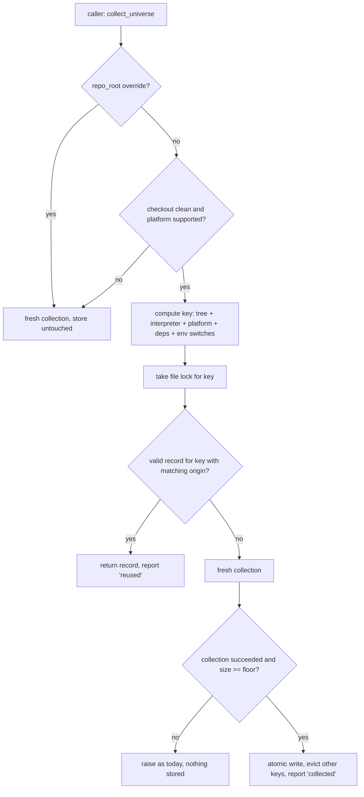

# Implementation Plan: Shared battery collection and complete shard-timing provenance

**Branch**: `issue-5559-shared-collection-and-shard-recapture` | **Date**: 2026-10-04 | **Spec**: [spec.md](spec.md)
**Input**: Mission specification from `kitty-specs/shared-collection-and-shard-recapture-01M42V58/spec.md`

## Summary

Two residues of mission `ci-runtime-stabilisation-01M3TZH6` are closed.

1. **Collection reuse.** `collect_universe()` gains a keyed on-disk store. Each per-PR job that needs the test universe runs one uncontended collection in a step before pytest starts; tests in that job read the store. The key is the committed repository tree plus the collecting environment, so no hand-kept input list exists. A job whose pre-test step succeeded but whose tests collected anyway fails the reuse evidence.
2. **Shard-timing provenance.** All 17 allowlisted modules, plus `charter`, `agent` and `consolidation`, are recaptured by the canonical producer. The mismatch allowlist and its shape tests are deleted. A provenance-completeness check is added. The scheduled recapture is generalised from `charter` to every registry module.

Branch contract: work is planned on and lands on `issue-5559-shared-collection-and-shard-recapture`; that branch is published as a pull request targeting the primary branch (`main`). The operator merges.

## Technical Context

**Language/Version**: Python 3.11 (project pin, `.python-version` 3.11.15) and 3.12 (battery legs); GitHub Actions workflow YAML
**Primary Dependencies**: pytest, pytest-xdist, `kernel.locks.machine_file_lock` (reused, not changed), `actions/cache` (pinned by SHA), existing `scripts/ci/capture_shard_timings.py` and the registry skew check in `tests/architectural/test_module_shard_registry.py`
**Storage**: one JSON record per collection key under a git-ignored directory (`.pytest_cache`-adjacent, resolved once in `_gate_coverage.py`); committed CI data in `.github/ci-shard-timings.json` and `.github/ci-module-registry.yml`
**Testing**: pytest; red-first tests for every FR; non-vacuity pins in the style of `tests/architectural/test_interpreter_shard_coverage.py` (`_collect_memo`); targeted files only, no heavy-directory runs (C-005)
**Target Platform**: Linux CI runners (ubuntu-24.04) and maintainer workstations; any other platform falls back to a fresh collection
**Project Type**: single repository; test infrastructure, CI scripts and workflows only (C-001)
**Performance Goals**: reused-path test setup ≤ 15 s (NFR-002); pre-test step ≤ 320 s first run, ≤ 15 s restored (NFR-003; both restated after the first CI run); key computation ≤ 1 s (NFR-004)
**Constraints**: fail safe to a fresh collection on any doubt (C-003); no gate weakened (C-002); no new allowlist (C-006); bin-packing unchanged (C-007); never push to the primary branch (C-008)
**Scale/Scope**: 54,723 collected tests in one universe record (about 10.7 MB as JSON); 20 registry modules (9 with provenance today); 3 consuming CI jobs; 2 workflows changed for reuse, 1 for recapture, 1 nightly check

## Charter Check

*GATE: passed before research; re-checked after design.*

| Charter rule | How the plan complies |
|---|---|
| Single canonical authority | The store lives inside `collect_universe()`, the one collection authority; no second collector. Recapture reuses the canonical producer, and shard counts stay under the existing registry skew check (C-004). The generalised recapture replaces the charter-only script rather than sitting beside it. |
| Architectural gate discipline (Standing Order 5, ADR `2026-09-30-1`) | The mismatch allowlist is deleted, not zeroed; the agreement check becomes an empty-allowlist invariant with its self-mutation proof. No new allowlist. |
| ATDD-first / red-first | Every work package opens with a failing test through the real entry point (`collect_universe()`, the recapture script's `main`, the workflow-shape tests). FR-021 reproduces the reported publish failure before fixing it. |
| Non-vacuous gates | FR-003/004/006/007/009 each pair the refusal with a same-fixture positive control. FR-011 makes a never-matching key visible. SC-007 plants a violation on both the reuse and the fresh path. |
| Campsite cleaning (Standing Order 2) | Each work package first tidies the surface it touches: `collect_universe()` is split into small helpers before the store is added; the recapture script's single-module constants are lifted before generalisation. |
| No full heavy suites in mission work | Validation names specific files. Measured captures are run by the orchestrator, serially (C-005). |
| Terminology canon | "Mission", "primary branch (`main`)", and named routing senses only. |
| No version numbers in scope | None assigned (C-009). |
| PRs only, operator merges | One pull request from the issue branch; the recapture workflow keeps its existing proposal path (C-008). |

No violations; Complexity Tracking is empty.

## Project Structure

### Documentation (this mission)

```
kitty-specs/shared-collection-and-shard-recapture-01M42V58/
├── plan.md
├── research.md
├── data-model.md
├── quickstart.md
├── contracts/
│   ├── collection-store.md
│   └── scheduled-recapture.md
├── traces/
│   ├── tooling-friction.md
│   ├── approach.md
│   └── design-decisions.md
└── evidence/            # filled during implementation (FR-022)
```

### Source Code (repository root)

```
tests/architectural/
├── _gate_coverage.py                    # collect_universe(): store, key, lock, report line
├── _universe_store.py                   # NEW: key + record I/O helpers (pure, unit-tested)
├── test_universe_store.py               # NEW: FR-001..FR-007, FR-010, FR-012 pins
├── test_module_length_agreement.py      # allowlist removed; empty-allowlist invariant
└── test_shard_capture_provenance.py     # NEW: FR-015, FR-016

scripts/ci/
├── collect_universe_prestep.py          # NEW: pre-test step entry point + summary/fallback check
├── recapture_shard_timings.py           # generalised from recapture_charter_shard_timings.py
└── capture_shard_timings.py             # unchanged producer (called, not edited)
# note: no shard-count derivation tool exists or is added; the registry skew check stays the authority

tests/ci/
├── test_collect_universe_prestep.py     # NEW
├── test_recapture_shard_timings.py      # renamed + extended from the charter-only test
└── test_ci_workflow_prestep_shape.py    # NEW: workflow-shape pins for the pre-test step

.github/workflows/
├── ci-router.yml                        # heavy battery legs: restore → pre-step → pytest → summary check
├── module-tests.yml                     # same, only for the shard that selects the consuming test
├── ci-nightly.yml                       # NFR-005 fresh-vs-stored comparison
└── ci-shard-recapture.yml               # generalised from ci-charter-shard-recapture.yml

.github/ci-shard-timings.json            # recaptured data (producer output only)
.github/ci-module-registry.yml           # shard counts (declared; validated by the existing skew check)

docs/development/reference/ci-gate-mechanics.md
docs/development/testing/testing-parallel.md
docs/changelog/CHANGELOG.md
```

**Structure Decision**: single repository, test-infrastructure layout. New helper logic goes in small pure modules (`_universe_store.py`, `collect_universe_prestep.py`) so it is unit-testable without a real collection; `_gate_coverage.py` keeps only the orchestration.

## Design



- **Key** (research D-01): `git rev-parse HEAD^{tree}`, `sys.version_info`, `sys.platform`, a digest of installed distributions, and the values of a declared environment family. Uncommitted changes (`git status --porcelain` non-empty) disable the store in both directions.
- **Record** (data-model): schema version, key, commit, tree, created-at, record count, records. A consumer rejects any record whose commit or tree differs from its own checkout, even when the file name matches.
- **Pre-test step**: `python -m scripts.ci.collect_universe_prestep collect` runs before pytest with no test workers alive. `actions/cache` restores and saves the store directory under the collection key; a restored record goes through the same verification.
- **Reuse evidence**: every `collect_universe()` call appends one JSON line to a report file. After pytest, `collect_universe_prestep check` writes the lines to the job summary and exits non-zero when the pre-test step stored a record and any test reported `collected` (FR-011).
- **Recapture**: a count-only pass finds drifted modules; each is captured in its own subprocess by the canonical producer; a time budget defers the rest; an open proposal is refreshed by an ordinary (non-forced) follow-up commit.

## Complexity Tracking

No charter violations to justify.

## Implementation Concern Map

### IC-01 — Collection key and store

- **Purpose**: give `collect_universe()` a fail-safe keyed store so a job collects once and reuses.
- **Relevant requirements**: FR-001, FR-002, FR-003, FR-004, FR-005, FR-006, FR-007, FR-012, NFR-004, C-002, C-003
- **Affected surfaces**: `tests/architectural/_gate_coverage.py`, new `tests/architectural/_universe_store.py`, new `tests/architectural/test_universe_store.py`
- **Sequencing/depends-on**: none
- **Risks**: an environment input missing from the key; xdist worker variables leaking into the key and preventing any match; a lock held across a 40–170 s collection needs a timeout above the collection timeout.

### IC-02 — Reuse reporting and the fallback check

- **Purpose**: make reuse observable and make a silent fallback a failure.
- **Relevant requirements**: FR-010, FR-011, NFR-001
- **Affected surfaces**: `tests/architectural/_gate_coverage.py` (report line), new `scripts/ci/collect_universe_prestep.py`, new `tests/ci/test_collect_universe_prestep.py`
- **Sequencing/depends-on**: IC-01
- **Risks**: report lines from parallel workers interleaving; the check being skipped when pytest fails (`if: always()` is required).

### IC-03 — Pre-test step in the consuming workflows

- **Purpose**: move the collection out of test setup in the two battery legs and the `ci` module shard, and restore it on re-runs.
- **Relevant requirements**: FR-008, FR-009, NFR-002, NFR-003, C-010
- **Affected surfaces**: `.github/workflows/ci-router.yml`, `.github/workflows/module-tests.yml`, new `tests/ci/test_ci_workflow_prestep_shape.py`, any workflow-shape gate that pins these jobs' steps
- **Sequencing/depends-on**: IC-01, IC-02
- **Risks**: existing architectural gates that parse these workflows (`_gate_coverage` reads the matrix and pytest command) may pin step shape; the module workflow is shared by every module, so the step must run only where the consuming test is selected.

### IC-04 — Nightly equivalence check

- **Purpose**: prove on every nightly run that a reused universe equals a fresh one.
- **Relevant requirements**: NFR-005, SC-007
- **Affected surfaces**: `.github/workflows/ci-nightly.yml`, `scripts/ci/collect_universe_prestep.py` (`compare` subcommand), its tests
- **Sequencing/depends-on**: IC-01, IC-02
- **Risks**: nightly lane-shape gates pinning the job list.

### IC-05 — Generalised scheduled recapture

- **Purpose**: keep every module's timings fresh without manual work.
- **Relevant requirements**: FR-017, FR-018, FR-019, FR-020, FR-021, NFR-007, C-004, C-008
- **Affected surfaces**: `scripts/ci/recapture_charter_shard_timings.py` → `scripts/ci/recapture_shard_timings.py`, `tests/ci/test_recapture_charter_shard_timings.py` → `tests/ci/test_recapture_shard_timings.py`, `.github/workflows/ci-charter-shard-recapture.yml` → `.github/workflows/ci-shard-recapture.yml`, references to the old names
- **Sequencing/depends-on**: none
- **Risks**: the existing script is deliberately single-module (one in-process pytest run per process); the fixed proposal branch never updates an open proposal today; a rename touches workflow-inventory gates and documentation.

### IC-06 — Full recapture and allowlist removal

- **Purpose**: put every module on measured data and delete the excuse mechanism.
- **Relevant requirements**: FR-013, FR-014, FR-015, FR-016, NFR-006, C-004, C-006, C-007
- **Affected surfaces**: `.github/ci-shard-timings.json`, `.github/ci-module-registry.yml`, `tests/architectural/test_module_length_agreement.py`, new `tests/architectural/test_shard_capture_provenance.py`
- **Sequencing/depends-on**: IC-05 (uses its count-only pass); the measured capture itself runs after IC-01..IC-05 have landed their tests, because they change the `ci` and architectural counts
- **Risks**: counts drift again if the branch is rebased after capture; a workstation capture feeds bin-packing with workstation durations; total serial capture time is unmeasured.

### IC-07 — Evidence, documentation and changelog

- **Purpose**: state the result from measurement and keep the references true.
- **Relevant requirements**: FR-022, FR-023, SC-001, SC-002
- **Affected surfaces**: mission `evidence/`, `docs/development/reference/ci-gate-mechanics.md`, `docs/development/testing/testing-parallel.md`, `docs/changelog/CHANGELOG.md`
- **Sequencing/depends-on**: IC-03, IC-06
- **Risks**: three per-PR runs are only available once the pull request is open; the evidence is completed after the PR's first CI runs.
