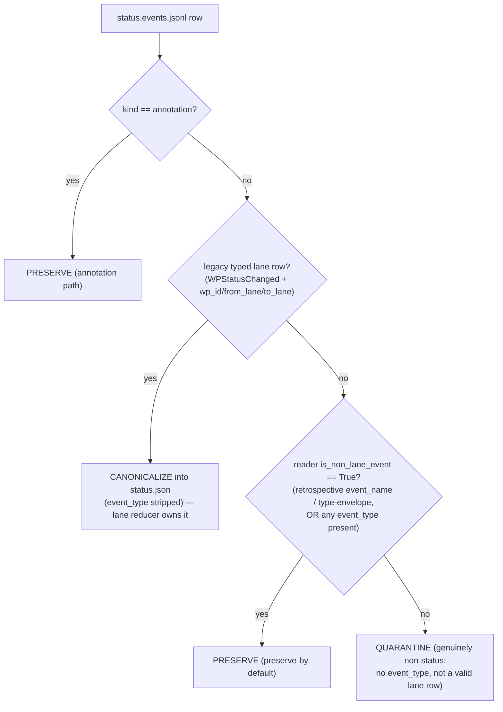

# Data Model — Silent-Write Hardening Residuals

No new persisted schema. This mission changes how three seams **classify and preserve** existing records. The model below captures the classification rule this mission makes canonical.

## 1. Status event classification (Finding A)

`status.events.jsonl` rows fall into exactly one class. The mission makes the **reader** and the **repair** agree on the class boundary.



**Classes**

| Class | Definition (post-inversion) | Repair action |
|---|---|---|
| Annotation | `kind == "annotation"` | Preserve (own branch) |
| Legacy typed lane transition | `event_type == "WPStatusChanged"` **and** top-level `wp_id`,`from_lane`,`to_lane` | Canonicalize into `status.json` (strip `event_type`) — **checked FIRST**, protects #3066 |
| Non-lane authoritative | reader `is_non_lane_event` is True: retrospective `event_name`/type-envelope, **or any `event_type` present** (lifecycle, DecisionPoint, and any future authoritative type) | **Preserve (preserve-by-default; denylist EMPTY)** |
| Genuinely non-status | no `event_type`, not a valid lane row (e.g. a stray `event_name`-only row) | Quarantine |

**Invariant (the new contract)**: for every row, `repair.preserves(row) ⇔ reader.is_non_lane_event(row)` (modulo the lane-transition passthrough, which both treat as lane, not non-lane). The fail-closed guard `_registry_authoritative_quarantine_violations` enforces the stronger form: **no `event_type`-bearing row is ever quarantined**. Carve-out preserved from #4938: a benign duplicate-`event_id` drop whose survivor remains in `canonical_rows` does not trip the guard.

**Denylist**: `EMPTY`. Represented as an explicit, named empty constant (documented) so a future prunable mirror is a deliberate, reviewed addition — not a silent default.

## 2. `catalog.mission` read path (Finding B)

**Before**: two readers over one field.

| Reader | Parser |
|---|---|
| `charter/generate.py::_read_catalog_mission_from_charter_yaml` | ruamel round-trip via `load_charter_yaml` |
| `charter_runtime/preflight/references_refresh.py::_read_catalog_mission_and_template_set` | ad-hoc `YAML(typ="safe")` |

**After**: one accessor in `charter/activation/charter_yaml_io.py`, both callers delegate.

```
read_catalog_field(repo_root, field) -> Any | None
  charter.yaml missing/absent field/malformed  -> None (via load_charter_yaml + (YAMLError, OSError, UnicodeDecodeError) guard)
  present                                       -> catalog[field]
```

Contract: identical value and identical absent-result for every caller; one parser (canonical ruamel round-trip). `read_catalog_mission(repo_root)` = `read_catalog_field(repo_root, "mission")`.

## 3. Trace block identity (Finding C)

A `traces/<category>.md` is a sequence of **blocks**, each opened by a boundary line: a markdown heading `#{1,6} …` **or** a `<!-- section:ID -->` delimiter. Fenced code (` ``` ` **or** `~~~`) inside a block must not be read as a boundary.

Two distinct keys, intentionally different:

| Key | Used by | Definition |
|---|---|---|
| Whole-block identity | `union_trace_texts` dedup | full block tuple (byte-identical) — **unchanged** |
| Base-comparison key | `_drop_stale_theirs_trace_blocks` (3-way) | `<!-- section:ID -->` id if present, else `(block[0], occurrence_ordinal)` — **new, non-colliding** |

Invariant: two sections sharing a heading get distinct base-comparison keys; a section whose body changed keeps the same base-comparison key (so `theirs_unchanged`/`ours_diverged` still detects it).
